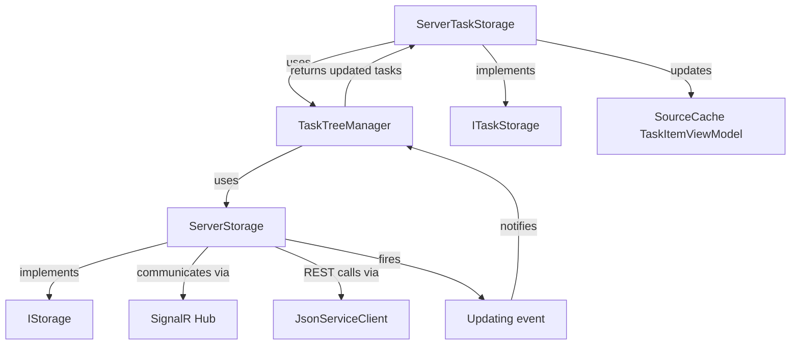

# ServerStorage Extraction Design

## Objective

Extract persistence and server communication logic from ServerTaskStorage into a dedicated ServerStorage class that implements IStorage interface, following the established separation pattern demonstrated by FileStorage and FileTaskStorage.

## Current Architecture Analysis

### Existing Pattern

The codebase demonstrates a clear separation of concerns:

- **FileStorage**: Implements IStorage, handles file system persistence operations (Save, Remove, Load, GetAll, BulkInsert)
- **FileTaskStorage**: Implements ITaskStorage, manages TaskItemViewModel cache and delegates persistence to FileStorage via TaskTreeManager

### Current Problem

ServerTaskStorage violates the single responsibility principle by implementing both IStorage and ITaskStorage interfaces, combining:
- Server communication and connection management
- Authentication and token management
- SignalR hub integration
- Task persistence operations
- View model cache management

## Design Solution

### Component Separation

Create two distinct classes following the FileStorage pattern:

| Component | Interface | Responsibility |
|-----------|-----------|----------------|
| ServerStorage | IStorage | Server communication, persistence operations, connection management, authentication |
| ServerTaskStorage | ITaskStorage | View model cache management, task tree operations delegation |

### ServerStorage Responsibilities

The new ServerStorage class will encapsulate:

1. **Connection Management**
   - SignalR HubConnection lifecycle
   - Connection state tracking (IsConnected)
   - Automatic reconnection logic
   - Connection error handling via OnConnectionError event

2. **Authentication**
   - Token-based authentication (AccessToken, RefreshToken)
   - User registration
   - Token refresh mechanism
   - Login flow with device information
   - Sign-out process

3. **Persistence Operations** (IStorage contract)
   - Save: Persist TaskItem via SignalR hub
   - Remove: Delete TaskItem by ID
   - Load: Retrieve single TaskItem by ID
   - GetAll: Enumerate all TaskItems from server
   - BulkInsert: Batch insert operations

4. **Real-time Updates**
   - SignalR message handlers registration
   - Event propagation via Updating event (TaskStorageUpdateEventArgs)
   - Handle server-initiated updates (ReceiveTaskItem, DeleteTaskItem, LogOn)

5. **State Management**
   - URL configuration
   - ServiceClient (JsonServiceClient) for REST API calls
   - ClientSettings persistence
   - Active state tracking (IsActive flag)

### ServerTaskStorage Refactored Responsibilities

After extraction, ServerTaskStorage will:

1. **View Model Management**
   - Maintain SourceCache of TaskItemViewModel instances
   - Synchronize cache with underlying storage updates

2. **Delegation Pattern**
   - Delegate all persistence operations to ServerStorage via TaskTreeManager
   - Handle TaskTreeManager responses (updated task lists)
   - Update cache based on storage notifications

3. **Task Operations** (ITaskStorage contract)
   - Add, AddChild, Delete, Update operations
   - Clone, CopyInto, MoveInto operations
   - Block, Unblock operations
   - Parent-child relationship management

### Dependency Flow

## Data and State Management

### ServerStorage State

| State Element | Type | Purpose |
|---------------|------|---------|
| Url | string | Server endpoint URL |
| serviceClient | IJsonServiceClient | HTTP client for REST API calls |
| connection | HubConnection | SignalR connection instance |
| hub | IChatHub | Typed SignalR hub proxy |
| settings | ClientSettings | Authentication tokens and user info |
| configuration | IConfiguration | Configuration provider |
| mapper | IMapper | AutoMapper instance for DTO mapping |
| IsActive | bool | Flag controlling retry loops |
| IsConnected | bool | Current connection state |
| IsSignedIn | bool | Authentication state |
| connectGate | SemaphoreSlim | Concurrency control for Connect |
| connectCts | CancellationTokenSource | Connection timeout cancellation |

### ServerStorage Events

| Event | Type | When Raised |
|-------|------|-------------|
| Updating | EventHandler&lt;TaskStorageUpdateEventArgs&gt; | When server notifies of task changes |
| OnConnectionError | Action&lt;Exception?&gt; | On connection errors or exceptions |
| OnConnected | Action | When connection established successfully |
| OnDisconnected | Action | When connection permanently lost |
| OnSignIn | EventHandler | When user successfully authenticates |
| OnSignOut | EventHandler | When user signs out |

### Constructor Parameters

ServerStorage will accept:
- url (string): Server endpoint URL
- Optional: watcher flag (bool) to enable/disable real-time updates (for consistency with FileStorage pattern)

## Behavior Specifications

### Connection Lifecycle

1. **Connect Sequence**
   - Acquire connection gate (thread-safe)
   - Check existing connection state
   - Dispose stale connections
   - Build new HubConnection with SSL validation
   - Register SignalR message handlers
   - Create typed hub proxy (IChatHub)
   - Start connection with timeout
   - Authenticate (token refresh if needed, or password login)
   - Login with device information
   - Raise OnConnected event on success

2. **Reconnection Logic**
   - On connection closed, invoke OnConnectionError
   - Retry with exponential backoff (2-6 seconds random delay)
   - Continue while IsActive is true
   - Raise OnConnected when reconnected
   - Raise OnDisconnected if IsActive becomes false

3. **Disconnect Sequence**
   - Set IsActive, IsSignedIn, IsConnected to false
   - Clear bearer token
   - Unsubscribe from Closed event
   - Stop and dispose HubConnection
   - Clear connection and hub references
   - Clear tokens in settings
   - Persist updated settings
   - Raise OnSignOut event

### Authentication Flow

1. **Token Refresh**
   - Check token expiration (ExpireTime < DateTimeOffset.Now)
   - Set RefreshToken as bearer token
   - Call PostRefreshToken endpoint
   - Update AccessToken, RefreshToken, ExpireTime
   - Persist settings
   - Re-login with new token

2. **Password Authentication**
   - Retrieve credentials from TaskStorageSettings
   - Call AuthViaPassword endpoint
   - Store AccessToken and RefreshToken
   - Set bearer token on serviceClient
   - Persist settings

3. **User Registration**
   - Retrieve credentials from configuration
   - Validate login and password not empty
   - Call RegisterNewUser endpoint
   - Store tokens and login
   - Persist settings
   - Initiate connection

### SignalR Message Handlers

| Message Type | Handler Behavior |
|--------------|------------------|
| LogOn | Handle authentication status (Ok, ErrorUserNotFound, ErrorExpiredToken); trigger registration or token refresh as needed; update user info in settings |
| ReceiveTaskItem | Map to TaskItem; raise Updating event with Saved type |
| DeleteTaskItem | Raise Updating event with Removed type and task ID |

### Persistence Operations

| Operation | Behavior |
|-----------|----------|
| Save | Map TaskItem to TaskItemHubMold; call hub.SaveTask; update TaskItem.Id with returned value; retry while IsActive on failure |
| Remove | Call hub.DeleteTasks with single item ID; retry while IsActive on failure |
| Load | Call serviceClient.GetAsync(GetTask); map response to TaskItem; return null on error |
| GetAll | Call serviceClient.GetAsync(GetAllTasks); yield return mapped TaskItems from response |
| BulkInsert | Map TaskItems to TaskItemMold list; call serviceClient.PostAsync(BulkInsertTasks) |

## Integration Points

### TaskTreeManager Integration

ServerTaskStorage will instantiate TaskTreeManager with ServerStorage instance:
- TaskTreeManager constructor receives IStorage implementation
- All persistence operations routed through TaskTreeManager
- TaskTreeManager returns lists of affected TaskItems
- ServerTaskStorage updates cache for each affected task

### Event Handling

ServerTaskStorage will subscribe to ServerStorage.Updating event:
- On UpdateType.Saved: Load task from storage, update or add to cache
- On UpdateType.Removed: Remove from cache by ID

### Configuration Dependencies

ServerStorage requires:
- IConfiguration service from Locator.Current
- IMapper service from Locator.Current
- ClientSettings section in configuration
- TaskStorageSettings section in configuration

## Migration Considerations

### Backward Compatibility

The refactoring maintains interface contracts:
- IStorage remains unchanged
- ITaskStorage remains unchanged
- External consumers of ServerTaskStorage see no breaking changes

### Instantiation Pattern

Similar to FileTaskStorage pattern:
- Create ServerStorage instance with URL
- Create TaskTreeManager with ServerStorage
- Create ServerTaskStorage with TaskTreeManager

### State Transfer

All connection and authentication state moves from ServerTaskStorage to ServerStorage:
- IsConnected, IsSignedIn, IsActive flags
- OnConnected, OnDisconnected, OnConnectionError events
- OnSignIn, OnSignOut events
- SignOut, Disconnect methods

## Error Handling Strategy

### Connection Errors

- All exceptions during connection propagated via OnConnectionError event
- Automatic retry mechanism with random backoff
- Graceful degradation when IsActive set to false

### Authentication Errors

| Error Type | Handling Strategy |
|------------|-------------------|
| UserNotFound | Trigger user registration flow |
| ExpiredToken | Trigger token refresh flow |
| Registration failure | Invoke OnConnectionError, no further action |
| Refresh failure | Sign out user, invoke OnConnectionError |

### Persistence Errors

- Save/Remove operations retry while IsActive is true
- Exceptions wrapped and re-thrown after all retry attempts
- Load/GetAll operations return null or empty on failure

## File Structure

New file to create:
- ServerStorage.cs (in Unlimotion project, same namespace as FileStorage)

Files to modify:
- ServerTaskStorage.cs (remove IStorage implementation, remove connection/auth logic)

## Non-Goals

This design explicitly does NOT include:
- Changes to IStorage or ITaskStorage interfaces
- Modifications to TaskTreeManager
- Changes to SignalR hub contracts or server-side logic
- Alterations to FileStorage or FileTaskStorage implementations
- UI or view model layer changes beyond ServerTaskStorage refactoring
