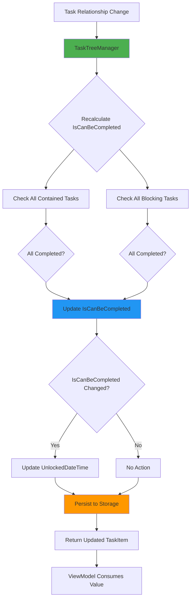
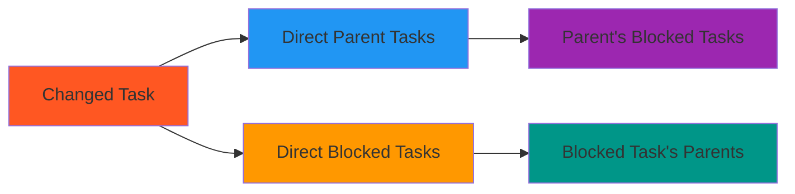
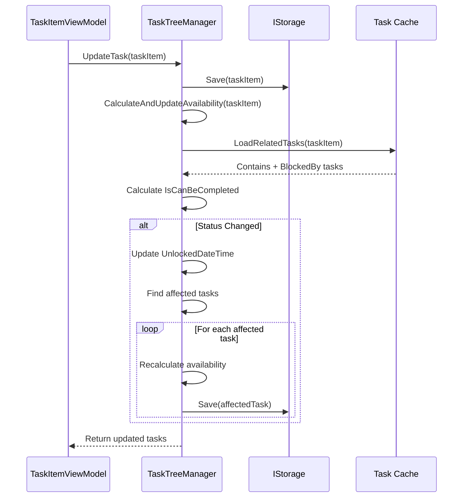
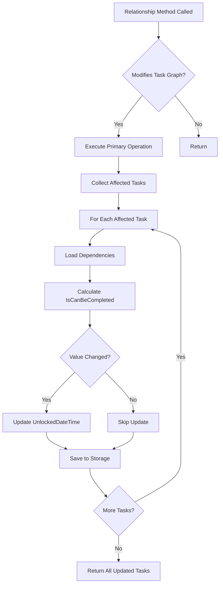
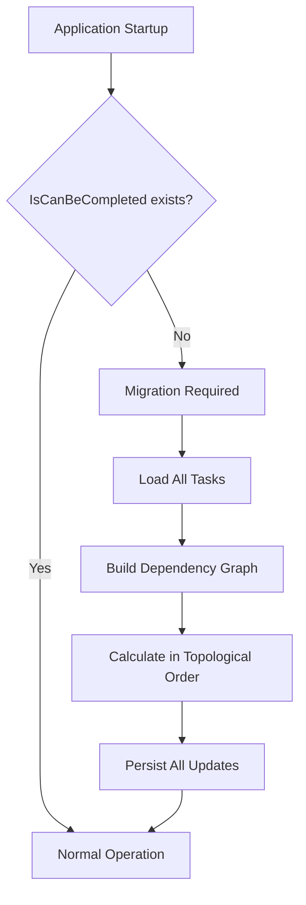

# Task Availability Logic Extraction to TaskTreeManager Layer

## Overview

This design addresses the architectural improvement of extracting task completion availability logic (`IsCanBeCompleted`) from the presentation layer (TaskItemViewModel) to the domain business logic layer (TaskTreeManager). Currently, the calculation of whether a task can be completed is performed reactively in the ViewModel layer using RxUI observables. This creates tight coupling between presentation concerns and business rules, making the logic difficult to reuse, test, and maintain.

### Current State

The `IsCanBeCompleted` property is calculated in `TaskItemViewModel` through reactive subscriptions that monitor:
- All contained tasks completion status (`NotHaveUncompletedContains`)
- All blocking tasks completion status (`NotHaveUncompletedBlockedBy`)

The logic automatically updates `UnlockedDateTime` when availability changes.

### Design Goals

- **Separation of Concerns**: Move business logic out of the ViewModel layer
- **Reusability**: Enable server-side, API, and bot components to use the same logic
- **Testability**: Simplify unit testing by removing reactive dependencies
- **Consistency**: Ensure all application layers use identical availability rules
- **Maintainability**: Centralize the logic in a single authoritative location

## Architecture

### Responsibility Distribution

| Layer | Current Responsibilities | Proposed Responsibilities |
|-------|-------------------------|---------------------------|
| **Domain** (`TaskItem`) | Data structure only | Data structure + `IsCanBeCompleted` property storage |
| **TaskTreeManager** | Relationship management | Relationship management + availability calculation + `UnlockedDateTime` management |
| **ViewModel** (`TaskItemViewModel`) | Reactive UI logic + availability calculation | Reactive UI logic only (consumes pre-calculated value) |

### Calculation Logic Location

## Data Model Changes

### TaskItem Domain Model

The `TaskItem` class should include the `IsCanBeCompleted` property as a persisted field rather than a calculated property:

| Property | Type | Description | Calculated | Persisted |
|----------|------|-------------|------------|-----------|
| `IsCanBeCompleted` | `bool` | Indicates if task can be completed | Yes (in TaskTreeManager) | Yes |
| `UnlockedDateTime` | `DateTimeOffset?` | Timestamp when task became available | No (managed by TaskTreeManager) | Yes |

**Rationale**: Storing the calculated value enables:
- Efficient querying and filtering without runtime calculation
- Historical tracking of availability changes
- Consistency across application restarts
- Server-side availability checks without loading all dependencies

## Task Availability Calculation Algorithm

### Business Rules

A task can be completed when:

1. **All contained tasks are completed**
   - Condition: `ContainsTasks.All(taskId => GetTask(taskId).IsCompleted != false)`
   - Empty collection evaluates to `true`

2. **All blocking tasks are completed**
   - Condition: `BlockedByTasks.All(taskId => GetTask(taskId).IsCompleted != false)`
   - Empty collection evaluates to `true`

3. **Result**: `IsCanBeCompleted = condition1 AND condition2`

### Completion State Logic

| IsCompleted Value | Meaning | Counted as Uncompleted |
|-------------------|---------|------------------------|
| `false` | Active/in-progress | Yes |
| `true` | Completed | No |
| `null` | Archived | No |

**Note**: Archived tasks (`null`) are treated as completed for blocking purposes.

### UnlockedDateTime Management

| Event | IsCanBeCompleted Before | IsCanBeCompleted After | UnlockedDateTime Action |
|-------|------------------------|------------------------|-------------------------|
| Task becomes available | `false` | `true` | Set to current UTC time |
| Task becomes blocked | `true` | `false` | Clear to `null` |
| No change | `true` | `true` | No action |
| No change | `false` | `false` | No action |

## TaskTreeManager Interface Extension

### New Method

| Method | Parameters | Returns | Description |
|--------|------------|---------|-------------|
| `CalculateAndUpdateAvailability` | `TaskItem task` | `Task<List<TaskItem>>` | Calculates `IsCanBeCompleted` for the given task and all affected related tasks, updates their state, and returns all modified tasks |

### Affected Tasks Propagation

When a task's completion status changes, availability must be recalculated for:

**Propagation Rules**:

| Relationship Type | Direction | Reason |
|-------------------|-----------|--------|
| Contains → Parent | Upward | Parent availability depends on all children |
| BlockedBy → Blocked | One-way | Only the blocked task's availability changes |
| Parent → Parent's Blocked | Cascade | Parent's status affects its blocked tasks |

**Important Note**: When a blocking relationship is created or broken, only the **blocked task** requires recalculation. The **blocking task** availability is unaffected because blocking other tasks doesn't change its own dependencies.

### Calculation Flow

## Integration Points

### TaskTreeManager Methods Requiring Recalculation

The following existing methods must trigger availability recalculation:

| Method | Trigger Condition | Affected Tasks |
|--------|-------------------|----------------|
| `AddChildTask` | Always | Parent task |
| `CreateBlockingBlockedByRelation` | Always | Blocked task only |
| `BreakParentChildRelation` | Always | Parent task |
| `BreakBlockingBlockedByRelation` | Always | Blocked task only |
| `DeleteTask` | Always | All parents + all blocked tasks |
| `UpdateTask` | If `IsCompleted` changed | Task + parents + blocked tasks |

### Calculation Trigger Strategy

## ViewModel Layer Adaptation

### TaskItemViewModel Changes

| Current Behavior | New Behavior |
|------------------|--------------|
| Reactive calculation of `IsCanBeCompleted` via observables | Direct binding to `TaskItem.IsCanBeCompleted` property |
| Automatic `UnlockedDateTime` management in ViewModel | Read-only consumption of pre-calculated value |
| Subscriptions to `ContainsTasks` and `BlockedByTasks` changes | Removed (no longer needed) |

### Removed Reactive Subscriptions

The following reactive logic should be removed from `TaskItemViewModel.Init()`:

- `NotHaveUncompletedContains` calculation and subscription
- `NotHaveUncompletedBlockedBy` calculation and subscription
- `IsCanBeCompleted` calculation subscription
- `UnlockedDateTime` auto-update logic

### Simplified Property

| Property | Type | Access | Source |
|----------|------|--------|--------|
| `IsCanBeCompleted` | `bool` | Read-only | Direct binding to `Model.IsCanBeCompleted` |

**Implementation Note**: The property should be a simple getter that returns the value from the underlying `TaskItem` model.

## Testing Strategy

### Unit Tests for TaskTreeManager

| Test Case | Setup | Expected Result |
|-----------|-------|-----------------|
| Task with no dependencies | Empty `ContainsTasks`, empty `BlockedByTasks` | `IsCanBeCompleted = true` |
| Task with completed child | Child with `IsCompleted = true` | `IsCanBeCompleted = true` |
| Task with incomplete child | Child with `IsCompleted = false` | `IsCanBeCompleted = false` |
| Task with archived child | Child with `IsCompleted = null` | `IsCanBeCompleted = true` |
| Task with completed blocker | Blocker with `IsCompleted = true` | `IsCanBeCompleted = true` |
| Task with incomplete blocker | Blocker with `IsCompleted = false` | `IsCanBeCompleted = false` |
| Task with mixed dependencies | Some completed, some incomplete | `IsCanBeCompleted = false` |
| Completion triggers propagation | Mark child complete | Parent `IsCanBeCompleted` updated |
| UnlockedDateTime set on unlock | Task becomes available | `UnlockedDateTime != null` |
| UnlockedDateTime cleared on block | Task becomes blocked | `UnlockedDateTime == null` |

## Migration Considerations

### Data Migration

**Existing Data Impact**:
- All existing `TaskItem` records lack the `IsCanBeCompleted` field
- On first load, the system must calculate and persist this value for all tasks

**Migration Strategy**:

### Rollback Strategy

| Concern | Mitigation |
|---------|------------|
| Backward compatibility | ViewModel can gracefully handle missing `IsCanBeCompleted` field |
| Data integrity | Calculation is deterministic and can be re-run |
| Version mismatch | Client-side fallback to local reactive calculation if field is missing |

## Performance Considerations

### Optimization Techniques

| Concern | Solution |
|---------|----------|
| Redundant recalculation | Cache loaded tasks during operation batch |
| Deep dependency chains | Limit recalculation depth or use topological sorting |
| Frequent updates | Batch availability updates for multiple relationship changes |
| Storage I/O overhead | Group saves into single transaction where possible |

### Complexity Analysis

| Operation | Current Complexity | New Complexity | Notes |
|-----------|-------------------|----------------|-------|
| Task creation | O(1) | O(D) | D = number of dependencies to check |
| Completion toggle | O(1) | O(P + B) | P = parents, B = blocked tasks |
| Relationship change | O(1) | O(1) + recalculation | Recalculation is async |
| UI rendering | O(N) reactive | O(1) lookup | N = dependency count |

**Net Impact**: Slightly higher computational cost on write operations, significantly improved read performance for UI.

## Affected Components

### Direct Impact

| Component | Impact | Change Type |
|-----------|--------|-------------|
| `TaskTreeManager.cs` | High | New calculation methods, integration into existing operations |
| `ITaskTreeManager.cs` | Medium | New method signature |
| `TaskItem.cs` | Low | Add `IsCanBeCompleted` property |
| `TaskItemViewModel.cs` | High | Remove reactive calculation logic |

### Indirect Impact

| Component | Impact | Change Type |
|-----------|--------|-------------|
| `FileTaskStorage.cs` | Low | Persist new property |
| `ServerTaskStorage.cs` | Low | Persist new property |
| `UnlockedTimeFilter.cs` | None | Continues to use `IsCanBeCompleted` property |
| `SortDefinition.cs` | None | Continues to use `IsCanBeCompleted` property |
| Telegram Bot | Positive | Can now access availability without reactive logic |

## Error Handling

### Failure Scenarios

| Scenario | Detection | Recovery |
|----------|-----------|----------|
| Circular dependency | Topological sort failure | Log error, skip recalculation |
| Missing dependency task | Load operation returns null | Treat as completed (defensive) |
| Storage failure during update | Exception during save | Retry with Polly policy |
| Concurrent modification | Version mismatch | Reload and recalculate |

### Defensive Programming

**Principles**:
- If a dependency cannot be loaded, assume it is completed (optimistic approach)
- Always validate relationship consistency before calculation
- Log calculation failures without blocking primary operations
- Provide fallback to reactive calculation in ViewModel if server calculation fails
