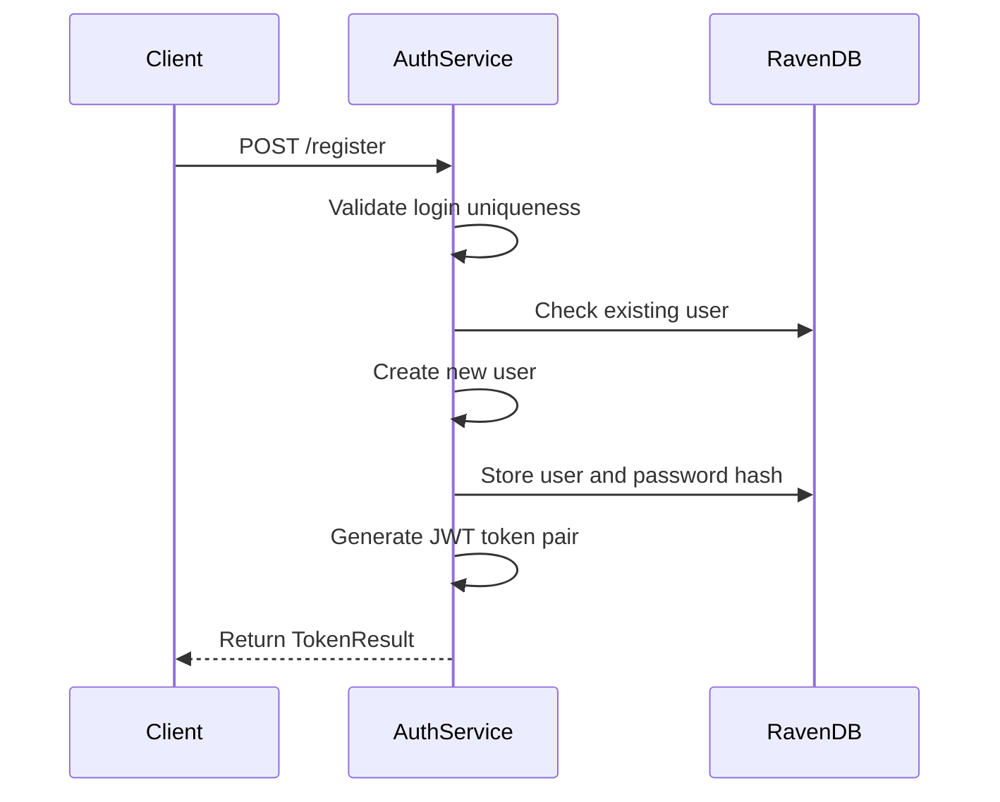
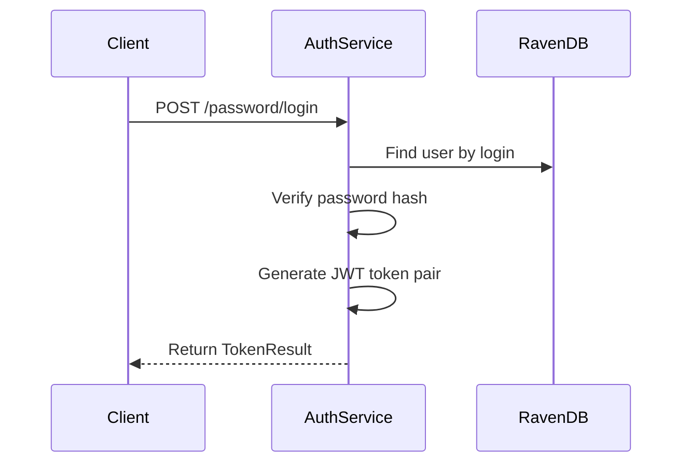
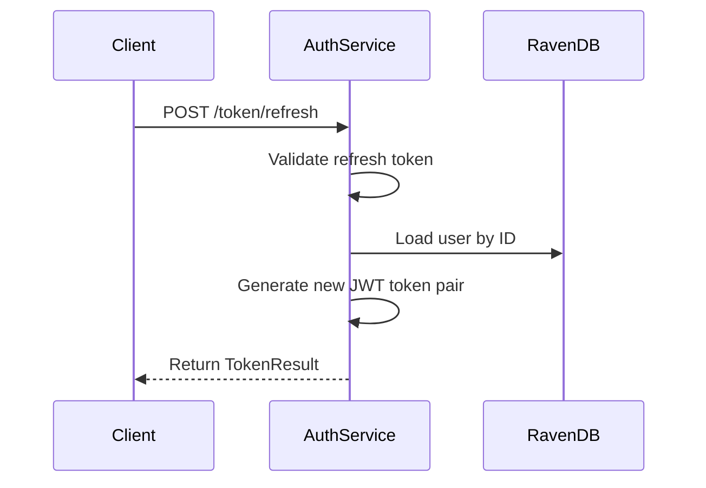
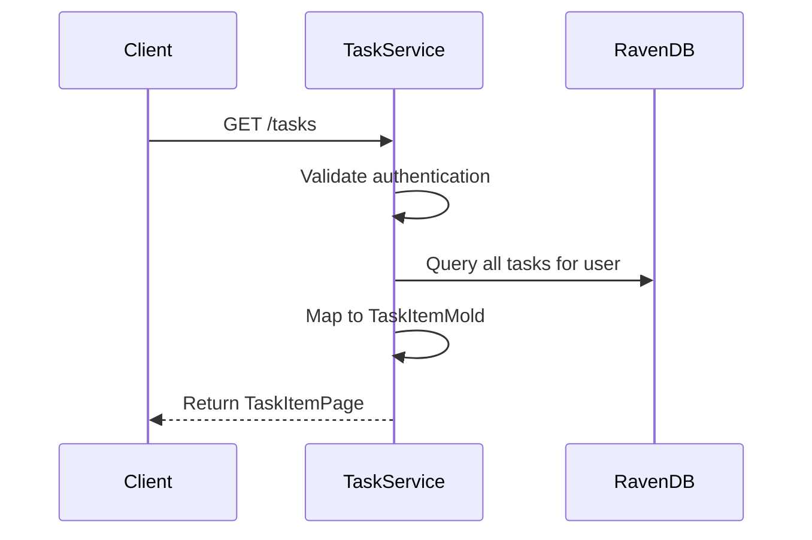
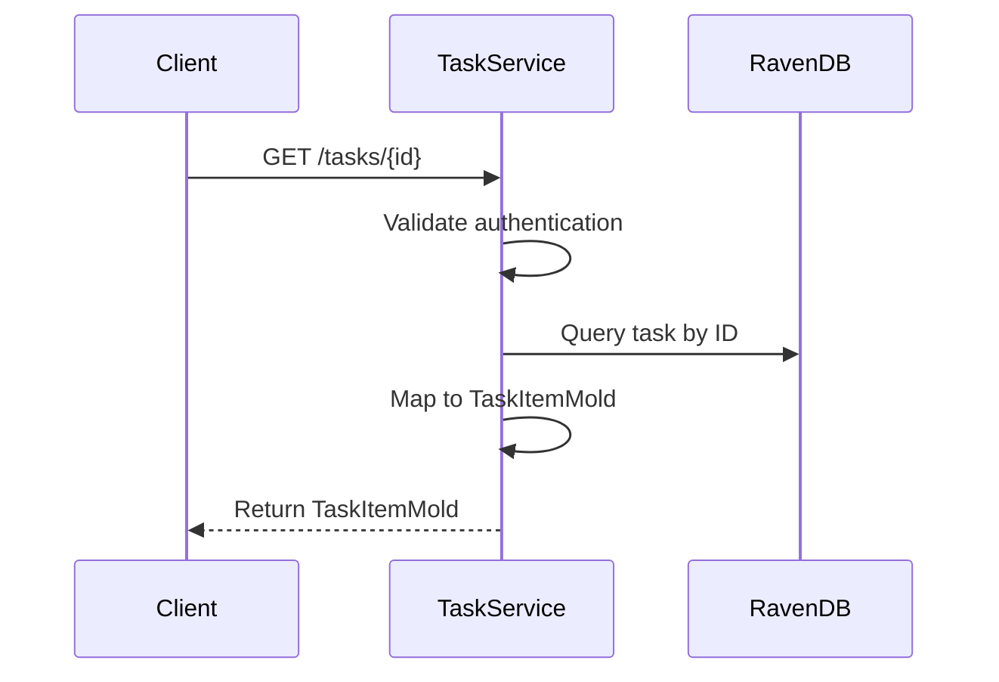
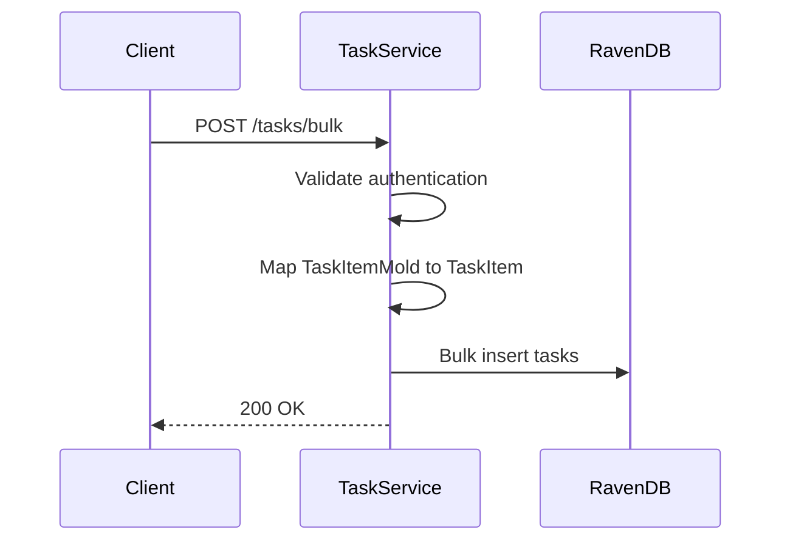
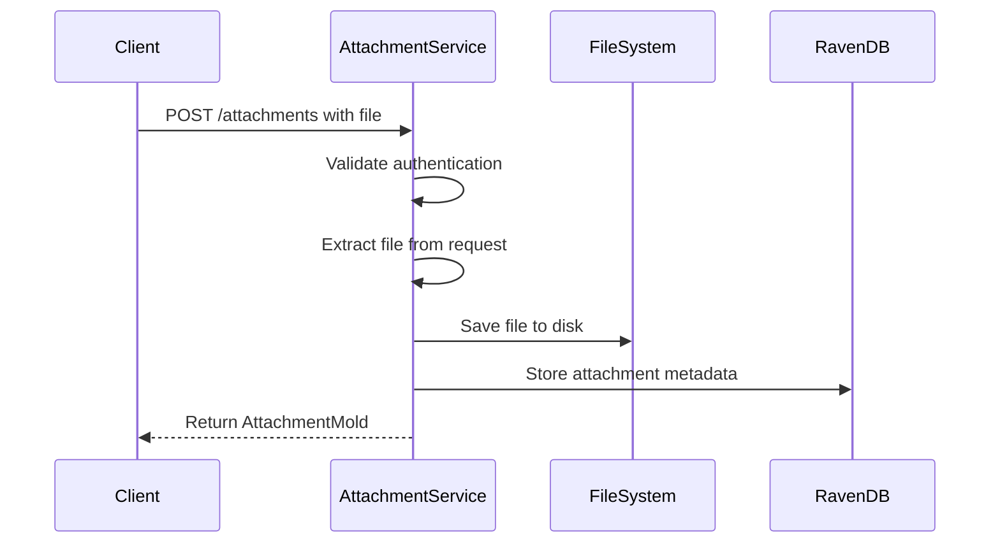
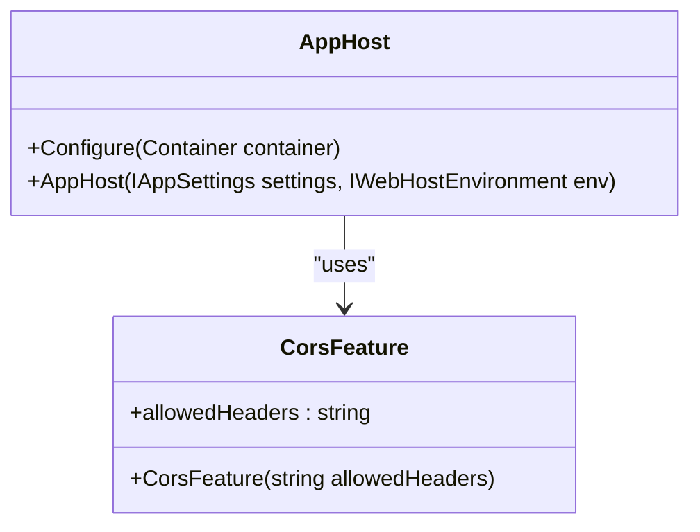
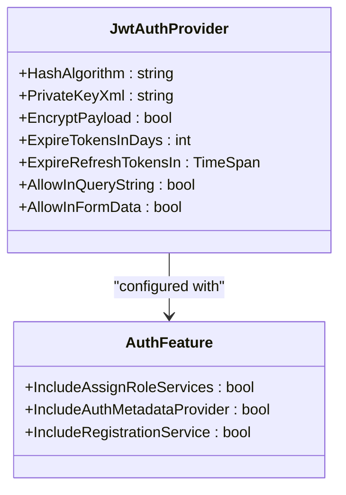
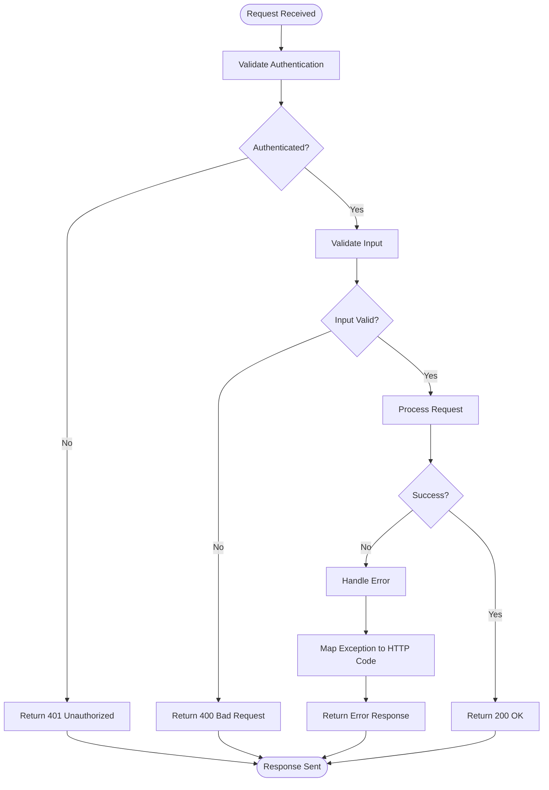

# API Reference

<cite>
**Referenced Files in This Document**   
- [AppHost.cs](file://src/Unlimotion.Server/AppHost.cs)
- [AuthService.cs](file://src/Unlimotion.Server.ServiceInterface/AuthService.cs)
- [Auth.cs](file://src/Unlimotion.Server.ServiceModel/Auth.cs)
- [TaskService.cs](file://src/Unlimotion.Server.ServiceInterface/TaskService.cs)
- [Task.cs](file://src/Unlimotion.Server.ServiceModel/Task.cs)
- [ProfileService.cs](file://src/Unlimotion.Server.ServiceInterface/ProfileService.cs)
- [Profile.cs](file://src/Unlimotion.Server.ServiceModel/Profile.cs)
- [AttachmentService.cs](file://src/Unlimotion.Server.ServiceInterface/AttachmentService.cs)
- [Attachment.cs](file://src/Unlimotion.Server.ServiceModel/Attachment.cs)
- [appsettings.json](file://src/Unlimotion.Server/appsettings.json)
- [Startup.cs](file://src/Unlimotion.Server/Startup.cs)
- [TokenResult.cs](file://src/Unlimotion.Server.ServiceModel.Molds/TokenResult.cs)
- [MyUserProfileMold.cs](file://src/Unlimotion.Server.ServiceModel.Molds/MyUserProfileMold.cs)
- [UserProfileMold.cs](file://src/Unlimotion.Server.ServiceModel.Molds/UserProfileMold.cs)
- [TaskItemPage.cs](file://src/Unlimotion.Server.ServiceModel.Molds.Tasks/TaskItemPage.cs)
- [TaskItemMold.cs](file://src/Unlimotion.Server.ServiceModel.Molds.Tasks/TaskItemMold.cs)
- [AttachmentMold.cs](file://src/Unlimotion.Server.ServiceModel.Molds.Attachment/AttachmentMold.cs)
</cite>

## Table of Contents
1. [Introduction](#introduction)
2. [Authentication Endpoints](#authentication-endpoints)
3. [Task Operations](#task-operations)
4. [User Profile Management](#user-profile-management)
5. [File Attachment Endpoints](#file-attachment-endpoints)
6. [AppHost Configuration](#apphost-configuration)
7. [Security Considerations](#security-considerations)
8. [Error Handling](#error-handling)
9. [Client Implementation Guidelines](#client-implementation-guidelines)
10. [Performance Optimization Tips](#performance-optimization-tips)

## Introduction
The Unlimotion server provides a RESTful API built on ServiceStack for task management, user authentication, and profile management. The API uses JWT (JSON Web Tokens) for authentication and authorization, with encrypted tokens for enhanced security. All endpoints follow consistent patterns for request/response handling and error reporting.

The API is organized into logical groups including authentication, task operations, user profile management, and file attachments. Each endpoint is documented with HTTP methods, URL patterns, request/response schemas, and authentication requirements.

**Section sources**
- [AppHost.cs](file://src/Unlimotion.Server/AppHost.cs#L1-L121)
- [Auth.cs](file://src/Unlimotion.Server.ServiceModel/Auth.cs#L1-L77)

## Authentication Endpoints

### Register New User
Creates a new user account and returns a JWT token pair.

**HTTP Method**: POST  
**URL**: `/register`  
**Authentication**: None  
**Request Schema**:
- `Login` (string, required): User login/username
- `Password` (string, required): User password
- `UserName` (string, optional): Display name for the user

**Response Schema**: `TokenResult` containing:
- `AccessToken`: Encrypted JWT access token
- `RefreshToken`: Encrypted JWT refresh token
- `ExpireTime`: Expiration time for the access token

**Success Response**: 200 OK  
**Error Responses**:
- 400 Bad Request: User with this login already exists or password is empty
- 503 Service Unavailable: Authorization service is not working

**Diagram sources**
- [AuthService.cs](file://src/Unlimotion.Server.ServiceInterface/AuthService.cs#L20-L45)
- [Auth.cs](file://src/Unlimotion.Server.ServiceModel/Auth.cs#L67-L77)

### Login with Password
Authenticates a user with login and password, returning a JWT token pair.

**HTTP Method**: POST  
**URL**: `/password/login`  
**Authentication**: None  
**Request Schema**:
- `Login` (string, required): User login
- `Password` (string, required): User password
- `AccessTokenExpirationPeriod` (long, optional): Custom access token expiration in seconds
- `RefreshTokenExpirationPeriod` (long, optional): Custom refresh token expiration in seconds

**Response Schema**: `TokenResult` (same as register endpoint)

**Success Response**: 200 OK  
**Error Responses**:
- 404 Not Found: User not found or incorrect password
- 400 Bad Request: Invalid request format

**Diagram sources**
- [AuthService.cs](file://src/Unlimotion.Server.ServiceInterface/AuthService.cs#L47-L78)
- [Auth.cs](file://src/Unlimotion.Server.ServiceModel/Auth.cs#L10-L23)

### Refresh Token
Obtains a new JWT token pair using a refresh token.

**HTTP Method**: POST  
**URL**: `/token/refresh`  
**Authentication**: JWT (Refresh Token)  
**Request Schema**:
- `AccessTokenExpirationPeriod` (long, optional): Custom access token expiration
- `RefreshTokenExpirationPeriod` (long, optional): Custom refresh token expiration

**Response Schema**: `TokenResult`

**Success Response**: 200 OK  
**Error Responses**:
- 401 Unauthorized: Invalid or expired refresh token
- 404 Not Found: User not found
- 409 Conflict: Roles not set

**Diagram sources**
- [AuthService.cs](file://src/Unlimotion.Server.ServiceInterface/AuthService.cs#L80-L108)
- [Auth.cs](file://src/Unlimotion.Server.ServiceModel/Auth.cs#L33-L46)

### Set Password
Sets a password for a user who doesn't have one.

**HTTP Method**: POST  
**URL**: `/password`  
**Authentication**: JWT (Valid Session)  
**Request Schema**:
- `NewPassword` (string, required): The new password

**Response Schema**: `PasswordChangeResult` containing:
- `Result`: Enum indicating password change status (Created, Updated, etc.)

**Success Response**: 200 OK  
**Error Responses**:
- 401 Unauthorized: User not authenticated
- 404 Not Found: User not found
- 409 Conflict: Password already set

**Section sources**
- [AuthService.cs](file://src/Unlimotion.Server.ServiceInterface/AuthService.cs#L110-L138)
- [Auth.cs](file://src/Unlimotion.Server.ServiceModel/Auth.cs#L25-L31)

### Get My Profile
Retrieves the authenticated user's profile information.

**HTTP Method**: GET  
**URL**: `/me`  
**Authentication**: JWT (Valid Session)  
**Request Schema**: None  
**Response Schema**: `MyUserProfileMold` containing:
- `Id`: User ID
- `Login`: User login
- `DisplayName`: User display name
- `IsPasswordSetted`: Boolean indicating if password is set

**Success Response**: 200 OK  
**Error Responses**:
- 401 Unauthorized: Invalid or missing token
- 404 Not Found: User not found

**Section sources**
- [AuthService.cs](file://src/Unlimotion.Server.ServiceInterface/AuthService.cs#L140-L164)
- [Auth.cs](file://src/Unlimotion.Server.ServiceModel/Auth.cs#L48-L54)

## Task Operations

### Get All Tasks
Retrieves all tasks for the authenticated user.

**HTTP Method**: GET  
**URL**: `/tasks`  
**Authentication**: JWT (Valid Session)  
**Request Schema**: None  
**Response Schema**: `TaskItemPage` containing:
- `Tasks`: Array of `TaskItemMold` objects

**Success Response**: 200 OK  
**Error Responses**:
- 400 Bad Request: Invalid request format

**Diagram sources**
- [TaskService.cs](file://src/Unlimotion.Server.ServiceInterface/TaskService.cs#L15-L25)
- [Task.cs](file://src/Unlimotion.Server.ServiceModel/Task.cs#L24-L30)

### Get Task by ID
Retrieves a specific task by its ID.

**HTTP Method**: GET  
**URL**: `/tasks/{Id}`  
**Authentication**: JWT (Valid Session)  
**Request Schema**:
- `Id` (string, required): URL-encoded task ID

**Response Schema**: `TaskItemMold` containing task details

**Success Response**: 200 OK  
**Error Responses**:
- 400 Bad Request: Invalid request format
- 404 Not Found: Task not found

**Diagram sources**
- [TaskService.cs](file://src/Unlimotion.Server.ServiceInterface/TaskService.cs#L27-L40)
- [Task.cs](file://src/Unlimotion.Server.ServiceModel/Task.cs#L11-L19)

### Bulk Insert Tasks
Creates multiple tasks in a single request.

**HTTP Method**: POST  
**URL**: `/tasks/bulk`  
**Authentication**: JWT (Valid Session)  
**Request Schema**:
- `Tasks` (array, required): Array of `TaskItemMold` objects to create

**Response Schema**: None (200 OK on success)  
**Success Response**: 200 OK  
**Error Responses**:
- 400 Bad Request: Invalid request format

**Diagram sources**
- [TaskService.cs](file://src/Unlimotion.Server.ServiceInterface/TaskService.cs#L42-L70)
- [Task.cs](file://src/Unlimotion.Server.ServiceModel/Task.cs#L32-L44)

## User Profile Management

### Get User Profile
Retrieves a specific user's profile by user ID.

**HTTP Method**: GET  
**URL**: `/getprofile`  
**Authentication**: JWT (Valid Session)  
**Request Schema**:
- `UserId` (string, required): The ID of the user to retrieve

**Response Schema**: `UserProfileMold` containing:
- `Id`: User ID
- `Login`: User login
- `DisplayName`: User display name
- `AboutMe`: User bio/description

**Success Response**: 200 OK  
**Error Responses**:
- 400 Bad Request: Invalid request format

**Section sources**
- [ProfileService.cs](file://src/Unlimotion.Server.ServiceInterface/ProfileService.cs#L12-L22)
- [Profile.cs](file://src/Unlimotion.Server.ServiceModel/Profile.cs#L9-L17)

### Set User Profile
Updates the authenticated user's profile information.

**HTTP Method**: POST  
**URL**: `/setprofile`  
**Authentication**: JWT (Valid Session)  
**Request Schema**:
- `DisplayName` (string, required): User's display name (max 32 characters)
- `AboutMe` (string, required): User's bio/description

**Response Schema**: `UserProfileMold` with updated information  
**Success Response**: 200 OK  
**Error Responses**:
- 400 Bad Request: Invalid request format
- 404 Not Found: User not found in database

**Section sources**
- [ProfileService.cs](file://src/Unlimotion.Server.ServiceInterface/ProfileService.cs#L24-L48)
- [Profile.cs](file://src/Unlimotion.Server.ServiceModel/Profile.cs#L19-L27)

## File Attachment Endpoints

### Upload Attachment
Uploads a file to the server and creates an attachment record.

**HTTP Method**: POST  
**URL**: `/attachments`  
**Authentication**: JWT (Valid Session)  
**Request**: Multipart form data with file  
**Response Schema**: `AttachmentMold` containing:
- `Id`: Attachment ID
- `FileName`: Original filename
- `SenderId`: User ID of uploader
- `UploadDateTime`: Timestamp of upload
- `Size`: File size in bytes
- `Hash`: MD5 hash of file content

**Success Response**: 200 OK  
**Error Responses**:
- 400 Bad Request: No file provided or save error

**Diagram sources**
- [AttachmentService.cs](file://src/Unlimotion.Server.ServiceInterface/AttachmentService.cs#L38-L77)
- [Attachment.cs](file://src/Unlimotion.Server.ServiceModel/Attachment.cs#L10-L18)

### Download Attachment
Retrieves a file from the server by attachment ID.

**HTTP Method**: GET  
**URL**: `/attachments/{id}`  
**Authentication**: JWT (Valid Session)  
**Request Schema**:
- `Id` (string, required): Attachment ID

**Response Schema**: File stream (content-type determined by file)  
**Success Response**: 200 OK with file content  
**Error Responses**:
- 400 Bad Request: File does not exist

**Section sources**
- [AttachmentService.cs](file://src/Unlimotion.Server.ServiceInterface/AttachmentService.cs#L14-L36)
- [Attachment.cs](file://src/Unlimotion.Server.ServiceModel/Attachment.cs#L20-L28)

## AppHost Configuration

### CORS Configuration
The API is configured to allow cross-origin requests with specific headers.

**Diagram sources**
- [AppHost.cs](file://src/Unlimotion.Server/AppHost.cs#L85-L87)

### JWT Authentication
The API uses JWT with RS512 encryption for secure authentication.

**Configuration Details**:
- Hash Algorithm: RS512
- Access Token Expiration: 1 day
- Refresh Token Expiration: 30 days
- Token Encryption: Enabled
- Token Transmission: Allowed in query string, form data, and headers
- Secure Connection: Required in production, disabled in development

**Diagram sources**
- [AppHost.cs](file://src/Unlimotion.Server/AppHost.cs#L90-L120)

### Exception Handling
The API implements comprehensive exception handling for both service and uncaught exceptions.

**Service Exception Handling**:
- Maps exceptions to appropriate HTTP status codes
- Preserves exception details in request items
- Returns HttpError responses

**Uncaught Exception Handling**:
- Handles exceptions during request binding or in filters
- Sets appropriate status codes
- Ends the response to prevent further processing

**Section sources**
- [AppHost.cs](file://src/Unlimotion.Server/AppHost.cs#L25-L45)

## Security Considerations

### Authentication and Authorization
- All endpoints except authentication routes require JWT tokens
- Tokens are encrypted using RS512 algorithm
- Passwords are hashed using a salted hash function
- Private key is stored in configuration
- Secure connection is required in production

### Data Protection
- JWT tokens are encrypted (JWE)
- Passwords are never stored in plain text
- File attachments are stored separately from metadata
- User IDs follow a consistent prefix pattern

### Input Validation
- All endpoints perform input validation
- ServiceStack validation feature is enabled
- String lengths are limited (e.g., display name max 32 characters)
- Required fields are enforced

**Section sources**
- [AppHost.cs](file://src/Unlimotion.Server/AppHost.cs#L75-L77)
- [AuthService.cs](file://src/Unlimotion.Server.ServiceInterface/AuthService.cs#L22-L24)

## Error Handling

### HTTP Status Codes
The API uses standard HTTP status codes for error reporting:

| Status Code | Meaning | Common Causes |
|-------------|-------|---------------|
| 200 OK | Success | Normal operation |
| 400 Bad Request | Invalid request | Missing required fields, invalid format |
| 401 Unauthorized | Authentication failed | Invalid or missing token |
| 404 Not Found | Resource not found | User, task, or file not found |
| 409 Conflict | Resource conflict | Password already set |
| 503 Service Unavailable | Service error | Authorization service down |

### Error Response Format
Most errors return an HttpError object with the appropriate status code. The response body may contain additional details about the error.

**Diagram sources**
- [AppHost.cs](file://src/Unlimotion.Server/AppHost.cs#L25-L45)
- [AuthService.cs](file://src/Unlimotion.Server.ServiceInterface/AuthService.cs#L22-L24)

## Client Implementation Guidelines

### Authentication Flow
1. Register new user or login with existing credentials
2. Store the returned JWT token pair securely
3. Include the access token in subsequent requests (header, query string, or form data)
4. When access token expires, use refresh token to obtain new token pair
5. Handle authentication errors by redirecting to login

### Request Headers
- `Content-Type`: application/json (for JSON requests)
- `Authorization`: Bearer {access_token} (alternative to query/form)
- `x-client-version`: Client version (for tracking)

### Token Management
- Store tokens securely (not in local storage for web clients)
- Implement token refresh before expiration
- Handle token expiration gracefully
- Clear tokens on logout

**Section sources**
- [AppHost.cs](file://src/Unlimotion.Server/AppHost.cs#L85-L87)
- [AuthService.cs](file://src/Unlimotion.Server.ServiceInterface/AuthService.cs#L80-L108)

## Performance Optimization Tips

### Batch Operations
Use bulk endpoints when possible:
- Use `/tasks/bulk` instead of multiple individual task creations
- Retrieve all tasks at once rather than individual requests

### Caching Strategies
- Cache user profiles after first retrieval
- Cache authentication tokens for their lifetime
- Implement client-side caching of infrequently changing data

### Connection Management
- Reuse HTTP connections when possible
- Implement connection pooling
- Use keep-alive headers

### Payload Optimization
- Only request necessary data
- Use pagination for large datasets
- Compress request/response bodies when appropriate

**Section sources**
- [TaskService.cs](file://src/Unlimotion.Server.ServiceInterface/TaskService.cs#L42-L70)
- [AppHost.cs](file://src/Unlimotion.Server/AppHost.cs#L55-L60)