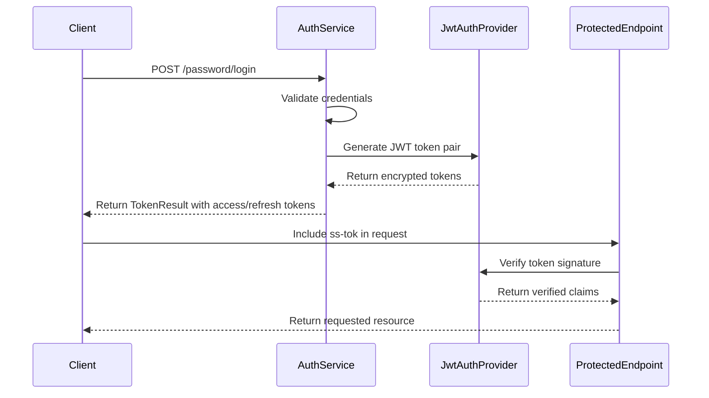
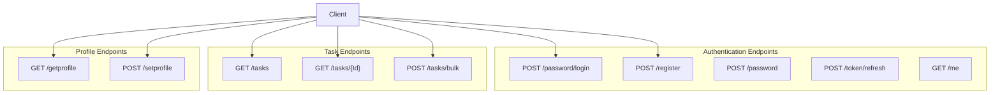
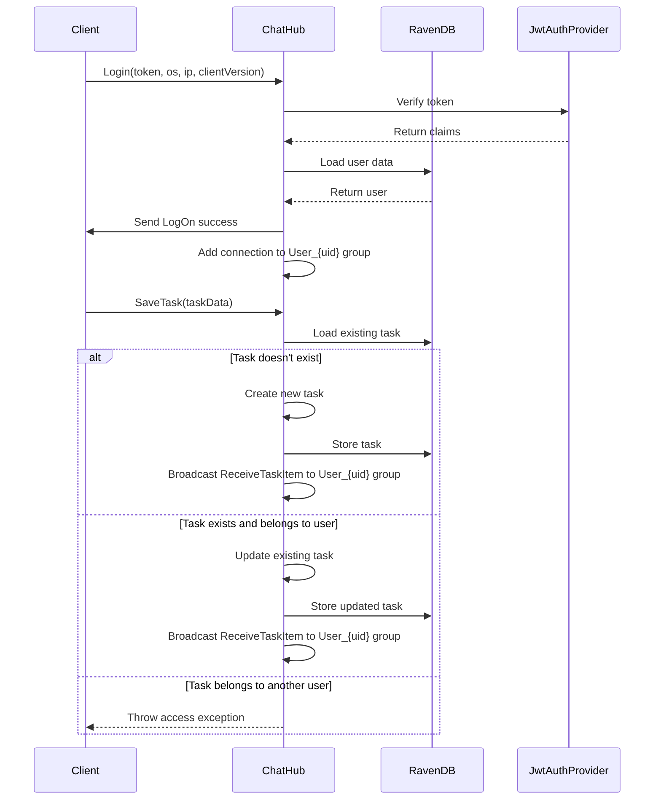
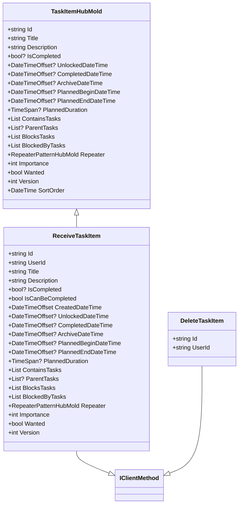

# API Reference

<cite>
**Referenced Files in This Document**   
- [AppHost.cs](file://src/Unlimotion.Server/AppHost.cs)
- [Startup.cs](file://src/Unlimotion.Server/Startup.cs)
- [TaskService.cs](file://src/Unlimotion.Server.ServiceInterface/TaskService.cs)
- [AuthService.cs](file://src/Unlimotion.Server.ServiceInterface/AuthService.cs)
- [ProfileService.cs](file://src/Unlimotion.Server.ServiceInterface/ProfileService.cs)
- [ChatHub.cs](file://src/Unlimotion.Server/Hubs/ChatHub.cs)
- [IChatHub.cs](file://src/Unlimotion.Interface/IChatHub.cs)
- [IProfile.cs](file://src/Unlimotion.Interface/IProfile.cs)
- [Task.cs](file://src/Unlimotion.Server.ServiceModel/Task.cs)
- [Auth.cs](file://src/Unlimotion.Server.ServiceModel/Auth.cs)
- [Profile.cs](file://src/Unlimotion.Server.ServiceModel/Profile.cs)
- [TaskItemHubMold.cs](file://src/Unlimotion.Interface/TaskItemHubMold.cs)
- [ReceiveTaskItem.cs](file://src/Unlimotion.Interface/ReceiveTaskItem.cs)
- [Bot.cs](file://src/Unlimotion.TelegramBot/Bot.cs)
</cite>

## Table of Contents
1. [Introduction](#introduction)
2. [Authentication and Security](#authentication-and-security)
3. [RESTful API Endpoints](#restful-api-endpoints)
4. [WebSocket API via SignalR](#websocket-api-via-signalr)
5. [Service Interfaces and Contracts](#service-interfaces-and-contracts)
6. [Request and Response Schemas](#request-and-response-schemas)
7. [Error Handling and Response Codes](#error-handling-and-response-codes)
8. [Client Implementation Examples](#client-implementation-examples)
9. [Telegram Bot Integration](#telegram-bot-integration)
10. [API Versioning and Backwards Compatibility](#api-versioning-and-backwards-compatibility)
11. [Security Considerations](#security-considerations)

## Introduction
This document provides comprehensive API documentation for Unlimotion's server endpoints and real-time communication interfaces. The system implements a hybrid API architecture combining RESTful endpoints using the ServiceStack framework with real-time WebSocket communication via SignalR. The API supports task management, user authentication, profile management, and real-time collaboration features. All RESTful endpoints are secured with JWT-based authentication and follow consistent patterns for request/response handling.

**Section sources**
- [AppHost.cs](file://src/Unlimotion.Server/AppHost.cs#L1-L121)
- [Startup.cs](file://src/Unlimotion.Server/Startup.cs#L1-L62)

## Authentication and Security
Unlimotion implements token-based authentication using JWT (JSON Web Tokens) with RS512 encryption. The authentication system is configured in the AppHost class, which sets up the JwtAuthProvider with encrypted payloads and configurable token expiration periods. Access tokens expire after 1 day by default, while refresh tokens last for 30 days. The system supports token transmission via query string (?ss-tok), form data, and authorization headers. During development, secure connection requirements are disabled, but in production, HTTPS is enforced. The authentication flow involves obtaining a token pair (access and refresh) through login or registration, then using the access token for subsequent API calls.



**Diagram sources**
- [AppHost.cs](file://src/Unlimotion.Server/AppHost.cs#L50-L100)
- [AuthService.cs](file://src/Unlimotion.Server.ServiceInterface/AuthService.cs#L100-L150)

**Section sources**
- [AppHost.cs](file://src/Unlimotion.Server/AppHost.cs#L1-L121)
- [AuthService.cs](file://src/Unlimotion.Server.ServiceInterface/AuthService.cs#L1-L255)

## RESTful API Endpoints
The RESTful API is built on the ServiceStack framework and provides CRUD operations for tasks, authentication, and user profiles. All endpoints require authentication except for user registration and login. The TaskService provides endpoints for retrieving tasks (GET /tasks, GET /tasks/{Id}), and bulk insertion (POST /tasks/bulk). The AuthService handles user authentication (POST /password/login), registration (POST /register), password creation (POST /password), and token refresh (POST /token/refresh). The ProfileService manages user profile data with GET /getprofile and POST /setprofile endpoints. All endpoints use standardized response formats with appropriate HTTP status codes.



**Diagram sources**
- [Task.cs](file://src/Unlimotion.Server.ServiceModel/Task.cs#L1-L44)
- [Auth.cs](file://src/Unlimotion.Server.ServiceModel/Auth.cs#L1-L77)
- [Profile.cs](file://src/Unlimotion.Server.ServiceModel/Profile.cs#L1-L32)

**Section sources**
- [TaskService.cs](file://src/Unlimotion.Server.ServiceInterface/TaskService.cs#L1-L70)
- [AuthService.cs](file://src/Unlimotion.Server.ServiceInterface/AuthService.cs#L1-L255)
- [ProfileService.cs](file://src/Unlimotion.Server.ServiceInterface/ProfileService.cs#L1-L48)

## WebSocket API via SignalR
The real-time communication layer is implemented using SignalR with the ChatHub class. The hub is mapped to the "/chathub" endpoint in Startup.cs and provides methods for real-time task synchronization, user presence, and collaborative features. Clients connect to the hub and authenticate using JWT tokens via the Login method, which validates the token and adds the connection to user-specific groups. The SaveTask method allows clients to create or update tasks, broadcasting changes to all other clients except the sender. The DeleteTasks method removes multiple tasks and notifies other connected clients. The UpdateMyDisplayName method enables real-time display name updates across all connected clients.



**Diagram sources**
- [ChatHub.cs](file://src/Unlimotion.Server/Hubs/ChatHub.cs#L1-L238)
- [Startup.cs](file://src/Unlimotion.Server/Startup.cs#L30-L35)

**Section sources**
- [ChatHub.cs](file://src/Unlimotion.Server/Hubs/ChatHub.cs#L1-L238)
- [Startup.cs](file://src/Unlimotion.Server/Startup.cs#L1-L62)

## Service Interfaces and Contracts
The server defines service interfaces in the Unlimotion.Interface namespace that establish contracts between the server and clients. The IChatHub interface extends IServerMethods and defines the real-time communication methods available through SignalR. It includes SaveTask for creating/updating tasks, UpdateMyDisplayName for changing display names, Login for authentication, and DeleteTasks for removing multiple tasks. The IProfile interface defines the Open method for opening user profiles. These interfaces ensure type safety and provide a clear contract for client implementations across different platforms (desktop, web, mobile). The interfaces use generic Task return types for asynchronous operations and define parameter types that match the server's data models.

**Section sources**
- [IChatHub.cs](file://src/Unlimotion.Interface/IChatHub.cs#L1-L14)
- [IProfile.cs](file://src/Unlimotion.Interface/IProfile.cs#L1-L12)

## Request and Response Schemas
The API uses consistent request and response schemas defined in the ServiceModel project. Request DTOs (Data Transfer Objects) are decorated with ServiceStack attributes to define routes, HTTP methods, and API documentation. Response schemas include TaskItemPage for paginated task lists, TaskItemMold for individual tasks, TokenResult for authentication responses, and various profile models. The TaskItemHubMold class defines the structure for task data transmitted via SignalR, including properties for task relationships (ContainsTasks, ParentTasks, BlocksTasks), status (IsCompleted, Wanted), and scheduling (PlannedBeginDateTime, PlannedDuration). The ReceiveTaskItem class extends this with additional metadata like CreatedDateTime and IsCanBeCompleted, providing clients with complete task information for real-time updates.



**Diagram sources**
- [TaskItemHubMold.cs](file://src/Unlimotion.Interface/TaskItemHubMold.cs#L1-L29)
- [ReceiveTaskItem.cs](file://src/Unlimotion.Interface/ReceiveTaskItem.cs#L1-L38)

**Section sources**
- [TaskItemHubMold.cs](file://src/Unlimotion.Interface/TaskItemHubMold.cs#L1-L29)
- [ReceiveTaskItem.cs](file://src/Unlimotion.Interface/ReceiveTaskItem.cs#L1-L38)
- [Task.cs](file://src/Unlimotion.Server.ServiceModel/Task.cs#L1-L44)

## Error Handling and Response Codes
The API implements comprehensive error handling with standardized response codes and messages. Service exceptions are caught by the ServiceExceptionHandlers in AppHost, which return HttpError responses with appropriate status codes. Unhandled exceptions are processed by UncaughtExceptionHandlers, ensuring consistent error responses even for unexpected errors. The system uses specific HTTP status codes: 401 for unauthorized access, 404 for not found resources, 400 for bad requests, and 409 for conflicts. Authentication-related errors include detailed messages in Russian, while the HTTP status codes provide standard semantic meaning. The TokenResult response includes an ExpireTime field to help clients manage token expiration proactively. Error responses are consistent across both RESTful and WebSocket APIs, with SignalR methods throwing exceptions that are propagated to clients.

**Section sources**
- [AppHost.cs](file://src/Unlimotion.Server/AppHost.cs#L20-L40)
- [AuthService.cs](file://src/Unlimotion.Server.ServiceInterface/AuthService.cs#L30-L100)
- [ChatHub.cs](file://src/Unlimotion.Server/Hubs/ChatHub.cs#L100-L150)

## Client Implementation Examples
Clients can consume the Unlimotion API through both RESTful endpoints and real-time SignalR connections. Desktop, web, and mobile clients should first authenticate using the /password/login endpoint to obtain a JWT token. For real-time collaboration, clients connect to the /chathub endpoint using SignalR, passing the JWT token for authentication. After successful login to the hub, clients receive real-time updates about task changes from other users through the ReceiveTaskItem and DeleteTaskItem messages. Clients should implement logic to handle these real-time updates by synchronizing their local task state with the server. The Telegram bot provides an example of a client implementation that uses the local task storage to perform operations, with periodic synchronization through git push/pull operations rather than direct API calls.

**Section sources**
- [ChatHub.cs](file://src/Unlimotion.Server/Hubs/ChatHub.cs#L1-L238)
- [AuthService.cs](file://src/Unlimotion.Server.ServiceInterface/AuthService.cs#L1-L255)
- [Bot.cs](file://src/Unlimotion.TelegramBot/Bot.cs#L1-L478)

## Telegram Bot Integration
The Telegram bot interacts with the Unlimotion server through a hybrid approach that combines direct task manipulation with periodic synchronization. Unlike other clients that use the API directly, the bot operates on a local copy of the task database stored in JSON files. It uses the TaskService class to search, retrieve, and modify tasks in the local storage. Changes are synchronized with the server through git operations managed by the GitService class, which performs periodic pull and push operations to keep the local and remote repositories in sync. The bot does not use the RESTful API or SignalR endpoints directly but instead relies on file-based synchronization. It supports commands like /search, /task, and /root to query tasks, and interactive buttons to modify task status, create subtasks, and navigate task relationships.

```mermaid
flowchart TD
TelegramBot["Telegram Bot"]
LocalStorage["Local JSON Storage"]
GitRepository["Git Repository"]
UnlimotionServer["Unlimotion Server"]
TelegramBot --> |Read/Write| LocalStorage
LocalStorage --> |Commit & Push| GitRepository
GitRepository --> |Pull| LocalStorage
GitRepository < --> |Sync| UnlimotionServer
subgraph "Bot Operations"
TelegramBot --> |Command: /search| LocalStorage
TelegramBot --> |Command: /task| LocalStorage
TelegramBot --> |Button: Toggle| LocalStorage
TelegramBot --> |Button: Create Subtask| LocalStorage
end
subgraph "Synchronization"
Timer1["Pull Timer (5 min)"] --> |Pull Latest| LocalStorage
Timer2["Push Timer (1 min)"] --> |Commit & Push| GitRepository
end
```

**Diagram sources**
- [Bot.cs](file://src/Unlimotion.TelegramBot/Bot.cs#L1-L478)
- [GitService.cs](file://src/Unlimotion.TelegramBot/GitService.cs#L1-L50)

**Section sources**
- [Bot.cs](file://src/Unlimotion.TelegramBot/Bot.cs#L1-L478)

## API Versioning and Backwards Compatibility
The current implementation does not include explicit API versioning in the endpoint URLs. Instead, backwards compatibility is maintained through careful evolution of the data models and service contracts. The system uses the ServiceStack framework's built-in support for DTO evolution, allowing fields to be added without breaking existing clients. The TaskItemHubMold and related models include version fields to track changes to individual task entities. When modifying existing endpoints, the team follows a deprecation strategy by introducing new endpoints with improved functionality while maintaining the old ones with appropriate documentation. The use of JSON for data transfer provides inherent flexibility for handling optional fields and evolving schemas. Future versions of the API may introduce versioned endpoints (e.g., /api/v1/tasks) to provide clearer version boundaries.

**Section sources**
- [TaskItemHubMold.cs](file://src/Unlimotion.Interface/TaskItemHubMold.cs#L1-L29)
- [TaskService.cs](file://src/Unlimotion.Server.ServiceInterface/TaskService.cs#L1-L70)

## Security Considerations
Unlimotion implements multiple security layers to protect user data and system integrity. The primary security mechanism is JWT-based authentication with RS512 encryption and token payload encryption. All sensitive operations require authentication, and the system validates user ownership of resources (e.g., ensuring users can only modify their own tasks). The server implements proper exception handling to avoid leaking sensitive information in error messages. Input validation is performed at the service level, with appropriate error responses for invalid data. The system uses RavenDB for data storage with proper document isolation between users. For real-time communication, the SignalR hub validates user identity before allowing operations and uses connection groups to ensure users only receive updates for their own data. The Telegram bot implements access control through a whitelist of allowed user IDs, preventing unauthorized access to task data.

**Section sources**
- [AppHost.cs](file://src/Unlimotion.Server/AppHost.cs#L50-L100)
- [ChatHub.cs](file://src/Unlimotion.Server/Hubs/ChatHub.cs#L1-L238)
- [AuthService.cs](file://src/Unlimotion.Server.ServiceInterface/AuthService.cs#L1-L255)
- [Bot.cs](file://src/Unlimotion.TelegramBot/Bot.cs#L1-L478)