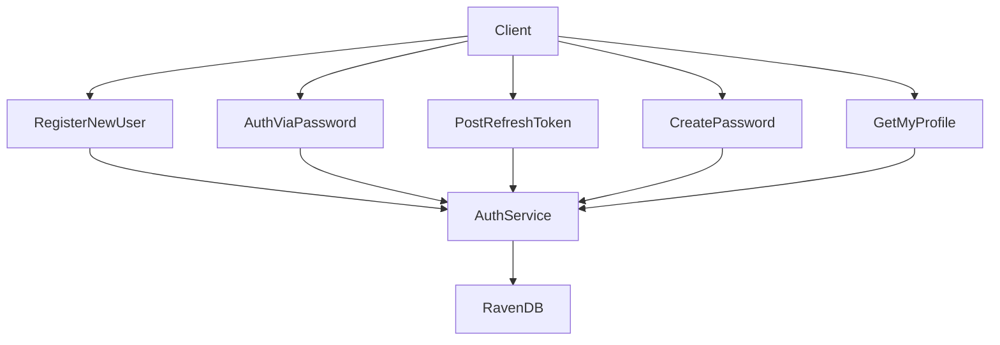
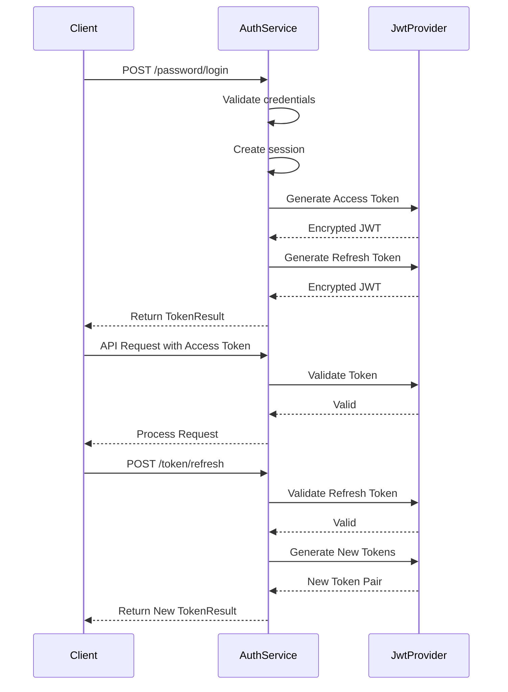
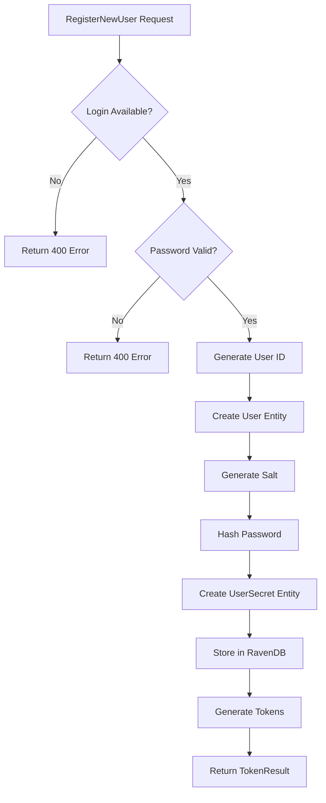
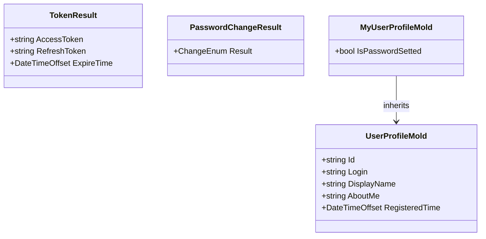
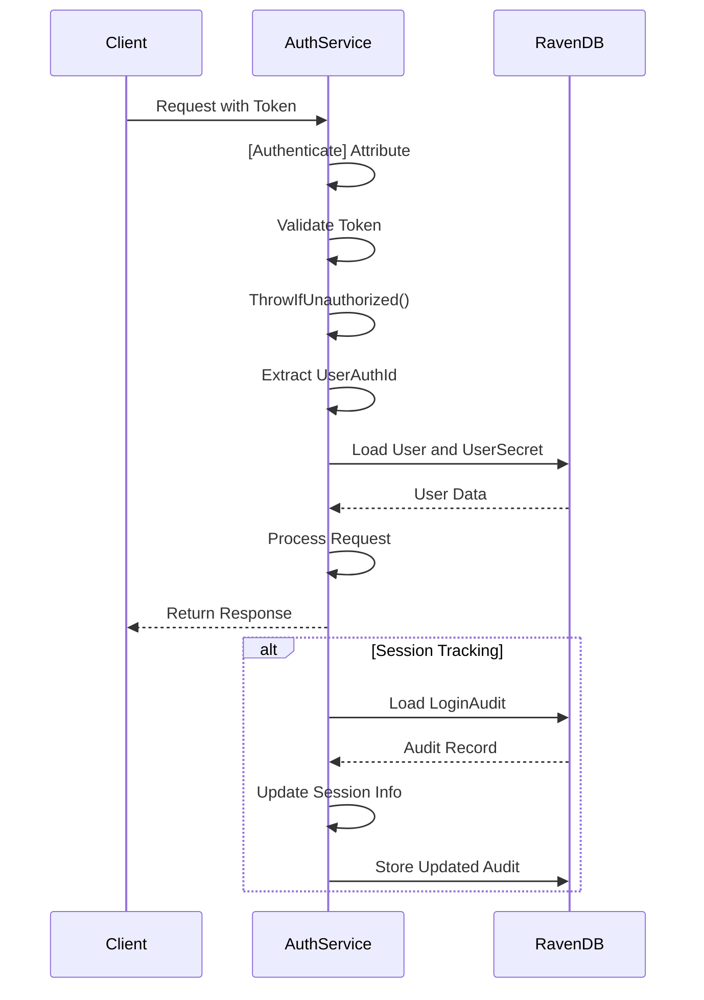
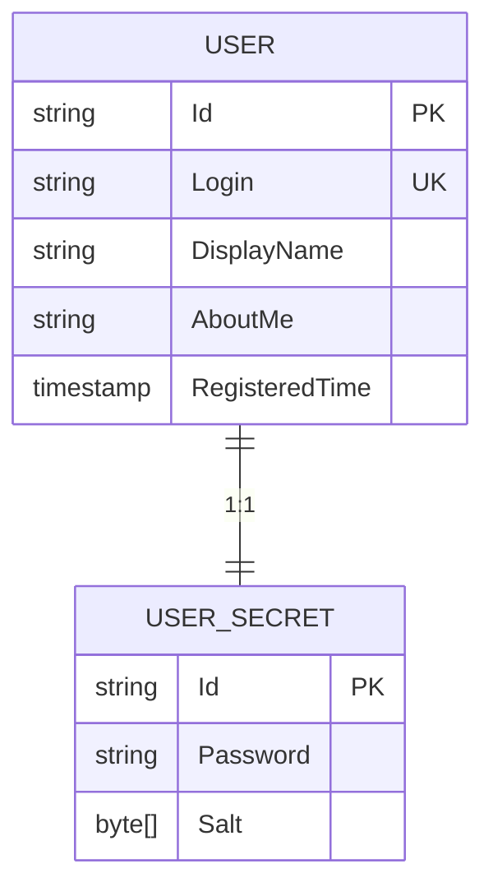
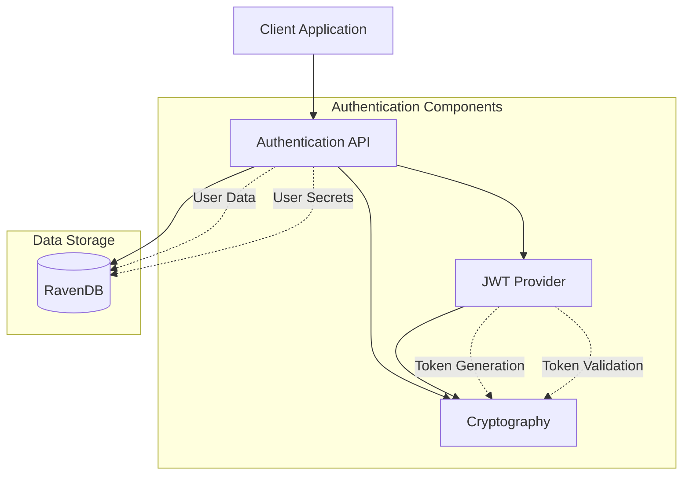

# Authentication API

<cite>
**Referenced Files in This Document**   
- [AuthService.cs](file://src/Unlimotion.Server.ServiceInterface/AuthService.cs)
- [Auth.cs](file://src/Unlimotion.Server.ServiceModel/Auth.cs)
- [TokenResult.cs](file://src/Unlimotion.Server.ServiceModel/Molds/TokenResult.cs)
- [PasswordChangeResult.cs](file://src/Unlimotion.Server.ServiceModel/Molds/PasswordChangeResult.cs)
- [MyUserProfileMold.cs](file://src/Unlimotion.Server.ServiceModel/Molds/MyUserProfileMold.cs)
- [User.cs](file://src/Unlimotion.Domain/User.cs)
- [Hashing.cs](file://src/Unlimotion.Server.ServiceInterface/Hashing.cs)
- [AppHost.cs](file://src/Unlimotion.Server/AppHost.cs)
- [ChatHub.cs](file://src/Unlimotion.Server/hubs/ChatHub.cs)
</cite>

## Table of Contents
1. [Introduction](#introduction)
2. [Authentication Endpoints](#authentication-endpoints)
3. [JWT Authentication Flow](#jwt-authentication-flow)
4. [User Registration Process](#user-registration-process)
5. [Response Schemas](#response-schemas)
6. [Authentication Attribute and Session Management](#authentication-attribute-and-session-management)
7. [User Secret Storage Pattern](#user-secret-storage-pattern)
8. [Security Considerations](#security-considerations)
9. [Authentication Flow Examples](#authentication-flow-examples)
10. [Architecture Overview](#architecture-overview)

## Introduction
The Unlimotion Authentication API provides a comprehensive JWT-based authentication system for user management and secure access control. The API is implemented in the AuthService.cs file and offers endpoints for user registration, password-based login, token refresh, password creation, and profile retrieval. The system uses ServiceStack's JWT authentication provider with encrypted tokens and implements a robust security model with password hashing, session management, and refresh token validation. The authentication system is integrated with RavenDB for user data storage and supports custom token expiration periods for both access and refresh tokens.

**Section sources**
- [AuthService.cs](file://src/Unlimotion.Server.ServiceInterface/AuthService.cs#L1-L255)
- [AppHost.cs](file://src/Unlimotion.Server/AppHost.cs#L1-L121)

## Authentication Endpoints
The Authentication API exposes five primary endpoints for user authentication and management:

1. **RegisterNewUser** (POST /register): Creates a new user account with login, password, and optional username.
2. **AuthViaPassword** (POST /password/login): Authenticates a user with their login and password credentials.
3. **PostRefreshToken** (POST /token/refresh): Refreshes authentication tokens using a valid refresh token.
4. **CreatePassword** (POST /password): Sets a password for a user who doesn't have one.
5. **GetMyProfile** (GET /me): Retrieves the authenticated user's profile information.

Each endpoint is properly documented with API annotations that specify HTTP status codes, request parameters, and response types. The endpoints follow RESTful principles and return appropriate HTTP status codes for success and error conditions.



**Diagram sources**
- [AuthService.cs](file://src/Unlimotion.Server.ServiceInterface/AuthService.cs#L34-L127)
- [Auth.cs](file://src/Unlimotion.Server.ServiceModel/Auth.cs#L0-L77)

**Section sources**
- [AuthService.cs](file://src/Unlimotion.Server.ServiceInterface/AuthService.cs#L34-L127)
- [Auth.cs](file://src/Unlimotion.Server.ServiceModel/Auth.cs#L0-L77)

## JWT Authentication Flow
The Unlimotion Authentication API implements a JWT-based authentication flow using ServiceStack's JwtAuthProvider with encrypted JWE tokens. The system generates both access and refresh tokens for each authenticated session, providing a secure mechanism for maintaining user sessions and enabling token renewal without requiring repeated password entry.

When a user successfully authenticates via password or registration, the system generates a pair of tokens:
- **Access Token**: Used for authenticating subsequent API requests, encrypted with JWE and containing user identity, session information, and expiration time.
- **Refresh Token**: Used to obtain new access tokens when they expire, containing a refresh permission and the same session identifier.

The JWT provider is configured with RS512 hashing algorithm and payload encryption for enhanced security. Access tokens have a default expiration of 1 day, while refresh tokens expire after 30 days. Clients can request custom expiration periods for both token types, but cannot exceed the default maximum values.



**Diagram sources**
- [AuthService.cs](file://src/Unlimotion.Server.ServiceInterface/AuthService.cs#L128-L217)
- [AppHost.cs](file://src/Unlimotion.Server/AppHost.cs#L80-L102)

**Section sources**
- [AuthService.cs](file://src/Unlimotion.Server.ServiceInterface/AuthService.cs#L128-L217)
- [AppHost.cs](file://src/Unlimotion.Server/AppHost.cs#L80-L102)

## User Registration Process
The user registration process in Unlimotion follows a secure flow that creates a new user account with properly hashed password storage. When a client sends a RegisterNewUser request, the system performs the following steps:

1. Validates that the requested login is not already in use.
2. Ensures the provided password is not empty.
3. Creates a new User entity with a unique ID, login, optional username, and registration timestamp.
4. Generates a cryptographically secure salt using RandomNumberGenerator.
5. Creates a UserSecret entity with the salted hash of the password.
6. Stores both entities in the RavenDB database.
7. Generates and returns authentication tokens for the newly created user.

The password hashing uses PBKDF2 with HMAC-SHA1, 10,000 iterations, and a 256-bit derived key, providing strong protection against brute force attacks. The salt is generated as a 128-bit value using a cryptographically secure random number generator.



**Diagram sources**
- [AuthService.cs](file://src/Unlimotion.Server.ServiceInterface/AuthService.cs#L34-L61)
- [Hashing.cs](file://src/Unlimotion.Server.ServiceInterface/Hashing.cs#L0-L35)

**Section sources**
- [AuthService.cs](file://src/Unlimotion.Server.ServiceInterface/AuthService.cs#L34-L61)
- [Hashing.cs](file://src/Unlimotion.Server.ServiceInterface/Hashing.cs#L0-L35)

## Response Schemas
The Authentication API defines several response schemas to standardize data exchange between client and server:

### TokenResult
Represents the authentication token pair returned upon successful authentication or token refresh:

- **AccessToken** (string): Encrypted JWT token for authenticating API requests
- **RefreshToken** (string): Encrypted JWT token for refreshing expired access tokens
- **ExpireTime** (DateTimeOffset): Timestamp when the access token expires

### PasswordChangeResult
Indicates the result of a password creation operation:

- **Result** (ChangeEnum): Enumeration indicating whether the password was Created or Changed

### MyUserProfileMold
Contains the authenticated user's profile information with an additional field indicating password status:

- Inherits all properties from UserProfileMold (Id, Login, DisplayName, AboutMe, RegisteredTime)
- **IsPasswordSetted** (bool): Indicates whether the user has set a password

These response schemas ensure consistent data formatting across the API and provide clients with the necessary information for user interface updates and state management.



**Diagram sources**
- [TokenResult.cs](file://src/Unlimotion.Server.ServiceModel/Molds/TokenResult.cs#L0-L17)
- [PasswordChangeResult.cs](file://src/Unlimotion.Server.ServiceModel/Molds/PasswordChangeResult.cs#L0-L18)
- [MyUserProfileMold.cs](file://src/Unlimotion.Server.ServiceModel/Molds/MyUserProfileMold.cs#L0-L10)
- [User.cs](file://src/Unlimotion.Domain/User.cs#L0-L24)

**Section sources**
- [TokenResult.cs](file://src/Unlimotion.Server.ServiceModel/Molds/TokenResult.cs#L0-L17)
- [PasswordChangeResult.cs](file://src/Unlimotion.Server.ServiceModel/Molds/PasswordChangeResult.cs#L0-L18)
- [MyUserProfileMold.cs](file://src/Unlimotion.Server.ServiceModel/Molds/MyUserProfileMold.cs#L0-L10)

## Authentication Attribute and Session Management
The Authentication API uses ServiceStack's [Authenticate] attribute to protect endpoints that require user authentication. This attribute is applied to the PostRefreshToken, CreatePassword, and GetMyProfile methods, ensuring that only authenticated users can access these resources.

When the [Authenticate] attribute is present, the system validates the provided token and throws appropriate HTTP errors for unauthorized or expired tokens. The Request.ThrowIfUnauthorized() method is used to verify the authentication status and retrieve the current session. The session contains the UserAuthId which is used to identify the authenticated user throughout the request processing.

Session management is implemented through a unique session identifier stored in both the access and refresh tokens. This session ID is generated as a GUID when tokens are created and is used to link the two tokens together. The system also stores session information in the LoginAudit entity in RavenDB, tracking the user's operating system, IP address, client version, and login timestamp. This enables session validation and detection of concurrent logins from different devices.



**Diagram sources**
- [AuthService.cs](file://src/Unlimotion.Server.ServiceInterface/AuthService.cs#L88-L127)
- [ChatHub.cs](file://src/Unlimotion.Server/hubs/ChatHub.cs#L131-L237)

**Section sources**
- [AuthService.cs](file://src/Unlimotion.Server.ServiceInterface/AuthService.cs#L88-L127)
- [ChatHub.cs](file://src/Unlimotion.Server/hubs/ChatHub.cs#L131-L237)

## User Secret Storage Pattern
The Unlimotion Authentication API implements a secure user secret storage pattern that separates user identity data from authentication secrets. This pattern uses two distinct entities stored in RavenDB:

1. **User**: Contains public user information such as ID, login, display name, about me text, and registration timestamp.
2. **UserSecret**: Contains sensitive authentication data including the password hash and salt.

The UserSecret entity is stored with an ID that combines the User ID with a "/secret" postfix (e.g., "User/123/secret"), creating a direct relationship between the user and their secrets while keeping them in a separate document. This separation enhances security by allowing different access patterns and permissions for identity versus authentication data.

When retrieving user information, the system can load both documents in a single query using RavenDB's Include feature, minimizing database round trips while maintaining the logical separation of concerns. The password is stored as a salted hash using PBKDF2, ensuring that even if the database is compromised, passwords cannot be easily recovered.



**Diagram sources**
- [User.cs](file://src/Unlimotion.Domain/User.cs#L0-L24)
- [AuthService.cs](file://src/Unlimotion.Server.ServiceInterface/AuthService.cs#L198-L217)

**Section sources**
- [User.cs](file://src/Unlimotion.Domain/User.cs#L0-L24)
- [AuthService.cs](file://src/Unlimotion.Server.ServiceInterface/AuthService.cs#L198-L217)

## Security Considerations
The Unlimotion Authentication API incorporates several security measures to protect user data and prevent common attack vectors:

### Password Validation
The system validates passwords on creation and registration, rejecting empty passwords and preventing duplicate logins. Passwords are hashed using PBKDF2 with HMAC-SHA1, 10,000 iterations, and a unique salt for each user, providing strong protection against rainbow table and brute force attacks.

### Rate Limiting Implications
While the current implementation doesn't include explicit rate limiting, the use of JWT tokens and server-side session validation provides some protection against brute force attacks. The system could be enhanced with rate limiting at the API gateway or middleware level to further protect against credential stuffing and password guessing attacks.

### Secure Token Storage Recommendations
The API uses encrypted JWE tokens with RS512 signatures, ensuring both confidentiality and integrity of the token contents. Tokens can be transmitted in query strings and form data (AllowInQueryString and AllowInFormData are enabled), but clients should use secure channels (HTTPS) especially in production environments. The RequireSecureConnection setting is disabled in development but should be enabled in production.

### Additional Security Features
- Token encryption prevents clients from reading sensitive session data
- Session IDs link access and refresh tokens, enabling session invalidation
- Separate storage of user secrets limits exposure of sensitive data
- JWT token expiration limits the window of opportunity for token theft
- Refresh token permission scoping prevents using refresh tokens for general API access

**Section sources**
- [AuthService.cs](file://src/Unlimotion.Server.ServiceInterface/AuthService.cs#L34-L255)
- [Hashing.cs](file://src/Unlimotion.Server.ServiceInterface/Hashing.cs#L0-L35)
- [AppHost.cs](file://src/Unlimotion.Server/AppHost.cs#L80-L102)

## Authentication Flow Examples
This section provides examples of successful and failed authentication flows with appropriate HTTP status codes.

### Successful User Registration
```http
POST /register HTTP/1.1
Content-Type: application/json

{
  "login": "user@example.com",
  "password": "securePassword123",
  "userName": "John Doe"
}

HTTP/1.1 200 OK
Content-Type: application/json

{
  "accessToken": "encrypted.jwt.token",
  "refreshToken": "encrypted.jwt.refresh.token",
  "expireTime": "2023-12-01T10:00:00Z"
}
```

### Failed Login (Invalid Credentials)
```http
POST /password/login HTTP/1.1
Content-Type: application/json

{
  "login": "user@example.com",
  "password": "wrongPassword"
}

HTTP/1.1 404 Not Found
Content-Type: application/json

{
  "responseStatus": {
    "errorCode": "NotFound",
    "message": "Password is wrong"
  }
}
```

### Successful Token Refresh
```http
POST /token/refresh HTTP/1.1
Authorization: Bearer {refreshToken}
Content-Type: application/json

{
  "accessTokenExpirationPeriod": 3600
}

HTTP/1.1 200 OK
Content-Type: application/json

{
  "accessToken": "new.encrypted.jwt.token",
  "refreshToken": "new.encrypted.jwt.refresh.token",
  "expireTime": "2023-12-01T11:00:00Z"
}
```

### Unauthorized Access to Protected Resource
```http
GET /me HTTP/1.1
Authorization: Bearer invalidToken

HTTP/1.1 401 Unauthorized
Content-Type: application/json

{
  "responseStatus": {
    "errorCode": "Unauthorized",
    "message": "User is not authorized"
  }
}
```

**Section sources**
- [AuthService.cs](file://src/Unlimotion.Server.ServiceInterface/AuthService.cs#L34-L127)
- [Auth.cs](file://src/Unlimotion.Server.ServiceModel/Auth.cs#L0-L77)

## Architecture Overview
The Unlimotion Authentication API follows a clean architecture with clear separation of concerns between service implementation, data models, and domain entities. The system is built on ServiceStack framework and integrates with RavenDB for persistent storage.

The authentication flow begins with client requests to specific endpoints, which are handled by the AuthService class. This service coordinates authentication logic, token generation, and database operations. User credentials are validated against hashed passwords stored in RavenDB, and successful authentication results in JWT token generation using ServiceStack's JwtAuthProvider.

The architecture emphasizes security through separation of user data and authentication secrets, cryptographic password hashing, and encrypted JWT tokens. The system also integrates with real-time features through SignalR hubs, where authentication tokens are validated for WebSocket connections.



**Diagram sources**
- [AuthService.cs](file://src/Unlimotion.Server.ServiceInterface/AuthService.cs#L1-L255)
- [AppHost.cs](file://src/Unlimotion.Server/AppHost.cs#L1-L121)
- [User.cs](file://src/Unlimotion.Domain/User.cs#L0-L24)

**Section sources**
- [AuthService.cs](file://src/Unlimotion.Server.ServiceInterface/AuthService.cs#L1-L255)
- [AppHost.cs](file://src/Unlimotion.Server/AppHost.cs#L1-L121)