# Chat API Documentation

<cite>
**Referenced Files in This Document**
- [IChatHub.cs](file://src/Unlimotion.Interface/IChatHub.cs)
- [ChatHub.cs](file://src/Unlimotion.Server/hubs/ChatHub.cs)
- [ReceiveTaskItem.cs](file://src/Unlimotion.Interface/ReceiveTaskItem.cs)
- [TaskItemHubMold.cs](file://src/Unlimotion.Interface/TaskItemHubMold.cs)
- [LogOn.cs](file://src/Unlimotion.Interface/LogOn.cs)
- [UpdateUserDisplayName.cs](file://src/Unlimotion.Interface/UpdateUserDisplayName.cs)
- [ServerTaskStorage.cs](file://src/Unlimotion/ServerTaskStorage.cs)
- [Startup.cs](file://src/Unlimotion.Server/Startup.cs)
- [AuthService.cs](file://src/Unlimotion.Server.ServiceInterface/AuthService.cs)
- [Auth.cs](file://src/Unlimotion.Server.ServiceModel/Auth.cs)
- [TokenResult.cs](file://src/Unlimotion.Server.ServiceModel/Molds/TokenResult.cs)
</cite>

## Table of Contents
1. [Introduction](#introduction)
2. [Architecture Overview](#architecture-overview)
3. [WebSocket Endpoint Configuration](#websocket-endpoint-configuration)
4. [Authentication Flow](#authentication-flow)
5. [Core API Methods](#core-api-methods)
6. [Real-time Collaboration Features](#real-time-collaboration-features)
7. [Message Formats](#message-formats)
8. [Connection Lifecycle Management](#connection-lifecycle-management)
9. [Error Handling and Logging](#error-handling-and-logging)
10. [Client Implementation Examples](#client-implementation-examples)
11. [Connection Resilience](#connection-resilience)
12. [Troubleshooting Guide](#troubleshooting-guide)

## Introduction

The Unlimotion Chat API is a real-time communication system built on SignalR technology, providing WebSocket-based bidirectional communication between clients and the server. This API enables real-time task synchronization, user presence management, and collaborative features for the Unlimotion productivity platform.

The API follows a hub-based architecture where all client-server interactions occur through the ChatHub, implementing the IChatHub interface for type-safe communication. The system supports JWT-based authentication, real-time task updates, user display name management, and automatic connection resilience.

## Architecture Overview

The Chat API architecture consists of several interconnected components working together to provide real-time functionality:

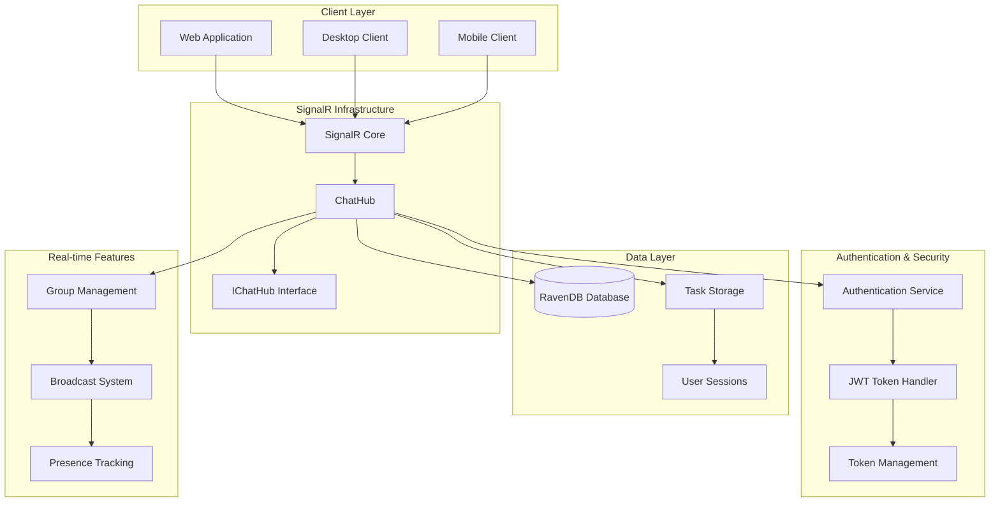

**Diagram sources**
- [ChatHub.cs](file://src/Unlimotion.Server/hubs/ChatHub.cs#L18-L239)
- [IChatHub.cs](file://src/Unlimotion.Interface/IChatHub.cs#L8-L14)
- [Startup.cs](file://src/Unlimotion.Server/Startup.cs#L25-L35)

## WebSocket Endpoint Configuration

The Chat API exposes WebSocket endpoints through SignalR, configured during application startup:

### Endpoint Registration

The WebSocket endpoint `/chathub` is registered in the ASP.NET Core pipeline, enabling real-time bidirectional communication between clients and the server.

### SignalR Configuration

The SignalR hub is configured with:
- Automatic connection management
- Built-in reconnection capabilities
- Message serialization using JSON format
- Support for concurrent client connections

**Section sources**
- [Startup.cs](file://src/Unlimotion.Server/Startup.cs#L45-L50)
- [ChatHub.cs](file://src/Unlimotion.Server/hubs/ChatHub.cs#L18-L25)

## Authentication Flow

The authentication system implements JWT-based authentication with comprehensive session management and token refresh capabilities.

### Login Method Implementation

The Login method validates JWT tokens and establishes user sessions:

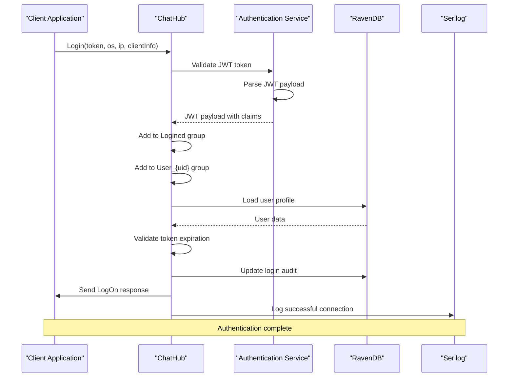

**Diagram sources**
- [ChatHub.cs](file://src/Unlimotion.Server/hubs/ChatHub.cs#L154-L237)
- [AuthService.cs](file://src/Unlimotion.Server.ServiceInterface/AuthService.cs#L157-L185)

### Token Validation Process

The authentication flow includes comprehensive token validation:

1. **JWT Payload Extraction**: Extract user claims from the JWT token
2. **User Verification**: Load user data from RavenDB
3. **Session Validation**: Verify session ID matches stored audit
4. **Expiration Check**: Validate token expiration time
5. **Audit Logging**: Record login activity and device information

### Error Handling in Authentication

The system handles various authentication scenarios:

- **User Not Found**: Returns 404 error status
- **Expired Token**: Returns 419 error status
- **Invalid Token**: Logs warning and rejects connection
- **Internal Errors**: Returns 500 error status

**Section sources**
- [ChatHub.cs](file://src/Unlimotion.Server/hubs/ChatHub.cs#L154-L237)
- [LogOn.cs](file://src/Unlimotion.Interface/LogOn.cs#L6-L21)
- [AuthService.cs](file://src/Unlimotion.Server.ServiceInterface/AuthService.cs#L157-L185)

## Core API Methods

The Chat API provides four primary methods for client-server communication, each serving specific real-time functionality.

### SaveTask Method

The SaveTask method handles task creation and updates with version control:

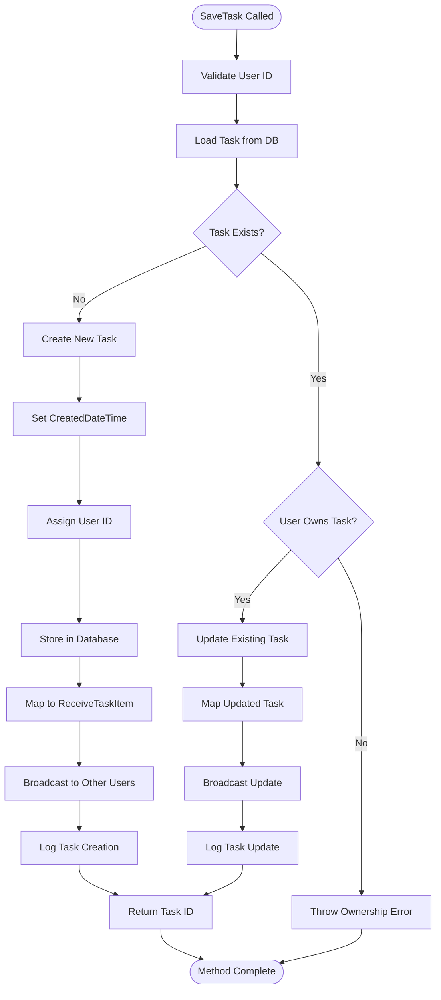

**Diagram sources**
- [ChatHub.cs](file://src/Unlimotion.Server/hubs/ChatHub.cs#L44-L89)
- [TaskItemHubMold.cs](file://src/Unlimotion.Interface/TaskItemHubMold.cs#L6-L29)

### DeleteTasks Method

The DeleteTasks method removes multiple tasks with permission validation:

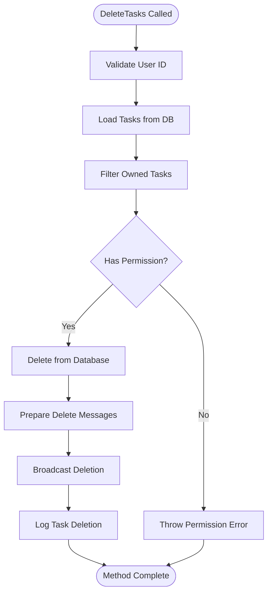

**Diagram sources**
- [ChatHub.cs](file://src/Unlimotion.Server/hubs/ChatHub.cs#L91-L131)

### UpdateMyDisplayName Method

The UpdateMyDisplayName method manages user display name changes with global notification:

The method validates display name changes and broadcasts updates to all connected clients in the Logined group.

### Login Method

The Login method serves as the primary authentication endpoint, establishing secure user sessions with comprehensive error handling.

**Section sources**
- [ChatHub.cs](file://src/Unlimotion.Server/hubs/ChatHub.cs#L32-L131)
- [IChatHub.cs](file://src/Unlimotion.Interface/IChatHub.cs#L8-L14)

## Real-time Collaboration Features

The Chat API implements sophisticated real-time collaboration through SignalR's broadcasting capabilities and group management system.

### Group Management System

The API uses a hierarchical group structure for efficient message routing:

- **Logined Group**: Contains all authenticated users for global notifications
- **User_{uid} Groups**: Individual user groups for targeted communications

### Broadcast Patterns

The system employs two primary broadcast patterns:

1. **GroupExcept Pattern**: Sends messages to all users except the sender
2. **Group Pattern**: Broadcasts to specific user groups

### Real-time Task Synchronization

Task changes are synchronized across all connected clients using the GroupExcept pattern:

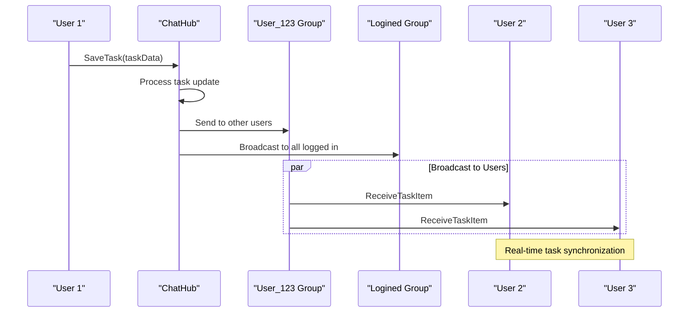

**Diagram sources**
- [ChatHub.cs](file://src/Unlimotion.Server/hubs/ChatHub.cs#L58-L65)
- [ChatHub.cs](file://src/Unlimotion.Server/hubs/ChatHub.cs#L105-L112)

**Section sources**
- [ChatHub.cs](file://src/Unlimotion.Server/hubs/ChatHub.cs#L25-L27)
- [ChatHub.cs](file://src/Unlimotion.Server/hubs/ChatHub.cs#L32-L42)

## Message Formats

The Chat API uses strongly-typed message formats for reliable real-time communication.

### TaskItemHubMold Format

The TaskItemHubMold serves as the primary task data transfer object:

| Property | Type | Description | Required |
|----------|------|-------------|----------|
| Id | string | Unique task identifier | Yes |
| Title | string | Task title/description | Yes |
| Description | string | Detailed task description | No |
| IsCompleted | bool? | Completion status | No |
| CreatedDateTime | DateTimeOffset? | Task creation timestamp | No |
| UnlockedDateTime | DateTimeOffset? | Task unlock timestamp | No |
| CompletedDateTime | DateTimeOffset? | Task completion timestamp | No |
| PlannedBeginDateTime | DateTimeOffset? | Planned start date | No |
| PlannedEndDateTime | DateTimeOffset? | Planned end date | No |
| PlannedDuration | TimeSpan? | Planned duration | No |
| ContainsTasks | List<string> | Child task identifiers | No |
| ParentTasks | List<string>? | Parent task identifiers | No |
| BlocksTasks | List<string> | Blocking task identifiers | No |
| BlockedByTasks | List<string> | Blocked by task identifiers | No |
| Repeater | RepeaterPatternHubMold | Repeat pattern configuration | No |
| Importance | int | Task importance level | No |
| Wanted | bool | User priority flag | No |
| Version | int | Task version for conflict resolution | No |

### ReceiveTaskItem Format

The ReceiveTaskItem format extends TaskItemHubMold with additional metadata for client consumption:

| Property | Type | Description |
|----------|------|-------------|
| UserId | string | Task owner identifier |
| Version | int | Current task version |
| SortOrder | DateTime | Sorting priority |

### LogOn Response Format

The LogOn message provides authentication status and user information:

| Property | Type | Description |
|----------|------|-------------|
| Id | string | User identifier |
| UserLogin | string | User login name |
| UserName | string | Display name |
| ExpireTime | DateTimeOffset | Token expiration time |
| Error | LogOnStatus | Authentication status |

### UpdateUserDisplayName Format

The UpdateUserDisplayName message broadcasts user display name changes:

| Property | Type | Description |
|----------|------|-------------|
| Id | string | User identifier |
| DisplayName | string | New display name |
| UserLogin | string | User login name |

**Section sources**
- [TaskItemHubMold.cs](file://src/Unlimotion.Interface/TaskItemHubMold.cs#L6-L29)
- [ReceiveTaskItem.cs](file://src/Unlimotion.Interface/ReceiveTaskItem.cs#L9-L38)
- [LogOn.cs](file://src/Unlimotion.Interface/LogOn.cs#L6-L21)
- [UpdateUserDisplayName.cs](file://src/Unlimotion.Interface/UpdateUserDisplayName.cs#L5-L11)

## Connection Lifecycle Management

The Chat API implements comprehensive connection lifecycle management with automatic cleanup and state persistence.

### Connection Establishment

New client connections undergo the following process:

1. **Hub Initialization**: ChatHub instance creation with dependency injection
2. **Authentication**: JWT token validation and user session establishment
3. **Group Assignment**: Addition to Logined and User_{uid} groups
4. **Context Setup**: Storage of user context items (uid, login, session, nickname)

### Disconnection Handling

The OnDisconnectedAsync method ensures proper cleanup:

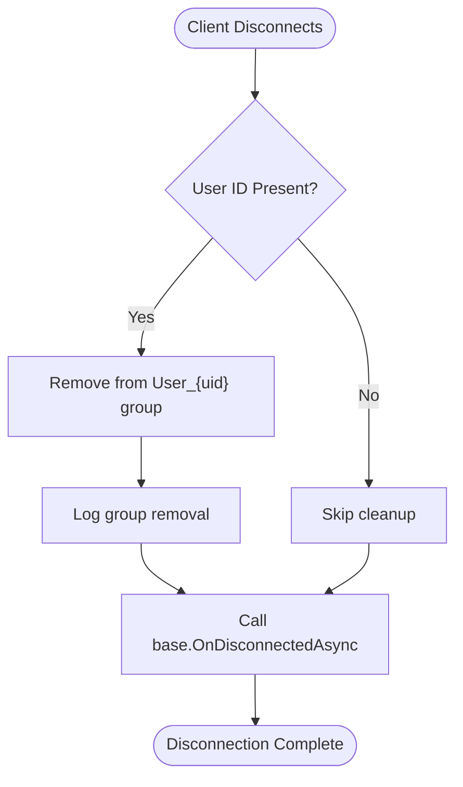

**Diagram sources**
- [ChatHub.cs](file://src/Unlimotion.Server/hubs/ChatHub.cs#L133-L142)

### Context Item Storage

The system maintains user context through SignalR's Context.Items collection:

| Key | Value Type | Description |
|-----|------------|-------------|
| uid | string | User identifier from JWT |
| login | string | User login name |
| session | string | Session identifier |
| nickname | string | User display name |

**Section sources**
- [ChatHub.cs](file://src/Unlimotion.Server/hubs/ChatHub.cs#L133-L142)
- [ChatHub.cs](file://src/Unlimotion.Server/hubs/ChatHub.cs#L154-L170)

## Error Handling and Logging

The Chat API implements comprehensive error handling and structured logging for production reliability.

### Exception Types and Handling

The system defines specific exception types for different error scenarios:

- **TokenException**: JWT validation failures
- **HttpError**: HTTP status code exceptions
- **General Exceptions**: Catch-all error handling

### Logging Implementation

Serilog provides structured logging throughout the API:

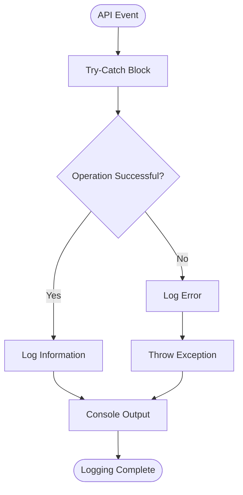

**Diagram sources**
- [ChatHub.cs](file://src/Unlimotion.Server/hubs/ChatHub.cs#L89-L91)
- [ChatHub.cs](file://src/Unlimotion.Server/hubs/ChatHub.cs#L195-L197)

### Error Status Codes

The API returns standardized error responses:

| Status Code | Description | Error Type |
|-------------|-------------|------------|
| 200 | Success | Ok |
| 404 | User Not Found | ErrorUserNotFound |
| 419 | Token Expired | ErrorExpiredToken |
| 500 | Internal Error | InternalError |

### Connection Error Handling

Client-side connection errors trigger automatic reconnection attempts with exponential backoff:

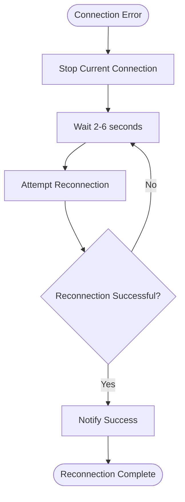

**Diagram sources**
- [ServerTaskStorage.cs](file://src/Unlimotion/ServerTaskStorage.cs#L280-L300)

**Section sources**
- [ChatHub.cs](file://src/Unlimotion.Server/hubs/ChatHub.cs#L89-L91)
- [ChatHub.cs](file://src/Unlimotion.Server/hubs/ChatHub.cs#L195-L197)
- [LogOn.cs](file://src/Unlimotion.Interface/LogOn.cs#L12-L17)
- [ServerTaskStorage.cs](file://src/Unlimotion/ServerTaskStorage.cs#L280-L300)

## Client Implementation Examples

The client-side implementation demonstrates practical usage of the Chat API through the ServerTaskStorage class.

### Basic Client Setup

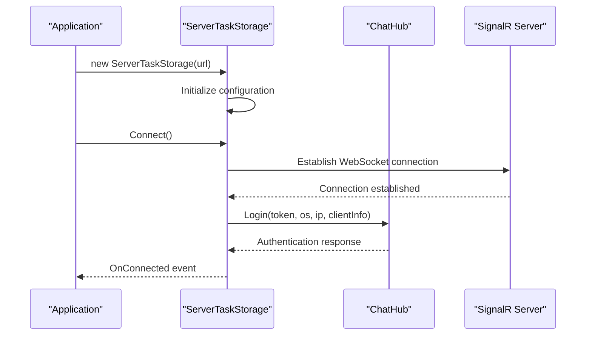

**Diagram sources**
- [ServerTaskStorage.cs](file://src/Unlimotion/ServerTaskStorage.cs#L35-L45)
- [ServerTaskStorage.cs](file://src/Unlimotion/ServerTaskStorage.cs#L110-L170)

### Task Sending Implementation

The client sends tasks using the SaveTask method with automatic retry logic:

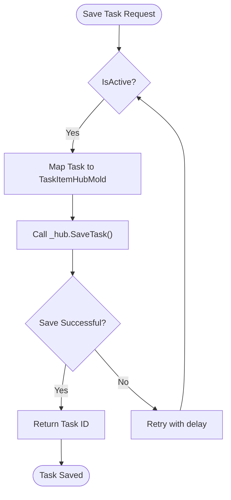

**Diagram sources**
- [ServerTaskStorage.cs](file://src/Unlimotion/ServerTaskStorage.cs#L480-L495)

### Real-time Update Handling

The client subscribes to real-time updates through handler registration:

| Handler Type | Purpose | Message Format |
|--------------|---------|----------------|
| LogOn | Authentication responses | LogOn |
| ReceiveTaskItem | Task updates | ReceiveTaskItem |
| DeleteTaskItem | Task deletions | DeleteTaskItem |

### Client-Side Event Handling

The client implements comprehensive event handling for connection states:

- **OnConnected**: Triggered when connection is established
- **OnDisconnected**: Triggered when connection is lost
- **OnConnectionError**: Triggered for connection-related errors
- **OnSignIn/OnSignOut**: User authentication events

**Section sources**
- [ServerTaskStorage.cs](file://src/Unlimotion/ServerTaskStorage.cs#L110-L170)
- [ServerTaskStorage.cs](file://src/Unlimotion/ServerTaskStorage.cs#L480-L495)
- [ServerTaskStorage.cs](file://src/Unlimotion/ServerTaskStorage.cs#L250-L280)

## Connection Resilience

The Chat API implements robust connection resilience mechanisms to handle network interruptions and maintain reliable real-time communication.

### Automatic Reconnection Strategy

The client implements an intelligent reconnection strategy with exponential backoff:

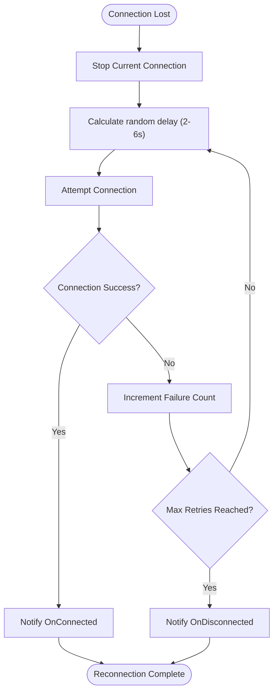

**Diagram sources**
- [ServerTaskStorage.cs](file://src/Unlimotion/ServerTaskStorage.cs#L280-L300)

### Connection State Management

The system maintains precise connection state information:

| State Property | Type | Description |
|----------------|------|-------------|
| IsConnected | bool | Current connection status |
| IsSignedIn | bool | Authentication status |
| IsActive | bool | Client lifecycle status |

### Token Refresh Mechanism

The API automatically handles token refresh during reconnection:

1. **Token Expiration Check**: Verify current token validity
2. **Refresh Token Usage**: Use refresh token for new access token
3. **Session Restoration**: Re-establish user session
4. **Connection Recovery**: Resume normal operation

### Network Error Recovery

The system handles various network error scenarios:

- **SSL/TLS Certificate Issues**: Automatic certificate validation bypass
- **Network Timeouts**: Configurable timeout with retry logic
- **Server Unavailability**: Graceful degradation and retry
- **Authentication Failures**: Automatic token refresh attempts

**Section sources**
- [ServerTaskStorage.cs](file://src/Unlimotion/ServerTaskStorage.cs#L280-L300)
- [ServerTaskStorage.cs](file://src/Unlimotion/ServerTaskStorage.cs#L420-L450)
- [ServerTaskStorage.cs](file://src/Unlimotion/ServerTaskStorage.cs#L450-L480)

## Troubleshooting Guide

This section provides solutions for common issues encountered when working with the Chat API.

### Authentication Issues

**Problem**: Login fails with token validation errors
**Solution**: 
1. Verify JWT token format and signature
2. Check token expiration time
3. Ensure user exists in database
4. Validate session ID matches stored audit

**Problem**: User not found during login
**Solution**:
1. Verify user account exists in system
2. Check user ID format in JWT claims
3. Ensure database connectivity
4. Validate user profile data

### Connection Problems

**Problem**: WebSocket connection fails to establish
**Solution**:
1. Check network connectivity
2. Verify firewall settings allow WebSocket traffic
3. Confirm SSL certificate validation
4. Review server logs for connection errors

**Problem**: Frequent disconnections
**Solution**:
1. Monitor network stability
2. Check for proxy/firewall interference
3. Verify client-side reconnection logic
4. Review server load and capacity

### Real-time Communication Issues

**Problem**: Tasks not syncing between clients
**Solution**:
1. Verify group membership
2. Check broadcast permissions
3. Review message serialization
4. Ensure proper error handling

**Problem**: Display name changes not reflected
**Solution**:
1. Verify UpdateMyDisplayName method call
2. Check group broadcasting
3. Review client-side handlers
4. Validate message format

### Performance Issues

**Problem**: Slow task synchronization
**Solution**:
1. Optimize database queries
2. Reduce message payload size
3. Implement batching for bulk operations
4. Monitor server resource usage

**Problem**: High memory usage
**Solution**:
1. Review connection pooling
2. Implement proper cleanup
3. Monitor client-side caching
4. Optimize message handling

### Debugging Tools

For effective debugging, implement the following monitoring approaches:

1. **Client-side Logging**: Enable detailed client-side logging
2. **Server-side Monitoring**: Use Serilog for structured server logging
3. **Network Analysis**: Monitor WebSocket traffic patterns
4. **Performance Metrics**: Track connection latency and throughput

**Section sources**
- [ChatHub.cs](file://src/Unlimotion.Server/hubs/ChatHub.cs#L195-L197)
- [ServerTaskStorage.cs](file://src/Unlimotion/ServerTaskStorage.cs#L280-L300)
- [ChatHub.cs](file://src/Unlimotion.Server/hubs/ChatHub.cs#L89-L91)