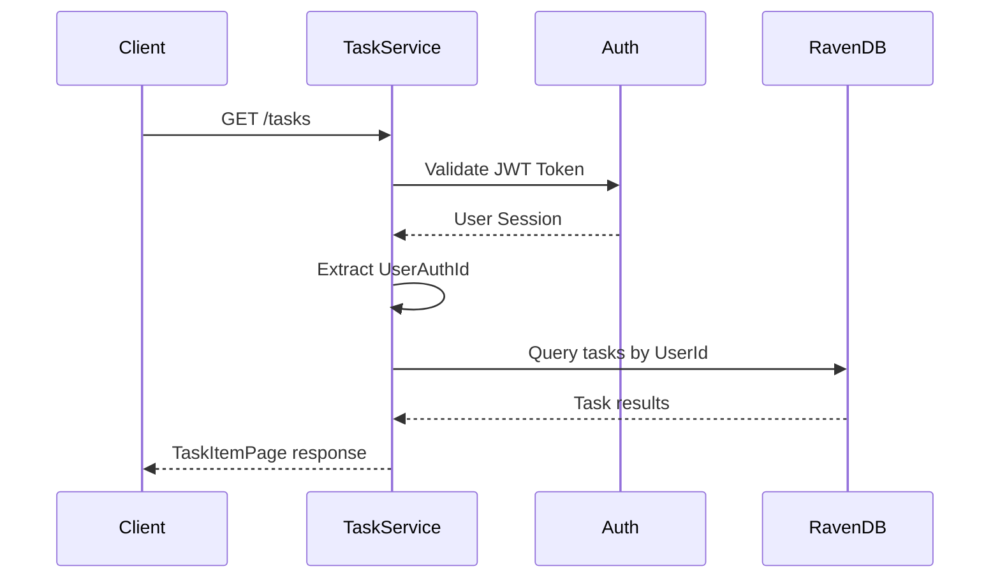
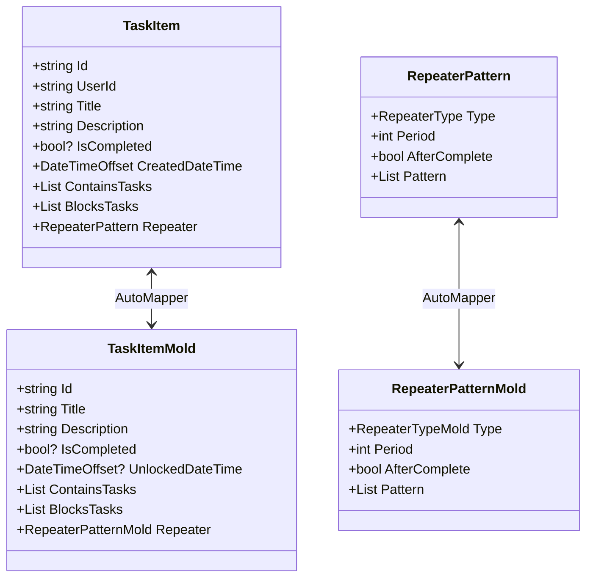
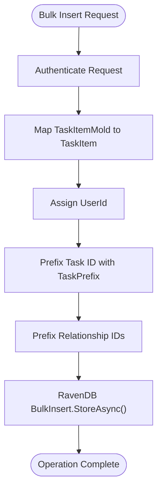

# Task API

<cite>
**Referenced Files in This Document**  
- [TaskService.cs](file://src/Unlimotion.Server.ServiceInterface/TaskService.cs)
- [Task.cs](file://src/Unlimotion.Server.ServiceModel/Task.cs)
- [TaskItemPage.cs](file://src/Unlimotion.Server.ServiceModel/Molds/Tasks/TaskItemPage.cs)
- [TaskItemMold.cs](file://src/Unlimotion.Interface/TaskItemHubMold.cs)
- [TaskItem.cs](file://src/Unlimotion.Domain/TaskItem.cs)
- [AppModelMapping.cs](file://src/Unlimotion.Server/AppModelMapping.cs)
- [RepeaterPatternMold.cs](file://src/Unlimotion.Server.ServiceModel/Molds/Tasks/RepeaterPatternMold.cs)
- [RepeaterTypeMold.cs](file://src/Unlimotion.Server.ServiceModel/Molds/Tasks/RepeaterTypeMold.cs)
</cite>

## Table of Contents
1. [Introduction](#introduction)
2. [API Endpoints](#api-endpoints)
3. [Request/Response Models](#requestresponse-models)
4. [Authentication and Security](#authentication-and-security)
5. [Data Persistence and Transformation](#data-persistence-and-transformation)
6. [Task Relationships and ID Prefixing](#task-relationships-and-id-prefixing)
7. [Bulk Insert Operation](#bulk-insert-operation)
8. [Error Handling](#error-handling)
9. [Client Usage Examples](#client-usage-examples)
10. [URL Encoding Guidelines](#url-encoding-guidelines)

## Introduction
The Task API in Unlimotion provides RESTful endpoints for managing task data through the ServiceStack framework. It supports retrieving individual tasks, fetching all tasks for a user, and performing bulk inserts of task data. The API leverages RavenDB for persistence, AutoMapper for model transformation, and JWT-based authentication for secure access. This documentation details the available endpoints, request/response schemas, authentication mechanisms, and implementation patterns.

**Section sources**
- [TaskService.cs](file://src/Unlimotion.Server.ServiceInterface/TaskService.cs#L1-L70)

## API Endpoints
The Task API exposes three primary endpoints for task management:

### GET /tasks
Retrieves all tasks associated with the authenticated user. This endpoint returns a paginated collection of tasks wrapped in a `TaskItemPage` response object.

### GET /tasks/{Id}
Retrieves a specific task by its identifier. The task ID must be URL-encoded when included in the request path.

### POST /tasks/bulk
Performs a bulk insert of multiple tasks using RavenDB's efficient BulkInsert functionality. This operation is optimized for performance when importing or syncing large volumes of task data.

```mermaid
flowchart TD
Client --> |GET /tasks| GetAllTasks[GetAllTasks Request]
Client --> |GET /tasks/{id}| GetTask[GetTask Request]
Client --> |POST /tasks/bulk| BulkInsert[BulkInsertTasks Request]
GetAllTasks --> TaskService[TaskService]
GetTask --> TaskService
BulkInsert --> TaskService
TaskService --> RavenDB[RavenDB Persistence]
TaskService --> AutoMapper[Model Transformation]
TaskService --> Auth[Authentication]
```

**Diagram sources**
- [TaskService.cs](file://src/Unlimotion.Server.ServiceInterface/TaskService.cs#L15-L70)
- [Task.cs](file://src/Unlimotion.Server.ServiceModel/Task.cs#L1-L44)

**Section sources**
- [Task.cs](file://src/Unlimotion.Server.ServiceModel/Task.cs#L1-L44)
- [TaskService.cs](file://src/Unlimotion.Server.ServiceInterface/TaskService.cs#L15-L70)

## Request/Response Models
The API uses specific data transfer objects for requests and responses, with AutoMapper handling transformation between service models and domain models.

### TaskItemPage
Represents a page of tasks returned by the GetAllTasks endpoint.

| Property | Type | Description |
|---------|------|-------------|
| Tasks | List<TaskItemMold> | Collection of task items |

### TaskItemMold
Serves as the primary data transfer object for task information, mapping to the domain TaskItem model.

| Property | Type | Description |
|---------|------|-------------|
| Id | string | Unique identifier for the task |
| Title | string | Task title |
| Description | string | Task description |
| IsCompleted | bool? | Completion status |
| UnlockedDateTime | DateTimeOffset? | When task becomes available |
| CompletedDateTime | DateTimeOffset? | When task was completed |
| ArchiveDateTime | DateTimeOffset? | When task was archived |
| PlannedBeginDateTime | DateTimeOffset? | Scheduled start time |
| PlannedEndDateTime | DateTimeOffset? | Scheduled end time |
| PlannedDuration | TimeSpan? | Estimated duration |
| ContainsTasks | List<string> | Child task IDs |
| ParentTasks | List<string>? | Parent task IDs |
| BlocksTasks | List<string> | Tasks blocked by this task |
| BlockedByTasks | List<string> | Tasks that block this task |
| Repeater | RepeaterPatternMold | Recurrence pattern |
| Importance | int | Priority level |
| Wanted | bool | Whether task is desired |
| Version | int | Version for concurrency control |
| SortOrder | DateTime | Ordering value |

### RepeaterPatternMold
Defines recurrence patterns for repeating tasks.

| Property | Type | Description |
|---------|------|-------------|
| Type | RepeaterTypeMold | Frequency type (Daily, Weekly, etc.) |
| Period | int | Interval between recurrences |
| AfterComplete | bool | Whether to repeat after completion |
| Pattern | List<int> | Specific pattern details |

### RepeaterTypeMold
Enumeration of recurrence types.

| Value | Description |
|-------|-------------|
| None | No recurrence |
| Daily | Daily recurrence |
| Weekly | Weekly recurrence |
| Monthly | Monthly recurrence |
| Yearly | Yearly recurrence |

### BulkInsertTasks
Request model for bulk task insertion.

| Property | Type | Description |
|---------|------|-------------|
| Tasks | List<TaskItemMold> | Collection of tasks to insert |

**Section sources**
- [TaskItemPage.cs](file://src/Unlimotion.Server.ServiceModel/Molds/Tasks/TaskItemPage.cs#L1-L11)
- [TaskItemHubMold.cs](file://src/Unlimotion.Interface/TaskItemHubMold.cs#L1-L28)
- [RepeaterPatternMold.cs](file://src/Unlimotion.Server.ServiceModel/Molds/Tasks/RepeaterPatternMold.cs#L1-L19)
- [RepeaterTypeMold.cs](file://src/Unlimotion.Server.ServiceModel/Molds/Tasks/RepeaterTypeMold.cs#L1-L21)
- [Task.cs](file://src/Unlimotion.Server.ServiceModel/Task.cs#L39-L44)

## Authentication and Security
All Task API endpoints require authentication via the `[Authenticate]` attribute. The system validates JWT tokens to ensure only authorized users can access task data.

Each request is validated using `Request.ThrowIfUnauthorized()`, which extracts the user session and authenticates the request. The authenticated user's ID is then used to filter tasks, ensuring users can only access their own data.

The UserId from the authenticated session is automatically assigned to tasks during creation and used to scope all queries, providing data isolation between users.



**Diagram sources**
- [TaskService.cs](file://src/Unlimotion.Server.ServiceInterface/TaskService.cs#L15-L70)
- [Task.cs](file://src/Unlimotion.Server.ServiceModel/Task.cs#L1-L44)

**Section sources**
- [TaskService.cs](file://src/Unlimotion.Server.ServiceInterface/TaskService.cs#L15-L70)

## Data Persistence and Transformation
The Task API uses RavenDB as the document database for task persistence and AutoMapper for model transformation between service and domain layers.

### RavenDB Integration
The service injects `IAsyncDocumentSession` and `IDocumentStore` dependencies for database operations:
- `RavenSession` handles query operations
- `DocumentStore` enables bulk insert operations

### AutoMapper Configuration
Model transformation between `TaskItem` (domain) and `TaskItemMold` (service model) is configured in `AppModelMapping`:



**Diagram sources**
- [TaskItem.cs](file://src/Unlimotion.Domain/TaskItem.cs#L1-L31)
- [TaskItemHubMold.cs](file://src/Unlimotion.Interface/TaskItemHubMold.cs#L1-L28)
- [AppModelMapping.cs](file://src/Unlimotion.Server/AppModelMapping.cs#L34-L35)

**Section sources**
- [TaskItem.cs](file://src/Unlimotion.Domain/TaskItem.cs#L1-L31)
- [AppModelMapping.cs](file://src/Unlimotion.Server/AppModelMapping.cs#L1-L51)

## Task Relationships and ID Prefixing
The API handles task relationships through ID prefixing to maintain referential integrity in RavenDB.

### Relationship Properties
- `ContainsTasks`: IDs of child tasks contained by this task
- `BlocksTasks`: IDs of tasks blocked by this task
- `ParentTasks`: IDs of parent tasks
- `BlockedByTasks`: IDs of tasks blocking this task

### ID Prefixing Strategy
All task IDs are prefixed with "TaskItem/" in the database to:
1. Ensure unique document IDs in RavenDB
2. Enable efficient querying and indexing
3. Prevent ID collisions

When inserting tasks, the service automatically prefixes IDs:
```csharp
task.Id = $"{TaskPrefix}{task.Id}";
if (task.BlocksTasks != null)
{
    task.BlocksTasks = task.BlocksTasks.Select(s => $"{TaskPrefix}{s}").ToList();
}
```

This prefixing ensures all task references maintain consistency within the document database.

**Section sources**
- [TaskService.cs](file://src/Unlimotion.Server.ServiceInterface/TaskService.cs#L60-L68)
- [TaskItem.cs](file://src/Unlimotion.Domain/TaskItem.cs#L1-L31)

## Bulk Insert Operation
The BulkInsertTasks endpoint leverages RavenDB's BulkInsert functionality for high-performance data import.

### Implementation Pattern
1. Authenticate the request and extract user ID
2. Map `TaskItemMold` objects to `TaskItem` domain objects
3. Assign user ID and prefix all task IDs
4. Prefix IDs in relationship collections (ContainsTasks, BlocksTasks)
5. Use RavenDB's `BulkInsert` for efficient database insertion

### Performance Benefits
- Reduced network round trips
- Optimized database write operations
- Transactional batch processing
- Memory-efficient streaming

The bulk insert operation is particularly useful for:
- Initial data migration
- Synchronization between clients
- Importing large task sets



**Diagram sources**
- [TaskService.cs](file://src/Unlimotion.Server.ServiceInterface/TaskService.cs#L50-L70)

**Section sources**
- [TaskService.cs](file://src/Unlimotion.Server.ServiceInterface/TaskService.cs#L50-L70)

## Error Handling
The API implements comprehensive error handling for various failure scenarios.

### Authentication Errors
- **401 Unauthorized**: Invalid or missing JWT token
- Handled by `[Authenticate]` attribute and `ThrowIfUnauthorized()`

### Data Validation Errors
- **400 Bad Request**: Invalid request structure
- Documented via `ApiResponse` attributes

### Implementation Issues
- Null reference protection in relationship collections
- Proper async/await pattern usage
- Try-catch blocks for database operations

The service returns appropriate HTTP status codes and error messages to help clients diagnose issues. The `ApiResponse` attribute in the service model documents expected error responses.

**Section sources**
- [TaskService.cs](file://src/Unlimotion.Server.ServiceInterface/TaskService.cs#L15-L70)
- [Task.cs](file://src/Unlimotion.Server.ServiceModel/Task.cs#L5-L8)

## Client Usage Examples
### Retrieving All Tasks
```http
GET /tasks HTTP/1.1
Host: api.unlimotion.com
Authorization: Bearer <jwt_token>
Accept: application/json
```

### Retrieving Specific Task
```http
GET /tasks/TaskItem%2F12345 HTTP/1.1
Host: api.unlimotion.com
Authorization: Bearer <jwt_token>
Accept: application/json
```

### Bulk Insert Tasks
```http
POST /tasks/bulk HTTP/1.1
Host: api.unlimotion.com
Authorization: Bearer <jwt_token>
Content-Type: application/json
Accept: application/json

{
  "Tasks": [
    {
      "Id": "12345",
      "Title": "Complete documentation",
      "IsCompleted": false,
      "ContainsTasks": ["67890"],
      "BlocksTasks": ["54321"]
    }
  ]
}
```

**Section sources**
- [TaskService.cs](file://src/Unlimotion.Server.ServiceInterface/TaskService.cs#L15-L70)
- [Task.cs](file://src/Unlimotion.Server.ServiceModel/Task.cs#L1-L44)

## URL Encoding Guidelines
Task IDs must be properly URL-encoded when used in request paths:

### Encoding Rules
- Space → %20
- Forward slash (/) → %2F
- Backslash (\) → %5C
- Hash (#) → %23

### Example
For a task with ID "TaskItem/12345":
- **Correct**: `/tasks/TaskItem%2F12345`
- **Incorrect**: `/tasks/TaskItem/12345` (causes 404)

The server decodes IDs using `WebUtility.UrlDecode()` before querying the database:

```csharp
var decodedId = WebUtility.UrlDecode(request.Id);
```

Clients should ensure proper encoding of task IDs in all GET requests to avoid routing errors.

**Section sources**
- [TaskService.cs](file://src/Unlimotion.Server.ServiceInterface/TaskService.cs#L37-L38)