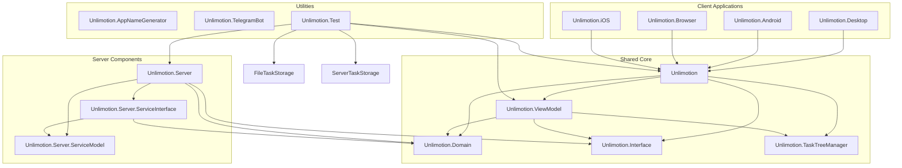
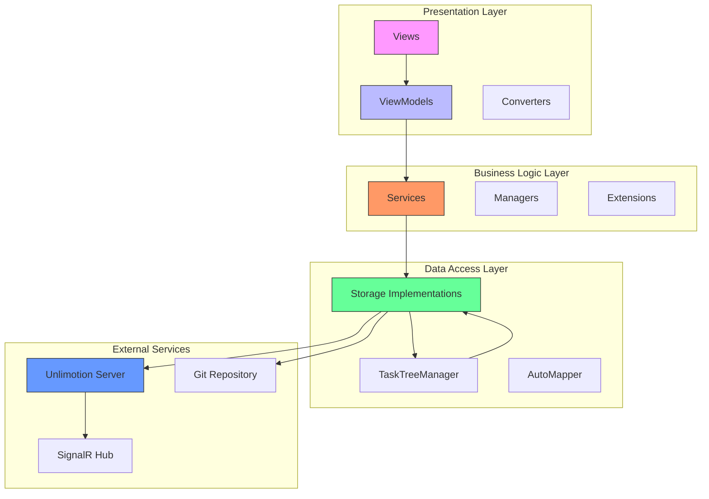
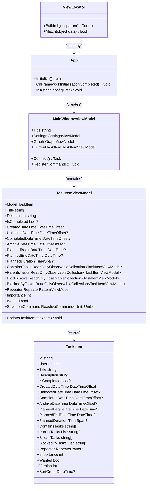
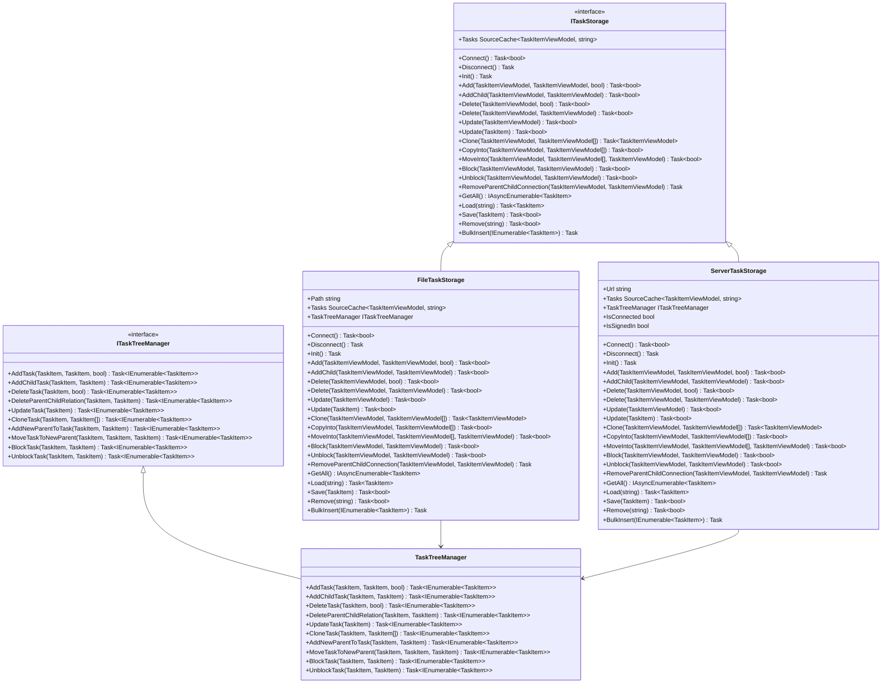
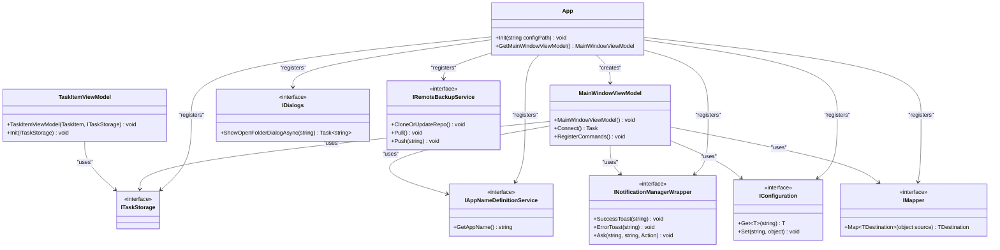
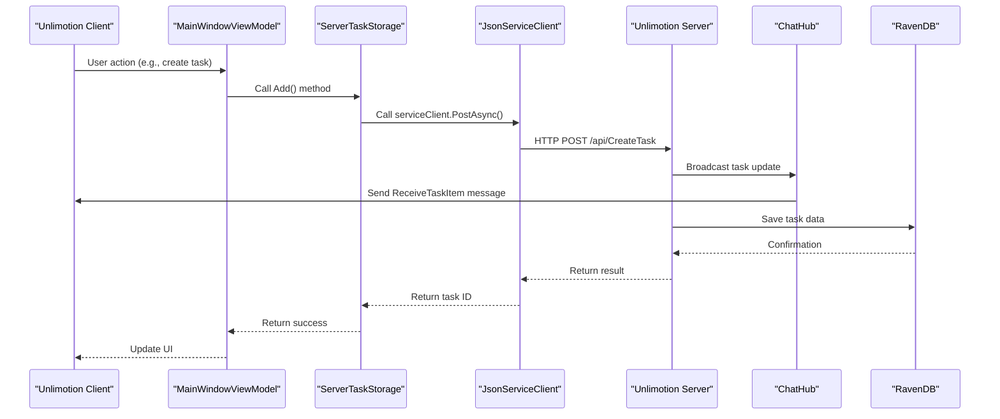
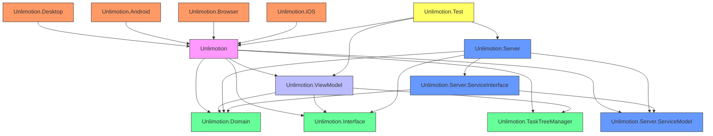

# Architecture Overview

<cite>
**Referenced Files in This Document**   
- [App.axaml.cs](file://src/Unlimotion/App.axaml.cs)
- [MainWindowViewModel.cs](file://src/Unlimotion.ViewModel/MainWindowViewModel.cs)
- [TaskItemViewModel.cs](file://src/Unlimotion.ViewModel/TaskItemViewModel.cs)
- [AppModelMapping.cs](file://src/Unlimotion/AppModelMapping.cs)
- [TaskStorages.cs](file://src/Unlimotion/TaskStorages.cs)
- [ServerTaskStorage.cs](file://src/Unlimotion/ServerTaskStorage.cs)
- [FileTaskStorage.cs](file://src/Unlimotion/FileTaskStorage.cs)
- [AppHost.cs](file://src/Unlimotion.Server/AppHost.cs)
- [TaskItem.cs](file://src/Unlimotion.Domain/TaskItem.cs)
- [ViewLocator.cs](file://src/Unlimotion/ViewLocator.cs)
- [AppExtensions.cs](file://src/Unlimotion/AppExtensions.cs)
- [ClientSettings.cs](file://src/Unlimotion/ClientSettings.cs)
- [TaskStorageSettings.cs](file://src/Unlimotion/TaskStorageSettings.cs)
- [AppSettings.cs](file://src/Unlimotion.Server/AppSettings.cs)
</cite>

## Table of Contents
1. [Introduction](#introduction)
2. [Project Structure](#project-structure)
3. [Core Components](#core-components)
4. [Architecture Overview](#architecture-overview)
5. [Detailed Component Analysis](#detailed-component-analysis)
6. [Dependency Analysis](#dependency-analysis)
7. [Performance Considerations](#performance-considerations)
8. [Troubleshooting Guide](#troubleshooting-guide)
9. [Conclusion](#conclusion)

## Introduction
The Unlimotion application is a cross-platform task management system built using modern .NET technologies with a clear separation of concerns through the MVVM (Model-View-ViewModel) architectural pattern. The application leverages AvaloniaUI for cross-platform UI development, ReactiveUI for reactive programming, and Splat for dependency injection. It features both local file-based and server-based data storage options, with synchronization capabilities via Git and a SignalR-based real-time communication system. The architecture emphasizes separation between UI, business logic, and data access layers, with well-defined interfaces and dependency inversion principles applied throughout the codebase.

## Project Structure
The Unlimotion application follows a modular, layered architecture with distinct components separated into different projects within the solution. The structure demonstrates a clear separation between platform-specific implementations, shared business logic, domain models, and server-side components.

**Diagram sources**
- [Unlimotion.sln](file://src/Unlimotion.sln)
- [Directory.Build.props](file://src/Directory.Build.props)

**Section sources**
- [Unlimotion.sln](file://src/Unlimotion.sln)
- [Directory.Build.props](file://src/Directory.Build.props)

## Core Components
The Unlimotion application is built around several core components that implement the MVVM pattern and facilitate communication between the UI, business logic, and data layers. The application uses Splat for dependency injection, ReactiveUI for reactive programming, and follows a clean separation between concerns. The main components include the App class for application initialization, MainWindowViewModel for managing the main window's state and behavior, TaskItemViewModel for individual task management, and various storage implementations for data persistence.

**Section sources**
- [App.axaml.cs](file://src/Unlimotion/App.axaml.cs)
- [MainWindowViewModel.cs](file://src/Unlimotion.ViewModel/MainWindowViewModel.cs)
- [TaskItemViewModel.cs](file://src/Unlimotion.ViewModel/TaskItemViewModel.cs)

## Architecture Overview
The Unlimotion application follows a layered architecture based on the MVVM (Model-View-ViewModel) pattern, with clear separation between UI, business logic, and data access layers. The architecture leverages AvaloniaUI for cross-platform UI development, ReactiveUI for reactive programming, and Splat for dependency injection. The system supports both local file-based storage and server-based storage with real-time synchronization via SignalR.

**Diagram sources**
- [App.axaml.cs](file://src/Unlimotion/App.axaml.cs)
- [MainWindowViewModel.cs](file://src/Unlimotion.ViewModel/MainWindowViewModel.cs)
- [TaskStorages.cs](file://src/Unlimotion/TaskStorages.cs)
- [ServerTaskStorage.cs](file://src/Unlimotion/ServerTaskStorage.cs)
- [FileTaskStorage.cs](file://src/Unlimotion/FileTaskStorage.cs)

**Section sources**
- [App.axaml.cs](file://src/Unlimotion/App.axaml.cs)
- [MainWindowViewModel.cs](file://src/Unlimotion.ViewModel/MainWindowViewModel.cs)
- [TaskStorages.cs](file://src/Unlimotion/TaskStorages.cs)

## Detailed Component Analysis

### MVVM Architecture Implementation
The Unlimotion application implements the MVVM (Model-View-ViewModel) pattern with a clear separation between the UI (View), business logic (ViewModel), and data (Model). The ViewLocator class automatically resolves views from viewmodels by convention, following the naming pattern where "ViewModel" is replaced with "View" in the class name.

**Diagram sources**
- [ViewLocator.cs](file://src/Unlimotion/ViewLocator.cs)
- [App.axaml.cs](file://src/Unlimotion/App.axaml.cs)
- [MainWindowViewModel.cs](file://src/Unlimotion.ViewModel/MainWindowViewModel.cs)
- [TaskItemViewModel.cs](file://src/Unlimotion.ViewModel/TaskItemViewModel.cs)
- [TaskItem.cs](file://src/Unlimotion.Domain/TaskItem.cs)

**Section sources**
- [ViewLocator.cs](file://src/Unlimotion/ViewLocator.cs)
- [App.axaml.cs](file://src/Unlimotion/App.axaml.cs)
- [MainWindowViewModel.cs](file://src/Unlimotion.ViewModel/MainWindowViewModel.cs)
- [TaskItemViewModel.cs](file://src/Unlimotion.ViewModel/TaskItemViewModel.cs)

### Data Storage and Synchronization
The Unlimotion application supports multiple data storage backends through a common interface, allowing users to choose between local file-based storage and server-based storage. The ITaskStorage interface defines the contract for task operations, with FileTaskStorage and ServerTaskStorage providing concrete implementations. The system uses a task tree manager to handle complex relationships between tasks, such as parent-child and blocking relationships.

**Diagram sources**
- [ITaskStorage.cs](file://src/Unlimotion.ViewModel/ITaskStorage.cs)
- [FileTaskStorage.cs](file://src/Unlimotion/FileTaskStorage.cs)
- [ServerTaskStorage.cs](file://src/Unlimotion/ServerTaskStorage.cs)
- [ITaskTreeManager.cs](file://src/Unlimotion.TaskTreeManager/ITaskTreeManager.cs)
- [TaskTreeManager.cs](file://src/Unlimotion.TaskTreeManager/TaskTreeManager.cs)

**Section sources**
- [FileTaskStorage.cs](file://src/Unlimotion/FileTaskStorage.cs)
- [ServerTaskStorage.cs](file://src/Unlimotion/ServerTaskStorage.cs)
- [TaskTreeManager.cs](file://src/Unlimotion.TaskTreeManager/TaskTreeManager.cs)

### Dependency Injection and Reactive Programming
The Unlimotion application uses Splat as its dependency injection framework, registering services and components in the Locator.CurrentMutable container. The application leverages ReactiveUI for reactive programming, enabling automatic UI updates in response to data changes. The architecture follows the reactive paradigm, with observables and reactive commands used extensively throughout the codebase to manage state changes and user interactions.

**Diagram sources**
- [App.axaml.cs](file://src/Unlimotion/App.axaml.cs)
- [MainWindowViewModel.cs](file://src/Unlimotion.ViewModel/MainWindowViewModel.cs)
- [TaskItemViewModel.cs](file://src/Unlimotion.ViewModel/TaskItemViewModel.cs)
- [TaskStorages.cs](file://src/Unlimotion/TaskStorages.cs)

**Section sources**
- [App.axaml.cs](file://src/Unlimotion/App.axaml.cs)
- [TaskStorages.cs](file://src/Unlimotion/TaskStorages.cs)

### Server Integration and API Design
The Unlimotion server is built using ServiceStack, providing a RESTful API for task management operations. The server uses JWT authentication for secure access, with token-based authentication and refresh mechanisms. The API design follows a service-oriented architecture with clear separation between service interfaces, service models, and data models. SignalR is used for real-time communication between clients and the server, enabling instant synchronization of task changes across all connected clients.

**Diagram sources**
- [App.axaml.cs](file://src/Unlimotion/App.axaml.cs)
- [MainWindowViewModel.cs](file://src/Unlimotion.ViewModel/MainWindowViewModel.cs)
- [ServerTaskStorage.cs](file://src/Unlimotion/ServerTaskStorage.cs)
- [AppHost.cs](file://src/Unlimotion.Server/AppHost.cs)
- [ChatHub.cs](file://src/Unlimotion.Server/hubs/ChatHub.cs)

**Section sources**
- [ServerTaskStorage.cs](file://src/Unlimotion/ServerTaskStorage.cs)
- [AppHost.cs](file://src/Unlimotion.Server/AppHost.cs)

## Dependency Analysis
The Unlimotion application has a well-structured dependency graph that follows the dependency inversion principle. Core interfaces are defined in shared libraries, with concrete implementations provided in specific projects. This allows for loose coupling between components and facilitates testing and extensibility.

**Diagram sources**
- [Unlimotion.csproj](file://src/Unlimotion/Unlimotion.csproj)
- [Unlimotion.ViewModel.csproj](file://src/Unlimotion.ViewModel/Unlimotion.ViewModel.csproj)
- [Unlimotion.Domain.csproj](file://src/Unlimotion.Domain/Unlimotion.Domain.csproj)
- [Unlimotion.Interface.csproj](file://src/Unlimotion.Interface/Unlimotion.Interface.csproj)
- [Unlimotion.TaskTree.csproj](file://src/Unlimotion.TaskTreeManager/Unlimotion.TaskTree.csproj)
- [Unlimotion.Server.csproj](file://src/Unlimotion.Server/Unlimotion.Server.csproj)
- [Unlimotion.Server.ServiceInterface.csproj](file://src/Unlimotion.Server.ServiceInterface/Unlimotion.Server.ServiceInterface.csproj)
- [Unlimotion.Server.ServiceModel.csproj](file://src/Unlimotion.Server.ServiceModel/Unlimotion.Server.ServiceModel.csproj)
- [Unlimotion.Desktop.csproj](file://src/Unlimotion.Desktop/Unlimotion.Desktop.csproj)
- [Unlimotion.Android.csproj](file://src/Unlimotion.Android/Unlimotion.Android.csproj)
- [Unlimotion.Browser.csproj](file://src/Unlimotion.Browser/Unlimotion.Browser.csproj)
- [Unlimotion.iOS.csproj](file://src/Unlimotion.iOS/Unlimotion.iOS.csproj)
- [Unlimotion.Test.csproj](file://src/Unlimotion.Test/Unlimotion.Test.csproj)

**Section sources**
- [Unlimotion.csproj](file://src/Unlimotion/Unlimotion.csproj)
- [Unlimotion.ViewModel.csproj](file://src/Unlimotion.ViewModel/Unlimotion.ViewModel.csproj)
- [Unlimotion.Domain.csproj](file://src/Unlimotion.Domain/Unlimotion.Domain.csproj)

## Performance Considerations
The Unlimotion application implements several performance optimizations to ensure responsive user experience, particularly when dealing with large numbers of tasks. The application uses reactive programming patterns with throttling to prevent excessive updates, employs caching mechanisms to minimize redundant operations, and leverages efficient data structures for task management.

The TaskItemViewModel class implements property change throttling with a default interval of 10 seconds, preventing excessive save operations when multiple properties are changed in quick succession. The application also uses SourceCache from the DynamicData library to efficiently manage collections of tasks, providing optimized filtering, sorting, and transformation operations.

For data persistence, the FileTaskStorage implementation uses a directory-based storage system where each task is stored in a separate JSON file, allowing for efficient individual task operations without loading the entire dataset. The ServerTaskStorage implementation uses a combination of local caching and server synchronization to minimize network requests and provide responsive UI updates.

**Section sources**
- [TaskItemViewModel.cs](file://src/Unlimotion.ViewModel/TaskItemViewModel.cs)
- [FileTaskStorage.cs](file://src/Unlimotion/FileTaskStorage.cs)
- [ServerTaskStorage.cs](file://src/Unlimotion/ServerTaskStorage.cs)

## Troubleshooting Guide
When encountering issues with the Unlimotion application, consider the following common problems and solutions:

1. **Connection issues with server storage**: Verify that the server URL is correctly configured in the TaskStorage settings. Check that the server is running and accessible from the client machine. Ensure that SSL/TLS certificates are properly configured, as the application bypasses certificate validation in development mode.

2. **Authentication failures**: Ensure that valid login credentials are provided in the TaskStorage settings. The application will attempt to register a new user if the specified credentials are not found on the server. Check that the JWT token has not expired and that the refresh token mechanism is functioning correctly.

3. **Data synchronization problems**: When using Git-based backup, verify that the remote repository URL, branch, and authentication credentials are correctly configured. Check that the Git service has the necessary permissions to push and pull from the repository.

4. **Performance issues with large datasets**: The application may experience performance degradation when managing a large number of tasks. Consider using server-based storage for better performance with large datasets, as it provides more efficient querying and indexing capabilities compared to the file-based storage.

5. **UI update problems**: If the UI is not updating correctly in response to data changes, verify that the reactive programming patterns are properly implemented. Check that property change notifications are being raised correctly and that the appropriate observables are subscribed to.

**Section sources**
- [ServerTaskStorage.cs](file://src/Unlimotion/ServerTaskStorage.cs)
- [FileTaskStorage.cs](file://src/Unlimotion/FileTaskStorage.cs)
- [TaskStorages.cs](file://src/Unlimotion/TaskStorages.cs)
- [App.axaml.cs](file://src/Unlimotion/App.axaml.cs)

## Conclusion
The Unlimotion application demonstrates a well-architected MVVM implementation with clear separation of concerns, leveraging modern .NET technologies for cross-platform development. The architecture effectively combines AvaloniaUI for UI development, ReactiveUI for reactive programming, and Splat for dependency injection, creating a maintainable and extensible codebase.

The application's support for multiple storage backends (local file and server-based) provides flexibility for different deployment scenarios, while the use of ServiceStack for the server API and SignalR for real-time communication enables robust client-server interactions. The integration of Git for backup and synchronization adds an additional layer of data protection and collaboration capabilities.

Key architectural strengths include the consistent application of the MVVM pattern, the use of reactive programming for responsive UI updates, and the modular design that facilitates testing and maintenance. The application could benefit from additional documentation and more comprehensive error handling, particularly in edge cases related to network connectivity and data synchronization.

Overall, the Unlimotion application represents a sophisticated task management solution with a solid architectural foundation that supports its cross-platform capabilities and rich feature set.