# Architecture

<cite>
**Referenced Files in This Document**   
- [App.axaml.cs](file://src/Unlimotion/App.axaml.cs)
- [ApplicationViewModel.cs](file://src/Unlimotion/ApplicationViewModel.cs)
- [MainWindowViewModel.cs](file://src/Unlimotion.ViewModel/MainWindowViewModel.cs)
- [TaskTreeManager.cs](file://src/Unlimotion.TaskTreeManager/TaskTreeManager.cs)
- [ITaskTreeManager.cs](file://src/Unlimotion.TaskTreeManager/ITaskTreeManager.cs)
- [IStorage.cs](file://src/Unlimotion.TaskTreeManager/IStorage.cs)
- [TaskItem.cs](file://src/Unlimotion.Domain/TaskItem.cs)
- [TaskService.cs](file://src/Unlimotion.Server.ServiceInterface/TaskService.cs)
- [Task.cs](file://src/Unlimotion.Server.ServiceModel/Task.cs)
- [Program.cs](file://src/Unlimotion.Server/Program.cs)
- [Unlimotion.csproj](file://src/Unlimotion/Unlimotion.csproj)
- [Unlimotion.Domain.csproj](file://src/Unlimotion.Domain/Unlimotion.Domain.csproj)
- [Unlimotion.TaskTree.csproj](file://src/Unlimotion.TaskTreeManager/Unlimotion.TaskTree.csproj)
- [Unlimotion.ViewModel.csproj](file://src/Unlimotion.ViewModel/Unlimotion.ViewModel.csproj)
- [Unlimotion.Server.csproj](file://src/Unlimotion.Server/Unlimotion.Server.csproj)
</cite>

## Table of Contents
1. [Introduction](#introduction)
2. [Project Structure](#project-structure)
3. [Core Components](#core-components)
4. [Architecture Overview](#architecture-overview)
5. [Detailed Component Analysis](#detailed-component-analysis)
6. [Dependency Analysis](#dependency-analysis)
7. [Performance Considerations](#performance-considerations)
8. [Troubleshooting Guide](#troubleshooting-guide)
9. [Conclusion](#conclusion)

## Introduction
Unlimotion is a full-stack personal productivity application designed with a modular architecture to support multiple client interfaces (desktop, web, mobile) connecting to a central server backend. The system implements the MVVM (Model-View-ViewModel) architectural pattern across all UI components, with Views defined in Avalonia XAML files binding to ViewModels in the Unlimotion.ViewModel project. The architecture separates concerns across distinct layers: domain entities in Unlimotion.Domain, business logic in Unlimotion.TaskTreeManager, service interfaces in Unlimotion.Server.ServiceInterface, and data transfer models in Unlimotion.Server.ServiceModel. Dependency injection is implemented using Splat for service registration and resolution across components. The system supports cross-platform access through Avalonia for desktop, custom Android/iOS projects for mobile, and WebAssembly for browser access, with real-time synchronization via SignalR and Git-based backup workflows.

## Project Structure

**Diagram sources**
- [Unlimotion.csproj](file://src/Unlimotion/Unlimotion.csproj)
- [Unlimotion.Domain.csproj](file://src/Unlimotion.Domain/Unlimotion.Domain.csproj)
- [Unlimotion.TaskTree.csproj](file://src/Unlimotion.TaskTreeManager/Unlimotion.TaskTree.csproj)
- [Unlimotion.ViewModel.csproj](file://src/Unlimotion.ViewModel/Unlimotion.ViewModel.csproj)
- [Unlimotion.Server.csproj](file://src/Unlimotion.Server/Unlimotion.Server.csproj)

**Section sources**
- [Unlimotion.csproj](file://src/Unlimotion/Unlimotion.csproj)
- [Unlimotion.Domain.csproj](file://src/Unlimotion.Domain/Unlimotion.Domain.csproj)
- [Unlimotion.TaskTree.csproj](file://src/Unlimotion.TaskTreeManager/Unlimotion.TaskTree.csproj)

## Core Components

The Unlimotion architecture is built around several core components that implement a clean separation of concerns. The MVVM pattern is consistently applied across all client interfaces, with XAML-based Views in the Unlimotion project binding to ViewModels in the Unlimotion.ViewModel project. Business logic is encapsulated in the Unlimotion.TaskTreeManager, which implements the ITaskTreeManager interface to manage task relationships, availability calculations, and state transitions. Domain entities are defined in Unlimotion.Domain, while service interfaces and data transfer models are separated into Unlimotion.Server.ServiceInterface and Unlimotion.Server.ServiceModel respectively. The Splat library provides dependency injection capabilities, allowing for loose coupling between components and facilitating testability.

**Section sources**
- [App.axaml.cs](file://src/Unlimotion/App.axaml.cs)
- [MainWindowViewModel.cs](file://src/Unlimotion.ViewModel/MainWindowViewModel.cs)
- [TaskTreeManager.cs](file://src/Unlimotion.TaskTreeManager/TaskTreeManager.cs)
- [TaskItem.cs](file://src/Unlimotion.Domain/TaskItem.cs)

## Architecture Overview

**Diagram sources**
- [App.axaml.cs](file://src/Unlimotion/App.axaml.cs)
- [TaskService.cs](file://src/Unlimotion.Server.ServiceInterface/TaskService.cs)
- [Program.cs](file://src/Unlimotion.Server/Program.cs)

## Detailed Component Analysis

### MVVM Architecture Implementation

The MVVM pattern is implemented across all client interfaces with a clear separation between Views, ViewModels, and business logic. Views are defined in Avalonia XAML files within the Unlimotion project, while corresponding ViewModels are implemented in the Unlimotion.ViewModel project. Data binding connects View elements to ViewModel properties and commands, with the Splat dependency injection framework resolving ViewModel instances.

**Diagram sources**
- [MainWindowViewModel.cs](file://src/Unlimotion.ViewModel/MainWindowViewModel.cs)
- [App.axaml.cs](file://src/Unlimotion/App.axaml.cs)

### Business Logic Layer

The Unlimotion.TaskTreeManager implements the core business logic for task management, including task creation, deletion, relationship management, and availability calculations. The ITaskTreeManager interface defines operations for manipulating task hierarchies and state transitions, with implementations that ensure data consistency through transactional operations.

**Diagram sources**
- [TaskTreeManager.cs](file://src/Unlimotion.TaskTreeManager/TaskTreeManager.cs)
- [ITaskTreeManager.cs](file://src/Unlimotion.TaskTreeManager/ITaskTreeManager.cs)
- [IStorage.cs](file://src/Unlimotion.TaskTreeManager/IStorage.cs)
- [TaskItem.cs](file://src/Unlimotion.Domain/TaskItem.cs)

### Server-Client Communication

The server-client communication architecture uses ServiceStack for RESTful API endpoints and SignalR for real-time updates. The Unlimotion.Server project hosts the ASP.NET Core application with ServiceStack services that handle CRUD operations on tasks, while SignalR enables push notifications for data synchronization across connected clients.

**Diagram sources**
- [TaskService.cs](file://src/Unlimotion.Server.ServiceInterface/TaskService.cs)
- [Task.cs](file://src/Unlimotion.Server.ServiceModel/Task.cs)
- [MainWindowViewModel.cs](file://src/Unlimotion.ViewModel/MainWindowViewModel.cs)

### Data Flow and State Management

The data flow in Unlimotion follows a unidirectional pattern from user interaction through ViewModel commands to business logic processing and persistent storage. State management is implemented through observable collections and reactive programming patterns, ensuring UI consistency across multiple views.

```mermaid
flowchart TD
UserInteraction["User Interaction\n(Create, Update, Delete)"] --> ViewModelCommand["ViewModel Command\n(ReactiveCommand)"]
ViewModelCommand --> BusinessLogic["Business Logic\n(TaskTreeManager)"]
BusinessLogic --> StorageOperation["Storage Operation\n(IStorage Implementation)"]
StorageOperation --> Persistence["Persistent Storage\n(RavenDB or File)"]
Persistence --> Notification["Change Notification\n(Observable Collection)"]
Notification --> UIUpdate["UI Update\n(Data Binding)"]
Persistence --> SignalR["SignalR Broadcast\n(Real-time Sync)"]
SignalR --> OtherClients["Other Connected Clients"]
OtherClients --> OtherViewModels["Other Client ViewModels"]
OtherViewModels --> OtherUI["Other Client UI Updates"]
style UserInteraction fill:#e1f3fb,stroke:#333
style ViewModelCommand fill:#fff2cc,stroke:#333
style BusinessLogic fill:#d5e8d4,stroke:#333
style StorageOperation fill:#d5e8d4,stroke:#333
style Persistence fill:#f8cecc,stroke:#333
style Notification fill:#fff2cc,stroke:#333
style UIUpdate fill:#e1f3fb,stroke:#333
style SignalR fill:#fff2cc,stroke:#333
style OtherClients fill:#e1f3fb,stroke:#333
style OtherViewModels fill:#fff2cc,stroke:#333
style OtherUI fill:#e1f3fb,stroke:#333
```

**Diagram sources**
- [MainWindowViewModel.cs](file://src/Unlimotion.ViewModel/MainWindowViewModel.cs)
- [TaskTreeManager.cs](file://src/Unlimotion.TaskTreeManager/TaskTreeManager.cs)
- [IStorage.cs](file://src/Unlimotion.TaskTreeManager/IStorage.cs)

## Dependency Analysis

**Diagram sources**
- [Unlimotion.csproj](file://src/Unlimotion/Unlimotion.csproj)
- [Unlimotion.Domain.csproj](file://src/Unlimotion.Domain/Unlimotion.Domain.csproj)
- [Unlimotion.TaskTree.csproj](file://src/Unlimotion.TaskTreeManager/Unlimotion.TaskTree.csproj)
- [Unlimotion.ViewModel.csproj](file://src/Unlimotion.ViewModel/Unlimotion.ViewModel.csproj)
- [Unlimotion.Server.csproj](file://src/Unlimotion.Server/Unlimotion.Server.csproj)

## Performance Considerations

The Unlimotion architecture incorporates several performance optimizations to ensure responsive user experiences. The use of observable collections with reactive programming patterns minimizes unnecessary UI updates by only propagating changes when data actually changes. The TaskTreeManager implements retry policies with Polly for resilient database operations, preventing transient failures from affecting user experience. RavenDB is used as the primary database backend, providing efficient document storage and querying capabilities with built-in indexing. For offline scenarios, file-based storage provides fast local access with periodic synchronization to the central server. The MVVM pattern with compiled bindings in Avalonia ensures efficient data binding performance, while the separation of concerns allows for targeted optimizations in specific components without affecting the overall system architecture.

## Troubleshooting Guide

Common issues in the Unlimotion system typically relate to connectivity, data synchronization, or configuration. Connection errors to the server backend can occur when the RavenDB instance is unavailable or network connectivity is interrupted; these are handled by the ITaskStorage implementation with retry logic and user notifications. Data synchronization issues between clients may arise from SignalR connection problems, which are mitigated by periodic polling fallback mechanisms. Configuration issues often relate to Git backup settings or server connection parameters, which are managed through the WritableJsonConfiguration system that persists settings across application restarts. When debugging issues, developers should first check the Serilog output for server-side errors, then verify client-server connectivity, and finally examine the local storage state to identify data consistency issues.

**Section sources**
- [App.axaml.cs](file://src/Unlimotion/App.axaml.cs)
- [TaskTreeManager.cs](file://src/Unlimotion.TaskTreeManager/TaskTreeManager.cs)
- [Program.cs](file://src/Unlimotion.Server/Program.cs)

## Conclusion

Unlimotion's architecture demonstrates a well-structured, full-stack application design that effectively separates concerns across multiple layers while maintaining flexibility for cross-platform deployment. The consistent application of the MVVM pattern across all client interfaces ensures a uniform development experience and facilitates code reuse. The separation of domain models, business logic, service interfaces, and data transfer objects creates a maintainable architecture that can evolve over time. The use of modern technologies like Avalonia, RavenDB, ServiceStack, and SignalR provides a robust foundation for a responsive, real-time productivity application. The dependency injection system using Splat enables loose coupling between components, improving testability and maintainability. Overall, the architecture successfully balances complexity with functionality, providing a scalable solution for personal task management across multiple devices and platforms.