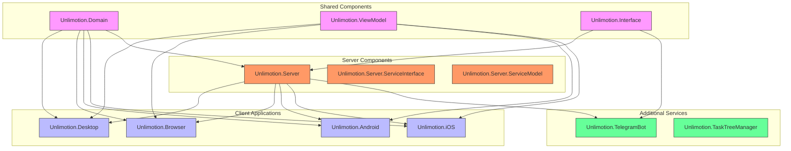
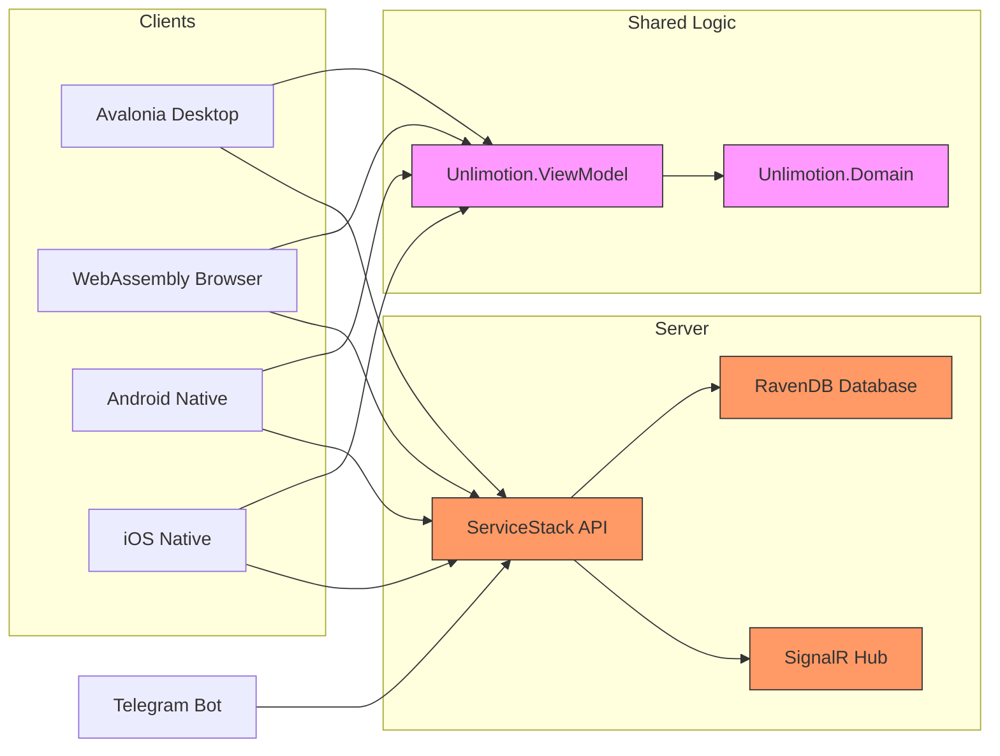
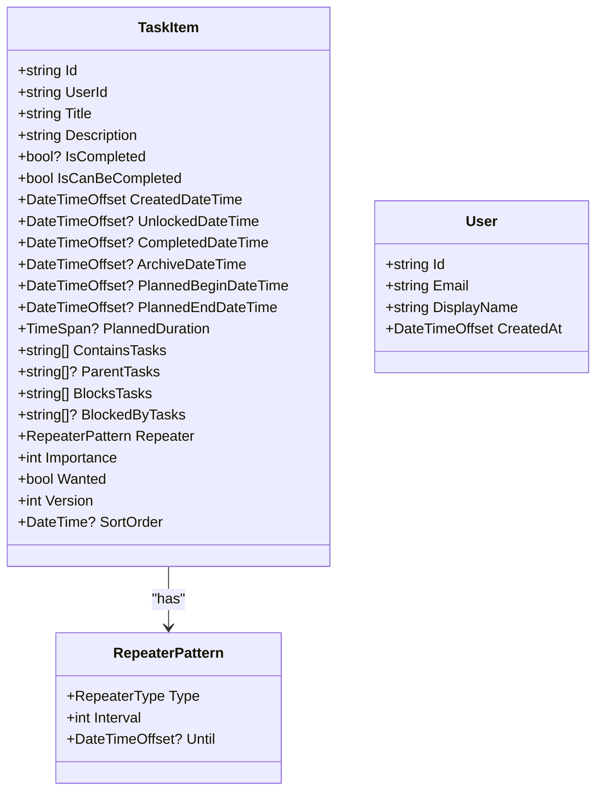
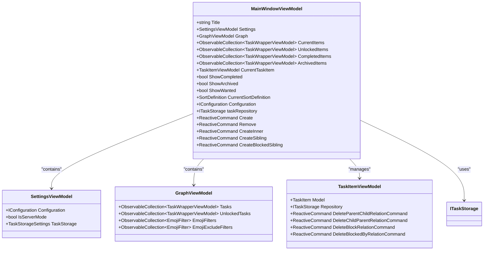
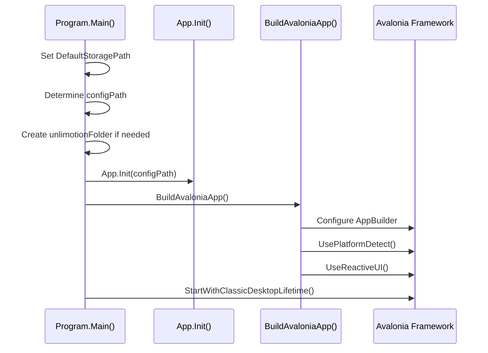
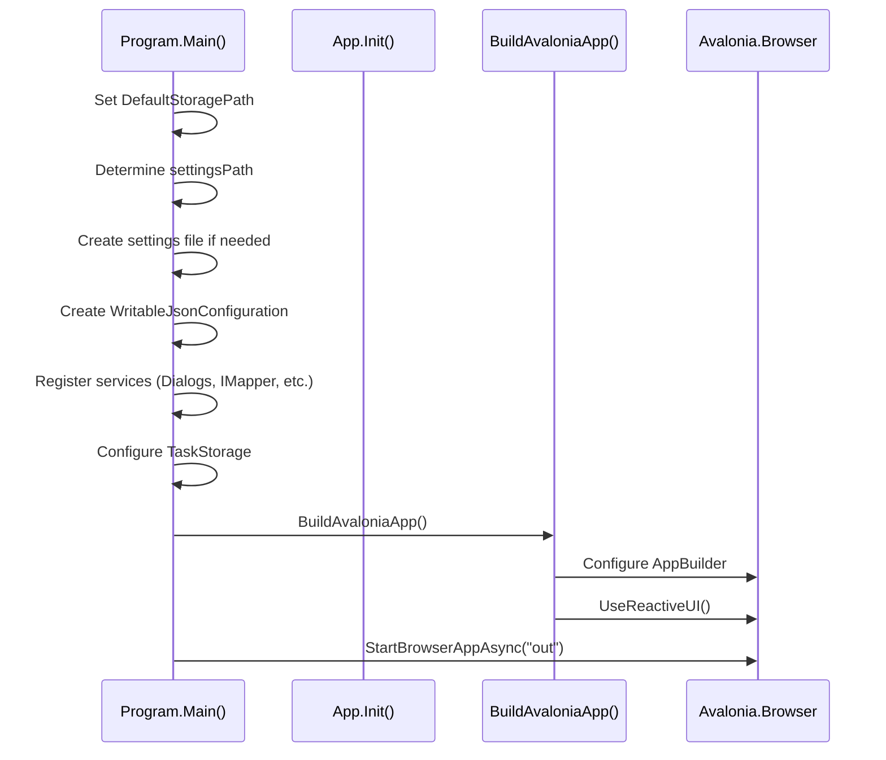
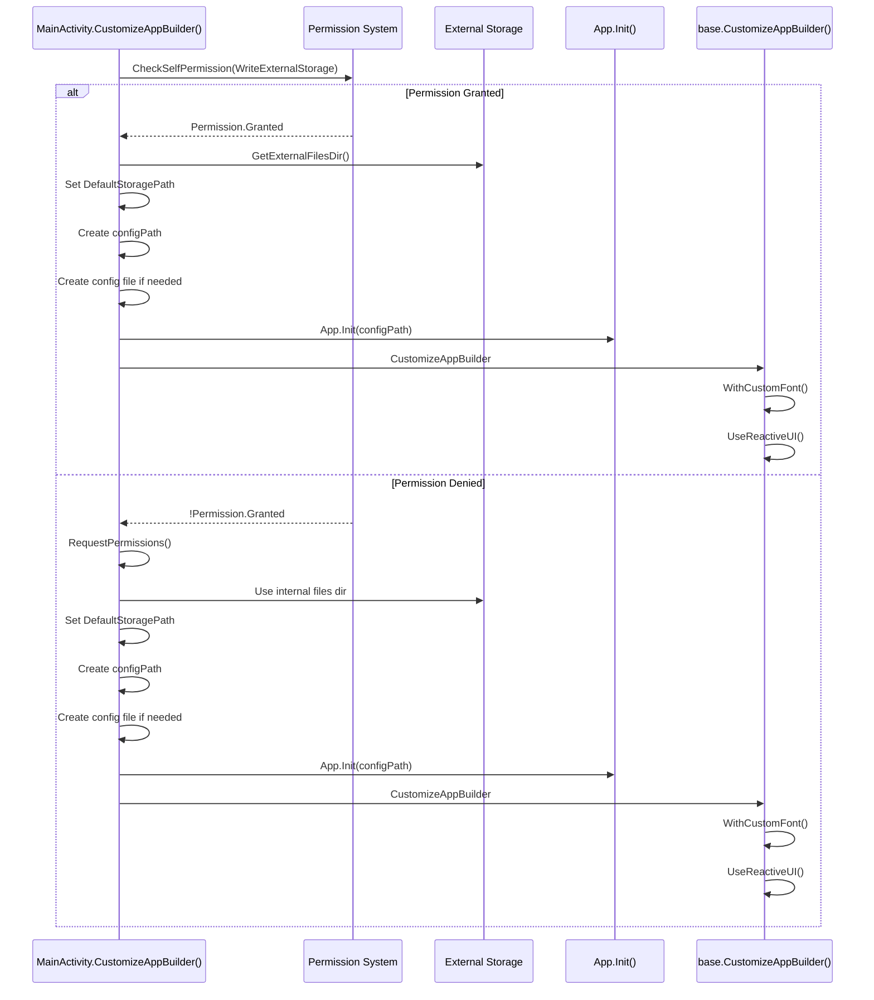
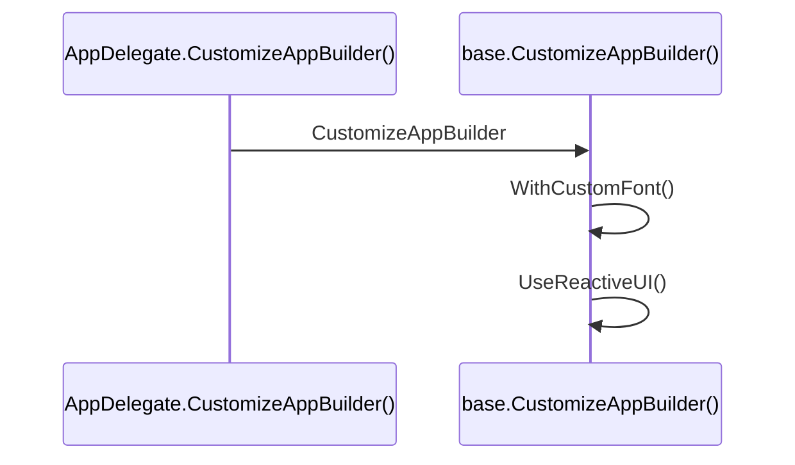
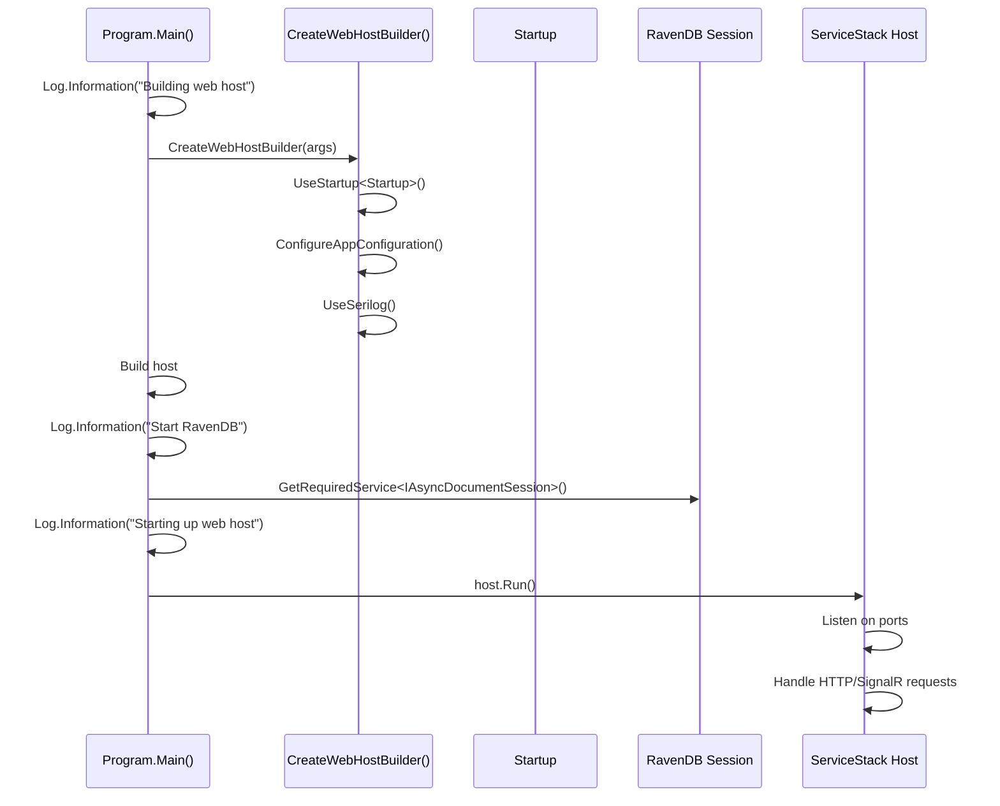
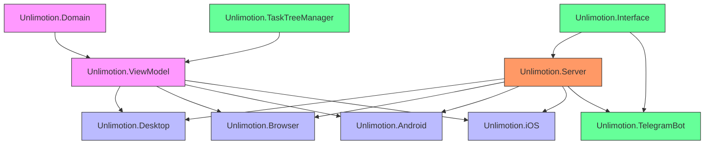

# Cross-Platform Strategy

<cite>
**Referenced Files in This Document**   
- [Program.cs](file://src/Unlimotion.Desktop/Program.cs)
- [Program.cs](file://src/Unlimotion.Browser/Program.cs)
- [MainActivity.cs](file://src/Unlimotion.Android/MainActivity.cs)
- [AppDelegate.cs](file://src/Unlimotion.iOS/AppDelegate.cs)
- [Program.cs](file://src/Unlimotion.Server/Program.cs)
- [MainWindowViewModel.cs](file://src/Unlimotion.ViewModel/MainWindowViewModel.cs)
- [TaskItem.cs](file://src/Unlimotion.Domain/TaskItem.cs)
- [Unlimotion.ViewModel.csproj](file://src/Unlimotion.ViewModel/Unlimotion.ViewModel.csproj)
- [Unlimotion.Domain.csproj](file://src/Unlimotion.Domain/Unlimotion.Domain.csproj)
- [appsettings.json](file://src/Unlimotion.Server/appsettings.json)
- [docker-compose.yml](file://src/docker-compose.yml)
- [.env](file://src/.env)
- [appsettings.json](file://src/Unlimotion.TelegramBot/appsettings.json)
- [Dockerfile](file://src/Unlimotion.Server/Dockerfile)
</cite>

## Table of Contents
1. [Introduction](#introduction)
2. [Project Structure](#project-structure)
3. [Core Components](#core-components)
4. [Architecture Overview](#architecture-overview)
5. [Detailed Component Analysis](#detailed-component-analysis)
6. [Dependency Analysis](#dependency-analysis)
7. [Performance Considerations](#performance-considerations)
8. [Troubleshooting Guide](#troubleshooting-guide)
9. [Conclusion](#conclusion)

## Introduction
Unlimotion is a cross-platform task management application designed to provide consistent user experience and business logic across desktop, web, Android, and iOS platforms. The architecture leverages shared codebases for core functionality while utilizing platform-specific implementations for native experiences. This document details the cross-platform strategy, focusing on how shared components enable consistency, how each platform hosts the application, and how the centralized server component provides data synchronization.

## Project Structure
The Unlimotion project follows a modular structure with distinct components for different platforms and shared logic. The solution is organized into multiple projects that separate concerns and enable code reuse across platforms.

**Diagram sources**
- [Unlimotion.Domain.csproj](file://src/Unlimotion.Domain/Unlimotion.Domain.csproj)
- [Unlimotion.ViewModel.csproj](file://src/Unlimotion.ViewModel/Unlimotion.ViewModel.csproj)
- [Unlimotion.Interface.csproj](file://src/Unlimotion.Interface/Unlimotion.Interface.csproj)

**Section sources**
- [Unlimotion.Domain.csproj](file://src/Unlimotion.Domain/Unlimotion.Domain.csproj)
- [Unlimotion.ViewModel.csproj](file://src/Unlimotion.ViewModel/Unlimotion.ViewModel.csproj)
- [Unlimotion.Interface.csproj](file://src/Unlimotion.Interface/Unlimotion.Interface.csproj)

## Core Components
The Unlimotion architecture is built around several core components that enable its cross-platform capabilities. The shared codebase in Unlimotion.ViewModel and Unlimotion.Domain provides consistent business logic across all client platforms, while platform-specific projects handle native integration and user interface rendering. The server component (Unlimotion.Server) serves as a centralized data backend using ServiceStack and RavenDB, enabling data synchronization across devices.

**Section sources**
- [MainWindowViewModel.cs](file://src/Unlimotion.ViewModel/MainWindowViewModel.cs)
- [TaskItem.cs](file://src/Unlimotion.Domain/TaskItem.cs)

## Architecture Overview
Unlimotion employs a hybrid architecture that combines shared business logic with platform-specific UI implementations. The architecture follows a clean separation of concerns, with the domain model and view models containing the core application logic that is shared across all platforms. Each client platform (desktop, web, Android, iOS) hosts this shared logic within a platform-specific container, providing native user experiences while maintaining consistent behavior.

The server component acts as a centralized data store, using RavenDB as the document database and ServiceStack for API services. Clients can connect to the server via HTTP and SignalR for real-time synchronization. This architecture enables offline-first functionality with seamless cloud synchronization when connectivity is available.

**Diagram sources**
- [Program.cs](file://src/Unlimotion.Desktop/Program.cs)
- [Program.cs](file://src/Unlimotion.Browser/Program.cs)
- [MainActivity.cs](file://src/Unlimotion.Android/MainActivity.cs)
- [AppDelegate.cs](file://src/Unlimotion.iOS/AppDelegate.cs)
- [Program.cs](file://src/Unlimotion.Server/Program.cs)

## Detailed Component Analysis

### Shared Business Logic
The Unlimotion.Domain and Unlimotion.ViewModel projects contain the shared business logic that ensures consistent behavior across all platforms. The Domain project defines the core data models, while the ViewModel project implements the application logic and state management.

#### Domain Model
The domain model is centered around the TaskItem entity, which represents a task in the system. This class contains all the properties needed for task management, including title, description, completion status, timestamps, relationships (parent/child tasks, blocking tasks), and repetition patterns.

**Diagram sources**
- [TaskItem.cs](file://src/Unlimotion.Domain/TaskItem.cs)

**Section sources**
- [TaskItem.cs](file://src/Unlimotion.Domain/TaskItem.cs)

#### View Model Layer
The MainWindowViewModel class serves as the central view model for the application, managing the state and behavior of the main interface. It handles task filtering, sorting, creation, and manipulation, providing a consistent interface for all client platforms.

**Diagram sources**
- [MainWindowViewModel.cs](file://src/Unlimotion.ViewModel/MainWindowViewModel.cs)

**Section sources**
- [MainWindowViewModel.cs](file://src/Unlimotion.ViewModel/MainWindowViewModel.cs)

### Platform-Specific Implementations

#### Desktop Application
The desktop application uses Avalonia UI as a cross-platform framework, with Unlimotion.Desktop as the entry point. The application is initialized in the Program.cs file, which sets up the default storage paths and configuration.

**Diagram sources**
- [Program.cs](file://src/Unlimotion.Desktop/Program.cs)

**Section sources**
- [Program.cs](file://src/Unlimotion.Desktop/Program.cs)

#### WebAssembly Implementation
The WebAssembly implementation in Unlimotion.Browser allows the application to run in browsers. The Program.cs file in this project configures the application for browser execution, setting up the storage paths and configuration for the web environment.

**Diagram sources**
- [Program.cs](file://src/Unlimotion.Browser/Program.cs)

**Section sources**
- [Program.cs](file://src/Unlimotion.Browser/Program.cs)

#### Mobile Applications
The native mobile implementations in Unlimotion.Android and Unlimotion.iOS host the shared ViewModel logic within platform-specific containers. Both implementations follow a similar pattern of initializing the shared logic while handling platform-specific concerns like permissions and storage.

**Diagram sources**
- [MainActivity.cs](file://src/Unlimotion.Android/MainActivity.cs)

**Section sources**
- [MainActivity.cs](file://src/Unlimotion.Android/MainActivity.cs)

**Diagram sources**
- [AppDelegate.cs](file://src/Unlimotion.iOS/AppDelegate.cs)

**Section sources**
- [AppDelegate.cs](file://src/Unlimotion.iOS/AppDelegate.cs)

### Server Component
The server component (Unlimotion.Server) provides a centralized data backend using ServiceStack and RavenDB. It serves as the single source of truth for user data, enabling synchronization across multiple devices.

**Diagram sources**
- [Program.cs](file://src/Unlimotion.Server/Program.cs)

**Section sources**
- [Program.cs](file://src/Unlimotion.Server/Program.cs)

## Dependency Analysis
The Unlimotion architecture demonstrates a well-structured dependency graph that enables code reuse while maintaining platform-specific capabilities. The shared components (Domain and ViewModel) have no dependencies on platform-specific code, allowing them to be used across all clients.

**Diagram sources**
- [Unlimotion.Domain.csproj](file://src/Unlimotion.Domain/Unlimotion.Domain.csproj)
- [Unlimotion.ViewModel.csproj](file://src/Unlimotion.ViewModel/Unlimotion.ViewModel.csproj)
- [Unlimotion.Desktop.csproj](file://src/Unlimotion.Desktop/Unlimotion.Desktop.csproj)
- [Unlimotion.Browser.csproj](file://src/Unlimotion.Browser/Unlimotion.Browser.csproj)
- [Unlimotion.Android.csproj](file://src/Unlimotion.Android/Unlimotion.Android.csproj)
- [Unlimotion.iOS.csproj](file://src/Unlimotion.iOS/Unlimotion.iOS.csproj)
- [Unlimotion.Interface.csproj](file://src/Unlimotion.Interface/Unlimotion.Interface.csproj)
- [Unlimotion.Server.csproj](file://src/Unlimotion.Server/Unlimotion.Server.csproj)
- [Unlimotion.TelegramBot.csproj](file://src/Unlimotion.TelegramBot/Unlimotion.TelegramBot.csproj)
- [Unlimotion.TaskTree.csproj](file://src/Unlimotion.TaskTreeManager/Unlimotion.TaskTree.csproj)

**Section sources**
- [Unlimotion.Domain.csproj](file://src/Unlimotion.Domain/Unlimotion.Domain.csproj)
- [Unlimotion.ViewModel.csproj](file://src/Unlimotion.ViewModel/Unlimotion.ViewModel.csproj)

## Performance Considerations
The Unlimotion architecture incorporates several performance considerations to ensure responsive user experiences across platforms:

1. **Offline-First Design**: The application can function without network connectivity, with local storage of tasks and synchronization when connectivity is restored.

2. **Reactive Programming**: The use of ReactiveUI enables efficient UI updates by only refreshing components when underlying data changes.

3. **Lazy Loading**: Task data is loaded incrementally, with filtering and sorting applied client-side to minimize memory usage.

4. **Caching**: Frequently accessed data is cached to reduce database queries and improve responsiveness.

5. **Background Synchronization**: Data synchronization with the server occurs in the background, preventing UI blocking.

6. **Efficient Data Models**: The domain models are designed to minimize serialization overhead and storage requirements.

## Troubleshooting Guide
When encountering issues with the Unlimotion application, consider the following common scenarios and their solutions:

**Section sources**
- [appsettings.json](file://src/Unlimotion.Server/appsettings.json)
- [docker-compose.yml](file://src/docker-compose.yml)
- [.env](file://src/.env)
- [appsettings.json](file://src/Unlimotion.TelegramBot/appsettings.json)

### Server Connection Issues
If clients cannot connect to the server:
1. Verify the server is running and accessible at the configured URL (default: http://localhost:8080)
2. Check the appsettings.json file for correct RavenDB server configuration
3. Ensure firewall settings allow connections on ports 5004, 5005, and 5006
4. Verify the ServiceStack license key is valid and properly configured

### Data Synchronization Problems
If data is not synchronizing between devices:
1. Check that all clients are configured to use the same server endpoint
2. Verify the user account is the same across all devices
3. Check server logs for any synchronization errors
4. Ensure the SignalR connection is established (look for WebSocket connections)

### Mobile Storage Permissions
On Android, if the application cannot access external storage:
1. Ensure the WRITE_EXTERNAL_STORAGE permission is granted
2. Check that the app has permission to access files in the external storage directory
3. Verify the storage path is correctly set in the application configuration

### Docker Deployment Issues
When deploying with Docker:
1. Ensure the docker-compose.yml file is correctly configured
2. Verify the volume mappings are correct for persistent data storage
3. Check that the environment variables are properly set
4. Ensure the Docker network configuration allows inter-container communication

## Conclusion
Unlimotion's cross-platform strategy effectively leverages shared codebases in Unlimotion.ViewModel and Unlimotion.Domain to ensure consistent business logic across desktop, web, Android, and iOS clients. The architecture combines the benefits of code reuse with platform-specific optimizations, providing native user experiences while maintaining data consistency. The centralized server component using ServiceStack and RavenDB enables seamless data synchronization across devices, supporting both cloud-hosted and self-hosted deployment options. The inclusion of alternative interfaces like the Telegram bot further extends the application's accessibility, making it a comprehensive task management solution across multiple platforms.