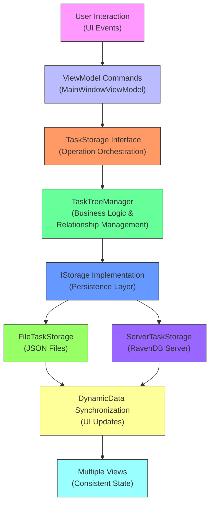
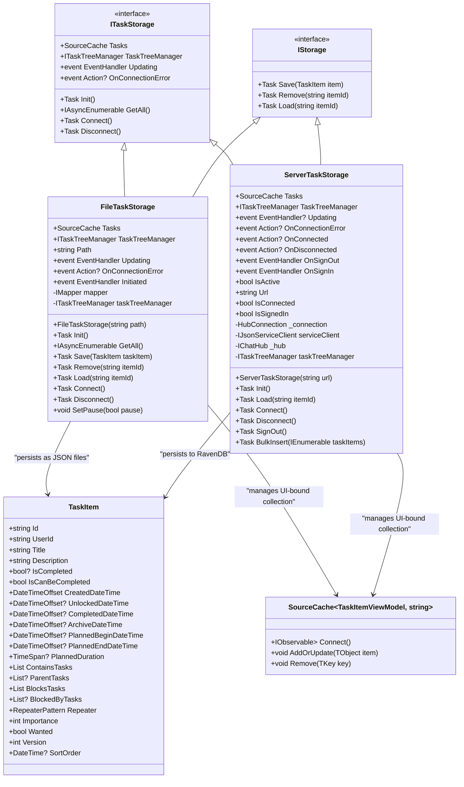
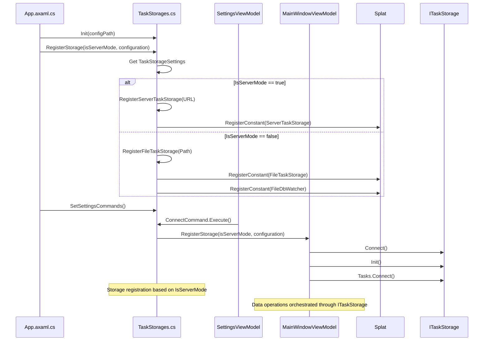
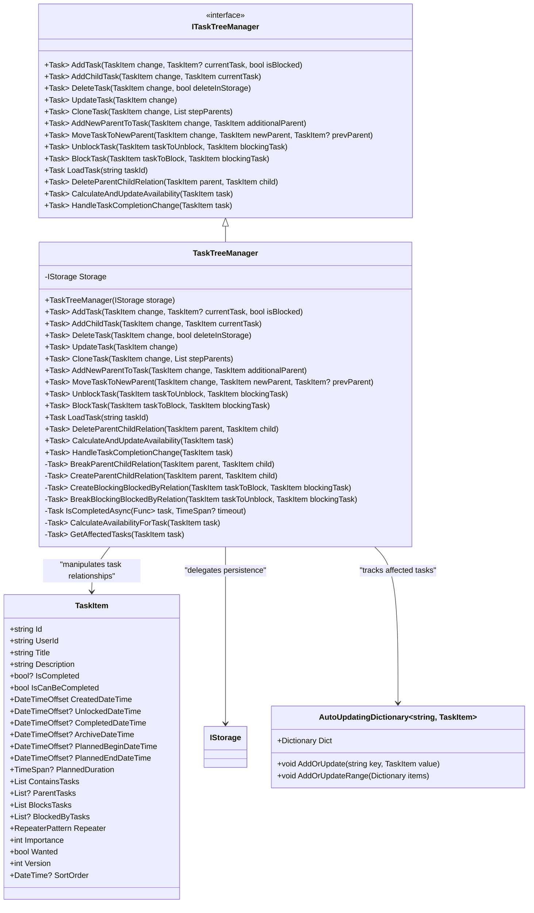
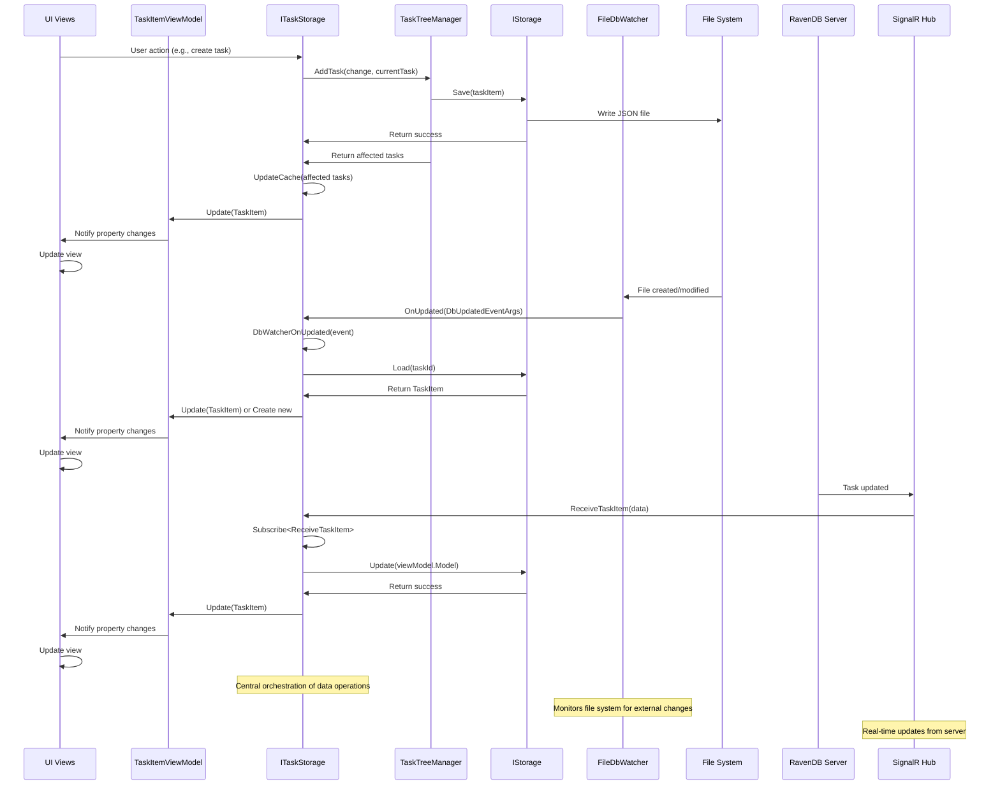
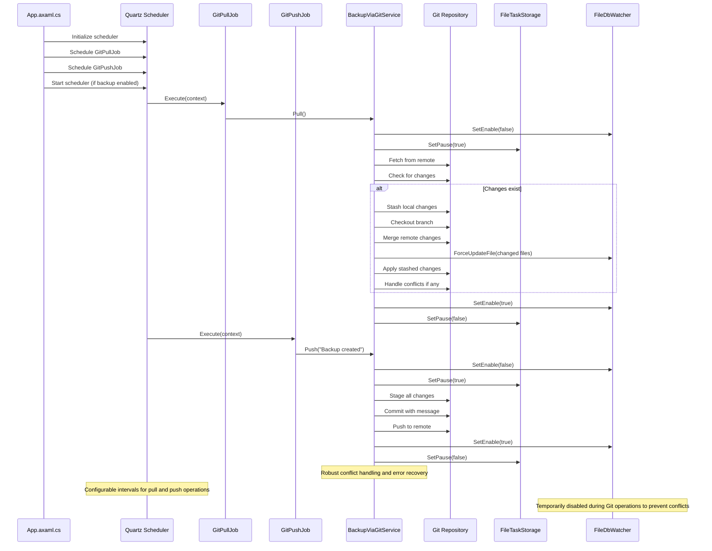

# Data Flow and Persistence

<cite>
**Referenced Files in This Document**   
- [IStorage.cs](file://src/Unlimotion.TaskTreeManager/IStorage.cs)
- [ITaskTreeManager.cs](file://src/Unlimotion.TaskTreeManager/ITaskTreeManager.cs)
- [TaskTreeManager.cs](file://src/Unlimotion.TaskTreeManager/TaskTreeManager.cs)
- [FileTaskStorage.cs](file://src/Unlimotion/FileTaskStorage.cs)
- [ServerTaskStorage.cs](file://src/Unlimotion/ServerTaskStorage.cs)
- [TaskStorages.cs](file://src/Unlimotion/TaskStorages.cs)
- [MainWindowViewModel.cs](file://src/Unlimotion.ViewModel/MainWindowViewModel.cs)
- [App.axaml.cs](file://src/Unlimotion/App.axaml.cs)
- [GitPullJob.cs](file://src/Unlimotion/Scheduling/Jobs/GitPullJob.cs)
- [GitPushJob.cs](file://src/Unlimotion/Scheduling/Jobs/GitPushJob.cs)
- [TaskItem.cs](file://src/Unlimotion.Domain/TaskItem.cs)
- [ITaskStorage.cs](file://src/Unlimotion.ViewModel/ITaskStorage.cs)
- [TaskStorageSettings.cs](file://src/Unlimotion.ViewModel/TaskStorageSettings.cs)
- [BackupViaGitService.cs](file://src/Unlimotion.Services/BackupViaGitService.cs)
- [DbUpdatedEventArgs.cs](file://src/Unlimotion.ViewModel/DbUpdatedEventArgs.cs)
- [IDatabaseWatcher.cs](file://src/Unlimotion.ViewModel/IDatabaseWatcher.cs)
- [FileDbWatcher.cs](file://src/Unlimotion.ViewModel/FileDbWatcher.cs)
</cite>

## Table of Contents
1. [Introduction](#introduction)
2. [Data Flow Architecture](#data-flow-architecture)
3. [Core Components](#core-components)
4. [Persistence Layer](#persistence-layer)
5. [Storage Configuration and Selection](#storage-configuration-and-selection)
6. [TaskTreeManager and Business Logic](#tasktreemanager-and-business-logic)
7. [Data Synchronization and Event-Driven Updates](#data-synchronization-and-event-driven-updates)
8. [Git-Based Backup Mechanism](#git-based-backup-mechanism)
9. [Data Consistency and Conflict Resolution](#data-consistency-and-conflict-resolution)
10. [Conclusion](#conclusion)

## Introduction
Unlimotion implements a sophisticated data flow and persistence architecture that manages task data from user interaction through to storage and synchronization. The system is designed with a clear separation of concerns, where the ViewModel layer handles user interactions, the TaskTreeManager manages business logic and task relationships, and the IStorage implementations handle data persistence. This documentation details the complete data pathway, focusing on how tasks are created, modified, and persisted through the system, with special attention to the dual storage options (file-based and server-based), data synchronization mechanisms, and the Git-based backup system.

**Section sources**
- [MainWindowViewModel.cs](file://src/Unlimotion.ViewModel/MainWindowViewModel.cs#L0-L1076)
- [TaskTreeManager.cs](file://src/Unlimotion.TaskTreeManager/TaskTreeManager.cs#L0-L837)

## Data Flow Architecture
The data flow in Unlimotion follows a well-defined pathway from user interaction to persistent storage. When a user performs an action in the UI, such as creating or modifying a task, the MainWindowViewModel receives the command and orchestrates the data operations through the ITaskStorage interface. This interface serves as the primary gateway to the persistence layer, abstracting the underlying storage implementation.

The data flow begins with ViewModel commands that trigger operations on the ITaskStorage instance. These operations are then processed by the TaskTreeManager, which maintains an in-memory representation of task relationships and enforces business rules. The TaskTreeManager coordinates with the appropriate IStorage implementation to persist changes, whether to JSON files on disk or to a RavenDB server. After persistence, changes are synchronized back to the UI through DynamicData collections, ensuring that all views reflect the current state of the data.

**Diagram sources**
- [MainWindowViewModel.cs](file://src/Unlimotion.ViewModel/MainWindowViewModel.cs#L0-L1076)
- [ITaskStorage.cs](file://src/Unlimotion.ViewModel/ITaskStorage.cs#L0-L32)
- [TaskTreeManager.cs](file://src/Unlimotion.TaskTreeManager/TaskTreeManager.cs#L0-L837)
- [FileTaskStorage.cs](file://src/Unlimotion/FileTaskStorage.cs#L0-L457)
- [ServerTaskStorage.cs](file://src/Unlimotion/ServerTaskStorage.cs#L0-L721)

## Core Components
The Unlimotion data flow architecture is built around several core components that work together to manage task data. The MainWindowViewModel serves as the central orchestrator, consuming the ITaskStorage interface to perform data operations. The ITaskStorage interface defines the contract for all storage operations, providing a consistent API regardless of the underlying implementation.

The TaskTreeManager is responsible for implementing business logic and maintaining the integrity of task relationships. It handles operations such as adding tasks, creating parent-child relationships, and managing blocking dependencies. The IStorage interface provides the persistence mechanism, with two concrete implementations: FileTaskStorage for local JSON file storage and ServerTaskStorage for remote RavenDB storage.

These components are connected through dependency injection, with the Splat framework managing service registration and resolution. The architecture follows the dependency inversion principle, with higher-level components depending on abstractions rather than concrete implementations, allowing for flexible configuration and easy testing.

**Section sources**
- [MainWindowViewModel.cs](file://src/Unlimotion.ViewModel/MainWindowViewModel.cs#L0-L1076)
- [ITaskStorage.cs](file://src/Unlimotion.ViewModel/ITaskStorage.cs#L0-L32)
- [TaskTreeManager.cs](file://src/Unlimotion.TaskTreeManager/TaskTreeManager.cs#L0-L837)
- [FileTaskStorage.cs](file://src/Unlimotion/FileTaskStorage.cs#L0-L457)
- [ServerTaskStorage.cs](file://src/Unlimotion/ServerTaskStorage.cs#L0-L721)

## Persistence Layer
The persistence layer in Unlimotion is implemented through the IStorage interface and its concrete implementations. The IStorage interface defines three core methods for data persistence: Save, Remove, and Load, which correspond to the basic CRUD operations. This interface is implemented by both FileTaskStorage and ServerTaskStorage, providing a consistent API for data operations regardless of the storage backend.

The FileTaskStorage implementation persists tasks as individual JSON files in a designated directory, with each task stored in a file named by its unique ID. This approach allows for simple file system operations and easy backup through standard file synchronization tools. The ServerTaskStorage implementation connects to a RavenDB server, using SignalR for real-time synchronization and ServiceStack for API communication.

Both storage implementations handle data serialization and deserialization, with FileTaskStorage using Newtonsoft.Json and ServerTaskStorage using AutoMapper to convert between domain models and service models. The storage layer also manages connection state, with ServerTaskStorage implementing automatic reconnection logic and authentication token management.

**Diagram sources**
- [IStorage.cs](file://src/Unlimotion.TaskTreeManager/IStorage.cs#L0-L10)
- [ITaskStorage.cs](file://src/Unlimotion.ViewModel/ITaskStorage.cs#L0-L32)
- [FileTaskStorage.cs](file://src/Unlimotion/FileTaskStorage.cs#L0-L457)
- [ServerTaskStorage.cs](file://src/Unlimotion/ServerTaskStorage.cs#L0-L721)
- [TaskItem.cs](file://src/Unlimotion.Domain/TaskItem.cs#L0-L32)

## Storage Configuration and Selection
The selection and configuration of the appropriate storage backend in Unlimotion is managed by the TaskStorages class, which provides a static registration mechanism for configuring the storage implementation based on the IsServerMode setting. This configuration is initialized in the App.axaml.cs file during application startup, where the system reads the TaskStorageSettings from the configuration and registers the appropriate storage implementation with the Splat dependency injection container.

The TaskStorages.RegisterStorage method is responsible for determining which storage implementation to use based on the IsServerMode flag. When IsServerMode is true, the RegisterServerTaskStorage method creates and registers a ServerTaskStorage instance with the specified URL. When IsServerMode is false, the RegisterFileTaskStorage method creates and registers a FileTaskStorage instance with the specified path.

This registration process follows a clean replacement pattern, where any previously registered storage implementation is disconnected and unregistered before the new implementation is registered. This allows users to switch between storage modes at runtime through the application settings. The SettingsViewModel provides a ConnectCommand that triggers the storage registration and connection process, enabling users to connect to their chosen storage backend with a single action.

**Diagram sources**
- [App.axaml.cs](file://src/Unlimotion/App.axaml.cs#L0-L232)
- [TaskStorages.cs](file://src/Unlimotion/TaskStorages.cs#L0-L223)
- [MainWindowViewModel.cs](file://src/Unlimotion.ViewModel/MainWindowViewModel.cs#L0-L1076)
- [TaskStorageSettings.cs](file://src/Unlimotion.ViewModel/TaskStorageSettings.cs#L0-L34)

## TaskTreeManager and Business Logic
The TaskTreeManager is the central component responsible for implementing business logic and maintaining the integrity of task relationships in Unlimotion. It serves as an intermediary between the storage layer and the application logic, ensuring that all operations on tasks follow the defined business rules and maintain data consistency.

The TaskTreeManager implements the ITaskTreeManager interface, which defines a comprehensive set of methods for manipulating tasks and their relationships. These methods include AddTask, AddChildTask, DeleteTask, UpdateTask, CloneTask, and various methods for managing parent-child and blocking relationships. Each method returns a list of affected tasks, allowing the calling code to update the UI accordingly.

A key aspect of the TaskTreeManager's functionality is its handling of task availability and completion. The CalculateAndUpdateAvailability method determines whether a task can be completed based on its dependencies, setting the IsCanBeCompleted property accordingly. When a task's completion status changes, the HandleTaskCompletionChange method is called, which updates the task's timestamps and handles repeater logic for recurring tasks.

The TaskTreeManager also implements a retry policy using the Polly library to handle transient failures during data operations. The IsCompletedAsync method wraps operations in a retry policy that attempts the operation for up to two minutes, providing resilience against temporary storage issues.

**Diagram sources**
- [ITaskTreeManager.cs](file://src/Unlimotion.TaskTreeManager/ITaskTreeManager.cs#L0-L42)
- [TaskTreeManager.cs](file://src/Unlimotion.TaskTreeManager/TaskTreeManager.cs#L0-L837)
- [TaskItem.cs](file://src/Unlimotion.Domain/TaskItem.cs#L0-L32)

## Data Synchronization and Event-Driven Updates
Unlimotion employs a sophisticated data synchronization mechanism to ensure that changes to task data are consistently reflected across all views in the application. This is achieved through the combination of DynamicData collections, event-driven updates, and a file system watcher for local storage.

The core of the synchronization system is the SourceCache<TaskItemViewModel, string> collection, which is maintained by both FileTaskStorage and ServerTaskStorage implementations. This collection serves as the single source of truth for task data in the UI, with all views binding to filtered and transformed versions of this collection. The DynamicData library provides powerful reactive operators for filtering, sorting, and transforming the data stream, ensuring that views are automatically updated when the underlying data changes.

For local file storage, the FileDbWatcher class monitors the task storage directory for file system changes, raising OnUpdated events when files are created, modified, or deleted. These events are translated into DbUpdatedEventArgs and propagated to the FileTaskStorage, which updates the in-memory cache accordingly. This allows the application to respond to changes made by external processes or other instances of the application.

The ServerTaskStorage implementation uses SignalR to receive real-time updates from the server, with the IChatHub interface defining methods for receiving task updates and deletions. When a task is updated or deleted on the server, the corresponding SignalR event is received and processed by the ServerTaskStorage, which updates the local cache.

**Diagram sources**
- [FileTaskStorage.cs](file://src/Unlimotion/FileTaskStorage.cs#L0-L457)
- [ServerTaskStorage.cs](file://src/Unlimotion/ServerTaskStorage.cs#L0-L721)
- [TaskTreeManager.cs](file://src/Unlimotion.TaskTreeManager/TaskTreeManager.cs#L0-L837)
- [FileDbWatcher.cs](file://src/Unlimotion.ViewModel/FileDbWatcher.cs#L0-L152)
- [DbUpdatedEventArgs.cs](file://src/Unlimotion.ViewModel/DbUpdatedEventArgs.cs#L0-L10)
- [TaskItemViewModel.cs](file://src/Unlimotion.ViewModel/TaskItemViewModel.cs#L0-L232)

## Git-Based Backup Mechanism
Unlimotion includes a comprehensive Git-based backup mechanism that provides automated synchronization of local task data with a remote Git repository. This system is implemented using Quartz.NET for scheduling and LibGit2Sharp for Git operations, providing reliable and configurable backup functionality.

The backup system is configured through the GitSettings class, which defines properties for the remote repository URL, branch, credentials, and backup intervals. The system can be enabled or disabled through the BackupEnabled flag, and users can configure the pull and push intervals independently. The backup mechanism is only active when using the FileTaskStorage implementation, as server-based storage already provides its own synchronization and backup capabilities.

The scheduling of backup operations is managed by the Quartz.NET scheduler, which is initialized in the App.axaml.cs file. When Git backup is enabled, two jobs are scheduled: GitPullJob for pulling changes from the remote repository, and GitPushJob for pushing local changes to the remote repository. These jobs are triggered at the configured intervals, ensuring regular synchronization.

The actual Git operations are implemented in the BackupViaGitService class, which provides methods for cloning, pulling, and pushing. The Pull method implements a robust merge strategy that stashes local changes before pulling, merges the remote changes, and then reapplies the stashed changes. This approach minimizes the risk of conflicts and ensures that local changes are preserved. The Push method stages all changes, creates a commit, and pushes to the remote repository, with appropriate error handling and notifications.

**Diagram sources**
- [App.axaml.cs](file://src/Unlimotion/App.axaml.cs#L0-L232)
- [GitPullJob.cs](file://src/Unlimotion/Scheduling/Jobs/GitPullJob.cs#L0-L19)
- [GitPushJob.cs](file://src/Unlimotion/Scheduling/Jobs/GitPushJob.cs#L0-L20)
- [BackupViaGitService.cs](file://src/Unlimotion.Services/BackupViaGitService.cs#L0-L356)
- [FileTaskStorage.cs](file://src/Unlimotion/FileTaskStorage.cs#L0-L457)
- [FileDbWatcher.cs](file://src/Unlimotion.ViewModel/FileDbWatcher.cs#L0-L152)

## Data Consistency and Conflict Resolution
Unlimotion employs several strategies to ensure data consistency and handle conflicts that may arise during concurrent modifications or synchronization operations. The system is designed to maintain data integrity across multiple views and storage backends, with careful attention to transactional boundaries and conflict resolution.

For local file storage, the FileTaskStorage implementation uses a combination of file system monitoring and in-memory caching to maintain consistency. The FileDbWatcher monitors the storage directory for external changes, ensuring that modifications made by other processes are reflected in the application state. During Git operations, both the FileDbWatcher and file operations are temporarily paused to prevent conflicts between file system changes and Git operations.

When using server-based storage, the ServerTaskStorage implementation leverages SignalR for real-time synchronization, ensuring that all connected clients receive updates immediately. The system handles connection interruptions with automatic reconnection logic and maintains a queue of pending operations to be retried when the connection is restored.

The Git-based backup system implements a sophisticated conflict resolution strategy that prioritizes the preservation of local changes. When pulling from the remote repository, the system stashes local changes before merging, applies the remote changes, and then reapplies the stashed changes. This approach minimizes the risk of losing local modifications while still incorporating remote updates. If conflicts occur during the merge process, the system notifies the user and requires manual resolution.

The TaskTreeManager also contributes to data consistency by enforcing business rules and maintaining the integrity of task relationships. Operations that modify task relationships are wrapped in retry policies to handle transient failures, and the system ensures that related tasks are updated consistently when a task's state changes.

**Section sources**
- [FileTaskStorage.cs](file://src/Unlimotion/FileTaskStorage.cs#L0-L457)
- [ServerTaskStorage.cs](file://src/Unlimotion/ServerTaskStorage.cs#L0-L721)
- [BackupViaGitService.cs](file://src/Unlimotion.Services/BackupViaGitService.cs#L0-L356)
- [TaskTreeManager.cs](file://src/Unlimotion.TaskTreeManager/TaskTreeManager.cs#L0-L837)
- [FileDbWatcher.cs](file://src/Unlimotion.ViewModel/FileDbWatcher.cs#L0-L152)

## Conclusion
Unlimotion's data flow and persistence architecture demonstrates a well-designed separation of concerns, with clear boundaries between the UI layer, business logic, and storage implementations. The system provides flexible storage options through the ITaskStorage interface, allowing users to choose between local file storage and remote server storage based on their needs.

The TaskTreeManager serves as the central orchestrator of business logic, ensuring that task relationships and availability rules are consistently enforced. The use of DynamicData for data synchronization enables reactive updates across multiple views, providing a responsive user experience.

The Git-based backup mechanism adds an additional layer of data protection for local storage, with configurable scheduling and robust conflict resolution. This system ensures that task data is regularly synchronized with a remote repository, providing protection against data loss.

Overall, the architecture balances flexibility, reliability, and performance, providing a solid foundation for task management while accommodating different user requirements and deployment scenarios. The use of dependency injection, interface abstraction, and reactive programming patterns contributes to a maintainable and extensible codebase.

**Section sources**
- [MainWindowViewModel.cs](file://src/Unlimotion.ViewModel/MainWindowViewModel.cs#L0-L1076)
- [TaskTreeManager.cs](file://src/Unlimotion.TaskTreeManager/TaskTreeManager.cs#L0-L837)
- [FileTaskStorage.cs](file://src/Unlimotion/FileTaskStorage.cs#L0-L457)
- [ServerTaskStorage.cs](file://src/Unlimotion/ServerTaskStorage.cs#L0-L721)
- [App.axaml.cs](file://src/Unlimotion/App.axaml.cs#L0-L232)