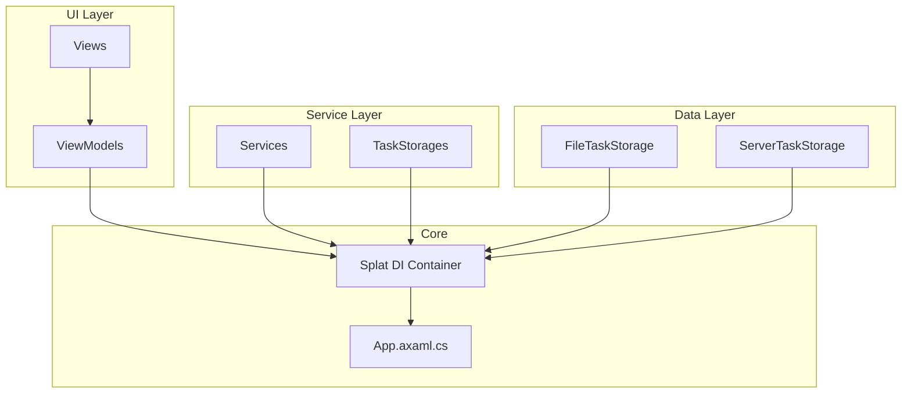
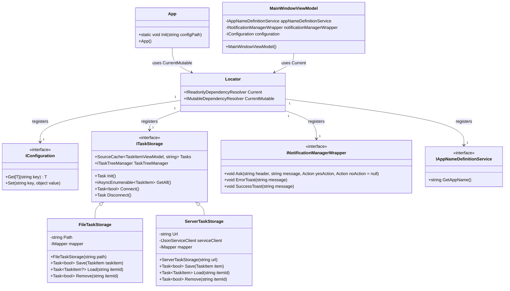
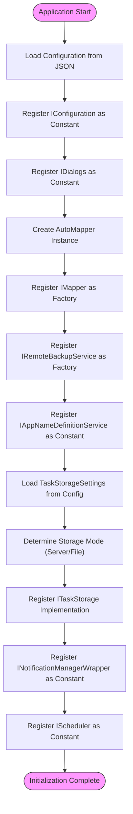
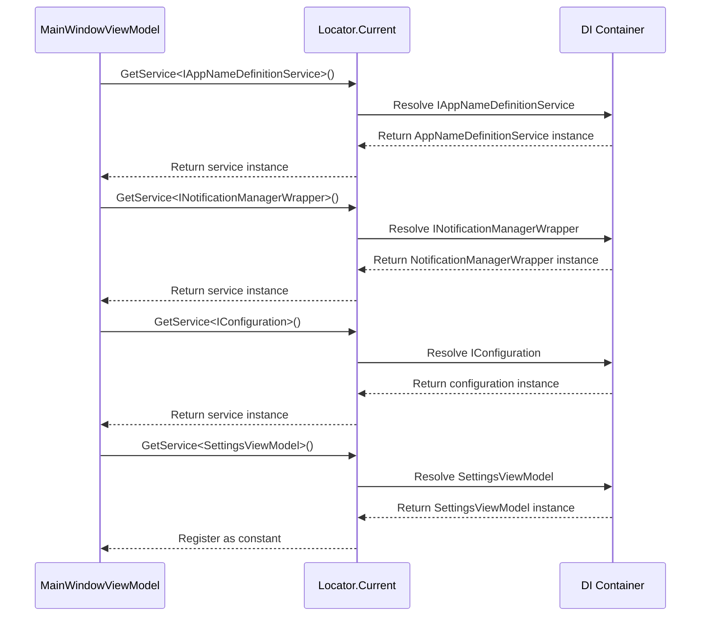
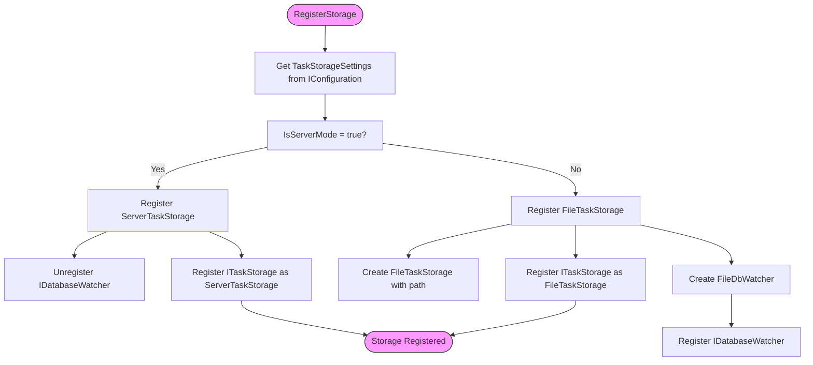
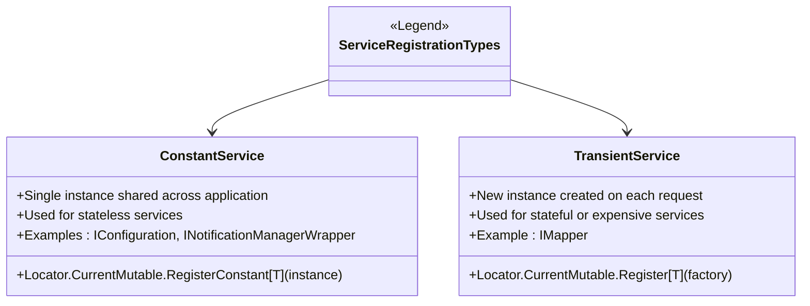

# Dependency Injection Container

<cite>
**Referenced Files in This Document**   
- [App.axaml.cs](file://src/Unlimotion/App.axaml.cs)
- [TaskStorages.cs](file://src/Unlimotion/TaskStorages.cs)
- [NotificationManagerWrapper.cs](file://src/Unlimotion/NotificationManagerWrapper.cs)
- [MainWindowViewModel.cs](file://src/Unlimotion.ViewModel/MainWindowViewModel.cs)
- [AppModelMapping.cs](file://src/Unlimotion/AppModelMapping.cs)
- [FileTaskStorage.cs](file://src/Unlimotion/FileTaskStorage.cs)
- [ServerTaskStorage.cs](file://src/Unlimotion/ServerTaskStorage.cs)
- [ITaskStorage.cs](file://src/Unlimotion.ViewModel/ITaskStorage.cs)
- [IAppNameDefinitionService.cs](file://src/Unlimotion.ViewModel/IAppNameDefinitionService.cs)
- [INotificationManagerWrapper.cs](file://src/Unlimotion.ViewModel/INotificationManagerWrapper.cs)
- [TaskStorageSettings.cs](file://src/Unlimotion.ViewModel/TaskStorageSettings.cs)
</cite>

## Table of Contents
1. [Introduction](#introduction)
2. [Project Structure](#project-structure)
3. [Core Components](#core-components)
4. [Architecture Overview](#architecture-overview)
5. [Detailed Component Analysis](#detailed-component-analysis)
6. [Dependency Analysis](#dependency-analysis)
7. [Performance Considerations](#performance-considerations)
8. [Troubleshooting Guide](#troubleshooting-guide)
9. [Conclusion](#conclusion)

## Introduction
This document provides comprehensive architectural documentation for Unlimotion's dependency injection system using Splat. The system implements a service locator pattern through Splat's Locator.Current and Locator.CurrentMutable interfaces to manage the application's services and components. The documentation details how services are registered during application initialization, how ViewModels retrieve dependencies, and how the system enables loose coupling between components through dependency injection. The analysis covers the initialization sequence, service registration patterns, and the implications of using service location versus constructor injection.

## Project Structure
The Unlimotion application follows a layered architecture with clear separation of concerns between UI, business logic, and data access components. The dependency injection system is primarily implemented in the core Unlimotion project and consumed by various components across the solution.

**Diagram sources**
- [App.axaml.cs](file://src/Unlimotion/App.axaml.cs)
- [TaskStorages.cs](file://src/Unlimotion/TaskStorages.cs)
- [FileTaskStorage.cs](file://src/Unlimotion/FileTaskStorage.cs)
- [ServerTaskStorage.cs](file://src/Unlimotion/ServerTaskStorage.cs)

**Section sources**
- [App.axaml.cs](file://src/Unlimotion/App.axaml.cs)
- [TaskStorages.cs](file://src/Unlimotion/TaskStorages.cs)

## Core Components
The dependency injection system in Unlimotion is built around Splat's service locator pattern, with key components including the App class for service registration, TaskStorages for storage implementation management, and various service implementations that are injected throughout the application. The system uses Locator.CurrentMutable for service registration during initialization and Locator.Current for service retrieval in components.

**Section sources**
- [App.axaml.cs](file://src/Unlimotion/App.axaml.cs#L109-L140)
- [TaskStorages.cs](file://src/Unlimotion/TaskStorages.cs#L16-L223)

## Architecture Overview
The dependency injection architecture in Unlimotion follows a service locator pattern implemented through Splat, a cross-platform library for .NET that provides service location capabilities. The system is initialized in the App.Init() method where configuration is loaded and services are registered with the container. The architecture enables loose coupling between components by allowing different implementations of interfaces to be injected based on runtime configuration.

**Diagram sources**
- [App.axaml.cs](file://src/Unlimotion/App.axaml.cs#L109-L140)
- [TaskStorages.cs](file://src/Unlimotion/TaskStorages.cs#L160-L196)
- [FileTaskStorage.cs](file://src/Unlimotion/FileTaskStorage.cs#L16-L457)
- [ServerTaskStorage.cs](file://src/Unlimotion/ServerTaskStorage.cs#L16-L721)
- [ITaskStorage.cs](file://src/Unlimotion.ViewModel/ITaskStorage.cs#L1-L32)

## Detailed Component Analysis

### Dependency Injection Container Analysis
The dependency injection system in Unlimotion is implemented using Splat, a service location library that provides a simple API for registering and resolving services. The container is accessed through two primary properties: Locator.CurrentMutable for registration during initialization and Locator.Current for resolving services at runtime.

#### Service Registration Pattern
The application uses a hybrid approach to service registration, combining constant registration for singleton services and factory registration for transient services. This pattern is evident in the App.Init() method where services are registered based on their lifecycle requirements.

**Diagram sources**
- [App.axaml.cs](file://src/Unlimotion/App.axaml.cs#L109-L140)
- [TaskStorages.cs](file://src/Unlimotion/TaskStorages.cs#L160-L196)

**Section sources**
- [App.axaml.cs](file://src/Unlimotion/App.axaml.cs#L109-L140)

#### Service Resolution in ViewModels
ViewModels in Unlimotion retrieve their dependencies through the Locator.Current.GetService<T>() method rather than constructor injection. This service location pattern is demonstrated in the MainWindowViewModel constructor, which obtains required services directly from the container.

**Diagram sources**
- [MainWindowViewModel.cs](file://src/Unlimotion.ViewModel/MainWindowViewModel.cs#L16-L799)
- [App.axaml.cs](file://src/Unlimotion/App.axaml.cs#L109-L140)

**Section sources**
- [MainWindowViewModel.cs](file://src/Unlimotion.ViewModel/MainWindowViewModel.cs#L16-L799)

### Storage Implementation Analysis
The ITaskStorage interface defines the contract for task storage operations, with two concrete implementations: FileTaskStorage for local file-based storage and ServerTaskStorage for remote server-based storage. The dependency injection system enables runtime selection between these implementations based on configuration.

#### Storage Registration Logic
The TaskStorages class contains the logic for registering the appropriate ITaskStorage implementation based on the TaskStorageSettings configuration. This demonstrates how the DI container enables loose coupling by allowing different implementations to be injected based on runtime conditions.

**Diagram sources**
- [TaskStorages.cs](file://src/Unlimotion/TaskStorages.cs#L160-L196)
- [FileTaskStorage.cs](file://src/Unlimotion/FileTaskStorage.cs#L16-L457)
- [ServerTaskStorage.cs](file://src/Unlimotion/ServerTaskStorage.cs#L16-L721)

**Section sources**
- [TaskStorages.cs](file://src/Unlimotion/TaskStorages.cs#L160-L196)

### Service Lifecycle Management
The system employs different registration strategies for services based on their intended lifecycle. Constant services are registered as singletons, while transient services are registered as factories that create new instances on each request.

#### Service Registration Types
The dependency injection system distinguishes between constant (singleton) and transient services, using appropriate registration methods for each type.

**Diagram sources**
- [App.axaml.cs](file://src/Unlimotion/App.axaml.cs#L109-L140)
- [AppModelMapping.cs](file://src/Unlimotion/AppModelMapping.cs#L1-L40)

**Section sources**
- [App.axaml.cs](file://src/Unlimotion/App.axaml.cs#L109-L140)

## Dependency Analysis
The dependency injection system in Unlimotion creates a network of dependencies between components, with the DI container acting as the central hub for service resolution. The analysis reveals both the benefits and potential challenges of the service locator pattern used in the application.

```mermaid
graph TD
App[App.axaml.cs] --> DI[Locator.CurrentMutable]
DI --> Config[IConfiguration]
DI --> Dialogs[IDialogs]
DI --> Mapper[IMapper]
DI --> GitService[IRemoteBackupService]
DI --> AppNameService[IAppNameDefinitionService]
DI --> TaskStorage[ITaskStorage]
DI --> Notification[INotificationManagerWrapper]
DI --> Scheduler[IScheduler]
MainWindowViewModel[MainWindowViewModel] --> DI
MainWindowViewModel --> Config
MainWindowViewModel --> Dialogs
MainWindowViewModel --> TaskStorage
MainWindowViewModel --> Notification
MainWindowViewModel --> AppNameService
TaskStorages[TaskStorages] --> DI
TaskStorages --> Config
TaskStorages --> SettingsVM[SettingsViewModel]
TaskStorages --> Scheduler
FileTaskStorage[FileTaskStorage] --> DI
FileTaskStorage --> Mapper
FileTaskStorage --> DbWatcher[IDatabaseWatcher]
ServerTaskStorage[ServerTaskStorage] --> DI
ServerTaskStorage --> Mapper
ServerTaskStorage --> ClientSettings[ClientSettings]
NotificationManagerWrapper[NotificationManagerWrapper] --> DI
NotificationManagerWrapper --> NotifyManager[INotificationMessageManager]
style App fill:#4CAF50,stroke:#333
style MainWindowViewModel fill:#2196F3,stroke:#333
style TaskStorages fill:#FF9800,stroke:#333
style FileTaskStorage fill:#9C27B0,stroke:#333
style ServerTaskStorage fill:#9C27B0,stroke:#333
style NotificationManagerWrapper fill:#F44336,stroke:#333
```

**Diagram sources**
- [App.axaml.cs](file://src/Unlimotion/App.axaml.cs)
- [MainWindowViewModel.cs](file://src/Unlimotion.ViewModel/MainWindowViewModel.cs)
- [TaskStorages.cs](file://src/Unlimotion/TaskStorages.cs)
- [FileTaskStorage.cs](file://src/Unlimotion/FileTaskStorage.cs)
- [ServerTaskStorage.cs](file://src/Unlimotion/ServerTaskStorage.cs)
- [NotificationManagerWrapper.cs](file://src/Unlimotion/NotificationManagerWrapper.cs)

**Section sources**
- [App.axaml.cs](file://src/Unlimotion/App.axaml.cs)
- [MainWindowViewModel.cs](file://src/Unlimotion.ViewModel/MainWindowViewModel.cs)

## Performance Considerations
The service locator pattern implemented in Unlimotion has several performance implications that should be considered:

1. **Initialization Time**: The App.Init() method performs synchronous operations for service registration, which could impact startup performance with a large number of services.

2. **Memory Usage**: Constant services are registered as singletons, which means they remain in memory for the lifetime of the application.

3. **Service Resolution**: Service location at runtime (Locator.Current.GetService<T>()) involves dictionary lookups which are generally fast but could become a bottleneck with high-frequency calls.

4. **Lazy Loading**: The system could benefit from lazy initialization of some services to improve startup time.

5. **Configuration Impact**: The dependency on configuration for storage selection means that I/O operations during initialization could affect performance.

The current implementation appears to be optimized for simplicity and maintainability rather than maximum performance, which is appropriate for a desktop application of this scale.

## Troubleshooting Guide
When working with Unlimotion's dependency injection system, consider the following troubleshooting tips:

**Section sources**
- [App.axaml.cs](file://src/Unlimotion/App.axaml.cs#L109-L140)
- [MainWindowViewModel.cs](file://src/Unlimotion.ViewModel/MainWindowViewModel.cs#L16-L799)
- [TaskStorages.cs](file://src/Unlimotion/TaskStorages.cs#L160-L196)

## Conclusion
Unlimotion's dependency injection system using Splat provides a flexible and maintainable approach to service management. The service locator pattern enables loose coupling between components and allows for runtime selection of implementations based on configuration. The system effectively separates service registration from service consumption, with clear initialization in App.Init() and consistent service retrieval in components through Locator.Current.GetService<T>().

The architecture supports both singleton (constant) and transient (factory) service lifecycles, allowing appropriate management of different service types. The implementation of multiple ITaskStorage implementations (FileTaskStorage and ServerTaskStorage) demonstrates how the DI container enables flexible storage options based on user configuration.

While the service locator pattern used in Unlimotion provides good flexibility, it does have implications for testability and component lifecycle management. The reliance on static access to Locator.Current makes unit testing more challenging compared to constructor injection, as dependencies are not explicitly declared in constructors. However, the system compensates for this by providing clear registration points and consistent service resolution patterns.

Overall, the dependency injection system in Unlimotion effectively supports the application's requirements for flexibility, maintainability, and configuration-driven behavior while maintaining a clean separation of concerns between components.