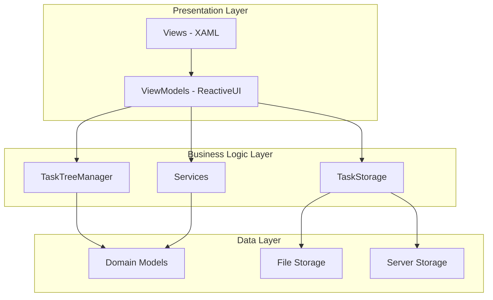
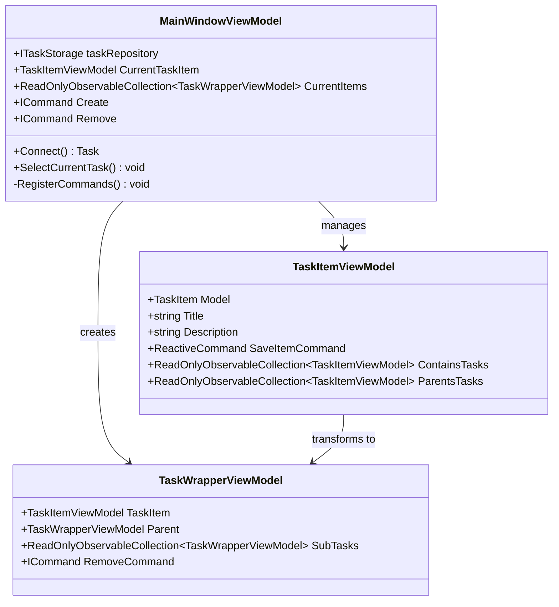
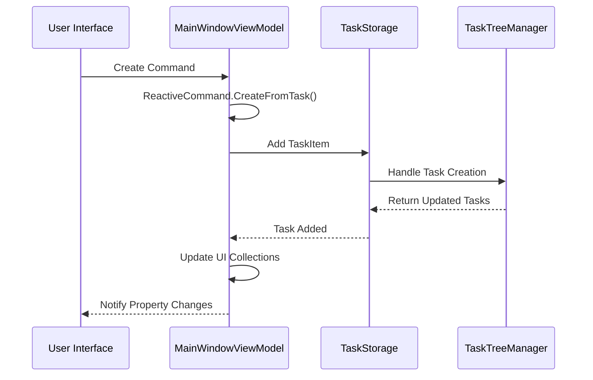
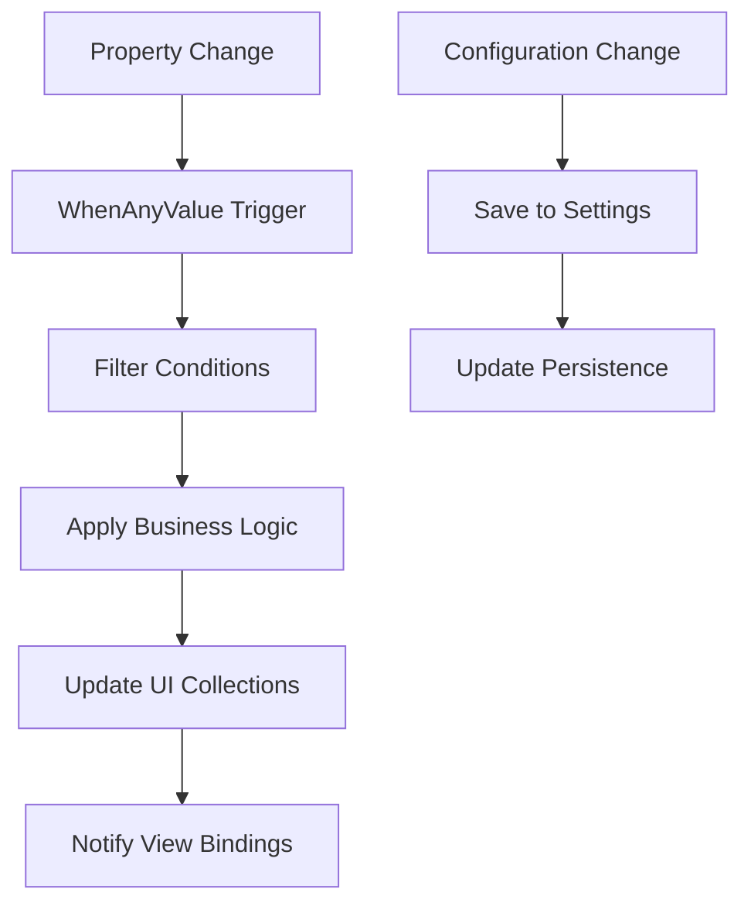
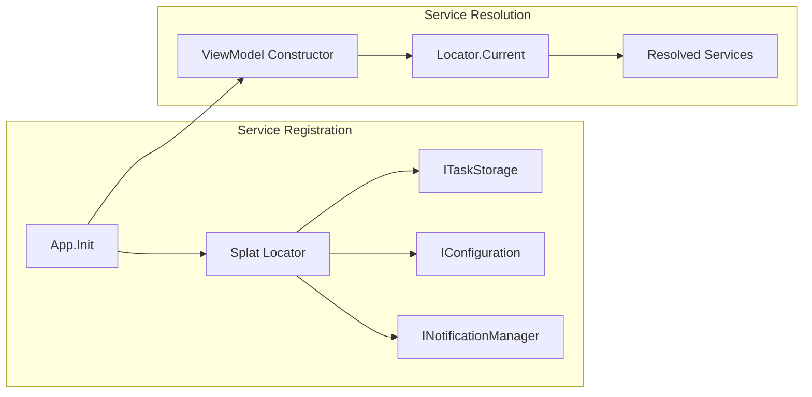
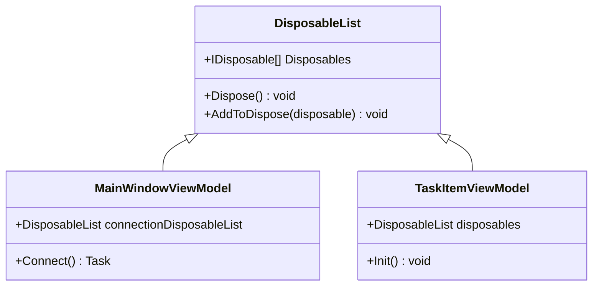
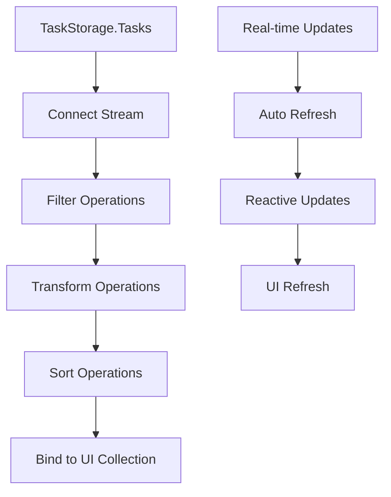

# MVVM Architecture

<cite>
**Referenced Files in This Document**
- [MainWindowViewModel.cs](file://src/Unlimotion.ViewModel/MainWindowViewModel.cs)
- [App.axaml.cs](file://src/Unlimotion/App.axaml.cs)
- [MainWindow.axaml.cs](file://src/Unlimotion/Views/MainWindow.axaml.cs)
- [TaskItemViewModel.cs](file://src/Unlimotion.ViewModel/TaskItemViewModel.cs)
- [TaskWrapperViewModel.cs](file://src/Unlimotion.ViewModel/TaskWrapperViewModel.cs)
- [DisposableList.cs](file://src/Unlimotion.ViewModel/DisposableList.cs)
- [FodyWeavers.xml](file://src/Unlimotion.ViewModel/FodyWeavers.xml)
- [ITaskStorage.cs](file://src/Unlimotion.ViewModel/ITaskStorage.cs)
- [ITaskTreeManager.cs](file://src/Unlimotion.TaskTreeManager/ITaskTreeManager.cs)
- [SettingsViewModel.cs](file://src/Unlimotion.ViewModel/SettingsViewModel.cs)
</cite>

## Table of Contents
1. [Introduction](#introduction)
2. [Architecture Overview](#architecture-overview)
3. [Core MVVM Components](#core-mvvm-components)
4. [Data Binding Implementation](#data-binding-implementation)
5. [Reactive Programming Patterns](#reactive-programming-patterns)
6. [Service Location and Dependency Injection](#service-location-and-dependency-injection)
7. [Memory Management and Disposal](#memory-management-and-disposal)
8. [Advanced Binding Patterns](#advanced-binding-patterns)
9. [Performance Considerations](#performance-considerations)
10. [Best Practices](#best-practices)

## Introduction

Unlimotion implements a sophisticated MVVM (Model-View-ViewModel) architecture using the Avalonia UI framework combined with ReactiveUI for reactive programming. The application demonstrates advanced MVVM patterns including automatic property change notifications through Fody, dynamic data binding with DynamicData, and comprehensive service location using Splat.

The architecture separates concerns effectively:
- **Views**: XAML-based UI components with minimal logic
- **ViewModels**: ReactiveUI-powered business logic and data binding
- **Models**: Domain entities managed by the TaskTreeManager
- **Services**: Cross-cutting concerns and data persistence

## Architecture Overview

The MVVM architecture in Unlimotion follows a layered approach with clear separation of responsibilities:

**Diagram sources**
- [MainWindowViewModel.cs](file://src/Unlimotion.ViewModel/MainWindowViewModel.cs#L1-L50)
- [App.axaml.cs](file://src/Unlimotion/App.axaml.cs#L1-L50)

**Section sources**
- [MainWindowViewModel.cs](file://src/Unlimotion.ViewModel/MainWindowViewModel.cs#L1-L100)
- [App.axaml.cs](file://src/Unlimotion/App.axaml.cs#L1-L100)

## Core MVVM Components

### MainWindowViewModel - Central Controller

The MainWindowViewModel serves as the primary ViewModel coordinating all application functionality:

**Diagram sources**
- [MainWindowViewModel.cs](file://src/Unlimotion.ViewModel/MainWindowViewModel.cs#L25-L100)
- [TaskItemViewModel.cs](file://src/Unlimotion.ViewModel/TaskItemViewModel.cs#L25-L100)
- [TaskWrapperViewModel.cs](file://src/Unlimotion.ViewModel/TaskWrapperViewModel.cs#L60-L125)

### Automatic Property Change Notifications

The `[AddINotifyPropertyChangedInterface]` attribute from Fody automatically generates property change notifications:

**Section sources**
- [MainWindowViewModel.cs](file://src/Unlimotion.ViewModel/MainWindowViewModel.cs#L25-L30)
- [TaskItemViewModel.cs](file://src/Unlimotion.ViewModel/TaskItemViewModel.cs#L25-L30)
- [FodyWeavers.xml](file://src/Unlimotion.ViewModel/FodyWeavers.xml#L1-L4)

### DataContext Initialization

The App.axaml.cs file handles DataContext initialization for the main window:

**Section sources**
- [App.axaml.cs](file://src/Unlimotion/App.axaml.cs#L40-L80)
- [MainWindow.axaml.cs](file://src/Unlimotion/Views/MainWindow.axaml.cs#L1-L13)

## Data Binding Implementation

### ReactiveCommand for UI Actions

Unlimotion extensively uses ReactiveCommand for UI actions with proper error handling and async support:

**Diagram sources**
- [MainWindowViewModel.cs](file://src/Unlimotion.ViewModel/MainWindowViewModel.cs#L60-L120)
- [TaskItemViewModel.cs](file://src/Unlimotion.ViewModel/TaskItemViewModel.cs#L45-L55)

### Transforming Domain Models to ViewModels

The transformation from TaskItem domain models to TaskItemViewModels enables reactive data binding:

**Section sources**
- [TaskItemViewModel.cs](file://src/Unlimotion.ViewModel/TaskItemViewModel.cs#L25-L50)
- [MainWindowViewModel.cs](file://src/Unlimotion.ViewModel/MainWindowViewModel.cs#L150-L200)

## Reactive Programming Patterns

### WhenAnyValue for Property Observation

Unlimotion uses WhenAnyValue extensively for reactive property observation:

**Diagram sources**
- [MainWindowViewModel.cs](file://src/Unlimotion.ViewModel/MainWindowViewModel.cs#L45-L65)
- [TaskItemViewModel.cs](file://src/Unlimotion.ViewModel/TaskItemViewModel.cs#L200-L250)

### Throttling and Debouncing

Property change notifications are throttled to prevent excessive updates:

**Section sources**
- [TaskItemViewModel.cs](file://src/Unlimotion.ViewModel/TaskItemViewModel.cs#L200-L250)

## Service Location and Dependency Injection

### Splat Service Container

Unlimotion uses Splat for service location and dependency injection:

**Diagram sources**
- [App.axaml.cs](file://src/Unlimotion/App.axaml.cs#L120-L180)

### Service Registration Patterns

**Section sources**
- [App.axaml.cs](file://src/Unlimotion/App.axaml.cs#L120-L200)
- [SettingsViewModel.cs](file://src/Unlimotion.ViewModel/SettingsViewModel.cs#L1-L50)

## Memory Management and Disposal

### DisposableList Pattern

Unlimotion implements a comprehensive disposal pattern using DisposableList:

**Diagram sources**
- [DisposableList.cs](file://src/Unlimotion.ViewModel/DisposableList.cs#L1-L29)
- [MainWindowViewModel.cs](file://src/Unlimotion.ViewModel/MainWindowViewModel.cs#L30-L40)

### Memory Leak Prevention

**Section sources**
- [DisposableList.cs](file://src/Unlimotion.ViewModel/DisposableList.cs#L1-L29)
- [MainWindowViewModel.cs](file://src/Unlimotion.ViewModel/MainWindowViewModel.cs#L30-L50)

## Advanced Binding Patterns

### DynamicData Observable Collections

Unlimotion uses DynamicData for managing observable collections with real-time updates:

**Diagram sources**
- [MainWindowViewModel.cs](file://src/Unlimotion.ViewModel/MainWindowViewModel.cs#L150-L250)

### Multi-View Data Synchronization

The same data stream is filtered and transformed differently for various UI views:

**Section sources**
- [MainWindowViewModel.cs](file://src/Unlimotion.ViewModel/MainWindowViewModel.cs#L250-L400)

## Performance Considerations

### Reactive Streams Optimization

Unlimotion optimizes reactive streams through careful filtering and transformation:

- **Selective Filtering**: Only relevant tasks are processed for each view
- **Lazy Loading**: Sub-tasks are loaded on-demand
- **Throttling**: Frequent property changes are throttled to reduce updates
- **Memory Management**: Proper disposal prevents memory leaks

### Collection Binding Efficiency

**Section sources**
- [MainWindowViewModel.cs](file://src/Unlimotion.ViewModel/MainWindowViewModel.cs#L150-L300)
- [TaskWrapperViewModel.cs](file://src/Unlimotion.ViewModel/TaskWrapperViewModel.cs#L80-L125)

## Best Practices

### MVVM Pattern Implementation

1. **Separation of Concerns**: Clear separation between View, ViewModel, and Model layers
2. **Reactive Programming**: Extensive use of ReactiveUI for asynchronous operations
3. **Automatic Property Change**: Fody's PropertyChanged for boilerplate reduction
4. **Service Location**: Splat for dependency injection and service resolution
5. **Memory Management**: Comprehensive disposal patterns to prevent memory leaks

### Code Organization

- **ViewModel Responsibilities**: Business logic and data binding coordination
- **Minimal View Logic**: Views contain only presentation logic
- **Service Abstraction**: Clear interfaces for external dependencies
- **Configuration Management**: Centralized configuration through SettingsViewModel

### Error Handling

- **Graceful Degradation**: UI continues functioning even with service failures
- **User Feedback**: Notifications for errors and status updates
- **Resource Cleanup**: Proper disposal of resources and subscriptions

**Section sources**
- [MainWindowViewModel.cs](file://src/Unlimotion.ViewModel/MainWindowViewModel.cs#L1-L1076)
- [TaskItemViewModel.cs](file://src/Unlimotion.ViewModel/TaskItemViewModel.cs#L1-L666)
- [App.axaml.cs](file://src/Unlimotion/App.axaml.cs#L1-L233)