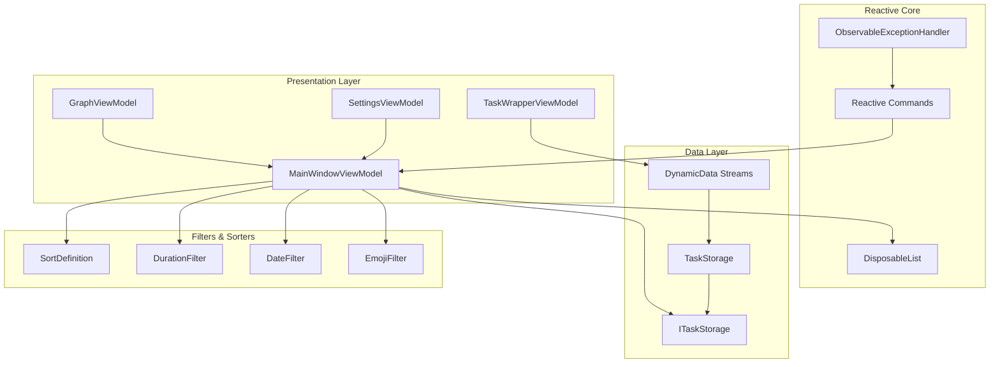
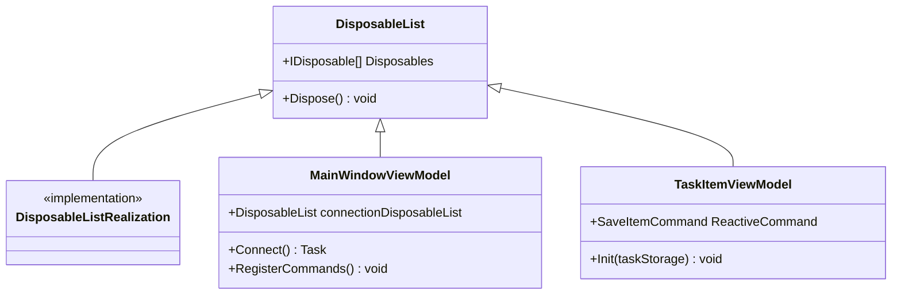
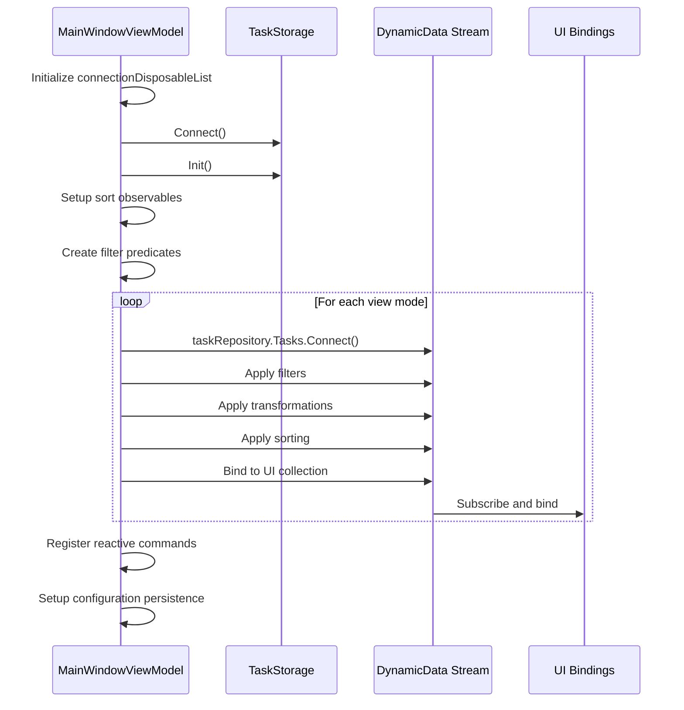
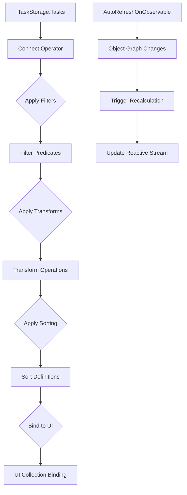
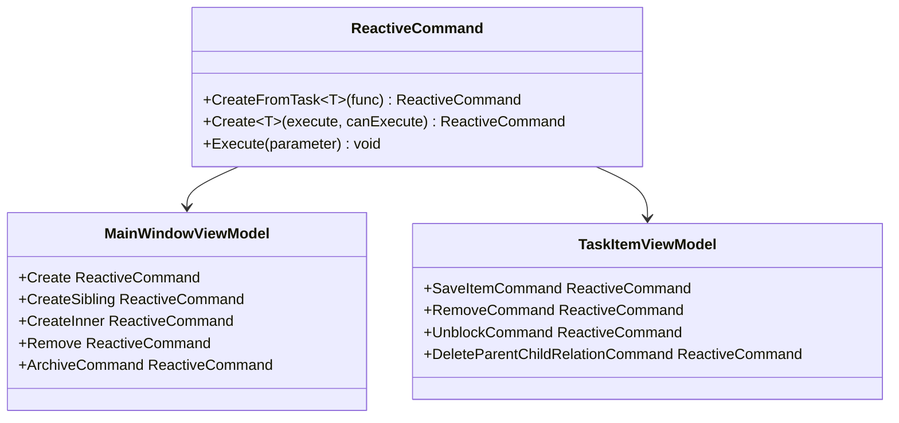
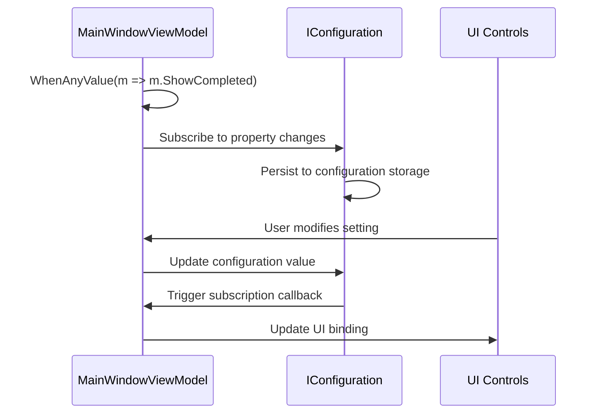
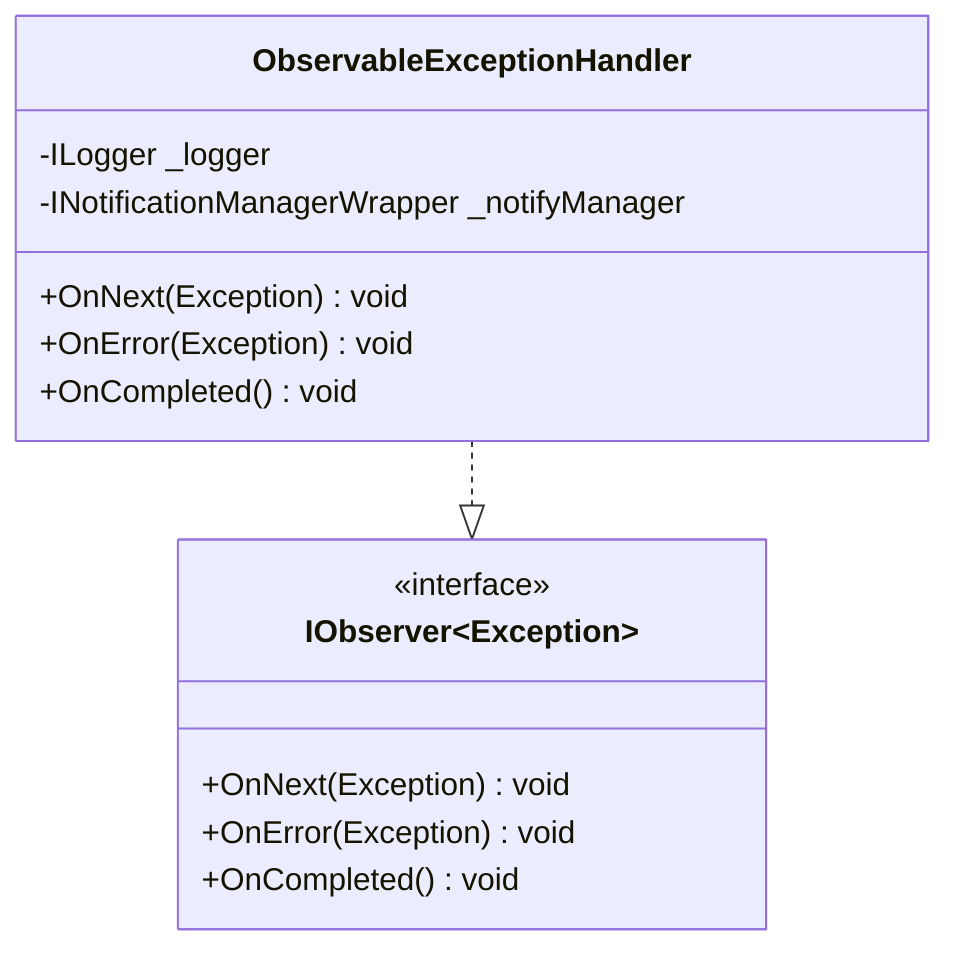
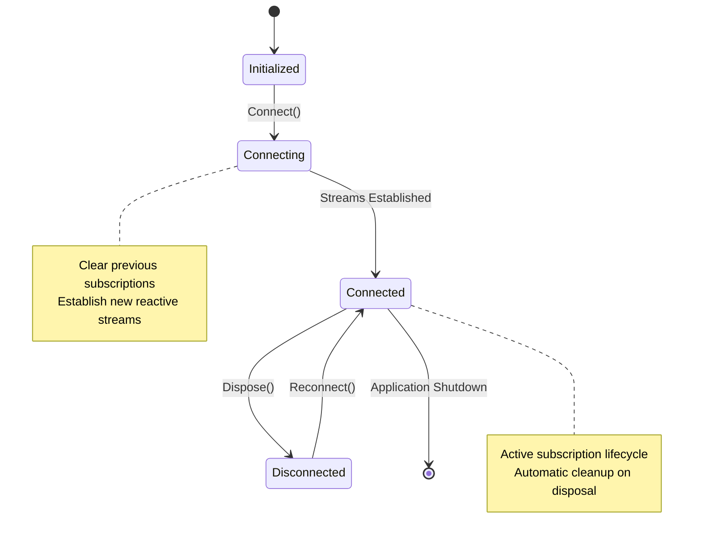

# Reactive Programming Model

<cite>
**Referenced Files in This Document**
- [MainWindowViewModel.cs](file://src/Unlimotion.ViewModel/MainWindowViewModel.cs)
- [DisposableList.cs](file://src/Unlimotion.ViewModel/DisposableList.cs)
- [DisposableListExtensions.cs](file://src/Unlimotion.ViewModel/DisposableListExtensions.cs)
- [ObservableExceptionHandler.cs](file://src/Unlimotion.ViewModel/ObservableExceptionHandler.cs)
- [TaskItemViewModel.cs](file://src/Unlimotion.ViewModel/TaskItemViewModel.cs)
- [TaskWrapperViewModel.cs](file://src/Unlimotion.ViewModel/TaskWrapperViewModel.cs)
- [SettingsViewModel.cs](file://src/Unlimotion.ViewModel/SettingsViewModel.cs)
- [ITaskStorage.cs](file://src/Unlimotion.ViewModel/ITaskStorage.cs)
- [GraphViewModel.cs](file://src/Unlimotion.ViewModel/GraphViewModel.cs)
- [SortDefinition.cs](file://src/Unlimotion.ViewModel/SortDefinition.cs)
- [DurationFilter.cs](file://src/Unlimotion.ViewModel/DurationFilter.cs)
- [DateFilter.cs](file://src/Unlimotion.ViewModel/DateFilter.cs)
</cite>

## Table of Contents
1. [Introduction](#introduction)
2. [Architecture Overview](#architecture-overview)
3. [Core Reactive Components](#core-reactive-components)
4. [MainWindowViewModel Connect Method](#mainwindowviewmodel-connect-method)
5. [DynamicData Integration](#dynamicdata-integration)
6. [Reactive Commands and CanExecute Logic](#reactive-commands-and-canexecute-logic)
7. [Configuration Persistence](#configuration-persistence)
8. [Error Handling and Resource Management](#error-handling-and-resource-management)
9. [Performance Considerations](#performance-considerations)
10. [Subscription Lifetime Management](#subscription-lifetime-management)
11. [Advanced Reactive Patterns](#advanced-reactive-patterns)
12. [Conclusion](#conclusion)

## Introduction

Unlimotion implements a sophisticated reactive programming model built on ReactiveUI and DynamicData frameworks. This architecture enables real-time state synchronization, automatic UI updates, and efficient memory management through carefully orchestrated observable streams. The system demonstrates advanced reactive patterns including composition of multiple filters, automatic persistence of user preferences, and robust error handling mechanisms.

The reactive model serves as the backbone for the application's data flow, ensuring that changes in task collections automatically propagate through the UI layers while maintaining optimal performance and preventing memory leaks.

## Architecture Overview

The reactive architecture follows a layered approach with clear separation of concerns:

**Diagram sources**
- [MainWindowViewModel.cs](file://src/Unlimotion.ViewModel/MainWindowViewModel.cs#L20-L30)
- [DisposableList.cs](file://src/Unlimotion.ViewModel/DisposableList.cs#L5-L15)
- [ITaskStorage.cs](file://src/Unlimotion.ViewModel/ITaskStorage.cs#L10-L20)

## Core Reactive Components

### DisposableList Base Class

The foundation of reactive subscription management is the `DisposableList` base class, which provides centralized disposal of reactive subscriptions:

**Diagram sources**
- [DisposableList.cs](file://src/Unlimotion.ViewModel/DisposableList.cs#L5-L28)
- [MainWindowViewModel.cs](file://src/Unlimotion.ViewModel/MainWindowViewModel.cs#L20-L30)

### Extension Methods for Subscription Management

The `DisposableListExtensions` provide convenient methods for adding disposables to the lifecycle management system:

**Section sources**
- [DisposableListExtensions.cs](file://src/Unlimotion.ViewModel/DisposableListExtensions.cs#L5-L16)

## MainWindowViewModel Connect Method

The `Connect()` method exemplifies the reactive programming paradigm by orchestrating multiple observable streams into cohesive data pipelines:

**Diagram sources**
- [MainWindowViewModel.cs](file://src/Unlimotion.ViewModel/MainWindowViewModel.cs#L206-L851)

The Connect method establishes several key reactive pipelines:

1. **Sort Definition Streams**: Creates observable streams for current sort definitions
2. **Filter Predicates**: Generates dynamic filtering logic based on user selections
3. **View-Specific Pipelines**: Processes tasks for All Tasks, Unlocked, Completed, Archived modes
4. **Emoji Filtering**: Manages emoji-based task categorization
5. **Command Registration**: Sets up reactive commands with canExecute logic

**Section sources**
- [MainWindowViewModel.cs](file://src/Unlimotion.ViewModel/MainWindowViewModel.cs#L206-L220)

## DynamicData Integration

### Connect() Operators and Transformations

DynamicData's `Connect()` operator serves as the primary mechanism for transforming task collections into reactive streams:

**Diagram sources**
- [MainWindowViewModel.cs](file://src/Unlimotion.ViewModel/MainWindowViewModel.cs#L250-L350)

### AutoRefreshOnObservable for Complex Object Graphs

The `AutoRefreshOnObservable` operator detects changes within complex object graphs, ensuring reactive updates when task relationships change:

**Section sources**
- [MainWindowViewModel.cs](file://src/Unlimotion.ViewModel/MainWindowViewModel.cs#L250-L270)
- [TaskItemViewModel.cs](file://src/Unlimotion.ViewModel/TaskItemViewModel.cs#L80-L100)

### Grouping and Transformation Patterns

The application demonstrates sophisticated grouping and transformation patterns:

**Section sources**
- [MainWindowViewModel.cs](file://src/Unlimotion.ViewModel/MainWindowViewModel.cs#L270-L320)

## Reactive Commands and CanExecute Logic

### Command Creation with ReactiveUI

Reactive commands integrate seamlessly with observable streams to provide dynamic canExecute logic:

**Diagram sources**
- [MainWindowViewModel.cs](file://src/Unlimotion.ViewModel/MainWindowViewModel.cs#L60-L120)
- [TaskItemViewModel.cs](file://src/Unlimotion.ViewModel/TaskItemViewModel.cs#L45-L55)

### Asynchronous Operations with Error Handling

Commands handle asynchronous operations with proper error propagation:

**Section sources**
- [MainWindowViewModel.cs](file://src/Unlimotion.ViewModel/MainWindowViewModel.cs#L60-L100)
- [TaskItemViewModel.cs](file://src/Unlimotion.ViewModel/TaskItemViewModel.cs#L45-L55)

## Configuration Persistence

### WhenAnyValue for Reactive Dependencies

The `WhenAnyValue` operator creates reactive dependencies between view model properties and configuration settings:

**Diagram sources**
- [MainWindowViewModel.cs](file://src/Unlimotion.ViewModel/MainWindowViewModel.cs#L40-L60)

### Automatic Configuration Synchronization

The system automatically persists user preferences to configuration storage:

**Section sources**
- [MainWindowViewModel.cs](file://src/Unlimotion.ViewModel/MainWindowViewModel.cs#L40-L60)
- [SettingsViewModel.cs](file://src/Unlimotion.ViewModel/SettingsViewModel.cs#L15-L35)

## Error Handling and Resource Management

### ObservableExceptionHandler Implementation

The `ObservableExceptionHandler` provides centralized error handling for reactive streams:

**Diagram sources**
- [ObservableExceptionHandler.cs](file://src/Unlimotion.ViewModel/ObservableExceptionHandler.cs#L8-L25)

### Resource Management Through DisposableList

The `DisposableList` pattern ensures proper cleanup of reactive subscriptions:

**Section sources**
- [DisposableList.cs](file://src/Unlimotion.ViewModel/DisposableList.cs#L5-L28)
- [ObservableExceptionHandler.cs](file://src/Unlimotion.ViewModel/ObservableExceptionHandler.cs#L15-L45)

## Performance Considerations

### Throttling and Debouncing

The system implements throttling mechanisms to optimize performance during rapid property changes:

**Section sources**
- [TaskItemViewModel.cs](file://src/Unlimotion.ViewModel/TaskItemViewModel.cs#L203-L232)

### Efficient Filter Composition

Multiple filters are composed efficiently using reactive streams:

**Section sources**
- [MainWindowViewModel.cs](file://src/Unlimotion.ViewModel/MainWindowViewModel.cs#L220-L250)

### Memory Leak Prevention

Several patterns prevent memory leaks in reactive pipelines:

1. **Centralized Disposal**: All subscriptions managed through `DisposableList`
2. **Automatic Cleanup**: Connection disposal before reconnection
3. **Weak References**: Proper handling of event subscriptions
4. **Resource Disposal**: Try-catch blocks in disposal logic

## Subscription Lifetime Management

### Lifecycle Management Pattern

The application follows a strict lifecycle pattern for subscription management:

**Diagram sources**
- [MainWindowViewModel.cs](file://src/Unlimotion.ViewModel/MainWindowViewModel.cs#L206-L210)

### Subscription Disposal Strategies

Different disposal strategies are employed based on the component's lifecycle:

**Section sources**
- [MainWindowViewModel.cs](file://src/Unlimotion.ViewModel/MainWindowViewModel.cs#L206-L210)
- [DisposableList.cs](file://src/Unlimotion.ViewModel/DisposableList.cs#L10-L25)

## Advanced Reactive Patterns

### Nested Observable Transformations

The system demonstrates sophisticated nested observable transformations:

**Section sources**
- [TaskWrapperViewModel.cs](file://src/Unlimotion.ViewModel/TaskWrapperViewModel.cs#L70-L120)

### Event Pattern Integration

Integration with .NET events through reactive patterns:

**Section sources**
- [TaskItemViewModel.cs](file://src/Unlimotion.ViewModel/TaskItemViewModel.cs#L284-L308)

### Graph-Based Data Processing

Complex graph-based data processing with recursive transformations:

**Section sources**
- [TaskWrapperViewModel.cs](file://src/Unlimotion.ViewModel/TaskWrapperViewModel.cs#L25-L70)

## Conclusion

Unlimotion's reactive programming implementation showcases advanced patterns for building responsive, maintainable applications. The architecture successfully combines ReactiveUI's command system with DynamicData's powerful transformation capabilities, creating a robust foundation for real-time data synchronization.

Key architectural strengths include:

- **Comprehensive Subscription Management**: Centralized disposal through `DisposableList` prevents memory leaks
- **Flexible Filter Composition**: Multiple filter types can be combined dynamically
- **Automatic Configuration Persistence**: User preferences persist automatically through reactive bindings
- **Robust Error Handling**: Centralized exception handling with user-friendly error reporting
- **Performance Optimization**: Throttling and efficient stream composition minimize resource usage

The reactive model enables developers to build complex data flows with minimal boilerplate code while maintaining excellent performance characteristics and clean separation of concerns. This architecture serves as an excellent example of modern reactive programming patterns in desktop application development.