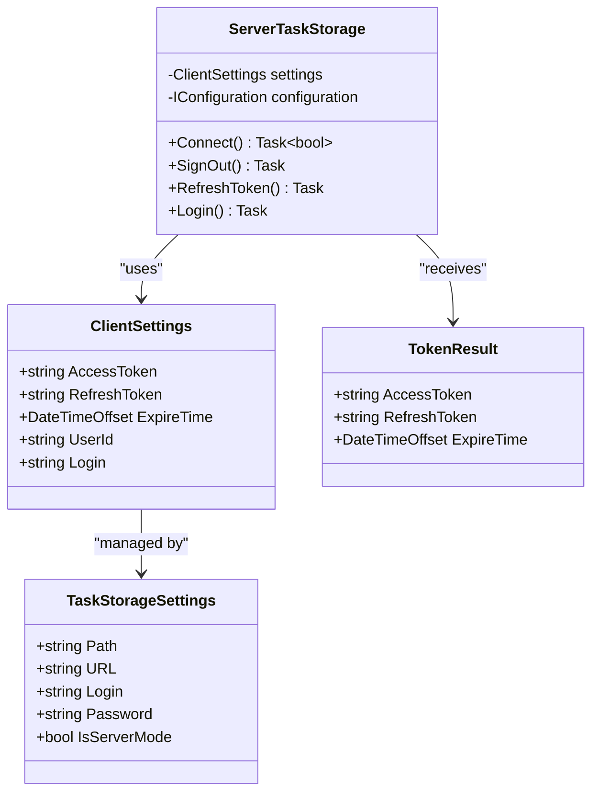
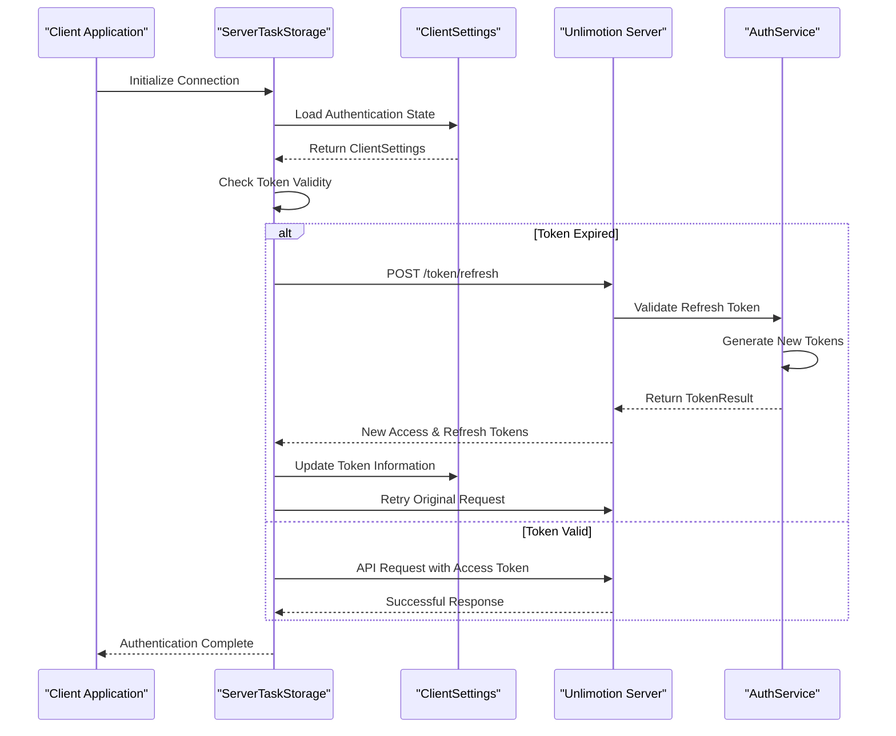
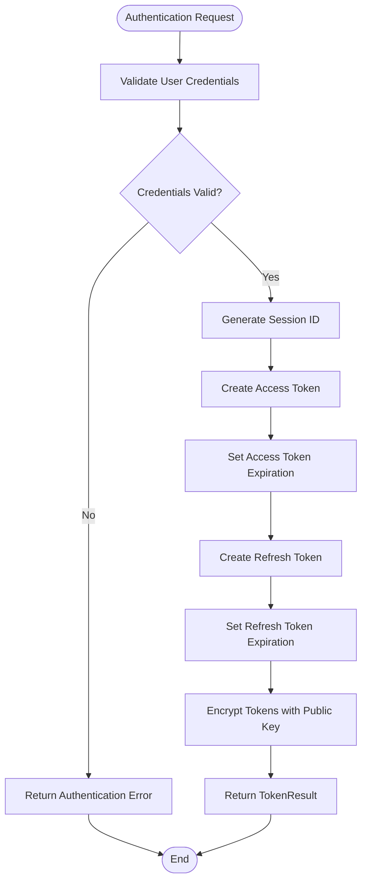

# Client Authentication Configuration

<cite>
**Referenced Files in This Document**
- [ClientSettings.cs](file://src/Unlimotion/ClientSettings.cs)
- [ServerTaskStorage.cs](file://src/Unlimotion/ServerTaskStorage.cs)
- [MainWindowViewModel.cs](file://src/Unlimotion.ViewModel/MainWindowViewModel.cs)
- [TaskStorageSettings.cs](file://src/Unlimotion.ViewModel/TaskStorageSettings.cs)
- [AuthService.cs](file://src/Unlimotion.Server.ServiceInterface/AuthService.cs)
- [TokenResult.cs](file://src/Unlimotion.Server.ServiceModel/Molds/TokenResult.cs)
- [Auth.cs](file://src/Unlimotion.Server.ServiceModel/Auth.cs)
- [ChatHub.cs](file://src/Unlimotion.Server\hubs\ChatHub.cs)
- [LogOn.cs](file://src/Unlimotion.Interface\LogOn.cs)
</cite>

## Table of Contents
1. [Introduction](#introduction)
2. [ClientSettings Model Overview](#clientsettings-model-overview)
3. [Authentication Architecture](#authentication-architecture)
4. [Token Management System](#token-management-system)
5. [Authentication Flow](#authentication-flow)
6. [Session Persistence](#session-persistence)
7. [Security Considerations](#security-considerations)
8. [Error Handling and Troubleshooting](#error-handling-and-troubleshooting)
9. [Integration with Application Security](#integration-with-application-security)
10. [Best Practices](#best-practices)

## Introduction

The Unlimotion client authentication system is built around the `ClientSettings` model, which serves as the central repository for managing user authentication state and JWT token lifecycle. This system implements a robust token-based authentication mechanism with automatic token refresh capabilities, ensuring seamless user experience while maintaining security standards.

The authentication architecture follows modern JWT (JSON Web Token) best practices, utilizing both access tokens for API requests and refresh tokens for maintaining persistent sessions. The system handles token expiration, automatic renewal, and secure storage of authentication credentials.

## ClientSettings Model Overview

The `ClientSettings` class represents the core data structure for managing client-side authentication state. It encapsulates all necessary information for maintaining authenticated sessions with the Unlimotion server.

**Diagram sources**
- [ClientSettings.cs](file://src/Unlimotion/ClientSettings.cs#L1-L16)
- [TaskStorageSettings.cs](file://src/Unlimotion.ViewModel/TaskStorageSettings.cs#L1-L35)
- [ServerTaskStorage.cs](file://src/Unlimotion/ServerTaskStorage.cs#L25-L50)

**Section sources**
- [ClientSettings.cs](file://src/Unlimotion/ClientSettings.cs#L1-L16)

### Property Definitions

#### AccessToken
The primary authentication token used for API requests to the Unlimotion server. This JWT token contains encoded user information and is validated by the server for each authenticated request.

**Characteristics:**
- Type: `string`
- Purpose: Authorization for API requests
- Validation: Server-side JWT verification
- Expiration: Configurable lifetime (typically 15-30 minutes)

#### RefreshToken
A secondary token used exclusively for obtaining new access tokens when the current access token expires. This token has a longer lifespan and is stored securely for session persistence.

**Characteristics:**
- Type: `string`
- Purpose: Token renewal mechanism
- Storage: Secure local storage
- Expiration: Longer lifespan than access token
- Security: Requires HTTPS transmission only

#### ExpireTime
Tracks the expiration timestamp of the current access token, enabling automatic token refresh before expiration.

**Characteristics:**
- Type: `DateTimeOffset`
- Purpose: Token lifecycle management
- Calculation: Based on server-provided expiration
- Automatic: Updated during token refresh operations

#### UserId
Unique identifier for the authenticated user, essential for data isolation and user-specific operations.

**Characteristics:**
- Type: `string`
- Purpose: User identification
- Format: Server-generated unique identifier
- Security: Used in JWT payload for user association

#### Login
Human-readable username or identifier for display purposes and configuration storage.

**Characteristics:**
- Type: `string`
- Purpose: User display and configuration
- Format: User-defined or server-assigned
- Usage: Settings persistence and UI display

## Authentication Architecture

The authentication system implements a layered architecture that separates concerns between client-side token management, server-side validation, and application-level security enforcement.

**Diagram sources**
- [ServerTaskStorage.cs](file://src/Unlimotion/ServerTaskStorage.cs#L130-L200)
- [AuthService.cs](file://src/Unlimotion.Server.ServiceInterface\AuthService.cs#L61-L90)

**Section sources**
- [ServerTaskStorage.cs](file://src/Unlimotion/ServerTaskStorage.cs#L130-L200)

## Token Management System

The token management system handles the complete lifecycle of JWT tokens, from initial authentication through ongoing session maintenance and automatic renewal.

### Token Generation Process

The server generates both access and refresh tokens during the initial authentication or registration process. The tokens are created with specific expiration policies and encrypted using RSA public key cryptography.

**Diagram sources**
- [AuthService.cs](file://src/Unlimotion.Server.ServiceInterface\AuthService.cs#L130-L217)

### Token Refresh Mechanism

The system implements automatic token refresh when the access token approaches expiration, ensuring uninterrupted user experience.

**Refresh Triggers:**
- Access token expiration detection
- API request failures due to expired tokens
- Periodic background checks

**Refresh Process:**
1. Validate refresh token with server
2. Generate new access and refresh tokens
3. Update client-side token storage
4. Retry failed API requests
5. Notify application of authentication state changes

**Section sources**
- [ServerTaskStorage.cs](file://src/Unlimotion/ServerTaskStorage.cs#L400-L450)

## Authentication Flow

The authentication flow encompasses multiple scenarios including initial login, token refresh, and logout operations, each with specific security considerations and error handling.

### Initial Login Process

When users first connect to the Unlimotion server, the system performs a comprehensive authentication sequence:

1. **Configuration Loading**: Retrieve stored credentials from `TaskStorageSettings`
2. **Token Validation**: Check existing tokens for validity
3. **Authentication Request**: Send credentials to server for validation
4. **Token Reception**: Store new tokens in `ClientSettings`
5. **Session Establishment**: Establish WebSocket connection for real-time features

### Token Refresh Flow

Automatic token refresh occurs seamlessly in the background:

1. **Expiration Detection**: Monitor access token expiration time
2. **Background Refresh**: Initiate refresh request without user intervention
3. **Error Handling**: Graceful degradation on refresh failure
4. **Retry Logic**: Implement exponential backoff for failed refresh attempts

### Logout Process

The logout process ensures complete session termination:

1. **Connection Termination**: Close WebSocket connections
2. **Token Clearing**: Remove tokens from `ClientSettings`
3. **Local Storage Cleanup**: Clear sensitive data from configuration
4. **Event Notification**: Trigger sign-out events throughout application

**Section sources**
- [ServerTaskStorage.cs](file://src/Unlimotion/ServerTaskStorage.cs#L80-L130)

## Session Persistence

Session persistence ensures that user authentication state survives application restarts while maintaining appropriate security measures.

### Configuration Storage

Authentication settings are persisted through the application's configuration system:

| Setting | Storage Location | Security Level |
|---------|------------------|----------------|
| AccessToken | ClientSettings | Memory only |
| RefreshToken | ClientSettings | Memory only |
| UserId | ClientSettings | Memory only |
| Login | TaskStorageSettings | Encrypted storage |
| Password | TaskStorageSettings | Encrypted storage |

### Memory Management

The system employs careful memory management to prevent token leakage:

- **Immediate Clearing**: Tokens are cleared from memory upon logout
- **Garbage Collection**: Explicit cleanup of sensitive data references
- **Secure Disposal**: Proper disposal of authentication contexts

### Recovery Mechanisms

The system includes recovery mechanisms for authentication state corruption:

- **Automatic Re-authentication**: Attempt re-login with stored credentials
- **Graceful Degradation**: Continue operation with reduced functionality
- **User Notification**: Inform users of authentication state changes

**Section sources**
- [ServerTaskStorage.cs](file://src/Unlimotion/ServerTaskStorage.cs#L80-L110)

## Security Considerations

The authentication system implements multiple security layers to protect user credentials and maintain session integrity.

### Token Security

**Access Token Protection:**
- Short-lived expiration (typically 15-30 minutes)
- Memory-only storage
- Automatic clearing on logout
- HTTPS-only transmission

**Refresh Token Protection:**
- Long-lived expiration
- Secure local storage
- Server-side validation
- Rotation on successful refresh

### Credential Storage

**Sensitive Data Handling:**
- Passwords stored in encrypted configuration
- Login information protected during transmission
- No plaintext credential logging
- Secure temporary storage during authentication

**Encryption Standards:**
- AES encryption for configuration storage
- RSA encryption for token signing
- TLS 1.2+ for network communication
- Secure random generation for session identifiers

### Network Security

**Communication Protocols:**
- HTTPS mandatory for all authentication requests
- Certificate pinning for server validation
- Secure WebSocket connections for real-time features
- Rate limiting for authentication endpoints

**Attack Mitigation:**
- CSRF protection for authentication endpoints
- Brute force prevention through rate limiting
- Token replay attack prevention
- Session fixation protection

**Section sources**
- [AuthService.cs](file://src/Unlimotion.Server.ServiceInterface\AuthService.cs#L157-L185)

## Error Handling and Troubleshooting

The authentication system provides comprehensive error handling and diagnostic capabilities for troubleshooting common authentication issues.

### Common Authentication Issues

#### Expired Sessions
**Symptoms:**
- API requests returning 401 Unauthorized
- Automatic token refresh failures
- User prompted to re-authenticate frequently

**Resolution Steps:**
1. Verify network connectivity
2. Check system clock synchronization
3. Review token refresh logs
4. Attempt manual re-authentication

#### Invalid Tokens
**Symptoms:**
- JWT validation errors
- Token signature mismatches
- Unexpected authentication failures

**Resolution Steps:**
1. Clear cached tokens
2. Re-authenticate with server
3. Verify token format and encoding
4. Check server certificate validity

#### Login Failures
**Symptoms:**
- Authentication endpoint timeouts
- Invalid credential responses
- Registration failures

**Resolution Steps:**
1. Verify server availability
2. Check credential format and validity
3. Review network firewall settings
4. Contact support for account issues

### Diagnostic Tools

**Logging and Monitoring:**
- Comprehensive audit trails for authentication events
- Real-time monitoring of token usage
- Automated alerting for suspicious activities
- Performance metrics for authentication endpoints

**Debug Information:**
- Token expiration timestamps
- Authentication attempt history
- Network connectivity status
- Server response times

### Recovery Procedures

**Automatic Recovery:**
- Background token refresh attempts
- Graceful degradation of functionality
- User-friendly error messages
- Retry mechanisms with exponential backoff

**Manual Recovery:**
- Forced token refresh option
- Clear cached credentials
- Reset authentication state
- Re-establish server connection

**Section sources**
- [ServerTaskStorage.cs](file://src/Unlimotion/ServerTaskStorage.cs#L200-L250)

## Integration with Application Security

The ClientSettings model integrates deeply with the application's security architecture, providing hooks for various security mechanisms and compliance requirements.

### Security Event Integration

**Authentication Events:**
- Sign-in/sign-out notifications
- Token refresh confirmations
- Session timeout alerts
- Security breach detections

**Authorization Integration:**
- Role-based access control
- Resource permission checking
- API endpoint protection
- Data isolation enforcement

### Compliance Features

**Data Protection:**
- GDPR-compliant data handling
- User consent management
- Data retention policies
- Right to erasure implementation

**Audit Requirements:**
- Comprehensive activity logging
- Security event tracking
- Compliance reporting
- Forensic analysis support

### Extensibility Points

**Custom Security Providers:**
- Pluggable authentication modules
- Multi-factor authentication support
- Single sign-on integration
- Enterprise identity provider compatibility

**Security Policy Enforcement:**
- Dynamic policy updates
- Conditional access controls
- Risk-based authentication
- Adaptive security measures

**Section sources**
- [ChatHub.cs](file://src/Unlimotion.Server\hubs\ChatHub.cs#L191-L220)

## Best Practices

### Development Guidelines

**Token Management:**
- Always validate token expiration before use
- Implement proper error handling for token refresh failures
- Never log token contents or metadata
- Clear tokens from memory promptly after use

**Security Implementation:**
- Use HTTPS for all authentication communications
- Implement proper input validation for credentials
- Apply principle of least privilege
- Regular security audits and penetration testing

**Performance Optimization:**
- Cache tokens efficiently in memory
- Implement intelligent retry mechanisms
- Monitor authentication performance metrics
- Optimize token refresh timing

### Deployment Considerations

**Environment Configuration:**
- Separate authentication configurations for environments
- Secure credential management in CI/CD pipelines
- Environment-specific token validation
- Proper certificate management

**Monitoring and Alerting:**
- Real-time authentication failure monitoring
- Anomaly detection for suspicious activities
- Performance baseline establishment
- Capacity planning for authentication load

### Maintenance Procedures

**Regular Updates:**
- Keep authentication libraries updated
- Review and update security policies regularly
- Monitor for emerging threats and vulnerabilities
- Update compliance documentation

**Incident Response:**
- Established procedures for authentication breaches
- Communication protocols for security incidents
- Recovery procedures for authentication system failures
- Post-incident analysis and improvement

The ClientSettings model and associated authentication system provide a robust foundation for secure, reliable user authentication in the Unlimotion application. By following these guidelines and best practices, developers can maintain the security and reliability of the authentication system while providing excellent user experience.