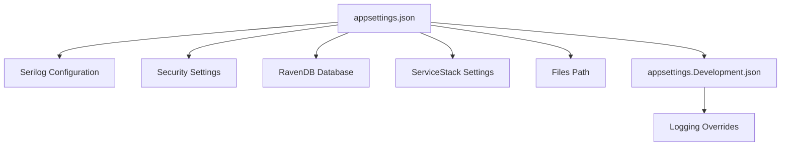
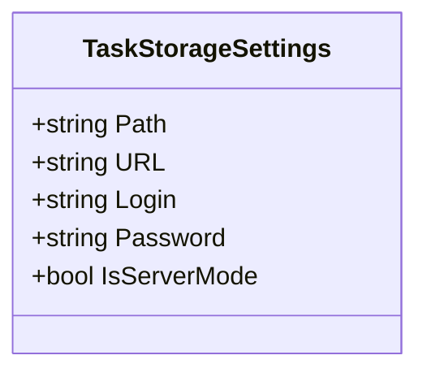
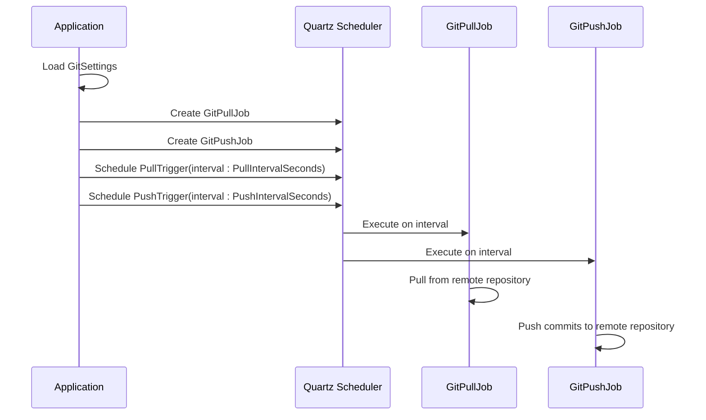
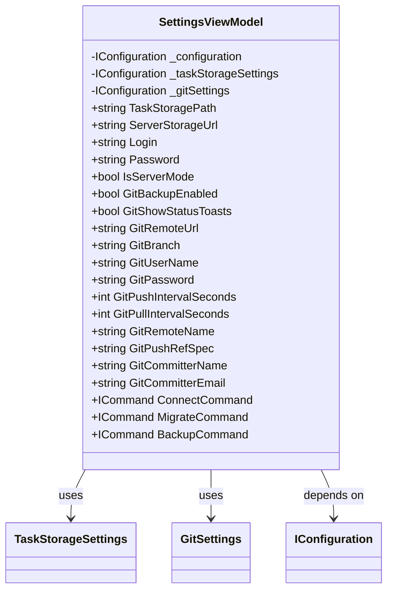
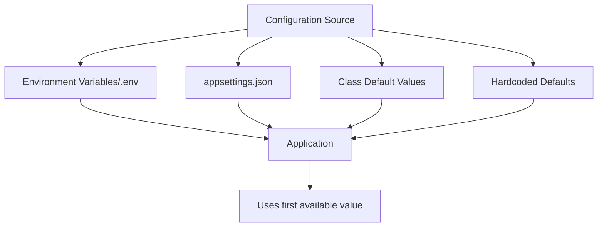

# Configuration Reference

<cite>
**Referenced Files in This Document**   
- [appsettings.json](file://src/Unlimotion.Server/appsettings.json)
- [TaskStorageSettings.cs](file://src/Unlimotion.ViewModel/TaskStorageSettings.cs)
- [GitSettings.cs](file://src/Unlimotion.ViewModel/TaskStorageSettings.cs)
- [appsettings.json](file://src/Unlimotion.TelegramBot/appsettings.json)
- [GitSettings.cs](file://src/Unlimotion.TelegramBot/GitSettings.cs)
- [.env](file://src/.env)
- [App.axaml.cs](file://src/Unlimotion/App.axaml.cs)
- [SettingsViewModel.cs](file://src/Unlimotion.ViewModel/SettingsViewModel.cs)
</cite>

## Table of Contents
1. [Introduction](#introduction)
2. [Server Configuration](#server-configuration)
3. [Task Storage Settings](#task-storage-settings)
4. [Git Backup Configuration](#git-backup-configuration)
5. [Client Settings](#client-settings)
6. [Environment Variables](#environment-variables)
7. [Configuration Scenarios](#configuration-scenarios)
8. [Validation and Error Handling](#validation-and-error-handling)
9. [Migration and Fallback Mechanisms](#migration-and-fallback-mechanisms)

## Introduction
This document provides comprehensive documentation for Unlimotion's configuration system. It details the various configuration files and settings that control the application's behavior, including server configuration, task storage, Git integration, client settings, and environment-specific variables. The documentation covers the structure of configuration files, default values, validation rules, and practical examples for common configuration scenarios.

**Section sources**
- [appsettings.json](file://src/Unlimotion.Server/appsettings.json)
- [TaskStorageSettings.cs](file://src/Unlimotion.ViewModel/TaskStorageSettings.cs)

## Server Configuration
The server configuration is managed through the `appsettings.json` file located in the `src/Unlimotion.Server` directory. This file contains settings for logging, security, database connections, and service endpoints.

The configuration includes:
- **Serilog**: Configures logging behavior with console and file output
- **Security**: Contains RSA private key for encryption operations
- **RavenDb**: Database connection settings including server URL and data directory
- **ServiceStackSettings**: License key and address for ServiceStack services
- **FilesPath**: Base path for storing files

The `appsettings.Development.json` file provides environment-specific overrides for development scenarios, primarily adjusting logging levels to "Debug" for more detailed output.



**Diagram sources**
- [appsettings.json](file://src/Unlimotion.Server/appsettings.json)
- [appsettings.Development.json](file://src/Unlimotion.Server/appsettings.Development.json)

**Section sources**
- [appsettings.json](file://src/Unlimotion.Server/appsettings.json)
- [appsettings.Development.json](file://src/Unlimotion.Server/appsettings.Development.json)

## Task Storage Settings
The `TaskStorageSettings` model defines the configuration for task storage in Unlimotion. This class is located in `TaskStorageSettings.cs` and controls how tasks are stored locally or accessed from a server.

Key properties include:
- **Path**: Local file system path for storing task data
- **URL**: Server endpoint URL when using server mode
- **Login**: User identifier for authentication
- **Password**: Authentication password (currently stored in plain text with a TODO note about encrypted storage)
- **IsServerMode**: Boolean flag indicating whether to use server-based storage

The system initializes these settings in the `App.axaml.cs` file, creating default instances if none exist in the configuration. The settings are then used to register the appropriate storage mechanism through the `TaskStorages.RegisterStorage` method.



**Diagram sources**
- [TaskStorageSettings.cs](file://src/Unlimotion.ViewModel/TaskStorageSettings.cs)

**Section sources**
- [TaskStorageSettings.cs](file://src/Unlimotion.ViewModel/TaskStorageSettings.cs)
- [App.axaml.cs](file://src/Unlimotion/App.axaml.cs)

## Git Backup Configuration
Unlimotion provides automated backup functionality through Git integration, configured via the `GitSettings` class. This configuration is used by both the main application and the Telegram bot component.

The Git settings include:
- **BackupEnabled**: Controls whether automatic Git backup is active
- **ShowStatusToasts**: Determines if backup status notifications are displayed
- **RemoteUrl**: Git repository URL for backup operations
- **Branch**: Target branch for commits (defaults to "master")
- **UserName/Password**: Credentials for Git authentication
- **PullIntervalSeconds/PushIntervalSeconds**: Scheduling intervals for pull and push operations
- **RemoteName**: Name of the remote repository (defaults to "origin")
- **PushRefSpec**: Reference specification for push operations
- **CommitterName/Email**: Identity used for commit authorship

In the main application, these settings are integrated with Quartz.NET scheduler to automate backup jobs. The `GitPullJob` and `GitPushJob` are scheduled based on the interval settings, and the scheduler is started when backup is enabled and the application is not in server mode.



**Diagram sources**
- [TaskStorageSettings.cs](file://src/Unlimotion.ViewModel/TaskStorageSettings.cs)
- [App.axaml.cs](file://src/Unlimotion/App.axaml.cs)

**Section sources**
- [TaskStorageSettings.cs](file://src/Unlimotion.ViewModel/TaskStorageSettings.cs)
- [App.axaml.cs](file://src/Unlimotion/App.axaml.cs)

## Client Settings
Client settings in Unlimotion are managed through the `SettingsViewModel` class, which provides a reactive interface for accessing and modifying configuration values. The settings are organized into two main sections: task storage and Git configuration.

The `SettingsViewModel` uses the Microsoft.Extensions.Configuration system to access configuration values through sections:
- **TaskStorage section**: Contains path, URL, login, password, and server mode settings
- **Git section**: Contains all Git backup configuration options

The view model exposes properties that automatically synchronize with the underlying configuration, enabling two-way binding in the UI. When settings are modified, they are immediately persisted to the configuration file. The view model also provides commands for various operations like connecting to servers, migrating data, and performing manual backup operations.



**Diagram sources**
- [SettingsViewModel.cs](file://src/Unlimotion.ViewModel/SettingsViewModel.cs)

**Section sources**
- [SettingsViewModel.cs](file://src/Unlimotion.ViewModel/SettingsViewModel.cs)

## Environment Variables
Environment variables in Unlimotion are managed through the `.env` file located in the root directory. This file provides a way to override configuration settings with environment-specific values, following the principle of configuration precedence where environment variables take priority over file-based configuration.

The `.env` file is particularly useful for:
- Storing sensitive information like passwords and API keys outside of version control
- Configuring different environments (development, staging, production) with different settings
- Deploying to containerized environments where configuration is typically injected as environment variables

While the specific format and parsing mechanism for the `.env` file isn't visible in the provided code, the presence of the file indicates support for environment variable-based configuration. The application likely uses a configuration provider that reads environment variables and makes them available through the IConfiguration interface, allowing seamless integration with the existing configuration system.

**Section sources**
- [.env](file://src/.env)

## Configuration Scenarios
This section provides examples of common configuration scenarios for Unlimotion.

### Setting Up Custom Storage Location
To configure a custom storage location, modify the `Path` property in the `TaskStorage` section of the configuration:
```json
{
  "TaskStorage": {
    "Path": "C:\\MyCustomTasksLocation",
    "IsServerMode": false
  }
}
```

### Configuring Git Integration with SSH Authentication
For SSH authentication, set the RemoteUrl to use SSH protocol and provide appropriate credentials:
```json
{
  "Git": {
    "BackupEnabled": true,
    "RemoteUrl": "git@github.com:username/unlimotion-backup.git",
    "Branch": "main",
    "UserName": "git",
    "Password": "SSH_PRIVATE_KEY_CONTENTS",
    "PullIntervalSeconds": 300,
    "PushIntervalSeconds": 600
  }
}
```

### Connecting to Remote Server Instance
To connect to a remote server instance, configure the TaskStorage settings accordingly:
```json
{
  "TaskStorage": {
    "URL": "https://my-unlimotion-server.com",
    "Login": "myusername",
    "Password": "mypassword",
    "IsServerMode": true
  }
}
```

**Section sources**
- [TaskStorageSettings.cs](file://src/Unlimotion.ViewModel/TaskStorageSettings.cs)
- [SettingsViewModel.cs](file://src/Unlimotion.ViewModel/SettingsViewModel.cs)

## Validation and Error Handling
Unlimotion's configuration system includes validation mechanisms to ensure settings are properly formatted and complete. When invalid settings are detected, the application provides appropriate error messages to guide users toward correction.

Key validation aspects include:
- **Required fields**: Ensuring essential settings like storage path or server URL are provided
- **Format validation**: Checking that URLs, email addresses, and other structured data follow correct formats
- **Range validation**: Ensuring numeric values like interval seconds fall within acceptable ranges
- **Authentication validation**: Verifying that credentials are provided when required

The application handles missing or invalid configurations by:
- Creating default instances of configuration objects when none exist
- Using default values for individual properties as defined in the configuration classes
- Providing clear error messages when configuration issues prevent startup or operation
- Gracefully degrading functionality when non-essential settings are invalid

**Section sources**
- [App.axaml.cs](file://src/Unlimotion/App.axaml.cs)
- [TaskStorageSettings.cs](file://src/Unlimotion.ViewModel/TaskStorageSettings.cs)

## Migration and Fallback Mechanisms
Unlimotion implements robust migration and fallback mechanisms to handle configuration changes between versions and missing settings.

### Configuration Migration
When configuration formats change between versions:
- The application detects the absence of expected configuration sections
- Creates new configuration objects with default values
- Preserves existing valid settings while adding new ones
- Maintains backward compatibility with older configuration formats when possible

### Fallback Mechanisms
The system employs several fallback strategies:
- **Default values**: Configuration properties have sensible defaults (e.g., "master" for Git branch)
- **Graceful initialization**: When settings are missing, the application creates default instances rather than failing
- **Conditional feature activation**: Features like Git backup are disabled by default and only activated when explicitly configured
- **Environment-specific configuration**: Development settings in `appsettings.Development.json` provide appropriate defaults for development scenarios

The configuration precedence follows this order:
1. Environment variables (including .env file)
2. appsettings.json
3. Default values in configuration classes
4. Hardcoded defaults in code

This layered approach ensures the application remains functional even with minimal configuration while allowing extensive customization when needed.



**Diagram sources**
- [appsettings.json](file://src/Unlimotion.Server/appsettings.json)
- [TaskStorageSettings.cs](file://src/Unlimotion.ViewModel/TaskStorageSettings.cs)
- [App.axaml.cs](file://src/Unlimotion/App.axaml.cs)

**Section sources**
- [App.axaml.cs](file://src/Unlimotion/App.axaml.cs)
- [TaskStorageSettings.cs](file://src/Unlimotion.ViewModel/TaskStorageSettings.cs)
- [appsettings.json](file://src/Unlimotion.Server/appsettings.json)