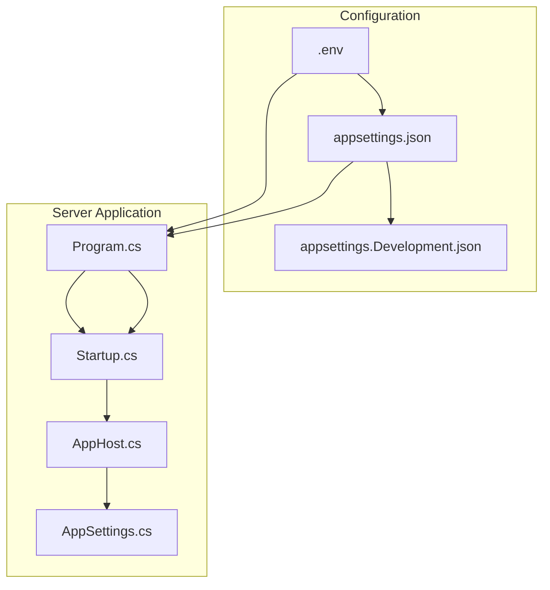
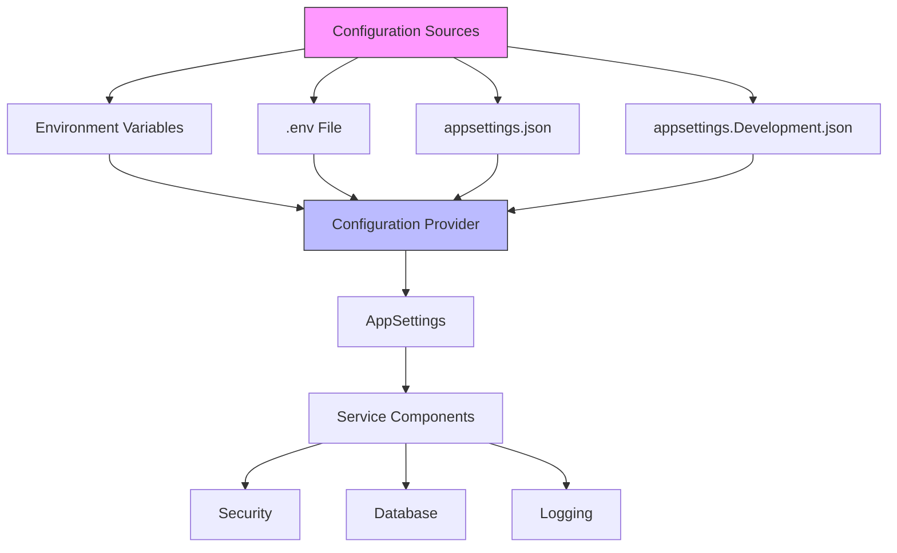
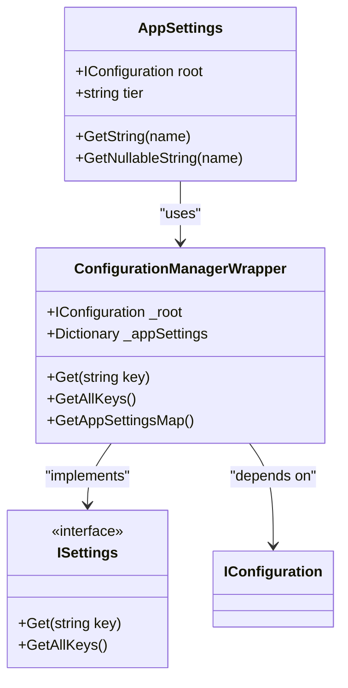
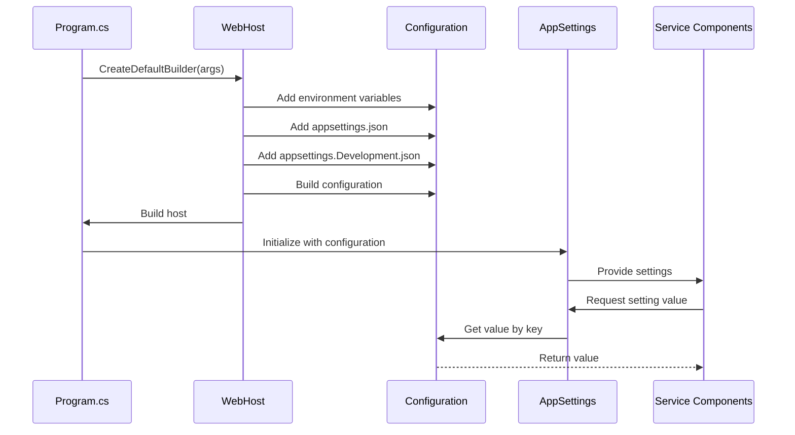
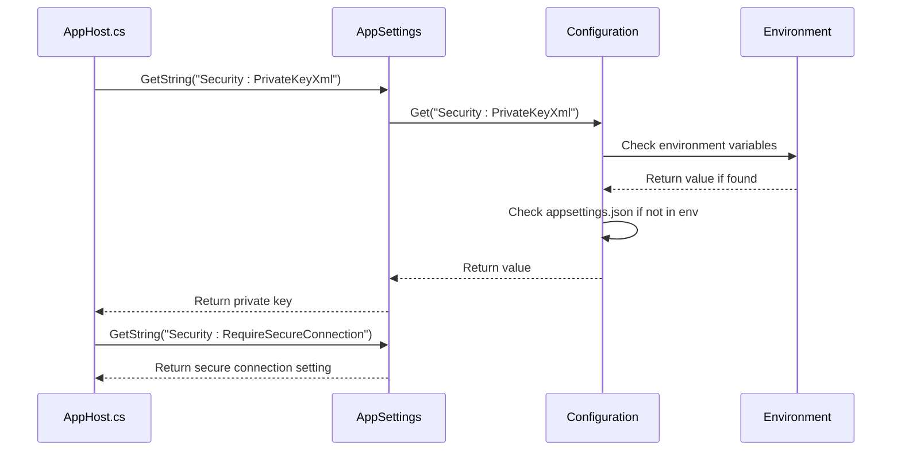
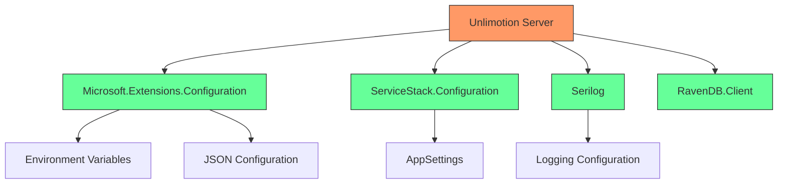

# Environment Variables

<cite>
**Referenced Files in This Document**   
- [.env](file://src/.env)
- [appsettings.json](file://src/Unlimotion.Server/appsettings.json)
- [Program.cs](file://src/Unlimotion.Server/Program.cs)
- [Startup.cs](file://src/Unlimotion.Server/Startup.cs)
- [AppSettings.cs](file://src/Unlimotion.Server/AppSettings.cs)
- [AppHost.cs](file://src/Unlimotion.Server/AppHost.cs)
- [ServiceStackKey.cs](file://src/Unlimotion.Server/ServiceStackKey.cs)
- [Dockerfile](file://src/Unlimotion.Server/Dockerfile)
</cite>

## Table of Contents
1. [Introduction](#introduction)
2. [Project Structure](#project-structure)
3. [Core Components](#core-components)
4. [Architecture Overview](#architecture-overview)
5. [Detailed Component Analysis](#detailed-component-analysis)
6. [Dependency Analysis](#dependency-analysis)
7. [Performance Considerations](#performance-considerations)
8. [Troubleshooting Guide](#troubleshooting-guide)
9. [Conclusion](#conclusion)

## Introduction
This document provides comprehensive documentation for Unlimotion's environment variable system using the .env file. It explains how environment variables provide a secure and flexible way to override configuration settings without modifying configuration files. The document covers the expected format of the .env file, precedence hierarchy, common use cases, security practices, and application startup configuration loading process.

## Project Structure
The Unlimotion project is structured with a clear separation of concerns across multiple components. The server-side configuration is primarily managed in the `Unlimotion.Server` directory, which contains configuration files and startup logic. The `.env` file is located in the root of the `src` directory, indicating its role in environment-specific configuration for the application.



**Diagram sources**
- [.env](file://src/.env)
- [appsettings.json](file://src/Unlimotion.Server/appsettings.json)
- [Program.cs](file://src/Unlimotion.Server/Program.cs)
- [Startup.cs](file://src/Unlimotion.Server/Startup.cs)

**Section sources**
- [.env](file://src/.env)
- [appsettings.json](file://src/Unlimotion.Server/appsettings.json)
- [Program.cs](file://src/Unlimotion.Server/Program.cs)

## Core Components
The environment variable system in Unlimotion is built on ASP.NET Core's configuration system with additional layers from ServiceStack for settings management. The core components include the .env file for environment variables, appsettings.json for default configuration values, and the AppSettings class that provides a wrapper around the configuration system for accessing settings throughout the application.

The configuration system follows a hierarchical approach where environment variables take precedence over values in JSON configuration files. This allows for flexible deployment across different environments without modifying configuration files.

**Section sources**
- [AppSettings.cs](file://src/Unlimotion.Server/AppSettings.cs)
- [Program.cs](file://src/Unlimotion.Server/Program.cs)
- [appsettings.json](file://src/Unlimotion.Server/appsettings.json)

## Architecture Overview
The environment variable architecture in Unlimotion follows a layered configuration approach that prioritizes flexibility and security. The system loads configuration from multiple sources with a defined precedence order, allowing environment-specific values to override defaults without code changes.



**Diagram sources**
- [Program.cs](file://src/Unlimotion.Server/Program.cs)
- [AppSettings.cs](file://src/Unlimotion.Server/AppSettings.cs)
- [appsettings.json](file://src/Unlimotion.Server/appsettings.json)

## Detailed Component Analysis

### Environment Variable Processing
The environment variable system in Unlimotion is implemented through the integration of ASP.NET Core's configuration system with ServiceStack's settings management. The application uses a custom AppSettings class that wraps the IConfiguration interface, providing a unified way to access configuration values from various sources.

The AppSettings class implements ServiceStack's ISettings interface, allowing it to be used throughout the application for configuration access. It uses a ConfigurationManagerWrapper that delegates to the underlying IConfiguration object, which automatically includes environment variables in its configuration sources.



**Diagram sources**
- [AppSettings.cs](file://src/Unlimotion.Server/AppSettings.cs)

**Section sources**
- [AppSettings.cs](file://src/Unlimotion.Server/AppSettings.cs)

### Configuration Loading Process
The application's configuration loading process begins in the Program.cs file, where the WebHost is configured to use the default configuration providers, including environment variables. The ConfigureAppConfiguration method adds a writable JSON configuration source for appsettings.json, allowing runtime modifications to be persisted.

During startup, the application builds the configuration from multiple sources with the following precedence (highest to lowest):
1. Environment variables
2. Command line arguments
3. User secrets (in development)
4. appsettings.{Environment}.json
5. appsettings.json



**Diagram sources**
- [Program.cs](file://src/Unlimotion.Server/Program.cs)
- [Startup.cs](file://src/Unlimotion.Server/Startup.cs)
- [AppSettings.cs](file://src/Unlimotion.Server/AppSettings.cs)

**Section sources**
- [Program.cs](file://src/Unlimotion.Server/Program.cs)
- [Startup.cs](file://src/Unlimotion.Server/Startup.cs)

### .env File Format and Usage
The .env file in Unlimotion follows the standard dotenv format with key-value pairs separated by equals signs. The file is located at the root of the src directory and contains environment variables that are loaded into the application's configuration system.

The current .env file contains the COMPOSE_PROJECT_NAME variable, which is used by Docker Compose to identify the project. This demonstrates how environment variables can be used to configure containerized deployments without hardcoding values in configuration files.

The .env file supports standard dotenv syntax:
- Key-value pairs: KEY=VALUE
- Quoted values: KEY="VALUE WITH SPACES"
- Comments: # This is a comment
- Empty lines are ignored

When the application runs in a containerized environment, these environment variables are automatically loaded and take precedence over values in appsettings.json files.

**Section sources**
- [.env](file://src/.env)

### Precedence Hierarchy
Unlimotion's configuration system implements a clear precedence hierarchy that determines which configuration values take priority when the same setting is defined in multiple sources. This hierarchy ensures that environment-specific values can override defaults without modifying configuration files.

The precedence order from highest to lowest is:
1. Environment variables (including those from .env file)
2. Command line arguments
3. User secrets (development only)
4. appsettings.{Environment}.json
5. appsettings.json

This hierarchy allows for flexible configuration management across different deployment environments. For example, database connection strings and API keys can be set as environment variables in production, while using default values in appsettings.json for development.

```mermaid
flowchart TD
A[Configuration Request] --> B{Environment Variable Set?}
B --> |Yes| C[Return Environment Variable Value]
B --> |No| D{Command Line Argument Set?}
D --> |Yes| E[Return Command Line Value]
D --> |No| F{User Secret Exists?}
F --> |Yes| G[Return User Secret Value]
F --> |No| H{Environment-Specific JSON File}
H --> |Yes| I[Return appsettings.{Environment}.json Value]
H --> |No| J[Return appsettings.json Value]
style C fill:#aqua
style E fill:#aqua
style G fill:#aqua
style I fill:#aqua
style J fill:#aqua
```

**Diagram sources**
- [Program.cs](file://src/Unlimotion.Server/Program.cs)
- [AppSettings.cs](file://src/Unlimotion.Server/AppSettings.cs)

**Section sources**
- [Program.cs](file://src/Unlimotion.Server/Program.cs)
- [AppSettings.cs](file://src/Unlimotion.Server/AppSettings.cs)

### Security Configuration
The security configuration in Unlimotion demonstrates the use of environment variables for sensitive data. The appsettings.json file contains a Security section with a PrivateKeyXml value, which would typically be overridden by an environment variable in production environments.

The AppHost class retrieves the private key through the AppSettings.GetString method, which automatically checks environment variables first. This pattern ensures that sensitive cryptographic keys are not stored in configuration files that might be committed to version control.

Additionally, the ServiceStackKey class handles license key management, retrieving the license key from configuration and registering it with the ServiceStack framework. If the license key is not valid, it can fetch a new trial key from a remote URL, demonstrating a fallback mechanism for development environments.



**Diagram sources**
- [AppHost.cs](file://src/Unlimotion.Server/AppHost.cs)
- [AppSettings.cs](file://src/Unlimotion.Server/AppSettings.cs)
- [ServiceStackKey.cs](file://src/Unlimotion.Server/ServiceStackKey.cs)

**Section sources**
- [AppHost.cs](file://src/Unlimotion.Server/AppHost.cs)
- [ServiceStackKey.cs](file://src/Unlimotion.Server/ServiceStackKey.cs)

## Dependency Analysis
The environment variable system in Unlimotion has dependencies on several key components and external libraries. The primary dependencies include Microsoft.Extensions.Configuration for the configuration system, ServiceStack for settings management, and Serilog for logging configuration.



**Diagram sources**
- [Program.cs](file://src/Unlimotion.Server/Program.cs)
- [Startup.cs](file://src/Unlimotion.Server/Startup.cs)
- [AppSettings.cs](file://src/Unlimotion.Server/AppSettings.cs)

**Section sources**
- [Program.cs](file://src/Unlimotion.Server/Program.cs)
- [Startup.cs](file://src/Unlimotion.Server/Startup.cs)

## Performance Considerations
The configuration system in Unlimotion is designed for performance with caching mechanisms to minimize repeated file I/O operations. The AppSettings class caches configuration values in memory after the first access, reducing the overhead of configuration lookups during application execution.

The ConfigurationManagerWrapper class implements lazy loading of the appSettings dictionary, ensuring that configuration values are only parsed when needed. This approach optimizes startup time and memory usage, particularly in environments with large configuration files.

For containerized deployments, the use of environment variables eliminates the need for file-based configuration parsing, resulting in faster startup times and reduced disk I/O.

## Troubleshooting Guide
When troubleshooting environment variable issues in Unlimotion, consider the following common scenarios:

1. **Environment variables not being recognized**: Ensure that the .env file is properly formatted with correct key-value syntax and that there are no whitespace issues around the equals sign.

2. **Configuration values not overriding defaults**: Verify the precedence hierarchy and check if the same setting is defined in multiple configuration sources with higher precedence.

3. **Sensitive data exposure**: Never commit .env files with sensitive data to version control. Use .gitignore to exclude these files and provide a .env.example file with placeholder values for development.

4. **Container deployment issues**: When using Docker, ensure that environment variables are properly passed to the container either through the .env file or Docker Compose configuration.

**Section sources**
- [.env](file://src/.env)
- [Dockerfile](file://src/Unlimotion.Server/Dockerfile)
- [appsettings.json](file://src/Unlimotion.Server/appsettings.json)

## Conclusion
Unlimotion's environment variable system provides a robust and secure way to manage configuration across different deployment environments. By leveraging the .env file and ASP.NET Core's configuration system, the application can easily adapt to various environments without modifying code or configuration files.

The precedence hierarchy ensures that environment-specific values take priority, allowing for flexible deployment strategies. The integration with ServiceStack's settings management provides a consistent API for accessing configuration values throughout the application.

For production deployments, especially in containerized environments, using environment variables for sensitive data like API keys and database credentials enhances security by keeping these values out of version control. The current implementation demonstrates best practices for configuration management in modern .NET applications.