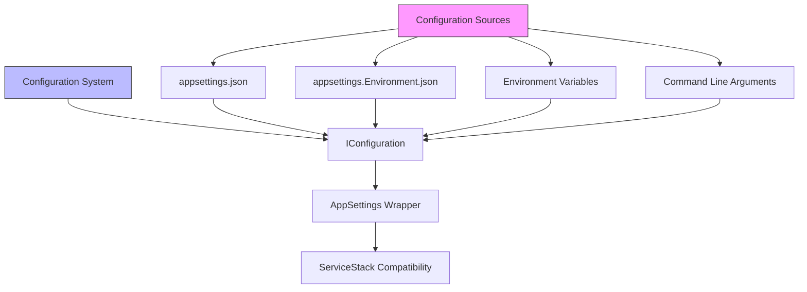
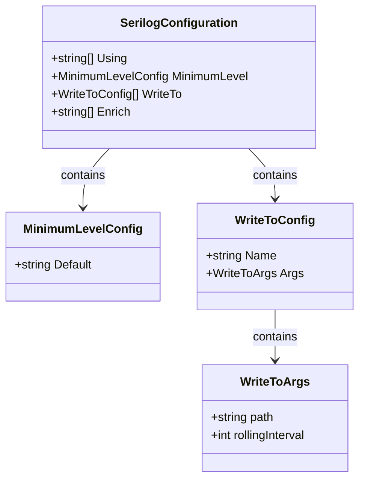
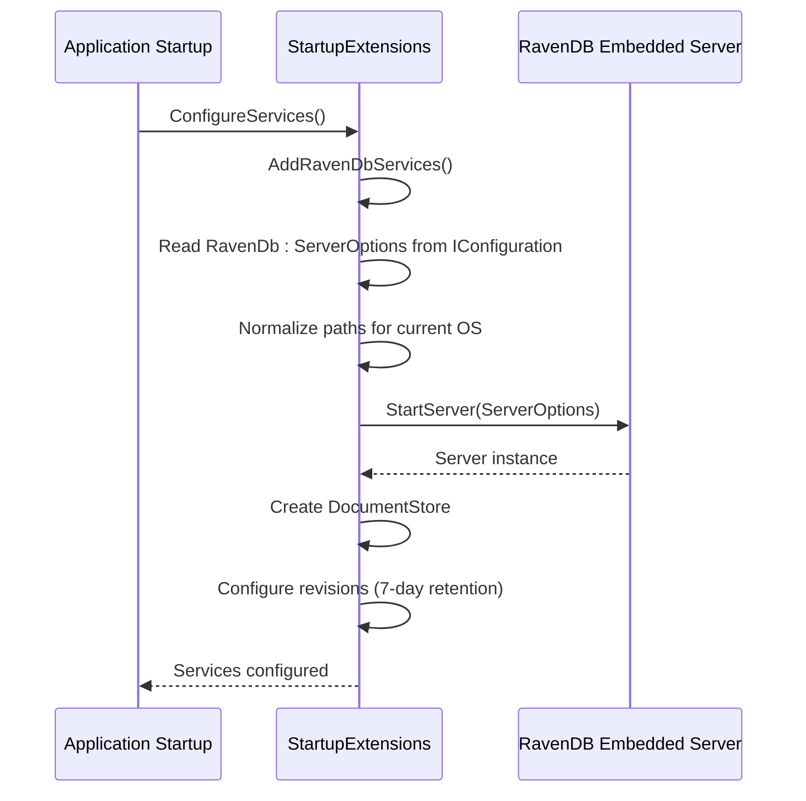
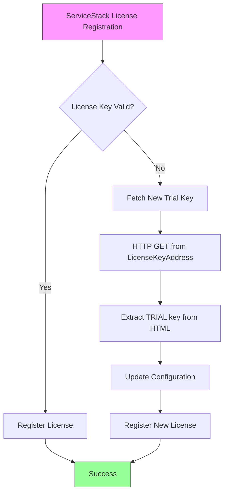
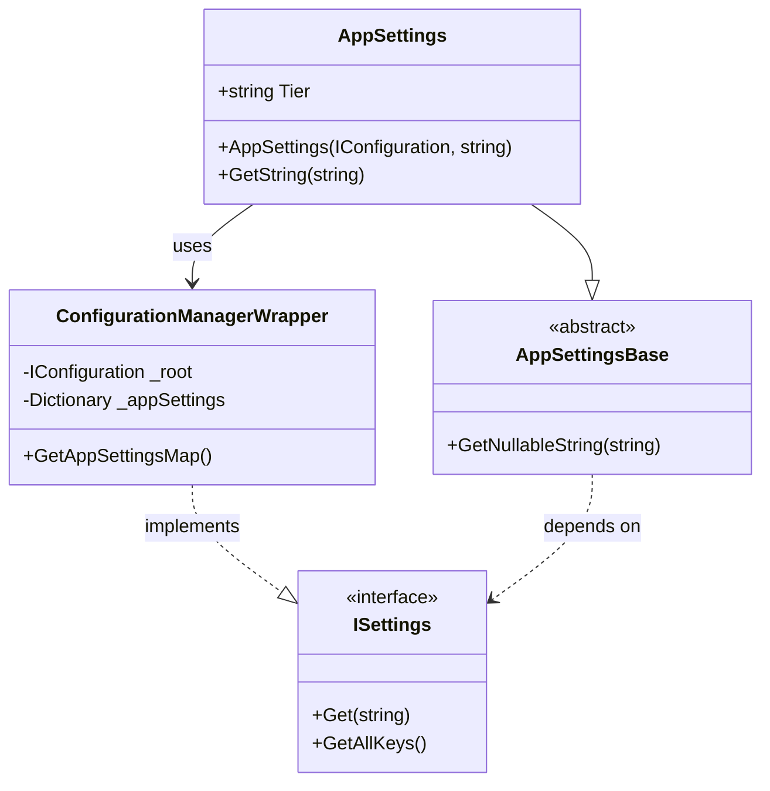

# Server Configuration

<cite>
**Referenced Files in This Document**   
- [appsettings.json](file://src/Unlimotion.Server/appsettings.json)
- [AppSettings.cs](file://src/Unlimotion.Server/AppSettings.cs)
- [Program.cs](file://src/Unlimotion.Server/Program.cs)
- [Startup.cs](file://src/Unlimotion.Server/Startup.cs)
- [ServiceStackKey.cs](file://src/Unlimotion.Server/ServiceStackKey.cs)
- [ServiceStackSettings.cs](file://src/Unlimotion.Server/ServiceStackSettings.cs)
- [StartupExtensions.cs](file://src/Unlimotion.Server/StartupExtensions.cs)
- [RavenDBLicense.json](file://src/Unlimotion.Server/RavenDBLicense.json)
- [appsettings.Development.json](file://src/Unlimotion.Server/appsettings.Development.json)
</cite>

## Table of Contents
1. [Introduction](#introduction)
2. [Configuration File Structure](#configuration-file-structure)
3. [Serilog Logging Configuration](#serilog-logging-configuration)
4. [RavenDB Database Settings](#ravendb-database-settings)
5. [ServiceStack Licensing](#servicestack-licensing)
6. [File Storage Paths](#file-storage-paths)
7. [Security Configuration](#security-configuration)
8. [AppSettings Class Implementation](#appsettings-class-implementation)
9. [Environment-Specific Configuration](#environment-specific-configuration)
10. [Configuration Precedence and Validation](#configuration-precedence-and-validation)
11. [Troubleshooting Common Issues](#troubleshooting-common-issues)

## Introduction
The Unlimotion server configuration system is built on ASP.NET Core's IConfiguration framework with additional integration for ServiceStack. The system uses JSON configuration files as the primary source of settings, with support for environment-specific overrides and runtime configuration. This documentation provides a comprehensive overview of the configuration system, detailing the structure and purpose of the appsettings.json file, the implementation of the AppSettings wrapper class, and guidance for configuring the server in different environments.

**Section sources**
- [appsettings.json](file://src/Unlimotion.Server/appsettings.json#L1-L45)
- [AppSettings.cs](file://src/Unlimotion.Server/AppSettings.cs#L1-L49)

## Configuration File Structure
The primary configuration file, appsettings.json, contains several key sections that control different aspects of the Unlimotion server:

- **Serilog**: Configures logging behavior including minimum log level and output destinations
- **Security**: Contains RSA private key configuration for authentication
- **RavenDb**: Defines database settings including server URL and data directory
- **ServiceStackSettings**: Manages ServiceStack license key and registration
- **FilesPath**: Specifies the path for file storage

The configuration system supports hierarchical section access using colon notation (e.g., "RavenDb:ServerOptions:ServerUrl") and allows for environment-specific overrides through files like appsettings.Development.json.



**Diagram sources**
- [appsettings.json](file://src/Unlimotion.Server/appsettings.json#L1-L45)
- [AppSettings.cs](file://src/Unlimotion.Server/AppSettings.cs#L1-L49)

**Section sources**
- [appsettings.json](file://src/Unlimotion.Server/appsettings.json#L1-L45)

## Serilog Logging Configuration
The Serilog section in appsettings.json configures the logging system with the following settings:

- **Using**: Specifies the Serilog sinks to load (Console and File)
- **MinimumLevel**: Sets the default log level to "Information"
- **WriteTo**: Defines output destinations with specific configurations:
  - Console sink for real-time monitoring
  - File sink with path "Log\\log.txt" and rolling interval of 4 (daily)
- **Enrich**: Includes "FromLogContext" to enrich log events with contextual information

The logging system is initialized in Program.cs using UseSerilog extension, which reads configuration from the IConfiguration instance. Log entries are written to both console and file, with files rolled daily to prevent excessive growth.



**Diagram sources**
- [appsettings.json](file://src/Unlimotion.Server/appsettings.json#L2-L20)
- [Program.cs](file://src/Unlimotion.Server/Program.cs#L35-L43)

**Section sources**
- [appsettings.json](file://src/Unlimotion.Server/appsettings.json#L2-L20)
- [Program.cs](file://src/Unlimotion.Server/Program.cs#L35-L43)

## RavenDB Database Settings
The RavenDB configuration is divided into two main sections:

### DatabaseRecord
- **DatabaseName**: Specifies the name of the database ("Unlimotion")

### ServerOptions
- **ServerUrl**: Base URL for the RavenDB server ("http://localhost:8080")
- **DataDirectory**: Path to store database files ("RavenDB")
- **LogsPath**: Path for RavenDB logs ("Log\\RavenDB")

The configuration is processed in StartupExtensions.cs, where paths are normalized to ensure correct directory separators across platforms. The system also configures automatic revision tracking with a 7-day retention period. RavenDB runs in embedded mode, with the server started automatically during application startup.



**Diagram sources**
- [appsettings.json](file://src/Unlimotion.Server/appsettings.json#L21-L33)
- [StartupExtensions.cs](file://src/Unlimotion.Server/StartupExtensions.cs#L20-L85)

**Section sources**
- [appsettings.json](file://src/Unlimotion.Server/appsettings.json#L21-L33)
- [StartupExtensions.cs](file://src/Unlimotion.Server/StartupExtensions.cs#L20-L85)

## ServiceStack Licensing
The ServiceStack licensing system is configured through the ServiceStackSettings section:

- **LicenseKey**: Contains the current ServiceStack license key (trial key in the example)
- **LicenseKeyAddress**: URL to retrieve new trial keys

The ServiceStackKey class handles license registration with a fallback mechanism:
1. Attempts to register the configured license key
2. If a LicenseException occurs, fetches a new trial key from the specified URL
3. Updates the configuration with the new key
4. Registers the new key with ServiceStack

This automatic renewal process ensures the server can continue operating even when trial keys expire, by fetching new trial keys from the ServiceStack website.



**Diagram sources**
- [ServiceStackKey.cs](file://src/Unlimotion.Server/ServiceStackKey.cs#L1-L50)
- [ServiceStackSettings.cs](file://src/Unlimotion.Server/ServiceStackSettings.cs#L1-L9)

**Section sources**
- [appsettings.json](file://src/Unlimotion.Server/appsettings.json#L34-L40)
- [ServiceStackKey.cs](file://src/Unlimotion.Server/ServiceStackKey.cs#L1-L50)

## File Storage Paths
The server configuration includes several path settings for different types of data storage:

- **FilesPath**: Base path for file storage ("Files")
- **DataDirectory**: RavenDB data directory ("RavenDB")
- **LogsPath**: Directory for RavenDB logs ("Log\\RavenDB")
- **Serilog path**: Main application log file ("Log\\log.txt")

These paths are relative to the application's content root directory. During startup, StartupExtensions.cs normalizes these paths to use the correct directory separators for the current operating system, ensuring cross-platform compatibility.

**Section sources**
- [appsettings.json](file://src/Unlimotion.Server/appsettings.json#L41-L45)
- [StartupExtensions.cs](file://src/Unlimotion.Server/StartupExtensions.cs#L50-L60)

## Security Configuration
The security configuration centers around RSA authentication using a private key:

### RSA Private Key
- **PrivateKeyXml**: Contains the complete RSA private key in XML format
- The key is used for authentication and token signing
- Stored directly in appsettings.json in the example configuration

### Best Practices for Security
- In production environments, sensitive keys should be stored in environment variables or secure vaults
- The current configuration exposes the private key in plain text, which is acceptable for development but not recommended for production
- Consider using ASP.NET Core's Secret Manager or Azure Key Vault for production deployments

The security configuration enables the server to authenticate users and sign tokens securely, forming the foundation of the application's security model.

**Section sources**
- [appsettings.json](file://src/Unlimotion.Server/appsettings.json#L15-L19)

## AppSettings Class Implementation
The AppSettings class provides a bridge between ASP.NET Core's IConfiguration and ServiceStack's ISettings interface:

### Architecture
- Inherits from ServiceStack's AppSettingsBase
- Wraps IConfiguration in a ConfigurationManagerWrapper class
- Implements ISettings interface for ServiceStack compatibility

### Key Methods
- **Constructor**: Accepts IConfiguration and optional tier parameter
- **GetString**: Overrides base method to return nullable strings
- **Get**: Retrieves configuration values directly from IConfiguration
- **GetAllKeys**: Returns all configuration keys from the appSettings section

The wrapper enables ServiceStack components to access configuration values while leveraging ASP.NET Core's robust configuration system, including support for multiple configuration sources and environment-specific settings.



**Diagram sources**
- [AppSettings.cs](file://src/Unlimotion.Server/AppSettings.cs#L1-L49)
- [ServiceStack.Configuration](nuget://ServiceStack.Configuration)

**Section sources**
- [AppSettings.cs](file://src/Unlimotion.Server/AppSettings.cs#L1-L49)

## Environment-Specific Configuration
The server supports environment-specific configuration through multiple mechanisms:

### Configuration File Hierarchy
1. appsettings.json - Base configuration
2. appsettings.{Environment}.json - Environment-specific overrides
3. Environment variables - Runtime overrides
4. Command line arguments - Highest precedence

### Development Environment
The appsettings.Development.json file demonstrates environment-specific configuration:
- Sets logging level to "Debug" for detailed diagnostics
- Overrides default "Information" level from base configuration
- Applies only when ASPNETCORE_ENVIRONMENT is set to "Development"

### Custom Configuration Examples
**Custom Log Path:**
```json
{
  "Serilog": {
    "WriteTo": [
      {
        "Name": "File",
        "Args": {
          "path": "C:\\Logs\\Unlimotion\\log.txt",
          "rollingInterval": 4
        }
      }
    ]
  }
}
```

**Custom Database Location:**
```json
{
  "RavenDb": {
    "ServerOptions": {
      "DataDirectory": "D:\\Data\\UnlimotionDB",
      "LogsPath": "D:\\Logs\\UnlimotionDB"
    }
  }
}
```

**Production Security Configuration:**
```json
{
  "Security": {
    "PrivateKeyXml": null
  }
}
```
With the private key provided via environment variable: `Security__PrivateKeyXml`

**Section sources**
- [appsettings.json](file://src/Unlimotion.Server/appsettings.json#L1-L45)
- [appsettings.Development.json](file://src/Unlimotion.Server/appsettings.Development.json#L1-L10)
- [Program.cs](file://src/Unlimotion.Server/Program.cs#L30-L33)

## Configuration Precedence and Validation
The configuration system follows ASP.NET Core's standard precedence rules:

### Precedence Order (Highest to Lowest)
1. Command line arguments
2. Environment variables (using double underscore notation)
3. appsettings.{Environment}.json
4. appsettings.json
5. Default values in code

### Environment Variable Mapping
Configuration keys are mapped to environment variables using double underscores:
- `RavenDb:ServerOptions:ServerUrl` → `RavenDb__ServerOptions__ServerUrl`
- `Serilog:MinimumLevel:Default` → `Serilog__MinimumLevel__Default`

### Validation Process
Configuration validation occurs during server startup:
1. Program.cs builds the web host and reads configuration
2. Startup.cs injects IConfiguration into services
3. ServiceStackKey validates and registers the license
4. StartupExtensions validates RavenDB configuration
5. Any configuration errors result in startup failure with logged exceptions

The system logs key configuration values during startup (RavenDB URL, data directory, logs path) to aid in troubleshooting.

**Section sources**
- [Program.cs](file://src/Unlimotion.Server/Program.cs#L15-L49)
- [Startup.cs](file://src/Unlimotion.Server/Startup.cs#L25-L62)
- [StartupExtensions.cs](file://src/Unlimotion.Server/StartupExtensions.cs#L55-L60)

## Troubleshooting Common Issues

### Database Connection Failures
**Symptoms:**
- Application fails to start
- "Host terminated unexpectedly" error
- RavenDB server not starting

**Solutions:**
1. Verify the DataDirectory path exists and is writable
2. Check that the port in ServerUrl is not in use
3. Ensure the application has permissions to create files in the data directory
4. Validate the RavenDBLicense.json file exists and is valid

**Section sources**
- [StartupExtensions.cs](file://src/Unlimotion.Server/StartupExtensions.cs#L70-L75)
- [RavenDBLicense.json](file://src/Unlimotion.Server/RavenDBLicense.json#L1-L24)

### Logging Not Working
**Symptoms:**
- No log files created
- Console output missing
- Log entries not appearing

**Solutions:**
1. Verify the Log directory exists and is writable
2. Check file path separators in the Serilog configuration
3. Ensure Serilog is properly configured in Program.cs
4. Validate minimum log level is appropriate for the environment

**Section sources**
- [appsettings.json](file://src/Unlimotion.Server/appsettings.json#L2-L20)
- [Program.cs](file://src/Unlimotion.Server/Program.cs#L35-L43)

### ServiceStack License Issues
**Symptoms:**
- LicenseException during startup
- Trial period expired message
- Limited functionality

**Solutions:**
1. Verify the LicenseKey is correctly formatted
2. Check internet connectivity if automatic renewal is needed
3. Update the LicenseKeyAddress if the trial URL has changed
4. Consider purchasing a production license for long-term deployment

**Section sources**
- [ServiceStackKey.cs](file://src/Unlimotion.Server/ServiceStackKey.cs#L15-L35)
- [appsettings.json](file://src/Unlimotion.Server/appsettings.json#L34-L40)

### Configuration Not Being Applied
**Symptoms:**
- Settings from appsettings.json ignored
- Environment-specific settings not applied
- Expected behavior not matching configuration

**Solutions:**
1. Verify environment variables aren't overriding settings
2. Check for typos in configuration section names
3. Ensure the correct environment is set (Development, Production, etc.)
4. Validate JSON syntax in configuration files

**Section sources**
- [Program.cs](file://src/Unlimotion.Server/Program.cs#L30-L33)
- [Startup.cs](file://src/Unlimotion.Server/Startup.cs#L10-L15)