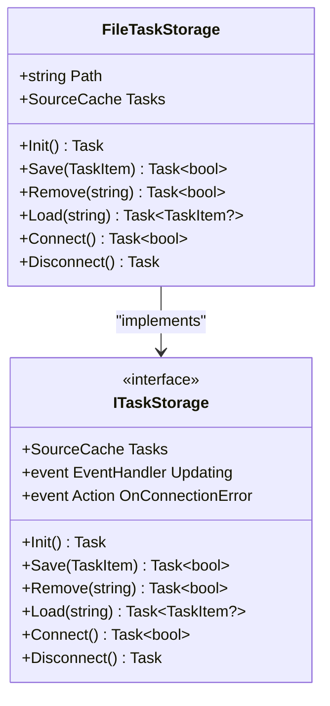
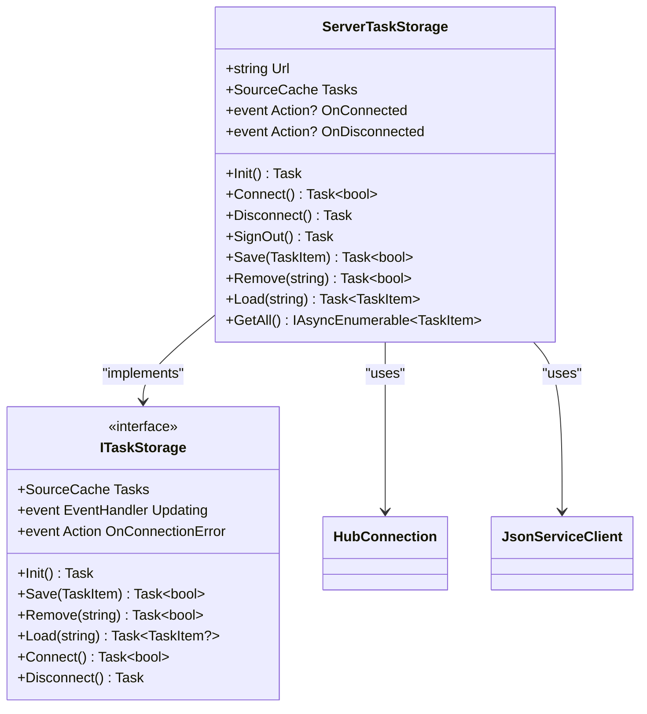
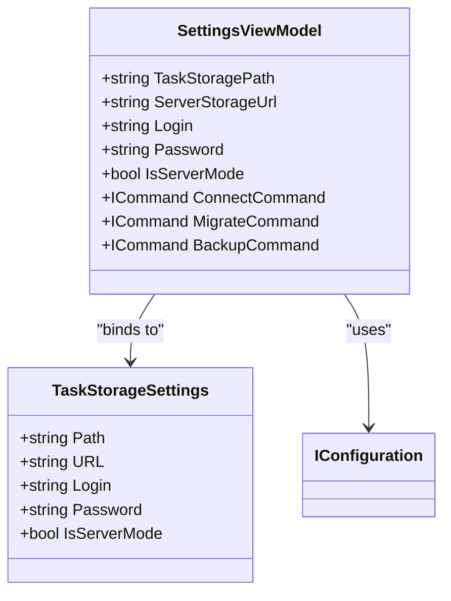
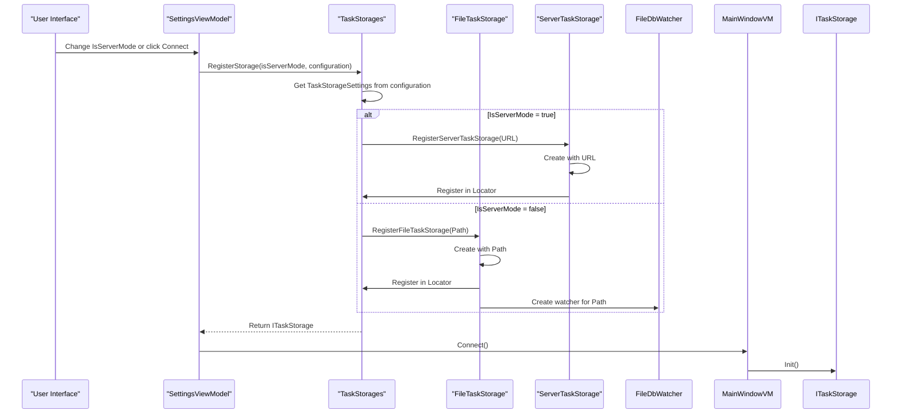
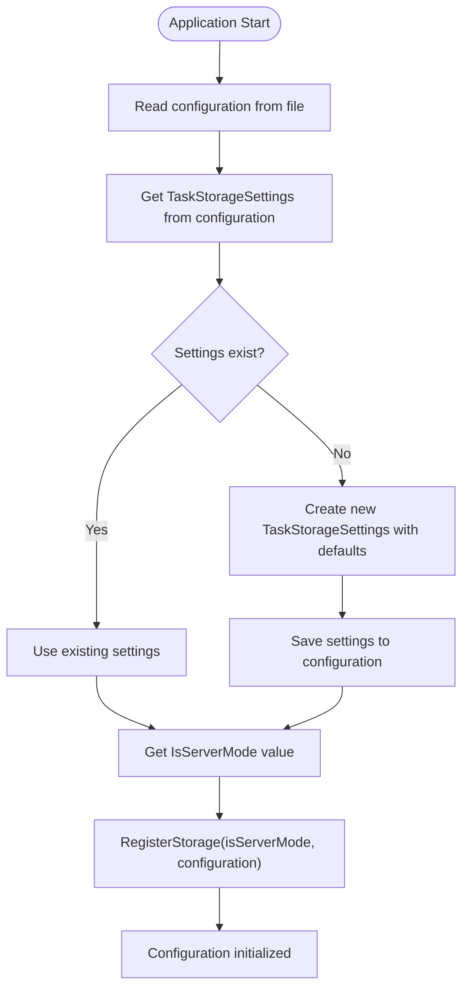

# Task Storage Configuration

<cite>
**Referenced Files in This Document**   
- [TaskStorageSettings.cs](file://src/Unlimotion.ViewModel/TaskStorageSettings.cs)
- [FileTaskStorage.cs](file://src/Unlimotion/FileTaskStorage.cs)
- [ServerTaskStorage.cs](file://src/Unlimotion/ServerTaskStorage.cs)
- [SettingsViewModel.cs](file://src/Unlimotion.ViewModel/SettingsViewModel.cs)
- [TaskStorages.cs](file://src/Unlimotion/TaskStorages.cs)
- [App.axaml.cs](file://src/Unlimotion/App.axaml.cs)
</cite>

## Table of Contents
1. [Introduction](#introduction)
2. [TaskStorageSettings Model](#taskstoragesettings-model)
3. [Storage Implementation](#storage-implementation)
4. [Configuration Management](#configuration-management)
5. [Storage Mode Selection](#storage-mode-selection)
6. [Security Considerations](#security-considerations)
7. [Troubleshooting Guide](#troubleshooting-guide)
8. [Configuration Lifecycle](#configuration-lifecycle)

## Introduction
The TaskStorageSettings model in Unlimotion provides a flexible configuration system for task persistence, allowing users to choose between local file storage and remote server storage. This documentation details the properties of the TaskStorageSettings model, how they are used by different storage implementations, and the mechanisms for configuring and managing task data persistence. The system supports both JSON-based local storage and server-based storage with authentication, providing flexibility for different deployment scenarios and user requirements.

## TaskStorageSettings Model
The TaskStorageSettings class defines the configuration parameters for task persistence in Unlimotion. It contains properties that control both local and remote storage options, allowing the application to switch between different storage backends based on user preferences and requirements.

### Configuration Properties
The TaskStorageSettings model includes the following key properties that control task storage behavior:

- **Path**: Specifies the local filesystem directory where task data is stored in JSON format when using file-based storage
- **URL**: Defines the server endpoint for remote storage when connecting to a Unlimotion server instance
- **Login**: Provides the username credential for authenticating with the remote server
- **Password**: Stores the password credential for server authentication (stored in plain text with a TODO for encryption)
- **IsServerMode**: Boolean flag that determines whether to use server-based storage (true) or local file storage (false)

**Section sources**
- [TaskStorageSettings.cs](file://src/Unlimotion.ViewModel/TaskStorageSettings.cs#L3-L17)

## Storage Implementation
Unlimotion implements two primary storage mechanisms that utilize the TaskStorageSettings configuration: FileTaskStorage for local persistence and ServerTaskStorage for remote server connectivity.

### File-Based Storage
The FileTaskStorage implementation manages task persistence using the local filesystem with JSON serialization. When IsServerMode is false, this storage backend is activated and uses the Path property to determine where task files are stored. Each task is saved as a separate JSON file in the specified directory, with automatic file management including creation, updating, and deletion operations.

**Diagram sources**
- [FileTaskStorage.cs](file://src/Unlimotion/FileTaskStorage.cs#L21-L457)

### Server-Based Storage
The ServerTaskStorage implementation handles connectivity to a remote Unlimotion server instance. When IsServerMode is true, this storage backend uses the URL, Login, and Password properties to establish a connection and authenticate with the server. It leverages SignalR for real-time communication and ServiceStack for API requests, enabling synchronized task management across devices.

**Diagram sources**
- [ServerTaskStorage.cs](file://src/Unlimotion/ServerTaskStorage.cs#L21-L721)

## Configuration Management
The SettingsViewModel class provides a user interface binding layer for the TaskStorageSettings configuration, enabling users to modify storage settings through the application's settings interface.

### Settings Binding
The SettingsViewModel exposes properties that directly map to the TaskStorageSettings configuration, allowing for two-way data binding in the user interface. Each property getter retrieves the current value from the configuration system, while setters update the configuration and persist changes.

**Diagram sources**
- [SettingsViewModel.cs](file://src/Unlimotion.ViewModel/SettingsViewModel.cs#L0-L152)

## Storage Mode Selection
The storage backend selection process is managed by the TaskStorages utility class, which orchestrates the initialization and registration of the appropriate storage implementation based on the IsServerMode setting.

### Mode Switching Workflow
When the user changes the storage mode or connects to a storage backend, the following sequence occurs:

**Diagram sources**
- [TaskStorages.cs](file://src/Unlimotion/TaskStorages.cs#L129-L196)

## Security Considerations
The current implementation stores authentication credentials in plain text, which presents security risks that are acknowledged in the codebase.

### Credential Storage
The Password property in TaskStorageSettings is stored in plain text within the configuration file, as indicated by the TODO comment in both TaskStorageSettings.cs and SettingsViewModel.cs: "TODO стоит подумать над шифрованным хранением" (TODO consider encrypted storage). This means that user passwords are not protected at rest and could be exposed if the configuration file is accessed by unauthorized parties.

The same security consideration applies to Git credentials stored in the GitSettings class, where both UserName and Password are stored without encryption. This creates potential security vulnerabilities, especially on shared or compromised systems.

**Section sources**
- [TaskStorageSettings.cs](file://src/Unlimotion.ViewModel/TaskStorageSettings.cs#L15)
- [SettingsViewModel.cs](file://src/Unlimotion.ViewModel/SettingsViewModel.cs#L40)

## Troubleshooting Guide
Common issues with task storage configuration can be addressed by verifying the correctness of settings and understanding the error conditions for each storage mode.

### Common Issues and Solutions
- **Invalid Path (File Storage)**: Ensure the Path directory exists and is writable. Create the directory manually if it doesn't exist, and verify that the application has appropriate file system permissions.
- **Authentication Failures (Server Storage)**: Verify that the URL, Login, and Password are correct. Check network connectivity to the server and ensure the server is running and accessible.
- **Storage Mode Conflicts**: When switching between storage modes, ensure that the appropriate settings are configured. For server mode, both URL and credentials must be valid; for file mode, the Path must be accessible.
- **Connection Timeouts**: For server storage, verify that the server URL is correct and that any firewalls or network security settings allow the connection on the required ports.

**Section sources**
- [ServerTaskStorage.cs](file://src/Unlimotion/ServerTaskStorage.cs#L206-L236)
- [FileTaskStorage.cs](file://src/Unlimotion/FileTaskStorage.cs#L210-L248)

## Configuration Lifecycle
The TaskStorageSettings configuration is initialized at application startup and persists across sessions, ensuring that user preferences are maintained between application restarts.

### Initialization Process
During application startup in App.axaml.cs, the configuration system reads the TaskStorage settings from the configuration file. If no settings exist, a new TaskStorageSettings object is created with default values and saved to the configuration. The IsServerMode flag is then used to register the appropriate storage implementation via TaskStorages.RegisterStorage.

**Diagram sources**
- [App.axaml.cs](file://src/Unlimotion/App.axaml.cs#L139-L169)