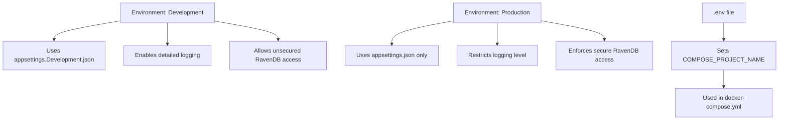
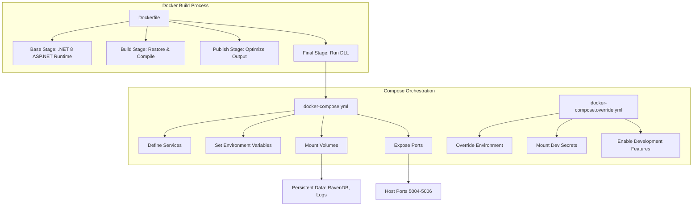

# Configuration

<cite>
**Referenced Files in This Document**  
- [ClientSettings.cs](file://src/Unlimotion/ClientSettings.cs)
- [AppSettings.cs](file://src/Unlimotion.Server/AppSettings.cs)
- [appsettings.json](file://src/Unlimotion.Server/appsettings.json)
- [appsettings.Development.json](file://src/Unlimotion.Server/appsettings.Development.json)
- [.env](file://src/.env)
- [Dockerfile](file://src/Unlimotion.Server/Dockerfile)
- [docker-compose.yml](file://src/docker-compose.yml)
- [docker-compose.override.yml](file://src/docker-compose.override.yml)
- [Startup.cs](file://src/Unlimotion.Server/Startup.cs)
- [Program.cs](file://src/Unlimotion.Server/Program.cs)
- [appsettings.json](file://src/Unlimotion.TelegramBot/appsettings.json)
</cite>

## Table of Contents
1. [Client Configuration](#client-configuration)
2. [Server Configuration](#server-configuration)
3. [Environment Management](#environment-management)
4. [Security Settings](#security-settings)
5. [Docker and Container Configuration](#docker-and-container-configuration)
6. [Best Practices](#best-practices)

## Client Configuration

The client-side configuration of Unlimotion is managed through the `ClientSettings` class, which stores user-specific session and authentication data. This class is defined in `ClientSettings.cs` and includes properties such as access and refresh tokens, expiration time, user ID, and login credentials. These settings are used to maintain user sessions and enable seamless interaction with the server without repeated authentication.

The `ClientSettings` class does not expose UI preferences directly but serves as a foundation for storing authentication state, which indirectly influences UI behavior such as login status indicators and access to protected views.

**Section sources**
- [ClientSettings.cs](file://src/Unlimotion/ClientSettings.cs#L1-L16)

## Server Configuration

Server configuration in Unlimotion is primarily handled through the `AppSettings.cs` class and JSON configuration files. The `AppSettings` class extends `AppSettingsBase` from ServiceStack and wraps ASP.NET Core's `IConfiguration` to provide a unified interface for accessing configuration values. It enables retrieval of settings via key-value pairs and supports hierarchical configuration through sections.

The primary configuration file, `appsettings.json`, defines several critical components:

- **Serilog**: Configures logging with console and file sinks, specifying log levels and output paths.
- **RavenDb**: Specifies database connection details including server URL, data directory, and database name.
- **Security**: Contains RSA private key material used for cryptographic operations such as JWT token signing.
- **ServiceStackSettings**: Holds the license key for ServiceStack components.
- **FilesPath**: Defines the directory where uploaded files are stored.

Additionally, `appsettings.Development.json` overrides logging levels in development environments to provide more verbose output.

**Section sources**
- [AppSettings.cs](file://src/Unlimotion.Server/AppSettings.cs#L1-L49)
- [appsettings.json](file://src/Unlimotion.Server/appsettings.json#L1-L45)
- [appsettings.Development.json](file://src/Unlimotion.Server/appsettings.Development.json#L1-L10)

## Environment Management

Unlimotion supports environment-specific configuration through ASP.NET Core's built-in environment system. The application distinguishes between development and production environments using the `ASPNETCORE_ENVIRONMENT` variable, which is set in `docker-compose.override.yml` for local development.

Environment variables are also used to control runtime behavior:
- `ASPNETCORE_URLS`: Specifies the URLs the server listens on (HTTP and HTTPS ports).
- `RAVEN_Security_UnsecuredAccessAllowed`: Allows unsecured access to RavenDB in public networks during development.

The `.env` file is used by Docker Compose to define the project name (`COMPOSE_PROJECT_NAME=unlimotion`), ensuring consistent container naming across environments.

This layered configuration approach allows developers to maintain different settings for development, testing, and production without modifying code.

**Diagram sources**
- [appsettings.json](file://src/Unlimotion.Server/appsettings.json#L1-L45)
- [appsettings.Development.json](file://src/Unlimotion.Server/appsettings.Development.json#L1-L10)
- [.env](file://src/.env#L1-L1)
- [docker-compose.yml](file://src/docker-compose.yml#L1-L19)
- [docker-compose.override.yml](file://src/docker-compose.override.yml#L1-L16)

**Section sources**
- [appsettings.json](file://src/Unlimotion.Server/appsettings.json#L1-L45)
- [appsettings.Development.json](file://src/Unlimotion.Server/appsettings.Development.json#L1-L10)
- [.env](file://src/.env#L1-L1)

## Security Settings

Security in Unlimotion is configured through multiple layers:

1. **JWT Authentication**: The private RSA key embedded in `appsettings.json` under `Security.PrivateKeyXml` is used to sign JWT tokens issued by the server. This ensures that only the server can generate valid tokens, while clients use them for authenticated requests.

2. **ServiceStack License**: The `ServiceStackSettings.LicenseKey` field contains a trial license key required for ServiceStack functionality. This key should be rotated in production to avoid expiration.

3. **RavenDB Security**: In development, `RAVEN_Security_UnsecuredAccessAllowed=PublicNetwork` disables authentication for convenience. This setting must be removed in production to enforce secure database access.

4. **HTTPS Configuration**: The server is configured to listen on HTTPS port 5005, with certificates loaded from user secrets in development via Docker volume mounts.

Sensitive data such as private keys and license keys should be externalized in production using environment variables or secret management systems.

**Section sources**
- [appsettings.json](file://src/Unlimotion.Server/appsettings.json#L7-L12)
- [docker-compose.override.yml](file://src/docker-compose.override.yml#L7-L16)

## Docker and Container Configuration

Unlimotion uses Docker for containerized deployment, orchestrated via `docker-compose.yml` and `docker-compose.override.yml`.

The main `docker-compose.yml` file defines:
- Image name: `unlimotionserver`
- Build context and Dockerfile reference
- Volume mounts for persistent data (RavenDB, Logs)
- Environment variables for ASP.NET Core URLs and RavenDB security
- Port mappings for HTTP (5004), HTTPS (5005), and SignalR (5006)
- Restart policy: `unless-stopped`

The override file adds development-specific configurations:
- Sets environment to `Development`
- Mounts user secrets and HTTPS certificates from the host
- Duplicates volume mounts to ensure consistency

The `Dockerfile` follows multi-stage build practices:
- Base stage uses `mcr.microsoft.com/dotnet/aspnet:8.0`
- Build stage restores dependencies and compiles the project
- Publish stage generates optimized output
- Final stage runs the published binary

This setup enables fast builds, consistent environments, and easy deployment across platforms.

**Diagram sources**
- [Dockerfile](file://src/Unlimotion.Server/Dockerfile#L1-L28)
- [docker-compose.yml](file://src/docker-compose.yml#L1-L19)
- [docker-compose.override.yml](file://src/docker-compose.override.yml#L1-L16)

**Section sources**
- [Dockerfile](file://src/Unlimotion.Server/Dockerfile#L1-L28)
- [docker-compose.yml](file://src/docker-compose.yml#L1-L19)
- [docker-compose.override.yml](file://src/docker-compose.override.yml#L1-L16)

## Best Practices

To ensure secure and maintainable configuration in Unlimotion:

1. **Externalize Sensitive Data**: Never commit private keys, passwords, or API tokens to version control. Use environment variables or secret managers (e.g., Azure Key Vault, AWS Secrets Manager) in production.

2. **Environment-Specific Configuration**: Use separate configuration files (`appsettings.Production.json`) and avoid hardcoding values. Leverage Docker environment overrides for staging and production.

3. **Secure RavenDB in Production**: Remove `RAVEN_Security_UnsecuredAccessAllowed` in production and configure proper authentication and TLS.

4. **Rotate ServiceStack License**: Replace the trial license key with a valid production key and automate renewal processes.

5. **Log Management**: In production, redirect logs to centralized systems (e.g., ELK, Splunk) rather than local files.

6. **HTTPS Enforcement**: Ensure SSL termination is properly configured and HSTS is enabled in production.

7. **Configuration Validation**: Implement startup checks to validate critical settings (e.g., database connection strings, security keys) before launching the application.

8. **Use .env for Local Development Only**: The `.env` file should not contain secrets in shared repositories; use `.env.local` in `.gitignore` for personal settings.

Following these practices ensures robust, secure, and scalable deployment of Unlimotion across different environments.

**Section sources**
- [appsettings.json](file://src/Unlimotion.Server/appsettings.json#L1-L45)
- [.env](file://src/.env#L1-L1)
- [docker-compose.yml](file://src/docker-compose.yml#L1-L19)
- [docker-compose.override.yml](file://src/docker-compose.override.yml#L1-L16)