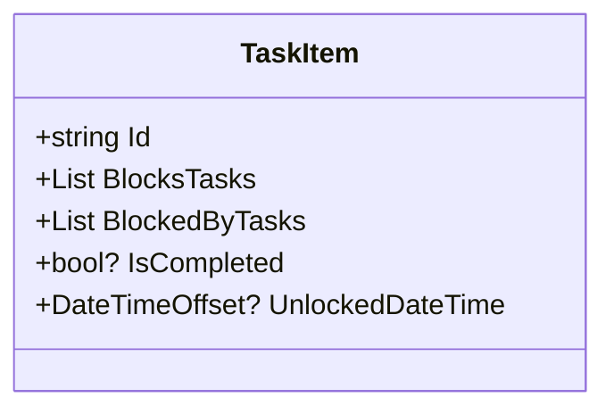
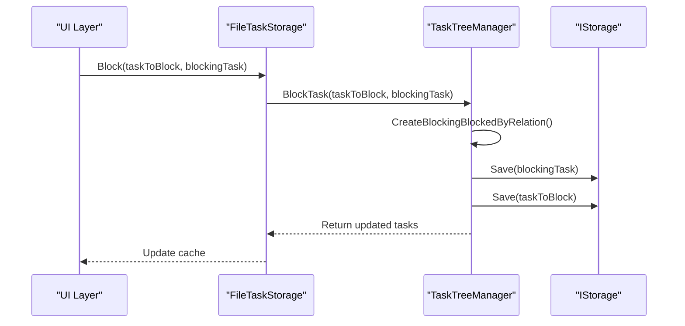
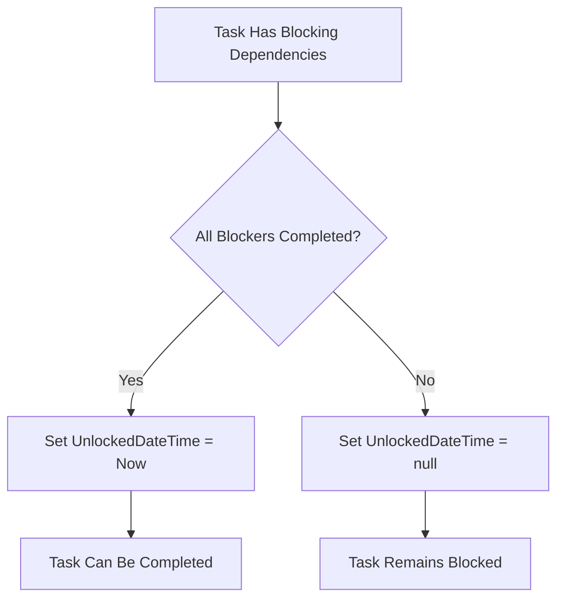
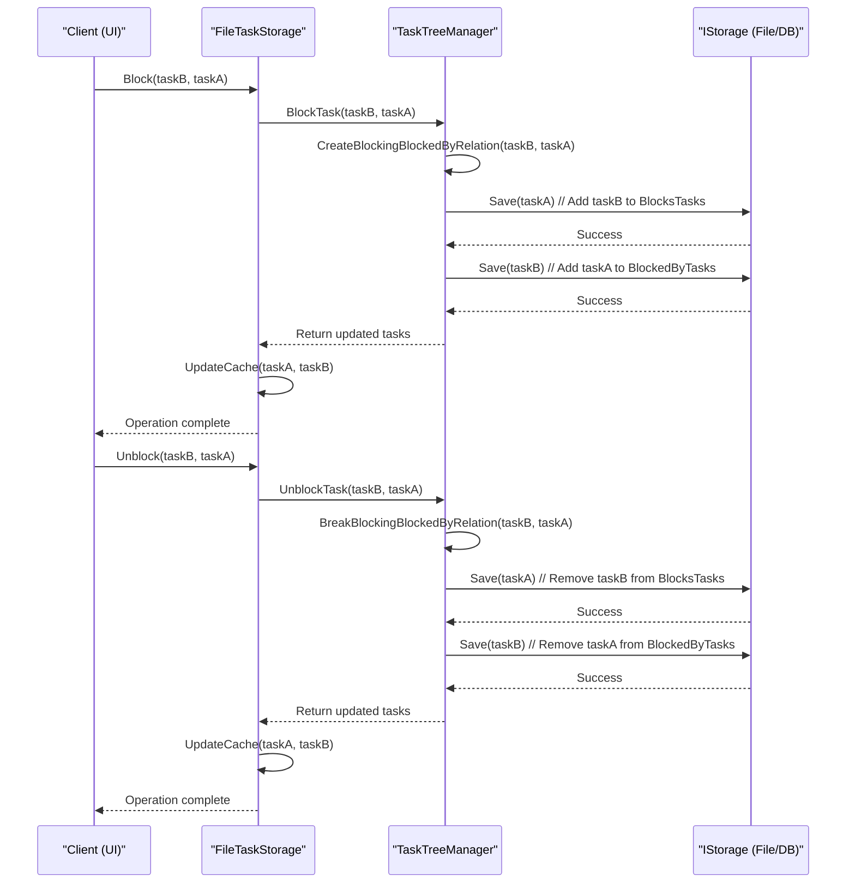

# Blocking Logic

<cite>
**Referenced Files in This Document**   
- [TaskItem.cs](file://src/Unlimotion.Domain/TaskItem.cs)
- [FileTaskStorage.cs](file://src/Unlimotion/FileTaskStorage.cs)
- [TaskTreeManager.cs](file://src/Unlimotion.TaskTreeManager/TaskTreeManager.cs)
- [ITaskTreeManager.cs](file://src/Unlimotion.TaskTreeManager/ITaskTreeManager.cs)
- [TaskItemViewModel.cs](file://src/Unlimotion.ViewModel/TaskItemViewModel.cs)
</cite>

## Table of Contents
1. [Introduction](#introduction)
2. [Core Data Structures](#core-data-structures)
3. [Blocking Relationship Management](#blocking-relationship-management)
4. [Task Completion Eligibility](#task-completion-eligibility)
5. [Blocking State Inconsistencies and Troubleshooting](#blocking-state-inconsistencies-and-troubleshooting)
6. [Sequence Diagram: Blocking/Unblocking Flow](#sequence-diagram-blockingunblocking-flow)

## Introduction
This document details the implementation of task blocking and unblocking logic in the Unlimotion application. The system enables users to define dependencies between tasks, where one task can block the completion of another until the blocking task is completed. This functionality is implemented through bidirectional collections in the `TaskItem` entity and coordinated operations across `FileTaskStorage` and `TaskTreeManager`. The logic ensures data consistency, handles edge cases such as circular dependencies, and integrates with the UI layer to reflect blocking states in real time.

## Core Data Structures

The blocking logic is built around two key collections in the `TaskItem` class:

- **BlocksTasks**: A list of task IDs that this task blocks.
- **BlockedByTasks**: A list of task IDs that block this task.

These collections maintain a bidirectional relationship, ensuring referential integrity. When Task A blocks Task B, Task A's `BlocksTasks` contains B's ID, and Task B's `BlockedByTasks` contains A's ID.



**Diagram sources**
- [TaskItem.cs](file://src/Unlimotion.Domain/TaskItem.cs#L15-L25)

**Section sources**
- [TaskItem.cs](file://src/Unlimotion.Domain/TaskItem.cs#L1-L32)

## Blocking Relationship Management

Blocking and unblocking operations are coordinated between `FileTaskStorage` and `TaskTreeManager`. The `FileTaskStorage` serves as the interface layer, while `TaskTreeManager` handles the business logic and persistence.

### Block Method in FileTaskStorage
The `Block` method in `FileTaskStorage` initiates the blocking process by calling `BlockTask` on the `TaskTreeManager`. It updates the local cache with the resulting task list to reflect changes immediately in the UI.



**Diagram sources**
- [FileTaskStorage.cs](file://src/Unlimotion/FileTaskStorage.cs#L410-L417)
- [TaskTreeManager.cs](file://src/Unlimotion.TaskTreeManager/TaskTreeManager.cs#L280-L287)

**Section sources**
- [FileTaskStorage.cs](file://src/Unlimotion/FileTaskStorage.cs#L410-L417)
- [TaskTreeManager.cs](file://src/Unlimotion.TaskTreeManager/TaskTreeManager.cs#L280-L287)

### CreateBlockingBlockedByRelation Implementation
The `CreateBlockingBlockedByRelation` method in `TaskTreeManager` performs the core logic:

1. Adds the blocked task's ID to the blocking task's `BlocksTasks` list.
2. Adds the blocking task's ID to the blocked task's `BlockedByTasks` list.
3. Updates the `SortOrder` timestamp for both tasks.
4. Persists both tasks via the `IStorage` interface.
5. Returns a dictionary of updated tasks for cache synchronization.

The operation is wrapped in a retry policy (`IsCompletedAsync`) to handle transient failures during persistence.

**Section sources**
- [TaskTreeManager.cs](file://src/Unlimotion.TaskTreeManager/TaskTreeManager.cs#L371-L404)

### Unblock Method in FileTaskStorage
The `Unblock` method reverses the blocking relationship by calling `UnblockTask` on `TaskTreeManager`, which invokes `BreakBlockingBlockedByRelation` to remove the references from both tasks' collections.

**Section sources**
- [FileTaskStorage.cs](file://src/Unlimotion/FileTaskStorage.cs#L402-L409)
- [TaskTreeManager.cs](file://src/Unlimotion.TaskTreeManager/TaskTreeManager.cs#L271-L278)

### BreakBlockingBlockedByRelation Implementation
The `BreakBlockingBlockedByRelation` method:
1. Removes the blocked task's ID from the blocking task's `BlocksTasks` list.
2. Removes the blocking task's ID from the blocked task's `BlockedByTasks` list.
3. Saves both tasks to storage.
4. Returns the updated task list for cache updates.

**Section sources**
- [TaskTreeManager.cs](file://src/Unlimotion.TaskTreeManager/TaskTreeManager.cs#L406-L437)

## Task Completion Eligibility

A task can only be marked as completed if it has no uncompleted blocking dependencies. This logic is implemented in the `TaskItemViewModel` class.

### IsCanBeCompleted Logic
The `IsCanBeCompleted` property is derived from two conditions:
- All contained subtasks are completed (`NotHaveUncompletedContains`).
- All blocking tasks are completed (`NotHaveUncompletedBlockedBy`).

```csharp
private bool GetCanBeCompleted() => 
    (ContainsTasks.All(m => m.IsCompleted != false)) &&
    (BlockedByTasks.All(m => m.IsCompleted != false));
```

This property is reactive, automatically updating when the completion status of any blocking task changes.

### UnlockedDateTime Behavior
When a task becomes completable (i.e., all blocking tasks are completed), the `UnlockedDateTime` is set to the current timestamp. Conversely, if a new blocking dependency is added, `UnlockedDateTime` is cleared.



**Diagram sources**
- [TaskItemViewModel.cs](file://src/Unlimotion.ViewModel/TaskItemViewModel.cs#L200-L230)

**Section sources**
- [TaskItemViewModel.cs](file://src/Unlimotion.ViewModel/TaskItemViewModel.cs#L200-L230)

## Blocking State Inconsistencies and Troubleshooting

### Circular Blocking Dependencies
The current implementation does not explicitly prevent circular blocking (Task A blocks Task B, and Task B blocks Task A). This can result in both tasks being permanently blocked. To resolve:
1. Use the UI to manually unblock one of the tasks.
2. Verify the `BlocksTasks` and `BlockedByTasks` collections do not contain reciprocal references.

### Orphaned Blocking References
If a blocking task is deleted, the blocked task may retain a reference in its `BlockedByTasks` list. This is handled during task deletion:
- `DeleteTask` in `TaskTreeManager` automatically removes blocking relationships.
- Both `BlocksTasks` and `BlockedByTasks` references are cleaned up before the task is removed.

### Troubleshooting Steps
1. **Check Task References**: Verify that `BlocksTasks` and `BlockedByTasks` are synchronized.
2. **Validate Task Existence**: Ensure all referenced task IDs exist in storage.
3. **Review Completion Status**: Confirm that blocking tasks are marked as completed.
4. **Inspect Logs**: Look for storage errors during `Save` operations that could leave relationships in an inconsistent state.

**Section sources**
- [TaskTreeManager.cs](file://src/Unlimotion.TaskTreeManager/TaskTreeManager.cs#L100-L150)
- [TaskItemViewModel.cs](file://src/Unlimotion.ViewModel/TaskItemViewModel.cs#L200-L230)

## Sequence Diagram: Blocking/Unblocking Flow



**Diagram sources**
- [FileTaskStorage.cs](file://src/Unlimotion/FileTaskStorage.cs#L402-L417)
- [TaskTreeManager.cs](file://src/Unlimotion.TaskTreeManager/TaskTreeManager.cs#L271-L287)
- [TaskTreeManager.cs](file://src/Unlimotion.TaskTreeManager/TaskTreeManager.cs#L371-L437)