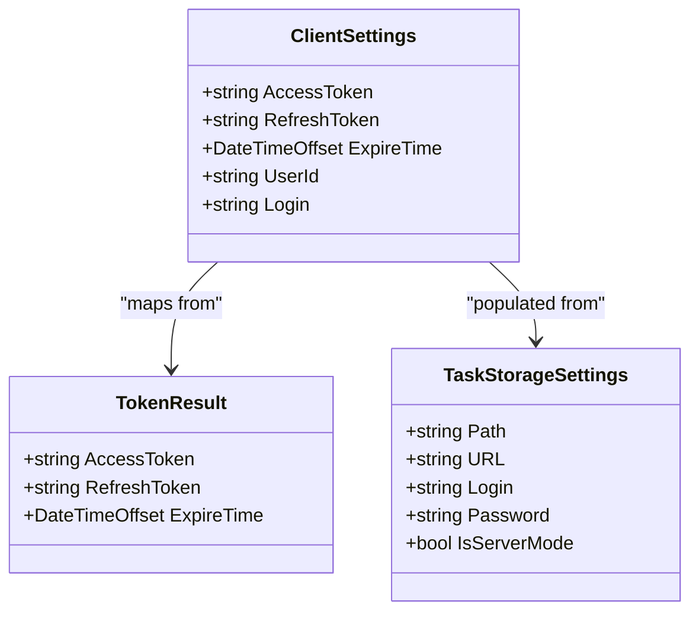
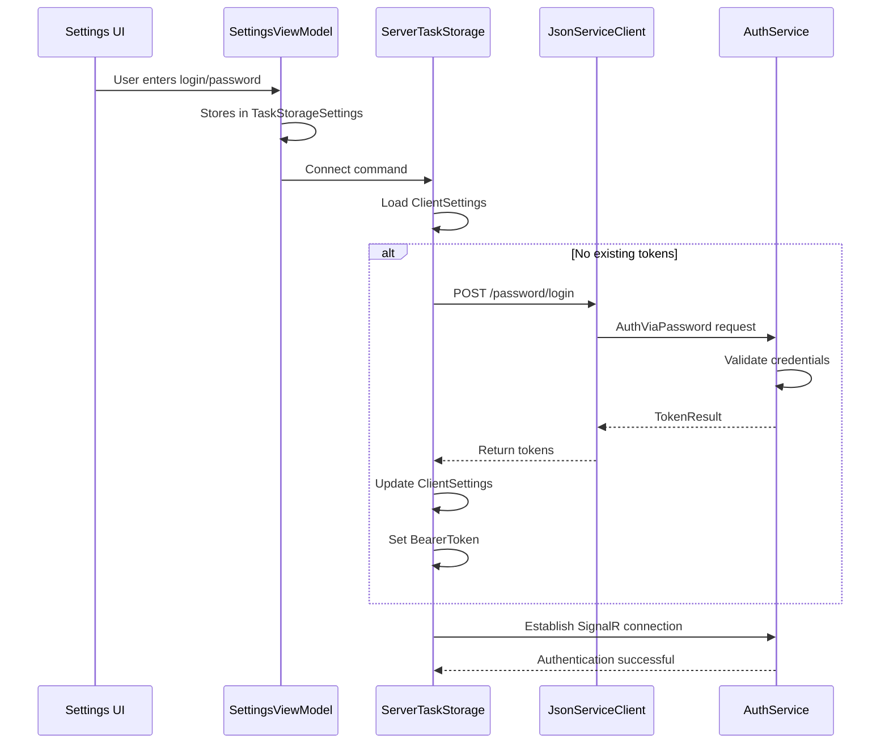
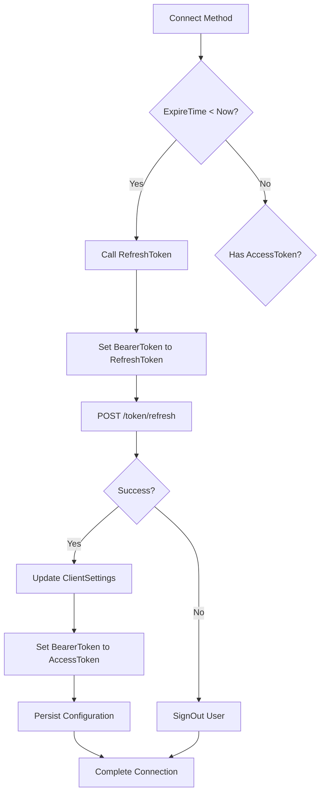
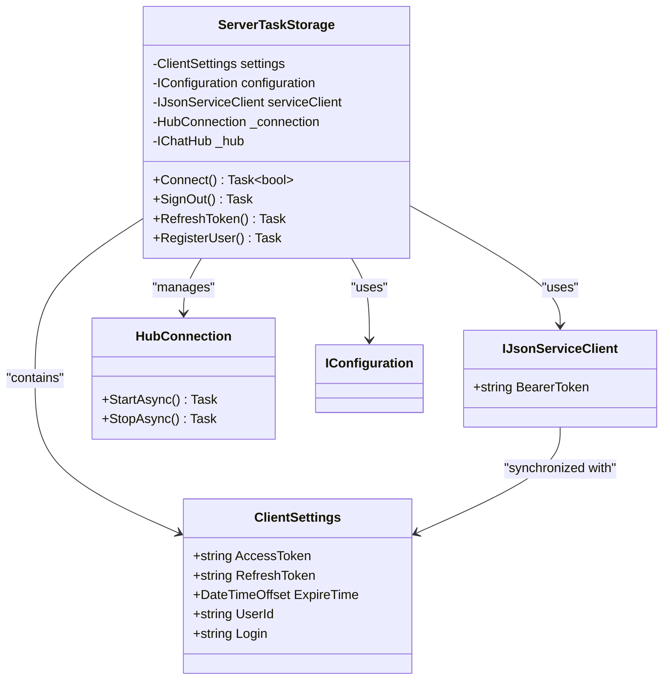
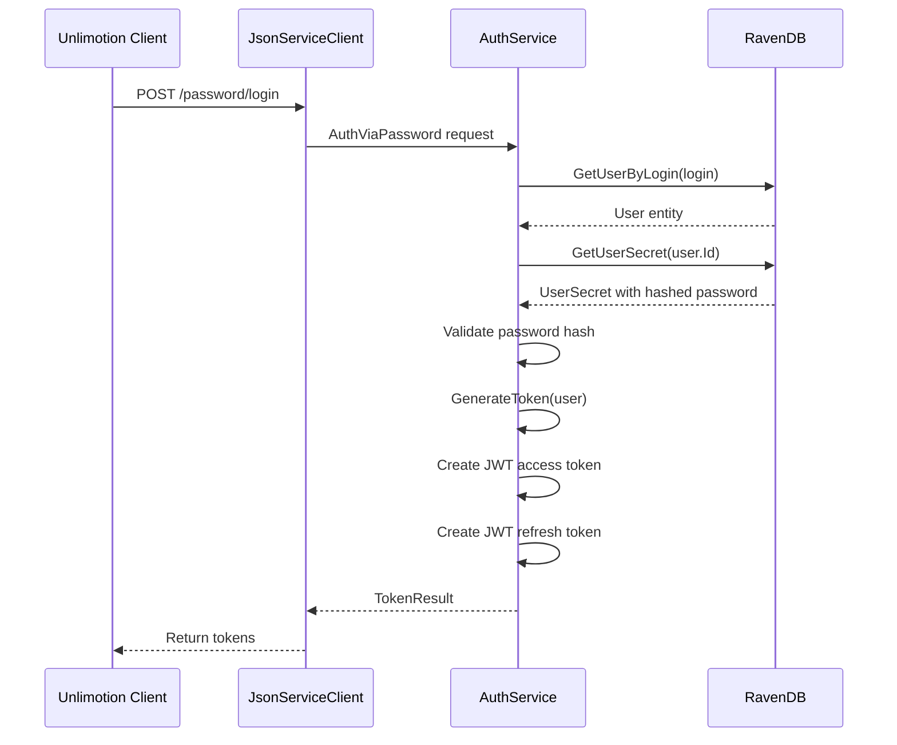
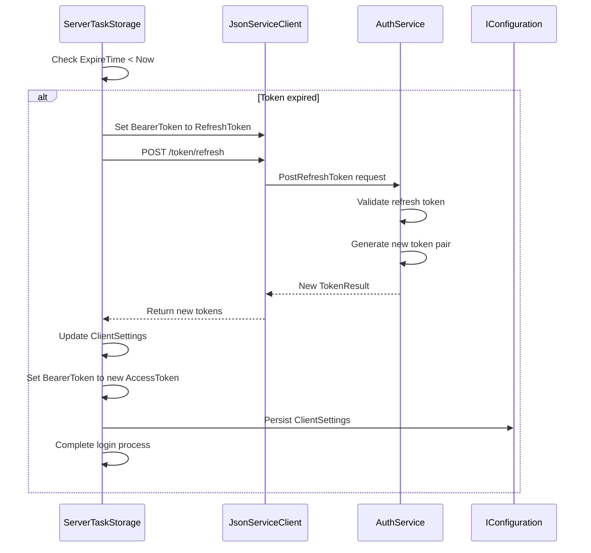
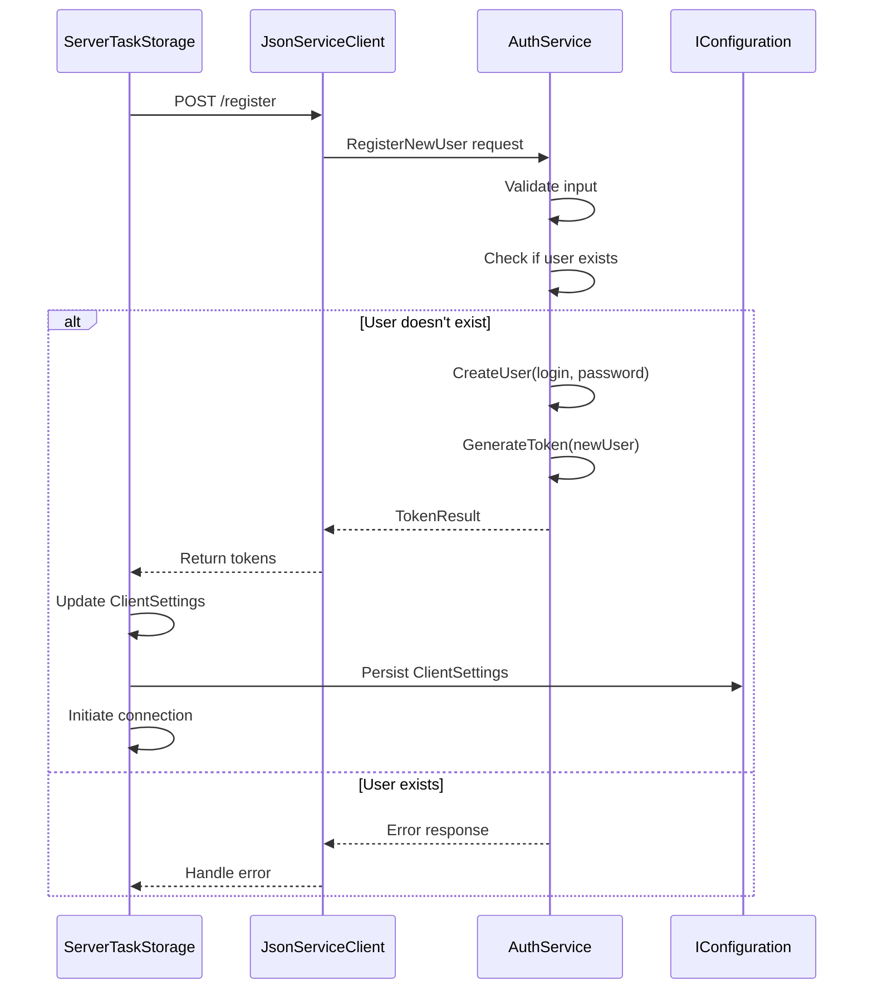

# Authentication and Token Management

<cite>
**Referenced Files in This Document**   
- [ClientSettings.cs](file://src/Unlimotion/ClientSettings.cs)
- [ServerTaskStorage.cs](file://src/Unlimotion/ServerTaskStorage.cs)
- [TaskStorageSettings.cs](file://src/Unlimotion.ViewModel/TaskStorageSettings.cs)
- [SettingsViewModel.cs](file://src/Unlimotion.ViewModel/SettingsViewModel.cs)
- [AuthViaPassword.cs](file://src/Unlimotion.Server.ServiceModel/Auth.cs)
- [PostRefreshToken.cs](file://src/Unlimotion.Server.ServiceModel/Auth.cs)
- [AuthService.cs](file://src/Unlimotion.Server.ServiceInterface/AuthService.cs)
- [ChatHub.cs](file://src/Unlimotion.Server/hubs/ChatHub.cs)
- [TokenResult.cs](file://src/Unlimotion.Server.ServiceModel/Molds/TokenResult.cs)
</cite>

## Table of Contents
1. [Introduction](#introduction)
2. [ClientSettings Class Structure](#clientsettings-class-structure)
3. [Authentication Flow](#authentication-flow)
4. [Token Refresh Mechanism](#token-refresh-mechanism)
5. [Session Persistence and User Context](#session-persistence-and-user-context)
6. [Integration with ServerTaskStorage](#integration-with-servertaskstorage)
7. [Settings UI and User Input Management](#settings-ui-and-user-input-management)
8. [Security Considerations](#security-considerations)
9. [Server-Side Authentication with ServiceStack](#server-side-authentication-with-servicestack)
10. [Sequence Diagrams](#sequence-diagrams)

## Introduction
The Unlimotion application implements a comprehensive authentication and token management system that enables secure access to server-based task storage. This system revolves around the ClientSettings class which maintains critical authentication state across application sessions. The authentication mechanism uses JWT (JSON Web Tokens) with a dual-token approach consisting of access and refresh tokens, providing both security and uninterrupted user experience. The system integrates with ServiceStack for server-side authentication and RavenDB for user data storage, creating a robust authentication framework that handles login, token refresh, session persistence, and secure API access.

**Section sources**
- [ClientSettings.cs](file://src/Unlimotion/ClientSettings.cs#L1-L15)
- [ServerTaskStorage.cs](file://src/Unlimotion/ServerTaskStorage.cs#L1-L41)

## ClientSettings Class Structure
The ClientSettings class serves as the central repository for authentication state in the Unlimotion client application. It contains five key properties that maintain the user's authentication context:

- **AccessToken**: Stores the JWT token used for authenticating API requests to the server
- **RefreshToken**: Contains the long-lived token used to obtain new access tokens when they expire
- **ExpireTime**: Tracks when the current access token will expire, enabling proactive refresh
- **UserId**: Maintains the user's unique identifier across sessions for consistent user context
- **Login**: Stores the user's login credential for reference and display purposes

This class is serialized and persisted through the application's configuration system, ensuring that authentication state survives application restarts. The settings are retrieved from and saved to the IConfiguration service, which manages the application's configuration state.

**Diagram sources**
- [ClientSettings.cs](file://src/Unlimotion/ClientSettings.cs#L1-L15)
- [TokenResult.cs](file://src/Unlimotion.Server.ServiceModel/Molds/TokenResult.cs#L1-L16)
- [TaskStorageSettings.cs](file://src/Unlimotion.ViewModel/TaskStorageSettings.cs#L1-L34)

**Section sources**
- [ClientSettings.cs](file://src/Unlimotion/ClientSettings.cs#L1-L15)

## Authentication Flow
The authentication flow in Unlimotion begins when a user configures their server settings through the Settings UI. When server mode is enabled, the application initiates a connection to the server using credentials stored in TaskStorageSettings. The authentication process follows these steps:

1. The ServerTaskStorage retrieves ClientSettings from the configuration system
2. If no existing tokens are found, it uses the login and password from TaskStorageSettings to authenticate via the AuthViaPassword endpoint
3. Upon successful authentication, the server returns a TokenResult containing both access and refresh tokens
4. These tokens are stored in ClientSettings and used for subsequent API requests
5. The UserId is extracted from the authentication response and stored for maintaining user context

The system also supports automatic user registration when credentials are provided but no account exists, creating a seamless onboarding experience. This flow ensures that users can quickly establish a secure connection to the server without complex setup procedures.

**Diagram sources**
- [ServerTaskStorage.cs](file://src/Unlimotion/ServerTaskStorage.cs#L206-L236)
- [AuthViaPassword.cs](file://src/Unlimotion.Server.ServiceModel/Auth.cs#L1-L20)
- [AuthService.cs](file://src/Unlimotion.Server.ServiceInterface/AuthService.cs#L34-L61)

**Section sources**
- [ServerTaskStorage.cs](file://src/Unlimotion/ServerTaskStorage.cs#L206-L236)
- [AuthViaPassword.cs](file://src/Unlimotion.Server.ServiceModel/Auth.cs#L1-L20)

## Token Refresh Mechanism
Unlimotion implements an automated token refresh mechanism to maintain uninterrupted service access. The system proactively manages token expiration by checking the ExpireTime property against the current time. When a token is nearing expiration, the refresh process is automatically triggered:

1. The Connect method in ServerTaskStorage checks if the ExpireTime is in the past
2. If expired, it calls the RefreshToken method with the current ClientSettings
3. The RefreshToken method sets the BearerToken to the refresh token and calls the PostRefreshToken endpoint
4. The server validates the refresh token and returns a new pair of access and refresh tokens
5. The ClientSettings are updated with the new tokens and expiration time
6. The configuration is persisted to ensure the updated tokens survive application restarts

This mechanism operates transparently to the user, preventing authentication interruptions during extended usage sessions. The refresh process also handles error conditions by signing the user out if token refresh fails, ensuring security is maintained.

**Diagram sources**
- [ServerTaskStorage.cs](file://src/Unlimotion/ServerTaskStorage.cs#L206-L236)
- [ServerTaskStorage.cs](file://src/Unlimotion/ServerTaskStorage.cs#L389-L426)

**Section sources**
- [ServerTaskStorage.cs](file://src/Unlimotion/ServerTaskStorage.cs#L206-L236)
- [ServerTaskStorage.cs](file://src/Unlimotion/ServerTaskStorage.cs#L389-L426)

## Session Persistence and User Context
The Unlimotion authentication system maintains user context across application restarts through persistent storage of authentication tokens and user identifiers. The ClientSettings class is serialized to the application configuration, preserving the authentication state between sessions. When the application starts, it attempts to reconnect using existing tokens before falling back to credential-based authentication.

The UserId property plays a crucial role in maintaining user context, as it identifies the user to the server for data access and personalization. This identifier is extracted from the authentication response and stored alongside the tokens. The Login property provides additional context for user identification in the interface.

Session persistence also includes connection state management, where the system automatically attempts to reconnect to the server when connectivity is restored. This resilience ensures that temporary network interruptions do not require users to re-authenticate, enhancing the overall user experience while maintaining security.

**Section sources**
- [ClientSettings.cs](file://src/Unlimotion/ClientSettings.cs#L1-L15)
- [ServerTaskStorage.cs](file://src/Unlimotion/ServerTaskStorage.cs#L38-L86)

## Integration with ServerTaskStorage
The ServerTaskStorage class serves as the primary integration point between the authentication system and the application's data access layer. It manages the entire authentication lifecycle, from initial connection to token refresh and sign-out operations. Key integration points include:

- **Bearer Token Management**: The serviceClient's BearerToken property is synchronized with the AccessToken in ClientSettings, ensuring all HTTP requests are properly authenticated
- **SignalR Connection**: Authentication tokens are passed to the ChatHub during the login process, establishing authenticated real-time communication
- **Error Handling**: The system listens for authentication errors (including expired tokens) and triggers appropriate recovery actions
- **Configuration Management**: ClientSettings are retrieved from and persisted to the IConfiguration service, ensuring state consistency

The ServerTaskStorage also handles the complete sign-out process, which includes clearing authentication tokens, disconnecting from the SignalR hub, and notifying other components of the authentication state change through the OnSignOut event.

**Diagram sources**
- [ServerTaskStorage.cs](file://src/Unlimotion/ServerTaskStorage.cs#L1-L41)
- [ClientSettings.cs](file://src/Unlimotion/ClientSettings.cs#L1-L15)

**Section sources**
- [ServerTaskStorage.cs](file://src/Unlimotion/ServerTaskStorage.cs#L1-L41)

## Settings UI and User Input Management
The Settings UI in Unlimotion provides users with a straightforward interface for configuring their authentication credentials. The SettingsViewModel class acts as the bridge between the UI and the underlying configuration system, exposing properties that correspond to the TaskStorageSettings configuration object.

When users enter their login credentials in the Settings UI, these values are stored in the TaskStorageSettings object and persisted through the IConfiguration service. These credentials are then used during the authentication flow when connecting to the server. The UI also includes a server mode toggle that determines whether the application connects to a remote server or uses local file storage.

Notably, the password is stored in plaintext in the configuration, as indicated by the "TODO стоит подумать над шифрованным хранением" comment in the code, suggesting that encrypted storage is a planned future enhancement. The SettingsViewModel exposes the password through a property that directly maps to the configuration system, enabling two-way data binding with the UI.

**Section sources**
- [SettingsViewModel.cs](file://src/Unlimotion.ViewModel/SettingsViewModel.cs#L1-L152)
- [TaskStorageSettings.cs](file://src/Unlimotion.ViewModel/TaskStorageSettings.cs#L1-L34)

## Security Considerations
The Unlimotion authentication system implements several security measures while also having areas for potential improvement:

**Current Security Features:**
- JWT-based authentication with encrypted tokens
- Dual-token system separating access and refresh tokens
- Certificate validation bypass only for development purposes
- Automatic sign-out when token refresh fails
- Session tracking with user agent and IP address logging

**Security Concerns:**
- Passwords are stored in plaintext in the configuration file
- Access and refresh tokens are stored without encryption
- Certificate validation is disabled, potentially exposing man-in-the-middle attacks
- No token revocation mechanism on the server side

**Recommended Mitigation Strategies:**
1. Implement encrypted storage for passwords and tokens using platform-specific secure storage (Windows DPAPI, macOS Keychain)
2. Add token revocation endpoints to invalidate compromised tokens
3. Re-enable certificate validation in production environments
4. Implement refresh token rotation to detect token theft
5. Add configurable token expiration times to balance security and usability

The current implementation prioritizes usability but would benefit from enhanced security measures, particularly around credential storage.

**Section sources**
- [TaskStorageSettings.cs](file://src/Unlimotion.ViewModel/TaskStorageSettings.cs#L1-L34)
- [ServerTaskStorage.cs](file://src/Unlimotion/ServerTaskStorage.cs#L38-L86)
- [ServerTaskStorage.cs](file://src/Unlimotion/ServerTaskStorage.cs#L389-L426)

## Server-Side Authentication with ServiceStack
The server-side authentication in Unlimotion is implemented using ServiceStack's authentication framework. The AuthService class handles all authentication operations, including password-based login, token refresh, and user registration. Key components include:

- **JwtAuthProvider**: Manages JWT token creation and validation using encrypted JWE tokens
- **AuthViaPassword**: Service endpoint that authenticates users with login and password
- **PostRefreshToken**: Service endpoint that issues new tokens using refresh tokens
- **GenerateToken**: Internal method that creates token pairs with configurable expiration

The server generates tokens with embedded session information, including user agent and session ID, which are used to detect suspicious activity. Login attempts are recorded in the LoginAudit entity, providing an audit trail of user access. The system also supports custom token expiration periods, allowing clients to request specific token lifetimes within server-defined limits.

The authentication flow integrates with RavenDB for user data storage, loading user information and secrets for credential validation. This server-side implementation provides a robust foundation for secure client-server communication.

**Diagram sources**
- [AuthService.cs](file://src/Unlimotion.Server.ServiceInterface/AuthService.cs#L34-L61)
- [AuthViaPassword.cs](file://src/Unlimotion.Server.ServiceModel/Auth.cs#L1-L20)
- [ChatHub.cs](file://src/Unlimotion.Server/hubs/ChatHub.cs#L191-L220)

**Section sources**
- [AuthService.cs](file://src/Unlimotion.Server.ServiceInterface/AuthService.cs#L34-L61)
- [AuthViaPassword.cs](file://src/Unlimotion.Server.ServiceModel/Auth.cs#L1-L20)

## Sequence Diagrams
The following sequence diagrams illustrate the key authentication workflows in the Unlimotion system.

### Token Refresh Sequence

**Diagram sources**
- [ServerTaskStorage.cs](file://src/Unlimotion/ServerTaskStorage.cs#L389-L426)
- [AuthService.cs](file://src/Unlimotion.Server.ServiceInterface/AuthService.cs#L61-L90)

### User Registration Flow

**Diagram sources**
- [ServerTaskStorage.cs](file://src/Unlimotion/ServerTaskStorage.cs#L357-L392)
- [AuthService.cs](file://src/Unlimotion.Server.ServiceInterface/AuthService.cs#L12-L34)