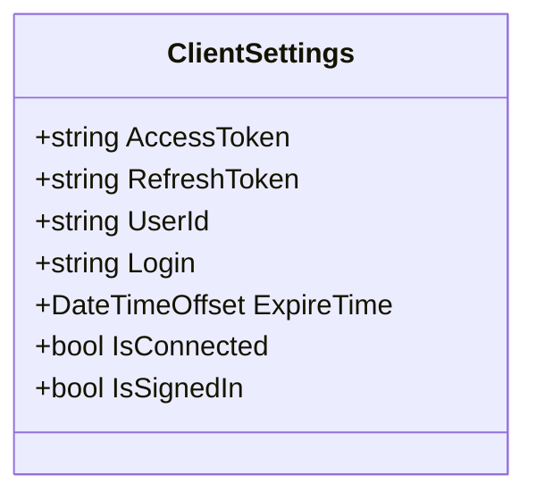
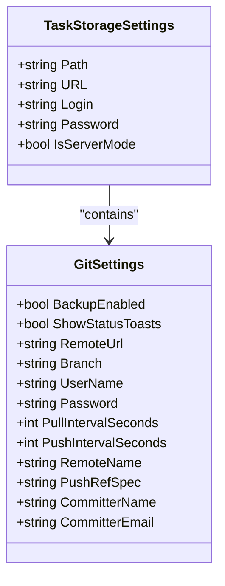
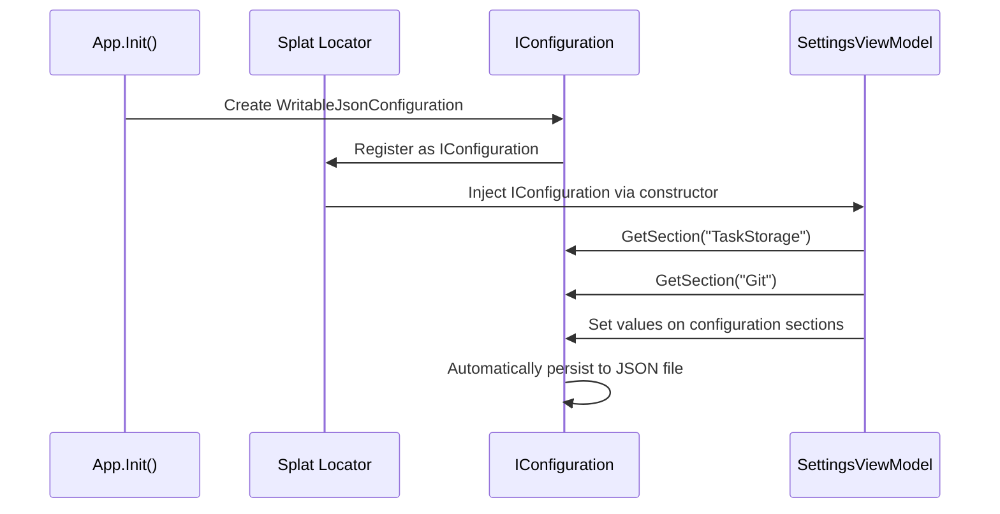
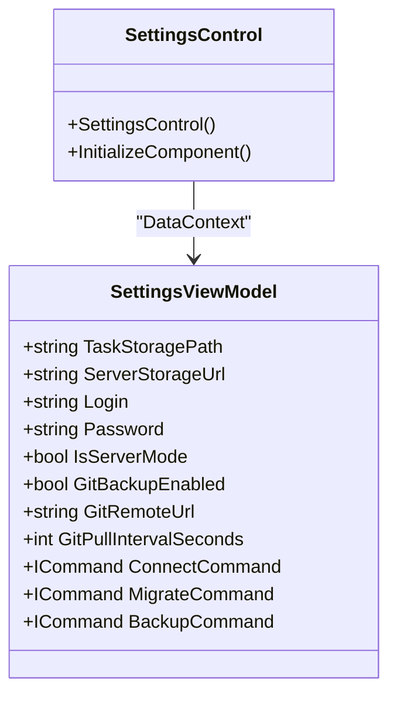
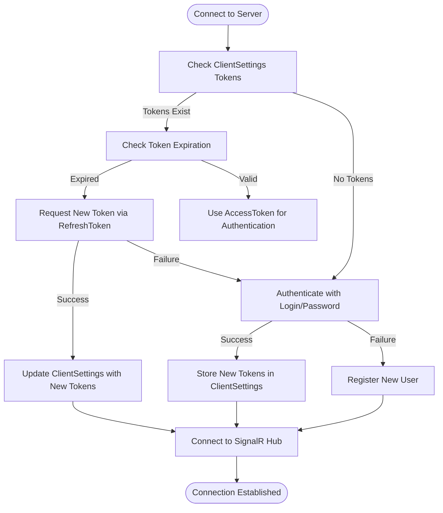
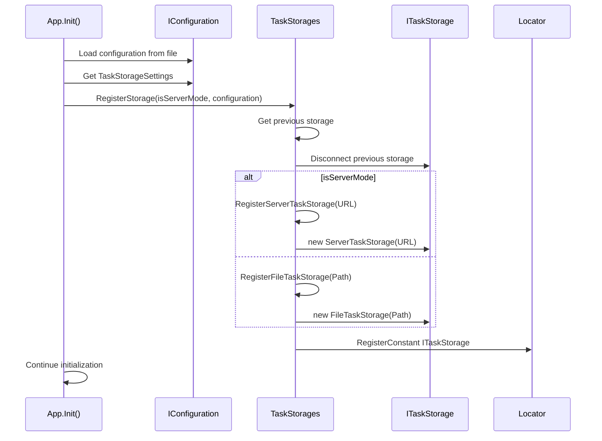
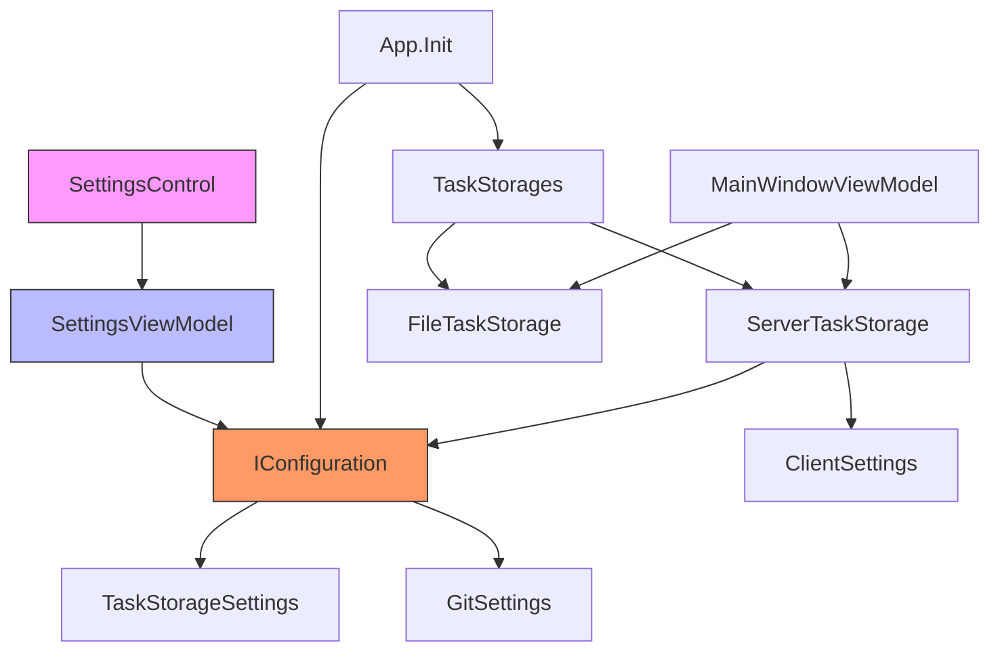

# Configuration and Settings

<cite>
**Referenced Files in This Document**   
- [ClientSettings.cs](file://src/Unlimotion/ClientSettings.cs)
- [TaskStorageSettings.cs](file://src/Unlimotion.ViewModel/TaskStorageSettings.cs)
- [SettingsViewModel.cs](file://src/Unlimotion.ViewModel/SettingsViewModel.cs)
- [SettingsControl.axaml.cs](file://src/Unlimotion/Views/SettingsControl.axaml.cs)
- [ServerTaskStorage.cs](file://src/Unlimotion/ServerTaskStorage.cs)
- [App.axaml.cs](file://src/Unlimotion/App.axaml.cs)
- [TaskStorages.cs](file://src/Unlimotion/TaskStorages.cs)
- [FileTaskStorage.cs](file://src/Unlimotion/FileTaskStorage.cs)
</cite>

## Table of Contents
1. [Introduction](#introduction)
2. [Core Settings Classes](#core-settings-classes)
3. [Settings Persistence with Splat](#settings-persistence-with-splat)
4. [Settings UI Components](#settings-ui-components)
5. [Server Mode Configuration](#server-mode-configuration)
6. [Application Initialization](#application-initialization)
7. [Dependency Analysis](#dependency-analysis)
8. [Conclusion](#conclusion)

## Introduction
Unlimotion's configuration system provides a flexible and persistent way to manage application settings across different storage backends and deployment modes. The system supports both local file-based storage and server-based storage through a unified configuration interface. This document details the key components of the configuration system, including the ClientSettings and TaskStorageSettings classes, the SettingsViewModel that binds settings to the UI, and the underlying mechanisms for settings persistence using the Splat dependency injection framework.

**Section sources**
- [ClientSettings.cs](file://src/Unlimotion/ClientSettings.cs)
- [TaskStorageSettings.cs](file://src/Unlimotion.ViewModel/TaskStorageSettings.cs)

## Core Settings Classes

### ClientSettings Class
The ClientSettings class stores authentication tokens, user identification, and connection state information required for server mode operation. This class maintains the user's access token and refresh token for authentication with the Unlimotion server, along with the user ID and login credentials. It also tracks the expiration time of the current session, enabling automatic token refresh when needed. The settings are persisted across application restarts through the Splat configuration system.

**Diagram sources**
- [ClientSettings.cs](file://src/Unlimotion/ClientSettings.cs)

**Section sources**
- [ClientSettings.cs](file://src/Unlimotion/ClientSettings.cs)

### TaskStorageSettings Class
The TaskStorageSettings class configures the task storage backend, supporting both local file system storage and remote server storage. For local storage, it specifies the file system path where task data is stored. For server mode, it contains the server URL, login credentials, and a boolean flag indicating whether server mode is enabled. The class also includes a GitSettings nested class that configures Git-based backup functionality, including repository URL, branch information, authentication credentials, and synchronization intervals.

**Diagram sources**
- [TaskStorageSettings.cs](file://src/Unlimotion.ViewModel/TaskStorageSettings.cs)

**Section sources**
- [TaskStorageSettings.cs](file://src/Unlimotion.ViewModel/TaskStorageSettings.cs)

## Settings Persistence with Splat

### IConfiguration and Dependency Injection
Unlimotion uses the Splat dependency injection framework to manage settings persistence across application restarts. The IConfiguration interface from Microsoft.Extensions.Configuration is registered as a service in the Splat locator, providing a centralized configuration system. Settings are stored in a JSON configuration file and automatically persisted when modified through the SettingsViewModel. The WritableJsonConfigurationFabric creates a writable configuration root that supports dynamic updates and file persistence.

**Diagram sources**
- [App.axaml.cs](file://src/Unlimotion/App.axaml.cs)
- [SettingsViewModel.cs](file://src/Unlimotion.ViewModel/SettingsViewModel.cs)

**Section sources**
- [App.axaml.cs](file://src/Unlimotion/App.axaml.cs)
- [SettingsViewModel.cs](file://src/Unlimotion.ViewModel/SettingsViewModel.cs)

## Settings UI Components

### SettingsControl UI Component
The SettingsControl is an Avalonia user control that provides the user interface for configuring task storage paths, Git integration settings, and server connection parameters. It binds to the SettingsViewModel to display and modify configuration values. The control includes input fields for the local storage path or server URL, authentication credentials, and Git repository settings. It also provides buttons for browsing to a local directory, connecting to the server, and managing Git operations like clone, pull, and push.

**Diagram sources**
- [SettingsControl.axaml.cs](file://src/Unlimotion/Views/SettingsControl.axaml.cs)
- [SettingsViewModel.cs](file://src/Unlimotion.ViewModel/SettingsViewModel.cs)

**Section sources**
- [SettingsControl.axaml.cs](file://src/Unlimotion/Views/SettingsControl.axaml.cs)
- [SettingsViewModel.cs](file://src/Unlimotion.ViewModel/SettingsViewModel.cs)

## Server Mode Configuration

### Authentication and Token Management
Server mode configuration requires login credentials and handles token refresh automatically through the ServerTaskStorage class. When connecting to the server, the application first attempts to use existing access and refresh tokens stored in ClientSettings. If the access token has expired, it automatically requests a new token using the refresh token. If no valid tokens exist, it authenticates with the server using the login credentials from TaskStorageSettings, storing the resulting tokens for future use.

**Diagram sources**
- [ServerTaskStorage.cs](file://src/Unlimotion/ServerTaskStorage.cs)
- [ClientSettings.cs](file://src/Unlimotion/ClientSettings.cs)

**Section sources**
- [ServerTaskStorage.cs](file://src/Unlimotion/ServerTaskStorage.cs)

## Application Initialization

### Storage Initialization Process
The application initializes the appropriate storage backend based on the TaskStorageSettings configuration. During startup in the App.Init method, the configuration is loaded and the TaskStorageSettings are retrieved. If IsServerMode is true, a ServerTaskStorage is registered with the dependency injection container; otherwise, a FileTaskStorage is registered. The TaskStorages.RegisterStorage method handles this registration process, disconnecting any previously registered storage instance.

**Diagram sources**
- [App.axaml.cs](file://src/Unlimotion/App.axaml.cs)
- [TaskStorages.cs](file://src/Unlimotion/TaskStorages.cs)

**Section sources**
- [App.axaml.cs](file://src/Unlimotion/App.axaml.cs)
- [TaskStorages.cs](file://src/Unlimotion/TaskStorages.cs)

## Dependency Analysis

### Component Relationships
The configuration system components are interconnected through dependency injection, with clear relationships between settings classes, storage implementations, and UI components. The SettingsViewModel depends on IConfiguration to access and modify settings, while ServerTaskStorage depends on both IConfiguration and ClientSettings for authentication. The SettingsControl depends on SettingsViewModel for its data context, creating a clean separation between UI and business logic.

**Diagram sources**
- [SettingsControl.axaml.cs](file://src/Unlimotion/Views/SettingsControl.axaml.cs)
- [SettingsViewModel.cs](file://src/Unlimotion.ViewModel/SettingsViewModel.cs)
- [App.axaml.cs](file://src/Unlimotion/App.axaml.cs)
- [TaskStorages.cs](file://src/Unlimotion/TaskStorages.cs)
- [ServerTaskStorage.cs](file://src/Unlimotion/ServerTaskStorage.cs)
- [FileTaskStorage.cs](file://src/Unlimotion/FileTaskStorage.cs)

**Section sources**
- [SettingsControl.axaml.cs](file://src/Unlimotion/Views/SettingsControl.axaml.cs)
- [SettingsViewModel.cs](file://src/Unlimotion.ViewModel/SettingsViewModel.cs)
- [App.axaml.cs](file://src/Unlimotion/App.axaml.cs)
- [TaskStorages.cs](file://src/Unlimotion/TaskStorages.cs)

## Conclusion
Unlimotion's configuration and settings system provides a robust foundation for managing application state across different storage backends and deployment scenarios. The system leverages the Splat dependency injection framework to maintain settings persistence, with clear separation between configuration data, storage implementations, and user interface components. The ClientSettings and TaskStorageSettings classes encapsulate all necessary configuration parameters, while the SettingsViewModel bridges the gap between the UI and the underlying configuration system. Server mode authentication is handled transparently with automatic token refresh, ensuring a seamless user experience. The modular design allows for easy extension and maintenance of the configuration system as the application evolves.