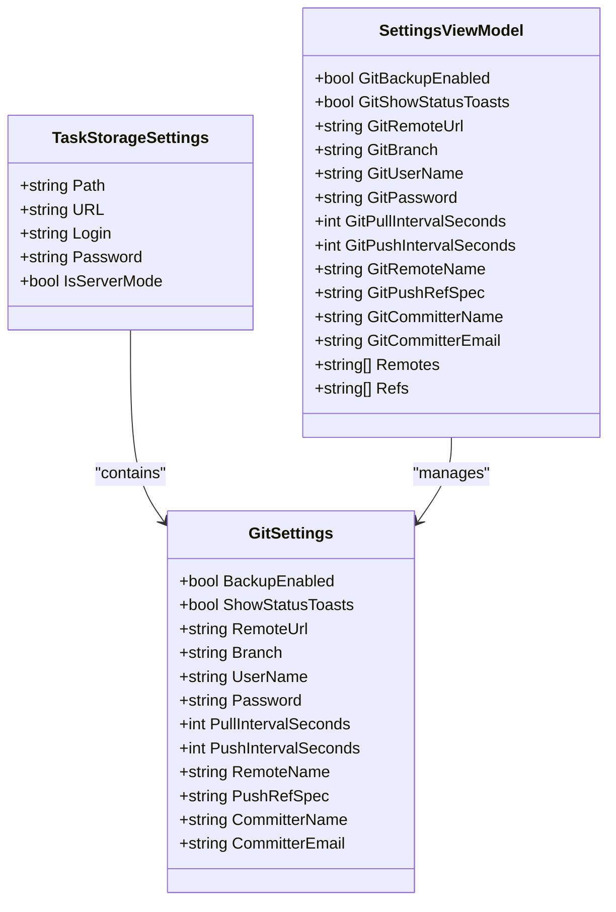
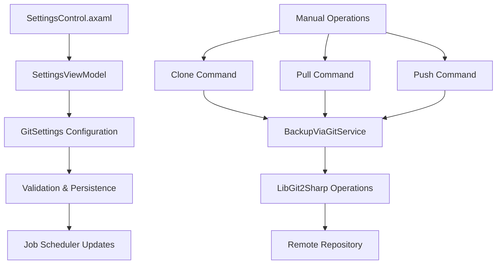
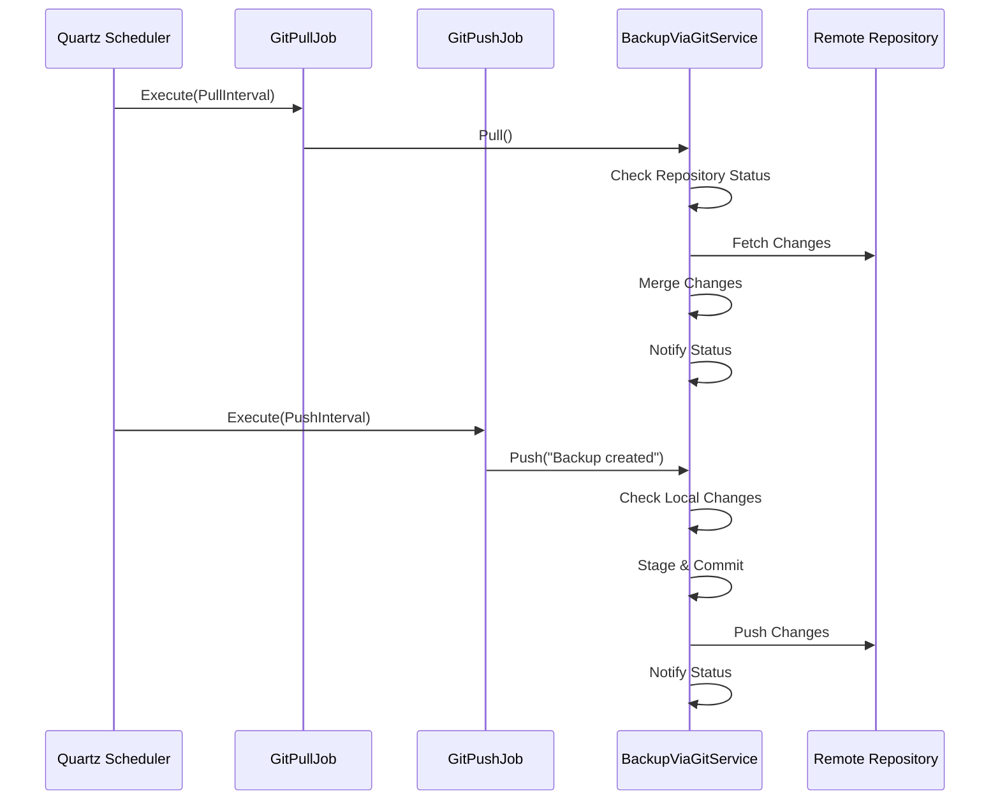
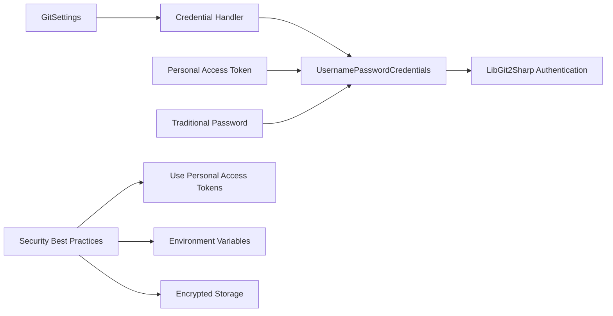
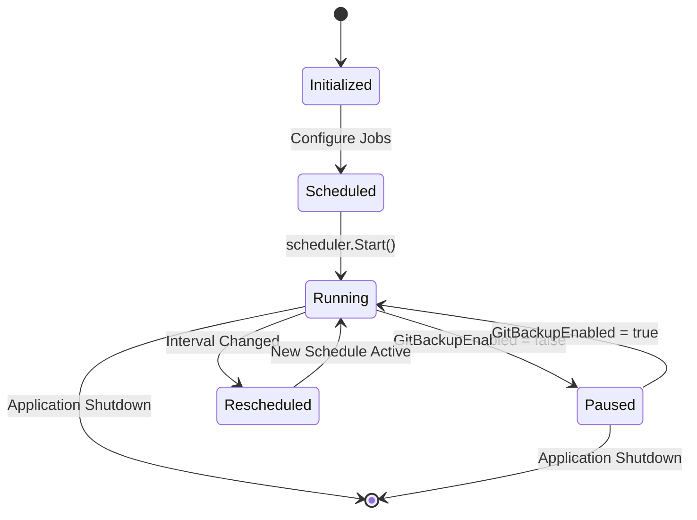
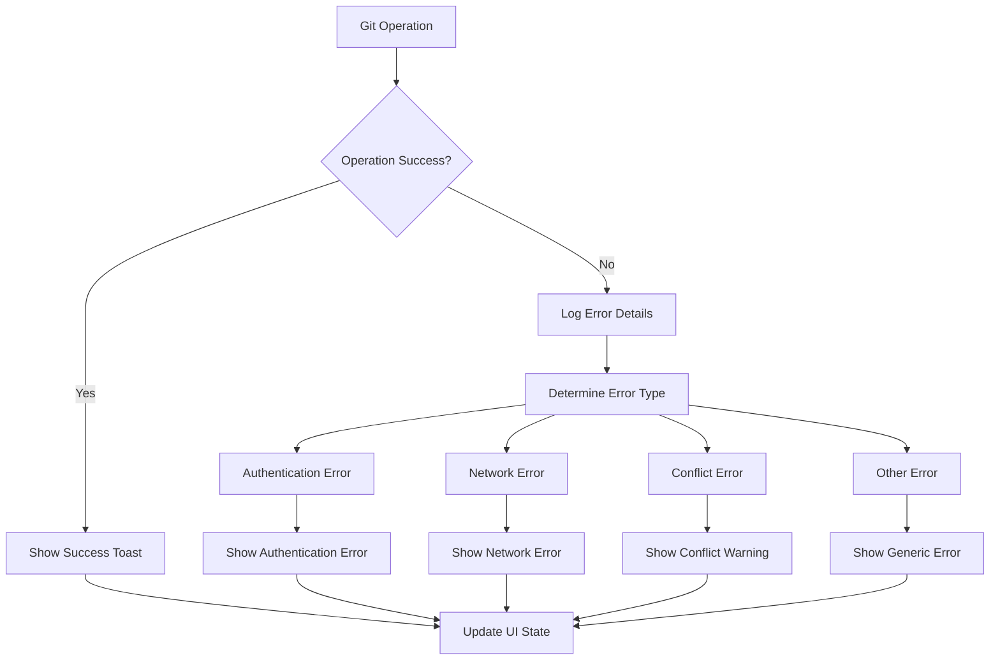

# Git Integration Settings

<cite>
**Referenced Files in This Document**
- [TaskStorageSettings.cs](file://src/Unlimotion.ViewModel/TaskStorageSettings.cs)
- [GitPullJob.cs](file://src/Unlimotion/Scheduling/Jobs/GitPullJob.cs)
- [GitPushJob.cs](file://src/Unlimotion/Scheduling/Jobs/GitPushJob.cs)
- [BackupViaGitService.cs](file://src/Unlimotion.Services/BackupViaGitService.cs)
- [SettingsViewModel.cs](file://src/Unlimotion.ViewModel/SettingsViewModel.cs)
- [SettingsControl.axaml](file://src/Unlimotion/Views/SettingsControl.axaml)
- [App.axaml.cs](file://src/Unlimotion/App.axaml.cs)
- [TaskStorages.cs](file://src/Unlimotion/TaskStorages.cs)
- [GitSettings.cs](file://src/Unlimotion.TelegramBot/GitSettings.cs)
- [GitService.cs](file://src/Unlimotion.TelegramBot/GitService.cs)
</cite>

## Table of Contents
1. [Introduction](#introduction)
2. [GitSettings Class Architecture](#gitsettings-class-architecture)
3. [Settings UI Implementation](#settings-ui-implementation)
4. [Automated Git Operations](#automated-git-operations)
5. [Authentication and Security](#authentication-and-security)
6. [Scheduling System](#scheduling-system)
7. [Error Handling and Notifications](#error-handling-and-notifications)
8. [Best Practices](#best-practices)
9. [Troubleshooting Guide](#troubleshooting-guide)
10. [Configuration Examples](#configuration-examples)

## Introduction

Unlimotion's Git integration provides automated backup and synchronization capabilities for task data through a comprehensive system built around the `GitSettings` class. This system enables periodic synchronization of task data with remote Git repositories, ensuring data safety and enabling collaboration across multiple devices. The integration leverages Quartz.NET for job scheduling, LibGit2Sharp for Git operations, and provides both automatic and manual backup capabilities.

The Git integration consists of several key components: configuration settings stored in the `GitSettings` class, a user-friendly settings UI for configuration, automated jobs for periodic pull and push operations, and robust error handling with user notifications. This system supports various Git hosting platforms including GitHub, GitLab, and Bitbucket through standard HTTPS authentication.

## GitSettings Class Architecture

The `GitSettings` class serves as the central configuration container for all Git-related operations within the Unlimotion application. Embedded within the broader `TaskStorageSettings` structure, it provides comprehensive control over backup behavior, authentication, and synchronization intervals.



**Diagram sources**
- [TaskStorageSettings.cs](file://src/Unlimotion.ViewModel/TaskStorageSettings.cs#L15-L34)
- [SettingsViewModel.cs](file://src/Unlimotion.ViewModel/SettingsViewModel.cs#L10-L152)

### Core Configuration Properties

The `GitSettings` class defines several critical configuration properties that control the behavior of the Git integration:

| Property | Type | Default Value | Description |
|----------|------|---------------|-------------|
| `BackupEnabled` | bool | false | Enables/disables automatic Git backup operations |
| `ShowStatusToasts` | bool | true | Controls display of status notifications for Git operations |
| `RemoteUrl` | string | null | URL of the remote Git repository |
| `Branch` | string | "master" | Target branch for synchronization operations |
| `UserName` | string | "YourEmail" | Authentication username or email |
| `Password` | string | "YourToken" | Authentication password or personal access token |
| `PullIntervalSeconds` | int | 30 | Interval between automatic pull operations (seconds) |
| `PushIntervalSeconds` | int | 60 | Interval between automatic push operations (seconds) |
| `RemoteName` | string | "origin" | Name of the remote repository |
| `PushRefSpec` | string | "refs/heads/master" | Reference specification for push operations |
| `CommitterName` | string | "Backuper" | Name used for Git commits |
| `CommitterEmail` | string | "Backuper@unlimotion.ru" | Email used for Git commits |

**Section sources**
- [TaskStorageSettings.cs](file://src/Unlimotion.ViewModel/TaskStorageSettings.cs#L15-L34)

### Telegram Bot Git Settings

The Telegram bot implementation uses a simplified version of the Git settings specifically designed for the bot's operational context. This version includes repository path configuration and differs slightly in default branch naming.

**Section sources**
- [GitSettings.cs](file://src/Unlimotion.TelegramBot/GitSettings.cs#L3-L18)

## Settings UI Implementation

The Git configuration interface is implemented through the `SettingsControl.axaml` XAML file and backed by the `SettingsViewModel` class. This interface provides comprehensive controls for configuring all aspects of the Git integration.



**Diagram sources**
- [SettingsControl.axaml](file://src/Unlimotion/Views/SettingsControl.axaml#L1-L79)
- [SettingsViewModel.cs](file://src/Unlimotion.ViewModel/SettingsViewModel.cs#L10-L152)

### UI Control Structure

The SettingsControl provides organized sections for Git configuration:

1. **Backup Enablement**: Toggle switch for activating/deactivating automatic backups
2. **Manual Operations**: Buttons for immediate clone, pull, and push operations
3. **Status Notifications**: Option to show/hide status toast messages
4. **Repository Configuration**: Fields for remote URL, branch, and authentication
5. **Synchronization Intervals**: Configurable timing for automatic operations
6. **Advanced Settings**: Remote names, reference specifications, and committer information

### Data Binding Architecture

The UI implements two-way data binding between the XAML controls and the SettingsViewModel properties. This ensures that user input is immediately reflected in the configuration and persisted automatically.

**Section sources**
- [SettingsControl.axaml](file://src/Unlimotion/Views/SettingsControl.axaml#L35-L78)
- [SettingsViewModel.cs](file://src/Unlimotion.ViewModel/SettingsViewModel.cs#L48-L152)

## Automated Git Operations

The Git integration employs a dual-job scheduling system using Quartz.NET to handle automatic synchronization operations. Two primary jobs manage the backup process: `GitPullJob` for fetching updates from remote repositories and `GitPushJob` for uploading local changes.



**Diagram sources**
- [GitPullJob.cs](file://src/Unlimotion/Scheduling/Jobs/GitPullJob.cs#L10-L19)
- [GitPushJob.cs](file://src/Unlimotion/Scheduling/Jobs/GitPushJob.cs#L10-L20)
- [BackupViaGitService.cs](file://src/Unlimotion.Services/BackupViaGitService.cs#L100-L180)

### Pull Operation Workflow

The `GitPullJob` executes the following sequence during each scheduled pull operation:

1. **Configuration Validation**: Checks if Git backup is enabled
2. **Service Initialization**: Retrieves the `BackupViaGitService` instance
3. **Repository Access**: Opens the local Git repository
4. **Remote Fetch**: Downloads changes from the remote repository
5. **Conflict Resolution**: Handles merge conflicts with stashing
6. **Status Notification**: Reports operation results to the user

### Push Operation Workflow

The `GitPushJob` manages automatic upload operations with the following steps:

1. **Configuration Check**: Validates backup enablement and repository status
2. **Local Changes Detection**: Identifies modified task files requiring synchronization
3. **Commit Creation**: Creates a new commit with automatic commit message
4. **Remote Push**: Uploads changes to the remote repository
5. **Error Handling**: Manages authentication and network errors

**Section sources**
- [GitPullJob.cs](file://src/Unlimotion/Scheduling/Jobs/GitPullJob.cs#L10-L19)
- [GitPushJob.cs](file://src/Unlimotion/Scheduling/Jobs/GitPushJob.cs#L10-L20)
- [BackupViaGitService.cs](file://src/Unlimotion.Services/BackupViaGitService.cs#L100-L180)

## Authentication and Security

The Git integration supports secure authentication through HTTPS with username/password credentials. The system currently uses LibGit2Sharp's `UsernamePasswordCredentials` for authentication, which accepts either traditional passwords or personal access tokens.

### Credential Management



**Diagram sources**
- [BackupViaGitService.cs](file://src/Unlimotion.Services/BackupViaGitService.cs#L75-L82)

### Security Considerations

While the current implementation stores credentials in plain text within the configuration, the codebase includes a TODO comment indicating future consideration for encrypted storage. For production environments, administrators should:

1. **Use Personal Access Tokens**: Generate scoped tokens with minimal permissions
2. **Implement Environment Variables**: Store sensitive credentials externally
3. **Consider Encrypted Storage**: Implement encryption for credential persistence
4. **Regular Token Rotation**: Establish procedures for periodic credential updates

### Supported Authentication Methods

The system supports multiple authentication approaches compatible with popular Git hosting platforms:

- **GitHub**: Username with Personal Access Token
- **GitLab**: Username with Personal Access Token
- **Bitbucket**: Username with App Password or Personal Access Token
- **Self-hosted Git**: Standard username/password or SSH keys

**Section sources**
- [BackupViaGitService.cs](file://src/Unlimotion.Services/BackupViaGitService.cs#L75-L82)

## Scheduling System

The Git integration utilizes Quartz.NET for sophisticated job scheduling that adapts to user configuration changes in real-time.



**Diagram sources**
- [App.axaml.cs](file://src/Unlimotion/App.axaml.cs#L188-L210)
- [TaskStorages.cs](file://src/Unlimotion/TaskStorages.cs#L31-L65)

### Dynamic Schedule Management

The scheduling system implements dynamic configuration updates through reactive programming patterns:

1. **Initial Setup**: Jobs are created with default intervals during application initialization
2. **Real-time Updates**: Configuration changes immediately reschedule affected jobs
3. **Pause/Resume**: Complete job suspension when backup is disabled
4. **Error Recovery**: Automatic restart of failed jobs with exponential backoff

### Job Configuration Details

Each scheduled job receives specific configuration parameters:

- **Pull Job**: Executes every `PullIntervalSeconds` with identity "GitPullJob:Git"
- **Push Job**: Executes every `PushIntervalSeconds` with identity "GitPushJob:Git"
- **Trigger Generation**: Uses simple schedules with repeat forever pattern
- **Error Handling**: Jobs continue execution despite individual failures

**Section sources**
- [App.axaml.cs](file://src/Unlimotion/App.axaml.cs#L188-L210)
- [TaskStorages.cs](file://src/Unlimotion/TaskStorages.cs#L31-L65)

## Error Handling and Notifications

The Git integration implements comprehensive error handling with user-friendly notification systems to ensure reliable operation and clear communication of status changes.



**Diagram sources**
- [BackupViaGitService.cs](file://src/Unlimotion.Services/BackupViaGitService.cs#L330-L356)

### Notification System

The notification system provides multiple levels of feedback:

1. **Success Toasts**: Confirmed successful operations when `ShowStatusToasts` is enabled
2. **Error Toasts**: Detailed error messages for failed operations
3. **Debug Logging**: Comprehensive logging for development and troubleshooting
4. **UI State Updates**: Real-time status indicators in the settings interface

### Error Categories

The system handles various error scenarios with appropriate user feedback:

- **Authentication Failures**: Clear indication of invalid credentials
- **Network Issues**: Timeout and connectivity problem reporting
- **Merge Conflicts**: Guidance for resolving conflicting changes
- **Repository Corruption**: Detection and reporting of repository issues
- **Permission Denied**: Access control violation notifications

**Section sources**
- [BackupViaGitService.cs](file://src/Unlimotion.Services/BackupViaGitService.cs#L330-L356)

## Best Practices

### Repository Setup Recommendations

For optimal Git integration performance, follow these repository configuration guidelines:

1. **Repository Structure**: Use a clean repository with task data as the primary content
2. **Branch Strategy**: Maintain separate branches for development and production data
3. **Ignore Patterns**: Configure `.gitignore` to exclude temporary and cache files
4. **Commit Messages**: Use descriptive commit messages for backup identification
5. **Size Limits**: Monitor repository size to prevent performance degradation

### Authentication Security

Implement secure authentication practices:

1. **Personal Access Tokens**: Generate tokens with minimal required permissions
2. **Token Rotation**: Establish regular rotation procedures for access tokens
3. **Environment Isolation**: Separate development and production credentials
4. **Monitoring**: Track authentication failures and suspicious activity

### Synchronization Timing

Optimize synchronization intervals based on usage patterns:

- **Frequent Changes**: Reduce pull/push intervals for active users
- **Resource Constraints**: Increase intervals during low-usage periods
- **Network Conditions**: Adjust intervals based on connection reliability
- **Backup Frequency**: Balance between data safety and resource usage

### Monitoring and Maintenance

Establish monitoring procedures:

1. **Operation Logs**: Regular review of Git operation logs
2. **Error Tracking**: Monitor error rates and patterns
3. **Performance Metrics**: Track synchronization timing and success rates
4. **Capacity Planning**: Monitor repository growth and storage requirements

## Troubleshooting Guide

### Common Issues and Solutions

#### Authentication Failures

**Symptoms**: "Can't push to the remote repository" errors or authentication prompts

**Solutions**:
1. Verify username and password/token correctness
2. Check repository access permissions
3. Confirm token expiration dates
4. Test repository URL accessibility
5. Review firewall and proxy configurations

#### Merge Conflicts

**Symptoms**: "Fix conflicts and then commit the result" messages

**Solutions**:
1. Review conflict markers in task files
2. Manually resolve conflicting changes
3. Commit resolved changes manually
4. Restart synchronization after resolution
5. Consider backup before major changes

#### Network Connectivity Issues

**Symptoms**: Timeout errors or connection refused messages

**Solutions**:
1. Verify internet connectivity
2. Check repository URL accessibility
3. Review firewall and proxy settings
4. Test with different network connections
5. Increase timeout values if necessary

#### Repository Corruption

**Symptoms**: "Repository is not valid" errors or inconsistent states

**Solutions**:
1. Run repository integrity checks
2. Clone repository to new location
3. Restore from last known good state
4. Contact repository administrator
5. Implement regular backup verification

### Diagnostic Procedures

#### Repository Health Check

1. **Verify Repository Status**: Check if repository is valid and accessible
2. **Test Authentication**: Confirm credentials work with remote repository
3. **Check Network Connectivity**: Verify remote repository accessibility
4. **Validate Configuration**: Review Git settings for correctness
5. **Monitor Logs**: Examine operation logs for error patterns

#### Performance Troubleshooting

1. **Measure Sync Times**: Track pull/push operation durations
2. **Monitor Resource Usage**: Check CPU and memory consumption
3. **Analyze Network Traffic**: Review bandwidth utilization
4. **Identify Bottlenecks**: Pinpoint slow operations or dependencies
5. **Optimize Configuration**: Adjust intervals and settings based on performance

**Section sources**
- [BackupViaGitService.cs](file://src/Unlimotion.Services/BackupViaGitService.cs#L317-L330)

## Configuration Examples

### Basic GitHub Repository Setup

```json
{
  "Git": {
    "BackupEnabled": true,
    "RemoteUrl": "https://github.com/username/task-backup.git",
    "Branch": "main",
    "UserName": "your-github-email@example.com",
    "Password": "ghp_your-personal-access-token",
    "PullIntervalSeconds": 300,
    "PushIntervalSeconds": 600,
    "ShowStatusToasts": true
  }
}
```

### Self-hosted GitLab Instance

```json
{
  "Git": {
    "BackupEnabled": true,
    "RemoteUrl": "https://gitlab.company.com/group/project.git",
    "Branch": "master",
    "UserName": "ci-user",
    "Password": "glpat-your-access-token",
    "PullIntervalSeconds": 180,
    "PushIntervalSeconds": 360,
    "RemoteName": "company-origin",
    "PushRefSpec": "refs/heads/master"
  }
}
```

### Development Environment Configuration

```json
{
  "Git": {
    "BackupEnabled": false,
    "RemoteUrl": "",
    "Branch": "develop",
    "UserName": "developer@example.com",
    "Password": "dev-token",
    "PullIntervalSeconds": 60,
    "PushIntervalSeconds": 120,
    "ShowStatusToasts": false
  }
}
```

### Telegram Bot Configuration

```json
{
  "Git": {
    "RepositoryPath": "GitTasks",
    "RemoteUrl": "https://github.com/bot/tasks.git",
    "Branch": "main",
    "UserName": "bot-user",
    "Password": "bot-token",
    "PullIntervalSeconds": 30,
    "PushIntervalSeconds": 60,
    "RemoteName": "origin",
    "PushRefSpec": "refs/heads/main"
  }
}
```

### Advanced Configuration with Custom Committers

```json
{
  "Git": {
    "BackupEnabled": true,
    "RemoteUrl": "https://bitbucket.org/team/project.git",
    "Branch": "production",
    "UserName": "backup-service",
    "Password": "bbp_your-app-password",
    "PullIntervalSeconds": 45,
    "PushIntervalSeconds": 90,
    "CommitterName": "TaskSync Bot",
    "CommitterEmail": "tasksync@company.com",
    "ShowStatusToasts": true
  }
}
```

These configuration examples demonstrate various deployment scenarios and customization options available through the Git integration settings. Administrators should select appropriate configurations based on their specific requirements, security policies, and infrastructure constraints.