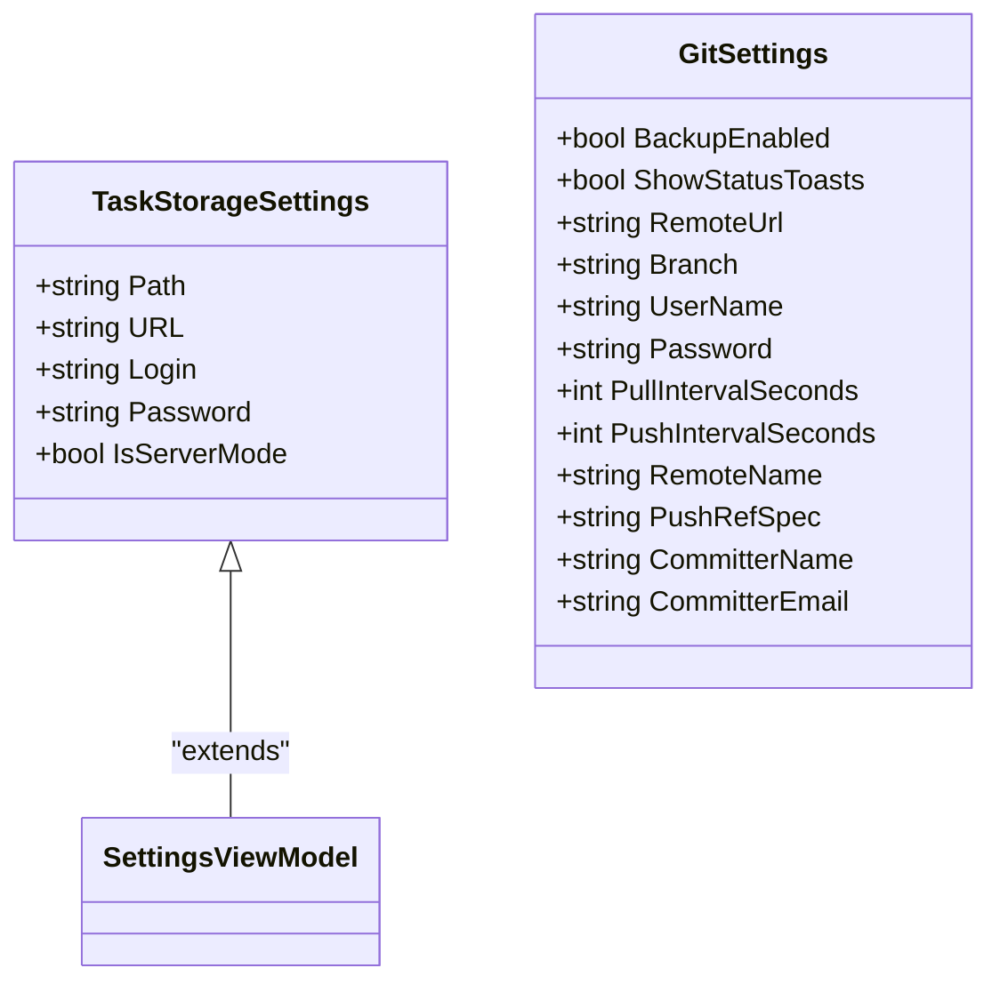
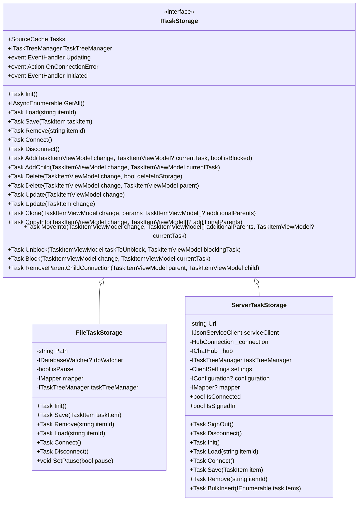
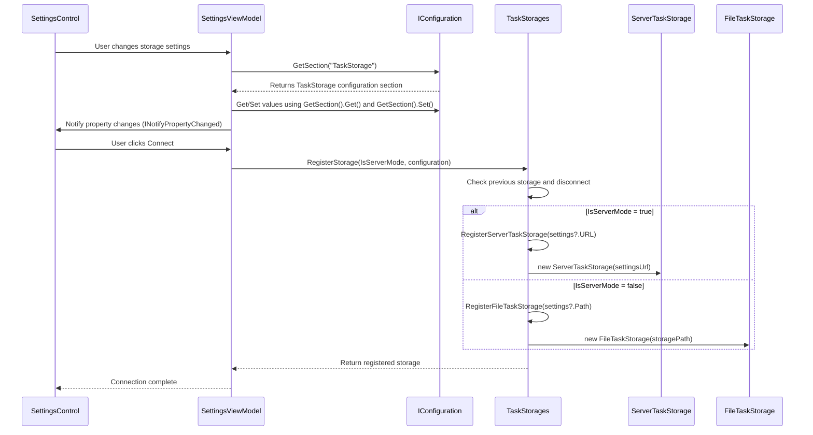
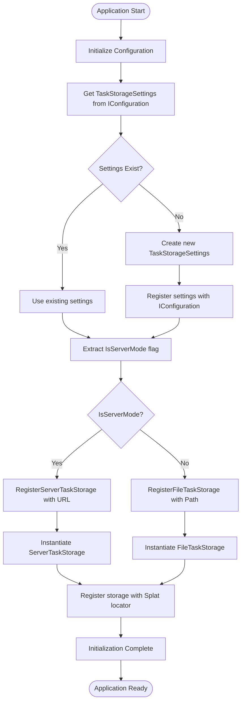

# Task Storage Configuration

<cite>
**Referenced Files in This Document**   
- [TaskStorageSettings.cs](file://src/Unlimotion.ViewModel/TaskStorageSettings.cs)
- [FileTaskStorage.cs](file://src/Unlimotion/FileTaskStorage.cs)
- [ServerTaskStorage.cs](file://src/Unlimotion/ServerTaskStorage.cs)
- [SettingsViewModel.cs](file://src/Unlimotion.ViewModel/SettingsViewModel.cs)
- [TaskStorages.cs](file://src/Unlimotion/TaskStorages.cs)
- [App.axaml.cs](file://src/Unlimotion/App.axaml.cs)
- [SettingsControl.axaml.cs](file://src/Unlimotion/Views/SettingsControl.axaml.cs)
</cite>

## Table of Contents
1. [Introduction](#introduction)
2. [TaskStorageSettings Class](#taskstoragesettings-class)
3. [Storage Implementation](#storage-implementation)
4. [Settings UI Components](#settings-ui-components)
5. [Configuration Binding and Validation](#configuration-binding-and-validation)
6. [Application Startup and Storage Resolution](#application-startup-and-storage-resolution)
7. [Security Considerations](#security-considerations)
8. [Configuration Persistence](#configuration-persistence)
9. [Conclusion](#conclusion)

## Introduction
The Task Storage Configuration system in Unlimotion provides a flexible mechanism for managing task persistence through either local file storage or remote server storage. This document details the architecture and implementation of this system, focusing on the TaskStorageSettings class that defines storage backend configuration, the FileTaskStorage and ServerTaskStorage implementations, and the SettingsControl UI component that allows users to configure storage options. The system leverages Splat's IConfiguration for automatic persistence across sessions and implements a robust initialization process that resolves the appropriate storage type at application startup.

**Section sources**
- [TaskStorageSettings.cs](file://src/Unlimotion.ViewModel/TaskStorageSettings.cs#L1-L34)
- [FileTaskStorage.cs](file://src/Unlimotion/FileTaskStorage.cs#L1-L458)
- [ServerTaskStorage.cs](file://src/Unlimotion/ServerTaskStorage.cs#L1-L722)

## TaskStorageSettings Class
The TaskStorageSettings class defines the configuration structure for task storage backends in Unlimotion. This class contains properties for both local and server-based storage configurations, allowing the application to seamlessly switch between storage types based on user preferences.

The class includes the following key properties:
- **Path**: Specifies the local file system path where task data is stored when using file-based storage
- **URL**: Defines the server endpoint URL for remote storage when server mode is enabled
- **Login**: Stores the authentication username for server-based storage
- **Password**: Contains the authentication password for server-based storage (currently stored in plaintext with a TODO for encryption)
- **IsServerMode**: A boolean flag that determines whether the application uses server-based storage (true) or local file storage (false)

This configuration class serves as the central data structure for storage settings, enabling the application to maintain consistent configuration across different storage implementations and providing a clear interface for the UI to bind against.

**Diagram sources**
- [TaskStorageSettings.cs](file://src/Unlimotion.ViewModel/TaskStorageSettings.cs#L1-L34)

**Section sources**
- [TaskStorageSettings.cs](file://src/Unlimotion.ViewModel/TaskStorageSettings.cs#L1-L34)

## Storage Implementation
Unlimotion implements two distinct storage backends through the FileTaskStorage and ServerTaskStorage classes, both of which implement the ITaskStorage interface. The choice between these implementations is determined by the IsServerMode flag in the TaskStorageSettings configuration.

### FileTaskStorage
The FileTaskStorage class provides local file system persistence for task data. It stores individual tasks as JSON files in a specified directory path, with each task serialized to its own file. The implementation uses Newtonsoft.Json for serialization and includes features such as:
- Directory enumeration to load all task files on initialization
- JSON serialization with ISO date formatting
- File system monitoring through the IDatabaseWatcher interface
- Task migration capabilities for schema updates

The storage path is configured through the Path property in TaskStorageSettings, and the implementation handles all file operations including reading, writing, and deleting task files.

### ServerTaskStorage
The ServerTaskStorage class enables remote storage through a server API using SignalR for real-time communication. This implementation connects to a server endpoint specified in the URL property of TaskStorageSettings and uses authentication credentials (Login and Password) to establish a secure connection. Key features include:
- SignalR HubConnection for real-time task synchronization
- JWT token-based authentication with refresh token support
- Automatic reconnection logic with exponential backoff
- ServiceStack JsonServiceClient for API communication
- Event handlers for task creation, update, and deletion notifications

The server storage implementation automatically handles authentication token management, including initial login, token refresh when expired, and user registration if credentials are not found.

**Diagram sources**
- [FileTaskStorage.cs](file://src/Unlimotion/FileTaskStorage.cs#L1-L458)
- [ServerTaskStorage.cs](file://src/Unlimotion/ServerTaskStorage.cs#L1-L722)

**Section sources**
- [FileTaskStorage.cs](file://src/Unlimotion/FileTaskStorage.cs#L1-L458)
- [ServerTaskStorage.cs](file://src/Unlimotion/ServerTaskStorage.cs#L1-L722)

## Settings UI Components
The SettingsControl and SettingsViewModel classes work together to provide a user interface for configuring task storage options. The SettingsControl.axaml file defines the UI layout, while the SettingsViewModel handles the business logic and data binding.

The SettingsControl UI component allows users to:
- Set the local storage path through a file dialog
- Configure the server URL for remote storage
- Toggle between local and server storage modes using the IsServerMode flag
- Input authentication credentials (login and password) for server storage
- Configure Git backup settings

The UI is designed to show relevant fields based on the selected storage mode, hiding server-specific fields when in local mode and vice versa. This provides a clean interface that only displays configuration options applicable to the current storage type.

**Diagram sources**
- [SettingsControl.axaml.cs](file://src/Unlimotion/Views/SettingsControl.axaml.cs#L1-L13)
- [SettingsViewModel.cs](file://src/Unlimotion.ViewModel/SettingsViewModel.cs#L1-L153)

**Section sources**
- [SettingsControl.axaml.cs](file://src/Unlimotion/Views/SettingsControl.axaml.cs#L1-L13)
- [SettingsViewModel.cs](file://src/Unlimotion.ViewModel/SettingsViewModel.cs#L1-L153)

## Configuration Binding and Validation
The SettingsViewModel class implements property binding between the UI controls and the underlying TaskStorageSettings configuration. This is achieved through the IConfiguration interface from Microsoft.Extensions.Configuration, which provides a type-safe way to access and modify configuration values.

Each property in SettingsViewModel (TaskStoragePath, ServerStorageUrl, Login, Password, IsServerMode) uses the GetSection() method to access the corresponding configuration section and the Get() and Set() methods to retrieve and update values. This approach ensures that configuration changes are immediately reflected in the underlying storage and automatically persisted through the IConfiguration implementation.

The binding mechanism also includes validation logic to ensure that required fields are properly set before attempting to connect to a storage backend. For example, when IsServerMode is enabled, the Login and Password fields must be non-empty, and the URL must be a valid endpoint. The ConnectCommand in SettingsViewModel orchestrates the validation and connection process, ensuring that the application only attempts to connect with valid configuration settings.

**Section sources**
- [SettingsViewModel.cs](file://src/Unlimotion.ViewModel/SettingsViewModel.cs#L1-L153)

## Application Startup and Storage Resolution
The application startup process in Unlimotion follows a well-defined sequence for initializing the task storage system. This process begins in the App.axaml.cs file, where the Init method is called to set up the application's configuration and services.

During startup, the following steps occur:
1. The TaskStorageSettings configuration is retrieved from the IConfiguration service
2. If no settings exist, a new TaskStorageSettings instance is created and registered
3. The IsServerMode flag is extracted from the settings to determine the storage type
4. The TaskStorages.RegisterStorage method is called with the IsServerMode value and configuration
5. Based on IsServerMode, either RegisterServerTaskStorage or RegisterFileTaskStorage is invoked
6. The appropriate storage implementation is instantiated and registered with the Splat locator

This initialization process ensures that the correct storage backend is set up before the application becomes interactive, providing a seamless experience for users. The system also handles the case where a previous storage instance exists by disconnecting it before registering the new one, preventing resource conflicts.

**Diagram sources**
- [App.axaml.cs](file://src/Unlimotion/App.axaml.cs#L139-L169)
- [TaskStorages.cs](file://src/Unlimotion/TaskStorages.cs#L129-L163)

**Section sources**
- [App.axaml.cs](file://src/Unlimotion/App.axaml.cs#L139-L169)
- [TaskStorages.cs](file://src/Unlimotion/TaskStorages.cs#L129-L163)

## Security Considerations
The current implementation of task storage configuration includes important security considerations, particularly regarding the handling of authentication credentials. The Password property in both TaskStorageSettings and GitSettings classes is currently stored in plaintext, as indicated by the TODO comment "стоит подумать над шифрованным хранением" (consider encrypted storage).

This plaintext storage presents a security risk, as sensitive authentication information could be exposed if the configuration file is accessed by unauthorized parties. The system would benefit from implementing encrypted storage for passwords, potentially using platform-specific secure storage mechanisms or encryption libraries.

Additional security considerations include:
- The ServerTaskStorage implementation uses JWT tokens for authentication, which are stored in the ClientSettings class
- HTTPS connections with certificate validation disabled (ServerCertificateValidationCallback set to always return true)
- Authentication credentials are passed directly from the configuration to the server without additional obfuscation
- The system automatically attempts to authenticate with stored credentials on startup

These security aspects should be addressed in future iterations to ensure the protection of user credentials and secure communication with the server backend.

**Section sources**
- [TaskStorageSettings.cs](file://src/Unlimotion.ViewModel/TaskStorageSettings.cs#L10)
- [SettingsViewModel.cs](file://src/Unlimotion.ViewModel/SettingsViewModel.cs#L40)
- [ServerTaskStorage.cs](file://src/Unlimotion/ServerTaskStorage.cs#L50)

## Configuration Persistence
The Task Storage Configuration system leverages Splat's IConfiguration interface for automatic persistence of settings across application sessions. This integration ensures that user-configured storage options are preserved between application restarts, providing a consistent experience.

The persistence mechanism works as follows:
- Configuration values are stored in a JSON configuration file (managed by WritableJsonConfiguration)
- The IConfiguration service provides type-safe access to configuration sections and values
- Changes to settings are immediately written to the configuration file through the Set method
- On application startup, the configuration is read from the file and used to initialize the storage system
- The WritableJsonConfigurationFabric.Create method handles the creation and management of the configuration file

This approach provides a reliable and straightforward mechanism for configuration persistence without requiring additional serialization logic. The use of a dedicated configuration system also allows for easy extension and integration with other application settings.

**Section sources**
- [App.axaml.cs](file://src/Unlimotion/App.axaml.cs#L139-L169)
- [SettingsViewModel.cs](file://src/Unlimotion.ViewModel/SettingsViewModel.cs#L1-L153)

## Conclusion
The Task Storage Configuration system in Unlimotion provides a flexible and extensible framework for managing task persistence through multiple storage backends. The TaskStorageSettings class serves as the central configuration model, defining properties for both local file storage and remote server storage. The system's architecture allows seamless switching between storage types based on the IsServerMode flag, with appropriate implementations (FileTaskStorage and ServerTaskStorage) handling the specific persistence mechanisms.

The SettingsControl and SettingsViewModel components provide a user-friendly interface for configuring storage options, with proper data binding and validation. The application startup process ensures correct initialization of the selected storage backend, while the integration with Splat's IConfiguration provides automatic persistence of settings across sessions.

While the current implementation effectively meets the functional requirements, the TODO comment regarding encrypted password storage highlights an important security consideration for future improvement. Addressing this issue would enhance the overall security posture of the application and better protect user credentials.