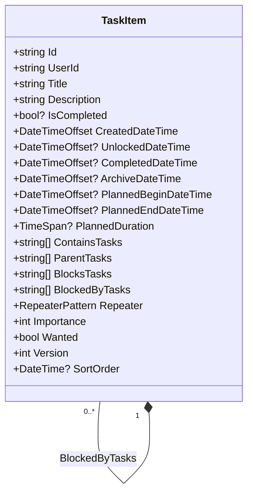
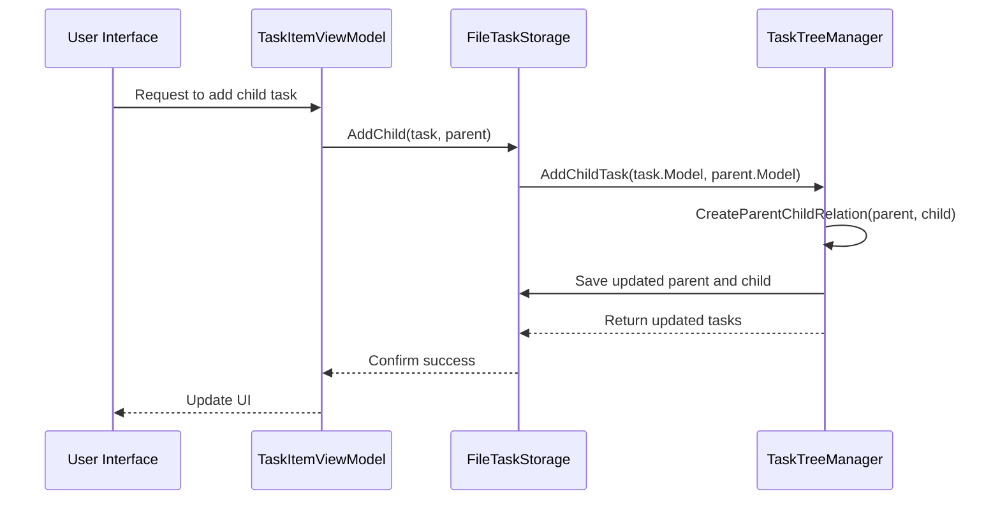
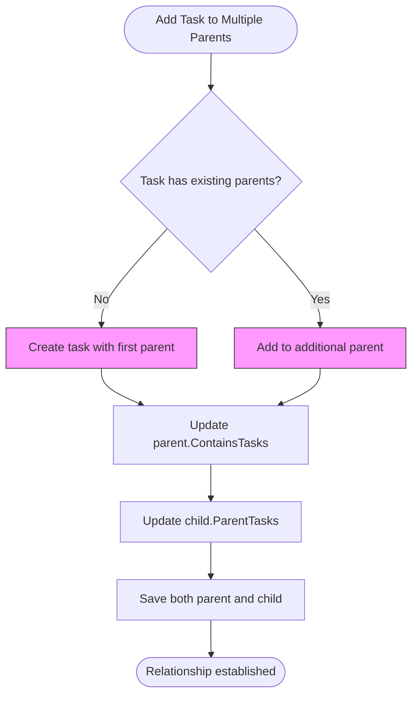
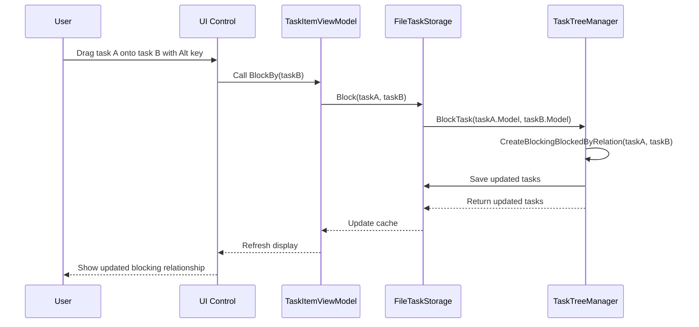
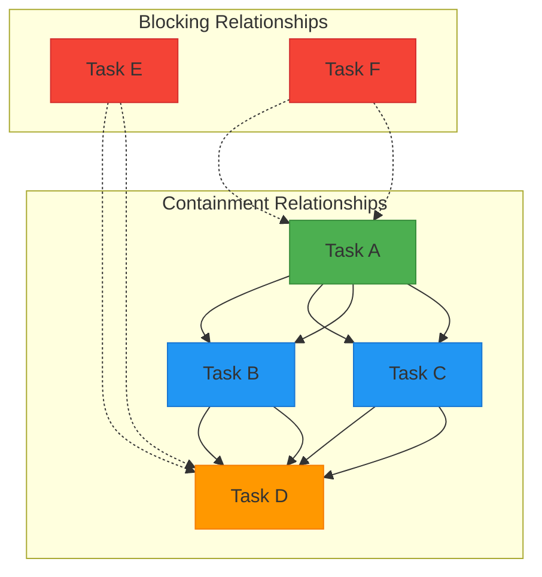
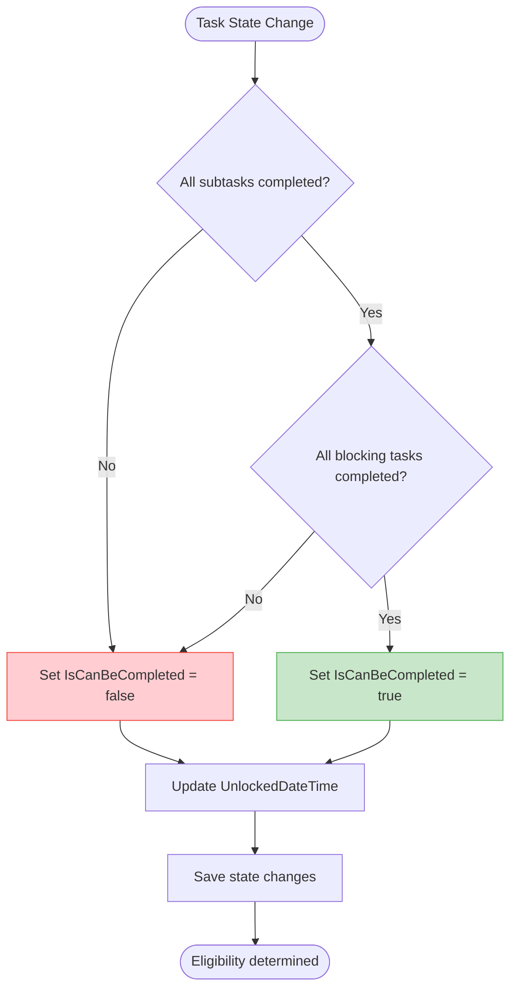
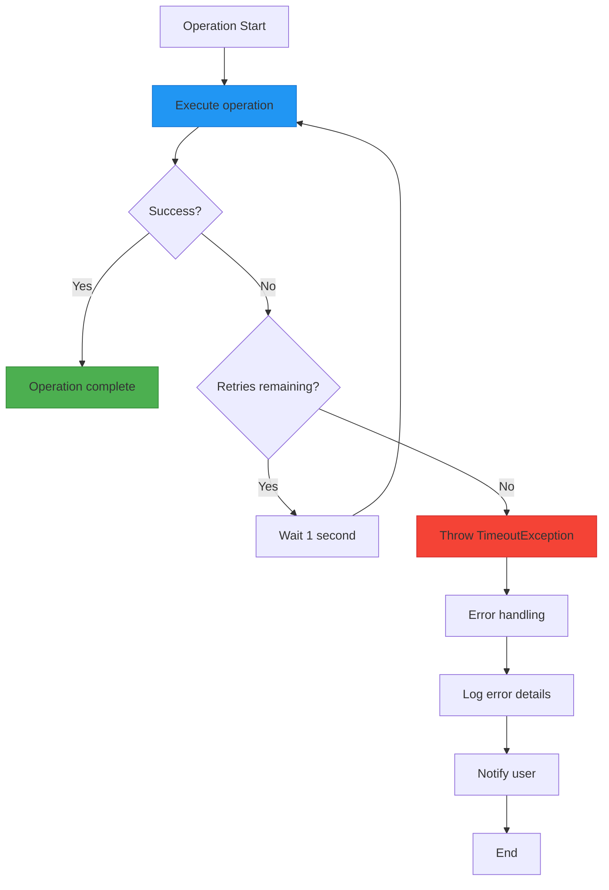

# Core Features

<cite>
**Referenced Files in This Document**   
- [TaskItem.cs](file://src/Unlimotion.Domain/TaskItem.cs) - *Updated in recent commit*
- [FileTaskStorage.cs](file://src/Unlimotion/FileTaskStorage.cs) - *Updated in recent commit*
- [TaskTreeManager.cs](file://src/Unlimotion.TaskTreeManager/TaskTreeManager.cs) - *Updated in recent commit*
- [ITaskTreeManager.cs](file://src/Unlimotion.TaskTreeManager/ITaskTreeManager.cs)
- [TaskItemViewModel.cs](file://src/Unlimotion.ViewModel/TaskItemViewModel.cs) - *Updated in recent commit*
- [MainControl.axaml.cs](file://src/Unlimotion/Views/MainControl.axaml.cs)
- [GraphControl.axaml.cs](file://src/Unlimotion/Views/GraphControl.axaml.cs)
- [ContainEdge.cs](file://src/Unlimotion/Views/Graph/ContainEdge.cs)
- [BlockEdge.cs](file://src/Unlimotion/Views/Graph/BlockEdge.cs)
- [MainWindowViewModel.cs](file://src/Unlimotion.ViewModel/MainWindowViewModel.cs) - *Updated in recent commit*
</cite>

## Update Summary
**Changes Made**   
- Updated the "Unlimited Task Nesting" section to include new automatic parent hierarchy expansion behavior
- Added implementation details from MainWindowViewModel.cs showing the expansion logic
- Updated section sources to reflect the new file reference
- Maintained all existing documentation structure while enhancing accuracy

## Table of Contents
1. [Domain Model Relationships](#domain-model-relationships)
2. [Unlimited Task Nesting](#unlimited-task-nesting)
3. [Multi-Parent Relationships](#multi-parent-relationships)
4. [Task Blocking and Unblocking Logic](#task-blocking-and-unblocking-logic)
5. [Roadmap Visualization](#roadmap-visualization)
6. [Task Completion Eligibility](#task-completion-eligibility)
7. [Common Issues and Solutions](#common-issues-and-solutions)

## Domain Model Relationships

The Unlimotion task management system is built around a rich domain model that enables complex task relationships through four key relationship types defined in the `TaskItem` class. These relationships form the foundation for advanced task organization and dependency management.

The `TaskItem` class contains four primary relationship collections that define how tasks can be interconnected:

- **ContainsTasks**: A list of task IDs that this task contains as subtasks
- **ParentTasks**: A list of task IDs that are parents of this task
- **BlocksTasks**: A list of task IDs that this task blocks
- **BlockedByTasks**: A list of task IDs that block this task

These relationships enable a flexible, non-hierarchical task structure where tasks can have multiple parents and participate in complex blocking relationships. The implementation supports transitive relationships, allowing for sophisticated dependency chains.



**Diagram sources**
- [TaskItem.cs](file://src/Unlimotion.Domain/TaskItem.cs#L5-L29)

**Section sources**
- [TaskItem.cs](file://src/Unlimotion.Domain/TaskItem.cs#L5-L29)

## Unlimited Task Nesting

Unlimotion supports unlimited task nesting through the parent-child relationship system implemented in the `TaskTreeManager` and `FileTaskStorage` classes. This allows users to create deeply nested task hierarchies without artificial depth limitations.

The nesting functionality is implemented through the `ContainsTasks` and `ParentTasks` collections in the `TaskItem` class. When a task is added as a child to another task, both collections are updated to maintain bidirectional references. This ensures data consistency and enables efficient traversal in both directions.

The `AddChildTask` method in `TaskTreeManager` handles the creation of parent-child relationships:



The implementation uses an `AutoUpdatingDictionary` to track all tasks that need to be updated during a single operation, ensuring atomicity and consistency. When a child task is added, both the parent's `ContainsTasks` collection and the child's `ParentTasks` collection are updated, and both tasks are saved to storage.

A recent enhancement improves user experience by automatically expanding the entire parent hierarchy when creating a nested task. This ensures the new task is immediately visible to the user in the "AllTasks" tab. The implementation in `MainWindowViewModel.CreateInner` command not only creates the child task but also sets the `IsExpanded` property to true for all parent wrappers in the hierarchy:

```csharp
CreateInner = ReactiveCommand.CreateFromTask(async () =>
{
    if (CurrentTaskItem == null)
        return;
    if (string.IsNullOrWhiteSpace(CurrentTaskItem.Title))
        return;

    var parent = CurrentTaskItem;
    var task = new TaskItemViewModel(new TaskItem(), taskRepository);

    await taskRepository?.AddChild(task, parent);

    CurrentTaskItem = task;
    SelectCurrentTask();

    var wrapper = FindTaskWrapperViewModel(parent, CurrentItems);
    if (wrapper != null)
    {
        wrapper.IsExpanded = true;
        var p = wrapper.Parent;
        while (p != null)
        {
            p.IsExpanded = true;
            p = p.Parent;
        }
    }
}).AddToDisposeAndReturn(connectionDisposableList);
```

This enhancement significantly improves usability by eliminating the need for users to manually expand multiple levels of the task tree to locate newly created nested tasks.

**Diagram sources**
- [TaskTreeManager.cs](file://src/Unlimotion.TaskTreeManager/TaskTreeManager.cs#L8-L458)
- [FileTaskStorage.cs](file://src/Unlimotion/FileTaskStorage.cs#L27-L417)
- [MainWindowViewModel.cs](file://src/Unlimotion.ViewModel/MainWindowViewModel.cs#L21-L799)

**Section sources**   
- [TaskTreeManager.cs](file://src/Unlimotion.TaskTreeManager/TaskTreeManager.cs#L8-L458)
- [FileTaskStorage.cs](file://src/Unlimotion/FileTaskStorage.cs#L27-L417)
- [TaskItem.cs](file://src/Unlimotion.Domain/TaskItem.cs#L5-L29)
- [MainWindowViewModel.cs](file://src/Unlimotion.ViewModel/MainWindowViewModel.cs#L21-L799) - *Updated in recent commit*

## Multi-Parent Relationships

Unlimotion implements a sophisticated multi-parent relationship system that allows a single task to belong to multiple parent tasks simultaneously. This feature enables tasks to be shared across different contexts or projects without duplication.

The multi-parent functionality is built on the bidirectional relationship between `ContainsTasks` and `ParentTasks` collections. When a task is added to multiple parents, each parent's `ContainsTasks` collection is updated to include the child task ID, and the child's `ParentTasks` collection is updated to include all parent task IDs.

Key operations for multi-parent relationships include:

- **Adding a new parent**: The `AddNewParentToTask` method creates a new parent-child relationship while preserving existing relationships
- **Moving between parents**: The `MoveTaskToNewParent` method breaks an existing parent-child relationship and creates a new one
- **Removing a parent**: The `DeleteParentChildRelation` method removes a specific parent-child relationship while preserving others



The system handles edge cases such as circular references and ensures data consistency through transaction-like operations using the `AutoUpdatingDictionary` class, which collects all changes before committing them to storage.

**Diagram sources**
- [TaskTreeManager.cs](file://src/Unlimotion.TaskTreeManager/TaskTreeManager.cs#L8-L458)
- [FileTaskStorage.cs](file://src/Unlimotion/FileTaskStorage.cs#L27-L417)

**Section sources**
- [TaskTreeManager.cs](file://src/Unlimotion.TaskTreeManager/TaskTreeManager.cs#L8-L458)
- [FileTaskStorage.cs](file://src/Unlimotion/FileTaskStorage.cs#L27-L417)
- [TaskItem.cs](file://src/Unlimotion.Domain/TaskItem.cs#L5-L29)

## Task Blocking and Unblocking Logic

The task blocking system in Unlimotion provides a powerful mechanism for managing task dependencies through explicit blocking relationships. This allows users to define which tasks must be completed before others can be unlocked.

Blocking relationships are implemented using two collections in the `TaskItem` class:
- **BlocksTasks**: Contains IDs of tasks that this task blocks
- **BlockedByTasks**: Contains IDs of tasks that block this task

These collections maintain a bidirectional relationship, ensuring that when Task A blocks Task B, Task A's `BlocksTasks` collection contains B's ID, and Task B's `BlockedByTasks` collection contains A's ID.

The blocking logic is managed through the `BlockTask` and `UnblockTask` methods in `TaskTreeManager`:



The implementation ensures atomic updates to both tasks involved in the blocking relationship. When a task is blocked, the system automatically recalculates the unlock status of the blocked task based on its blocking dependencies.

**Diagram sources**
- [TaskTreeManager.cs](file://src/Unlimotion.TaskTreeManager/TaskTreeManager.cs#L8-L458)
- [MainControl.axaml.cs](file://src/Unlimotion/Views/MainControl.axaml.cs#L16-L280)
- [FileTaskStorage.cs](file://src/Unlimotion/FileTaskStorage.cs#L27-L417)

**Section sources**
- [TaskTreeManager.cs](file://src/Unlimotion.TaskTreeManager/TaskTreeManager.cs#L8-L458)
- [MainControl.axaml.cs](file://src/Unlimotion/Views/MainControl.axaml.cs#L16-L280)
- [FileTaskStorage.cs](file://src/Unlimotion/FileTaskStorage.cs#L27-L417)
- [TaskItem.cs](file://src/Unlimotion.Domain/TaskItem.cs#L5-L29)

## Roadmap Visualization

Unlimotion provides a visual roadmap representation of task relationships through the `GraphControl` component, which renders task dependencies as a directed graph. This visualization helps users understand complex task hierarchies and dependencies at a glance.

The graph visualization system uses the MSAGL (Microsoft Automatic Graph Layout) library to automatically arrange tasks and their relationships. The `GraphControl` class builds the graph by:

1. Processing all tasks in the current view
2. Creating edges for containment relationships using `ContainEdge`
3. Creating edges for blocking relationships using `BlockEdge`
4. Arranging the graph with optimal layout



The visualization distinguishes between containment (solid lines) and blocking (dashed lines) relationships, providing clear visual feedback about task dependencies. Users can interact with the graph through drag-and-drop operations to modify relationships.

**Diagram sources**
- [GraphControl.axaml.cs](file://src/Unlimotion/Views/GraphControl.axaml.cs#L18-L227)
- [ContainEdge.cs](file://src/Unlimotion/Views/Graph/ContainEdge.cs#L4-L9)
- [BlockEdge.cs](file://src/Unlimotion/Views/Graph/BlockEdge.cs#L4-L9)

**Section sources**
- [GraphControl.axaml.cs](file://src/Unlimotion/Views/GraphControl.axaml.cs#L18-L227)
- [ContainEdge.cs](file://src/Unlimotion/Views/Graph/ContainEdge.cs#L4-L9)
- [BlockEdge.cs](file://src/Unlimotion/Views/Graph/BlockEdge.cs#L4-L9)

## Task Completion Eligibility

The system determines task completion eligibility through a comprehensive algorithm that evaluates both structural and dependency-based conditions. A task can only be completed when all prerequisites are satisfied.

The eligibility calculation is implemented in the `TaskItemViewModel` class through reactive subscriptions that monitor relevant task properties:



The key factors in determining completion eligibility are:

1. **Subtask completion**: All tasks in the `ContainsTasks` collection must be completed (IsCompleted = true)
2. **Blocking dependencies**: All tasks in the `BlockedByTasks` collection must be completed
3. **Task state**: The task itself must not be archived (IsCompleted = null) or already completed

When a task becomes eligible for completion, the system automatically sets the `UnlockedDateTime` to the current timestamp. When a task becomes ineligible, the `UnlockedDateTime` is cleared.

The implementation uses reactive programming patterns with `ObservableCollection` change tracking to efficiently respond to changes in task relationships and states without requiring manual recalculation.

**Diagram sources**
- [TaskItemViewModel.cs](file://src/Unlimotion.ViewModel/TaskItemViewModel.cs#L20-L567)
- [TaskItem.cs](file://src/Unlimotion.Domain/TaskItem.cs#L5-L29)

**Section sources**
- [TaskItemViewModel.cs](file://src/Unlimotion.ViewModel/TaskItemViewModel.cs#L20-L567)

## Common Issues and Solutions

The complex task relationship system in Unlimotion can encounter several common issues, which are addressed through specific implementation patterns and safeguards.

### Circular Dependencies
Circular dependencies can occur when tasks form a loop in their relationships. The system prevents infinite loops through careful traversal algorithms that track visited nodes using `HashSet<string>` collections.

### Data Consistency
To ensure data consistency during complex operations, the system uses the `AutoUpdatingDictionary` class to collect all changes before committing them to storage. This provides a transaction-like behavior that prevents partial updates.

### Performance Optimization
For large task hierarchies, the system implements several performance optimizations:

- **Lazy loading**: Tasks are loaded on-demand rather than all at once
- **Change tracking**: Only modified tasks are saved to storage
- **Batch operations**: Related changes are grouped to minimize storage operations

### Error Handling
The system includes robust error handling through:

- **Retry policies**: Operations are retried with exponential backoff using Polly library
- **Timeouts**: Operations that take too long are terminated to prevent hangs
- **Fallback mechanisms**: When operations fail, the system attempts to restore previous state



These mechanisms ensure that the task management system remains responsive and reliable even under challenging conditions.

**Diagram sources**
- [TaskTreeManager.cs](file://src/Unlimotion.TaskTreeManager/TaskTreeManager.cs#L8-L458)
- [AutoUpdatingDictionary.cs](file://src/Unlimotion.TaskTreeManager/AutoUpdatingDictionary.cs#L1-L26)

**Section sources**
- [TaskTreeManager.cs](file://src/Unlimotion.TaskTreeManager/TaskTreeManager.cs#L8-L458)
- [AutoUpdatingDictionary.cs](file://src/Unlimotion.TaskTreeManager/AutoUpdatingDictionary.cs#L1-L26)
- [FileTaskStorage.cs](file://src/Unlimotion/FileTaskStorage.cs#L27-L417)