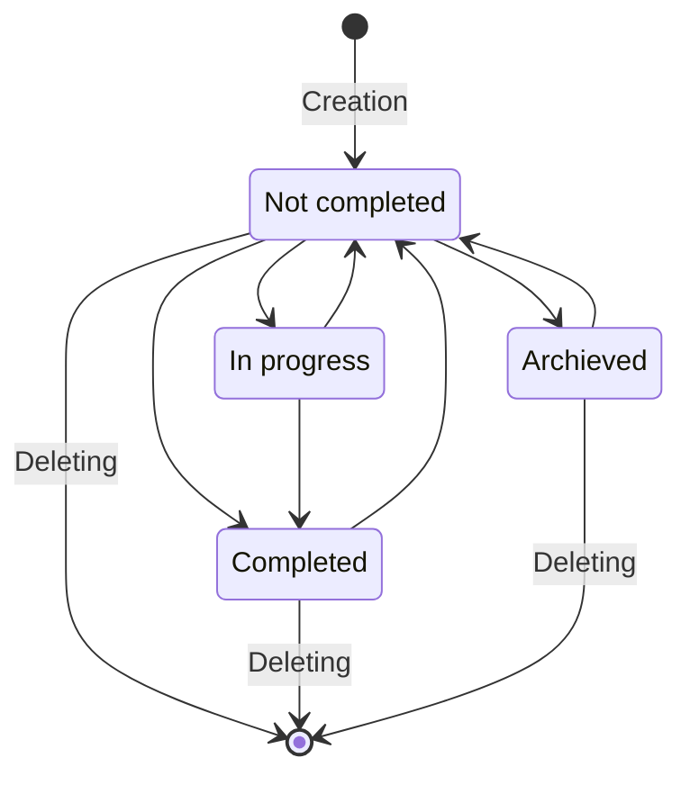
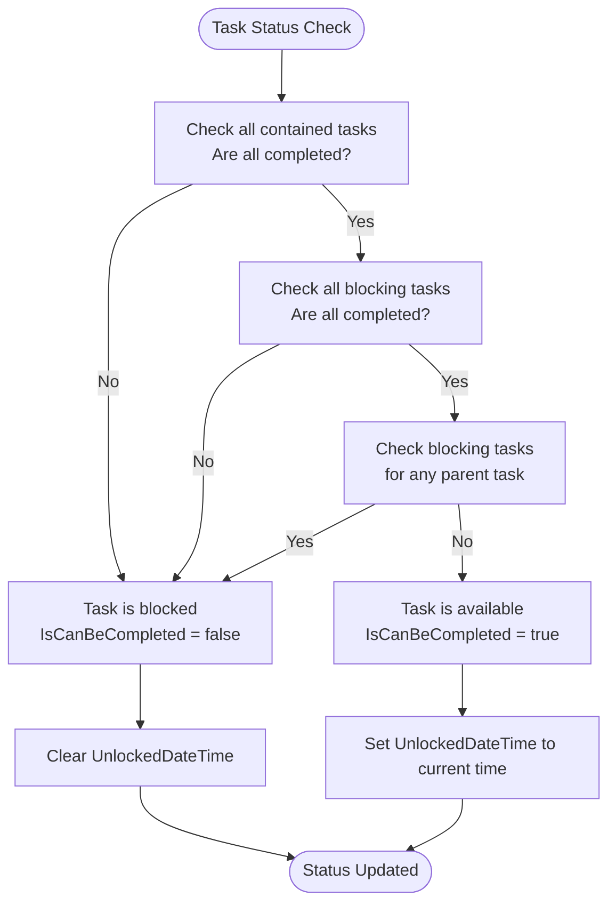

# Core Features

<cite>
**Referenced Files in This Document**   
- [README.md](file://README.md)
- [TaskItem.cs](file://src/Unlimotion.Domain/TaskItem.cs)
- [TaskTreeManager.cs](file://src/Unlimotion.TaskTreeManager/TaskTreeManager.cs)
- [MainWindowViewModel.cs](file://src/Unlimotion.ViewModel/MainWindowViewModel.cs)
- [SettingsViewModel.cs](file://src/Unlimotion.ViewModel/SettingsViewModel.cs)
- [GraphControl.axaml.cs](file://src/Unlimotion/Views/GraphControl.axaml.cs)
- [TaskItemViewModel.cs](file://src/Unlimotion.ViewModel/TaskItemViewModel.cs)
</cite>

## Table of Contents
1. [Task Management System](#task-management-system)
2. [Task States and Transitions](#task-states-and-transitions)
3. [Task Relationships](#task-relationships)
4. [Blocking Logic and Availability](#blocking-logic-and-availability)
5. [Application Views](#application-views)
6. [Settings Configuration](#settings-configuration)
7. [Emoji-Based Grouping](#emoji-based-grouping)

## Task Management System

Unlimotion features a sophisticated task management system with unlimited nesting levels and support for tasks having multiple parents. This allows for cross-project task organization and flexible hierarchical structures. The system is built around the `TaskItem` class which contains properties that enable these advanced features.

The `TaskItem` class includes collections for `ContainsTasks` (child tasks), `ParentTasks` (parent tasks), `BlocksTasks` (tasks that block this task), and `BlockedByTasks` (tasks that this task blocks). This structure enables the implementation of complex task relationships and dependencies.

The system supports creating tasks at the same level as the selected task (sibling), creating blocked siblings, and creating nested tasks inside the selected task. These operations are facilitated through the `TaskTreeManager` which handles all business logic related to task relationships and availability calculations.

**Section sources**
- [README.md](file://README.md#L79-L95)
- [TaskItem.cs](file://src/Unlimotion.Domain/TaskItem.cs#L1-L33)
- [TaskTreeManager.cs](file://src/Unlimotion.TaskTreeManager/TaskTreeManager.cs#L1-L830)

## Task States and Transitions

Unlimotion implements a comprehensive state management system for tasks, with four distinct states that govern task lifecycle and visibility:

1. **Not Completed** - represented by an empty checkbox
2. **In Progress** - represented by an empty checkbox with a clock icon
3. **Completed** - represented by a checkbox with a check mark
4. **Archived** - represented by a checkbox with a square

The valid state transitions are defined by a state diagram that specifies the allowed changes between states. Tasks can be created in the "Not Completed" state and can transition to any of the other three states. From "In Progress," tasks can return to "Not Completed" or move to "Completed." "Completed" tasks can revert to "Not Completed," and "Archived" tasks can also be restored to "Not Completed." All states support deletion, which removes the task entirely.

The state transitions are enforced through the application's business logic, ensuring data integrity and consistent user experience across different views and operations.

**Diagram sources **
- [README.md](file://README.md#L28-L48)

**Section sources**
- [README.md](file://README.md#L28-L48)
- [TaskItem.cs](file://src/Unlimotion.Domain/TaskItem.cs#L15-L19)

## Task Relationships

Unlimotion implements four types of task relationships that enable complex task organization and dependency management:

### Parents (Containment)
Parent tasks contain other tasks as integral parts necessary for execution. A task can have multiple parents simultaneously, enabling cross-project organization. This relationship is stored in the `ParentTasks` collection of the `TaskItem` class and is visualized as hierarchical nesting in the task tree.

### Containing (Children)
Containing tasks represent child tasks that are part of or steps within a parent task. This relationship arises during task decomposition and is stored in the `ContainsTasks` collection. The parent-child relationship creates a hierarchical structure that can be navigated in various views.

### Blocking By (Prerequisites)
Blocking tasks are prerequisites that must be completed to unlock the current task. This relationship is stored in the `BlockedByTasks` collection, indicating which tasks must be completed before the current task can be completed. The blocking task itself contains a reference to the blocked task in its `BlocksTasks` collection.

### Blocked (Dependent Tasks)
Blocked tasks are dependent tasks that cannot be completed while the current task remains incomplete. This represents the inverse of the blocking relationship and is automatically maintained by the system to ensure consistency.

These relationships are managed by the `TaskTreeManager` which ensures referential integrity and updates related tasks when relationships change. Operations like adding a new parent to a task, moving a task to a new parent, or creating blocking relationships are handled through dedicated methods that maintain data consistency.

**Section sources**
- [README.md](file://README.md#L57-L79)
- [TaskItem.cs](file://src/Unlimotion.Domain/TaskItem.cs#L24-L31)
- [TaskTreeManager.cs](file://src/Unlimotion.TaskTreeManager/TaskTreeManager.cs#L379-L414)

## Blocking Logic and Availability

Unlimotion implements sophisticated blocking logic that prevents task completion when certain conditions are not met. A task is considered blocked and cannot be completed if any of the following conditions are true:

1. It has uncompleted tasks inside (uncompleted child tasks)
2. It has uncompleted blocking tasks (prerequisites not fulfilled)
3. It has uncompleted blocking tasks for any of its parent tasks

The blocking status is visually represented by a more transparent color for both the checkbox and task description text. The system automatically calculates availability through the `CalculateAndUpdateAvailability` method in the `TaskTreeManager`, which evaluates the `IsCanBeCompleted` property based on business rules.

When a task becomes available (unblocked), its `UnlockedDateTime` is set to the current UTC time. When it becomes blocked, the `UnlockedDateTime` is cleared. This mechanism enables the "Unlocked" view to display only tasks that are currently available for execution.

The availability calculation is triggered by various operations including:
- Adding or removing child tasks
- Creating or breaking blocking relationships
- Completing or uncompleting tasks
- Moving tasks between parents

This ensures that the availability status is always up-to-date across the entire task hierarchy.

**Diagram sources **
- [TaskTreeManager.cs](file://src/Unlimotion.TaskTreeManager/TaskTreeManager.cs#L626-L663)

**Section sources**
- [README.md](file://README.md#L79-L95)
- [TaskItem.cs](file://src/Unlimotion.Domain/TaskItem.cs#L16)
- [TaskTreeManager.cs](file://src/Unlimotion.TaskTreeManager/TaskTreeManager.cs#L626-L663)

## Application Views

Unlimotion provides multiple views to organize and access tasks based on different criteria and use cases:

### All Tasks
The hierarchical representation of all tasks, organized by parent-child relationships. Root-level tasks (those without parents) appear at the top level, and child tasks are nested beneath their parents. This view provides a comprehensive overview of the entire task hierarchy.

### Last Created
Displays all tasks in chronological order by creation date, with the most recently created tasks at the top. This view helps users quickly access recently added tasks regardless of their hierarchical position.

### Unlocked
Shows only tasks that are currently available for execution (unblocked tasks). A task appears in this view when all its contained tasks and blocking tasks are completed. This view serves as a "window of opportunity" for focused work on actionable items.

### Completed
Lists completed tasks in reverse chronological order by completion date, with the most recently completed tasks at the top. This provides a record of accomplished work.

### Archived
Displays archived tasks in reverse chronological order by archiving date. Archived tasks are those that are no longer needed but are preserved for reference.

### Roadmap
A graph-based visualization that displays tasks as nodes in a directed graph. This view uses green arrows to represent parent-child relationships and red arrows to show blocking relationships. Inspired by development trees in games, this view helps users visualize the sequence of tasks needed to reach goals.

### Settings
The configuration interface where users can modify application settings, including task storage paths and Git integration options.

Each view is implemented as a separate tab in the application interface, allowing users to switch between different organizational perspectives based on their current needs.

**Section sources**
- [README.md](file://README.md#L100-L150)
- [MainWindowViewModel.cs](file://src/Unlimotion.ViewModel/MainWindowViewModel.cs#L280-L475)

## Settings Configuration

The Settings interface allows users to configure task storage paths and Git integration for backup and synchronization. Key configuration options include:

- **TaskStorage Path**: Specifies the directory where task files are saved in JSON format. Users can specify an absolute or relative path. If not specified, tasks are saved in a "Tasks" directory created in the application's working directory.

- **Git Integration**: Enables backup and synchronization through Git with configurable options including:
  - Git backup enable/disable
  - Remote repository URL
  - Branch name
  - Push and pull intervals
  - Authentication credentials
  - Committer information

The settings are managed through the `SettingsViewModel` class, which provides properties that bind to the configuration settings in the application. These settings are persisted and can be modified through the user interface.

The Git integration features automated push and pull operations at configurable intervals, allowing for seamless backup and synchronization of task data across devices. Status notifications can be enabled to provide feedback on Git operations.

**Section sources**
- [README.md](file://README.md#L150-L165)
- [SettingsViewModel.cs](file://src/Unlimotion.ViewModel/SettingsViewModel.cs#L1-L153)

## Emoji-Based Grouping

Unlimotion implements an emoji-based grouping feature that enables visual filtering and organization of tasks. When an emoji is present in a task name, it becomes a filterable attribute that can be used to quickly find related tasks.

The system automatically extracts emojis from task titles using a regular expression pattern that matches a comprehensive set of emoji characters. The emoji symbol is inherited by all subtasks, allowing for visual filtering across the entire task hierarchy.

In non-hierarchical views, emojis from parent tasks are displayed to the left of each task name, providing immediate visual context about the task's origin and categorization. This inheritance mechanism allows users to understand task relationships at a glance, even when viewing tasks in flat lists.

Users can enable or disable emoji filters to show or hide tasks containing specific emojis. This feature effectively serves as a visual tagging system, allowing users to create meaningful categories and perspectives on their task data.

The emoji filtering is implemented in the `MainWindowViewModel` through observable collections and reactive filters that update in real-time as users interact with the interface.

**Section sources**
- [README.md](file://README.md#L165-L186)
- [TaskItemViewModel.cs](file://src/Unlimotion.ViewModel/TaskItemViewModel.cs#L580-L585)
- [MainWindowViewModel.cs](file://src/Unlimotion.ViewModel/MainWindowViewModel.cs#L280-L315)