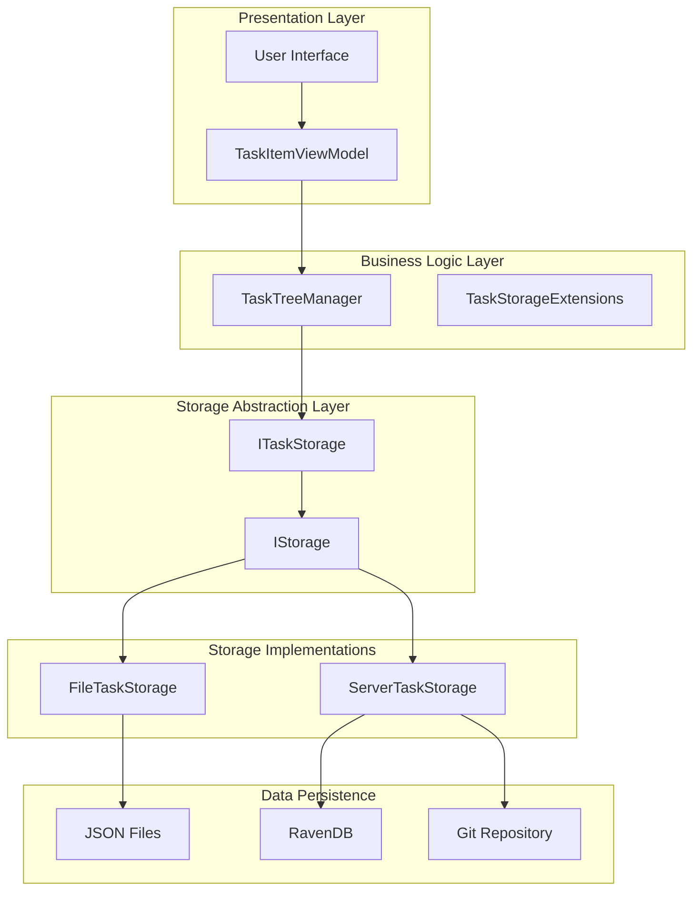
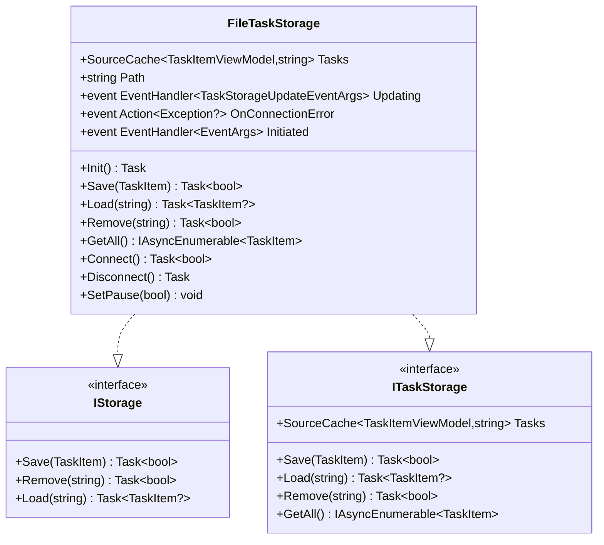
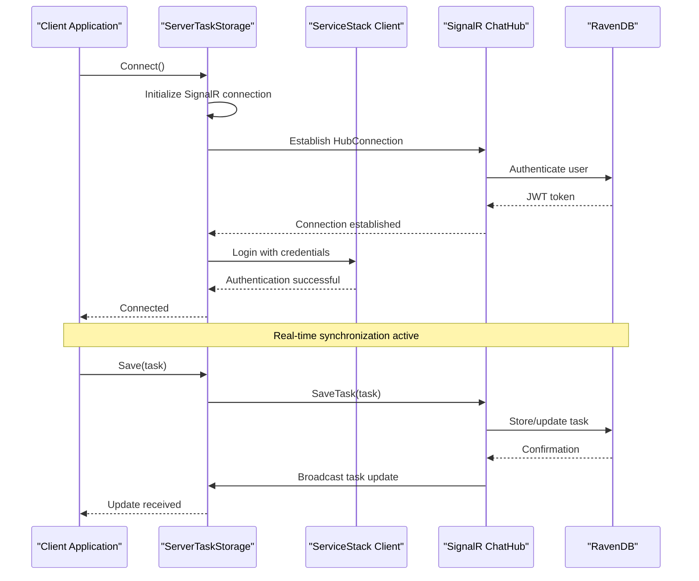
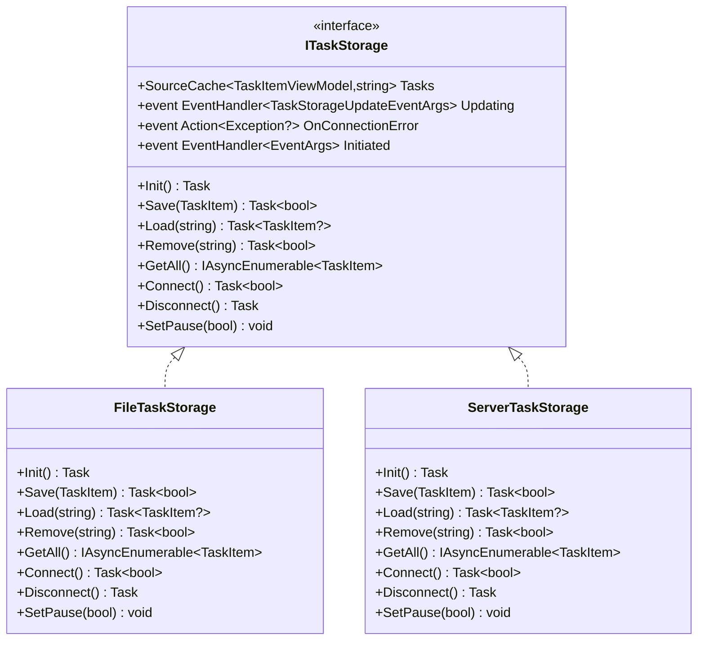
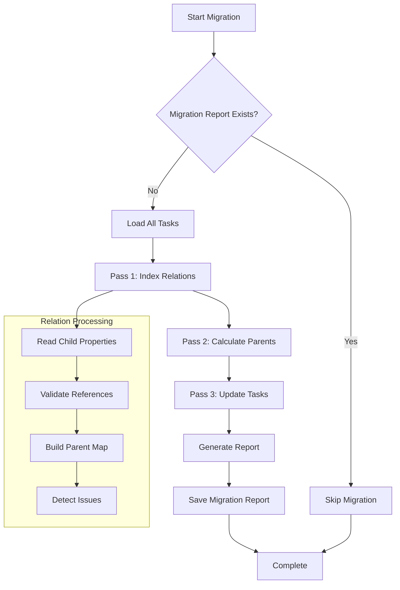
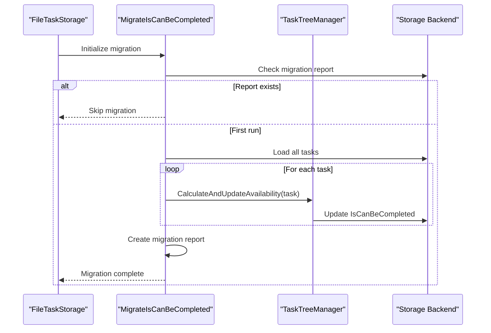
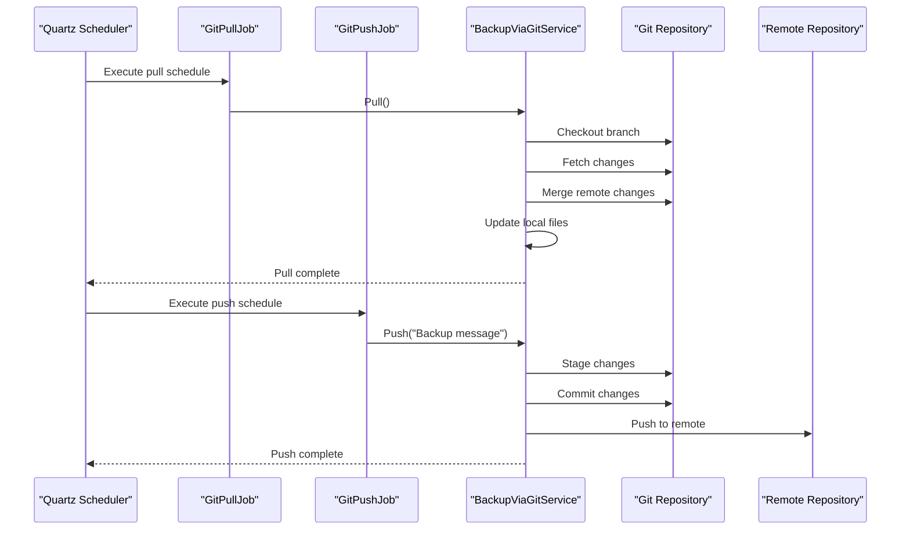
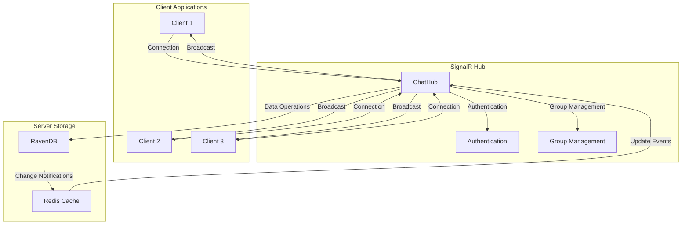
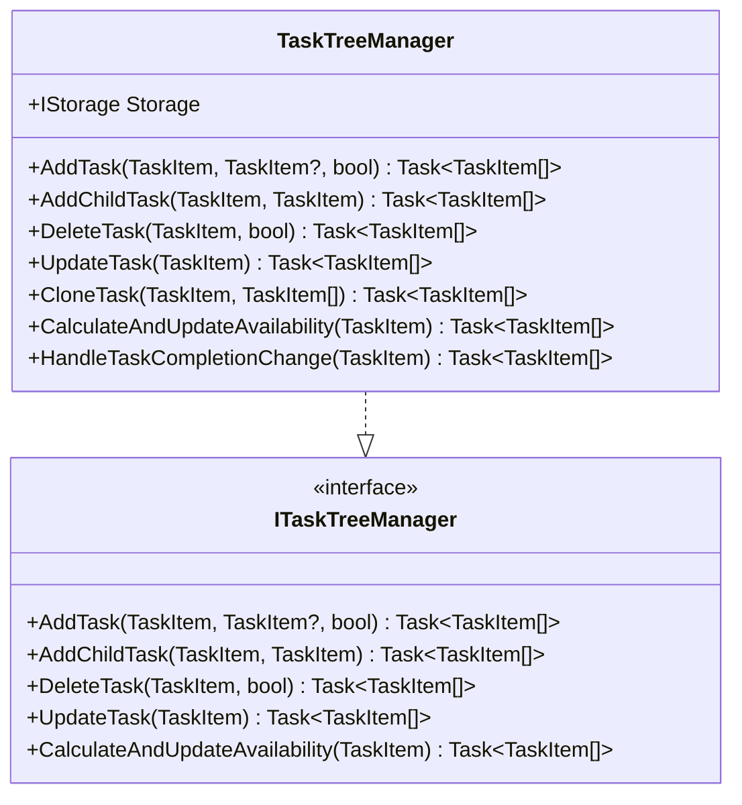
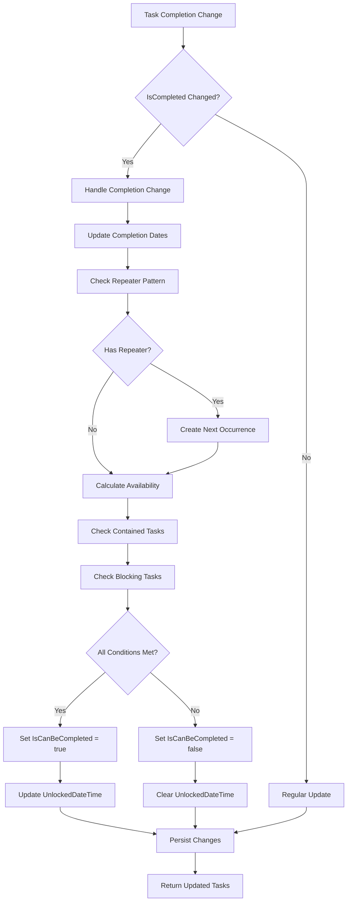

# Data Management

<cite>
**Referenced Files in This Document**
- [FileTaskStorage.cs](file://src/Unlimotion/FileTaskStorage.cs)
- [ServerTaskStorage.cs](file://src/Unlimotion/ServerTaskStorage.cs)
- [IStorage.cs](file://src/Unlimotion.TaskTreeManager/IStorage.cs)
- [ITaskTreeManager.cs](file://src/Unlimotion.TaskTreeManager/ITaskTreeManager.cs)
- [TaskTreeManager.cs](file://src/Unlimotion.TaskTreeManager/TaskTreeManager.cs)
- [FileTaskMigrator.cs](file://src/Unlimotion/FileTaskMigrator.cs)
- [TaskStorageExtensions.cs](file://src/Unlimotion/TaskStorageExtensions.cs)
- [ChatHub.cs](file://src/Unlimotion.Server/hubs/ChatHub.cs)
- [IChatHub.cs](file://src/Unlimotion.Interface/IChatHub.cs)
- [GitPullJob.cs](file://src/Unlimotion/Scheduling/Jobs/GitPullJob.cs)
- [GitPushJob.cs](file://src/Unlimotion/Scheduling/Jobs/GitPushJob.cs)
- [BackupViaGitService.cs](file://src/Unlimotion\Services\BackupViaGitService.cs)
- [TaskItem.cs](file://src/Unlimotion.Domain/TaskItem.cs)
</cite>

## Table of Contents
1. [Introduction](#introduction)
2. [Storage Architecture Overview](#storage-architecture-overview)
3. [Local JSON Storage Implementation](#local-json-storage-implementation)
4. [Server-Based RavenDB Storage](#server-based-ravendb-storage)
5. [Storage Abstraction Layer](#storage-abstraction-layer)
6. [Data Migration System](#data-migration-system)
7. [Git Integration for Backup](#git-integration-for-backup)
8. [Real-Time Synchronization](#real-time-synchronization)
9. [TaskTreeManager Coordination](#tasktreemanager-coordination)
10. [Performance Considerations](#performance-considerations)
11. [Troubleshooting Guide](#troubleshooting-guide)
12. [Conclusion](#conclusion)

## Introduction

Unlimotion implements a sophisticated data management system that provides flexible storage options while maintaining data consistency and enabling real-time synchronization. The system supports both local JSON file storage for offline use and server-based RavenDB storage with SignalR-powered real-time collaboration. This dual-mode architecture allows users to work seamlessly across different environments while ensuring data integrity and availability.

The data management system is built around several key components: the storage abstraction layer that enables switching between local and server modes, the migration system that handles legacy data conversion, Git integration for automated backups, and real-time synchronization through SignalR. Together, these components provide a robust foundation for task management data persistence and synchronization.

## Storage Architecture Overview

The Unlimotion data management system employs a layered architecture that separates concerns between data storage, business logic, and presentation layers. This design enables flexibility in storage backend selection while maintaining consistent data access patterns.

**Diagram sources**
- [FileTaskStorage.cs](file://src/Unlimotion/FileTaskStorage.cs#L25-L35)
- [ServerTaskStorage.cs](file://src/Unlimotion/ServerTaskStorage.cs#L25-L35)
- [IStorage.cs](file://src/Unlimotion.TaskTreeManager/IStorage.cs#L5-L10)

The architecture follows the Repository pattern with clear separation between the storage interface and its implementations. The TaskTreeManager acts as the business logic coordinator, while the storage implementations handle the specifics of data persistence and retrieval.

**Section sources**
- [FileTaskStorage.cs](file://src/Unlimotion/FileTaskStorage.cs#L25-L35)
- [ServerTaskStorage.cs](file://src/Unlimotion/ServerTaskStorage.cs#L25-L35)
- [IStorage.cs](file://src/Unlimotion.TaskTreeManager/IStorage.cs#L5-L10)

## Local JSON Storage Implementation

The FileTaskStorage class provides local file-based storage using JSON format, offering offline functionality and fast local access. It implements the ITaskStorage and IStorage interfaces to provide a unified storage API.

### Core Storage Operations

The FileTaskStorage implements essential CRUD operations with transactional consistency guarantees:

**Diagram sources**
- [FileTaskStorage.cs](file://src/Unlimotion/FileTaskStorage.cs#L25-L35)
- [IStorage.cs](file://src/Unlimotion.TaskTreeManager/IStorage.cs#L5-L10)

### File System Interaction

The storage system interacts with the file system through carefully designed methods that ensure data integrity and handle concurrent access scenarios:

| Method | Purpose | File System Operations | Error Handling |
|--------|---------|----------------------|----------------|
| `Save` | Persist task to JSON file | Create file, serialize JSON, atomic write | Exception wrapping, return false on failure |
| `Load` | Deserialize task from JSON | Read file, parse JSON, repair corrupted files | Return null on parsing errors |
| `Remove` | Delete task file | Delete file, remove from cache | Exception handling, return false on failure |
| `GetAll` | Enumerate all tasks | Directory enumeration, file filtering | Skip corrupted files, continue processing |

### Transactional Consistency

FileTaskStorage maintains transactional consistency through several mechanisms:

- **Atomic Write Operations**: JSON serialization and file writing occur within a single operation
- **Error Recovery**: Corrupted files are automatically deleted during enumeration
- **Cache Synchronization**: Memory cache is updated immediately after successful storage operations
- **Pause Mechanism**: Temporary pausing prevents concurrent modifications during bulk operations

**Section sources**
- [FileTaskStorage.cs](file://src/Unlimotion/FileTaskStorage.cs#L100-L200)
- [FileTaskStorage.cs](file://src/Unlimotion/FileTaskStorage.cs#L250-L350)

## Server-Based RavenDB Storage

The ServerTaskStorage class provides centralized storage using RavenDB with SignalR-based real-time synchronization. This implementation enables multi-user collaboration and data consistency across clients.

### RavenDB Integration

ServerTaskStorage integrates with RavenDB through a ServiceStack client and implements comprehensive authentication and connection management:

**Diagram sources**
- [ServerTaskStorage.cs](file://src/Unlimotion/ServerTaskStorage.cs#L100-L200)
- [ChatHub.cs](file://src/Unlimotion.Server/hubs/ChatHub.cs#L100-L150)

### Authentication and Security

The server storage implementation includes robust authentication and security measures:

| Feature | Implementation | Security Benefit |
|---------|---------------|------------------|
| JWT Authentication | ServiceStack JWT provider | Secure token-based authentication |
| Token Refresh | Automatic refresh mechanism | Seamless session continuation |
| SSL/TLS Support | Certificate validation callback | Encrypted communication |
| User Isolation | Per-user task filtering | Data privacy and security |
| Connection Pooling | HubConnection management | Efficient resource utilization |

### Connection Management

ServerTaskStorage implements sophisticated connection management with automatic reconnection and error handling:

- **Automatic Reconnection**: Failed connections trigger exponential backoff reconnection attempts
- **Graceful Degradation**: Offline mode with local caching when server unavailable
- **State Tracking**: Connection and authentication state monitoring
- **Resource Cleanup**: Proper disposal of SignalR connections and HTTP clients

**Section sources**
- [ServerTaskStorage.cs](file://src/Unlimotion/ServerTaskStorage.cs#L150-L300)
- [ServerTaskStorage.cs](file://src/Unlimotion/ServerTaskStorage.cs#L400-L500)

## Storage Abstraction Layer

The ITaskStorage interface serves as the primary abstraction that enables switching between local and server storage modes without changing business logic. This design follows the Repository pattern and provides a consistent API across different storage backends.

### Interface Definition

The ITaskStorage interface defines the core operations required for task management:

**Diagram sources**
- [FileTaskStorage.cs](file://src/Unlimotion/FileTaskStorage.cs#L25-L35)
- [ServerTaskStorage.cs](file://src/Unlimotion/ServerTaskStorage.cs#L25-L35)

### Implementation Differences

Each storage implementation handles specific requirements while maintaining interface compatibility:

| Operation | FileTaskStorage | ServerTaskStorage |
|-----------|----------------|-------------------|
| Initialization | Load all JSON files, migrate data | Connect to RavenDB, establish SignalR |
| Persistence | Atomic JSON write to file | Database transaction with conflict resolution |
| Retrieval | Deserialize from JSON file | Query RavenDB with caching |
| Removal | Delete file and cache | Soft delete with tombstone creation |
| Concurrency | File locking, pause mechanism | Optimistic concurrency control |
| Error Handling | File system exceptions | Network and database exceptions |

**Section sources**
- [FileTaskStorage.cs](file://src/Unlimotion/FileTaskStorage.cs#L25-L50)
- [ServerTaskStorage.cs](file://src/Unlimotion/ServerTaskStorage.cs#L25-L50)

## Data Migration System

The FileTaskMigrator class handles the conversion of legacy data formats and ensures backward compatibility when upgrading the application. The migration system is designed to be idempotent and safe for production use.

### Migration Architecture

The migration system processes task relationships and updates data structures while maintaining referential integrity:

**Diagram sources**
- [FileTaskMigrator.cs](file://src/Unlimotion/FileTaskMigrator.cs#L40-L80)

### Legacy Relationship Conversion

The migration system specifically targets the conversion of legacy relationship formats:

| Legacy Format | New Format | Migration Logic |
|---------------|------------|-----------------|
| Direct ID lists | Strongly-typed collections | Property mapping with validation |
| Self-references | Filtered collections | Remove self-links automatically |
| Orphaned references | Cleaned collections | Log and remove dangling references |
| Mixed formats | Unified format | Normalize all relationship types |

### Availability State Migration

The FileTaskStorage.Init method includes specialized migration logic for the IsCanBeCompleted field:

**Diagram sources**
- [FileTaskStorage.cs](file://src/Unlimotion/FileTaskStorage.cs#L80-L120)

### Migration Safety Features

The migration system includes several safety mechanisms:

- **Idempotent Operations**: Multiple runs produce consistent results
- **Issue Logging**: All problems are logged for manual review
- **Partial Recovery**: Migration continues despite individual task failures
- **Report Generation**: Comprehensive audit trail of all changes
- **Rollback Prevention**: Once migrated, data remains in new format

**Section sources**
- [FileTaskMigrator.cs](file://src/Unlimotion/FileTaskMigrator.cs#L40-L150)
- [FileTaskStorage.cs](file://src/Unlimotion/FileTaskStorage.cs#L80-L120)

## Git Integration for Backup

The Git integration provides automated backup and synchronization capabilities through the BackupViaGitService class. This system enables version control of task data and facilitates disaster recovery scenarios.

### Backup Workflow

The Git backup system operates through scheduled jobs that handle pull and push operations:

**Diagram sources**
- [GitPullJob.cs](file://src/Unlimotion/Scheduling/Jobs/GitPullJob.cs#L10-L20)
- [GitPushJob.cs](file://src/Unlimotion/Scheduling/Jobs/GitPushJob.cs#L10-L20)
- [BackupViaGitService.cs](file://src/Unlimotion\Services\BackupViaGitService.cs#L100-L200)

### Conflict Resolution

The Git backup system implements sophisticated conflict resolution strategies:

| Conflict Type | Resolution Strategy | Implementation |
|---------------|-------------------|----------------|
| File Addition | Automatic merge | Add new files to repository |
| File Modification | Three-way merge | Compare local, base, and remote versions |
| File Deletion | Preserve local changes | Keep deleted files locally |
| Binary Conflicts | Manual intervention | Flag conflicts for user resolution |
| Structural Conflicts | Recursive merge | Handle nested task relationships |

### Backup Configuration

The Git backup system supports extensive configuration options:

- **Repository Management**: Automatic cloning and updating of remote repositories
- **Authentication**: Username/password and SSH key support
- **Branch Management**: Configurable branch and refspec settings
- **Timing Control**: Adjustable pull/push schedules
- **Conflict Handling**: Configurable merge strategies and conflict resolution

**Section sources**
- [BackupViaGitService.cs](file://src/Unlimotion\Services\BackupViaGitService.cs#L50-L150)
- [GitPullJob.cs](file://src/Unlimotion/Scheduling/Jobs/GitPullJob.cs#L10-L20)
- [GitPushJob.cs](file://src/Unlimotion/Scheduling/Jobs/GitPushJob.cs#L10-L20)

## Real-Time Synchronization

Real-time synchronization is achieved through SignalR integration with the ChatHub class, enabling immediate updates across all connected clients. This system provides seamless multi-user collaboration with conflict-free updates.

### SignalR Architecture

The SignalR implementation provides bidirectional communication between clients and server:

**Diagram sources**
- [ChatHub.cs](file://src/Unlimotion.Server/hubs/ChatHub.cs#L20-L50)
- [IChatHub.cs](file://src/Unlimotion.Interface/IChatHub.cs#L8-L14)

### Synchronization Events

The ChatHub handles various types of synchronization events:

| Event Type | Trigger | Broadcast Target | Data Sent |
|------------|---------|------------------|-----------|
| Task Creation | SaveTask | Other users in same group | Full task object |
| Task Update | SaveTask | Other users in same group | Full task object |
| Task Deletion | DeleteTasks | Other users in same group | Task ID only |
| User Login | Login | All logged-in users | User status |
| User Logout | Disconnected | All logged-in users | User ID |

### Conflict Resolution

The real-time synchronization system implements several conflict resolution strategies:

- **Optimistic Concurrency**: Last-writer-wins for non-conflicting changes
- **Version Checking**: Task version numbers prevent overwriting stale data
- **Event Ordering**: Operations are processed in chronological order
- **Graceful Degradation**: Offline changes are queued until connection restored

**Section sources**
- [ChatHub.cs](file://src/Unlimotion.Server/hubs/ChatHub.cs#L50-L150)
- [ChatHub.cs](file://src/Unlimotion.Server/hubs/ChatHub.cs#L200-L238)

## TaskTreeManager Coordination

The TaskTreeManager class serves as the central coordinator for task relationships and availability calculations, working closely with storage implementations to maintain data consistency and business rule enforcement.

### Relationship Management

TaskTreeManager handles complex task relationships and ensures data integrity:

**Diagram sources**
- [TaskTreeManager.cs](file://src/Unlimotion.TaskTreeManager\TaskTreeManager.cs#L15-L45)
- [ITaskTreeManager.cs](file://src/Unlimotion.TaskTreeManager\ITaskTreeManager.cs#L8-L42)

### Availability Calculation

The availability calculation system determines when tasks can be marked as completed based on business rules:

**Diagram sources**
- [TaskTreeManager.cs](file://src/Unlimotion.TaskTreeManager\TaskTreeManager.cs#L200-L300)

### Transactional Operations

TaskTreeManager ensures transactional consistency across multiple storage operations:

- **Batch Operations**: Related changes are grouped into single transactions
- **Rollback Capability**: Failed operations can be rolled back
- **Consistency Guarantees**: All operations maintain referential integrity
- **Error Handling**: Comprehensive error handling with retry logic

**Section sources**
- [TaskTreeManager.cs](file://src/Unlimotion.TaskTreeManager\TaskTreeManager.cs#L200-L400)
- [TaskTreeManager.cs](file://src/Unlimotion.TaskTreeManager\TaskTreeManager.cs#L700-L800)

## Performance Considerations

The Unlimotion data management system incorporates several performance optimization strategies to ensure responsive operation under various load conditions.

### Caching Strategies

Both storage implementations employ sophisticated caching mechanisms:

| Cache Level | Implementation | Benefits | Trade-offs |
|-------------|---------------|----------|------------|
| Memory Cache | SourceCache for tasks | Fast local access | Memory usage |
| File Watcher | IDatabaseWatcher | Immediate file updates | CPU overhead |
| SignalR Cache | Connection groups | Reduced network traffic | Connection state |
| RavenDB Cache | Document caching | Reduced database load | Cache invalidation |

### Asynchronous Operations

The system extensively uses asynchronous patterns to maintain responsiveness:

- **Non-blocking I/O**: All file and network operations are asynchronous
- **Parallel Processing**: Multiple operations can execute concurrently
- **Cancellation Support**: Long-running operations can be cancelled
- **Progress Reporting**: Operations provide progress feedback

### Optimization Techniques

Several optimization techniques improve system performance:

- **Lazy Loading**: Tasks are loaded only when accessed
- **Batch Operations**: Multiple changes are grouped together
- **Connection Pooling**: Database and HTTP connections are reused
- **Compression**: Large data transfers use compression
- **Indexing**: Database queries use appropriate indexes

## Troubleshooting Guide

Common issues and their solutions in the Unlimotion data management system.

### Storage Issues

| Problem | Symptoms | Solution |
|---------|----------|----------|
| File Locking | Save operations fail | Restart application, check antivirus |
| Permission Errors | Access denied exceptions | Verify file permissions, run as administrator |
| Disk Space | Out of disk space errors | Free up disk space, clean temporary files |
| Corrupted Files | JSON parsing errors | Restore from Git backup, check file integrity |

### Network Issues

| Problem | Symptoms | Solution |
|---------|----------|----------|
| Connection Failures | ServerTaskStorage disconnects | Check network connectivity, verify server status |
| Authentication Errors | JWT token failures | Refresh credentials, check token validity |
| Timeout Errors | Slow response times | Increase timeout values, optimize queries |
| SSL/TLS Issues | Certificate validation failures | Update certificates, configure trust settings |

### Synchronization Issues

| Problem | Symptoms | Solution |
|---------|----------|----------|
| Stale Data | Outdated task information | Force refresh, check SignalR connection |
| Conflict Resolution | Merge conflicts | Review conflict markers, resolve manually |
| Offline Mode | No server connectivity | Switch to local mode, sync later |
| Group Membership | Wrong user notifications | Check group assignments, reconnect |

### Migration Issues

| Problem | Symptoms | Solution |
|---------|----------|----------|
| Migration Failures | Incomplete data conversion | Check logs, rerun migration with debug |
| Version Conflicts | Unsupported data formats | Update to latest version, backup data |
| Performance Issues | Slow migration process | Optimize disk I/O, increase memory |
| Data Loss | Missing task relationships | Restore from backup, rebuild relationships |

**Section sources**
- [FileTaskStorage.cs](file://src/Unlimotion\FileTaskStorage.cs#L100-L200)
- [ServerTaskStorage.cs](file://src\Unlimotion\ServerTaskStorage.cs#L150-L250)

## Conclusion

The Unlimotion data management system represents a sophisticated approach to task data persistence and synchronization. Through its layered architecture, the system successfully balances flexibility, performance, and reliability while supporting both local and server-based storage modes.

Key strengths of the system include:

- **Flexible Storage Options**: Seamless switching between local and server storage
- **Robust Migration System**: Safe data conversion with backward compatibility
- **Real-time Synchronization**: Instant updates across all connected clients
- **Git Integration**: Automated backup and version control
- **Transaction Safety**: Consistent operations with rollback capability
- **Performance Optimization**: Caching and asynchronous operations

The system's design demonstrates excellent separation of concerns, with clear boundaries between presentation, business logic, and data persistence layers. The TaskTreeManager serves as a central coordinator for complex business rules, while the storage implementations handle the specifics of their respective backends.

Future enhancements could include distributed caching for improved performance, enhanced conflict resolution for complex scenarios, and additional storage backends for specialized use cases. The modular architecture ensures that such improvements can be implemented without disrupting existing functionality.