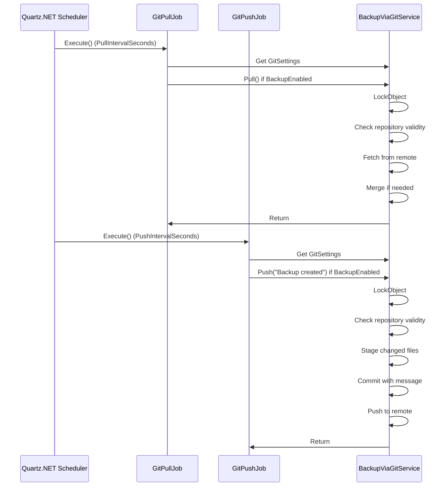
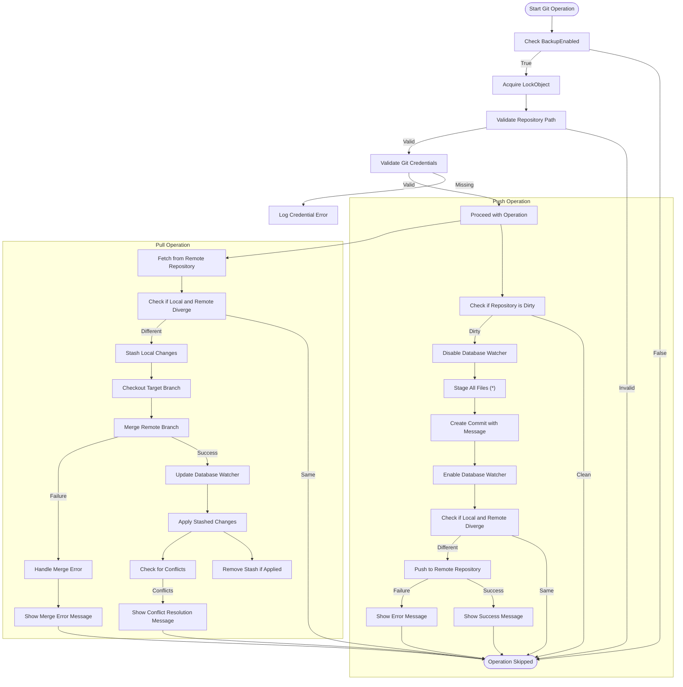
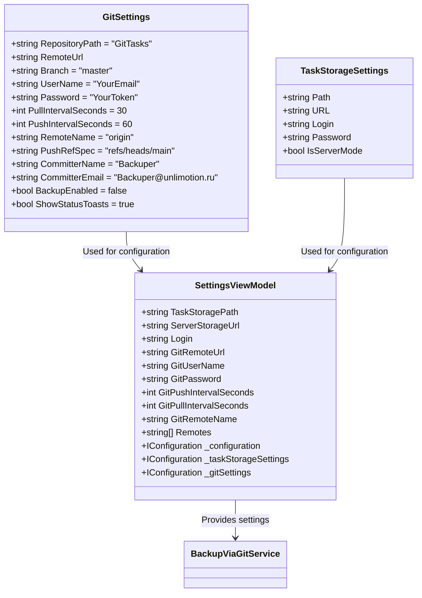
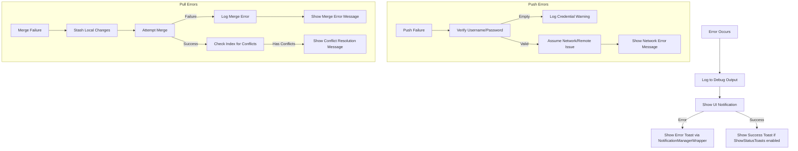

# Data Synchronization

<cite>
**Referenced Files in This Document**   
- [GitPullJob.cs](file://src/Unlimotion/Scheduling/Jobs/GitPullJob.cs)
- [GitPushJob.cs](file://src/Unlimotion/Scheduling/Jobs/GitPushJob.cs)
- [BackupViaGitService.cs](file://src/Unlimotion/Services/BackupViaGitService.cs)
- [GitSettings.cs](file://src/Unlimotion.TelegramBot/GitSettings.cs)
- [IRemoteBackupService.cs](file://src/Unlimotion/ViewModel/IRemoteBackupService.cs)
- [App.axaml.cs](file://src/Unlimotion/App.axaml.cs)
- [SettingsViewModel.cs](file://src/Unlimotion/ViewModel/SettingsViewModel.cs)
- [FileTaskStorage.cs](file://src/Unlimotion/FileTaskStorage.cs)
</cite>

## Table of Contents
1. [Introduction](#introduction)
2. [Architecture Overview](#architecture-overview)
3. [Core Components](#core-components)
4. [Scheduling Mechanism](#scheduling-mechanism)
5. [Git Operations Implementation](#git-operations-implementation)
6. [Configuration and Settings](#configuration-and-settings)
7. [Error Handling and Conflict Resolution](#error-handling-and-conflict-resolution)
8. [Performance Considerations](#performance-considerations)

## Introduction
Unlimotion implements a Git-based data synchronization and backup system that enables cross-device task data synchronization without requiring a central server. The system uses Quartz.NET scheduled jobs to automatically synchronize task data with a remote Git repository at configurable intervals. This document details the implementation of the Git synchronization system, including the orchestration of pull and push operations, configuration options, error handling strategies, and performance considerations for large task databases.

## Architecture Overview
The Git-based synchronization system in Unlimotion follows a service-oriented architecture with clear separation of concerns between scheduling, service implementation, and configuration management. The system leverages LibGit2Sharp for Git operations and Quartz.NET for job scheduling, providing a robust mechanism for automatic data synchronization.

```mermaid
graph TB
subgraph "Scheduling Layer"
GitPullJob[GitPullJob]
GitPushJob[GitPushJob]
Quartz[Quartz.NET Scheduler]
end
subgraph "Service Layer"
BackupViaGitService[BackupViaGitService]
IRemoteBackupService[IRemoteBackupService]
end
subgraph "Configuration Layer"
GitSettings[GitSettings]
AppSettings[Application Settings]
end
subgraph "Data Layer"
FileTaskStorage[FileTaskStorage]
TaskData[Task JSON Files]
end
GitPullJob --> BackupViaGitService : Pull()
GitPushJob --> BackupViaGitService : Push()
BackupViaGitService --> LibGit2Sharp[LibGit2Sharp]
BackupViaGitService --> FileTaskStorage : Monitor Changes
GitSettings --> BackupViaGitService : Configuration
AppSettings --> GitSettings : Settings Management
FileTaskStorage --> TaskData : Read/Write JSON
style GitPullJob fill:#f9f,stroke:#333
style GitPushJob fill:#f9f,stroke:#333
style BackupViaGitService fill:#bbf,stroke:#333
style GitSettings fill:#ffcc00,stroke:#333
```

**Diagram sources**
- [GitPullJob.cs](file://src/Unlimotion/Scheduling/Jobs/GitPullJob.cs#L1-L20)
- [GitPushJob.cs](file://src/Unlimotion/Scheduling/Jobs/GitPushJob.cs#L1-L21)
- [BackupViaGitService.cs](file://src/Unlimotion/Services/BackupViaGitService.cs#L1-L357)
- [GitSettings.cs](file://src/Unlimotion.TelegramBot/GitSettings.cs#L2-L18)

**Section sources**
- [GitPullJob.cs](file://src/Unlimotion/Scheduling/Jobs/GitPullJob.cs#L1-L20)
- [GitPushJob.cs](file://src/Unlimotion/Scheduling/Jobs/GitPushJob.cs#L1-L21)
- [BackupViaGitService.cs](file://src/Unlimotion/Services/BackupViaGitService.cs#L1-L357)

## Core Components
The Git synchronization system consists of several key components that work together to provide reliable data backup and synchronization. The BackupViaGitService orchestrates all Git operations, while Quartz.NET jobs handle the scheduling of pull and push operations at configurable intervals. The system is designed to maintain data integrity during synchronization and handle various error conditions gracefully.

**Section sources**
- [BackupViaGitService.cs](file://src/Unlimotion/Services/BackupViaGitService.cs#L1-L357)
- [IRemoteBackupService.cs](file://src/Unlimotion/ViewModel/IRemoteBackupService.cs#L4-L11)

## Scheduling Mechanism
The synchronization system uses Quartz.NET to schedule periodic Git operations. Two separate jobs, GitPullJob and GitPushJob, are responsible for pulling updates from the remote repository and pushing local changes respectively. The jobs check if Git backup is enabled before executing any operations, ensuring that synchronization only occurs when properly configured.



**Diagram sources**
- [GitPullJob.cs](file://src/Unlimotion/Scheduling/Jobs/GitPullJob.cs#L1-L20)
- [GitPushJob.cs](file://src/Unlimotion/Scheduling/Jobs/GitPushJob.cs#L1-L21)
- [BackupViaGitService.cs](file://src/Unlimotion/Services/BackupViaGitService.cs#L1-L357)

**Section sources**
- [GitPullJob.cs](file://src/Unlimotion/Scheduling/Jobs/GitPullJob.cs#L1-L20)
- [GitPushJob.cs](file://src/Unlimotion/Scheduling/Jobs/GitPushJob.cs#L1-L21)

## Git Operations Implementation
The BackupViaGitService class implements the core Git operations for the synchronization system. It provides methods for pushing local changes, pulling updates from the remote repository, and cloning or updating the repository when needed. The service uses LibGit2Sharp to interact with Git repositories and handles authentication for private repositories using username and password credentials.



**Diagram sources**
- [BackupViaGitService.cs](file://src/Unlimotion/Services/BackupViaGitService.cs#L1-L357)

**Section sources**
- [BackupViaGitService.cs](file://src/Unlimotion/Services/BackupViaGitService.cs#L1-L357)

## Configuration and Settings
The Git synchronization system is highly configurable through the GitSettings class, which provides various options for customizing the backup behavior. Users can configure the repository path, remote URL, branch names, authentication credentials, and interval settings through the application's settings interface.



**Diagram sources**
- [GitSettings.cs](file://src/Unlimotion.TelegramBot/GitSettings.cs#L2-L18)
- [TaskStorageSettings.cs](file://src/Unlimotion/ViewModel/TaskStorageSettings.cs#L2-L14)
- [SettingsViewModel.cs](file://src/Unlimotion/ViewModel/SettingsViewModel.cs#L0-L114)

**Section sources**
- [GitSettings.cs](file://src/Unlimotion.TelegramBot/GitSettings.cs#L2-L18)
- [SettingsViewModel.cs](file://src/Unlimotion/ViewModel/SettingsViewModel.cs#L0-L114)

## Error Handling and Conflict Resolution
The synchronization system implements comprehensive error handling and conflict resolution strategies to ensure data integrity during Git operations. The system uses locking mechanisms to prevent race conditions, handles merge conflicts gracefully, and provides appropriate feedback to users through the notification system.

When merge conflicts occur, the system follows a specific strategy:
1. Stash local changes before attempting to merge
2. Perform the merge operation
3. Apply stashed changes after merge
4. Check for conflicts in the index
5. Notify the user if conflicts need to be resolved manually

The system also handles various error conditions such as network failures, authentication issues, and repository corruption, providing detailed error messages to help users diagnose and resolve issues.



**Diagram sources**
- [BackupViaGitService.cs](file://src/Unlimotion/Services/BackupViaGitService.cs#L327-L338)
- [BackupViaGitService.cs](file://src/Unlimotion/Services/BackupViaGitService.cs#L333-L338)

**Section sources**
- [BackupViaGitService.cs](file://src/Unlimotion/Services/BackupViaGitService.cs#L327-L338)

## Performance Considerations
The Git synchronization system is designed with performance considerations for both large task databases and unreliable network conditions. The system uses several strategies to optimize performance and ensure reliable operation:

1. **Database watcher integration**: The system temporarily disables the database watcher during Git operations to prevent conflicts between file system monitoring and Git operations.

2. **File-level synchronization**: Instead of synchronizing the entire database, the system tracks individual JSON files, allowing for efficient incremental updates.

3. **Configurable intervals**: Users can configure the pull and push intervals based on their network conditions and synchronization needs.

4. **Locking mechanism**: A static lock object prevents concurrent Git operations, ensuring data consistency.

5. **Selective status notifications**: Users can disable status toasts to reduce UI interruptions during frequent synchronization.

For large task databases, the system may experience longer synchronization times due to the need to process multiple JSON files. In such cases, users are advised to increase the push interval to reduce the frequency of potentially lengthy operations.

**Section sources**
- [BackupViaGitService.cs](file://src/Unlimotion/Services/BackupViaGitService.cs#L1-L357)
- [FileTaskStorage.cs](file://src/Unlimotion/FileTaskStorage.cs#L0-L199)