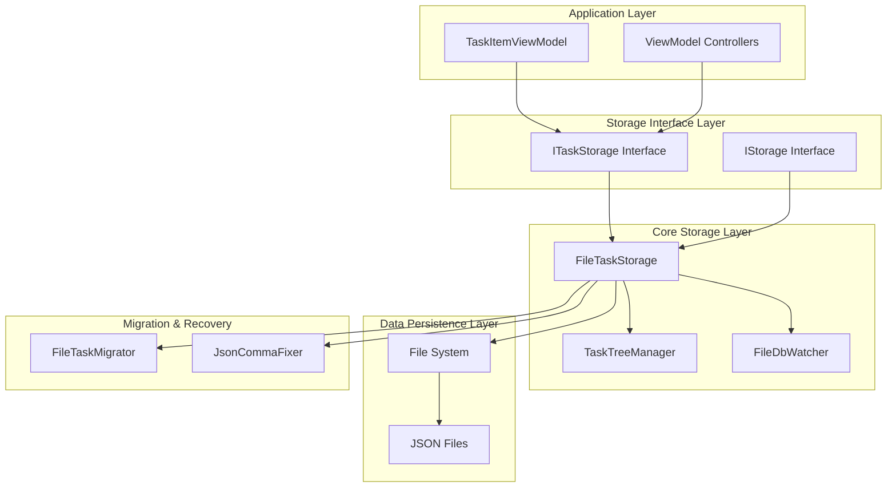
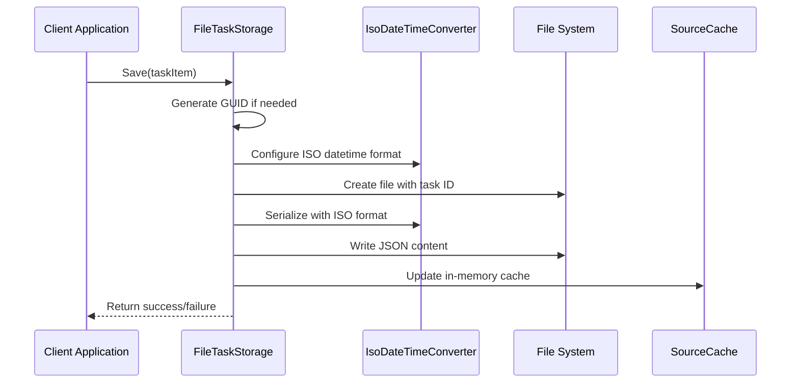
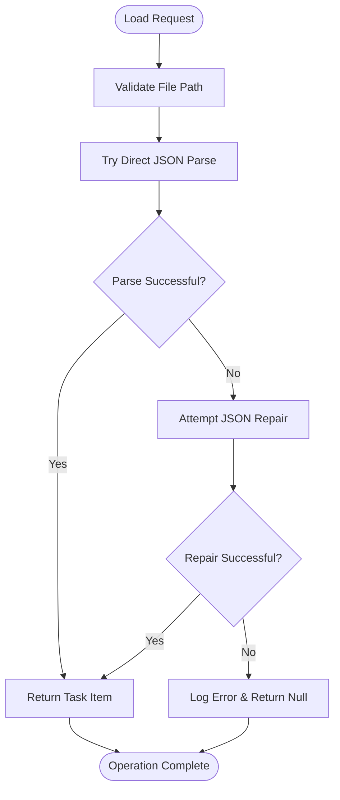
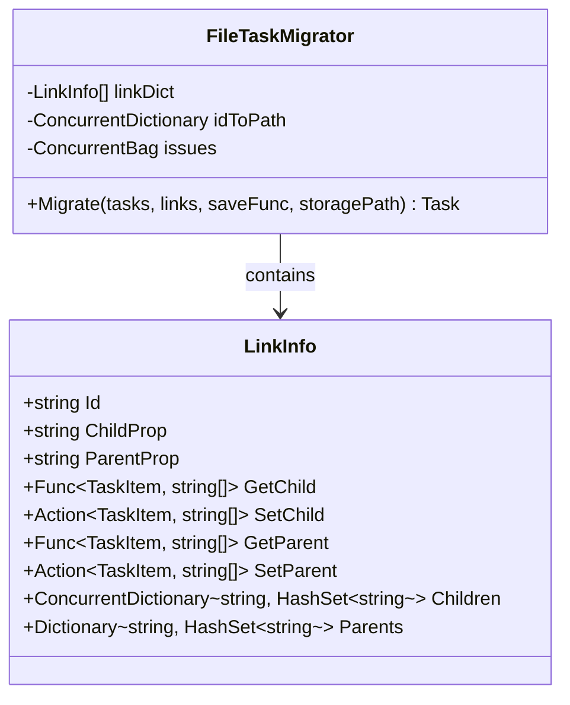
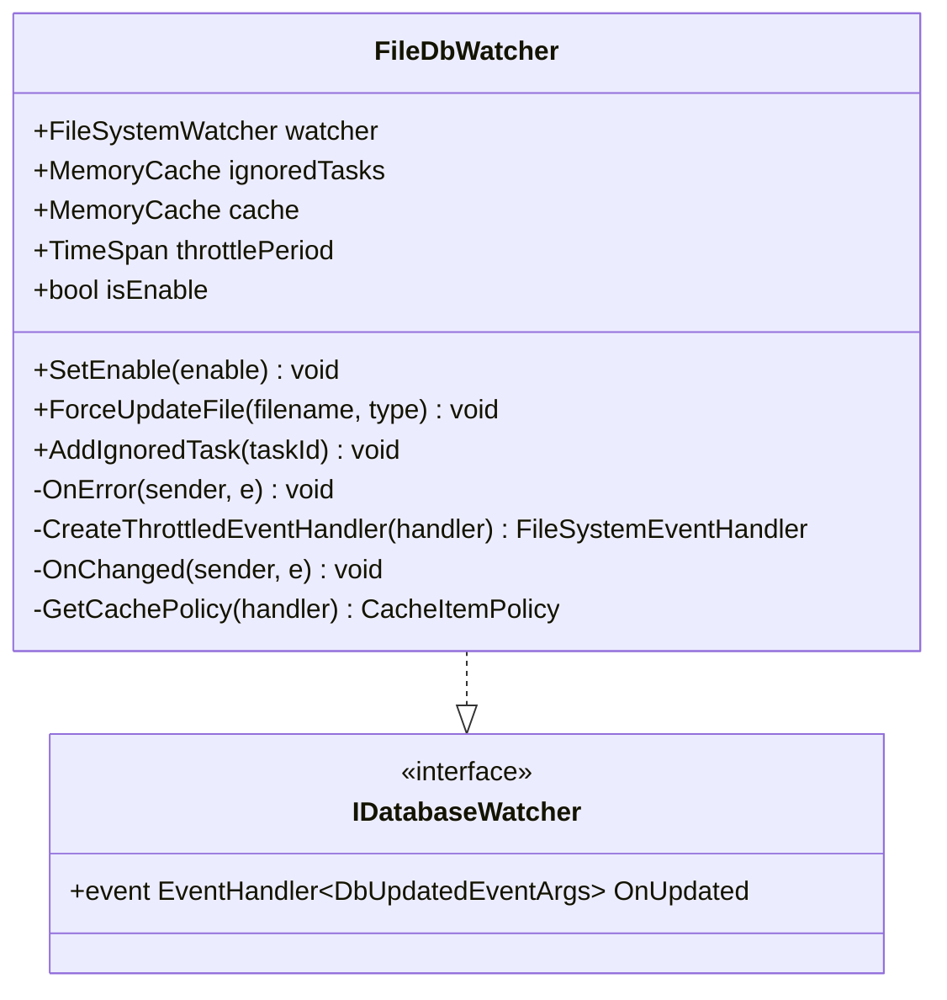
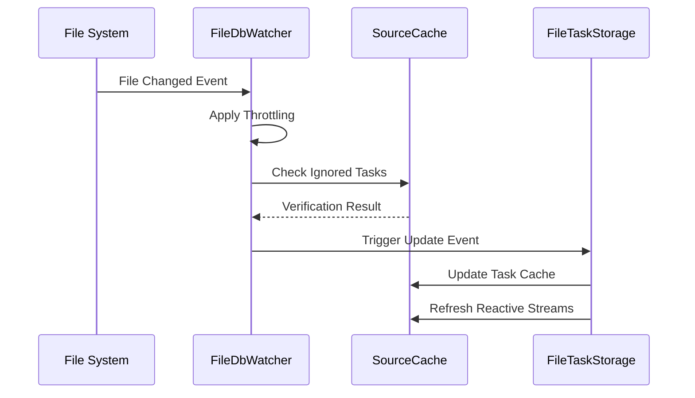
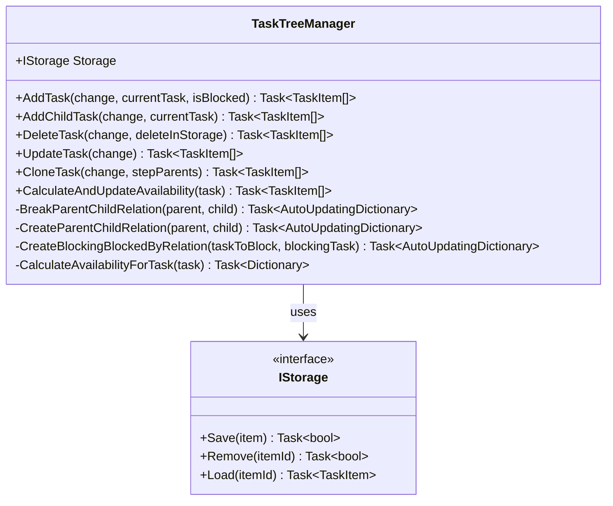
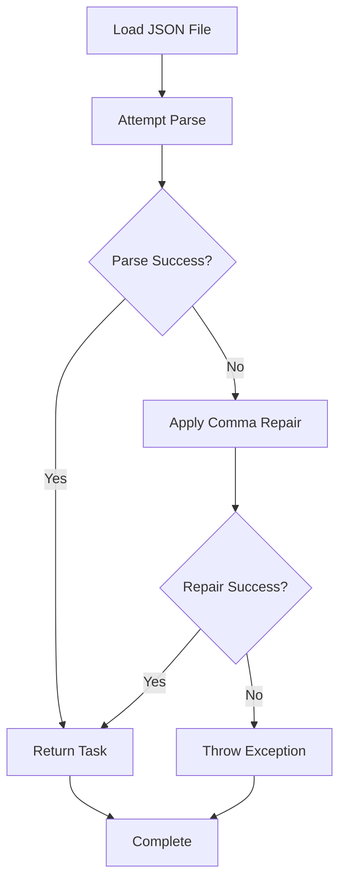
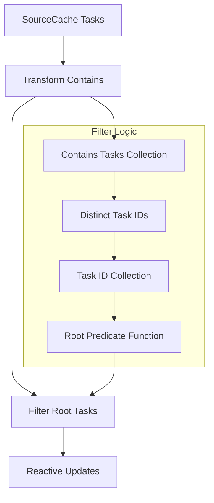

# Local Storage

<cite>
**Referenced Files in This Document**
- [FileTaskStorage.cs](file://src/Unlimotion/FileTaskStorage.cs)
- [FileTaskMigrator.cs](file://src/Unlimotion/FileTaskMigrator.cs)
- [FileDbWatcher.cs](file://src/Unlimotion.ViewModel/FileDbWatcher.cs)
- [TaskTreeManager.cs](file://src/Unlimotion.TaskTreeManager/TaskTreeManager.cs)
- [IStorage.cs](file://src/Unlimotion.TaskTreeManager/IStorage.cs)
- [ITaskStorage.cs](file://src/Unlimotion.ViewModel/ITaskStorage.cs)
- [TaskStorageExtensions.cs](file://src/Unlimotion/TaskStorageExtensions.cs)
- [JsonCommaFixer.cs](file://src/Unlimotion/JsonCommaFixer.cs)
- [TaskMigratorTests.cs](file://src/Unlimotion.Test/TaskMigratorTests.cs)
</cite>

## Table of Contents
1. [Introduction](#introduction)
2. [System Architecture](#system-architecture)
3. [Core Components](#core-components)
4. [File-Based Storage Implementation](#file-based-storage-implementation)
5. [Data Migration System](#data-migration-system)
6. [File System Monitoring](#file-system-monitoring)
7. [Transactional Consistency](#transactional-consistency)
8. [JSON Serialization and Deserialization](#json-serialization-and-deserialization)
9. [Root Task Filtering](#root-task-filtering)
10. [Error Handling and Recovery](#error-handling-and-recovery)
11. [Performance Considerations](#performance-considerations)
12. [Integration Patterns](#integration-patterns)

## Introduction

Unlimotion's local storage system provides a robust, file-based solution for persisting task data using individual JSON files. The system is built around the `FileTaskStorage` class, which serves as the primary interface for task operations while maintaining data integrity through sophisticated migration, monitoring, and transactional mechanisms.

The storage system operates on a simple yet powerful principle: each task is stored as a separate JSON file named by its GUID identifier, located within a designated directory. This approach provides excellent reliability, human readability, and easy backup capabilities while maintaining efficient access patterns through reactive caching and file system monitoring.

## System Architecture

The local storage system follows a layered architecture with clear separation of concerns:

**Diagram sources**
- [FileTaskStorage.cs](file://src/Unlimotion/FileTaskStorage.cs#L18-L35)
- [TaskTreeManager.cs](file://src/Unlimotion.TaskTreeManager/TaskTreeManager.cs#L10-L15)
- [FileDbWatcher.cs](file://src/Unlimotion.ViewModel/FileDbWatcher.cs#L10-L25)

## Core Components

### FileTaskStorage Class

The `FileTaskStorage` class serves as the central orchestrator for all file-based operations. It implements both `ITaskStorage` and `IStorage` interfaces, providing a unified API for task management while maintaining internal consistency through the TaskTreeManager.

**Key Responsibilities:**
- File system operations (Save, Load, Remove)
- JSON serialization with IsoDateTimeConverter
- Reactive caching through SourceCache
- Integration with file system monitoring
- Data migration coordination
- Transactional consistency management

### TaskTreeManager Integration

The TaskTreeManager provides transactional consistency during complex operations involving parent-child relationships and blocking dependencies. It ensures atomic updates across related tasks while maintaining data integrity.

**Section sources**
- [FileTaskStorage.cs](file://src/Unlimotion/FileTaskStorage.cs#L18-L35)
- [TaskTreeManager.cs](file://src/Unlimotion.TaskTreeManager/TaskTreeManager.cs#L10-L15)

## File-Based Storage Implementation

### File Naming Convention

Each task is stored as an individual JSON file with the following naming convention:
- **Filename**: Task GUID (e.g., `a1b2c3d4-e5f6-7890-abcd-ef1234567890.json`)
- **Location**: Specified storage directory
- **Format**: UTF-8 encoded JSON with indentation for readability

### Save Operation

The Save operation implements a comprehensive workflow ensuring data integrity:

**Diagram sources**
- [FileTaskStorage.cs](file://src/Unlimotion/FileTaskStorage.cs#L195-L230)

**Implementation Details:**
- **GUID Generation**: Automatic GUID assignment for new tasks
- **ISO DateTime Format**: Consistent timestamp serialization using `yyyy-MM-ddTHH:mm:ss.fffzzz`
- **Atomic Writes**: File creation and JSON writing occur in sequence
- **Error Handling**: Graceful failure with exception propagation

### Load Operation

The Load operation employs robust error handling with automatic repair capabilities:

**Diagram sources**
- [FileTaskStorage.cs](file://src/Unlimotion/FileTaskStorage.cs#L250-L265)
- [JsonCommaFixer.cs](file://src/Unlimotion/JsonCommaFixer.cs#L15-L40)

### Remove Operation

The Remove operation ensures complete cleanup of both file system and memory state:

**Section sources**
- [FileTaskStorage.cs](file://src/Unlimotion/FileTaskStorage.cs#L232-L250)

## Data Migration System

### FileTaskMigrator

The FileTaskMigrator handles backward compatibility and data structure evolution through automated migration processes:

**Diagram sources**
- [FileTaskMigrator.cs](file://src/Unlimotion/FileTaskMigrator.cs#L12-L35)

### Migration Process

The migration system operates in three distinct passes:

1. **Indexing Pass**: Builds relationship mappings and validates references
2. **Parent Calculation Pass**: Computes parent relationships from child references
3. **Normalization Pass**: Updates task objects with normalized relationships

**Migration Features:**
- **Parallel Processing**: Uses `Parallel.ForEachAsync` for performance
- **Issue Tracking**: Comprehensive logging of problems encountered
- **Dry Run Support**: Validation mode without data modification
- **Version Control**: Prevents redundant migrations
- **Atomic Updates**: Ensures data consistency during migration

### Availability Migration

The `MigrateIsCanBeCompleted` method ensures backward compatibility by calculating initial availability states for legacy tasks:

**Migration Process:**
1. **Check Report Existence**: Prevents duplicate migration runs
2. **Collect All Tasks**: Enumerates all existing task files
3. **Calculate Availability**: Processes each task through TaskTreeManager
4. **Generate Report**: Creates detailed migration summary

**Section sources**
- [FileTaskMigrator.cs](file://src/Unlimotion/FileTaskMigrator.cs#L36-L194)
- [FileTaskStorage.cs](file://src/Unlimotion/FileTaskStorage.cs#L114-L142)

## File System Monitoring

### FileDbWatcher Implementation

The FileDbWatcher provides real-time file system change detection with intelligent throttling and filtering:

**Diagram sources**
- [FileDbWatcher.cs](file://src/Unlimotion.ViewModel/FileDbWatcher.cs#L10-L30)

### Change Detection Features

**Intelligent Throttling:**
- **Event Coalescing**: Groups rapid successive events
- **Sliding Expiration**: 60-second window for ignored tasks
- **Git Integration**: Automatically filters .git folders and lock files
- **Cache-Based Debouncing**: Prevents excessive notifications

**Change Types Supported:**
- **Created**: New task files
- **Changed**: Modified task files  
- **Deleted**: Removed task files

### Cache Synchronization

The FileDbWatcher maintains synchronization between file system changes and in-memory cache:

**Diagram sources**
- [FileDbWatcher.cs](file://src/Unlimotion.ViewModel/FileDbWatcher.cs#L80-L120)

**Section sources**
- [FileDbWatcher.cs](file://src/Unlimotion.ViewModel/FileDbWatcher.cs#L10-L152)

## Transactional Consistency

### TaskTreeManager Role

The TaskTreeManager ensures transactional consistency during complex task operations by managing relationships and availability calculations:

**Diagram sources**
- [TaskTreeManager.cs](file://src/Unlimotion.TaskTreeManager/TaskTreeManager.cs#L10-L25)
- [IStorage.cs](file://src/Unlimotion.TaskTreeManager/IStorage.cs#L5-L10)

### Relationship Management

**Parent-Child Relationships:**
- **ContainTasks**: Child-to-parent relationships
- **ParentTasks**: Parent-to-child relationships  
- **Automatic Synchronization**: Maintains bidirectional consistency
- **Recursive Updates**: Propagates changes through relationship trees

**Blocking Relationships:**
- **BlocksTasks**: Tasks that block this task
- **BlockedByTasks**: Tasks that this task blocks
- **Availability Calculations**: Determines task readiness state

### Availability Calculation

The system calculates task availability based on business rules:

**Availability Criteria:**
1. **Contained Tasks**: All child tasks must be completed (IsCompleted ≠ false)
2. **Blocking Tasks**: All blocking tasks must be completed (IsCompleted ≠ false)
3. **Mixed Dependencies**: All dependency types must satisfy their criteria

**State Management:**
- **UnlockedDateTime**: Timestamp when task becomes available
- **Automatic Updates**: Recalculates when dependencies change
- **Propagation**: Updates affected parent and blocking tasks

**Section sources**
- [TaskTreeManager.cs](file://src/Unlimotion.TaskTreeManager/TaskTreeManager.cs#L15-L837)

## JSON Serialization and Deserialization

### IsoDateTimeConverter Configuration

The system uses a specialized IsoDateTimeConverter for consistent timestamp serialization:

**Converter Configuration:**
- **Format**: `yyyy'-'MM'-'dd'T'HH':'mm':'ss'.'fffzzz`
- **Culture**: Invariant culture for cross-platform compatibility
- **Styles**: No special date/time styles
- **Precision**: Millisecond precision with timezone information

### JSON Repair Mechanism

The JsonCommaFixer provides automatic repair of malformed JSON files:

**Diagram sources**
- [JsonCommaFixer.cs](file://src/Unlimotion/JsonCommaFixer.cs#L15-L65)

**Repair Capabilities:**
- **Missing Commas**: Automatically inserts missing commas
- **Syntax Validation**: Detects and repairs common JSON errors
- **Sidecar Backup**: Optional backup of repaired files
- **Graceful Degradation**: Falls back to standard parsing when possible

**Section sources**
- [FileTaskStorage.cs](file://src/Unlimotion/FileTaskStorage.cs#L205-L215)
- [JsonCommaFixer.cs](file://src/Unlimotion/JsonCommaFixer.cs#L15-L65)

## Root Task Filtering

### Reactive Filtering System

The system implements sophisticated reactive filtering to identify root tasks (tasks with no parent relationships):

**Diagram sources**
- [TaskStorageExtensions.cs](file://src/Unlimotion/TaskStorageExtensions.cs#L10-L30)

### Filter Implementation

The root filtering system operates reactively, automatically updating when task relationships change:

**Filter Criteria:**
- **Empty Contains**: Tasks with no contained children
- **Distinct Collection**: Unique task ID collection from all contains lists
- **Predicate Function**: Lambda that checks if a task ID is not in the collection

**Reactive Updates:**
- **Auto Refresh**: Monitors Contains collections for changes
- **Transform Many**: Extracts all contained task IDs
- **Distinct Filtering**: Removes duplicates from the collection
- **Real-time Updates**: Immediate filter evaluation on changes

**Section sources**
- [TaskStorageExtensions.cs](file://src/Unlimotion/TaskStorageExtensions.cs#L10-L34)

## Error Handling and Recovery

### Multi-layered Error Handling

The system implements comprehensive error handling across all layers:

**File System Level:**
- **IOException**: File access permission issues
- **UnauthorizedAccessException**: Insufficient permissions
- **DirectoryNotFoundException**: Missing storage directory
- **PathTooLongException**: File path length limitations

**Serialization Level:**
- **JsonReaderException**: Malformed JSON structure
- **JsonSerializationException**: Serialization failures
- **ArgumentNullException**: Missing required parameters

**Network Level:**
- **TimeoutException**: Operation timeouts
- **AggregateException**: Multiple concurrent failures
- **OperationCanceledException**: Canceled operations

### Recovery Mechanisms

**Automatic Repair:**
- **JSON Corruption**: Automatic comma insertion and syntax correction
- **File Deletion**: Automatic cleanup of corrupted files
- **Migration Failures**: Rollback capability for failed migrations

**Graceful Degradation:**
- **Partial Loads**: Continue operation with available data
- **Circuit Breaker**: Prevent cascading failures
- **Fallback Strategies**: Alternative data sources when primary fails

### Logging and Diagnostics

**Event Logging:**
- **File Operations**: All CRUD operations logged
- **Migration Events**: Progress and completion logging
- **Error Events**: Detailed error information with stack traces
- **Performance Metrics**: Timing and throughput measurements

**Diagnostic Information:**
- **Migration Reports**: Detailed migration summaries
- **Issue Tracking**: Comprehensive problem reporting
- **Health Checks**: System status monitoring
- **Debug Output**: Development-time diagnostic information

## Performance Considerations

### Caching Strategy

The system employs multiple caching layers for optimal performance:

**Memory Cache:**
- **SourceCache**: Reactive caching of all tasks
- **TaskItemViewModel**: Cached view models with change tracking
- **Relationship Cache**: Pre-computed parent-child relationships
- **Availability Cache**: Cached availability calculations

**File System Cache:**
- **File Handles**: Reuse of file handles for frequent operations
- **Directory Enumeration**: Cached directory listings
- **Timestamp Optimization**: Minimal file system access

### Concurrency Management

**Thread Safety:**
- **Immutable Objects**: TaskItem objects are immutable after creation
- **Copy-on-Write**: Safe concurrent access patterns
- **Lock-free Operations**: Optimized for high-concurrency scenarios
- **Async/Await**: Non-blocking I/O operations

### Batch Operations

**Bulk Processing:**
- **Migration**: Parallel processing of multiple tasks
- **Initialization**: Bulk loading of all tasks during startup
- **Updates**: Batch processing of related task changes
- **Cleanup**: Efficient removal of orphaned files

### Memory Management

**Optimization Techniques:**
- **Object Pooling**: Reuse of frequently allocated objects
- **Lazy Loading**: Deferred loading of task details
- **Weak References**: Prevent memory leaks in event handlers
- **Garbage Collection**: Explicit GC calls during maintenance

## Integration Patterns

### Dependency Injection

The system integrates seamlessly with dependency injection frameworks:

**Service Registration:**
- **ITaskStorage**: Primary storage interface
- **IDatabaseWatcher**: File system monitoring service
- **ITaskTreeManager**: Business logic manager
- **IMapper**: AutoMapper for view model mapping

**Lifetime Management:**
- **Singleton Pattern**: Single storage instance per application
- **Scoped Services**: Per-request database watchers
- **Transient Dependencies**: Lightweight utility services
- **Factory Pattern**: Dynamic service creation

### Reactive Programming

**DynamicData Integration:**
- **SourceCache**: Reactive task collection
- **AutoRefresh**: Automatic refresh on property changes
- **Transform**: View model transformations
- **Filter**: Dynamic filtering capabilities

**Observable Streams:**
- **Task Changes**: Real-time task modifications
- **Relationship Updates**: Parent-child relationship changes
- **Availability Changes**: Task availability state transitions
- **Migration Events**: Migration progress notifications

### Extension Points

**Customization Hooks:**
- **Event Handlers**: Extensible event notification system
- **Serialization Customization**: Pluggable JSON serialization
- **Migration Extensions**: Custom migration logic
- **Monitoring Integration**: Health check and metrics support

**Section sources**
- [FileTaskStorage.cs](file://src/Unlimotion/FileTaskStorage.cs#L37-L75)
- [TaskTreeManager.cs](file://src/Unlimotion.TaskTreeManager/TaskTreeManager.cs#L10-L25)