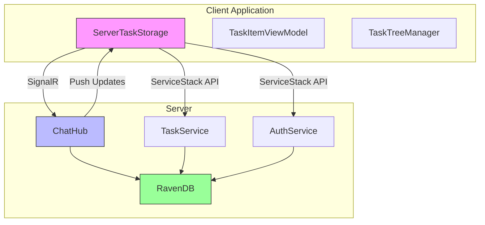
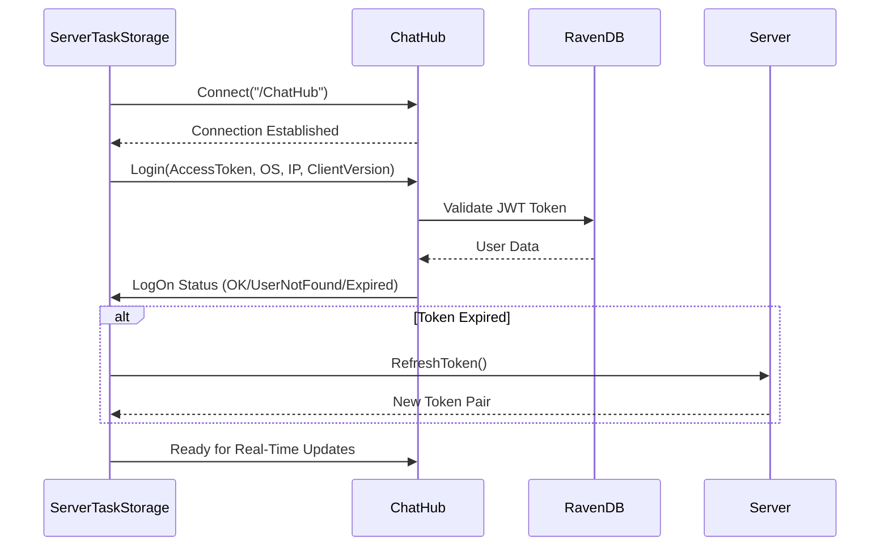
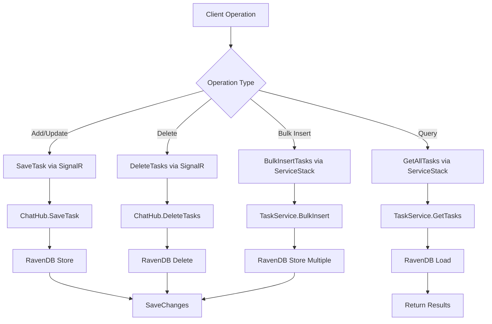
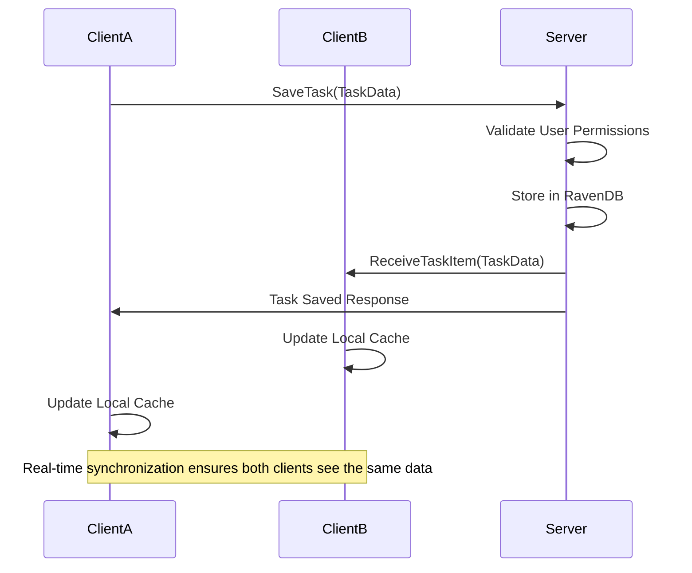
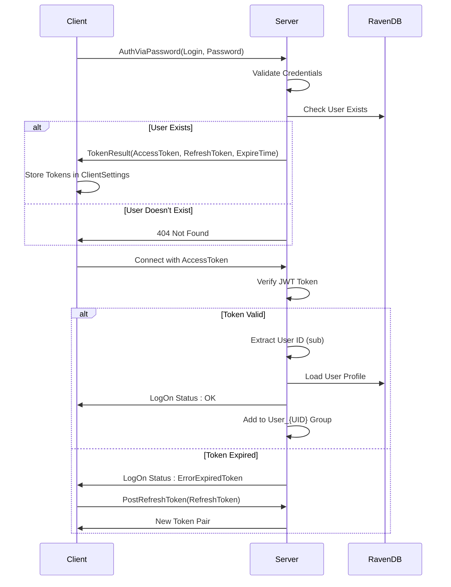
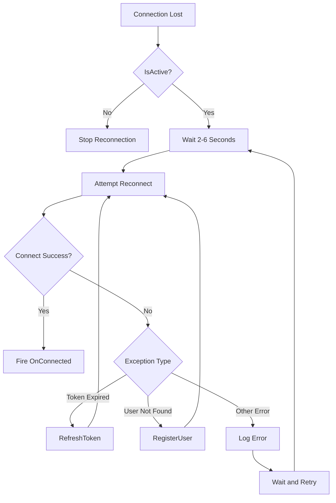
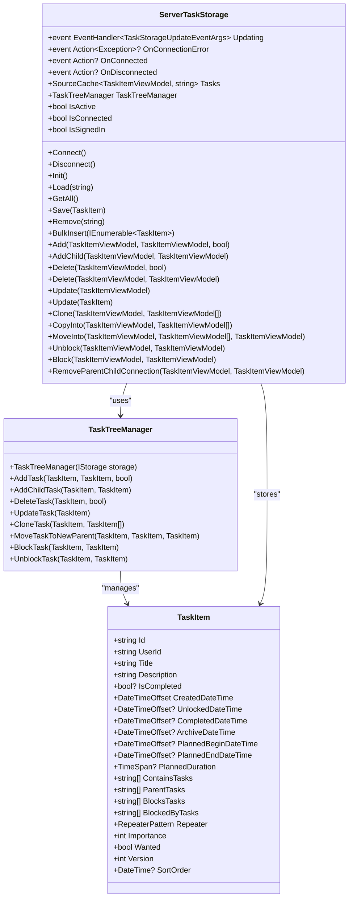

# Server Storage

<cite>
**Referenced Files in This Document**   
- [ServerTaskStorage.cs](file://src/Unlimotion/ServerTaskStorage.cs)
- [ChatHub.cs](file://src/Unlimotion.Server/hubs/ChatHub.cs)
- [Task.cs](file://src/Unlimotion.Server.ServiceModel/Task.cs)
- [Auth.cs](file://src/Unlimotion.Server.ServiceModel/Auth.cs)
- [TokenResult.cs](file://src/Unlimotion.Server.ServiceModel/Molds/TokenResult.cs)
- [TaskItem.cs](file://src/Unlimotion.Domain/TaskItem.cs)
</cite>

## Table of Contents
1. [Introduction](#introduction)
2. [Architecture Overview](#architecture-overview)
3. [Client-Server Connection via SignalR](#client-server-connection-via-signalr)
4. [CRUD Operations and ServiceStack Integration](#crud-operations-and-servicestack-integration)
5. [Event-Driven Real-Time Synchronization](#event-driven-real-time-synchronization)
6. [Authentication and Session Management](#authentication-and-session-management)
7. [Error Handling and Reconnection Logic](#error-handling-and-reconnection-logic)
8. [Task Relationship Management](#task-relationship-management)
9. [Conflict Resolution and Concurrency](#conflict-resolution-and-concurrency)
10. [Conclusion](#conclusion)

## Introduction

The Unlimotion server-based storage system implements a distributed task management solution using RavenDB as the backend database and SignalR for real-time synchronization. The ServerTaskStorage class serves as the client-side interface to the server, enabling CRUD operations on task data while maintaining real-time consistency across multiple clients through a hub-based communication model. This documentation details the architecture, implementation, and operational characteristics of this system, focusing on how tasks are stored, synchronized, and managed in a collaborative environment.

**Section sources**
- [ServerTaskStorage.cs](file://src/Unlimotion/ServerTaskStorage.cs#L1-L50)

## Architecture Overview

The Unlimotion server storage architecture follows a client-server model with real-time synchronization capabilities. The system consists of a ServiceStack-based API server, RavenDB as the persistent storage layer, and SignalR for bidirectional communication between clients and server. Clients connect to the ChatHub endpoint to establish real-time connections, while CRUD operations are routed through RESTful ServiceStack endpoints. The architecture enables multiple clients to collaborate on task data with immediate synchronization of changes.

**Diagram sources**
- [ServerTaskStorage.cs](file://src/Unlimotion/ServerTaskStorage.cs#L1-L50)
- [ChatHub.cs](file://src/Unlimotion.Server/hubs/ChatHub.cs#L1-L20)

## Client-Server Connection via SignalR

The client establishes a persistent connection to the server through the ChatHub SignalR endpoint, enabling real-time bidirectional communication. The ServerTaskStorage class initiates this connection by creating a HubConnection to the "/ChatHub" URL, with automatic reconnection logic in case of network interruptions. The connection process involves certificate validation bypass for development environments and proper error handling to maintain connection stability.

The connection lifecycle is managed through the Connect() method, which ensures only one connection attempt occurs at a time using a SemaphoreSlim gate. When the connection is lost, the ConnectionOnClosed event handler implements exponential backoff with random jitter (2-6 seconds) to prevent thundering herd problems during reconnection attempts. This ensures robust operation even in unstable network conditions.

**Diagram sources**
- [ServerTaskStorage.cs](file://src/Unlimotion/ServerTaskStorage.cs#L150-L250)
- [ChatHub.cs](file://src/Unlimotion.Server/hubs/ChatHub.cs#L150-L200)

**Section sources**
- [ServerTaskStorage.cs](file://src/Unlimotion/ServerTaskStorage.cs#L150-L250)
- [ChatHub.cs](file://src/Unlimotion.Server/hubs/ChatHub.cs#L150-L200)

## CRUD Operations and ServiceStack Integration

CRUD operations in the Unlimotion system are implemented through ServiceStack request-response patterns, with all operations translated into appropriate HTTP requests. The ServerTaskStorage class uses JsonServiceClient to communicate with the server's ServiceStack endpoints, while real-time notifications are handled through SignalR hub methods.

The Add, Update, and Delete operations are routed through the ChatHub's SaveTask and DeleteTasks methods, which in turn interact with RavenDB through IAsyncDocumentSession. Query operations like GetAllTasks are implemented as ServiceStack Get requests that return paginated results. The BulkInsert operation allows efficient insertion of multiple tasks through a single POST request to the /tasks/bulk endpoint.

**Diagram sources**
- [ServerTaskStorage.cs](file://src/Unlimotion/ServerTaskStorage.cs#L500-L700)
- [ChatHub.cs](file://src/Unlimotion.Server/hubs/ChatHub.cs#L50-L150)
- [Task.cs](file://src/Unlimotion.Server.ServiceModel/Task.cs#L1-L45)

**Section sources**
- [ServerTaskStorage.cs](file://src/Unlimotion/ServerTaskStorage.cs#L500-L700)
- [ChatHub.cs](file://src/Unlimotion.Server/hubs/ChatHub.cs#L50-L150)

## Event-Driven Real-Time Synchronization

The system implements an event-driven architecture where server-side changes are pushed to connected clients through SignalR notifications, enabling real-time collaboration. When a task is created, updated, or deleted on the server, the ChatHub broadcasts the change to all connected clients except the sender, preventing duplicate processing of locally initiated changes.

The ServerTaskStorage subscribes to three key events through the SignalR connection: LogOn for authentication status, ReceiveTaskItem for task creation/updates, and DeleteTaskItem for task deletions. These subscriptions are registered in the RegisterHandlers method and enable the client to maintain a consistent local cache of task data. When a ReceiveTaskItem event is received, the client either adds a new task to its cache or updates an existing one, ensuring data consistency across all connected clients.

**Diagram sources**
- [ServerTaskStorage.cs](file://src/Unlimotion/ServerTaskStorage.cs#L300-L350)
- [ChatHub.cs](file://src/Unlimotion.Server/hubs/ChatHub.cs#L50-L100)

**Section sources**
- [ServerTaskStorage.cs](file://src/Unlimotion/ServerTaskStorage.cs#L300-L350)
- [ChatHub.cs](file://src/Unlimotion.Server/hubs/ChatHub.cs#L50-L100)

## Authentication and Session Management

Authentication in the Unlimotion system is implemented using JWT tokens with a refresh token mechanism for maintaining long-lived sessions. The ClientSettings class (referenced in ServerTaskStorage) stores the access token, refresh token, user ID, login, and token expiration time, providing persistent session state across application restarts.

The authentication flow begins with the client sending credentials via the AuthViaPassword request to obtain an initial token pair. Subsequent connections use the stored access token for authentication, with automatic refresh when the token expires. The Login method in ChatHub validates the JWT token using ServiceStack's JwtAuthProviderReader and establishes the user's session context, including adding the connection to user-specific groups for targeted message delivery.

**Diagram sources**
- [ServerTaskStorage.cs](file://src/Unlimotion/ServerTaskStorage.cs#L200-L300)
- [ChatHub.cs](file://src/Unlimotion.Server/hubs/ChatHub.cs#L150-L200)
- [Auth.cs](file://src/Unlimotion.Server.ServiceModel/Auth.cs#L1-L40)
- [TokenResult.cs](file://src/Unlimotion.Server.ServiceModel/Molds/TokenResult.cs#L1-L18)

**Section sources**
- [ServerTaskStorage.cs](file://src/Unlimotion/ServerTaskStorage.cs#L200-L300)
- [ChatHub.cs](file://src/Unlimotion.Server/hubs/ChatHub.cs#L150-L200)

## Error Handling and Reconnection Logic

The ServerTaskStorage implements comprehensive error handling and automatic reconnection logic to ensure resilience in unstable network conditions. The connection process is protected by a SemaphoreSlim to prevent concurrent connection attempts, while the ConnectionOnClosed event handler implements a robust reconnection strategy with random jitter to prevent server overload during network outages.

When network connectivity is lost, the system automatically attempts to reconnect every 2-6 seconds (with random variation to prevent synchronized reconnection storms). During reconnection, the system handles various error conditions including expired tokens (triggering token refresh) and user not found scenarios (triggering user registration). Exception handling is implemented throughout the codebase with appropriate event propagation through the OnConnectionError event, allowing the UI layer to respond to connectivity issues.

**Diagram sources**
- [ServerTaskStorage.cs](file://src/Unlimotion/ServerTaskStorage.cs#L250-L300)

**Section sources**
- [ServerTaskStorage.cs](file://src/Unlimotion/ServerTaskStorage.cs#L250-L300)

## Task Relationship Management

Task relationships in Unlimotion are maintained through parent-child and blocking relationships stored in the TaskItem entity. The TaskItem class contains collections for ContainsTasks (children), ParentTasks, BlocksTasks, and BlockedByTasks, enabling complex task hierarchies and dependencies. These relationships are preserved across distributed clients through the event-driven synchronization system.

The GetRoots method (implied in the system architecture) likely uses server-side filtering to identify top-level tasks by querying for tasks that are not contained in any other task's ContainsTasks collection. This filtering is performed on the server to minimize data transfer and ensure consistency. The TaskTreeManager component (used by ServerTaskStorage) handles the complex logic of maintaining these relationships during CRUD operations, ensuring referential integrity across the distributed system.

**Diagram sources**
- [TaskItem.cs](file://src/Unlimotion.Domain/TaskItem.cs#L1-L33)
- [ServerTaskStorage.cs](file://src/Unlimotion/ServerTaskStorage.cs#L1-L50)

**Section sources**
- [TaskItem.cs](file://src/Unlimotion.Domain/TaskItem.cs#L1-L33)
- [ServerTaskStorage.cs](file://src/Unlimotion/ServerTaskStorage.cs#L400-L500)

## Conflict Resolution and Concurrency

The Unlimotion system handles concurrent edits through a combination of server-side validation and client-side synchronization. Each TaskItem contains a Version property that likely serves as an optimistic concurrency control mechanism, though the exact implementation details are not fully visible in the provided code. When multiple users edit the same task simultaneously, the last write typically wins, with changes propagated to all clients through the event-driven notification system.

The system prevents unauthorized modifications by validating that the task's UserId matches the editing user's ID in the SaveTask method of ChatHub. This ensures that users can only modify their own tasks, preventing cross-user data corruption. For task relationships (parent-child, blocking), the TaskTreeManager coordinates changes to maintain referential integrity, with updates to related tasks propagated through the same event-driven mechanism.

The event subscription model in ServerTaskStorage ensures that local changes are not reprocessed when received back from the server, as the SignalR broadcast excludes the sender's connection (using GroupExcept). This prevents infinite loops and ensures that the local UI state remains consistent with the server state, even during periods of high concurrent activity.

**Section sources**
- [ChatHub.cs](file://src/Unlimotion.Server/hubs/ChatHub.cs#L50-L100)
- [ServerTaskStorage.cs](file://src/Unlimotion/ServerTaskStorage.cs#L300-L350)

## Conclusion

The Unlimotion server-based RavenDB storage system provides a robust foundation for real-time collaborative task management. By combining ServiceStack for RESTful API operations with SignalR for real-time notifications, the system achieves both reliability and responsiveness. The architecture effectively separates concerns between data persistence, business logic, and real-time communication, while maintaining data consistency across distributed clients.

Key strengths of the system include its resilient connection handling, comprehensive authentication model, and event-driven synchronization that enables seamless multi-user collaboration. The use of RavenDB provides flexible document storage for the hierarchical task data, while the TaskTreeManager abstraction simplifies complex relationship management. Future enhancements could include more sophisticated conflict resolution strategies, offline operation support, and enhanced data synchronization filtering to improve performance at scale.