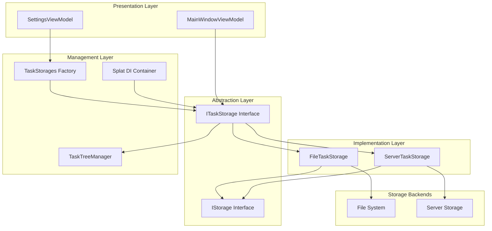
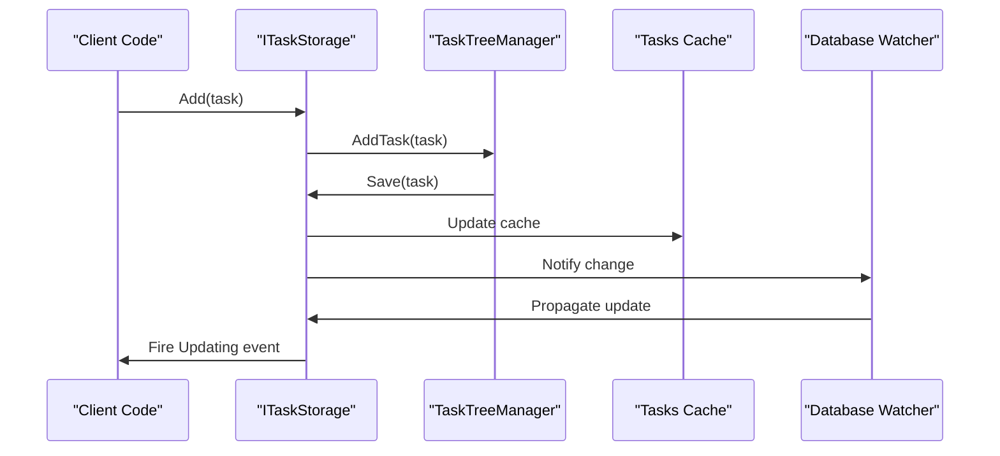
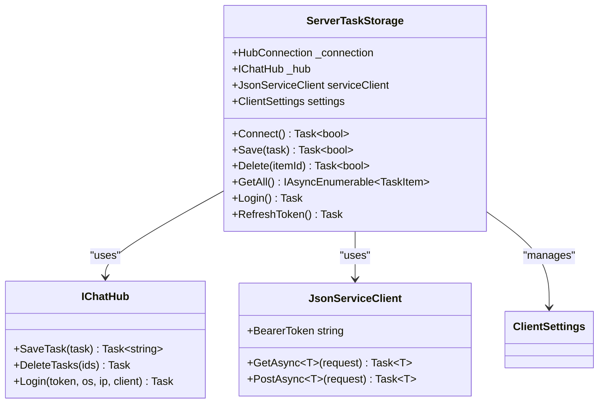
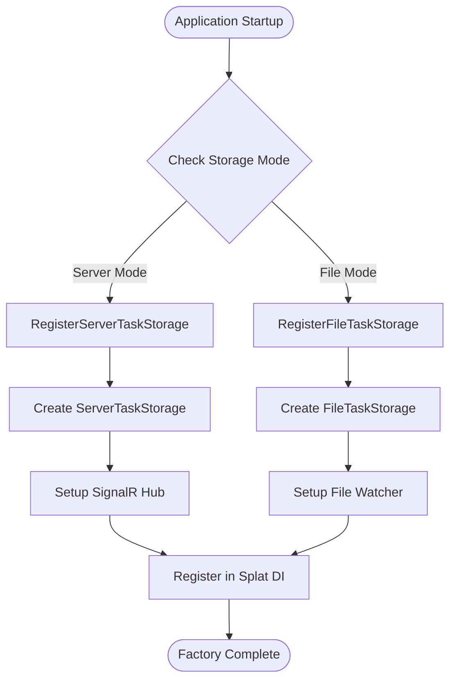
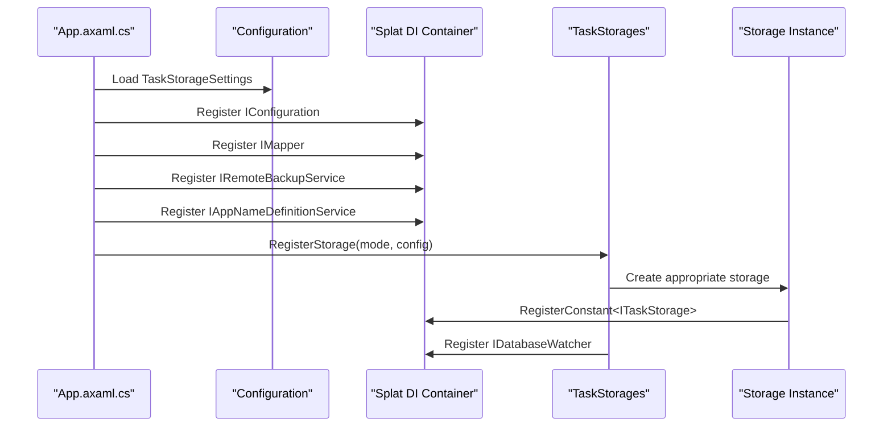
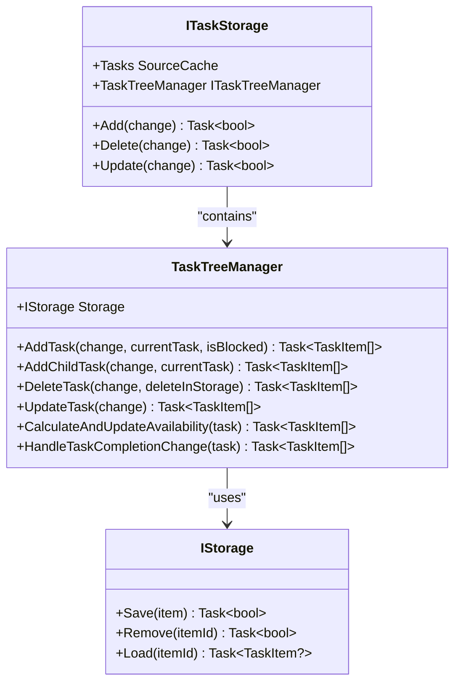
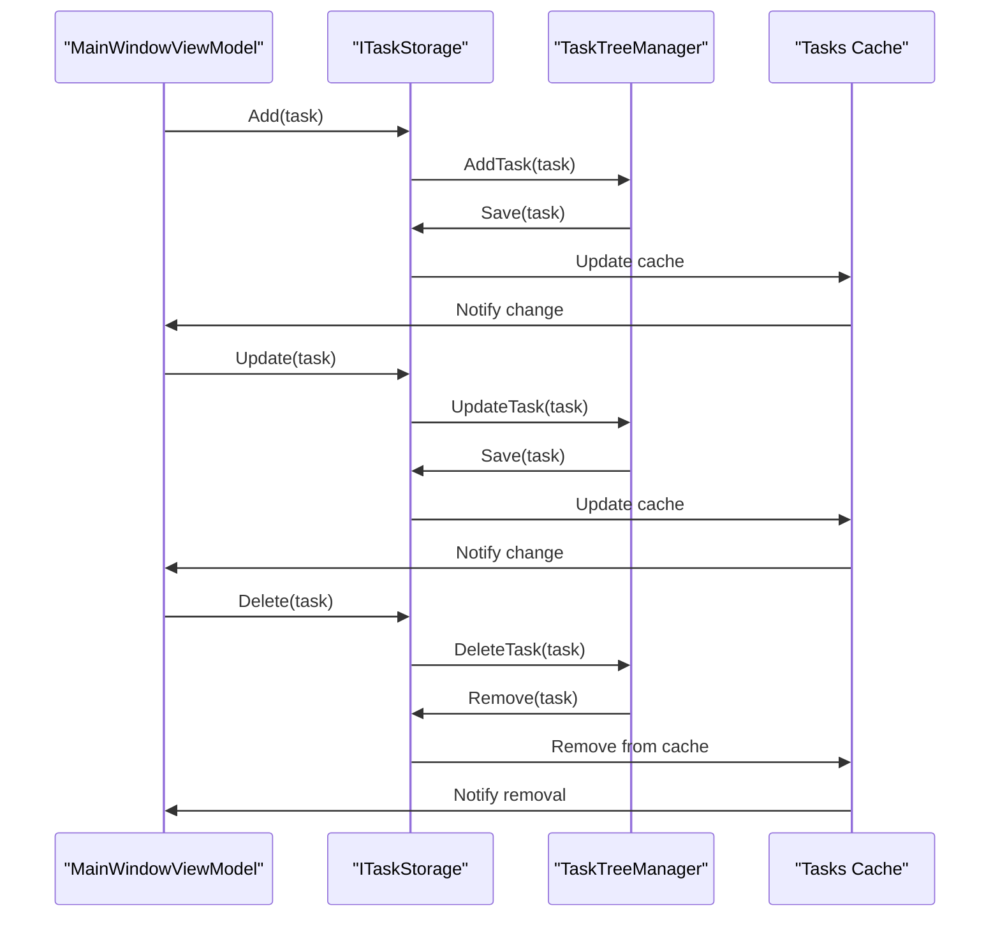
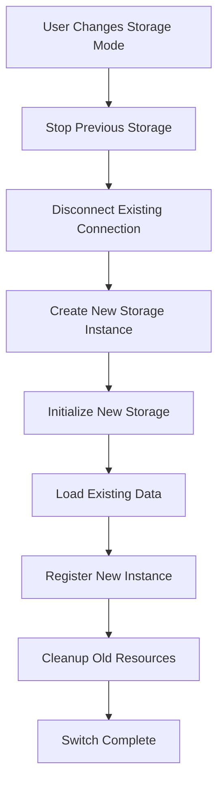

# Storage Abstraction Layer

<cite>
**Referenced Files in This Document**
- [ITaskStorage.cs](file://src/Unlimotion.ViewModel/ITaskStorage.cs)
- [FileTaskStorage.cs](file://src/Unlimotion/FileTaskStorage.cs)
- [ServerTaskStorage.cs](file://src/Unlimotion/ServerTaskStorage.cs)
- [TaskStorages.cs](file://src/Unlimotion/TaskStorages.cs)
- [TaskStorageSettings.cs](file://src/Unlimotion.ViewModel/TaskStorageSettings.cs)
- [MainWindowViewModel.cs](file://src/Unlimotion.ViewModel/MainWindowViewModel.cs)
- [App.axaml.cs](file://src/Unlimotion/App.axaml.cs)
- [IStorage.cs](file://src/Unlimotion.TaskTreeManager/IStorage.cs)
- [ITaskTreeManager.cs](file://src/Unlimotion.TaskTreeManager/ITaskTreeManager.cs)
- [TaskTreeManager.cs](file://src/Unlimotion.TaskTreeManager/TaskTreeManager.cs)
- [TaskStorageExtensions.cs](file://src/Unlimotion/TaskStorageExtensions.cs)
- [TaskStorageUpdateEventArgs.cs](file://src/Unlimotion.ViewModel/TaskStorageUpdateEventArgs.cs)
</cite>

## Table of Contents
1. [Introduction](#introduction)
2. [Architecture Overview](#architecture-overview)
3. [ITaskStorage Interface](#itaskstorage-interface)
4. [Storage Implementations](#storage-implementations)
5. [Factory Pattern Implementation](#factory-pattern-implementation)
6. [Dependency Injection System](#dependency-injection-system)
7. [TaskTreeManager Coordination](#tasktreemanager-coordination)
8. [Practical Usage Examples](#practical-usage-examples)
9. [Hot-Swapping Capabilities](#hot-swapping-capabilities)
10. [Data Consistency Management](#data-consistency-management)
11. [Conclusion](#conclusion)

## Introduction

Unlimotion's storage abstraction layer provides a sophisticated decoupling mechanism between business logic and storage implementations. At its core lies the `ITaskStorage` interface, which enables seamless switching between local file-based storage (`FileTaskStorage`) and server-based storage (`ServerTaskStorage`) without affecting the application's business logic.

This abstraction layer implements several key architectural patterns:
- **Interface Segregation**: Clear separation of concerns through well-defined interfaces
- **Factory Pattern**: Dynamic instantiation of appropriate storage implementations
- **Dependency Injection**: Splat-based IoC container integration
- **Observer Pattern**: Reactive change notifications through observables
- **Strategy Pattern**: Runtime selection of storage backend

## Architecture Overview

The storage abstraction follows a layered architecture that promotes flexibility and maintainability:

**Diagram sources**
- [ITaskStorage.cs](file://src/Unlimotion.ViewModel/ITaskStorage.cs#L10-L32)
- [FileTaskStorage.cs](file://src/Unlimotion/FileTaskStorage.cs#L20-L30)
- [ServerTaskStorage.cs](file://src/Unlimotion/ServerTaskStorage.cs#L20-L40)
- [TaskStorages.cs](file://src/Unlimotion/TaskStorages.cs#L15-L25)

## ITaskStorage Interface

The `ITaskStorage` interface serves as the primary abstraction point, defining a comprehensive contract for task storage operations. This interface encapsulates all essential CRUD operations and reactive capabilities.

### Core Interface Definition

The interface exposes several key properties and methods:

| Property/Method | Type | Purpose |
|----------------|------|---------|
| `Tasks` | `SourceCache<TaskItemViewModel, string>` | In-memory cache of all tasks with reactive change tracking |
| `TaskTreeManager` | `ITaskTreeManager` | Manages hierarchical task relationships and availability calculations |
| `Init()` | `Task` | Initializes the storage backend and loads existing data |
| `GetAll()` | `IAsyncEnumerable<TaskItem>` | Retrieves all stored tasks asynchronously |
| `Connect()` | `Task<bool>` | Establishes connection to the storage backend |
| `Disconnect()` | `Task` | Terminates connection and cleans up resources |
| `Add()` | `Task<bool>` | Creates new tasks with support for parent-child relationships |
| `Delete()` | `Task<bool>` | Removes tasks with cascading relationship cleanup |
| `Update()` | `Task<bool>` | Updates existing tasks with change propagation |
| `GetRoots()` | `IObservable<IChangeSet<TaskItemViewModel, string>>` | Provides reactive stream of root-level tasks |

### Reactive Change Notifications

The interface implements a sophisticated event-driven architecture for change notifications:

**Diagram sources**
- [ITaskStorage.cs](file://src/Unlimotion.ViewModel/ITaskStorage.cs#L15-L32)
- [FileTaskStorage.cs](file://src/Unlimotion/FileTaskStorage.cs#L200-L250)

**Section sources**
- [ITaskStorage.cs](file://src/Unlimotion.ViewModel/ITaskStorage.cs#L10-L32)

## Storage Implementations

### FileTaskStorage

The `FileTaskStorage` implementation provides local file-based persistence with JSON serialization. It maintains a comprehensive cache of tasks and supports real-time file system monitoring.

#### Key Features

- **JSON Serialization**: Uses Newtonsoft.Json for robust data persistence
- **File System Monitoring**: Integrates with `FileDbWatcher` for automatic change detection
- **Atomic Operations**: Ensures data consistency through careful transaction management
- **Migration Support**: Built-in migration system for schema evolution
- **Pause Mechanism**: Allows temporary suspension of write operations

#### Implementation Details

The file storage implementation manages several critical aspects:

- **Task Persistence**: Each task is stored as a separate JSON file named by its unique identifier
- **Relationship Management**: Maintains parent-child and blocking relationships through task references
- **Availability Calculation**: Tracks task availability based on completion status of dependencies
- **Change Propagation**: Updates cached views and notifies subscribers of modifications

**Section sources**
- [FileTaskStorage.cs](file://src/Unlimotion/FileTaskStorage.cs#L20-L100)

### ServerTaskStorage

The `ServerTaskStorage` implementation provides centralized storage through a SignalR-based server connection, enabling multi-user collaboration and remote data access.

#### Key Features

- **SignalR Integration**: Real-time bidirectional communication with server
- **Authentication & Authorization**: JWT token-based security with refresh token support
- **Automatic Reconnection**: Robust reconnection logic with exponential backoff
- **Bulk Operations**: Optimized batch operations for large dataset synchronization
- **Conflict Resolution**: Handles concurrent modifications through optimistic concurrency

#### Architecture Components

**Diagram sources**
- [ServerTaskStorage.cs](file://src/Unlimotion/ServerTaskStorage.cs#L20-L80)
- [ServerTaskStorage.cs](file://src/Unlimotion/ServerTaskStorage.cs#L600-L700)

**Section sources**
- [ServerTaskStorage.cs](file://src/Unlimotion/ServerTaskStorage.cs#L20-L150)

## Factory Pattern Implementation

The `TaskStorages` class implements a factory pattern that dynamically creates appropriate storage instances based on configuration settings. This pattern enables runtime switching between storage backends without code changes.

### Factory Method Design

**Diagram sources**
- [TaskStorages.cs](file://src/Unlimotion/TaskStorages.cs#L150-L180)

### Configuration-Based Instantiation

The factory pattern supports dynamic configuration changes:

| Configuration Parameter | Impact | Example |
|------------------------|--------|---------|
| `IsServerMode` | Determines storage type | `true` for server, `false` for file |
| `URL` | Server endpoint specification | `https://api.unlimotion.com/v1` |
| `Path` | Local storage directory | `C:\Users\Username\Documents\Tasks` |
| `Login/Password` | Authentication credentials | Secure credential storage |

**Section sources**
- [TaskStorages.cs](file://src/Unlimotion/TaskStorages.cs#L150-L200)
- [TaskStorageSettings.cs](file://src/Unlimotion.ViewModel/TaskStorageSettings.cs#L3-L15)

## Dependency Injection System

Unlimotion uses the Splat dependency injection framework to manage storage instances and their dependencies. The DI system ensures proper lifecycle management and loose coupling between components.

### Registration Process

The application initialization process demonstrates the DI registration pattern:

**Diagram sources**
- [App.axaml.cs](file://src/Unlimotion/App.axaml.cs#L130-L180)

### Service Resolution

Components resolve storage dependencies through the DI container:

- **Constructor Injection**: Storage instances injected into view models
- **Service Location**: Direct resolution for factory methods
- **Lifecycle Management**: Automatic disposal and cleanup
- **Singleton Pattern**: Single storage instance per application lifetime

**Section sources**
- [App.axaml.cs](file://src/Unlimotion/App.axaml.cs#L130-L200)

## TaskTreeManager Coordination

The `TaskTreeManager` acts as a coordinator between the storage abstraction and business logic, managing hierarchical task relationships and availability calculations.

### Relationship Management

**Diagram sources**
- [TaskTreeManager.cs](file://src/Unlimotion.TaskTreeManager/TaskTreeManager.cs#L10-L50)
- [ITaskTreeManager.cs](file://src/Unlimotion.TaskTreeManager/ITaskTreeManager.cs#L8-L42)

### Availability Calculations

The TaskTreeManager performs sophisticated availability calculations:

- **Dependency Tracking**: Monitors completion status of contained tasks
- **Blocking Relationships**: Manages tasks that prevent others from becoming available
- **Recursive Updates**: Propagates availability changes through task hierarchies
- **Optimization**: Caches calculation results to improve performance

**Section sources**
- [TaskTreeManager.cs](file://src/Unlimotion.TaskTreeManager/TaskTreeManager.cs#L700-L800)

## Practical Usage Examples

### MainWindowViewModel Interaction

The `MainWindowViewModel` demonstrates how business logic interacts with the storage abstraction without knowledge of the underlying implementation:

**Diagram sources**
- [MainWindowViewModel.cs](file://src/Unlimotion.ViewModel/MainWindowViewModel.cs#L100-L200)

### Settings ViewModel Configuration

The settings interface allows runtime switching between storage backends:

- **Mode Selection**: Toggle between server and file modes
- **Connection Testing**: Validate storage connectivity
- **Migration Tools**: Transfer data between storage types
- **Backup Operations**: Synchronize with remote repositories

**Section sources**
- [MainWindowViewModel.cs](file://src/Unlimotion.ViewModel/MainWindowViewModel.cs#L50-L150)

## Hot-Swapping Capabilities

Unlimotion's storage abstraction supports runtime switching between storage backends without application restart. This capability is crucial for user experience and system maintenance.

### Switching Process

**Diagram sources**
- [TaskStorages.cs](file://src/Unlimotion/TaskStorages.cs#L150-L180)

### Benefits of Hot-Swapping

- **Zero Downtime**: Seamless transitions between storage types
- **User Flexibility**: Allow users to experiment with different backends
- **Maintenance Mode**: Enable storage migration without service interruption
- **Fallback Mechanism**: Automatic fallback to local storage if server fails

**Section sources**
- [TaskStorages.cs](file://src/Unlimotion/TaskStorages.cs#L150-L200)

## Data Consistency Management

The storage abstraction ensures data consistency across different backends through several mechanisms:

### Transaction Management

- **Atomic Operations**: Group related operations into atomic units
- **Rollback Capability**: Undo operations in case of failures
- **Consistency Checks**: Validate data integrity after operations
- **Conflict Resolution**: Handle concurrent modifications gracefully

### Synchronization Strategies

| Strategy | Use Case | Implementation |
|----------|----------|----------------|
| Optimistic Concurrency | Server storage | Version numbers, conflict detection |
| File Locking | Local storage | Semaphore-based locking |
| Change Tracking | Both backends | Event-driven updates |
| Validation | All backends | Business rule enforcement |

### Error Recovery

The system implements comprehensive error recovery:

- **Retry Logic**: Automatic retry with exponential backoff
- **Graceful Degradation**: Continue operation with reduced functionality
- **Data Integrity**: Verify data consistency after recovery
- **User Notification**: Inform users of recovery actions

**Section sources**
- [FileTaskStorage.cs](file://src/Unlimotion/FileTaskStorage.cs#L400-L457)
- [ServerTaskStorage.cs](file://src/Unlimotion/ServerTaskStorage.cs#L200-L300)

## Conclusion

Unlimotion's storage abstraction layer represents a sophisticated implementation of modern software architecture principles. The `ITaskStorage` interface successfully decouples business logic from storage implementation, enabling:

- **Flexibility**: Easy switching between storage backends
- **Maintainability**: Clear separation of concerns and modular design
- **Extensibility**: Support for new storage implementations
- **Reliability**: Robust error handling and data consistency
- **Performance**: Optimized operations and caching strategies

The combination of interface abstraction, factory pattern, dependency injection, and reactive programming creates a powerful foundation for task management applications. This architecture not only meets current requirements but also provides the flexibility needed for future enhancements and platform expansions.

The system's ability to seamlessly handle hot-swapping between local and server storage, combined with comprehensive error handling and data consistency mechanisms, makes it suitable for both personal productivity and enterprise-scale task management scenarios.