# Unified Task Storage Architecture

<cite>
**Referenced Files in This Document**
- [UnifiedTaskStorage.cs](file://src/Unlimotion/UnifiedTaskStorage.cs)
- [TaskStorages.cs](file://src/Unlimotion/TaskStorages.cs)
- [FileStorage.cs](file://src/Unlimotion/FileStorage.cs)
- [ServerStorage.cs](file://src/Unlimotion/ServerStorage.cs)
- [TaskTreeManager.cs](file://src/Unlimotion.TaskTreeManager/TaskTreeManager.cs)
- [IStorage.cs](file://src/Unlimotion.TaskTreeManager/IStorage.cs)
- [ITaskStorage.cs](file://src/Unlimotion.ViewModel/ITaskStorage.cs)
- [TaskItem.cs](file://src/Unlimotion.Domain/TaskItem.cs)
- [FileTaskMigrator.cs](file://src/Unlimotion/FileTaskMigrator.cs)
- [FileDbWatcher.cs](file://src/Unlimotion.ViewModel/FileDbWatcher.cs)
- [TaskStorageSettings.cs](file://src/Unlimotion.ViewModel/TaskStorageSettings.cs)
- [ClientSettings.cs](file://src/Unlimotion\ClientSettings.cs)
- [TaskStorageExtensions.cs](file://src/Unlimotion/TaskStorageExtensions.cs)
- [TaskStorageUpdateEventArgs.cs](file://src/Unlimotion.TaskTreeManager/TaskStorageUpdateEventArgs.cs)
- [UpdateType.cs](file://src/Unlimotion.TaskTreeManager/UpdateType.cs)
</cite>

## Table of Contents
1. [Introduction](#introduction)
2. [Architecture Overview](#architecture-overview)
3. [Core Components](#core-components)
4. [Storage Abstraction Layer](#storage-abstraction-layer)
5. [Task Tree Management](#task-tree-management)
6. [File-Based Storage](#file-based-storage)
7. [Server-Based Storage](#server-based-storage)
8. [Data Migration and Compatibility](#data-migration-and-compatibility)
9. [Real-Time Updates and Monitoring](#real-time-updates-and-monitoring)
10. [Security and Authentication](#security-and-authentication)
11. [Performance Considerations](#performance-considerations)
12. [Error Handling and Resilience](#error-handling-and-resilience)
13. [Configuration Management](#configuration-management)
14. [Conclusion](#conclusion)

## Introduction

The Unlimotion Unified Task Storage Architecture represents a sophisticated, multi-layered storage system designed to handle complex hierarchical task relationships while providing seamless switching between local file-based and remote server-based storage solutions. This architecture enables users to work with task trees containing parent-child relationships, blocking dependencies, and complex interconnections while maintaining data consistency across different storage backends.

The system is built around the principle of unified storage abstraction, allowing applications to operate consistently regardless of whether tasks are stored locally on disk or remotely on a server. This design supports both offline-first operation and real-time synchronization capabilities, making it suitable for distributed task management scenarios.

## Architecture Overview

The Unified Task Storage Architecture follows a layered approach with clear separation of concerns:

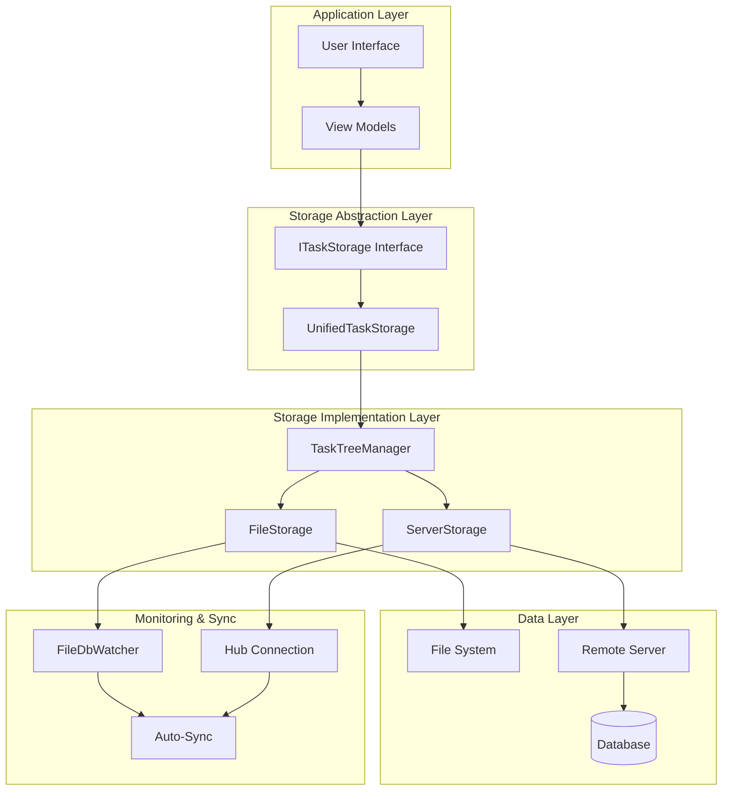

**Diagram sources**
- [UnifiedTaskStorage.cs](file://src/Unlimotion/UnifiedTaskStorage.cs#L14-L283)
- [ITaskStorage.cs](file://src/Unlimotion.ViewModel/ITaskStorage.cs#L10-L28)
- [TaskTreeManager.cs](file://src/Unlimotion.TaskTreeManager/TaskTreeManager.cs#L11-L18)

The architecture consists of five primary layers:

1. **Application Layer**: Contains user interfaces and view models that interact with the storage system
2. **Storage Abstraction Layer**: Provides unified interfaces for different storage backends
3. **Storage Implementation Layer**: Implements specific storage mechanisms (file-based and server-based)
4. **Data Layer**: Handles actual data persistence (files, databases, remote services)
5. **Monitoring & Sync**: Manages real-time updates and synchronization

**Section sources**
- [UnifiedTaskStorage.cs](file://src/Unlimotion/UnifiedTaskStorage.cs#L14-L50)
- [TaskTreeManager.cs](file://src/Unlimotion.TaskTreeManager/TaskTreeManager.cs#L11-L18)

## Core Components

### UnifiedTaskStorage

The `UnifiedTaskStorage` class serves as the central orchestrator for all task storage operations. It implements the `ITaskStorage` interface and provides a unified API for task management regardless of the underlying storage mechanism.

Key responsibilities include:
- Task lifecycle management (add, update, delete, clone)
- Relationship management between parent and child tasks
- Blocking and unblocking task dependencies
- Real-time synchronization with storage events
- Migration support for backward compatibility

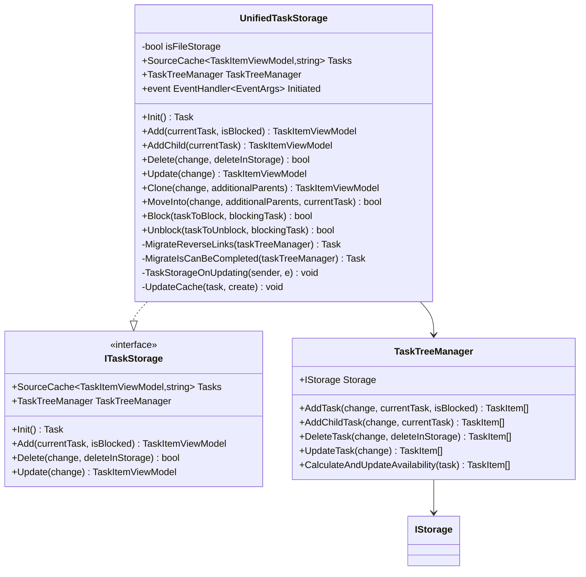

**Diagram sources**
- [UnifiedTaskStorage.cs](file://src/Unlimotion/UnifiedTaskStorage.cs#L14-L283)
- [ITaskStorage.cs](file://src/Unlimotion.ViewModel/ITaskStorage.cs#L10-L28)
- [TaskTreeManager.cs](file://src/Unlimotion.TaskTreeManager/TaskTreeManager.cs#L11-L877)

### TaskTreeManager

The `TaskTreeManager` handles complex tree operations and maintains task relationships. It operates independently of the storage mechanism, focusing solely on task logic and relationship calculations.

Core functionality includes:
- Parent-child relationship management
- Blocking dependency resolution
- Availability calculation for task completion
- Atomic operations with retry logic
- Relationship integrity maintenance

**Section sources**
- [UnifiedTaskStorage.cs](file://src/Unlimotion/UnifiedTaskStorage.cs#L14-L283)
- [TaskTreeManager.cs](file://src/Unlimotion.TaskTreeManager/TaskTreeManager.cs#L11-L877)

## Storage Abstraction Layer

The storage abstraction layer provides a clean separation between the application logic and the underlying storage mechanisms. This design allows for easy switching between different storage backends without affecting the rest of the application.

### IStorage Interface

The `IStorage` interface defines the contract for all storage implementations:

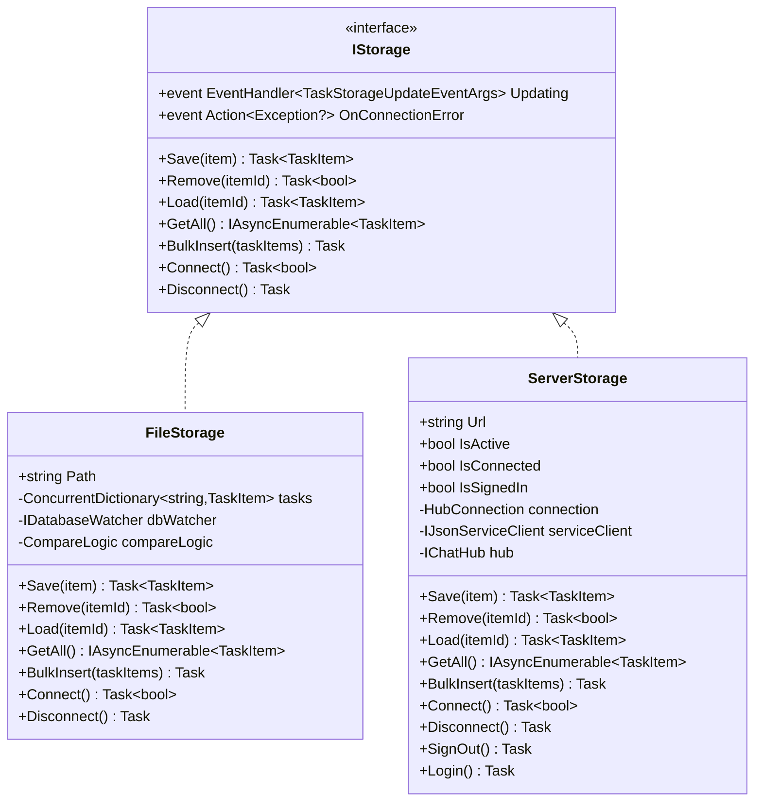

**Diagram sources**
- [IStorage.cs](file://src/Unlimotion.TaskTreeManager/IStorage.cs#L8-L19)
- [FileStorage.cs](file://src/Unlimotion/FileStorage.cs#L18-L190)
- [ServerStorage.cs](file://src/Unlimotion/ServerStorage.cs#L24-L519)

### TaskStorages Factory

The `TaskStorages` class acts as a factory for creating and managing storage instances, handling the complexity of switching between different storage modes.

**Section sources**
- [TaskStorages.cs](file://src/Unlimotion/TaskStorages.cs#L16-L223)
- [IStorage.cs](file://src/Unlimotion.TaskTreeManager/IStorage.cs#L8-L19)

## File-Based Storage

The file-based storage implementation provides local persistence with real-time monitoring capabilities.

### FileStorage Architecture

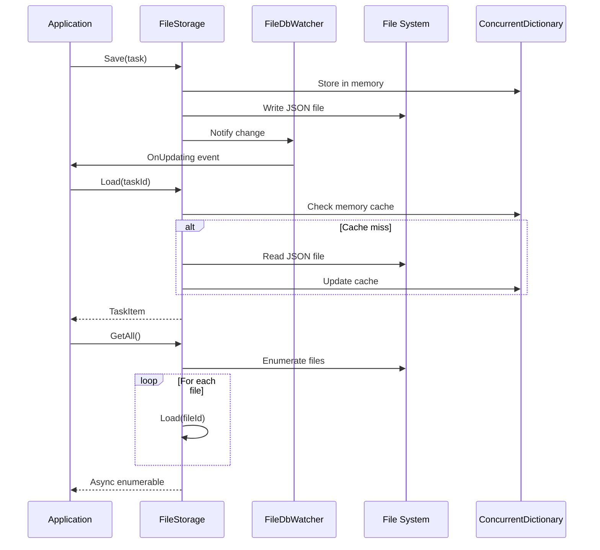

**Diagram sources**
- [FileStorage.cs](file://src/Unlimotion/FileStorage.cs#L53-L190)
- [FileDbWatcher.cs](file://src/Unlimotion.ViewModel/FileDbWatcher.cs#L11-L153)

### Key Features

- **Real-time Monitoring**: Uses `FileSystemWatcher` to detect changes in real-time
- **Memory Caching**: Maintains in-memory cache for fast access
- **Atomic Operations**: Ensures data consistency through careful file operations
- **Conflict Detection**: Uses `CompareLogic` to detect and prevent conflicts
- **Bulk Operations**: Supports efficient bulk insertions

**Section sources**
- [FileStorage.cs](file://src/Unlimotion/FileStorage.cs#L18-L190)
- [FileDbWatcher.cs](file://src/Unlimotion.ViewModel/FileDbWatcher.cs#L11-L153)

## Server-Based Storage

The server-based storage implementation provides centralized task management with real-time synchronization capabilities.

### ServerStorage Architecture

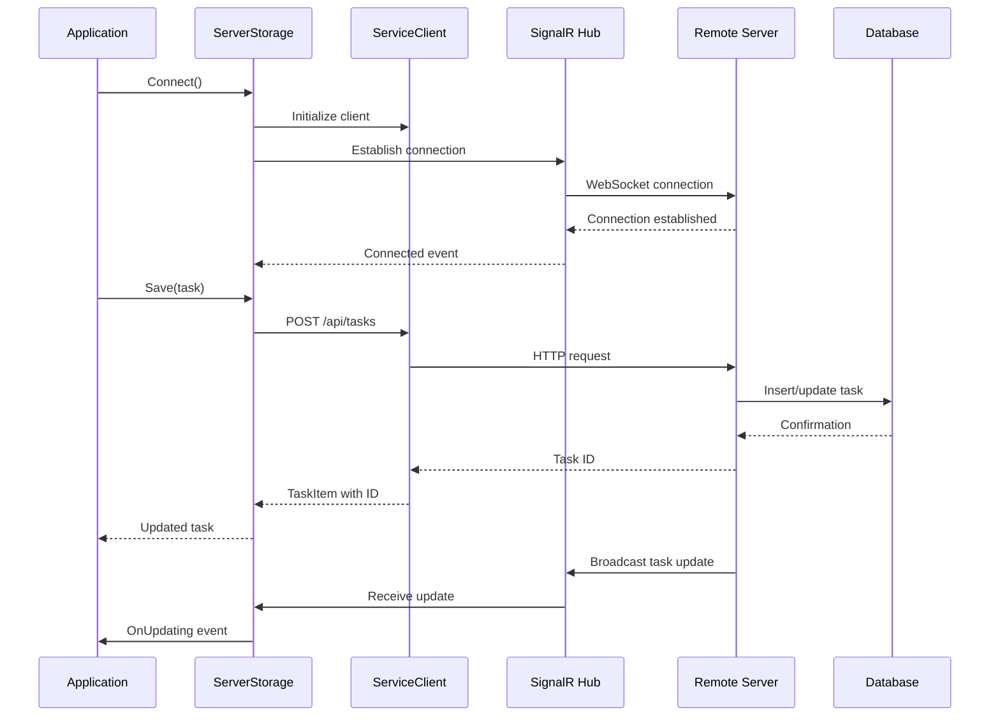

**Diagram sources**
- [ServerStorage.cs](file://src/Unlimotion/ServerStorage.cs#L73-L519)

### Key Features

- **Real-time Synchronization**: Uses SignalR for instant updates
- **Authentication & Authorization**: JWT token-based security
- **Automatic Retry**: Implements exponential backoff for network failures
- **Offline Capability**: Graceful degradation when disconnected
- **Bulk Operations**: Efficient batch processing for large datasets

**Section sources**
- [ServerStorage.cs](file://src/Unlimotion/ServerStorage.cs#L24-L519)

## Data Migration and Compatibility

The system includes sophisticated migration capabilities to handle schema evolution and backward compatibility.

### Migration Architecture

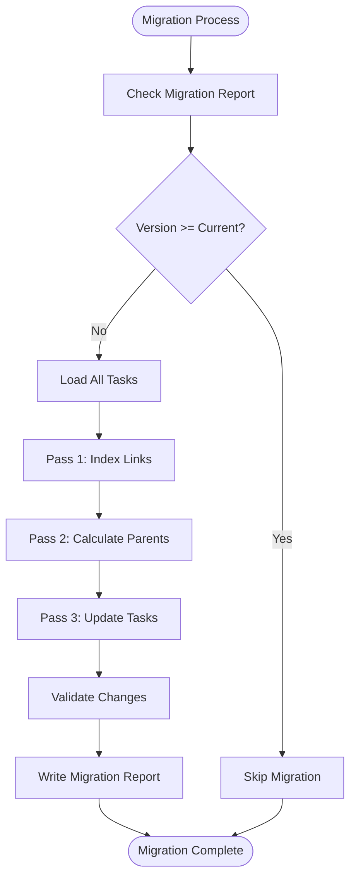

**Diagram sources**
- [FileTaskMigrator.cs](file://src/Unlimotion/FileTaskMigrator.cs#L42-L196)

### Migration Features

- **Schema Evolution**: Automatically updates task relationships
- **Backward Compatibility**: Maintains support for older data formats
- **Dry Run Mode**: Allows testing migrations without changes
- **Issue Detection**: Identifies and logs problematic relationships
- **Atomic Updates**: Ensures data consistency during migration

**Section sources**
- [FileTaskMigrator.cs](file://src/Unlimotion/FileTaskMigrator.cs#L14-L196)
- [UnifiedTaskStorage.cs](file://src/Unlimotion/UnifiedTaskStorage.cs#L198-L234)

## Real-Time Updates and Monitoring

The system provides comprehensive real-time monitoring and synchronization capabilities.

### Monitoring Architecture

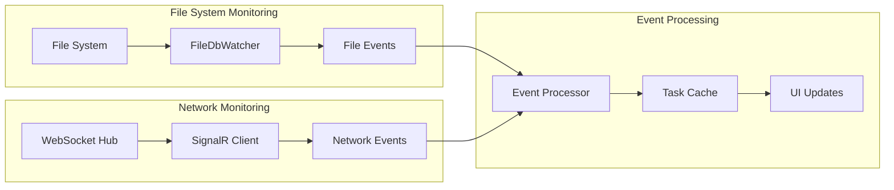

**Diagram sources**
- [FileDbWatcher.cs](file://src/Unlimotion.ViewModel/FileDbWatcher.cs#L11-L153)
- [ServerStorage.cs](file://src/Unlimotion/ServerStorage.cs#L358-L417)

### Event Types

The system handles two primary event types:

| Event Type | Description | Trigger Conditions |
|------------|-------------|-------------------|
| **Saved** | Task creation or modification | File write, server update, manual save |
| **Removed** | Task deletion | File deletion, server removal, explicit delete |

**Section sources**
- [FileDbWatcher.cs](file://src/Unlimotion.ViewModel/FileDbWatcher.cs#L11-L153)
- [ServerStorage.cs](file://src/Unlimotion/ServerStorage.cs#L358-L417)
- [TaskStorageUpdateEventArgs.cs](file://src/Unlimotion.TaskTreeManager/TaskStorageUpdateEventArgs.cs#L3-L7)

## Security and Authentication

The server-based storage implementation includes comprehensive security features.

### Authentication Flow

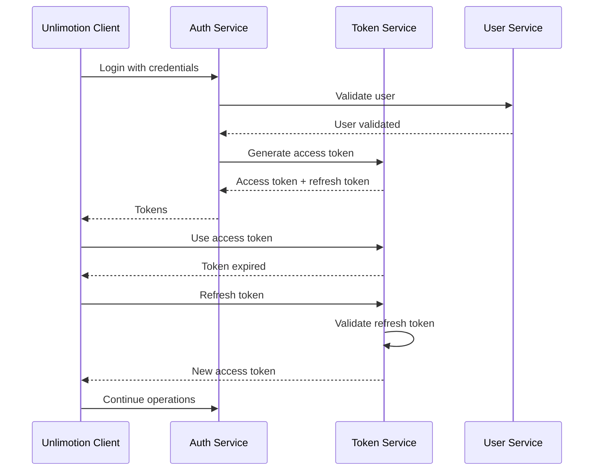

**Diagram sources**
- [ServerStorage.cs](file://src/Unlimotion/ServerStorage.cs#L140-L167)
- [ServerStorage.cs](file://src/Unlimotion/ServerStorage.cs#L461-L480)

### Security Features

- **JWT Authentication**: Secure token-based authentication
- **Automatic Token Refresh**: Seamless refresh token rotation
- **SSL/TLS Encryption**: Secure communication channels
- **Rate Limiting**: Protection against abuse
- **Audit Logging**: Comprehensive activity tracking

**Section sources**
- [ServerStorage.cs](file://src/Unlimotion/ServerStorage.cs#L140-L167)
- [ServerStorage.cs](file://src/Unlimotion/ServerStorage.cs#L461-L480)
- [ClientSettings.cs](file://src/Unlimotion\ClientSettings.cs#L5-L16)

## Performance Considerations

The architecture incorporates several performance optimization strategies.

### Caching Strategy

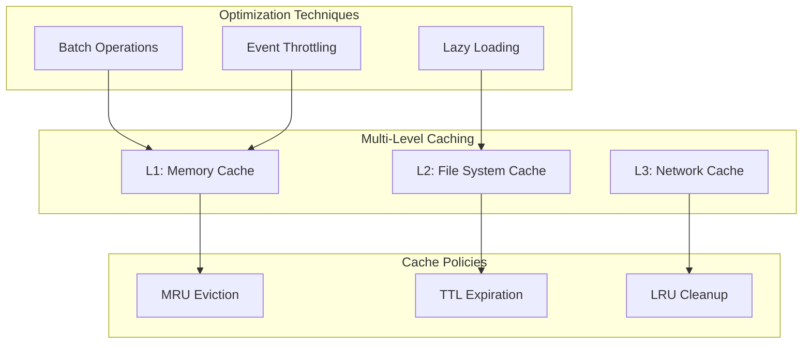

### Performance Optimizations

- **Memory Caching**: Fast access to frequently used tasks
- **Event Throttling**: Prevents excessive update notifications
- **Batch Operations**: Efficient bulk processing
- **Lazy Loading**: On-demand task loading
- **Connection Pooling**: Reuse of network connections

**Section sources**
- [FileStorage.cs](file://src/Unlimotion/FileStorage.cs#L22-L30)
- [FileDbWatcher.cs](file://src/Unlimotion.ViewModel/FileDbWatcher.cs#L140-L151)

## Error Handling and Resilience

The system implements comprehensive error handling and resilience patterns.

### Error Handling Architecture

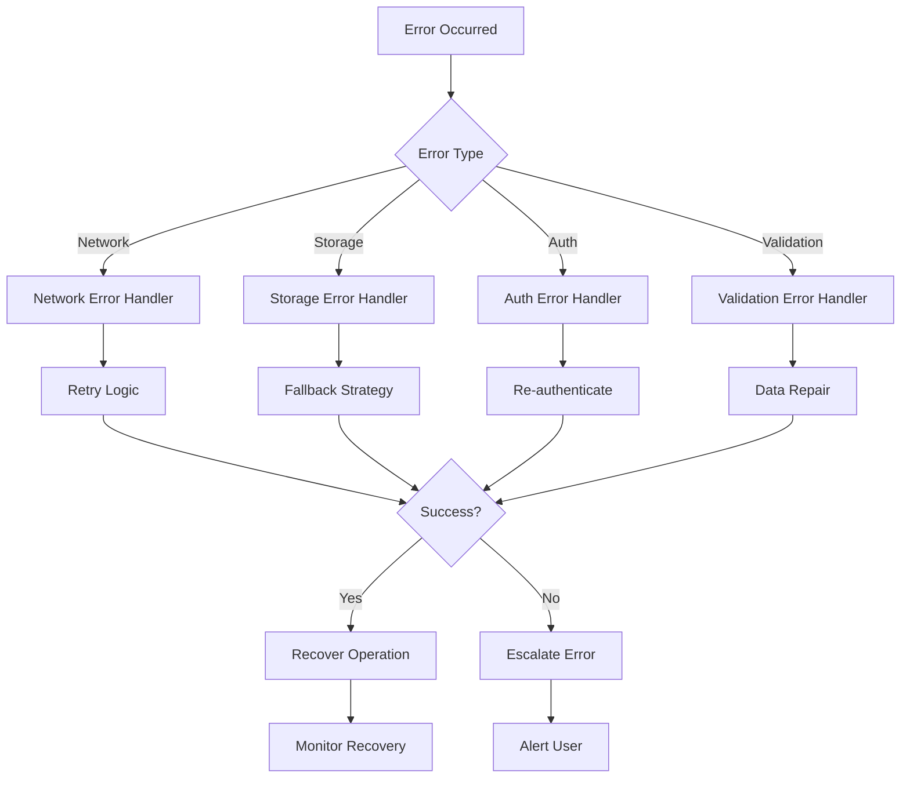

### Resilience Patterns

- **Retry Logic**: Automatic retry with exponential backoff
- **Circuit Breaker**: Prevents cascade failures
- **Fallback Strategies**: Graceful degradation
- **Timeout Management**: Prevents hanging operations
- **Data Validation**: Automatic repair of corrupted data

**Section sources**
- [TaskTreeManager.cs](file://src/Unlimotion.TaskTreeManager/TaskTreeManager.cs#L643-L661)
- [ServerStorage.cs](file://src/Unlimotion/ServerStorage.cs#L331-L356)

## Configuration Management

The system uses a hierarchical configuration approach supporting multiple storage modes.

### Configuration Structure

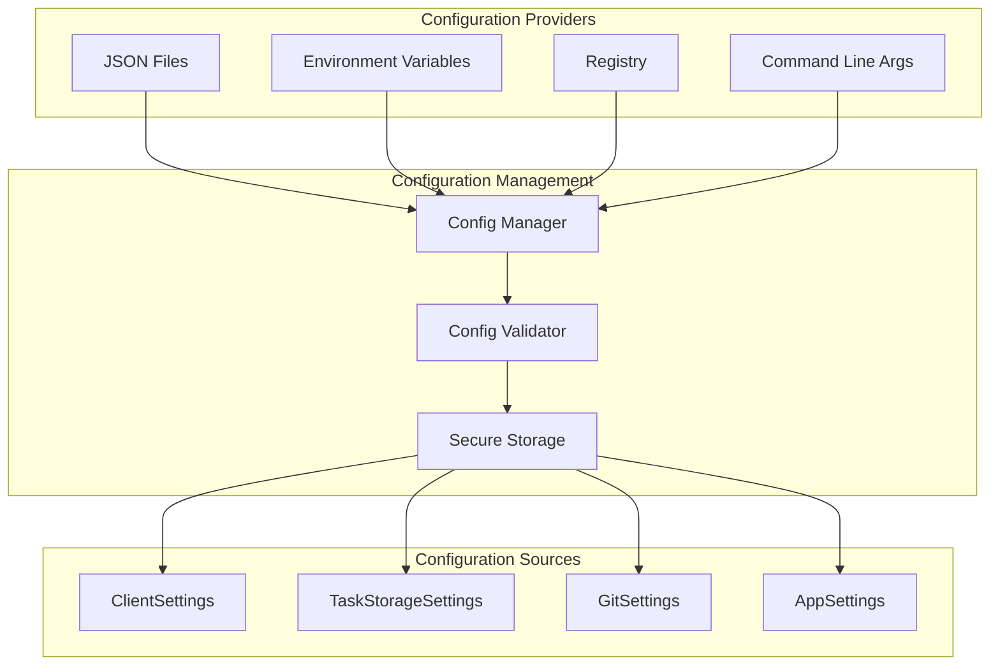

**Diagram sources**
- [TaskStorageSettings.cs](file://src/Unlimotion.ViewModel/TaskStorageSettings.cs#L3-L35)
- [ClientSettings.cs](file://src/Unlimotion\ClientSettings.cs#L5-L16)

### Configuration Features

- **Environment-Specific Settings**: Different configurations per environment
- **Secure Credential Storage**: Encrypted sensitive data
- **Hot Reload**: Dynamic configuration updates
- **Validation**: Comprehensive configuration validation
- **Defaults**: Reasonable default values

**Section sources**
- [TaskStorageSettings.cs](file://src/Unlimotion.ViewModel/TaskStorageSettings.cs#L3-L35)
- [TaskStorages.cs](file://src/Unlimotion/TaskStorages.cs#L16-L223)

## Conclusion

The Unlimotion Unified Task Storage Architecture represents a sophisticated approach to managing complex hierarchical data with multiple storage backends. Its key strengths include:

**Architectural Excellence**:
- Clean separation of concerns through layered architecture
- Unified interfaces hiding storage implementation details
- Extensible design supporting future storage backends

**Operational Robustness**:
- Real-time synchronization and monitoring capabilities
- Comprehensive error handling and resilience patterns
- Automatic data migration and compatibility management

**User Experience**:
- Seamless switching between storage modes
- Offline-first operation with automatic sync
- Responsive real-time updates

**Technical Innovation**:
- Advanced relationship management for complex task hierarchies
- Intelligent caching and performance optimization
- Secure authentication and authorization

This architecture successfully addresses the challenges of modern task management applications while maintaining flexibility, reliability, and performance. The modular design ensures that the system can evolve with changing requirements while preserving backward compatibility and operational stability.

The unified storage approach eliminates the complexity of managing different storage mechanisms separately, providing developers with a consistent API while users benefit from the optimal storage solution for their specific needs. This design philosophy positions Unlimotion as a robust platform capable of supporting diverse deployment scenarios and usage patterns.