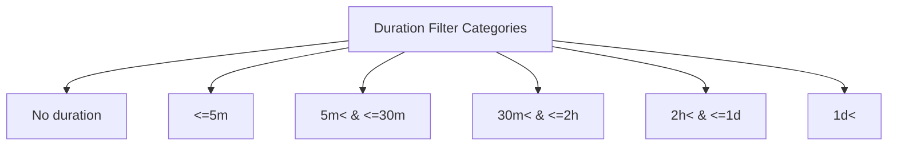
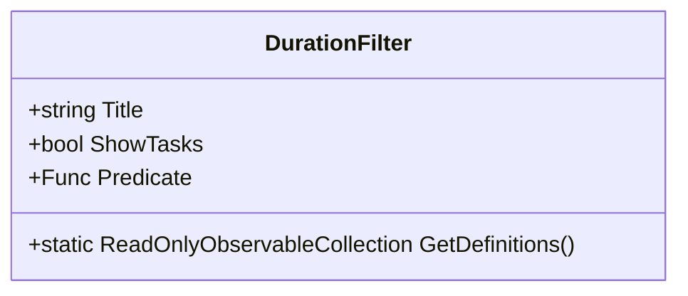
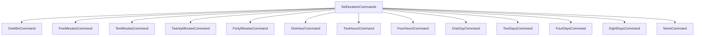
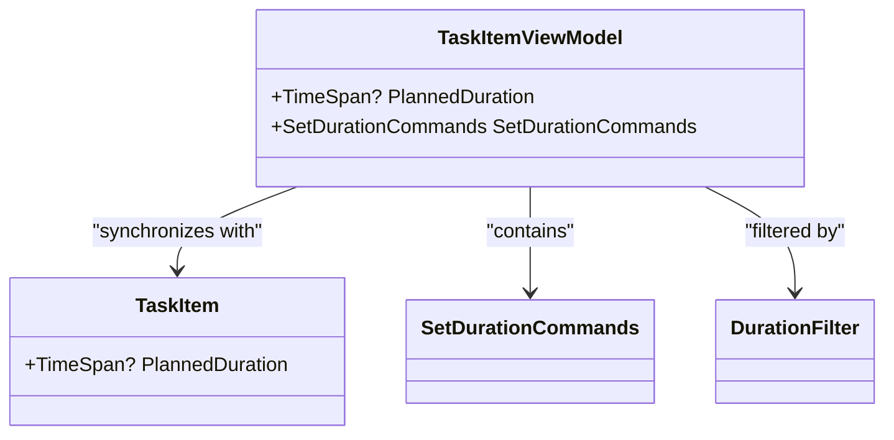
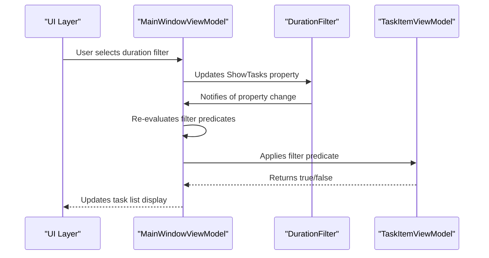

# Duration Filtering

<cite>
**Referenced Files in This Document**   
- [DurationFilter.cs](file://src/Unlimotion.ViewModel/DurationFilter.cs)
- [SetDurationCommands.cs](file://src/Unlimotion.ViewModel/SetDurationCommands.cs)
- [TaskItemViewModel.cs](file://src/Unlimotion.ViewModel/TaskItemViewModel.cs)
- [MainWindowViewModel.cs](file://src/Unlimotion.ViewModel/MainWindowViewModel.cs)
- [TaskItem.cs](file://src/Unlimotion.Domain/TaskItem.cs)
</cite>

## Table of Contents
1. [Introduction](#introduction)
2. [Duration Filter Definitions](#duration-filter-definitions)
3. [Duration Filter Implementation](#duration-filter-implementation)
4. [Duration Setting Commands](#duration-setting-commands)
5. [Integration with Task Model](#integration-with-task-model)
6. [Filter Application in UI](#filter-application-in-ui)
7. [Conclusion](#conclusion)

## Introduction
The duration filtering system in Unlimotion provides a mechanism for users to filter tasks based on their planned duration. This functionality enables users to organize and view tasks according to time commitment, facilitating better time management and task prioritization. The system consists of predefined duration categories that users can select to filter their task list, along with commands for quickly setting duration values on individual tasks.

**Section sources**
- [DurationFilter.cs](file://src/Unlimotion.ViewModel/DurationFilter.cs#L1-L51)

## Duration Filter Definitions
The duration filtering system defines six distinct categories for task durations, each representing a specific time range. These categories are implemented as static definitions within the `DurationFilter` class and are exposed through the `GetDefinitions()` method, which returns a collection of `DurationFilter` objects.

The filter categories are:
- **No duration**: Tasks without a planned duration (PlannedDuration is null)
- **<=5m**: Tasks with a planned duration of 5 minutes or less
- **5m< & <=30m**: Tasks with a planned duration greater than 5 minutes and up to 30 minutes
- **30m< & <=2h**: Tasks with a planned duration greater than 30 minutes and up to 2 hours
- **2h< & <=1d**: Tasks with a planned duration greater than 2 hours and up to 1 day
- **1d<**: Tasks with a planned duration greater than 1 day

Each filter contains a predicate function that evaluates whether a task meets the duration criteria for that category.

**Diagram sources**
- [DurationFilter.cs](file://src/Unlimotion.ViewModel/DurationFilter.cs#L15-L49)

**Section sources**
- [DurationFilter.cs](file://src/Unlimotion.ViewModel/DurationFilter.cs#L15-L49)

## Duration Filter Implementation
The `DurationFilter` class implements the filtering logic using predicate functions that evaluate the `PlannedDuration` property of `TaskItemViewModel` objects. The class follows the observable pattern, allowing the UI to respond to changes in filter selection.

The implementation uses `ReadOnlyObservableCollection<DurationFilter>` to expose the filter definitions, ensuring that changes to the collection can be observed by the UI layer. Each filter definition includes:
- A descriptive title for display in the UI
- A boolean flag indicating whether tasks should be shown
- A predicate function that determines if a task matches the filter criteria

The predicates use `TimeSpan` methods like `FromMinutes`, `FromHours`, and `FromDays` to create duration thresholds for comparison with task durations.

**Diagram sources**
- [DurationFilter.cs](file://src/Unlimotion.ViewModel/DurationFilter.cs#L8-L50)

**Section sources**
- [DurationFilter.cs](file://src/Unlimotion.ViewModel/DurationFilter.cs#L8-L50)

## Duration Setting Commands
The system provides a set of commands for quickly setting duration values on tasks through the `SetDurationCommands` class. This class implements a command pattern using ReactiveUI's `ReactiveCommand` to enable or disable commands based on the current state of the task.

The commands include:
- Specific duration commands (1 minute, 5 minutes, 10 minutes, etc.)
- A "None" command to clear the duration

The commands are enabled based on observables that monitor the `PlannedDuration` property of the associated task. The "None" command is only enabled when the task currently has a duration value, while all other commands are always available.

**Diagram sources**
- [SetDurationCommands.cs](file://src/Unlimotion.ViewModel/SetDurationCommands.cs#L8-L46)

**Section sources**
- [SetDurationCommands.cs](file://src/Unlimotion.ViewModel/SetDurationCommands.cs#L8-L46)

## Integration with Task Model
The duration filtering system is integrated with the task model through the `TaskItemViewModel` class, which exposes the `PlannedDuration` property used by both the filters and setting commands. This property is synchronized with the underlying domain model `TaskItem` in the `Unlimotion.Domain` namespace.

The `TaskItemViewModel` class initializes the `SetDurationCommands` in its constructor, establishing the connection between the UI commands and the task's duration property. When a command is executed, it directly modifies the `PlannedDuration` property, which triggers property change notifications and automatic saving of the task.

The domain model `TaskItem` stores the `PlannedDuration` as a nullable `TimeSpan`, allowing tasks to either have a specific duration or no duration at all, which aligns with the "No duration" filter category.

**Diagram sources**
- [TaskItemViewModel.cs](file://src/Unlimotion.ViewModel/TaskItemViewModel.cs#L424)
- [TaskItem.cs](file://src/Unlimotion.Domain/TaskItem.cs#L20)

**Section sources**
- [TaskItemViewModel.cs](file://src/Unlimotion.ViewModel/TaskItemViewModel.cs#L424)
- [TaskItem.cs](file://src/Unlimotion.Domain/TaskItem.cs#L20)

## Filter Application in UI
The duration filters are applied within the `MainWindowViewModel` through a filtering pipeline that combines multiple filter types. The duration filter is one component of a comprehensive filtering system that also includes date filters, emoji filters, and unlocked time filters.

The filtering is implemented using DynamicData library's observable collection transformations, which create a reactive pipeline that automatically updates when filter selections change. The `DurationFilters` property in `MainWindowViewModel` is initialized with the static definitions from `DurationFilter.GetDefinitions()`.

When filters are applied, the system uses a logical OR operation between selected filters within the same category, meaning a task will be included if it matches any of the selected duration filters. The filtering is optimized with `AutoRefreshOnObservable` to only re-evaluate when the `ShowTasks` property changes on any filter.

**Diagram sources**
- [MainWindowViewModel.cs](file://src/Unlimotion.ViewModel/MainWindowViewModel.cs#L399-L410)
- [DurationFilter.cs](file://src/Unlimotion.ViewModel/DurationFilter.cs#L15-L49)

**Section sources**
- [MainWindowViewModel.cs](file://src/Unlimotion.ViewModel/MainWindowViewModel.cs#L399-L410)

## Conclusion
The duration filtering system in Unlimotion provides a comprehensive solution for organizing tasks by time commitment. The system combines predefined filter categories with quick-setting commands to create an intuitive user experience. By leveraging reactive programming patterns, the implementation ensures that the UI remains synchronized with the underlying data model while providing responsive filtering capabilities. The separation of concerns between filter definitions, setting commands, and the task model promotes maintainability and extensibility, allowing for future enhancements to the duration management functionality.

**Section sources**
- [DurationFilter.cs](file://src/Unlimotion.ViewModel/DurationFilter.cs#L1-L51)
- [SetDurationCommands.cs](file://src/Unlimotion.ViewModel/SetDurationCommands.cs#L1-L47)
- [TaskItemViewModel.cs](file://src/Unlimotion.ViewModel/TaskItemViewModel.cs#L1-L677)
- [MainWindowViewModel.cs](file://src/Unlimotion.ViewModel/MainWindowViewModel.cs#L1-L1218)
- [TaskItem.cs](file://src/Unlimotion.Domain/TaskItem.cs#L1-L31)