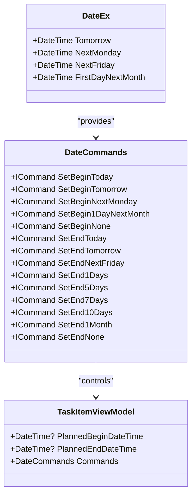
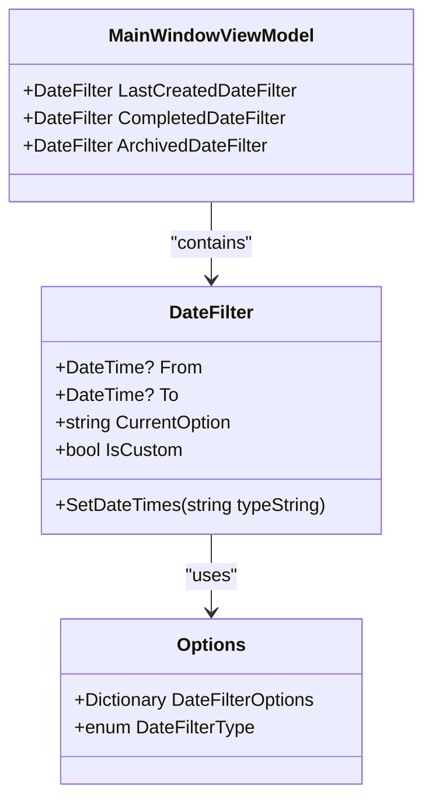
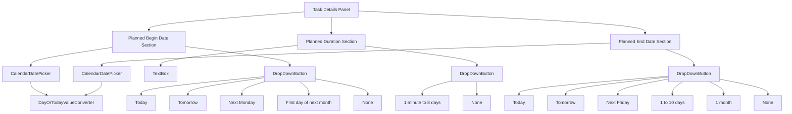
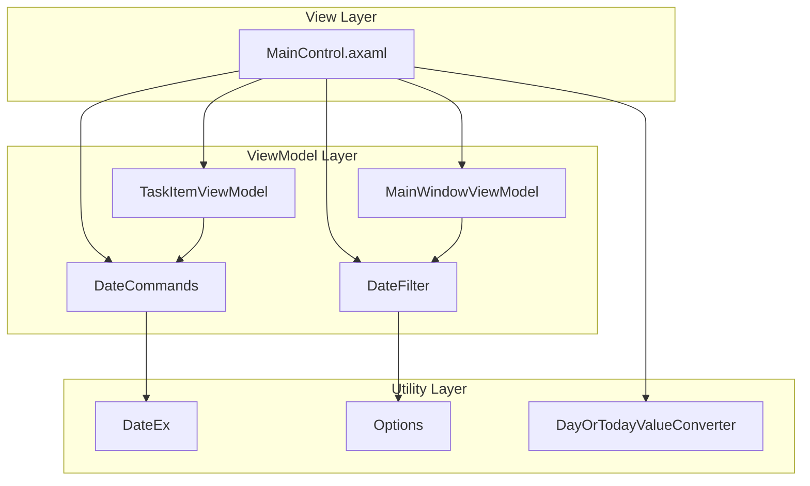

# Fast Date Selector

<cite>
**Referenced Files in This Document**   
- [DateCommands.cs](file://src/Unlimotion.ViewModel/DateCommands.cs)
- [DateEx.cs](file://src/Unlimotion.ViewModel/DateEx.cs)
- [DateFilter.cs](file://src/Unlimotion.ViewModel/DateFilter.cs)
- [Options.cs](file://src/Unlimotion.ViewModel/Options.cs)
- [MainControl.axaml](file://src/Unlimotion/Views/MainControl.axaml)
- [TaskItemViewModel.cs](file://src/Unlimotion.ViewModel/TaskItemViewModel.cs)
- [DayOrTodayValueConverter.cs](file://src/Unlimotion/Converters/DayOrTodayValueConverter.cs)
</cite>

## Table of Contents
1. [Introduction](#introduction)
2. [Core Components](#core-components)
3. [Fast Date Selector Implementation](#fast-date-selector-implementation)
4. [Date Filtering System](#date-filtering-system)
5. [UI Integration](#ui-integration)
6. [Architecture Overview](#architecture-overview)
7. [Usage Patterns](#usage-patterns)

## Introduction
The Fast Date Selector is a user interface component in the Unlimotion application that provides quick and efficient date selection for task planning and filtering. This system enables users to rapidly set planned begin and end dates for tasks through predefined date options, eliminating the need for manual date entry. The implementation combines ViewModel logic with UI components to create an intuitive date selection experience that enhances productivity in task management.

The Fast Date Selector serves two primary functions: setting planned dates for individual tasks and filtering tasks based on date ranges across different views. This documentation provides a comprehensive analysis of the Fast Date Selector's architecture, implementation, and integration within the Unlimotion application.

## Core Components

The Fast Date Selector functionality is implemented through several interconnected components that work together to provide a seamless user experience. The system is built on a ViewModel-first architecture where business logic is separated from UI presentation.

The core components include the DateCommands class which manages the command pattern for date selection, the DateEx utility class that provides calculated date properties, the DateFilter class for date range filtering, and the Options class that defines available date filter options. These components work in conjunction with the TaskItemViewModel to manage task-specific date properties and the MainControl.axaml UI component to provide the user interface.

The implementation follows the MVVM (Model-View-ViewModel) pattern, with clear separation of concerns between data models, business logic, and user interface elements. This architectural approach enables maintainability and testability of the date selection functionality.

**Section sources**
- [DateCommands.cs](file://src/Unlimotion.ViewModel/DateCommands.cs#L1-L55)
- [DateEx.cs](file://src/Unlimotion.ViewModel/DateEx.cs#L1-L59)
- [DateFilter.cs](file://src/Unlimotion.ViewModel/DateFilter.cs#L1-L75)
- [Options.cs](file://src/Unlimotion.ViewModel/Options.cs#L1-L34)

## Fast Date Selector Implementation

The Fast Date Selector is implemented through the DateCommands class, which provides a set of ReactiveCommands for setting planned begin and end dates on tasks. These commands are bound to UI elements in the MainControl.axaml file, allowing users to quickly set dates with a single click.

The implementation uses the ReactiveUI framework to create commands that automatically handle UI state changes and validation. For begin dates, the available options include Today, Tomorrow, Next Monday, and First day of next month. For end dates, the options include Today, Tomorrow, Next Friday, and relative durations like 1 day, 5 days, 7 days, 10 days, and 1 month from the begin date.

The DateEx class provides calculated properties for common date references such as Tomorrow, NextMonday, NextFriday, and FirstDayNextMonth. These properties are used by the DateCommands to set the appropriate dates on task items. The implementation ensures that date calculations are consistent and accurate across the application.

**Diagram sources**
- [DateCommands.cs](file://src/Unlimotion.ViewModel/DateCommands.cs#L10-L55)
- [DateEx.cs](file://src/Unlimotion.ViewModel/DateEx.cs#L8-L59)
- [TaskItemViewModel.cs](file://src/Unlimotion.ViewModel/TaskItemViewModel.cs#L412-L413)

## Date Filtering System

The date filtering system in Unlimotion allows users to filter tasks based on various date ranges across different views such as Last Created, Completed, and Archived tasks. This system is implemented through the DateFilter class and the Options class, which work together to provide a flexible and intuitive filtering experience.

The DateFilter class contains properties for defining a date range (From and To), the current filter option (CurrentOption), and a flag indicating whether a custom date range is being used (IsCustom). The SetDateTimes method calculates the appropriate date range based on the selected filter option, using the date filter type defined in the Options class.

The Options class defines a dictionary of date filter options that map string representations to DateFilterType enum values. The available filter options include Today, Week, Month, Quarter, Year, Last Two Days, Last Week, Last Month, Last Year, and All Time. This comprehensive set of options allows users to quickly filter tasks based on common time periods.

**Diagram sources**
- [DateFilter.cs](file://src/Unlimotion.ViewModel/DateFilter.cs#L10-L65)
- [Options.cs](file://src/Unlimotion.ViewModel/Options.cs#L7-L34)
- [MainWindowViewModel.cs](file://src/Unlimotion.ViewModel/MainWindowViewModel.cs#L1-L1218)

## UI Integration

The Fast Date Selector is integrated into the user interface through the MainControl.axaml file, which contains the markup for the task details panel. The UI implementation uses Avalonia UI framework components to create a user-friendly date selection interface.

In the task details panel, CalendarDatePicker controls are used for direct date selection, while DropDownButton controls with MenuFlyout items provide the fast date selection options. The Begin date section includes a CalendarDatePicker for manual selection and a DropDownButton with options for Today, Tomorrow, Next Monday, First day of next month, and None.

Similarly, the End date section includes a CalendarDatePicker and a DropDownButton with options for Today, Tomorrow, Next Friday, 1 day, 5 days, 7 days, 10 days, 1 month, and None. The UI also includes a Planned Duration field with its own set of duration options.

The DayOrTodayValueConverter is used to ensure that the CalendarDatePicker displays a meaningful date when no date is selected, defaulting to the current date. This improves the user experience by providing context for date selection.

**Diagram sources**
- [MainControl.axaml](file://src/Unlimotion/Views/MainControl.axaml#L374-L439)
- [DayOrTodayValueConverter.cs](file://src/Unlimotion/Converters/DayOrTodayValueConverter.cs#L1-L30)

## Architecture Overview

The Fast Date Selector system follows a clean architecture pattern with clear separation between UI, ViewModel, and domain logic. The overall architecture is based on the MVVM (Model-View-ViewModel) pattern, which promotes testability and maintainability.

The View layer consists of the MainControl.axaml file, which defines the user interface using Avalonia XAML. This layer is responsible for presenting the date selection options and handling user interactions. The ViewModel layer contains the DateCommands, DateFilter, and related classes that implement the business logic for date selection and filtering.

The system uses ReactiveUI for command implementation, which provides automatic handling of command execution states and UI updates. The DateEx class serves as a utility component that provides calculated date values used by the DateCommands. The Options class defines the available date filter options as a dictionary, making it easy to extend or modify the available options.

Data flows from the UI to the ViewModel through command execution, with the ViewModel updating the TaskItemViewModel properties accordingly. The system also supports two-way binding for date range filtering, allowing users to switch between predefined date ranges and custom date selection.

**Diagram sources**
- [MainControl.axaml](file://src/Unlimotion/Views/MainControl.axaml#L374-L439)
- [DateCommands.cs](file://src/Unlimotion.ViewModel/DateCommands.cs#L10-L55)
- [DateFilter.cs](file://src/Unlimotion.ViewModel/DateFilter.cs#L10-L65)
- [TaskItemViewModel.cs](file://src/Unlimotion.ViewModel/TaskItemViewModel.cs#L412-L413)
- [DateEx.cs](file://src/Unlimotion.ViewModel/DateEx.cs#L8-L59)
- [Options.cs](file://src/Unlimotion.ViewModel/Options.cs#L7-L34)
- [DayOrTodayValueConverter.cs](file://src/Unlimotion/Converters/DayOrTodayValueConverter.cs#L1-L30)

## Usage Patterns

The Fast Date Selector is designed to support common task planning patterns by providing quick access to frequently used dates. Users can rapidly set planned begin and end dates for tasks without needing to navigate through calendar interfaces.

For task planning, users typically set a begin date first, which then influences the available end date options. When a begin date is set, the relative end date options (1 day, 5 days, etc.) are calculated from that begin date. This creates a natural workflow for planning tasks with specific durations.

The date filtering system supports various usage patterns across different task views. In the Last Created view, users can filter tasks by creation date using predefined ranges or custom date selection. Similarly, the Completed and Archived views provide date filtering for those specific task states.

The system also handles edge cases such as date validation, ensuring that end dates are not set before begin dates. The implementation uses ReactiveUI's validation capabilities to disable inappropriate options based on the current state, providing a guided user experience.

**Section sources**
- [DateCommands.cs](file://src/Unlimotion.ViewModel/DateCommands.cs#L15-L55)
- [MainControl.axaml](file://src/Unlimotion/Views/MainControl.axaml#L381-L439)
- [TaskItemViewModel.cs](file://src/Unlimotion.ViewModel/TaskItemViewModel.cs#L260-L289)