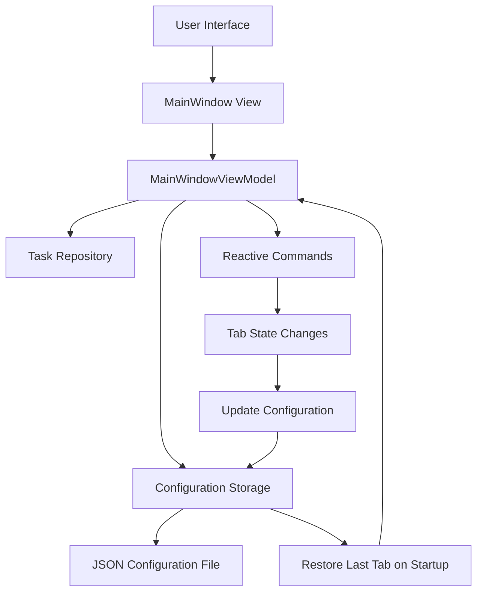
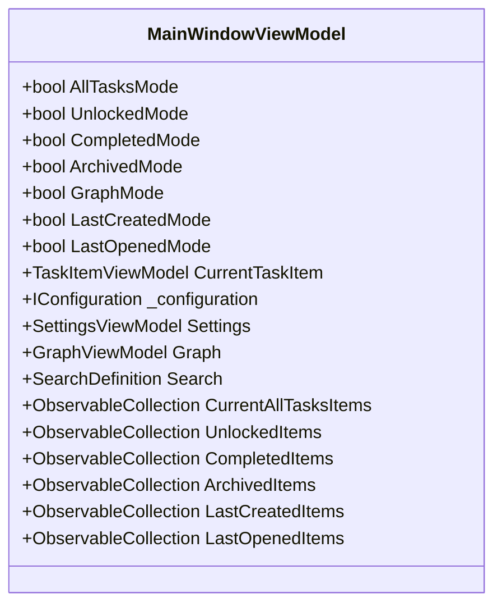
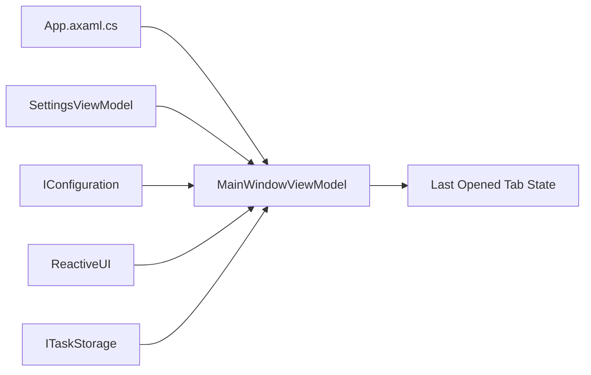

# Last Opened Tab

<cite>
**Referenced Files in This Document**   
- [MainWindowViewModel.cs](file://src/Unlimotion.ViewModel/MainWindowViewModel.cs)
- [App.axaml.cs](file://src/Unlimotion/App.axaml.cs)
- [SettingsViewModel.cs](file://src/Unlimotion.ViewModel/SettingsViewModel.cs)
</cite>

## Table of Contents
1. [Introduction](#introduction)
2. [Core Components](#core-components)
3. [Architecture Overview](#architecture-overview)
4. [Detailed Component Analysis](#detailed-component-analysis)
5. [Dependency Analysis](#dependency-analysis)

## Introduction
The "Last Opened Tab" functionality in Unlimotion enables users to resume their workflow by automatically restoring the most recently accessed tab upon application restart. This feature enhances user experience by maintaining context across sessions, allowing seamless continuation of tasks without manual navigation. The implementation leverages reactive programming patterns and persistent configuration storage to track and restore user interface state.

## Core Components
The Last Opened Tab functionality is primarily managed through the MainWindowViewModel, which maintains state for various tab views including All Tasks, Unlocked, Completed, Archived, Graph, Last Created, and Last Opened modes. The system uses configuration persistence to store and retrieve the last active tab, ensuring continuity between application sessions.

**Section sources**
- [MainWindowViewModel.cs](file://src/Unlimotion.ViewModel/MainWindowViewModel.cs#L16-L1206)
- [App.axaml.cs](file://src/Unlimotion/App.axaml.cs#L1-L250)

## Architecture Overview
The Last Opened Tab feature follows the MVVM (Model-View-ViewModel) architectural pattern, with the MainWindowViewModel serving as the central coordinator for tab state management. The architecture integrates reactive data binding, configuration persistence, and event-driven updates to maintain synchronization between the UI and application state.

**Diagram sources**
- [MainWindowViewModel.cs](file://src/Unlimotion.ViewModel/MainWindowViewModel.cs#L16-L1206)
- [App.axaml.cs](file://src/Unlimotion/App.axaml.cs#L1-L250)

## Detailed Component Analysis

### MainWindowViewModel Analysis
The MainWindowViewModel class is the central component responsible for managing the Last Opened Tab functionality. It maintains boolean properties for each tab mode (AllTasksMode, UnlockedMode, CompletedMode, etc.) and uses reactive programming to respond to changes in the active tab.

When a tab becomes active, the corresponding mode property triggers updates through reactive subscriptions that persist the state to configuration storage. The initialization process in the constructor reads saved settings to restore the previous tab state upon application startup.

The component also manages collections of tasks for each view mode (CurrentAllTasksItems, UnlockedItems, CompletedItems, etc.), ensuring that selecting a tab updates the displayed content appropriately while maintaining the underlying data model.

**Diagram sources**
- [MainWindowViewModel.cs](file://src/Unlimotion.ViewModel/MainWindowViewModel.cs#L16-L1206)

## Dependency Analysis
The Last Opened Tab functionality depends on several key components within the Unlimotion architecture. The MainWindowViewModel relies on IConfiguration for persistent storage of tab state, with settings serialized to JSON configuration files. It also depends on the SettingsViewModel for access to user preferences and application configuration.

The reactive programming model is implemented through dependencies on ReactiveUI, enabling automatic updates when tab states change. The component also integrates with the task repository system through ITaskStorage, ensuring that tab content reflects the current state of tasks.

Configuration persistence is handled through the application's startup process in App.axaml.cs, which initializes the configuration system and passes it to view models. This creates a dependency chain from application startup to UI state management.

**Diagram sources**
- [MainWindowViewModel.cs](file://src/Unlimotion.ViewModel/MainWindowViewModel.cs#L16-L1206)
- [App.axaml.cs](file://src/Unlimotion/App.axaml.cs#L1-L250)
- [SettingsViewModel.cs](file://src/Unlimotion.ViewModel/SettingsViewModel.cs#L8-L152)