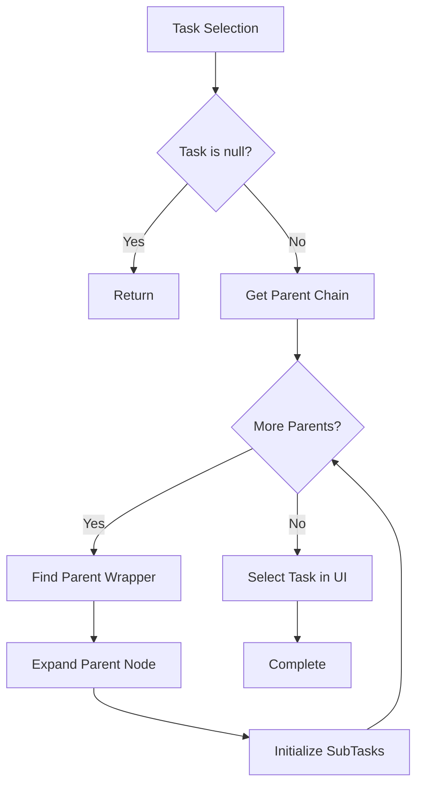
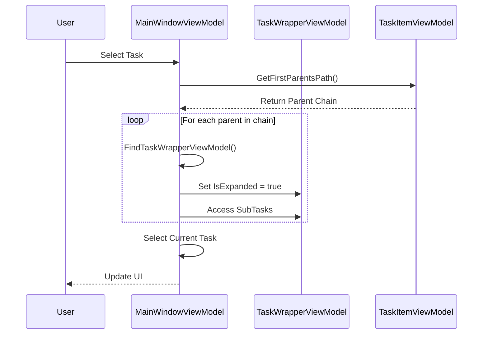
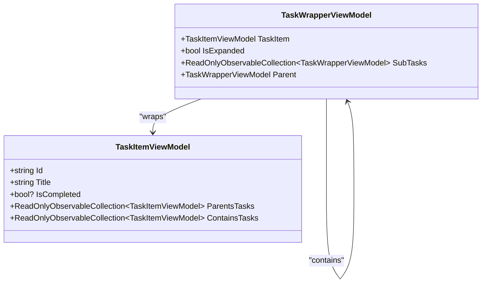
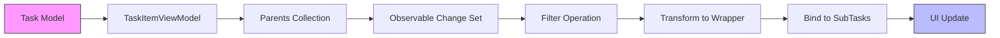
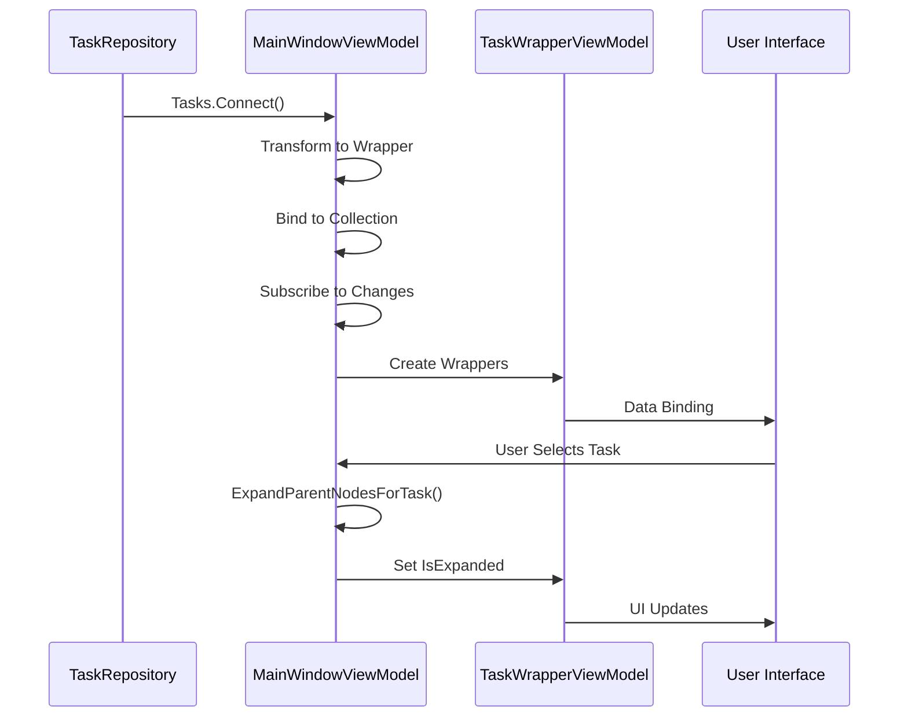
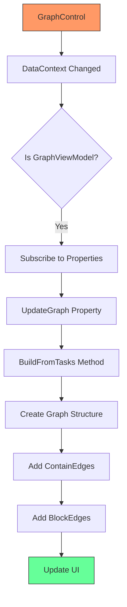
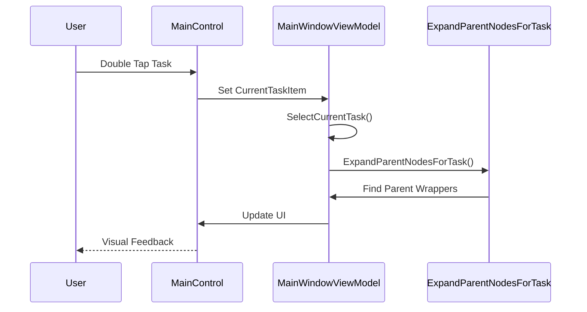
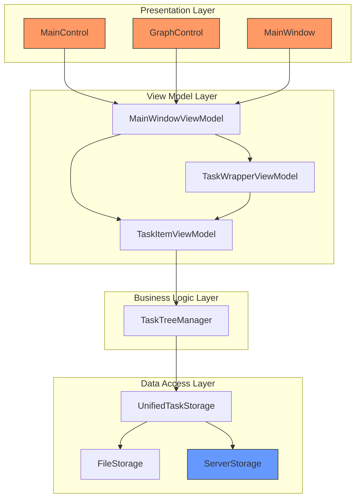
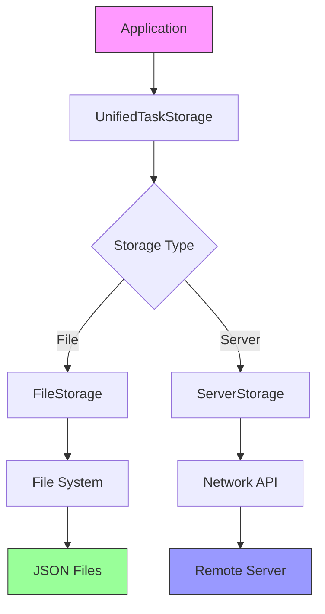
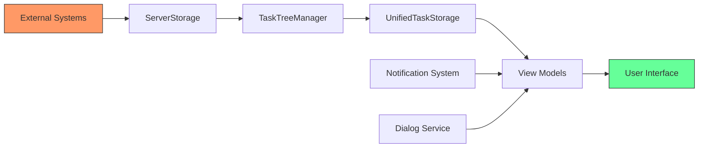

# Parent Node Expansion

<cite>
**Referenced Files in This Document**   
- [MainWindowViewModel.cs](file://src/Unlimotion.ViewModel/MainWindowViewModel.cs)
- [TaskItemViewModel.cs](file://src/Unlimotion.ViewModel/TaskItemViewModel.cs)
- [TaskWrapperViewModel.cs](file://src/Unlimotion.ViewModel/TaskWrapperViewModel.cs)
- [GraphControl.axaml.cs](file://src/Unlimotion/Views/GraphControl.axaml.cs)
- [MainControl.axaml.cs](file://src/Unlimotion/Views/MainControl.axaml.cs)
- [TaskTreeManager.cs](file://src/Unlimotion.TaskTreeManager/TaskTreeManager.cs)
- [TaskStorages.cs](file://src/Unlimotion/TaskStorages.cs)
- [FileStorage.cs](file://src/Unlimotion/FileStorage.cs)
- [UnifiedTaskStorage.cs](file://src/Unlimotion/UnifiedTaskStorage.cs)
</cite>

## Table of Contents
1. [Introduction](#introduction)
2. [Core Components](#core-components)
3. [Parent Node Expansion Mechanism](#parent-node-expansion-mechanism)
4. [Task Hierarchy and Relationships](#task-hierarchy-and-relationships)
5. [Data Flow and State Management](#data-flow-and-state-management)
6. [User Interface Integration](#user-interface-integration)
7. [Architecture Overview](#architecture-overview)
8. [Dependency Analysis](#dependency-analysis)
9. [Conclusion](#conclusion)

## Introduction
The Unlimotion application implements a sophisticated parent node expansion system that enables users to navigate complex task hierarchies efficiently. This documentation provides a comprehensive analysis of the parent node expansion functionality, detailing how the system manages task relationships, maintains state, and provides an intuitive user experience. The system is built on a reactive architecture that ensures consistent state management across the application, with parent node expansion being a critical feature for navigating nested task structures.

## Core Components

The parent node expansion functionality in Unlimotion relies on several core components that work together to manage task hierarchies and user interface state. The `MainWindowViewModel` serves as the central coordinator, managing the state of task items and their visual representation. The `TaskItemViewModel` represents individual tasks with their properties and relationships, while the `TaskWrapperViewModel` provides a wrapper that includes UI-specific state such as expansion status. The system uses reactive programming patterns to ensure that changes in task relationships are automatically reflected in the user interface.

The implementation follows the Model-View-ViewModel (MVVM) pattern, with clear separation between data models, view models, and user interface components. This architecture enables efficient parent node expansion by decoupling the business logic from the presentation layer. The system also incorporates a task tree manager that handles complex operations like creating and breaking parent-child relationships, ensuring data consistency across the application.

**Section sources**
- [MainWindowViewModel.cs](file://src/Unlimotion.ViewModel/MainWindowViewModel.cs#L832-L1116)
- [TaskItemViewModel.cs](file://src/Unlimotion.ViewModel/TaskItemViewModel.cs#L466-L480)
- [TaskWrapperViewModel.cs](file://src/Unlimotion.ViewModel/TaskWrapperViewModel.cs#L96-L97)

## Parent Node Expansion Mechanism

### Expansion Algorithm
The parent node expansion mechanism in Unlimotion is designed to automatically expand the hierarchy path when a user selects a deeply nested task. This ensures that users can always see the context of the selected task within the overall hierarchy. The algorithm works by tracing the parent chain from the selected task back to the root, then expanding each parent node in sequence.

The core method `ExpandParentNodesForTask` in `MainWindowViewModel` implements this functionality. When a task is selected, the method first retrieves the complete parent chain using the `GetFirstParentsPath` method from `TaskItemViewModel`. It then iterates through each parent in the chain, finds the corresponding `TaskWrapperViewModel`, and sets its `IsExpanded` property to true. This approach ensures that the entire path from root to the selected task is visible to the user.



**Diagram sources**
- [MainWindowViewModel.cs](file://src/Unlimotion.ViewModel/MainWindowViewModel.cs#L1079-L1104)
- [TaskItemViewModel.cs](file://src/Unlimotion.ViewModel/TaskItemViewModel.cs#L466-L480)

### Path Traversal and Node Finding
The system uses a two-step process to locate and expand parent nodes. First, it retrieves the parent chain using the `GetFirstParentsPath` method, which returns an enumerable collection of parent tasks ordered from root to immediate parent. This method uses a stack-based approach to reverse the traversal order, ensuring that parents are processed from the root downward.

Second, the system uses the `FindTaskWrapperViewModel` method to locate the UI representation of each task in the hierarchy. This method employs a hybrid search strategy that first attempts a direct lookup in the current collection, and if that fails, traverses the parent hierarchy to find the target task. This approach efficiently handles both flat and deeply nested task structures.



**Diagram sources**
- [MainWindowViewModel.cs](file://src/Unlimotion.ViewModel/MainWindowViewModel.cs#L1054-L1077)
- [TaskItemViewModel.cs](file://src/Unlimotion.ViewModel/TaskItemViewModel.cs#L466-L480)

## Task Hierarchy and Relationships

### Parent-Child Relationships
Unlimotion implements a flexible parent-child relationship system that allows tasks to have multiple parents. This many-to-many relationship structure enables complex task hierarchies where a single task can belong to multiple projects or categories. The relationships are managed through collections of task IDs in the `TaskItem` model, with `Parents` and `Contains` collections tracking the bidirectional relationship.

The system maintains data consistency through the `TaskTreeManager`, which handles the creation and deletion of parent-child relationships. When a parent-child relationship is established, both tasks are updated to reflect the connection, and the availability of affected tasks is recalculated. This ensures that the task hierarchy remains consistent and that business rules are enforced.

```mermaid
erDiagram
TASK_ITEM ||--o{ PARENT_RELATIONSHIP : "has"
TASK_ITEM ||--o{ CHILD_RELATIONSHIP : "contains"
PARENT_RELATIONSHIP }|--|| TASK_ITEM : "is parent of"
CHILD_RELATIONSHIP }|--|| TASK_ITEM : "is child of"
class TASK_ITEM "TaskItemViewModel"
class PARENT_RELATIONSHIP "ParentsTasks"
class CHILD_RELATIONSHIP "ContainsTasks"
```

**Diagram sources**
- [TaskItemViewModel.cs](file://src/Unlimotion.ViewModel/TaskItemViewModel.cs#L428-L431)
- [TaskTreeManager.cs](file://src/Unlimotion.TaskTreeManager/TaskTreeManager.cs#L525-L559)

### Task Wrapping and UI State
The `TaskWrapperViewModel` class plays a crucial role in managing UI state for tasks, including expansion status. Each wrapper contains a reference to its underlying `TaskItemViewModel` and maintains UI-specific properties like `IsExpanded` and `BreadScrumbs`. The wrapper also manages the `SubTasks` collection, which is lazily initialized when needed.

The wrapper system enables efficient rendering of task hierarchies by separating the data model from the presentation state. When a parent node is expanded, the wrapper ensures that its `SubTasks` collection is initialized, which triggers the creation of wrappers for child tasks. This lazy loading approach improves performance by only creating UI elements for visible tasks.



**Diagram sources**
- [TaskWrapperViewModel.cs](file://src/Unlimotion.ViewModel/TaskWrapperViewModel.cs#L70-L125)
- [TaskItemViewModel.cs](file://src/Unlimotion.ViewModel/TaskItemViewModel.cs#L428-L431)

## Data Flow and State Management

### Reactive Data Binding
Unlimotion employs a reactive programming model to manage data flow and state synchronization. The system uses `ObservableCollection` and reactive extensions to automatically update the UI when underlying data changes. When a task's parent relationships change, the `ParentsTasks` collection is updated, which triggers recomputation of parent chains and UI state.

The `TaskWrapperViewModel` uses `Transform` and `Bind` operators from DynamicData to create observable collections of child wrappers. This reactive approach ensures that the UI automatically reflects changes in the task hierarchy without requiring manual refresh operations. The system also uses throttling to prevent excessive updates during rapid changes.



**Diagram sources**
- [TaskItemViewModel.cs](file://src/Unlimotion.ViewModel/TaskItemViewModel.cs#L70-L82)
- [TaskWrapperViewModel.cs](file://src/Unlimotion.ViewModel/TaskWrapperViewModel.cs#L104-L118)

### State Initialization and Propagation
The system initializes task state through a comprehensive setup process in the `MainWindowViewModel`. When the application starts, it connects to the task repository and transforms task items into wrapped view models. The `ExpandParentNodesForTask` method is subscribed to changes in the task collection, ensuring that parent nodes are expanded whenever the task hierarchy changes.

State propagation occurs through a chain of reactive subscriptions. When a task is selected, the `CurrentTaskItem` property change triggers the `SelectCurrentTask` method, which in turn calls `ExpandParentNodesForTask`. This method updates the expansion state of parent wrappers, which automatically propagates to the UI through data binding.



**Diagram sources**
- [MainWindowViewModel.cs](file://src/Unlimotion.ViewModel/MainWindowViewModel.cs#L817-L842)
- [TaskWrapperViewModel.cs](file://src/Unlimotion.ViewModel/TaskWrapperViewModel.cs#L104-L118)

## User Interface Integration

### Graph Visualization
The parent node expansion functionality is tightly integrated with the graph visualization component in Unlimotion. The `GraphControl` renders task relationships as a directed graph, with containment relationships represented by `ContainEdge` objects and blocking relationships by `BlockEdge` objects. When parent nodes are expanded, the graph automatically updates to reflect the current view.

The graph control listens for changes in the `UpdateGraph` property of the `GraphViewModel`, which triggers a rebuild of the graph structure. This ensures that the visualization stays in sync with the expanded state of task nodes. The system also supports keyboard shortcuts for graph manipulation, including fit-to-view and reset operations.



**Diagram sources**
- [GraphControl.axaml.cs](file://src/Unlimotion/Views/GraphControl.axaml.cs#L82-L183)
- [ContainEdge.cs](file://src/Unlimotion/Views/Graph/ContainEdge.cs#L5-L7)
- [BlockEdge.cs](file://src/Unlimotion/Views/Graph/BlockEdge.cs#L5-L7)

### Interaction Handling
User interactions with task nodes are handled through event handlers in the `MainControl` class. When a user double-taps a task, the `Task_OnDoubleTapped` method updates the `CurrentTaskItem` in the view model, which triggers the parent node expansion process. The control also handles drag-and-drop operations for reorganizing tasks within the hierarchy.

The system uses a consistent event handling pattern across different interaction types. Pointer events are captured and processed to determine the appropriate action, whether it's selecting a task, initiating a drag operation, or performing a context-specific action. This unified approach ensures a consistent user experience across different input methods.



**Diagram sources**
- [MainControl.axaml.cs](file://src/Unlimotion/Views/MainControl.axaml.cs#L249-L257)
- [MainWindowViewModel.cs](file://src/Unlimotion.ViewModel/MainWindowViewModel.cs#L963-L999)

## Architecture Overview

### Component Interactions
The parent node expansion system in Unlimotion consists of several interconnected components that work together to provide a seamless user experience. The architecture follows a layered approach with clear separation of concerns between data storage, business logic, and presentation layers.

The `TaskTreeManager` serves as the central business logic component, handling all operations related to task relationships and state. It interacts with the `IStorage` interface to persist data, while the `UnifiedTaskStorage` provides a unified API for both file and server storage. The view models consume this API to provide data to the user interface components.



**Diagram sources**
- [TaskStorages.cs](file://src/Unlimotion/TaskStorages.cs#L168-L185)
- [UnifiedTaskStorage.cs](file://src/Unlimotion/UnifiedTaskStorage.cs#L18-L22)
- [TaskTreeManager.cs](file://src/Unlimotion.TaskTreeManager/TaskTreeManager.cs#L13-L18)

### Data Storage and Retrieval
The system supports multiple storage backends through a common interface, allowing tasks to be stored either in local files or on a remote server. The `IStorage` interface defines the contract for data operations, with implementations for file storage (`FileStorage`) and server storage (`ServerStorage`). The `UnifiedTaskStorage` class provides a consistent API regardless of the underlying storage mechanism.

Data retrieval is optimized for performance, with lazy loading of task relationships and caching of frequently accessed data. The system uses reactive patterns to push updates to subscribers when data changes, ensuring that all components have access to the most current information.



**Diagram sources**
- [IStorage.cs](file://src/Unlimotion.TaskTreeManager/IStorage.cs#L8-L19)
- [FileStorage.cs](file://src/Unlimotion/FileStorage.cs#L120-L159)
- [UnifiedTaskStorage.cs](file://src/Unlimotion/UnifiedTaskStorage.cs#L18-L22)

## Dependency Analysis

### Core Dependencies
The parent node expansion functionality depends on several key components and libraries that provide essential capabilities. The system relies heavily on reactive programming libraries like ReactiveUI and DynamicData to manage data flow and state changes. These libraries enable the automatic propagation of changes through the system, reducing the need for manual event handling.

The application also depends on Avalonia, a cross-platform UI framework, for rendering the user interface. The graph visualization component uses AvaloniaGraphControl to render task relationships as a directed graph. These dependencies are managed through NuGet packages and are essential for the core functionality of the application.

**Section sources**
- [Unlimotion.csproj](file://src/Unlimotion/Unlimotion.csproj)
- [Unlimotion.ViewModel.csproj](file://src/Unlimotion.ViewModel/Unlimotion.ViewModel.csproj)

### Integration Points
The system integrates with external components through well-defined interfaces and events. The `TaskStorageUpdateEventArgs` class provides a mechanism for notifying subscribers of changes to the task storage, enabling loose coupling between components. The `Locator` service from Splat is used for dependency injection, allowing components to access shared services without tight coupling.

The application also supports integration with external systems through the server storage interface, which could be extended to support additional backends. This modular design allows for easy extension and maintenance of the system.



**Diagram sources**
- [TaskStorageUpdateEventArgs.cs](file://src/Unlimotion.TaskTreeManager/TaskStorageUpdateEventArgs.cs)
- [TaskTreeManager.cs](file://src/Unlimotion.TaskTreeManager/TaskTreeManager.cs#L13-L18)

## Conclusion
The parent node expansion system in Unlimotion demonstrates a sophisticated implementation of hierarchical data navigation in a task management application. By combining reactive programming patterns with a clean MVVM architecture, the system provides an intuitive user experience while maintaining data consistency and performance. The design emphasizes separation of concerns, with clear boundaries between data storage, business logic, and presentation layers.

The implementation effectively addresses the challenges of navigating complex task hierarchies by automatically expanding parent nodes when a task is selected, ensuring that users always have context for their current task. The use of reactive extensions and observable collections enables efficient state management and automatic UI updates, reducing the complexity of event handling and data synchronization.

Future enhancements could include support for multiple expansion paths when tasks have multiple parents, improved performance optimizations for very large task hierarchies, and additional visualization options for complex relationships. The modular architecture of the system makes it well-suited for these extensions while maintaining the core functionality and user experience.