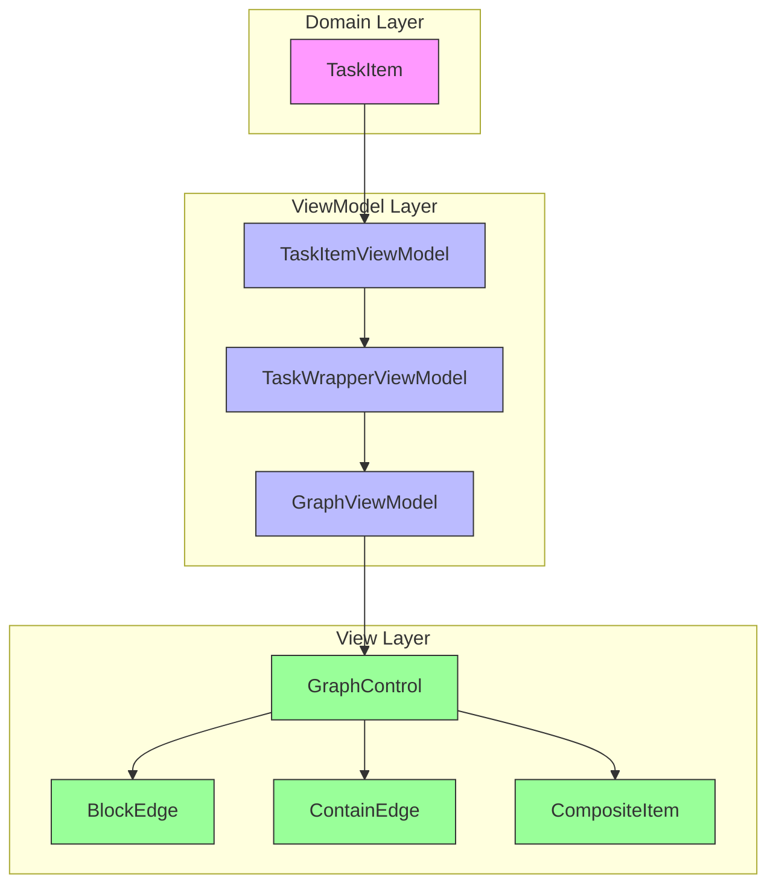
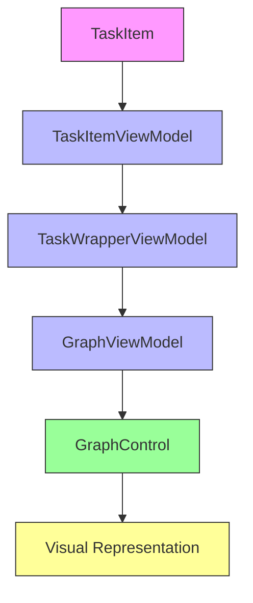
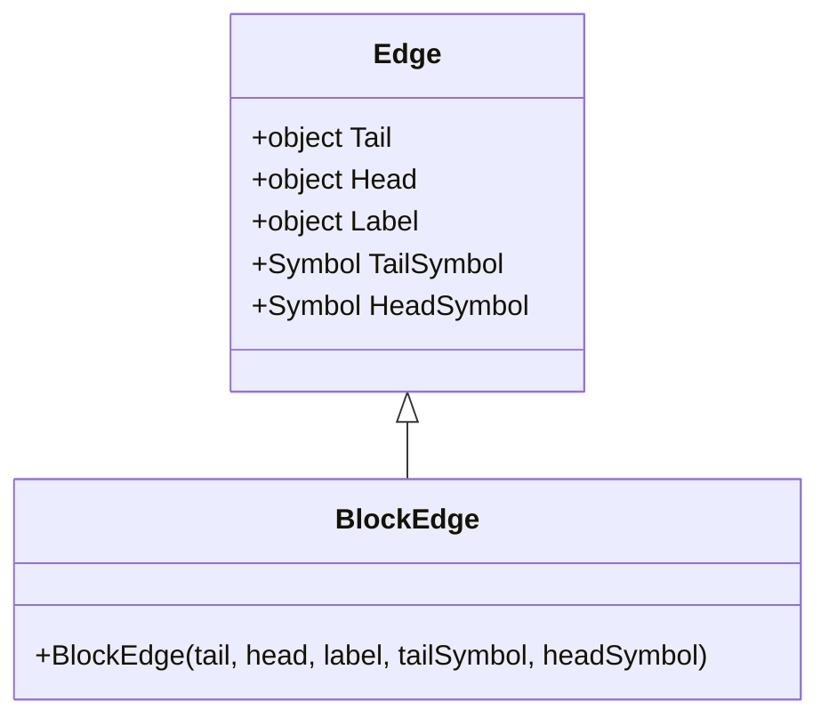
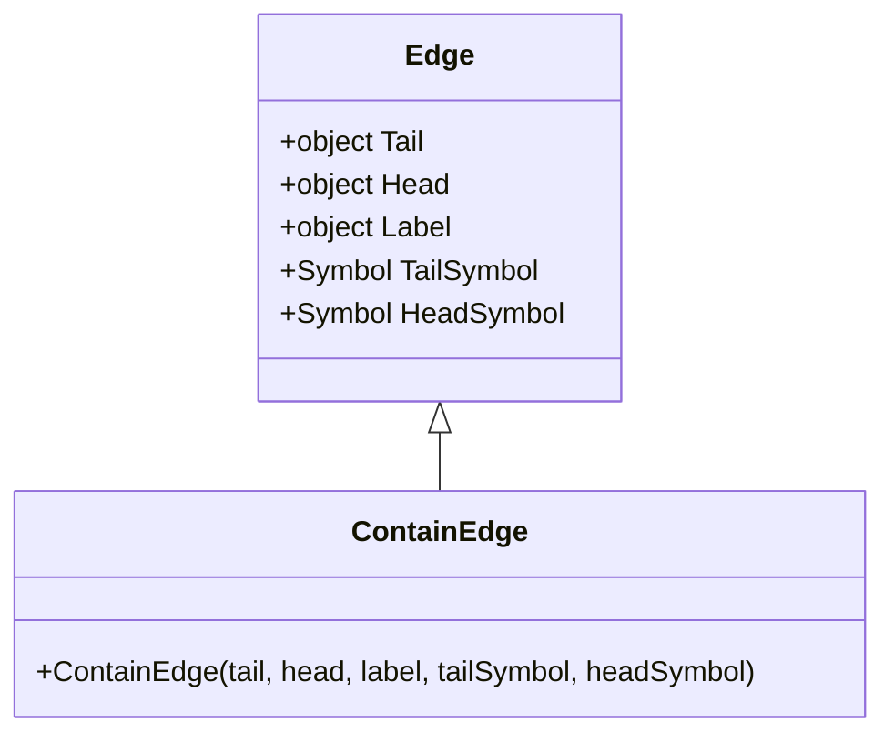
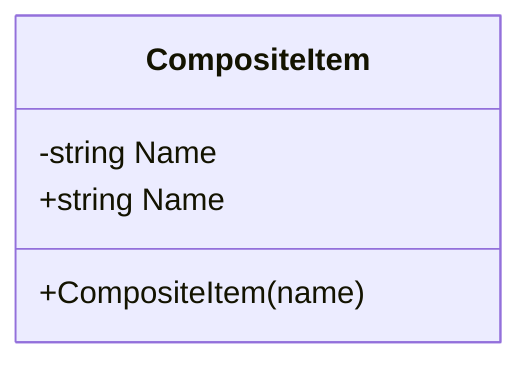

# Roadmap Visualization

<cite>
**Referenced Files in This Document**   
- [GraphControl.axaml.cs](file://src/Unlimotion/Views/GraphControl.axaml.cs)
- [BlockEdge.cs](file://src/Unlimotion/Views/Graph/BlockEdge.cs)
- [ContainEdge.cs](file://src/Unlimotion/Views/Graph/ContainEdge.cs)
- [CompositeItem.cs](file://src/Unlimotion/Views/Graph/CompositeItem.cs)
- [TaskItemViewModel.cs](file://src/Unlimotion.ViewModel/TaskItemViewModel.cs)
- [TaskItem.cs](file://src/Unlimotion.Domain/TaskItem.cs)
- [TaskWrapperViewModel.cs](file://src/Unlimotion.ViewModel/TaskWrapperViewModel.cs)
- [MainWindowViewModel.cs](file://src/Unlimotion.ViewModel/MainWindowViewModel.cs)
- [GraphViewModel.cs](file://src/Unlimotion.ViewModel/GraphViewModel.cs)
</cite>

## Table of Contents
1. [Introduction](#introduction)
2. [Architecture Overview](#architecture-overview)
3. [Core Components](#core-components)
4. [Data Flow and Graph Construction](#data-flow-and-graph-construction)
5. [Edge Types and Visual Relationships](#edge-types-and-visual-relationships)
6. [Composite Task Management](#composite-task-management)
7. [Performance Considerations](#performance-considerations)
8. [Customization and Behavior](#customization-and-behavior)

## Introduction
The roadmap visualization system in Unlimotion implements a graph-based view using MSAGL (Microsoft Automatic Graph Layout) through the GraphControl and GraphViewModel components. This system provides a visual representation of task relationships, dependencies, and hierarchies, enabling users to understand complex task networks at a glance. The implementation leverages AvaloniaGraphControl for rendering and layout management, with specialized edge types to distinguish between different kinds of task relationships.

## Architecture Overview
The roadmap visualization architecture follows a clean separation between data models, view models, and UI components. The system is built around the MVVM (Model-View-ViewModel) pattern, with data flowing from domain models through view models to the graphical representation.

**Diagram sources**
- [TaskItem.cs](file://src/Unlimotion.Domain/TaskItem.cs)
- [TaskItemViewModel.cs](file://src/Unlimotion.ViewModel/TaskItemViewModel.cs)
- [TaskWrapperViewModel.cs](file://src/Unlimotion.ViewModel/TaskWrapperViewModel.cs)
- [GraphViewModel.cs](file://src/Unlimotion.ViewModel/GraphViewModel.cs)
- [GraphControl.axaml.cs](file://src/Unlimotion/Views/GraphControl.axaml.cs)

**Section sources**
- [GraphControl.axaml.cs](file://src/Unlimotion/Views/GraphControl.axaml.cs)
- [MainWindowViewModel.cs](file://src/Unlimotion.ViewModel/MainWindowViewModel.cs)

## Core Components

### GraphControl
The GraphControl component serves as the primary UI element for displaying the roadmap visualization. It inherits from Avalonia's UserControl and integrates with the AvaloniaGraphControl library to render task relationships. The control subscribes to changes in its DataContext (GraphViewModel) and automatically updates the graph when task collections or filtering options change. It implements throttled updates to prevent excessive rendering during rapid data changes.

### GraphViewModel
The GraphViewModel acts as the intermediary between the application's task data and the GraphControl. It exposes collections of tasks (both all tasks and unlocked tasks) and filtering properties that control which tasks are displayed in the roadmap. The view model responds to changes in filtering options and task collections by signaling the GraphControl to rebuild the visual representation.

**Section sources**
- [GraphControl.axaml.cs](file://src/Unlimotion/Views/GraphControl.axaml.cs)
- [GraphViewModel.cs](file://src/Unlimotion.ViewModel/GraphViewModel.cs)

## Data Flow and Graph Construction

### Data Flow from TaskItemViewModel to Visualization
The data flow begins with TaskItem domain objects that are wrapped in TaskItemViewModel instances. These view models are then wrapped in TaskWrapperViewModel instances, which provide hierarchical context for rendering in the graph. The GraphViewModel exposes collections of these wrappers, which the GraphControl uses to construct the visual graph.

**Diagram sources**
- [TaskItem.cs](file://src/Unlimotion.Domain/TaskItem.cs)
- [TaskItemViewModel.cs](file://src/Unlimotion.ViewModel/TaskItemViewModel.cs)
- [TaskWrapperViewModel.cs](file://src/Unlimotion.ViewModel/TaskWrapperViewModel.cs)
- [GraphViewModel.cs](file://src/Unlimotion.ViewModel/GraphViewModel.cs)
- [GraphControl.axaml.cs](file://src/Unlimotion/Views/GraphControl.axaml.cs)

### Graph Construction Process
The BuildFromTasks method in GraphControl is responsible for constructing the visual graph from task data. The process involves:

1. Creating a new graph instance with horizontal orientation
2. Processing tasks and their relationships using a queue-based algorithm
3. Adding containment and blocking relationships as edges
4. Handling tasks without relationships by creating self-referential edges
5. Updating the UI with the constructed graph

The algorithm ensures that all task relationships are properly represented while avoiding duplicate processing through hash set tracking.

**Section sources**
- [GraphControl.axaml.cs](file://src/Unlimotion/Views/GraphControl.axaml.cs#L100-L200)

## Edge Types and Visual Relationships

### BlockEdge Implementation
The BlockEdge class represents blocking relationships between tasks, where one task must be completed before another can begin. It inherits from the base Edge class and configures the visual representation with a directional arrow to indicate the dependency flow.

**Diagram sources**
- [BlockEdge.cs](file://src/Unlimotion/Views/Graph/BlockEdge.cs)

### ContainEdge Implementation
The ContainEdge class represents hierarchical containment relationships, where one task contains subtasks. Like BlockEdge, it inherits from the base Edge class but is used to display parent-child task relationships in the roadmap.

**Diagram sources**
- [ContainEdge.cs](file://src/Unlimotion/Views/Graph/ContainEdge.cs)

### Visual Differentiation of Relationships
The roadmap visualization distinguishes between blocking and containment relationships through their semantic meaning rather than visual styling, as both edge types use similar visual properties (arrowheads). The differentiation occurs in how these edges are created during graph construction:

- **Blocking relationships**: Created when processing a task's BlocksTasks collection
- **Containment relationships**: Created when processing a task's SubTasks collection

The system ensures that containment edges are only created when appropriate by checking for blocking conditions that would invalidate the containment relationship.

**Section sources**
- [GraphControl.axaml.cs](file://src/Unlimotion/Views/GraphControl.axaml.cs#L130-L180)

## Composite Task Management

### CompositeItem Implementation
The CompositeItem class provides a mechanism for grouping related tasks in the visualization. It serves as a container for tasks that share common characteristics or belong to the same logical group.

**Diagram sources**
- [CompositeItem.cs](file://src/Unlimotion/Views/Graph/CompositeItem.cs)

### Grouped Task Representation
CompositeItem enables the visualization of grouped tasks by providing a named container that can hold multiple task items. This allows the roadmap to display logical groupings of tasks, making complex task networks more comprehensible. The grouping functionality works in conjunction with the filtering and sorting capabilities of the GraphViewModel to organize tasks meaningfully.

**Section sources**
- [CompositeItem.cs](file://src/Unlimotion/Views/Graph/CompositeItem.cs)

## Performance Considerations

### Optimization Strategies
The roadmap visualization implements several performance optimizations to handle large task networks efficiently:

1. **Throttled Updates**: Changes to task collections are throttled with a 100ms delay to prevent excessive graph rebuilds during rapid data changes
2. **Efficient Data Structures**: HashSet and Queue collections are used for O(1) lookups and efficient traversal of task relationships
3. **Incremental Updates**: The graph is only rebuilt when necessary, based on changes to the underlying data or filtering options
4. **Disposable Pattern**: Event subscriptions are properly managed and disposed to prevent memory leaks

### Large Network Handling
For large task networks, the system employs a queue-based processing algorithm that efficiently traverses task relationships without recursion, preventing stack overflow issues. The use of ReadOnlyObservableCollection with reactive extensions ensures that only changed data triggers updates, minimizing unnecessary processing.

**Section sources**
- [GraphControl.axaml.cs](file://src/Unlimotion/Views/GraphControl.axaml.cs#L50-L80)

## Customization and Behavior

### Keyboard Navigation
The GraphControl implements keyboard shortcuts for navigation and view manipulation:
- **F**: Fill view
- **U**: Uniform scaling
- **R**: Reset transformation matrix
- **T**: Toggle stretch mode and auto-fit

These shortcuts enhance usability by providing quick access to common view operations.

### Drag and Drop Support
The control supports drag-and-drop operations for task manipulation, allowing users to reorganize tasks directly in the visualization. The drag operation is initiated through pointer press events and uses a custom data format for task transfer.

### Customization Points
The roadmap visualization can be customized through several extension points:
- **Graph orientation**: Currently set to horizontal, but could be modified
- **Edge styling**: Base Edge class parameters allow for visual customization
- **Filtering logic**: GraphViewModel exposes properties that control task visibility
- **Layout algorithms**: Underlying MSAGL library provides various layout options

**Section sources**
- [GraphControl.axaml.cs](file://src/Unlimotion/Views/GraphControl.axaml.cs#L210-L230)