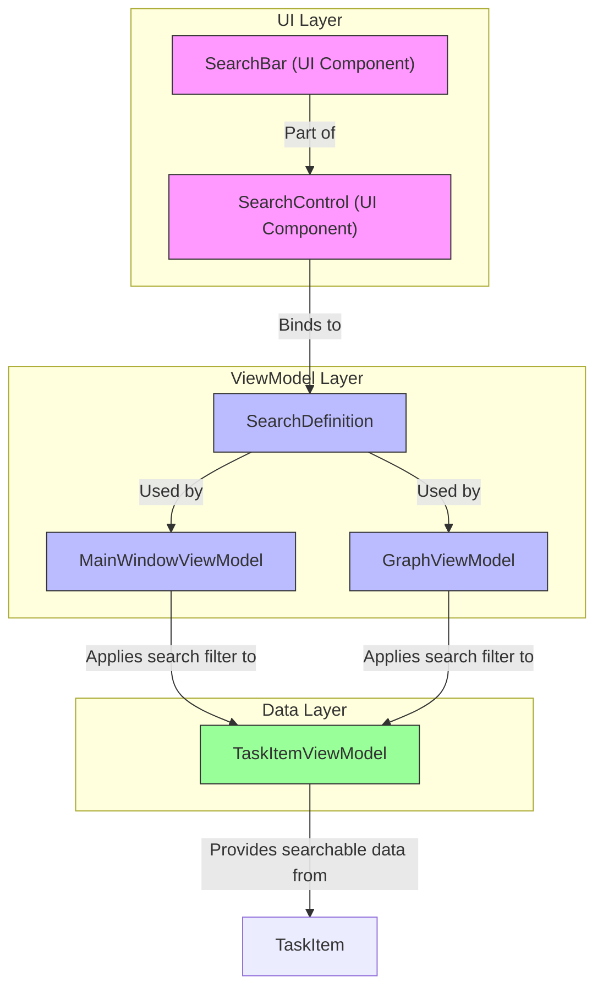
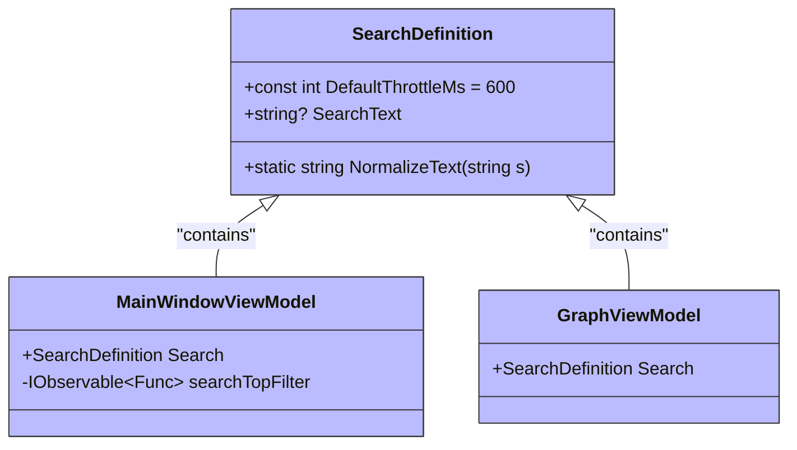
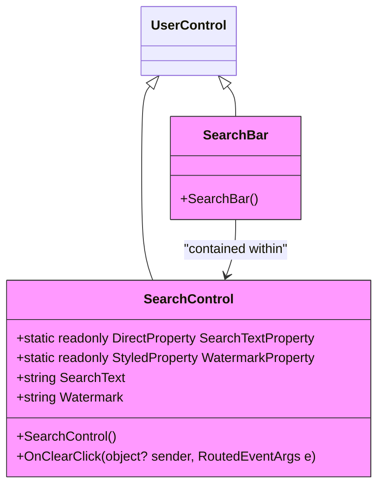
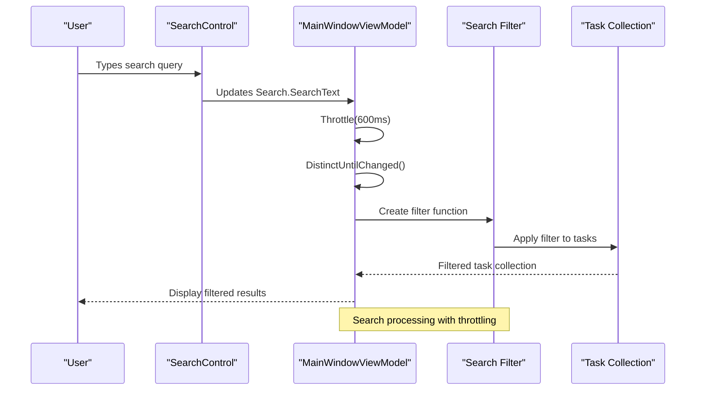
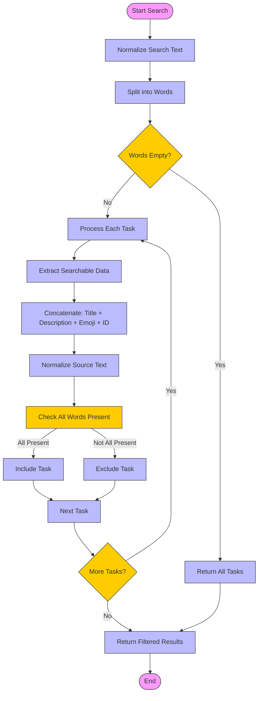
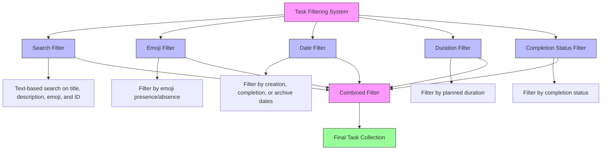

# Search Functionality

<cite>
**Referenced Files in This Document**   
- [SearchDefinition.cs](file://src/Unlimotion.ViewModel/SearchDefinition.cs)
- [SearchControl.axaml.cs](file://src/Unlimotion/Views/SearchControl/SearchControl.axaml.cs)
- [SearchBar.axaml.cs](file://src/Unlimotion/Views/SearchControl/SearchBar.axaml.cs)
- [MainWindowViewModel.cs](file://src/Unlimotion.ViewModel/MainWindowViewModel.cs)
- [GraphControl.axaml.cs](file://src/Unlimotion/Views/GraphControl.axaml.cs)
- [TaskItemViewModel.cs](file://src/Unlimotion.ViewModel/TaskItemViewModel.cs)
- [GraphViewModel.cs](file://src/Unlimotion.ViewModel/GraphViewModel.cs)
</cite>

## Table of Contents
1. [Introduction](#introduction)
2. [Search Architecture Overview](#search-architecture-overview)
3. [Core Search Components](#core-search-components)
4. [Search Implementation Details](#search-implementation-details)
5. [Search UI Components](#search-ui-components)
6. [Search Algorithm and Text Processing](#search-algorithm-and-text-processing)
7. [Search Integration with Task Filtering](#search-integration-with-task-filtering)
8. [Performance Considerations](#performance-considerations)
9. [Conclusion](#conclusion)

## Introduction
The Unlimotion application implements a comprehensive search functionality that allows users to find tasks based on various criteria including text content, emojis, and task properties. The search system is integrated throughout the application and provides real-time filtering with throttling to optimize performance. This document details the architecture, implementation, and integration of the search functionality within the Unlimotion application.

## Search Architecture Overview

**Diagram sources**
- [SearchControl.axaml.cs](file://src/Unlimotion/Views/SearchControl/SearchControl.axaml.cs)
- [SearchDefinition.cs](file://src/Unlimotion.ViewModel/SearchDefinition.cs)
- [MainWindowViewModel.cs](file://src/Unlimotion.ViewModel/MainWindowViewModel.cs)
- [GraphViewModel.cs](file://src/Unlimotion.ViewModel/GraphViewModel.cs)
- [TaskItemViewModel.cs](file://src/Unlimotion.ViewModel/TaskItemViewModel.cs)

**Section sources**
- [SearchControl.axaml.cs](file://src/Unlimotion/Views/SearchControl/SearchControl.axaml.cs)
- [SearchDefinition.cs](file://src/Unlimotion.ViewModel/SearchDefinition.cs)
- [MainWindowViewModel.cs](file://src/Unlimotion.ViewModel/MainWindowViewModel.cs)

## Core Search Components

The search functionality in Unlimotion is built around several key components that work together to provide a seamless search experience. The core components include the SearchDefinition class, which holds the search state, and the UI controls that allow users to input search queries.

The SearchDefinition class serves as the central data structure for search operations, containing the search text and utility methods for text normalization. This class is used by multiple view models throughout the application to maintain a consistent search state.

**Diagram sources**
- [SearchDefinition.cs](file://src/Unlimotion.ViewModel/SearchDefinition.cs)
- [MainWindowViewModel.cs](file://src/Unlimotion.ViewModel/MainWindowViewModel.cs)
- [GraphViewModel.cs](file://src/Unlimotion.ViewModel/GraphViewModel.cs)

**Section sources**
- [SearchDefinition.cs](file://src/Unlimotion.ViewModel/SearchDefinition.cs)
- [MainWindowViewModel.cs](file://src/Unlimotion.ViewModel/MainWindowViewModel.cs)
- [GraphViewModel.cs](file://src/Unlimotion.ViewModel/GraphViewModel.cs)

## Search UI Components

The user interface for search consists of two main components: SearchControl and SearchBar. These components provide the visual interface for users to input search queries and clear them when needed.

**Diagram sources**
- [SearchControl.axaml.cs](file://src/Unlimotion/Views/SearchControl/SearchControl.axaml.cs)
- [SearchBar.axaml.cs](file://src/Unlimotion/Views/SearchControl/SearchBar.axaml.cs)

**Section sources**
- [SearchControl.axaml.cs](file://src/Unlimotion/Views/SearchControl/SearchControl.axaml.cs)
- [SearchBar.axaml.cs](file://src/Unlimotion/Views/SearchControl/SearchBar.axaml.cs)

## Search Implementation Details

The search functionality is implemented using reactive programming patterns with the ReactiveUI framework. When a user types in the search box, the search text is processed through a series of operators that throttle the input, filter out unchanged values, and apply the search filter to the task collection.

**Diagram sources**
- [MainWindowViewModel.cs](file://src/Unlimotion.ViewModel/MainWindowViewModel.cs)
- [SearchControl.axaml.cs](file://src/Unlimotion/Views/SearchControl/SearchControl.axaml.cs)

**Section sources**
- [MainWindowViewModel.cs](file://src/Unlimotion.ViewModel/MainWindowViewModel.cs)
- [SearchControl.axaml.cs](file://src/Unlimotion/Views/SearchControl/SearchControl.axaml.cs)

## Search Algorithm and Text Processing

The search algorithm in Unlimotion processes text queries by normalizing the search input and comparing it against multiple fields of task items. The text normalization process ensures that searches are case-insensitive and handle Unicode characters properly.

**Diagram sources**
- [SearchDefinition.cs](file://src/Unlimotion.ViewModel/SearchDefinition.cs)
- [MainWindowViewModel.cs](file://src/Unlimotion.ViewModel/MainWindowViewModel.cs)
- [TaskItemViewModel.cs](file://src/Unlimotion.ViewModel/TaskItemViewModel.cs)

**Section sources**
- [SearchDefinition.cs](file://src/Unlimotion.ViewModel/SearchDefinition.cs)
- [MainWindowViewModel.cs](file://src/Unlimotion.ViewModel/MainWindowViewModel.cs)
- [TaskItemViewModel.cs](file://src/Unlimotion.ViewModel/TaskItemViewModel.cs)

## Search Integration with Task Filtering

The search functionality is integrated with other filtering mechanisms in the application, such as emoji filtering and date filtering. These filters work together to provide a comprehensive task filtering experience.

**Diagram sources**
- [MainWindowViewModel.cs](file://src/Unlimotion.ViewModel/MainWindowViewModel.cs)
- [TaskItemViewModel.cs](file://src/Unlimotion.ViewModel/TaskItemViewModel.cs)

**Section sources**
- [MainWindowViewModel.cs](file://src/Unlimotion.ViewModel/MainWindowViewModel.cs)

## Performance Considerations

The search implementation includes several performance optimizations to ensure a responsive user experience. The most significant optimization is the use of throttling, which delays the application of search filters until the user has stopped typing for a specified period.

The default throttle time is set to 600 milliseconds, which strikes a balance between responsiveness and performance. This prevents the application from performing expensive filtering operations on every keystroke, which would degrade performance, especially with large task collections.

Additionally, the search implementation uses reactive programming patterns that efficiently handle changes to the search text and only re-evaluate the filter when necessary. The DistinctUntilChanged operator ensures that the filter is not reapplied when the search text hasn't actually changed.

**Section sources**
- [SearchDefinition.cs](file://src/Unlimotion.ViewModel/SearchDefinition.cs)
- [MainWindowViewModel.cs](file://src/Unlimotion.ViewModel/MainWindowViewModel.cs)

## Conclusion
The search functionality in Unlimotion provides a robust and efficient way for users to find tasks within their task hierarchy. By combining text search with other filtering mechanisms like emoji and date filtering, the application offers a comprehensive task discovery experience. The implementation leverages reactive programming patterns to create a responsive interface while maintaining good performance through throttling and efficient filtering operations. The modular design with the SearchDefinition class allows the search functionality to be easily integrated across different parts of the application.