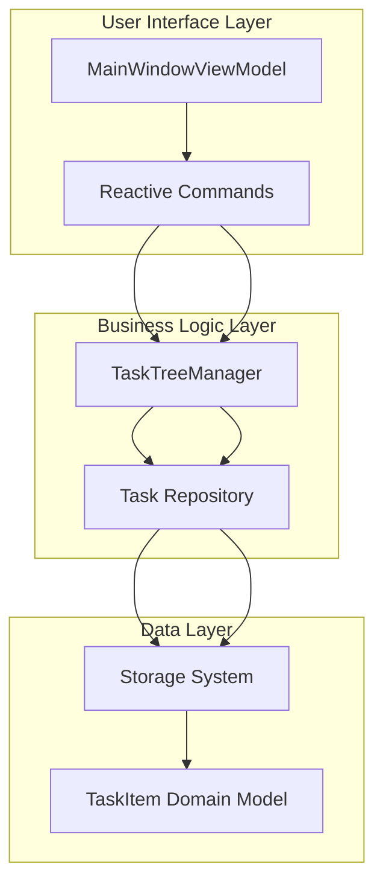
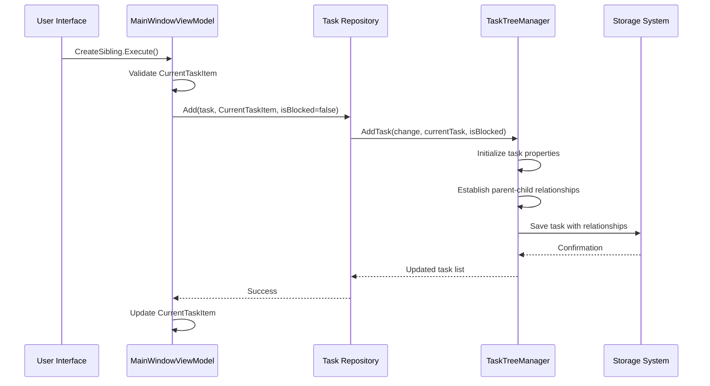
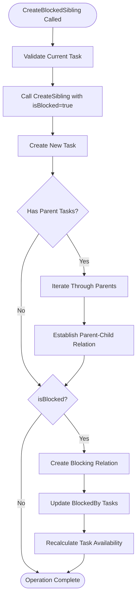
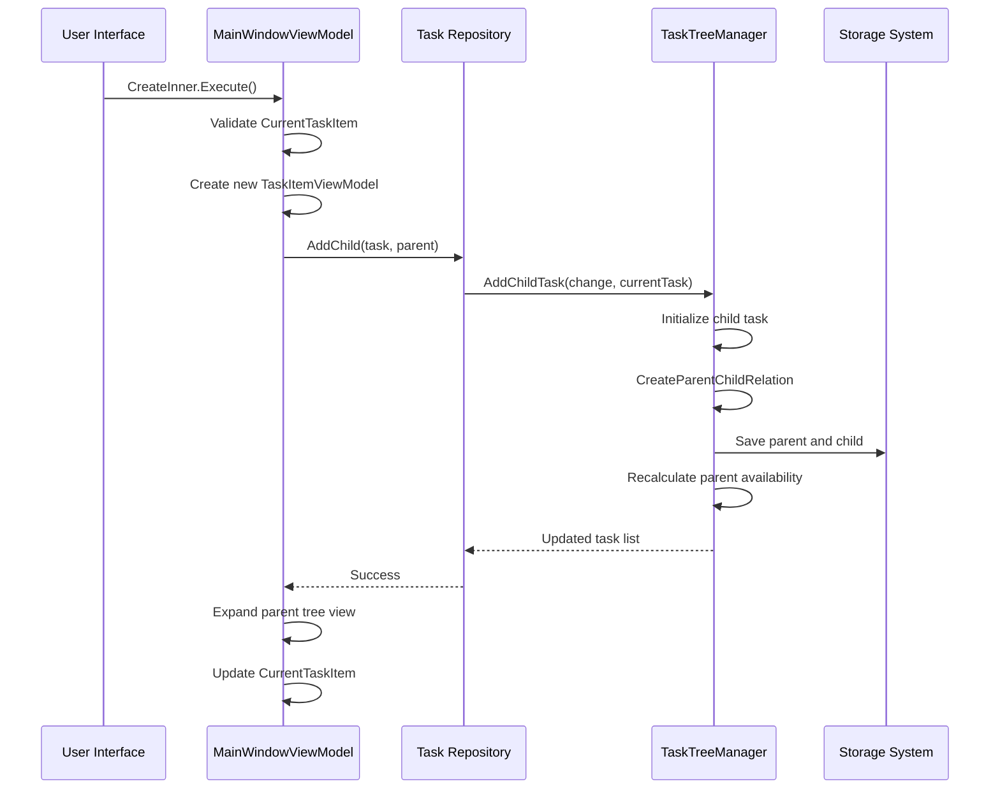
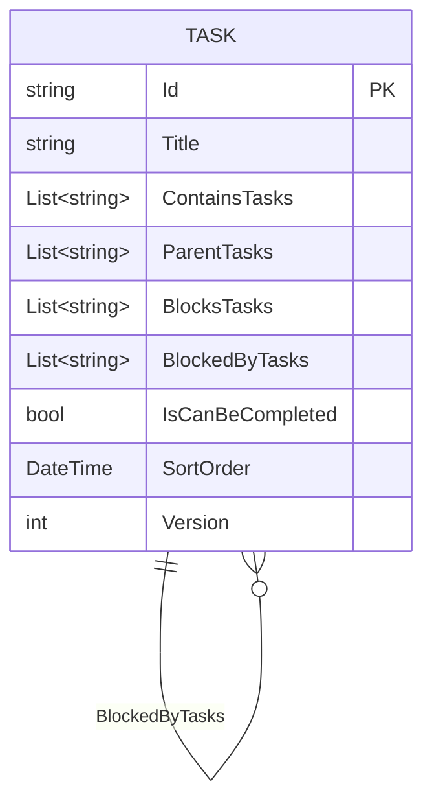
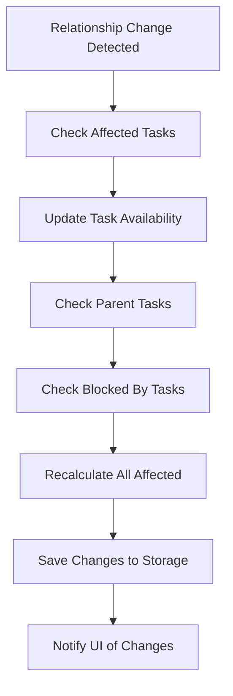
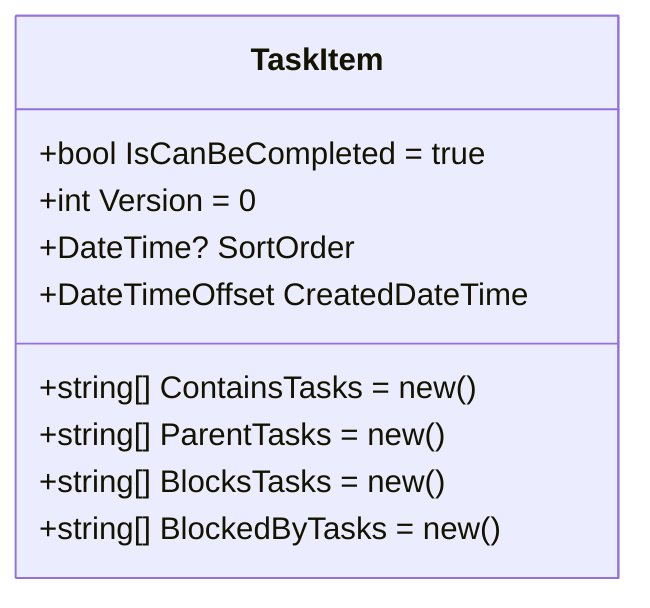
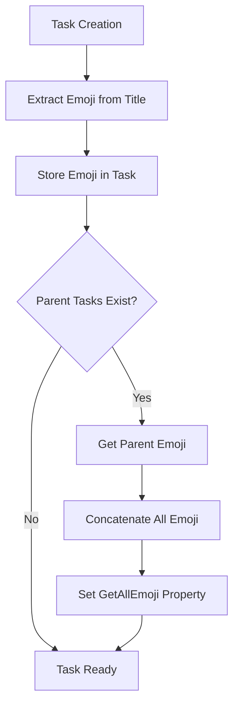
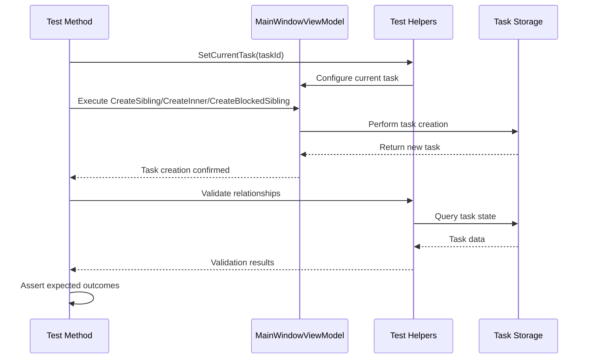
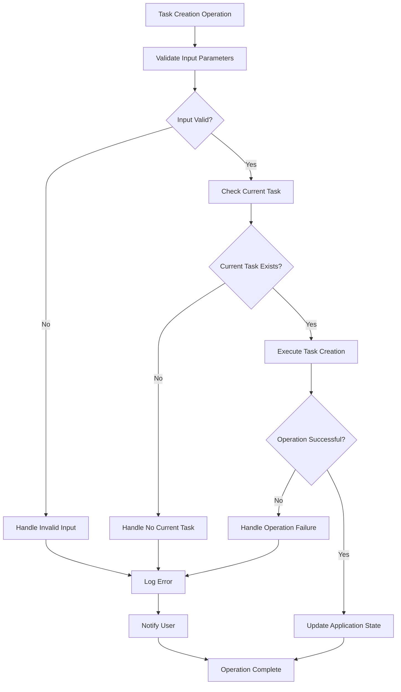

# Task Creation Operations

<cite>
**Referenced Files in This Document**
- [MainWindowViewModel.cs](file://src/Unlimotion.ViewModel/MainWindowViewModel.cs)
- [TaskTreeManager.cs](file://src/Unlimotion.TaskTreeManager/TaskTreeManager.cs)
- [TaskItem.cs](file://src/Unlimotion.Domain/TaskItem.cs)
- [TaskItemViewModel.cs](file://src/Unlimotion.ViewModel/TaskItemViewModel.cs)
- [ITaskStorage.cs](file://src/Unlimotion.ViewModel/ITaskStorage.cs)
- [ITaskTreeManager.cs](file://src/Unlimotion.TaskTreeManager/ITaskTreeManager.cs)
- [MainWindowViewModelTests.cs](file://src/Unlimotion.Test/MainWindowViewModelTests.cs)
</cite>

## Table of Contents
1. [Introduction](#introduction)
2. [Task Creation Architecture](#task-creation-architecture)
3. [CreateSibling Operation](#createsibling-operation)
4. [CreateBlockedSibling Operation](#createblockedsibling-operation)
5. [CreateInner Operation](#createinner-operation)
6. [Task Relationship Management](#task-relationship-management)
7. [Automatic Property Initialization](#automatic-property-initialization)
8. [Emoji Inheritance](#emoji-inheritance)
9. [Testing and Validation](#testing-and-validation)
10. [Error Handling and Edge Cases](#error-handling-and-edge-cases)

## Introduction

Unlimotion provides three primary task creation operations that enable flexible task organization and relationship establishment. These operations—CreateSibling, CreateBlockedSibling, and CreateInner—allow users to create new tasks at different hierarchical levels while automatically establishing appropriate relationships and initializing essential properties.

The task creation system operates through a layered architecture involving the MainWindowViewModel for user interface commands, TaskTreeManager for business logic, and the underlying storage system for persistence. Each operation follows specific patterns for relationship establishment, property initialization, and collection management.

## Task Creation Architecture

The task creation system follows a clear separation of concerns with distinct layers handling different aspects of the process:

**Diagram sources**
- [MainWindowViewModel.cs](file://src/Unlimotion.ViewModel/MainWindowViewModel.cs#L60-L120)
- [TaskTreeManager.cs](file://src/Unlimotion.TaskTreeManager/TaskTreeManager.cs#L18-L90)

**Section sources**
- [MainWindowViewModel.cs](file://src/Unlimotion.ViewModel/MainWindowViewModel.cs#L1-L50)
- [TaskTreeManager.cs](file://src/Unlimotion.TaskTreeManager/TaskTreeManager.cs#L1-L30)

## CreateSibling Operation

The CreateSibling operation creates a new task at the same hierarchical level as the currently selected task, establishing parent-child relationships with shared parents.

### Implementation Details

The CreateSibling command is implemented in MainWindowViewModel and delegates to the task repository's Add method:

**Diagram sources**
- [MainWindowViewModel.cs](file://src/Unlimotion.ViewModel/MainWindowViewModel.cs#L70-L85)
- [TaskTreeManager.cs](file://src/Unlimotion.TaskTreeManager/TaskTreeManager.cs#L18-L90)

### Relationship Establishment

During CreateSibling execution, the TaskTreeManager establishes relationships by:

1. **Parent Sharing**: The new task inherits all parent relationships from the current task
2. **Collection Updates**: Both ContainsTasks and ParentTasks collections are updated
3. **Availability Recalculation**: Parent task availability is recalculated to reflect the new child

### Code Implementation

The CreateSibling operation follows this pattern:

| Operation Phase | Responsibility | Collection Updates |
|----------------|---------------|-------------------|
| Task Creation | Initialize new task with version 1 | None |
| Property Setup | Set SortOrder and CreatedDateTime | None |
| Parent Inheritance | Copy parent relationships | ContainsTasks, ParentTasks |
| Availability Update | Recalculate parent availability | Depends on parent tasks |

**Section sources**
- [MainWindowViewModel.cs](file://src/Unlimotion.ViewModel/MainWindowViewModel.cs#L70-L85)
- [TaskTreeManager.cs](file://src/Unlimotion.TaskTreeManager/TaskTreeManager.cs#L43-L80)

## CreateBlockedSibling Operation

CreateBlockedSibling creates a new task that establishes a blocking relationship with the current task, preventing the current task from becoming available until the new task is completed.

### Blocking Relationship Mechanism

The CreateBlockedSibling operation differs from CreateSibling by setting the isBlocked parameter to true, triggering CreateBlockingBlockedByRelation in TaskTreeManager:

**Diagram sources**
- [MainWindowViewModel.cs](file://src/Unlimotion.ViewModel/MainWindowViewModel.cs#L86-L95)
- [TaskTreeManager.cs](file://src/Unlimotion.TaskTreeManager/TaskTreeManager.cs#L43-L80)

### Blocking Relationship Properties

When isBlocked is true, the CreateBlockedSibling operation:

1. **Creates Forward Blocking**: The new task blocks the current task
2. **Updates BlockedBy Collection**: Adds current task to new task's BlockedByTasks
3. **Updates Blocks Collection**: Adds new task to current task's BlocksTasks
4. **Recalculates Availability**: Marks current task as unavailable

### Relationship Collections

| Collection | Purpose | Example |
|-----------|---------|---------|
| BlocksTasks | Tasks this task blocks | Task A → Task B (blocks) |
| BlockedByTasks | Tasks that block this task | Task B ← Task A (blocked by) |
| ContainsTasks | Child tasks in hierarchy | Parent → Children |
| ParentTasks | Parent tasks in hierarchy | Child ← Parent |

**Section sources**
- [MainWindowViewModel.cs](file://src/Unlimotion.ViewModel/MainWindowViewModel.cs#L86-L95)
- [TaskTreeManager.cs](file://src/Unlimotion.TaskTreeManager/TaskTreeManager.cs#L518-L557)

## CreateInner Operation

CreateInner creates nested child tasks within the currently selected task, establishing parent-child relationships through AddChildTask.

### Nested Task Creation Process

The CreateInner operation creates deeply nested task hierarchies:

**Diagram sources**
- [MainWindowViewModel.cs](file://src/Unlimotion.ViewModel/MainWindowViewModel.cs#L96-L120)
- [TaskTreeManager.cs](file://src/Unlimotion.TaskTreeManager/TaskTreeManager.cs#L93-L129)

### Parent-Child Relationship Establishment

The AddChildTask method establishes bidirectional parent-child relationships:

1. **Forward Relationship**: Parent ContainsTasks includes child ID
2. **Backward Relationship**: Child ParentTasks includes parent ID
3. **Availability Impact**: Parent task availability recalculated
4. **Tree Expansion**: Parent task expanded in UI

### Hierarchical Navigation

The CreateInner operation includes automatic tree navigation:

| Feature | Implementation | Benefit |
|---------|---------------|---------|
| Tree Expansion | FindTaskWrapperViewModel and IsExpanded | Visual feedback of new hierarchy |
| Parent Traversal | Recursive expansion of all parent levels | Complete visibility of task location |
| Selection Update | CurrentTaskItem assignment | Focus on newly created task |

**Section sources**
- [MainWindowViewModel.cs](file://src/Unlimotion.ViewModel/MainWindowViewModel.cs#L96-L120)
- [TaskTreeManager.cs](file://src/Unlimotion.TaskTreeManager/TaskTreeManager.cs#L93-L129)

## Task Relationship Management

The task creation system manages complex relationships through specialized methods that ensure data consistency and availability calculations.

### Relationship Types and Collections

Each task maintains four primary relationship collections:

**Diagram sources**
- [TaskItem.cs](file://src/Unlimotion.Domain/TaskItem.cs#L1-L33)

### Relationship Establishment Methods

The TaskTreeManager provides specialized methods for different relationship types:

| Method | Purpose | Collections Modified |
|--------|---------|---------------------|
| CreateParentChildRelation | Establish parent-child hierarchy | ContainsTasks, ParentTasks |
| CreateBlockingBlockedByRelation | Establish blocking relationships | BlocksTasks, BlockedByTasks |
| BreakParentChildRelation | Remove parent-child relationships | ContainsTasks, ParentTasks |
| BreakBlockingBlockedByRelation | Remove blocking relationships | BlocksTasks, BlockedByTasks |

### Availability Calculation Impact

Relationship changes trigger automatic availability recalculation:

**Diagram sources**
- [TaskTreeManager.cs](file://src/Unlimotion.TaskTreeManager/TaskTreeManager.cs#L700-L750)

**Section sources**
- [TaskTreeManager.cs](file://src/Unlimotion.TaskTreeManager/TaskTreeManager.cs#L477-L557)
- [TaskItem.cs](file://src/Unlimotion.Domain/TaskItem.cs#L15-L25)

## Automatic Property Initialization

Task creation operations automatically initialize essential properties to ensure consistent task state and proper functionality.

### Version Management

All task creation operations initialize the Version property:

| Operation | Initial Version | Purpose |
|-----------|----------------|---------|
| CreateSibling | 1 | Track task modifications |
| CreateBlockedSibling | 1 | Track task modifications |
| CreateInner | 1 | Track task modifications |

### Timestamp Assignment

Tasks receive automatic timestamp assignment:

| Property | Value | Source |
|----------|-------|--------|
| CreatedDateTime | DateTimeOffset.UtcNow | Automatic assignment |
| SortOrder | DateTime.Now | Creation time ordering |
| UnlockedDateTime | null | Initially unavailable |

### Collection Initialization

New tasks receive empty collection initialization:

**Diagram sources**
- [TaskItem.cs](file://src/Unlimotion.Domain/TaskItem.cs#L15-L30)

**Section sources**
- [TaskTreeManager.cs](file://src/Unlimotion.TaskTreeManager/TaskTreeManager.cs#L43-L80)
- [TaskTreeManager.cs](file://src/Unlimotion.TaskTreeManager/TaskTreeManager.cs#L93-L129)

## Emoji Inheritance

Unlimotion supports emoji symbols in task titles with automatic inheritance from parent tasks to child tasks during creation.

### Emoji Detection and Inheritance

The TaskItemViewModel implements automatic emoji detection and inheritance:

**Diagram sources**
- [TaskItemViewModel.cs](file://src/Unlimotion.ViewModel/TaskItemViewModel.cs#L470-L520)

### Emoji Pattern Matching

The system uses sophisticated regex patterns to detect emojis:

| Emoji Category | Pattern | Examples |
|---------------|---------|----------|
| Symbols | `[#*0-9]\uFE0F?\u20E3` | #️⃣, *️⃣, 0️⃣ |
| Copyright | `©\uFE0F?` | ©️ |
| Registered | `[®\u203C\u2049\u2122\u2139\u2194-\u2199\u21A9\u21AA]\uFE0F?` | ®️, ℹ️, ↔️ |
| Sports | `[\u231A\u231B]` | ⌚, ⌛ |
| Transport | `[\u23E9-\u23EC]` | 🁩, 🁪, 🁫, 🁬 |

### Inheritance Behavior

Emoji inheritance follows these rules:

1. **Parent Priority**: Parent task emojis take precedence
2. **Concatenation**: All parent emojis are concatenated
3. **Order Preservation**: Parent hierarchy order is maintained
4. **Automatic Update**: Child tasks inherit parent emojis during creation

**Section sources**
- [TaskItemViewModel.cs](file://src/Unlimotion.ViewModel/TaskItemViewModel.cs#L470-L520)

## Testing and Validation

The task creation system includes comprehensive testing to ensure reliability and correctness.

### Test Coverage Areas

The testing framework validates multiple scenarios:

| Test Scenario | Validation Points | Expected Behavior |
|--------------|------------------|-------------------|
| CreateSibling | Parent sharing, relationship establishment | Shared parent relationships preserved |
| CreateBlockedSibling | Blocking relationship creation | Proper blocking established, availability updated |
| CreateInner | Nested hierarchy creation | Parent-child relationships, tree expansion |
| Edge Cases | Null conditions, invalid states | Graceful handling, no crashes |

### Test Implementation Patterns

The test suite demonstrates proper validation patterns:

**Diagram sources**
- [MainWindowViewModelTests.cs](file://src/Unlimotion.Test\MainWindowViewModelTests.cs#L110-L160)

### Validation Strategies

The testing framework employs several validation strategies:

1. **State Comparison**: Compare task state before and after operations
2. **Relationship Verification**: Validate collection contents and relationships
3. **Availability Testing**: Confirm task availability calculations
4. **Edge Case Handling**: Test boundary conditions and error scenarios

**Section sources**
- [MainWindowViewModelTests.cs](file://src/Unlimotion.Test\MainWindowViewModelTests.cs#L110-L160)

## Error Handling and Edge Cases

The task creation system implements robust error handling to manage various failure scenarios gracefully.

### Common Error Scenarios

| Error Type | Cause | Handling Strategy |
|-----------|-------|------------------|
| Null CurrentTask | No task selected | Skip operation, maintain state |
| Empty Title | Invalid task title | Prevent creation, show validation |
| Storage Failure | Database connectivity | Retry mechanism, fallback state |
| Relationship Conflict | Circular dependencies | Detect and prevent, rollback |

### Defensive Programming Patterns

The system implements defensive programming patterns:

### Recovery Mechanisms

The system provides multiple recovery mechanisms:

1. **Transaction Rollback**: Automatic rollback on failure
2. **State Restoration**: Restore previous application state
3. **User Notification**: Clear error messages to users
4. **Logging**: Comprehensive error logging for debugging

### Performance Considerations

Task creation operations are optimized for performance:

| Optimization | Implementation | Benefit |
|-------------|---------------|---------|
| Batch Operations | Group related updates | Reduced database calls |
| Lazy Loading | Load relationships on demand | Improved startup performance |
| Caching | Cache frequently accessed data | Faster subsequent operations |
| Throttling | Limit rapid property changes | Prevent excessive updates |

**Section sources**
- [MainWindowViewModel.cs](file://src/Unlimotion.ViewModel\MainWindowViewModel.cs#L70-L120)
- [TaskTreeManager.cs](file://src\Unlimotion.TaskTreeManager\TaskTreeManager.cs#L700-L750)