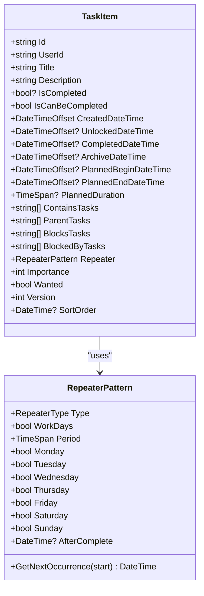
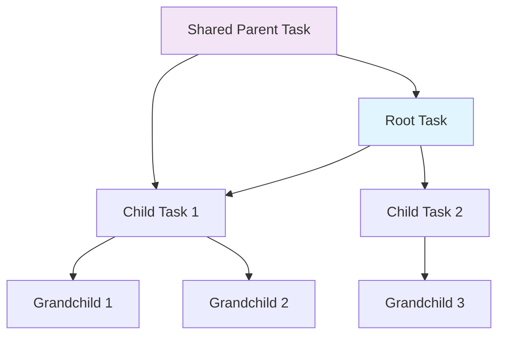
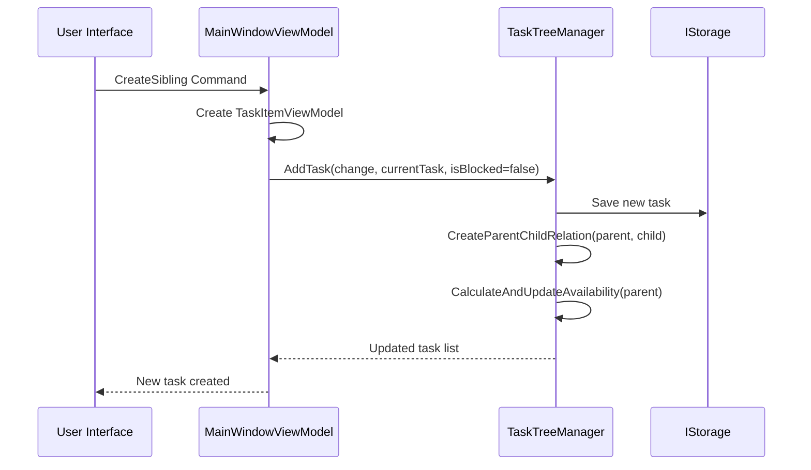
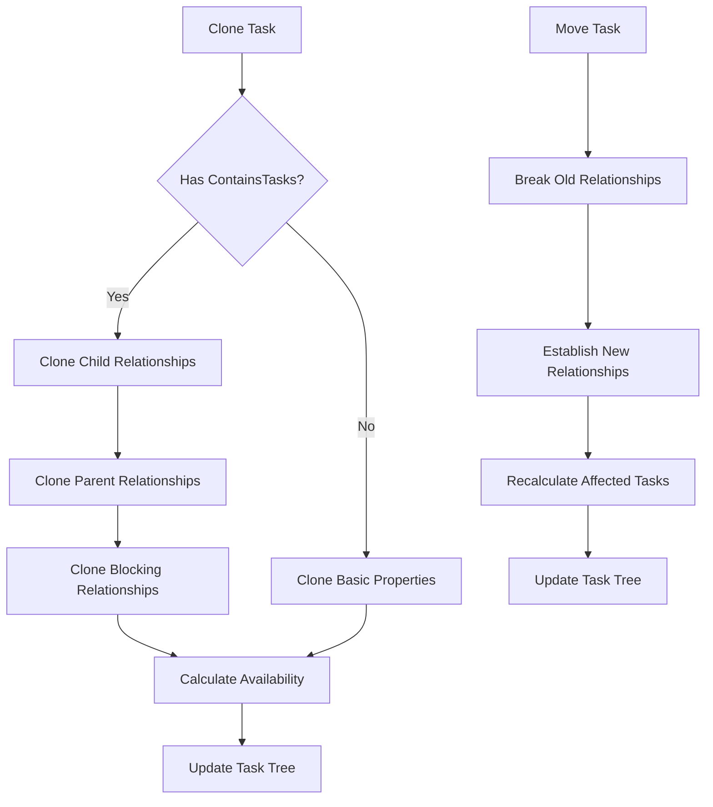
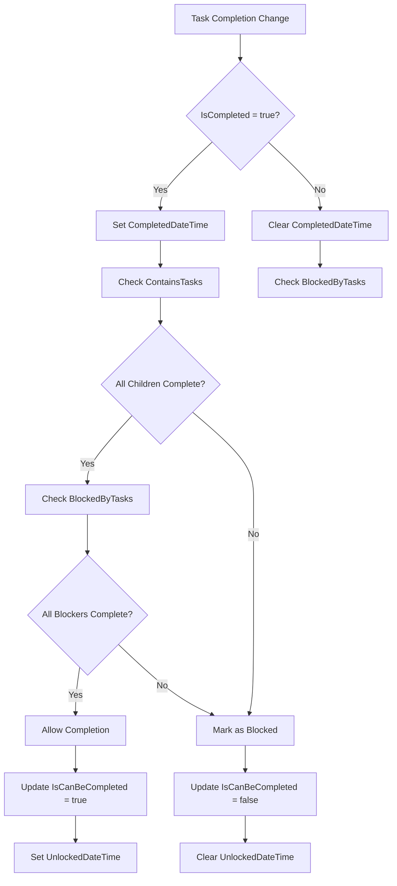
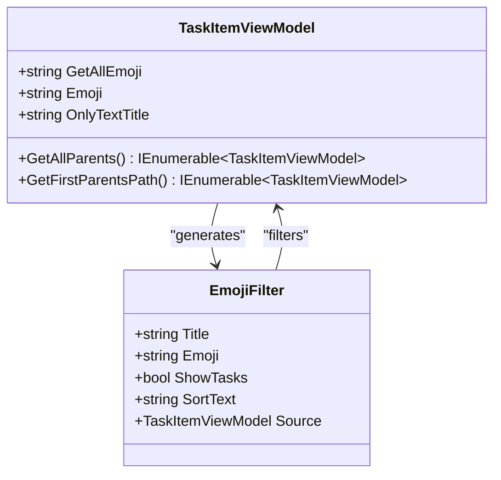
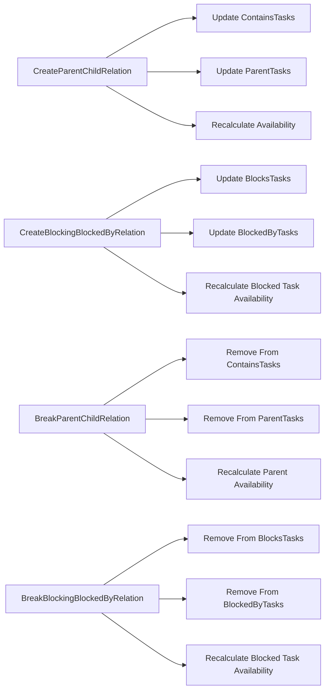
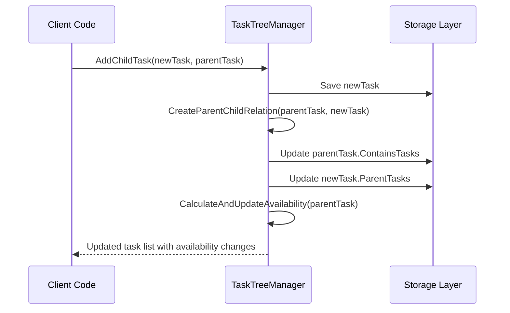
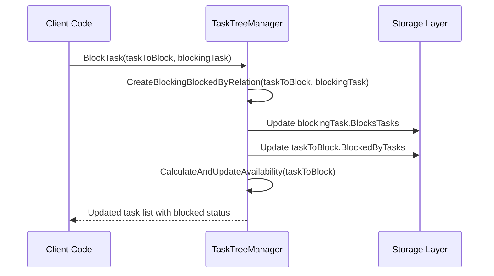
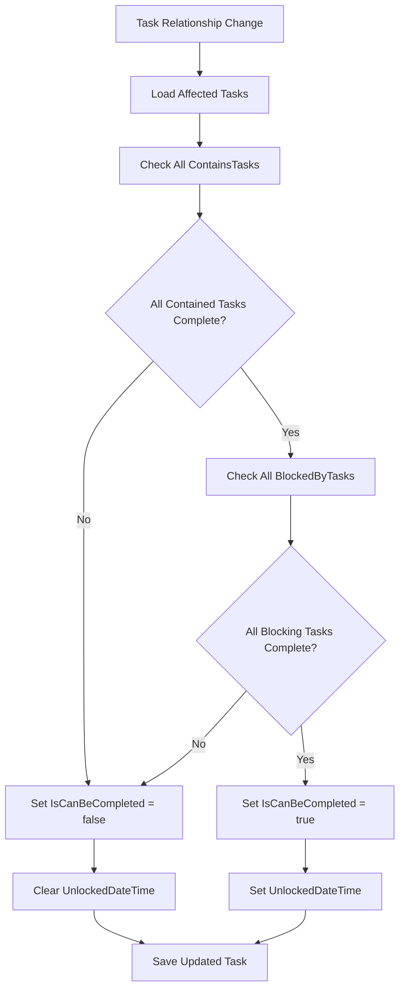

# Task Management

<cite>
**Referenced Files in This Document**
- [TaskItem.cs](file://src/Unlimotion.Domain/TaskItem.cs)
- [TaskTreeManager.cs](file://src/Unlimotion.TaskTreeManager/TaskTreeManager.cs)
- [ITaskTreeManager.cs](file://src/Unlimotion.TaskTreeManager/ITaskTreeManager.cs)
- [MainWindowViewModel.cs](file://src/Unlimotion.ViewModel/MainWindowViewModel.cs)
- [TaskItemViewModel.cs](file://src/Unlimotion.ViewModel/TaskItemViewModel.cs)
- [AutoUpdatingDictionary.cs](file://src/Unlimotion.TaskTreeManager/AutoUpdatingDictionary.cs)
- [TaskAvailabilityCalculationTests.cs](file://src/Unlimotion.Test/TaskAvailabilityCalculationTests.cs)
- [MainWindowViewModelTests.cs](file://src/Unlimotion.Test/MainWindowViewModelTests.cs)
</cite>

## Table of Contents
1. [Introduction](#introduction)
2. [TaskItem Model Architecture](#taskitem-model-architecture)
3. [Hierarchical Task Organization](#hierarchical-task-organization)
4. [Task Creation Operations](#task-creation-operations)
5. [Cloning and Moving Operations](#cloning-and-moving-operations)
6. [Blocking Logic and Task Completion](#blocking-logic-and-task-completion)
7. [Emoji-Based Grouping System](#emoji-based-grouping-system)
8. [Task Relationship Management](#task-relationship-management)
9. [Practical Implementation Examples](#practical-implementation-examples)
10. [Performance Considerations](#performance-considerations)

## Introduction

Unlimotion's task management system provides a sophisticated hierarchical task organization framework with unlimited nesting capabilities and multiple parent support. The system enables complex task relationships through four primary collection types: ContainsTasks, ParentTasks, BlocksTasks, and BlockedByTasks. This architecture supports intricate workflow scenarios while maintaining task availability calculations and visual grouping through emoji symbols.

The task management system operates through a layered architecture consisting of the Domain model (TaskItem), business logic layer (TaskTreeManager), presentation layer (MainWindowViewModel), and view models (TaskItemViewModel). This separation ensures maintainable, testable, and extensible task management functionality.

## TaskItem Model Architecture

The TaskItem model serves as the core data structure for all task-related operations in the system. It defines the fundamental properties and relationships that enable complex task hierarchies and dependencies.

**Diagram sources**
- [TaskItem.cs](file://src/Unlimotion.Domain/TaskItem.cs#L5-L32)

### Core Properties and Their Roles

The TaskItem model contains several critical properties that define task behavior and relationships:

- **ContainsTasks**: Maintains a list of child task IDs, enabling hierarchical task organization
- **ParentTasks**: Stores parent task IDs for multiple parent support
- **BlocksTasks**: Identifies tasks that this task prevents from completing
- **BlockedByTasks**: Lists tasks that prevent this task from completing
- **IsCanBeCompleted**: Calculated property determining task availability for completion
- **UnlockedDateTime**: Timestamp when task becomes available for completion

**Section sources**
- [TaskItem.cs](file://src/Unlimotion.Domain/TaskItem.cs#L5-L32)

## Hierarchical Task Organization

The hierarchical task organization system enables unlimited nesting through parent-child relationships while supporting multiple parents for complex workflow scenarios.

**Diagram sources**
- [TaskTreeManager.cs](file://src/Unlimotion.TaskTreeManager/TaskTreeManager.cs#L460-L490)

### Parent-Child Relationship Management

The system maintains bidirectional relationships between parent and child tasks through synchronized updates to both ContainsTasks and ParentTasks collections. This ensures data consistency and enables efficient traversal of task hierarchies.

**Section sources**
- [TaskTreeManager.cs](file://src/Unlimotion.TaskTreeManager/TaskTreeManager.cs#L460-L490)

## Task Creation Operations

The MainWindowViewModel provides three primary task creation operations that delegate to the TaskTreeManager for relationship management and availability calculation.

**Diagram sources**
- [MainWindowViewModel.cs](file://src/Unlimotion.ViewModel/MainWindowViewModel.cs#L70-L110)
- [TaskTreeManager.cs](file://src/Unlimotion.TaskTreeManager/TaskTreeManager.cs#L18-L80)

### CreateSibling Operation

Creates a new task at the same level as the current task, inheriting all parent relationships. This operation preserves existing hierarchical structure while adding new parallel tasks.

### CreateBlockedSibling Operation

Creates a new task that blocks the current task from completion. This establishes a blocking relationship where the new task must be completed before the current task can be marked as finished.

### CreateInner Operation

Creates a child task within the current task, establishing a parent-child relationship. This operation adds the new task to the current task's ContainsTasks collection and sets the current task as the child's parent.

**Section sources**
- [MainWindowViewModel.cs](file://src/Unlimotion.ViewModel/MainWindowViewModel.cs#L70-L110)

## Cloning and Moving Operations

The system supports sophisticated cloning and moving operations that preserve complex task relationships while allowing flexible task reorganization.

**Diagram sources**
- [TaskTreeManager.cs](file://src/Unlimotion.TaskTreeManager/TaskTreeManager.cs#L200-L380)

### Cloning Process

The cloning operation creates a complete copy of a task while preserving all relationships:
- Copies basic task properties (title, description, duration, etc.)
- Recreates parent-child relationships with step-parents
- Establishes blocking relationships with blocked-by tasks
- Preserves blocking relationships with blocking tasks
- Recalculates availability for all affected tasks

### Moving Operations

Moving operations allow tasks to be relocated within the task tree while maintaining relationship integrity. The system handles both simple parent-child moves and complex relationship restructuring.

**Section sources**
- [TaskTreeManager.cs](file://src/Unlimotion.TaskTreeManager/TaskTreeManager.cs#L200-L380)

## Blocking Logic and Task Completion

The task completion system implements sophisticated blocking logic that prevents task completion when uncompleted contained or blocking tasks exist. This ensures logical workflow adherence and prevents premature task closure.

**Diagram sources**
- [TaskTreeManager.cs](file://src/Unlimotion.TaskTreeManager/TaskTreeManager.cs#L700-L837)

### Availability Calculation Rules

The system calculates task availability using two primary rules:

1. **Contained Task Rule**: All contained tasks must be completed (IsCompleted != false)
2. **Blocking Task Rule**: All blocking tasks must be completed (IsCompleted != false)

### IsCanBeCompleted Property Management

The IsCanBeCompleted property is dynamically calculated and managed by the TaskTreeManager through the CalculateAndUpdateAvailability method. This property determines whether a task can be marked as completed and triggers automatic availability updates.

**Section sources**
- [TaskTreeManager.cs](file://src/Unlimotion.TaskTreeManager/TaskTreeManager.cs#L650-L750)
- [TaskAvailabilityCalculationTests.cs](file://src/Unlimotion.Test/TaskAvailabilityCalculationTests.cs#L15-L199)

## Emoji-Based Grouping System

The emoji-based grouping system provides visual filtering and inheritance of emoji symbols to subtasks, enabling intuitive task organization and quick identification of related tasks.

**Diagram sources**
- [TaskItemViewModel.cs](file://src/Unlimotion.ViewModel/TaskItemViewModel.cs#L69-L104)
- [MainWindowViewModel.cs](file://src/Unlimotion.ViewModel/MainWindowViewModel.cs#L246-L380)

### Emoji Inheritance Mechanism

The GetAllEmoji property accumulates emoji symbols from all parent tasks in the hierarchy, creating a composite emoji representation for subtasks. This inheritance mechanism enables visual grouping and filtering across task hierarchies.

### Filtering Capabilities

The system provides dual filtering modes:
- **Include Filters**: Show tasks matching specific emoji patterns
- **Exclude Filters**: Hide tasks containing specific emoji patterns

**Section sources**
- [TaskItemViewModel.cs](file://src/Unlimotion.ViewModel/TaskItemViewModel.cs#L580-L620)
- [MainWindowViewModel.cs](file://src/Unlimotion.ViewModel/MainWindowViewModel.cs#L246-L380)

## Task Relationship Management

The TaskTreeManager provides comprehensive relationship management through specialized methods for creating, breaking, and manipulating task connections.

**Diagram sources**
- [TaskTreeManager.cs](file://src/Unlimotion.TaskTreeManager/TaskTreeManager.cs#L460-L580)

### Relationship Persistence

All relationship operations are persisted through the IStorage interface, ensuring data consistency across application sessions. The AutoUpdatingDictionary pattern optimizes batch updates and reduces redundant storage operations.

**Section sources**
- [TaskTreeManager.cs](file://src/Unlimotion.TaskTreeManager/TaskTreeManager.cs#L460-L580)
- [AutoUpdatingDictionary.cs](file://src/Unlimotion.TaskTreeManager/AutoUpdatingDictionary.cs#L5-L27)

## Practical Implementation Examples

### Creating Parent-Child Relationships

The AddChildTask method demonstrates how new tasks establish hierarchical relationships:

**Diagram sources**
- [TaskTreeManager.cs](file://src/Unlimotion.TaskTreeManager/TaskTreeManager.cs#L82-L120)

### Establishing Blocking Relationships

The BlockTask method shows how tasks can prevent completion of other tasks:

**Diagram sources**
- [TaskTreeManager.cs](file://src/Unlimotion.TaskTreeManager/TaskTreeManager.cs#L409-L420)

### Availability Calculation Example

The system automatically recalculates task availability when relationships change:

**Diagram sources**
- [TaskTreeManager.cs](file://src/Unlimotion.TaskTreeManager/TaskTreeManager.cs#L650-L750)

**Section sources**
- [TaskAvailabilityCalculationTests.cs](file://src/Unlimotion.Test/TaskAvailabilityCalculationTests.cs#L15-L199)

## Performance Considerations

The task management system implements several performance optimization strategies:

### Batch Operations

The AutoUpdatingDictionary pattern enables efficient batch processing of task updates, reducing the number of storage operations and improving response times during complex relationship modifications.

### Lazy Loading

Task relationships are loaded on-demand through reactive streams, minimizing memory usage and improving initialization performance for large task trees.

### Availability Caching

The system caches availability calculations and only recalculates when necessary, reducing computational overhead during frequent task updates.

### Asynchronous Operations

All storage operations are performed asynchronously using the Polly retry policy, ensuring responsive user interfaces even during network delays or storage contention.

**Section sources**
- [TaskTreeManager.cs](file://src/Unlimotion.TaskTreeManager/TaskTreeManager.cs#L580-L620)
- [AutoUpdatingDictionary.cs](file://src/Unlimotion.TaskTreeManager/AutoUpdatingDictionary.cs#L5-L27)