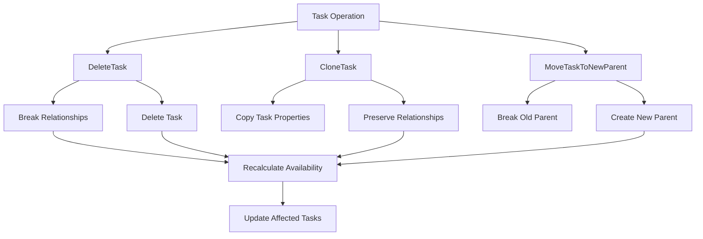
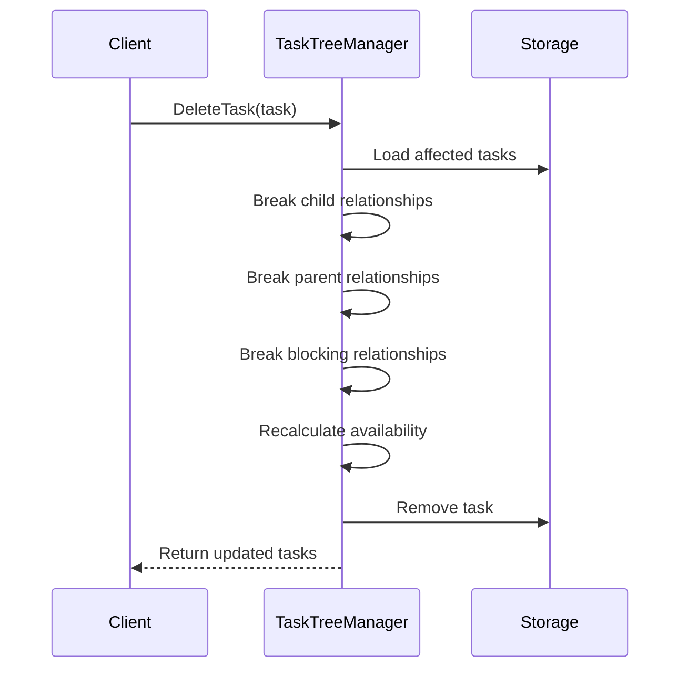
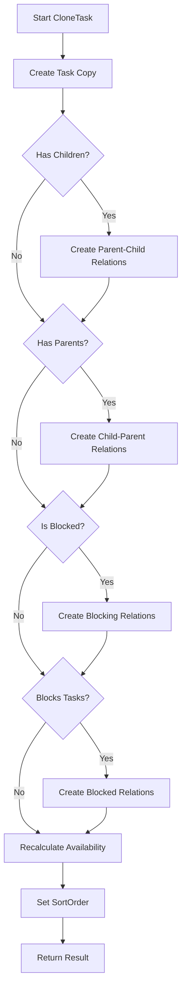
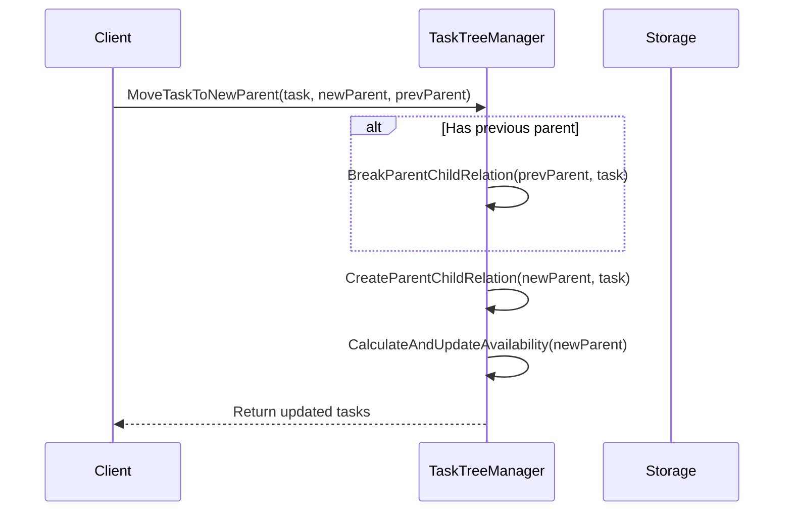
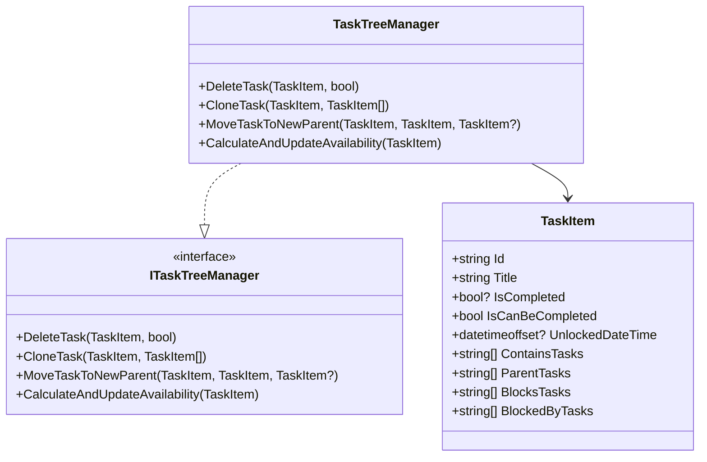

# Task Operations

<cite>
**Referenced Files in This Document**   
- [TaskTreeManager.cs](file://src/Unlimotion.TaskTreeManager/TaskTreeManager.cs)
- [TaskItem.cs](file://src/Unlimotion.Domain/TaskItem.cs)
- [ITaskTreeManager.cs](file://src/Unlimotion.TaskTreeManager/ITaskTreeManager.cs)
- [TaskAvailabilityCalculationTests.cs](file://src/Unlimotion.Test/TaskAvailabilityCalculationTests.cs)
- [MainWindowViewModelTests.cs](file://src/Unlimotion.Test/MainWindowViewModelTests.cs)
- [FileTaskStorage.cs](file://src/Unlimotion/FileTaskStorage.cs)
</cite>

## Table of Contents
1. [Introduction](#introduction)
2. [Core Task Operations](#core-task-operations)
3. [DeleteTask Operation](#deletetask-operation)
4. [CloneTask Operation](#clonetask-operation)
5. [MoveTaskToNewParent Operation](#movetasktonewparent-operation)
6. [Availability Recalculation System](#availability-recalculation-system)
7. [Practical Examples and Test Cases](#practical-examples-and-test-cases)
8. [Conclusion](#conclusion)

## Introduction
Unlimotion provides advanced task management operations that maintain data consistency while allowing users to manipulate task relationships. This document details the implementation of three core operations: DeleteTask, CloneTask, and MoveTaskToNewParent. These operations are designed to preserve data integrity by systematically managing parent-child and blocking relationships, while ensuring that task availability status (IsCanBeCompleted) is correctly maintained throughout the task hierarchy.

The operations are implemented in the TaskTreeManager class, which serves as the central business logic layer for task management. This separation of concerns ensures that the same logic can be reused across different components of the application, including the UI, API, and Telegram bot interfaces.

**Section sources**
- [TaskTreeManager.cs](file://src/Unlimotion.TaskTreeManager/TaskTreeManager.cs#L131-L403)
- [ITaskTreeManager.cs](file://src/Unlimotion.TaskTreeManager/ITaskTreeManager.cs#L13-L21)

## Core Task Operations
Unlimotion's task management system implements three advanced operations that allow users to manipulate task relationships while maintaining data consistency:

1. **DeleteTask**: Removes a task and all its relationships in a systematic manner
2. **CloneTask**: Creates a copy of a task with all its relationships preserved
3. **MoveTaskToNewParent**: Changes a task's hierarchy by breaking old parent relationships and creating new ones

These operations are implemented in the TaskTreeManager class and follow a consistent pattern of collecting affected tasks, performing the operation, and recalculating availability for impacted tasks.



**Diagram sources**
- [TaskTreeManager.cs](file://src/Unlimotion.TaskTreeManager/TaskTreeManager.cs#L131-L403)

## DeleteTask Operation
The DeleteTask operation systematically removes a task and all its relationships before deleting the task itself. This ensures data consistency by properly cleaning up all references to the deleted task.

### Operation Flow
The DeleteTask operation follows a specific sequence to maintain data integrity:

1. **Collect affected tasks**: Before breaking any relationships, the operation identifies all parent tasks and blocked tasks that will be affected by the deletion
2. **Break child relationships**: Remove the task from the ContainsTasks collection of all its children and remove the children from its ParentTasks collection
3. **Break parent relationships**: Remove the task from the ContainsTasks collection of all its parents and remove the parents from its ParentTasks collection
4. **Break blocking relationships**: Remove the task from the BlocksTasks collection of all tasks it blocks and from the BlockedByTasks collection of all tasks that block it
5. **Recalculate availability**: Update the IsCanBeCompleted status of all affected tasks
6. **Delete the task**: Finally, remove the task from storage

### Relationship Cleanup
The operation cleans up four key collections:

- **ContainsTasks**: The collection of child tasks in parent tasks
- **ParentTasks**: The collection of parent tasks in child tasks
- **BlocksTasks**: The collection of tasks that are blocked by this task
- **BlockedByTasks**: The collection of tasks that block this task

Each relationship is broken in both directions to maintain referential integrity.



**Diagram sources**
- [TaskTreeManager.cs](file://src/Unlimotion.TaskTreeManager/TaskTreeManager.cs#L131-L242)

**Section sources**
- [TaskTreeManager.cs](file://src/Unlimotion.TaskTreeManager/TaskTreeManager.cs#L131-L242)
- [TaskItem.cs](file://src/Unlimotion.Domain/TaskItem.cs#L15-L22)

## CloneTask Operation
The CloneTask operation creates a copy of a task with all its relationships preserved, including nested children, parent relationships, and blocking dependencies.

### Cloning Process
The operation follows these steps to create a complete copy of a task:

1. **Create task copy**: A new TaskItem is created with the same properties as the original task, except for the Id and SortOrder
2. **Preserve child relationships**: For each child task, a parent-child relationship is created between the clone and the child
3. **Preserve parent relationships**: For each parent task, a parent-child relationship is created between the parent and the clone
4. **Preserve blocking relationships**: For each task that blocks the original task, a blocking relationship is created between the blocker and the clone
5. **Preserve blocked relationships**: For each task that the original task blocks, a blocking relationship is created between the clone and the blocked task
6. **Recalculate availability**: The availability of the clone and all affected tasks is recalculated

### Relationship Preservation
The operation preserves all types of relationships:

- **Nested children**: The clone maintains the same child tasks as the original
- **Parent relationships**: The clone can have multiple parents like the original task
- **Blocking dependencies**: The clone is blocked by the same tasks as the original and blocks the same tasks

This ensures that the cloned task functions identically to the original in terms of its position in the task hierarchy and its dependencies.



**Diagram sources**
- [TaskTreeManager.cs](file://src/Unlimotion.TaskTreeManager/TaskTreeManager.cs#L280-L376)

**Section sources**
- [TaskTreeManager.cs](file://src/Unlimotion.TaskTreeManager/TaskTreeManager.cs#L280-L376)
- [MainWindowViewModelTests.cs](file://src/Unlimotion.Test/MainWindowViewModelTests.cs#L188-L214)

## MoveTaskToNewParent Operation
The MoveTaskToNewParent operation changes a task's hierarchy by breaking the old parent relationship and creating a new one with a different parent task.

### Move Process
The operation follows these steps:

1. **Break old parent relationship**: If a previous parent is specified, the operation breaks the parent-child relationship between the task and its previous parent
2. **Create new parent relationship**: Establishes a parent-child relationship between the task and the new parent
3. **Recalculate availability**: Updates the IsCanBeCompleted status of the new parent task and any other affected tasks

### Relationship Management
The operation specifically manages parent-child relationships:

- **Old parent**: The task is removed from the ContainsTasks collection of the previous parent, and the previous parent is removed from the task's ParentTasks collection
- **New parent**: The task is added to the ContainsTasks collection of the new parent, and the new parent is added to the task's ParentTasks collection

Unlike the DeleteTask operation, MoveTaskToNewParent does not affect blocking relationships or child relationships of the moved task.



**Diagram sources**
- [TaskTreeManager.cs](file://src/Unlimotion.TaskTreeManager/TaskTreeManager.cs#L386-L403)

**Section sources**
- [TaskTreeManager.cs](file://src/Unlimotion.TaskTreeManager/TaskTreeManager.cs#L386-L403)
- [FileTaskStorage.cs](file://src/Unlimotion/FileTaskStorage.cs#L401-L404)

## Availability Recalculation System
All advanced task operations trigger availability recalculation for affected tasks through the CalculateAndUpdateAvailability method. This ensures that the IsCanBeCompleted status of related tasks is always accurate.

### Business Rules
A task can be completed when:
1. **All contained tasks are completed** (IsCompleted != false)
2. **All blocking tasks are completed** (IsCompleted != false)

The availability calculation also manages the UnlockedDateTime property:
- When a task becomes available (IsCanBeCompleted changes from false to true), UnlockedDateTime is set to the current time
- When a task becomes blocked (IsCanBeCompleted changes from true to false), UnlockedDateTime is cleared

### Affected Tasks
When a task's availability changes, the system identifies and recalculates availability for:
- **Parent tasks**: Because their availability depends on the completion status of their children
- **Blocked tasks**: Because their availability depends on the completion status of their blockers

This propagation ensures that availability status is consistently maintained throughout the task hierarchy.

```mermaid
erDiagram
TASK ||--o{ CONTAINS : "ContainsTasks"
TASK ||--o{ PARENT : "ParentTasks"
TASK ||--o{ BLOCKS : "BlocksTasks"
TASK ||--o{ BLOCKED_BY : "BlockedByTasks"
TASK {
string Id PK
string Title
bool? IsCompleted
bool IsCanBeCompleted
datetimeoffset? UnlockedDateTime
datetimeoffset CreatedDateTime
}
CONTAINS {
string TaskId FK
string ChildId FK
}
PARENT {
string TaskId FK
string ParentId FK
}
BLOCKS {
string TaskId FK
string BlockedTaskId FK
}
BLOCKED_BY {
string TaskId FK
string BlockingTaskId FK
}
```

**Diagram sources**
- [TaskItem.cs](file://src/Unlimotion.Domain/TaskItem.cs#L15-L22)
- [TaskTreeManager.cs](file://src/Unlimotion.TaskTreeManager/TaskTreeManager.cs#L629-L665)

**Section sources**
- [TaskTreeManager.cs](file://src/Unlimotion.TaskTreeManager/TaskTreeManager.cs#L597-L665)
- [IMPLEMENTATION_SUMMARY.md](file://IMPLEMENTATION_SUMMARY.md#L84-L93)

## Practical Examples and Test Cases
The implementation of advanced task operations is validated through comprehensive unit tests that demonstrate real-world scenarios.

### DeleteTask Examples
The DeleteTask operation is tested to ensure it properly cleans up relationships and recalculates availability. When a task with children is deleted, the parent tasks of the deleted task have their availability recalculated to reflect the removal of the child.

### CloneTask Examples
The CloneTask operation is tested to verify that all relationships are preserved. Tests confirm that:
- The cloned task has the same title, description, and properties as the original
- The cloned task maintains the same child relationships
- The cloned task maintains the same parent relationships
- The cloned task maintains the same blocking relationships
- The IsCanBeCompleted status is correctly calculated for the clone

### MoveTaskToNewParent Examples
The MoveTaskToNewParent operation is tested in various scenarios:
- Moving a task with children to a new parent
- Moving a nested task to a new parent
- Moving a blocked task to a new parent
- Moving a task with multiple parents

Tests verify that the operation correctly breaks the old parent relationship, creates the new parent relationship, and recalculates availability for the new parent task.



**Diagram sources**
- [TaskTreeManager.cs](file://src/Unlimotion.TaskTreeManager/TaskTreeManager.cs#L131-L403)
- [ITaskTreeManager.cs](file://src/Unlimotion.TaskTreeManager/ITaskTreeManager.cs#L13-L21)
- [TaskItem.cs](file://src/Unlimotion.Domain/TaskItem.cs#L1-L33)

**Section sources**
- [TaskAvailabilityCalculationTests.cs](file://src/Unlimotion.Test/TaskAvailabilityCalculationTests.cs#L481-L716)
- [MainWindowViewModelTests.cs](file://src/Unlimotion.Test/MainWindowViewModelTests.cs#L161-L214)

## Conclusion
Unlimotion's advanced task operations provide a robust system for managing task relationships while maintaining data consistency. The DeleteTask, CloneTask, and MoveTaskToNewParent operations are implemented with careful attention to relationship management and availability recalculation.

Key features of the implementation include:
- **Systematic relationship management**: All operations properly handle the cleanup or preservation of task relationships
- **Consistent availability recalculation**: The CalculateAndUpdateAvailability method ensures that IsCanBeCompleted status is always accurate
- **Separation of concerns**: Business logic is centralized in the TaskTreeManager class, making it reusable across different components
- **Comprehensive testing**: Unit tests validate the behavior of all operations in various scenarios

The design follows the principle of a single source of truth for availability rules, ensuring that task status is consistently maintained throughout the application. This approach enables reliable task management and provides a solid foundation for future enhancements.

**Section sources**
- [IMPLEMENTATION_SUMMARY.md](file://IMPLEMENTATION_SUMMARY.md#L158-L167)
- [TaskTreeManager.cs](file://src/Unlimotion.TaskTreeManager/TaskTreeManager.cs#L131-L403)