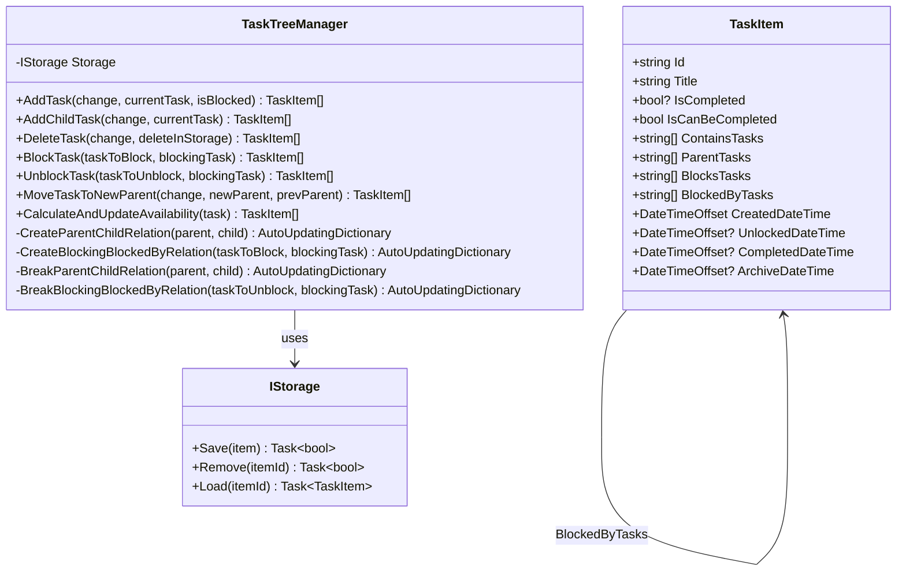
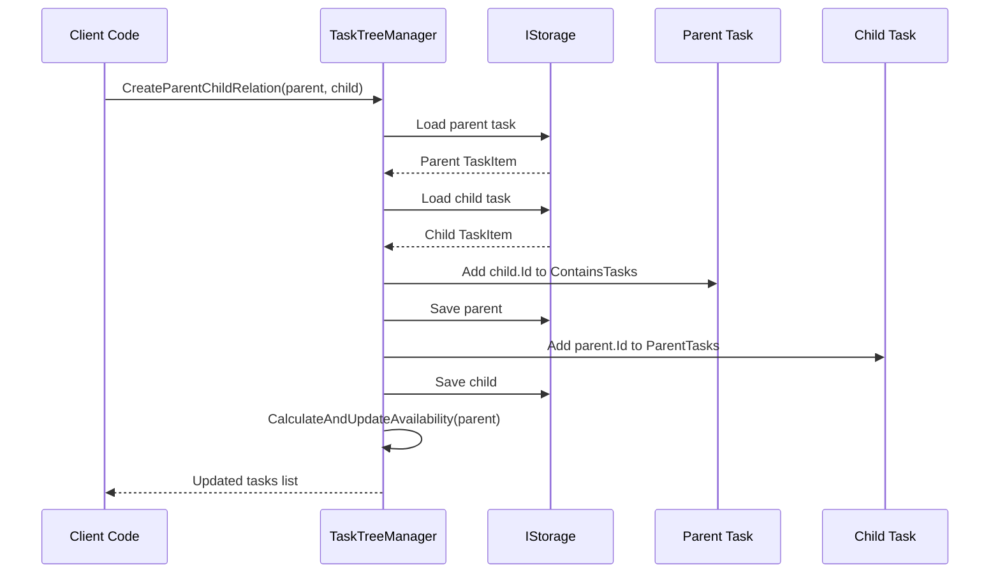
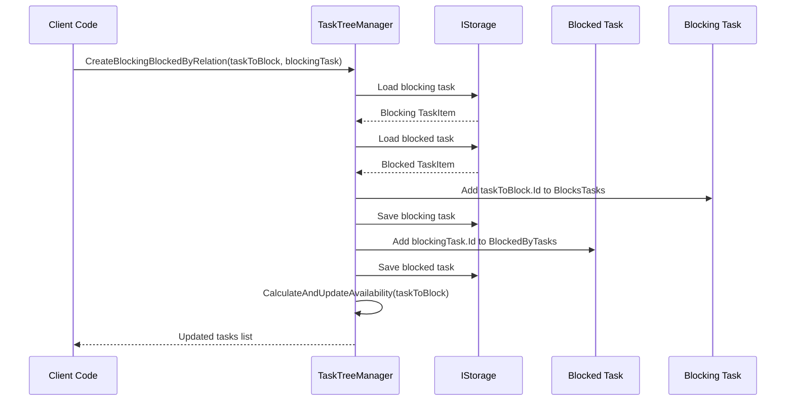
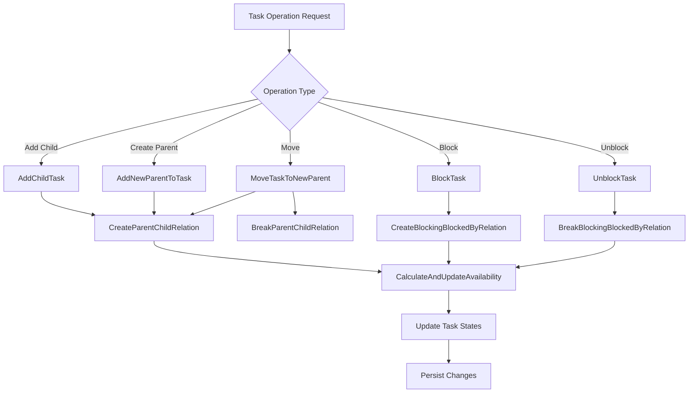
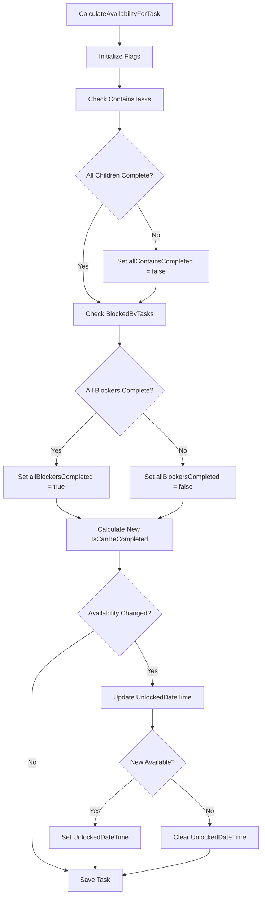
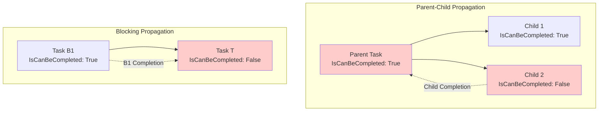

# Task Relationships

<cite>
**Referenced Files in This Document**
- [TaskItem.cs](file://src/Unlimotion.Domain/TaskItem.cs)
- [TaskTreeManager.cs](file://src/Unlimotion.TaskTreeManager/TaskTreeManager.cs)
- [ITaskTreeManager.cs](file://src/Unlimotion.TaskTreeManager/ITaskTreeManager.cs)
- [AutoUpdatingDictionary.cs](file://src/Unlimotion.TaskTreeManager/AutoUpdatingDictionary.cs)
- [IStorage.cs](file://src/Unlimotion.TaskTreeManager/IStorage.cs)
- [TaskAvailabilityCalculationTests.cs](file://src/Unlimotion.Test/TaskAvailabilityCalculationTests.cs)
- [TaskCompletionChangeTests.cs](file://src/Unlimotion.Test/TaskCompletionChangeTests.cs)
- [InMemoryStorage.cs](file://src/Unlimotion.Test/InMemoryStorage.cs)
- [README.md](file://README.md)
</cite>

## Table of Contents
1. [Introduction](#introduction)
2. [Task Relationship Architecture](#task-relationship-architecture)
3. [Core Relationship Collections](#core-relationship-collections)
4. [Parent-Child Relationships](#parent-child-relationships)
5. [Blocking Relationships](#blocking-relationships)
6. [Relationship Management Methods](#relationship-management-methods)
7. [Availability Calculation System](#availability-calculation-system)
8. [Propagation Rules](#propagation-rules)
9. [Practical Implementation Examples](#practical-implementation-examples)
10. [Testing and Validation](#testing-and-validation)
11. [Performance Considerations](#performance-considerations)
12. [Conclusion](#conclusion)

## Introduction

Unlimotion implements a sophisticated task relationship system that enables unlimited nesting and complex dependency management. The system supports two primary types of relationships: parent-child hierarchies and blocking dependencies. This dual relationship model allows for flexible task organization while maintaining strict dependency enforcement.

The task relationship system is built around four core collections in the TaskItem class: ContainsTasks, ParentTasks, BlocksTasks, and BlockedByTasks. These collections enable unlimited nesting capabilities and multiple parent support, distinguishing Unlimotion from traditional hierarchical task managers.

## Task Relationship Architecture

The task relationship system follows a bidirectional reference model where each relationship is maintained in both directions. This ensures data consistency and enables efficient traversal in both directions.



**Diagram sources**
- [TaskItem.cs](file://src/Unlimotion.Domain/TaskItem.cs#L5-L32)
- [TaskTreeManager.cs](file://src/Unlimotion.TaskTreeManager/TaskTreeManager.cs#L10-L15)
- [ITaskTreeManager.cs](file://src/Unlimotion.TaskTreeManager/ITaskTreeManager.cs#L7-L42)
- [IStorage.cs](file://src/Unlimotion.TaskTreeManager/IStorage.cs#L5-L10)

**Section sources**
- [TaskItem.cs](file://src/Unlimotion.Domain/TaskItem.cs#L5-L32)
- [TaskTreeManager.cs](file://src/Unlimotion.TaskTreeManager/TaskTreeManager.cs#L10-L15)

## Core Relationship Collections

The TaskItem class maintains four essential relationship collections that define the task's position in the system:

### ContainsTasks Collection
The ContainsTasks collection represents child tasks that are part of this task. This collection enables unlimited nesting where a single task can contain multiple subtasks, which can themselves contain further subtasks.

### ParentTasks Collection  
The ParentTasks collection maintains references to all parent tasks that contain this task. This unique feature allows a single task to have multiple parents, enabling cross-project relationships and tag-like functionality.

### BlocksTasks Collection
The BlocksTasks collection identifies tasks that this task blocks. When a task in this collection remains incomplete, the current task cannot be marked as completed.

### BlockedByTasks Collection
The BlockedByTasks collection contains tasks that block this task from being completed. This creates dependency relationships where completion of these blocking tasks is required.

```mermaid
graph TB
subgraph "Task Relationships"
A[Task A<br/>ContainsTasks: [B,C]<br/>BlockedByTasks: [D]]
B[Task B<br/>ParentTasks: [A]<br/>ContainsTasks: [E]]
C[Task C<br/>ParentTasks: [A]]
D[Task D<br/>BlocksTasks: [A]]
E[Task E<br/>ParentTasks: [B]]
end
A -.->|ContainsTasks| B
A -.->|ContainsTasks| C
B -.->|ParentTasks| A
C -.->|ParentTasks| A
D -.->|BlocksTasks| A
A -.->|BlockedByTasks| D
B -.->|ContainsTasks| E
E -.->|ParentTasks| B
```

**Diagram sources**
- [TaskItem.cs](file://src/Unlimotion.Domain/TaskItem.cs#L19-L22)

**Section sources**
- [TaskItem.cs](file://src/Unlimotion.Domain/TaskItem.cs#L19-L22)

## Parent-Child Relationships

Parent-child relationships form the foundation of task hierarchy in Unlimotion. These relationships enable unlimited nesting and provide the structural framework for organizing complex task systems.

### Creating Parent-Child Relations

The `CreateParentChildRelation` method establishes bidirectional parent-child relationships between tasks. This method ensures that both the parent task's ContainsTasks collection and the child task's ParentTasks collection are properly maintained.



**Diagram sources**
- [TaskTreeManager.cs](file://src/Unlimotion.TaskTreeManager/TaskTreeManager.cs#L452-L495)

### Multiple Parent Support

One of Unlimotion's distinctive features is the ability for a single task to have multiple parents. This capability enables:

- **Cross-project relationships**: Tasks that belong to multiple projects simultaneously
- **Tag-like functionality**: Organizing tasks under different organizational contexts
- **Flexible categorization**: Assigning tasks to multiple logical groupings

The system handles multiple parents seamlessly by maintaining a list of parent IDs in the ParentTasks collection. When operations occur on a task, the system iterates through all parent relationships.

### Nested Hierarchy Management

The ContainsTasks collection enables unlimited nesting depth. Each task can contain multiple child tasks, which can themselves contain further children, creating a potentially infinite hierarchy.

**Section sources**
- [TaskTreeManager.cs](file://src/Unlimotion.TaskTreeManager/TaskTreeManager.cs#L452-L495)
- [TaskTreeManager.cs](file://src/Unlimotion.TaskTreeManager/TaskTreeManager.cs#L379-L385)

## Blocking Relationships

Blocking relationships create dependency constraints that prevent tasks from being completed until their blocking dependencies are satisfied. These relationships are crucial for enforcing execution order and managing complex workflows.

### Establishing Blocking Dependencies

The `CreateBlockingBlockedByRelation` method creates bidirectional blocking relationships. Unlike parent-child relationships, blocking relationships only affect availability in one direction.



**Diagram sources**
- [TaskTreeManager.cs](file://src/Unlimotion.TaskTreeManager/TaskTreeManager.cs#L497-L538)

### Blocking Relationship Characteristics

Blocking relationships have several important characteristics:

1. **Unidirectional Impact**: Blocking a task only affects the availability of the blocked task, not the blocking task itself
2. **Strict Enforcement**: All blocking tasks must be completed for a task to become available
3. **Immediate Recalculation**: Changes to blocking relationships trigger immediate availability recalculation

**Section sources**
- [TaskTreeManager.cs](file://src/Unlimotion.TaskTreeManager/TaskTreeManager.cs#L497-L538)

## Relationship Management Methods

The TaskTreeManager provides comprehensive methods for managing task relationships throughout their lifecycle.

### Core Relationship Operations

| Method | Purpose | Relationship Affected |
|--------|---------|----------------------|
| `CreateParentChildRelation` | Establishes parent-child relationships | ContainsTasks, ParentTasks |
| `BreakParentChildRelation` | Removes parent-child relationships | ContainsTasks, ParentTasks |
| `CreateBlockingBlockedByRelation` | Creates blocking dependencies | BlocksTasks, BlockedByTasks |
| `BreakBlockingBlockedByRelation` | Removes blocking dependencies | BlocksTasks, BlockedByTasks |
| `AddChildTask` | Adds a task as a child to a parent | ContainsTasks, ParentTasks |
| `MoveTaskToNewParent` | Relocates a task to a different parent | ContainsTasks, ParentTasks |

### Advanced Relationship Management



**Diagram sources**
- [TaskTreeManager.cs](file://src/Unlimotion.TaskTreeManager/TaskTreeManager.cs#L379-L412)
- [TaskTreeManager.cs](file://src/Unlimotion.TaskTreeManager/TaskTreeManager.cs#L414-L425)

**Section sources**
- [TaskTreeManager.cs](file://src/Unlimotion.TaskTreeManager/TaskTreeManager.cs#L379-L425)
- [ITaskTreeManager.cs](file://src/Unlimotion.TaskTreeManager/ITaskTreeManager.cs#L7-L25)

## Availability Calculation System

The availability calculation system determines whether tasks can be completed based on their relationship dependencies. This system forms the core of Unlimotion's workflow enforcement mechanism.

### Availability Calculation Logic

The `CalculateAvailabilityForTask` method implements the core business logic for determining task availability:



**Diagram sources**
- [TaskTreeManager.cs](file://src/Unlimotion.TaskTreeManager/TaskTreeManager.cs#L633-L700)

### Availability Determination Rules

A task can be completed when both conditions are met:

1. **All contained tasks are completed**: Every task listed in ContainsTasks must have IsCompleted != false
2. **All blocking tasks are completed**: Every task listed in BlockedByTasks must have IsCompleted != false

### Propagation Mechanism

The `GetAffectedTasks` method identifies tasks that need availability recalculation when a task's state changes:

- **Parent tasks**: Tasks that contain the modified task need recalculation
- **Blocked tasks**: Tasks that are blocked by the modified task need recalculation

**Section sources**
- [TaskTreeManager.cs](file://src/Unlimotion.TaskTreeManager/TaskTreeManager.cs#L633-L700)
- [TaskTreeManager.cs](file://src/Unlimotion.TaskTreeManager/TaskTreeManager.cs#L702-L735)

## Propagation Rules

Understanding propagation rules is crucial for effectively using Unlimotion's relationship system. These rules govern how changes in one task affect related tasks.

### Parent Task Propagation

Parent tasks are affected when:
- **Children are added**: The parent becomes blocked until all children are completed
- **Children are removed**: The parent becomes available if previously blocked
- **Children's completion status changes**: The parent's availability is recalculated
- **Children are moved**: Both the previous and new parents are affected

### Blocking Task Propagation

Blocking relationships propagate differently:
- **Blocking task completion**: Only the blocked task's availability is affected
- **Blocking task blocking**: Only the blocked task's availability is affected
- **Blocking relationships removed**: Only the previously blocked task's availability is affected

### Example Propagation Scenarios



**Section sources**
- [TaskTreeManager.cs](file://src/Unlimotion.TaskTreeManager/TaskTreeManager.cs#L702-L735)

## Practical Implementation Examples

### Adding a Parent Task

When adding a parent task to an existing child, both collections are updated:

1. **Parent Task**: Child ID added to ContainsTasks collection
2. **Child Task**: Parent ID added to ParentTasks collection  
3. **Availability Recalculation**: Parent task availability is recalculated

### Creating Blocking Relationships

Establishing a blocking relationship involves:

1. **Blocking Task**: Blocked task ID added to BlocksTasks collection
2. **Blocked Task**: Blocking task ID added to BlockedByTasks collection
3. **Availability Recalculation**: Only the blocked task's availability is recalculated

### Moving Tasks Between Parents

The `MoveTaskToNewParent` operation handles complex scenarios:

1. **Previous Parent**: Child removed from ContainsTasks
2. **New Parent**: Child added to ContainsTasks
3. **Child Task**: Parent removed from ParentTasks, new parent added
4. **Availability Recalculation**: New parent's availability is recalculated

**Section sources**
- [TaskTreeManager.cs](file://src/Unlimotion.TaskTreeManager/TaskTreeManager.cs#L387-L412)
- [TaskTreeManager.cs](file://src/Unlimotion.TaskTreeManager/TaskTreeManager.cs#L414-L425)

## Testing and Validation

The task relationship system includes comprehensive testing to ensure correctness and reliability.

### Availability Calculation Tests

The test suite validates various scenarios:

- **Basic availability**: Tasks with no dependencies
- **Parent-child relationships**: Incomplete children block parents
- **Blocking relationships**: Incomplete blockers block tasks
- **Mixed dependencies**: Tasks with both contained and blocking dependencies
- **State transitions**: Availability changes when dependencies complete

### Relationship Management Tests

Tests verify that:
- **Bidirectional relationships**: Both sides of relationships are maintained
- **Relationship removal**: Breaking relationships clears both sides
- **Multiple parents**: Tasks can have multiple parent relationships
- **Propagation**: Changes correctly affect dependent tasks

**Section sources**
- [TaskAvailabilityCalculationTests.cs](file://src/Unlimotion.Test/TaskAvailabilityCalculationTests.cs#L12-L199)
- [TaskCompletionChangeTests.cs](file://src/Unlimotion.Test/TaskCompletionChangeTests.cs#L12-L127)

## Performance Considerations

### Storage Efficiency

The AutoUpdatingDictionary class optimizes storage operations by batching updates and avoiding redundant saves. This approach minimizes database I/O during complex relationship operations.

### Calculation Complexity

Availability calculations have O(n) complexity where n is the number of related tasks. The system uses caching and incremental updates to minimize computational overhead.

### Memory Management

The system avoids memory leaks by properly managing task references and using weak references where appropriate. The AutoUpdatingDictionary helps manage memory by providing controlled update mechanisms.

### Scalability Limits

While the system supports unlimited nesting, extremely deep hierarchies may impact performance. The system is designed to handle typical organizational structures efficiently.

## Conclusion

Unlimotion's task relationship system provides a powerful foundation for complex task management. The combination of unlimited nesting through parent-child relationships and strict dependency enforcement through blocking relationships creates a flexible yet reliable system.

Key strengths of the system include:

- **Flexibility**: Multiple parent support and unlimited nesting
- **Reliability**: Bidirectional relationships ensure data consistency  
- **Performance**: Efficient calculation and storage mechanisms
- **Usability**: Clear propagation rules and comprehensive testing

The system successfully balances complexity with usability, providing advanced features while maintaining intuitive operation. The comprehensive test suite ensures reliability, and the modular architecture supports future enhancements.