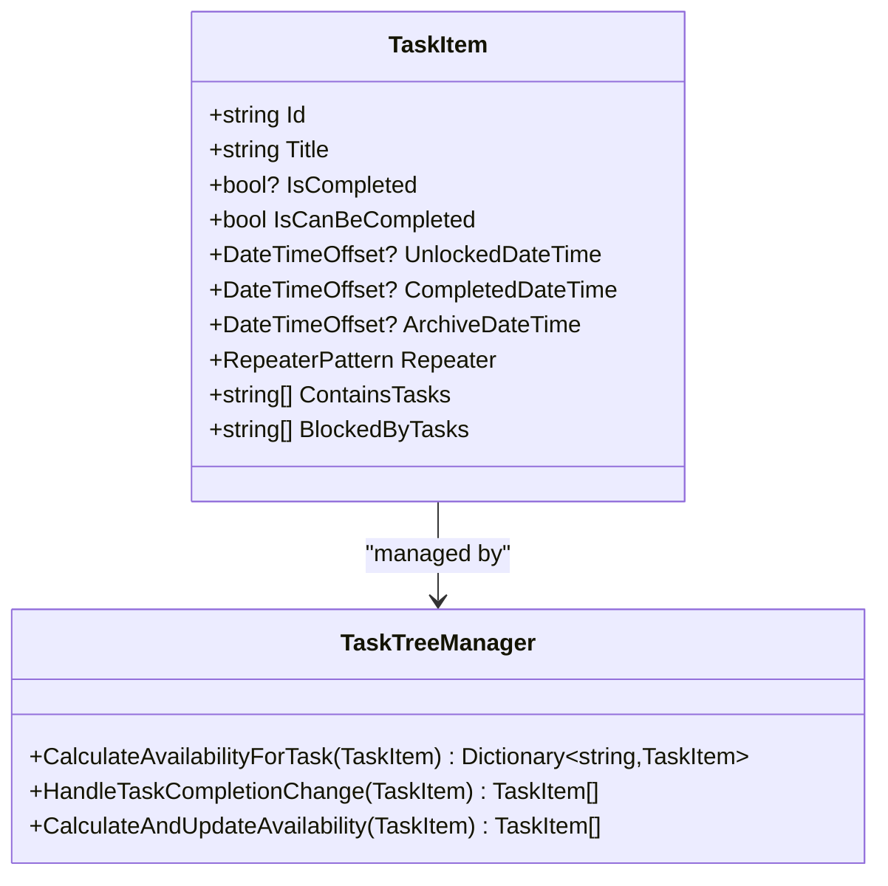
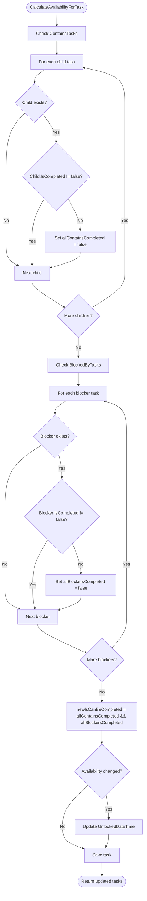
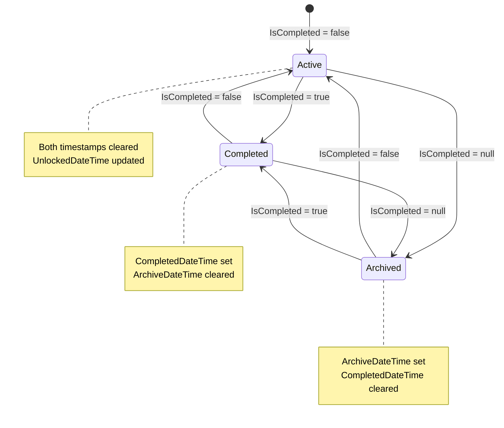
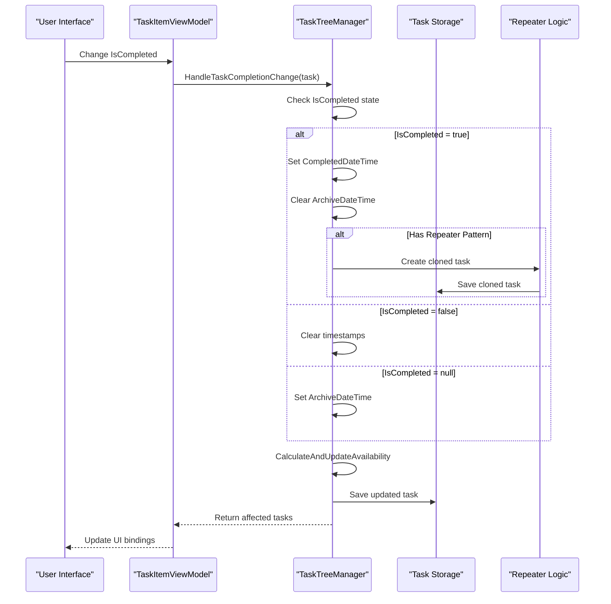
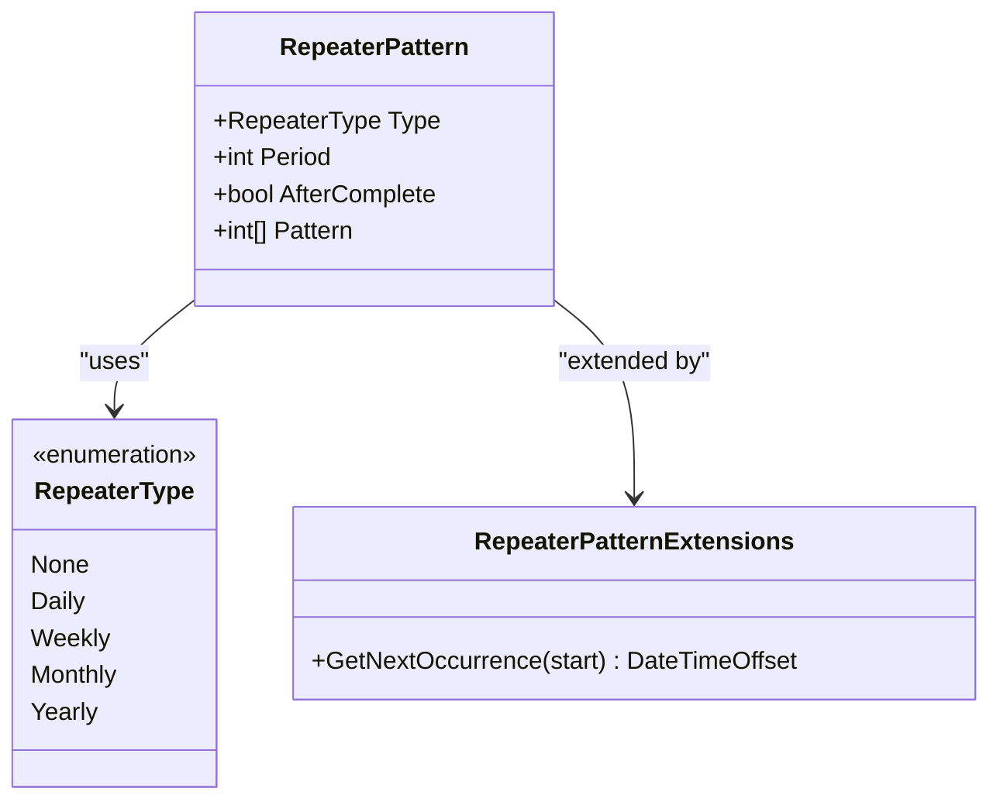
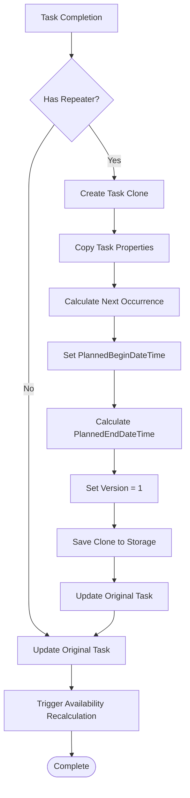
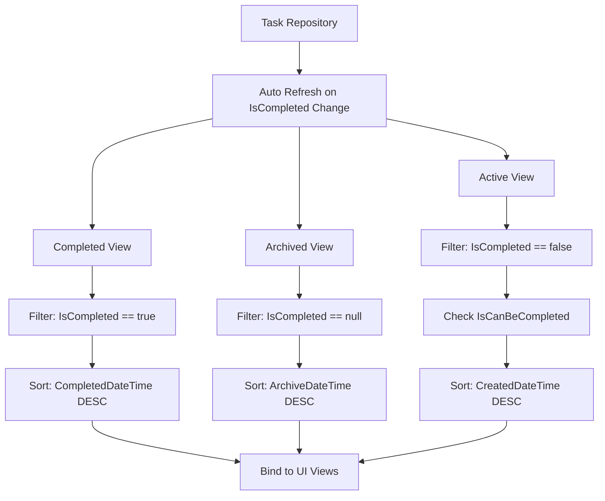
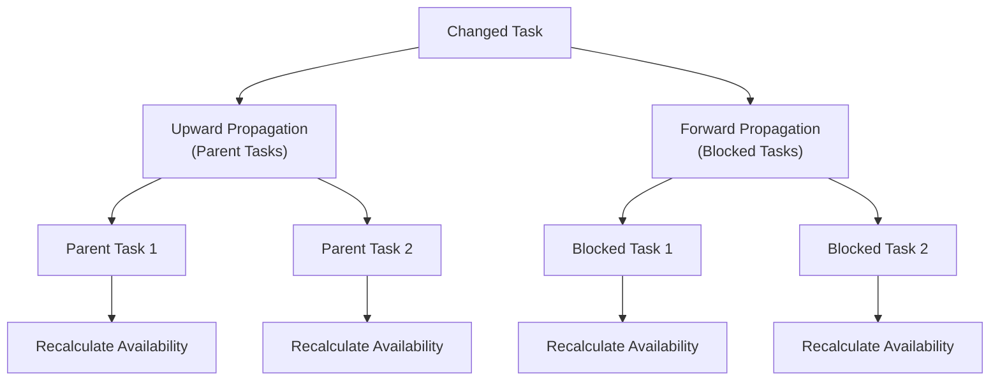

# Task States

<cite>
**Referenced Files in This Document**
- [TaskItem.cs](file://src/Unlimotion.Domain/TaskItem.cs)
- [TaskTreeManager.cs](file://src/Unlimotion.TaskTreeManager/TaskTreeManager.cs)
- [ITaskTreeManager.cs](file://src/Unlimotion.TaskTreeManager/ITaskTreeManager.cs)
- [TaskCompletionChangeTests.cs](file://src/Unlimotion.Test\TaskCompletionChangeTests.cs)
- [TaskAvailabilityCalculationTests.cs](file://src\Unlimotion.Test\TaskAvailabilityCalculationTests.cs)
- [RepeaterPatternExtensions.cs](file://src\Unlimotion.Domain\RepeaterPatternExtensions.cs)
- [TaskItemViewModel.cs](file://src\Unlimotion.ViewModel\TaskItemViewModel.cs)
- [MainWindowViewModel.cs](file://src\Unlimotion.ViewModel\MainWindowViewModel.cs)
- [UnlockedTimeFilter.cs](file://src\Unlimotion.ViewModel\UnlockedTimeFilter.cs)
- [IMPLEMENTATION_SUMMARY.md](file://IMPLEMENTATION_SUMMARY.md)
</cite>

## Table of Contents
1. [Introduction](#introduction)
2. [Three-State Completion Model](#three-state-completion-model)
3. [Task Availability System](#task-availability-system)
4. [State Transition Rules](#state-transition-rules)
5. [Repeater Pattern Cloning](#repeater-pattern-cloning)
6. [Task Visibility in Views](#task-visibility-in-views)
7. [Implementation Details](#implementation-details)
8. [Testing and Validation](#testing-and-validation)
9. [Best Practices](#best-practices)
10. [Troubleshooting Guide](#troubleshooting-guide)

## Introduction

Unlimotion implements a sophisticated three-state task management system that provides granular control over task lifecycle and visibility. The system uses a ternary completion model with distinct states for active, completed, and archived tasks, combined with an intelligent availability calculation engine that determines when tasks can be completed based on their dependencies.

This documentation covers the complete task state management system, including the IsCompleted property model, availability calculations, state transitions, repeater pattern cloning, and how these states affect task visibility across different views.

## Three-State Completion Model

The task completion system uses a nullable boolean property `IsCompleted` that represents three distinct states:

### State Definitions

| State Value | Meaning | Use Case |
|-------------|---------|----------|
| `true` | Task is completed | Finalized tasks that have been finished |
| `false` | Task is active | Currently available and actionable tasks |
| `null` | Task is archived | Hidden tasks that are no longer active |

### Property Structure

The `IsCompleted` property is defined in the TaskItem domain model with a nullable boolean type:

**Diagram sources**
- [TaskItem.cs](file://src\Unlimotion.Domain\TaskItem.cs#L6-L25)
- [TaskTreeManager.cs](file://src\Unlimotion.TaskTreeManager\TaskTreeManager.cs#L629-L737)

**Section sources**
- [TaskItem.cs](file://src\Unlimotion.Domain\TaskItem.cs#L8-L9)

## Task Availability System

The availability calculation system determines whether a task can be marked as completed based on its dependencies. This is managed through the `IsCanBeCompleted` property and the `CalculateAvailabilityForTask` method.

### Availability Business Rules

A task can be completed when both conditions are met:

1. **All contained tasks are completed** (IsCompleted != false)
2. **All blocking tasks are completed** (IsCompleted != false)

### Availability Calculation Logic

The availability calculation process involves checking task dependencies:

**Diagram sources**
- [TaskTreeManager.cs](file://src\Unlimotion.TaskTreeManager\TaskTreeManager.cs#L629-L737)

### UnlockedDateTime Management

The `UnlockedDateTime` property tracks when a task becomes available for completion:

| Event | Action | Condition |
|-------|--------|-----------|
| Task becomes available (false → true) | Set to current UTC time | `newIsCanBeCompleted && (!previousIsCanBeCompleted \| task.UnlockedDateTime == null)` |
| Task becomes blocked (true → false) | Clear to null | `!newIsCanBeCompleted && previousIsCanBeCompleted` |
| No change | No action | Otherwise |

**Section sources**
- [TaskTreeManager.cs](file://src\Unlimotion.TaskTreeManager\TaskTreeManager.cs#L685-L705)

## State Transition Rules

The system enforces strict state transition rules that govern how task states change and when timestamps are updated.

### Transition Logic

### Timestamp Management

Each state transition updates specific timestamps according to these rules:

| From State | To State | CompletedDateTime | ArchiveDateTime | UnlockedDateTime |
|------------|----------|-------------------|-----------------|------------------|
| false | true | Set to current UTC | Cleared | Updated |
| true | false | Cleared | Cleared | Updated |
| true | null | Cleared | Set to current UTC | Cleared |
| false | null | Cleared | Set to current UTC | Cleared |
| null | false | Cleared | Cleared | Updated |
| null | true | Set to current UTC | Cleared | Updated |

### HandleTaskCompletionChange Method

The `HandleTaskCompletionChange` method orchestrates state transitions and triggers appropriate actions:

**Diagram sources**
- [TaskTreeManager.cs](file://src\Unlimotion.TaskTreeManager\TaskTreeManager.cs#L747-L836)

**Section sources**
- [TaskTreeManager.cs](file://src\Unlimotion.TaskTreeManager\TaskTreeManager.cs#L747-L836)

## Repeater Pattern Cloning

The repeater pattern system enables recurring tasks by automatically creating clones when a task is completed. This functionality is integrated into the state transition logic.

### Repeater Pattern Structure

The repeater pattern defines how tasks repeat:

**Diagram sources**
- [RepeaterPattern.cs](file://src\Unlimotion.Domain\RepeaterPattern.cs#L6-L13)
- [RepeaterType.cs](file://src\Unlimotion.Domain\RepeaterType.cs#L3-L9)
- [RepeaterPatternExtensions.cs](file://src\Unlimotion.Domain\RepeaterPatternExtensions.cs#L8-L83)

### Cloning Process

When a task with a repeater pattern completes, the system creates a new task clone:

**Diagram sources**
- [TaskTreeManager.cs](file://src\Unlimotion.TaskTreeManager\TaskTreeManager.cs#L771-L810)

### Repeater Pattern Extensions

The `GetNextOccurrence` method calculates when the next repetition should occur:

**Section sources**
- [TaskTreeManager.cs](file://src\Unlimotion.TaskTreeManager\TaskTreeManager.cs#L771-L810)
- [RepeaterPatternExtensions.cs](file://src\Unlimotion.Domain\RepeaterPatternExtensions.cs#L8-L83)

## Task Visibility in Views

The task state system integrates with the UI layer to provide different views for each task state, with automatic filtering and sorting.

### View Filtering Logic

The MainWindowViewModel implements reactive filtering for each task state:

**Diagram sources**
- [MainWindowViewModel.cs](file://src\Unlimotion.ViewModel\MainWindowViewModel.cs#L591-L655)

### Reactive Binding Patterns

The UI uses reactive bindings to automatically update when task states change:

| View | Filter Condition | Sorting | Auto Refresh Trigger |
|------|------------------|---------|---------------------|
| Active Tasks | `IsCompleted == false` | `CreatedDateTime DESC` | `IsCanBeCompleted` |
| Completed Tasks | `IsCompleted == true` | `CompletedDateTime DESC` | `IsCompleted == true` |
| Archived Tasks | `IsCompleted == null` | `ArchiveDateTime DESC` | `IsCompleted == null` |

### Unlocked Time Filter

The system provides specialized filters for task availability:

**Section sources**
- [MainWindowViewModel.cs](file://src\Unlimotion.ViewModel\MainWindowViewModel.cs#L591-L655)
- [UnlockedTimeFilter.cs](file://src\Unlimotion.ViewModel\UnlockedTimeFilter.cs#L30-L41)

## Implementation Details

### Core Business Logic Location

The task state management business logic is centralized in the TaskTreeManager class, which provides:

- **Availability Calculation**: `CalculateAvailabilityForTask` method
- **State Transitions**: `HandleTaskCompletionChange` method  
- **Dependency Propagation**: Automatic recalculation of affected tasks
- **Repeater Pattern Support**: Automatic task cloning for recurring tasks

### Dependency Propagation

When a task's completion state changes, the system automatically recalculates availability for related tasks:

**Diagram sources**
- [TaskTreeManager.cs](file://src\Unlimotion.TaskTreeManager\TaskTreeManager.cs#L707-L745)

### Storage Integration

The task state system integrates with the storage layer through the ITaskStorage interface, ensuring persistence of all state changes and timestamps.

**Section sources**
- [TaskTreeManager.cs](file://src\Unlimotion.TaskTreeManager\TaskTreeManager.cs#L629-L745)
- [ITaskTreeManager.cs](file://src\Unlimotion.TaskTreeManager\ITaskTreeManager.cs#L33-L41)

## Testing and Validation

The system includes comprehensive unit tests that validate all state transitions and business logic.

### Test Coverage Areas

| Test Category | Test Cases | Validation Points |
|---------------|------------|-------------------|
| State Transitions | Completed → Archived, Archived → Completed | Timestamps, Availability |
| Repeater Pattern | Daily, Weekly, Monthly, Yearly | Next occurrence calculation |
| Dependency Logic | Child completion, Blocking tasks | Availability calculation |
| UI Integration | Reactive bindings, View filtering | Automatic updates |

### Key Test Scenarios

The test suite validates:

- **Timestamp Management**: Proper setting and clearing of completion and archive dates
- **Availability Calculations**: Correct determination of task availability based on dependencies
- **Repeater Pattern**: Accurate creation of task clones with correct timing
- **State Propagation**: Automatic recalculation of affected tasks when dependencies change

**Section sources**
- [TaskCompletionChangeTests.cs](file://src\Unlimotion.Test\TaskCompletionChangeTests.cs#L10-L127)
- [TaskAvailabilityCalculationTests.cs](file://src\Unlimotion.Test\TaskAvailabilityCalculationTests.cs#L10-L683)

## Best Practices

### Development Guidelines

1. **Centralized Logic**: Business logic resides in TaskTreeManager, not in ViewModels
2. **Reactive Updates**: Use reactive bindings for automatic UI updates
3. **Atomic Operations**: State changes trigger complete recalculation cycles
4. **Timestamp Consistency**: Always use UTC time for timestamps
5. **Dependency Management**: Maintain proper parent-child relationships

### Performance Considerations

- **Batch Updates**: Group related task updates to minimize recalculations
- **Lazy Loading**: Load task dependencies only when needed
- **Caching**: Cache availability calculations for frequently accessed tasks
- **Async Operations**: Use asynchronous methods for storage operations

### Error Handling

- **Validation**: Validate repeater patterns before saving
- **Recovery**: Handle missing dependencies gracefully
- **Logging**: Track state transitions for debugging
- **Rollback**: Support undo operations for critical state changes

## Troubleshooting Guide

### Common Issues and Solutions

| Issue | Symptoms | Solution |
|-------|----------|----------|
| Task not becoming available | `IsCanBeCompleted` stays false | Check child task completion status |
| Repeater not working | No cloned tasks created | Verify `PlannedBeginDateTime` is set |
| Stale availability | Outdated `IsCanBeCompleted` | Trigger manual availability recalculation |
| Timestamp inconsistencies | Wrong completion/archive dates | Check timezone handling |

### Debugging State Issues

1. **Verify Dependencies**: Ensure all contained and blocking tasks have correct completion states
2. **Check Timestamps**: Confirm `CompletedDateTime` and `ArchiveDateTime` are set appropriately
3. **Validate Repeater**: Test repeater pattern calculations manually
4. **Review Propagation**: Trace availability changes through task relationships

### Performance Optimization

- Monitor availability calculation frequency
- Optimize dependency chains
- Use batch operations for bulk updates
- Implement caching for frequently accessed tasks

**Section sources**
- [TaskTreeManager.cs](file://src\Unlimotion.TaskTreeManager\TaskTreeManager.cs#L629-L745)