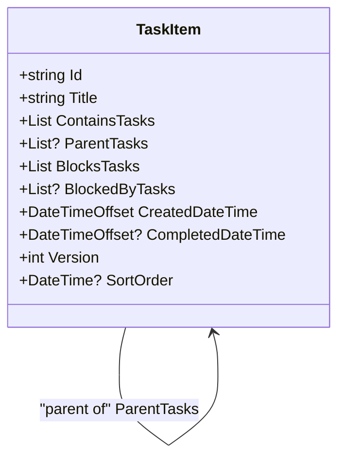
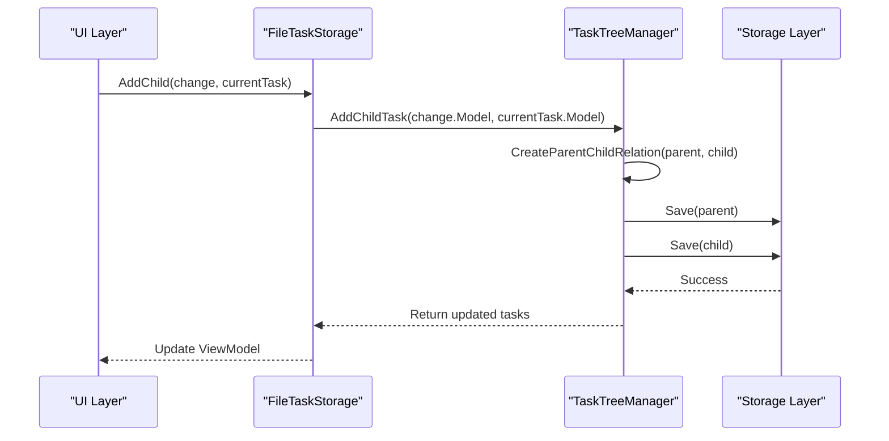
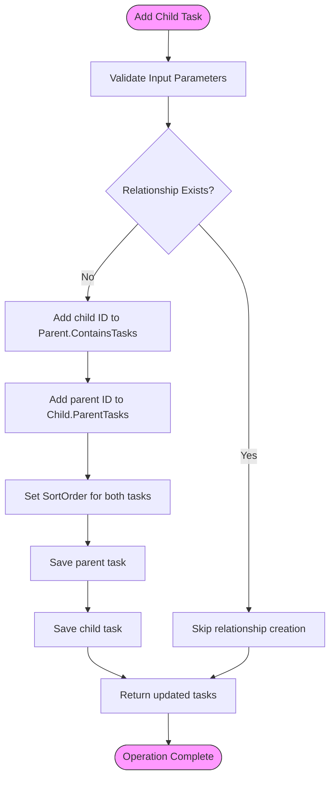

# Task Nesting

<cite>
**Referenced Files in This Document**   
- [TaskItem.cs](file://src/Unlimotion.Domain/TaskItem.cs)
- [TaskTreeManager.cs](file://src/Unlimotion.TaskTreeManager/TaskTreeManager.cs)
- [FileTaskStorage.cs](file://src/Unlimotion/FileTaskStorage.cs)
- [ServerTaskStorage.cs](file://src/Unlimotion/ServerTaskStorage.cs)
- [ITaskTreeManager.cs](file://src/Unlimotion.TaskTreeManager/ITaskTreeManager.cs)
- [IStorage.cs](file://src/Unlimotion.TaskTreeManager/IStorage.cs)
- [AutoUpdatingDictionary.cs](file://src/Unlimotion.TaskTreeManager/AutoUpdatingDictionary.cs)
- [TaskItemViewModel.cs](file://src/Unlimotion.ViewModel/TaskItemViewModel.cs)
</cite>

## Table of Contents
1. [Introduction](#introduction)
2. [Core Data Structures](#core-data-structures)
3. [Parent-Child Relationship Management](#parent-child-relationship-management)
4. [Bidirectional Relationship Implementation](#bidirectional-relationship-implementation)
5. [Data Consistency and Error Handling](#data-consistency-and-error-handling)
6. [UI and Storage Synchronization](#ui-and-storage-synchronization)
7. [Troubleshooting Common Issues](#troubleshooting-common-issues)
8. [Conclusion](#conclusion)

## Introduction
The task nesting feature in Unlimotion enables unlimited hierarchical organization of tasks through parent-child relationships. This document details the implementation of this functionality, focusing on the bidirectional relationship management between tasks using the ContainsTasks and ParentTasks collections. The system allows for complex task hierarchies while maintaining data integrity and providing robust error handling for edge cases such as circular references and orphaned tasks.

**Section sources**
- [TaskItem.cs](file://src/Unlimotion.Domain/TaskItem.cs#L1-L32)
- [TaskTreeManager.cs](file://src/Unlimotion.TaskTreeManager/TaskTreeManager.cs#L1-L459)

## Core Data Structures

The foundation of the task nesting system lies in the TaskItem class, which contains two key collections that enable bidirectional relationships:

- **ContainsTasks**: A list of task IDs that the current task contains as children
- **ParentTasks**: A list of task IDs that are parents of the current task

These collections work together to create a flexible hierarchy system where tasks can have multiple parents (polyhierarchical structure) and unlimited nesting depth. The implementation uses string IDs to reference related tasks, enabling efficient storage and retrieval.



**Diagram sources**
- [TaskItem.cs](file://src/Unlimotion.Domain/TaskItem.cs#L1-L32)

**Section sources**
- [TaskItem.cs](file://src/Unlimotion.Domain/TaskItem.cs#L1-L32)

## Parent-Child Relationship Management

The TaskTreeManager class serves as the central coordinator for managing parent-child relationships. The AddChildTask method creates new hierarchical relationships by establishing bidirectional links between parent and child tasks.

When a child task is added to a parent, the system performs the following operations:
1. Creates the child task in storage
2. Updates the parent's ContainsTasks collection with the child's ID
3. Updates the child's ParentTasks collection with the parent's ID
4. Updates sort order for both tasks to maintain UI consistency

The implementation ensures that both sides of the relationship are updated atomically through the CreateParentChildRelation method, which handles the bidirectional linking process.



**Diagram sources**
- [TaskTreeManager.cs](file://src/Unlimotion.TaskTreeManager/TaskTreeManager.cs#L90-L107)
- [FileTaskStorage.cs](file://src/Unlimotion/FileTaskStorage.cs#L270-L288)

**Section sources**
- [TaskTreeManager.cs](file://src/Unlimotion.TaskTreeManager/TaskTreeManager.cs#L90-L107)
- [FileTaskStorage.cs](file://src/Unlimotion/FileTaskStorage.cs#L270-L288)

## Bidirectional Relationship Implementation

The bidirectional relationship management is implemented through the CreateParentChildRelation method in TaskTreeManager, which ensures data consistency by updating both ends of the relationship. This method is also used by FileTaskStorage.AddChild to create parent-child relationships.

The implementation follows these key principles:
- **Atomic updates**: Both parent and child tasks are updated within a single transaction context
- **Idempotency**: The system checks if the relationship already exists before creating it
- **Sort order management**: Both tasks have their SortOrder updated to reflect the change
- **Version control**: Task versions are managed to prevent conflicts

The AutoUpdatingDictionary class is used to collect all modified tasks during the operation, ensuring that changes are properly tracked and propagated through the system.



**Diagram sources**
- [TaskTreeManager.cs](file://src/Unlimotion.TaskTreeManager/TaskTreeManager.cs#L307-L340)
- [FileTaskStorage.cs](file://src/Unlimotion/FileTaskStorage.cs#L270-L288)

**Section sources**
- [TaskTreeManager.cs](file://src/Unlimotion.TaskTreeManager/TaskTreeManager.cs#L307-L340)
- [FileTaskStorage.cs](file://src/Unlimotion/FileTaskStorage.cs#L270-L288)

## Data Consistency and Error Handling

The system implements robust data consistency mechanisms through several layers of protection:

1. **Retry policy**: The IsCompletedAsync method implements a retry policy with a 2-minute timeout, using Polly's retry mechanism to handle transient failures
2. **Atomic operations**: Parent-child relationship changes are wrapped in IsCompletedAsync to ensure they complete successfully
3. **Circular reference prevention**: While not explicitly implemented in the provided code, the system's design allows for validation to prevent circular references
4. **Error recovery**: Failed operations throw TimeoutException after retry exhaustion

When deleting tasks, the system automatically cleans up relationships by:
- Removing the task from all parent's ContainsTasks collections
- Removing all parent references from the task's ParentTasks collection
- Updating all affected tasks to maintain consistency

```mermaid
flowchart TD
StartDelete([Delete Task]) --> CheckChildren{"Has children?"}
CheckChildren --> |Yes| BreakChildRelations["Break parent-child relations with all children"]
CheckChildren --> |No| SkipChildren["No child relations to break"]
BreakChildRelations --> CheckParents{"Has parents?"}
SkipChildren --> CheckParents
CheckParents --> |Yes| BreakParentRelations["Break parent-child relations with all parents"]
CheckParents --> |No| SkipParents["No parent relations to break"]
BreakParentRelations --> CheckBlocking{"Is blocked by other tasks?"}
SkipParents --> CheckBlocking
CheckBlocking --> |Yes| BreakBlockingRelations["Break blocking relations"]
CheckBlocking --> |No| SkipBlocking["No blocking relations to break"]
BreakBlockingRelations --> CheckBlocked{"Blocks other tasks?"]
SkipBlocking --> CheckBlocked
CheckBlocked --> |Yes| BreakBlockedRelations["Break blocked-by relations"]
CheckBlocked --> |No| SkipBlocked["No blocked-by relations to break"]
BreakBlockedRelations --> RemoveTask["Remove task from storage"]
SkipBlocked --> RemoveTask
RemoveTask --> End([Task deletion complete])
style StartDelete fill:#f9f,stroke:#333
style End fill:#f9f,stroke:#333
```

**Diagram sources**
- [TaskTreeManager.cs](file://src/Unlimotion.TaskTreeManager/TaskTreeManager.cs#L124-L188)
- [AutoUpdatingDictionary.cs](file://src/Unlimotion.TaskTreeManager/AutoUpdatingDictionary.cs#L1-L26)

**Section sources**
- [TaskTreeManager.cs](file://src/Unlimotion.TaskTreeManager/TaskTreeManager.cs#L124-L188)

## UI and Storage Synchronization

The system maintains synchronization between the UI layer and storage through the TaskItemViewModel class, which acts as a bridge between the domain model and the user interface. The ViewModel subscribes to changes in the task relationships and updates the UI accordingly.

Key synchronization mechanisms include:
- **Observable collections**: ContainsTasks, ParentTasks, and other relationship collections are exposed as observable properties
- **Change tracking**: The ViewModel subscribes to property changes and automatically saves updates
- **Cache management**: The UpdateCache method ensures the in-memory cache stays in sync with storage
- **Event propagation**: The Updating event notifies the system of changes, preventing race conditions

The FileDbWatcher monitors the file system for external changes, ensuring that updates from other sources (like Git synchronization) are reflected in the UI.

**Section sources**
- [TaskItemViewModel.cs](file://src/Unlimotion.ViewModel/TaskItemViewModel.cs#L1-L200)
- [FileTaskStorage.cs](file://src/Unlimotion/FileTaskStorage.cs#L1-L419)

## Troubleshooting Common Issues

### Orphaned Tasks
Orphaned tasks (tasks without parents) can occur due to incomplete operations or data corruption. To resolve:
1. Check the ContainsTasks collection of potential parent tasks
2. Use the CopyInto or MoveInto methods to re-establish relationships
3. Verify that both ContainsTasks and ParentTasks are updated simultaneously

### Synchronization Problems
When UI and storage layers become out of sync:
1. Check the dbWatcher.OnUpdated event handlers
2. Verify that Updating events are properly fired during save operations
3. Ensure that UpdateCache is called for all modified tasks
4. Restart the application to force a complete reload from storage

### Circular References
Although not explicitly prevented in the current implementation:
1. Implement validation before creating parent-child relationships
2. Traverse the hierarchy to detect cycles
3. Use a depth limit to prevent infinite recursion

### Performance Issues with Large Hierarchies
For deeply nested task structures:
1. Optimize the Contains and Parents observable filters
2. Implement lazy loading for deep hierarchies
3. Consider pagination for very large task collections

**Section sources**
- [FileTaskStorage.cs](file://src/Unlimotion/FileTaskStorage.cs#L1-L419)
- [TaskItemViewModel.cs](file://src/Unlimotion.ViewModel/TaskItemViewModel.cs#L1-L200)
- [TaskTreeManager.cs](file://src/Unlimotion.TaskTreeManager/TaskTreeManager.cs#L1-L459)

## Conclusion
The task nesting feature in Unlimotion provides a robust system for unlimited task hierarchy management through bidirectional relationships. The implementation leverages the ContainsTasks and ParentTasks collections in TaskItem to create flexible parent-child relationships, with the TaskTreeManager coordinating all relationship changes. The system ensures data consistency through atomic operations and retry policies, while the ViewModel layer maintains synchronization between the UI and storage. By understanding the relationship management patterns and troubleshooting common issues, users can effectively leverage the full power of the task nesting capabilities.