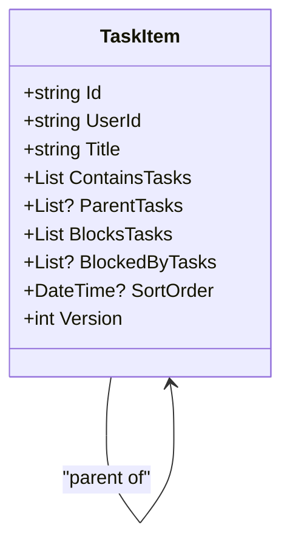
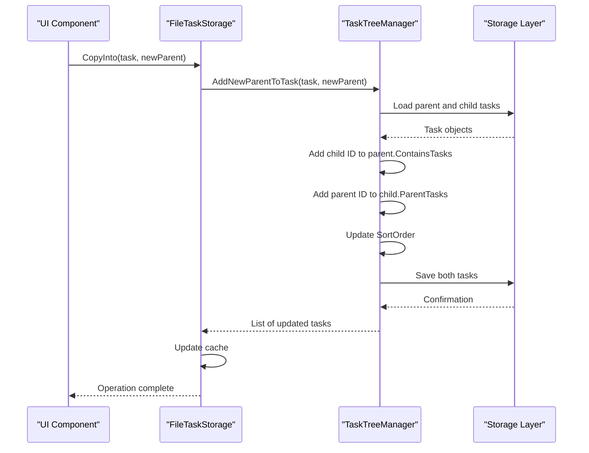
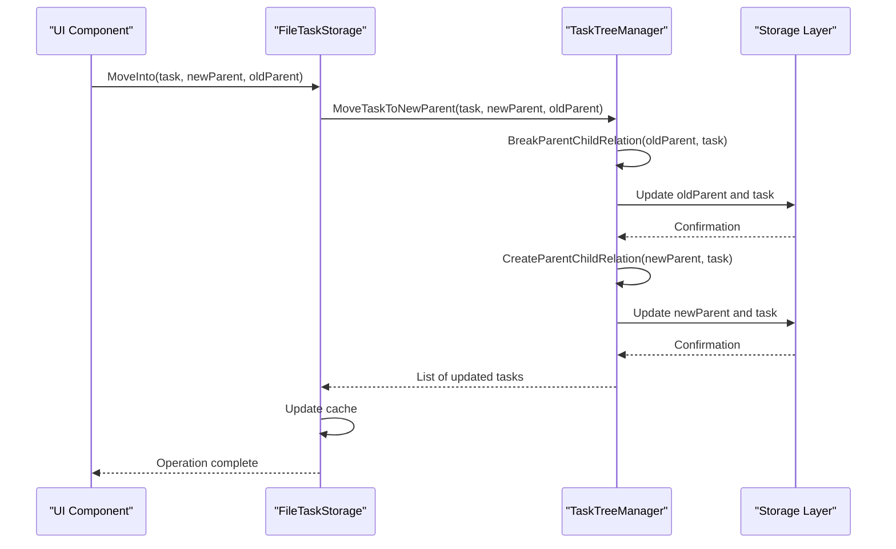
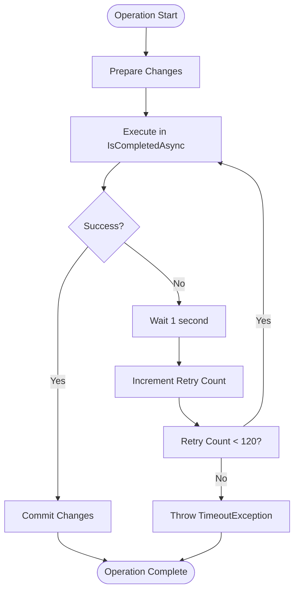
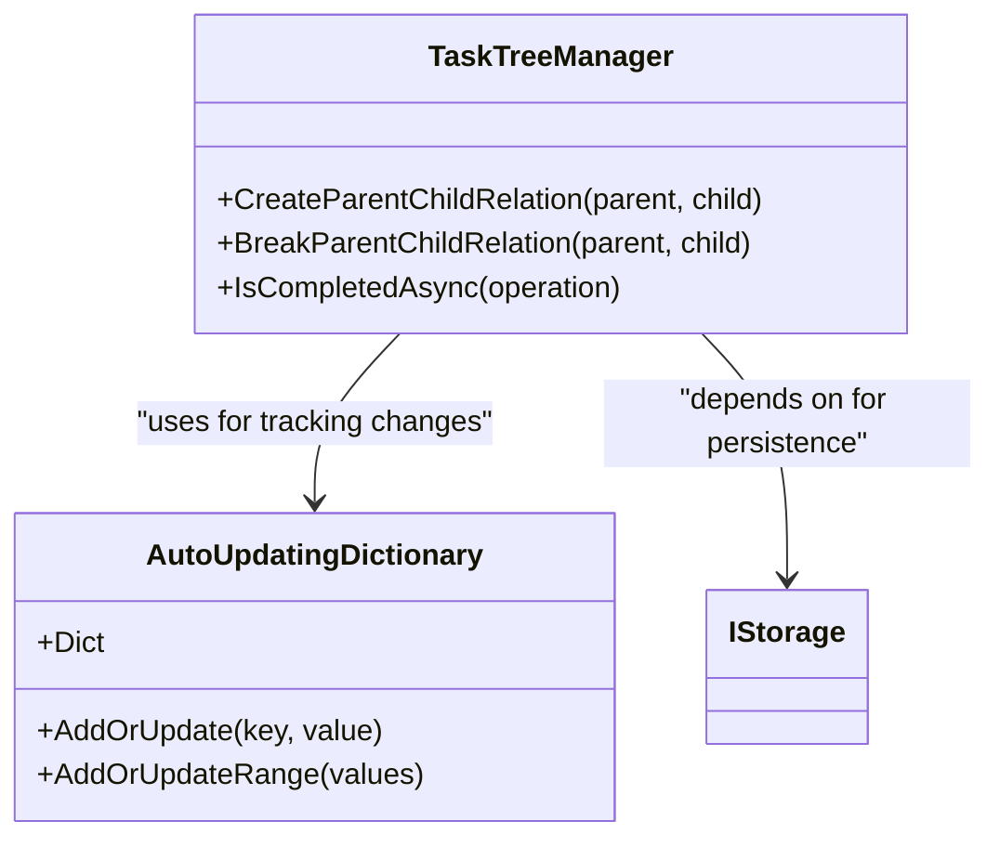
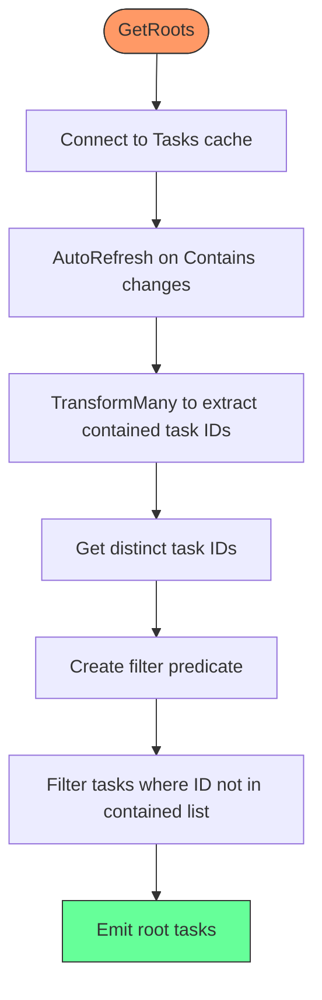
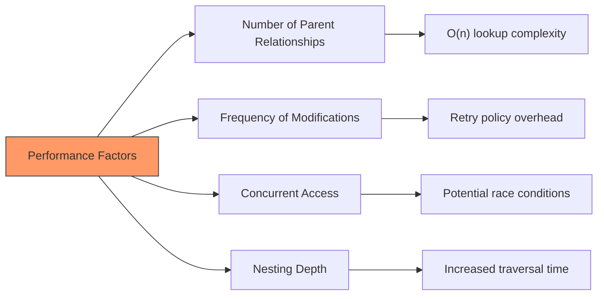

# Task Relationships

<cite>
**Referenced Files in This Document**   
- [TaskItem.cs](file://src/Unlimotion.Domain/TaskItem.cs)
- [FileTaskStorage.cs](file://src/Unlimotion/FileTaskStorage.cs)
- [TaskTreeManager.cs](file://src/Unlimotion.TaskTreeManager/TaskTreeManager.cs)
- [ITaskTreeManager.cs](file://src/Unlimotion.TaskTreeManager/ITaskTreeManager.cs)
- [AutoUpdatingDictionary.cs](file://src/Unlimotion.TaskTreeManager/AutoUpdatingDictionary.cs)
- [TaskStorages.cs](file://src/Unlimotion/TaskStorages.cs)
- [TaskStorageExtensions.cs](file://src/Unlimotion/TaskStorageExtensions.cs)
</cite>

## Table of Contents
1. [Introduction](#introduction)
2. [Core Data Structures for Task Relationships](#core-data-structures-for-task-relationships)
3. [Multi-Parent Relationship Implementation](#multi-parent-relationship-implementation)
4. [Parent-Child Relationship Operations](#parent-child-relationship-operations)
5. [Data Consistency and Transaction Management](#data-consistency-and-transaction-management)
6. [Sorting and Ordering Mechanisms](#sorting-and-ordering-mechanisms)
7. [Performance Considerations](#performance-considerations)
8. [Best Practices for Relationship Management](#best-practices-for-relationship-management)

## Introduction
This document provides a comprehensive analysis of the task relationship management system in Unlimotion, focusing on the implementation of multi-parent relationships and the coordination between storage and tree management components. The system enables complex task hierarchies through bidirectional relationship tracking using ParentTasks and ContainsTasks collections, with robust mechanisms for maintaining data consistency during relationship modifications.

**Section sources**
- [TaskItem.cs](file://src/Unlimotion.Domain/TaskItem.cs#L1-L32)

## Core Data Structures for Task Relationships

The foundation of the task relationship system is built upon the TaskItem class, which maintains bidirectional references between parent and child tasks through two key collections:

- **ContainsTasks**: A list of task IDs that the current task contains (children)
- **ParentTasks**: A list of task IDs that contain the current task (parents)

This dual-collection approach enables efficient traversal in both directions while maintaining data integrity. Each task also includes a SortOrder field of type DateTime? that determines the display order of tasks within their parent containers.

The implementation supports true multi-parent relationships, allowing a single task to belong to multiple parent tasks simultaneously. This creates a directed acyclic graph (DAG) structure rather than a traditional tree, enabling flexible organization of tasks across different contexts.



**Diagram sources**
- [TaskItem.cs](file://src/Unlimotion.Domain/TaskItem.cs#L1-L32)

**Section sources**
- [TaskItem.cs](file://src/Unlimotion.Domain/TaskItem.cs#L1-L32)

## Multi-Parent Relationship Implementation

The multi-parent relationship system is implemented through coordinated operations between FileTaskStorage and TaskTreeManager components. When a task is assigned to multiple parents, both the parent's ContainsTasks collection and the child's ParentTasks collection are updated atomically.

The relationship management follows these principles:

1. **Bidirectional Synchronization**: Every parent-child relationship is represented in both directions - the parent references the child in ContainsTasks, and the child references the parent in ParentTasks.

2. **Atomic Updates**: Relationship changes are wrapped in retry policies to ensure completion, with the IsCompletedAsync method in TaskTreeManager providing fault tolerance for storage operations.

3. **Version Management**: Each task has a Version field that increments with modifications, helping track changes and prevent conflicts.

4. **Cache Coherence**: The FileTaskStorage maintains a SourceCache of TaskItemViewModel objects, ensuring that UI components reflect the latest state after relationship changes.

The system handles multi-parent scenarios by allowing a task to appear in multiple parent contexts simultaneously, creating a network of relationships rather than a strict hierarchy. This enables users to organize tasks in multiple meaningful ways without duplication.

```mermaid
flowchart TD
A[Task A] --> B[Task B]
A --> C[Task C]
D[Task D] --> B
D --> C
B --> E[Task E]
C --> E
style A fill:#f9f,stroke:#333
style D fill:#f9f,stroke:#333
style E fill:#bbf,stroke:#333
Note: "Task E has two parents (B and C)<br/>Tasks A and D are both parents of B and C"
```

**Diagram sources**
- [TaskItem.cs](file://src/Unlimotion.Domain/TaskItem.cs#L19-L20)
- [TaskTreeManager.cs](file://src/Unlimotion.TaskTreeManager/TaskTreeManager.cs#L344-L347)

**Section sources**
- [TaskItem.cs](file://src/Unlimotion.Domain/TaskItem.cs#L19-L20)
- [TaskTreeManager.cs](file://src/Unlimotion.TaskTreeManager/TaskTreeManager.cs#L344-L347)

## Parent-Child Relationship Operations

The system provides two primary operations for managing parent-child relationships: CopyInto and MoveInto, which are implemented through corresponding methods in TaskTreeManager.

### CopyInto Operation
The CopyInto operation in FileTaskStorage delegates to AddNewParentToTask in TaskTreeManager, enabling a task to gain additional parents without removing existing ones:



**Diagram sources**
- [FileTaskStorage.cs](file://src/Unlimotion/FileTaskStorage.cs#L378-L391)
- [TaskTreeManager.cs](file://src/Unlimotion.TaskTreeManager/TaskTreeManager.cs#L290-L294)

### MoveInto Operation
The MoveInto operation in FileTaskStorage delegates to MoveTaskToNewParent in TaskTreeManager, which transfers a task from one parent to another:



**Diagram sources**
- [FileTaskStorage.cs](file://src/Unlimotion/FileTaskStorage.cs#L393-L405)
- [TaskTreeManager.cs](file://src/Unlimotion.TaskTreeManager/TaskTreeManager.cs#L296-L302)

The AddNewParentToTask and MoveTaskToNewParent methods return a list of all modified tasks, allowing the storage layer to update its cache efficiently. This design ensures that all relationship changes are visible to the UI immediately.

**Section sources**
- [FileTaskStorage.cs](file://src/Unlimotion/FileTaskStorage.cs#L378-L405)
- [TaskTreeManager.cs](file://src/Unlimotion.TaskTreeManager/TaskTreeManager.cs#L290-L302)

## Data Consistency and Transaction Management

The system employs several mechanisms to ensure data consistency during relationship changes:

### Atomic Operation Framework
The IsCompletedAsync method in TaskTreeManager provides a retry-based transaction framework that ensures operations complete successfully or fail completely:



**Diagram sources**
- [TaskTreeManager.cs](file://src/Unlimotion.TaskTreeManager/TaskTreeManager.cs#L430-L458)

### Bidirectional Relationship Maintenance
The CreateParentChildRelation and BreakParentChildRelation methods ensure both sides of the relationship are updated:



**Diagram sources**
- [TaskTreeManager.cs](file://src/Unlimotion.TaskTreeManager/TaskTreeManager.cs#L338-L365)
- [AutoUpdatingDictionary.cs](file://src/Unlimotion.TaskTreeManager/AutoUpdatingDictionary.cs#L1-L26)

### Cache Synchronization
The FileTaskStorage maintains cache coherence through the UpdateCache method, which propagates changes from the domain model to the view model layer:

1. Relationship operations return lists of modified tasks
2. UpdateCache locates corresponding view models in the SourceCache
3. View models are updated with the latest domain model data
4. UI bindings automatically reflect changes

This approach prevents stale data in the UI and ensures users see the current state of task relationships.

**Section sources**
- [TaskTreeManager.cs](file://src/Unlimotion.TaskTreeManager/TaskTreeManager.cs#L430-L458)
- [AutoUpdatingDictionary.cs](file://src/Unlimotion.TaskTreeManager/AutoUpdatingDictionary.cs#L1-L26)
- [FileTaskStorage.cs](file://src/Unlimotion/FileTaskStorage.cs#L410-L417)

## Sorting and Ordering Mechanisms

The system handles sorting and ordering of tasks with multiple parents through the SortOrder field and root filtering mechanisms.

### SortOrder Management
Each task has a SortOrder field of type DateTime? that determines its position within parent containers:

- When a task is added to a parent, its SortOrder is set to DateTime.Now
- Tasks are sorted in ascending order by SortOrder within each parent
- The same task can have different relative positions in different parent contexts

### Root Filtering
The GetRoots method in TaskStorageExtensions identifies top-level tasks (roots) by filtering out tasks that appear in any parent's ContainsTasks collection:



**Diagram sources**
- [TaskStorageExtensions.cs](file://src/Unlimotion/TaskStorageExtensions.cs#L7-L34)

The root filtering algorithm efficiently identifies tasks that are not contained by any other task, providing the entry points for traversing the task graph. This is particularly important in a multi-parent system where traditional tree traversal methods would not work.

**Section sources**
- [TaskStorageExtensions.cs](file://src/Unlimotion/TaskStorageExtensions.cs#L7-L34)

## Performance Considerations

The multi-parent relationship system presents several performance considerations that are addressed through specific design choices:

### Relationship Traversal Efficiency
With multiple parents, traversing the task graph requires careful consideration:

- **Time Complexity**: O(n) for direct parent/child lookups, where n is the number of relationships
- **Space Complexity**: O(m) for storing relationships, where m is the total number of parent-child connections

The use of List<string> for ContainsTasks and ParentTasks collections provides efficient enumeration but linear search performance for membership tests.

### Batch Operations and Caching
The system optimizes performance through:

1. **Batch Updates**: Operations return lists of modified tasks, allowing batch cache updates
2. **Retry Policy**: The 2-minute timeout with 1-second intervals handles transient storage issues
3. **Memory Caching**: SourceCache maintains in-memory representations of tasks
4. **Change Tracking**: AutoUpdatingDictionary efficiently tracks modified entities

### Scalability Limits
Potential performance bottlenecks include:

- Large numbers of parent relationships per task
- Frequent relationship modifications
- Concurrent access to the same tasks
- Deeply nested task hierarchies

The system mitigates these through the retry mechanism and atomic operation design, but extremely complex relationship networks may require additional optimization.



**Diagram sources**
- [TaskTreeManager.cs](file://src/Unlimotion.TaskTreeManager/TaskTreeManager.cs#L430-L458)
- [FileTaskStorage.cs](file://src/Unlimotion/FileTaskStorage.cs#L410-L417)

**Section sources**
- [TaskTreeManager.cs](file://src/Unlimotion.TaskTreeManager/TaskTreeManager.cs#L430-L458)
- [FileTaskStorage.cs](file://src/Unlimotion/FileTaskStorage.cs#L410-L417)

## Best Practices for Relationship Management

To ensure data integrity and optimal performance when working with task relationships:

### Avoiding Data Integrity Issues
1. **Always use provided methods**: Use CopyInto and MoveInto rather than direct manipulation of ContainsTasks and ParentTasks
2. **Handle exceptions**: Operations may throw TimeoutException if they fail to complete within 2 minutes
3. **Check return values**: Verify that operations completed successfully
4. **Avoid circular references**: The system does not explicitly prevent parent-child cycles

### Recommended Patterns
1. **Batch related operations**: Group multiple relationship changes when possible
2. **Minimize redundant updates**: Avoid repeatedly setting the same relationships
3. **Use appropriate parents**: Select meaningful parent tasks that provide context
4. **Monitor performance**: Watch for slowdowns with tasks that have many parents

### Error Handling
Implement proper error handling around relationship operations:

- Catch TimeoutException from IsCompletedAsync
- Implement retry logic for transient failures
- Provide user feedback for long-running operations
- Log failures for diagnostic purposes

By following these practices, developers can maintain data integrity while leveraging the full flexibility of the multi-parent task relationship system.

**Section sources**
- [TaskTreeManager.cs](file://src/Unlimotion.TaskTreeManager/TaskTreeManager.cs#L430-L458)
- [FileTaskStorage.cs](file://src/Unlimotion/FileTaskStorage.cs#L378-L405)