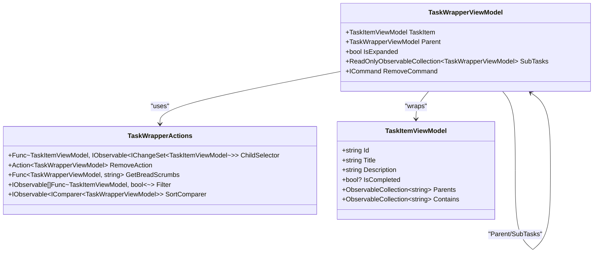
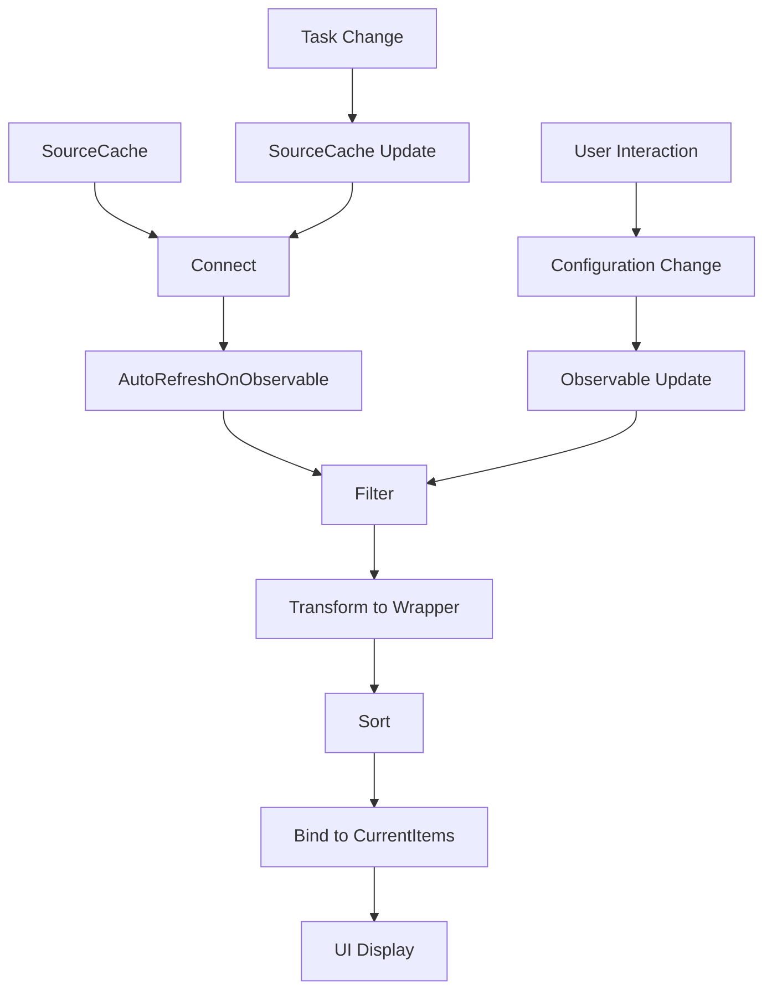
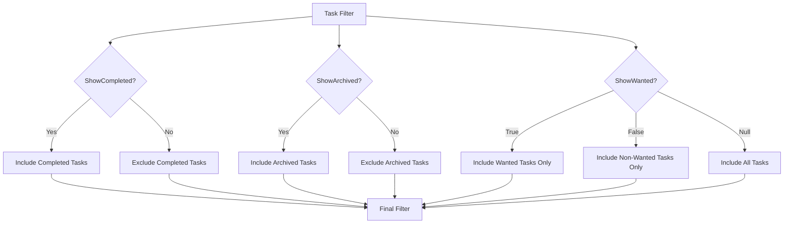
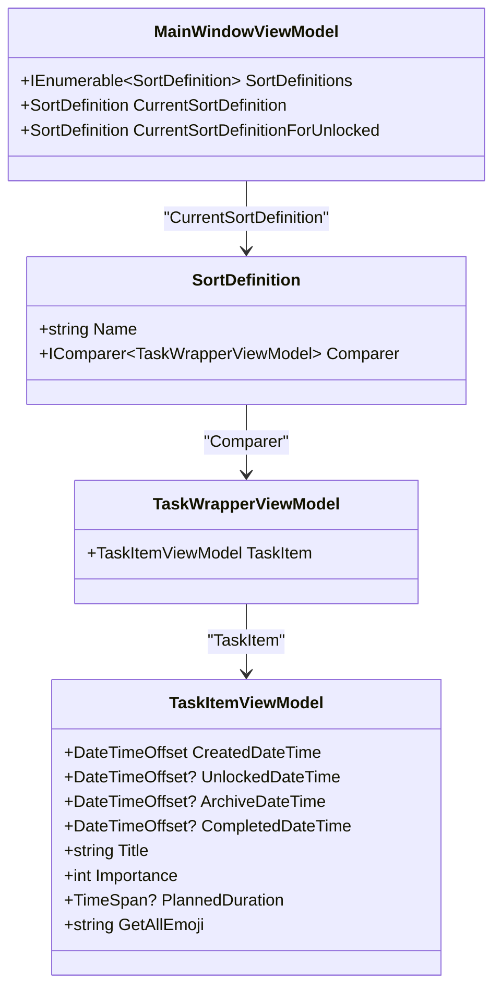
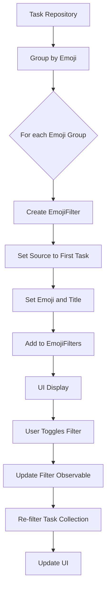
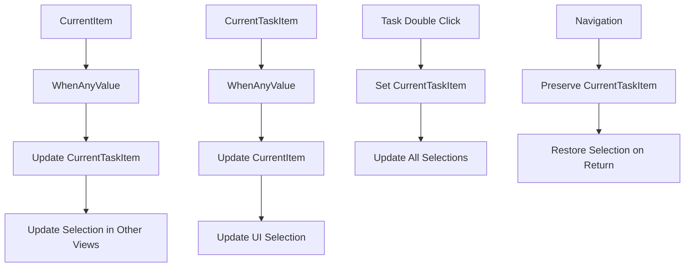
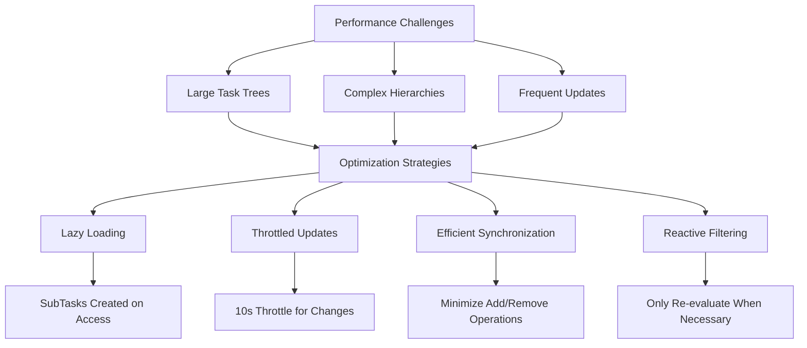

# All Tasks View

<cite>
**Referenced Files in This Document**   
- [MainWindowViewModel.cs](file://src/Unlimotion.ViewModel/MainWindowViewModel.cs)
- [TaskWrapperViewModel.cs](file://src/Unlimotion.ViewModel/TaskWrapperViewModel.cs)
- [SortDefinition.cs](file://src/Unlimotion.ViewModel/SortDefinition.cs)
- [TaskItemViewModel.cs](file://src/Unlimotion.ViewModel/TaskItemViewModel.cs)
- [MainControl.axaml](file://src/Unlimotion/Views/MainControl.axaml)
- [MainScreen.axaml](file://src/Unlimotion/Views/MainScreen.axaml)
- [MainWindow.axaml](file://src/Unlimotion/Views/MainWindow.axaml)
</cite>

## Table of Contents
1. [Introduction](#introduction)
2. [Hierarchical Task Structure and TaskWrapperViewModel](#hierarchical-task-structure-and-taskwrapperviewmodel)
3. [DynamicData Collections and Reactive Bindings](#dynamicdata-collections-and-reactive-bindings)
4. [Filtering Logic and Configuration Flags](#filtering-logic-and-configuration-flags)
5. [Sorting Behavior and User Preferences](#sorting-behavior-and-user-preferences)
6. [Emoji-Based Filtering and Root Task Identification](#emoji-based-filtering-and-root-task-identification)
7. [ReactiveUI Observables and Selection State Management](#reactiveui-observables-and-selection-state-management)
8. [Performance Considerations and Synchronization](#performance-considerations-and-synchronization)

## Introduction
The All Tasks view in Unlimotion provides a comprehensive interface for managing the complete hierarchical structure of tasks. This documentation details the implementation of this view, focusing on how it displays parent-child relationships, handles filtering and sorting, and maintains user preferences through configuration settings. The view leverages ReactiveUI and DynamicData libraries to create a responsive and reactive user interface that efficiently manages task data.

## Hierarchical Task Structure and TaskWrapperViewModel

The All Tasks view displays the complete hierarchical task structure through the `TaskWrapperViewModel` class, which serves as a wrapper around the `TaskItemViewModel` to provide additional functionality for UI presentation. The hierarchical structure is maintained through parent-child relationships where tasks can have multiple parents and contain multiple child tasks.

The `TaskWrapperViewModel` class implements the expandable parent task functionality through the `IsExpanded` property and the `SubTasks` collection. When a parent task is expanded, its child tasks are displayed in a nested structure, allowing users to navigate through the task hierarchy. The wrapper maintains a reference to its parent through the `Parent` property, enabling breadcrumb navigation and hierarchical context.

The `TaskWrapperActions` class provides the necessary operations for the wrapper, including:
- `ChildSelector`: Function to retrieve child tasks from a task
- `RemoveAction`: Action to remove a task
- `GetBreadScrumbs`: Function to generate breadcrumb navigation
- `Filter`: Collection of filter observables
- `SortComparer`: Observable comparer for sorting



**Diagram sources**
- [TaskWrapperViewModel.cs](file://src/Unlimotion.ViewModel/TaskWrapperViewModel.cs#L0-L125)

**Section sources**
- [TaskWrapperViewModel.cs](file://src/Unlimotion.ViewModel/TaskWrapperViewModel.cs#L0-L125)
- [TaskItemViewModel.cs](file://src/Unlimotion.ViewModel/TaskItemViewModel.cs#L0-L666)

## DynamicData Collections and Reactive Bindings

The All Tasks view leverages DynamicData collections to efficiently manage and transform task data. The `MainWindowViewModel` uses `SourceCache<TaskItemViewModel, string>` from the `ITaskStorage` interface as the primary data source, which is then transformed through a series of DynamicData operations to create the filtered and sorted view.

The implementation uses ReactiveUI observables to create a reactive pipeline that automatically updates the UI when underlying data changes. The `Connect()` method from DynamicData establishes a connection to the source cache, and various operators are applied to filter, transform, and sort the data:

- `AutoRefreshOnObservable`: Automatically refreshes the collection when specified properties change
- `Filter`: Applies filtering logic based on user preferences
- `Transform`: Converts `TaskItemViewModel` to `TaskWrapperViewModel`
- `Sort`: Applies sorting based on the current sort definition
- `Bind`: Binds the final result to a read-only observable collection

The `CurrentItems` collection in `MainWindowViewModel` represents the final filtered and sorted list of tasks displayed in the All Tasks view. This collection is updated reactively whenever tasks are added, removed, or modified, or when user preferences change.



**Diagram sources**
- [MainWindowViewModel.cs](file://src/Unlimotion.ViewModel/MainWindowViewModel.cs#L0-L1076)
- [TaskWrapperViewModel.cs](file://src/Unlimotion.ViewModel/TaskWrapperViewModel.cs#L0-L125)

**Section sources**
- [MainWindowViewModel.cs](file://src/Unlimotion.ViewModel/MainWindowViewModel.cs#L0-L1076)

## Filtering Logic and Configuration Flags

The All Tasks view implements a comprehensive filtering system that respects user configuration flags for showing completed, archived, and wanted tasks. These filters are persisted through the `IConfiguration` service and automatically saved when changed.

The primary filtering flags are:
- `ShowCompleted`: Controls whether completed tasks are displayed
- `ShowArchived`: Controls whether archived tasks are displayed
- `ShowWanted`: Controls whether wanted tasks are displayed

These flags are initialized from configuration settings in the `MainWindowViewModel` constructor and are automatically persisted when changed through ReactiveUI's `WhenAnyValue` observables:

```csharp
ShowCompleted = _configuration?.GetSection("AllTasks:ShowCompleted").Get<bool?>() == true;
ShowArchived = _configuration?.GetSection("AllTasks:ShowArchived").Get<bool?>() == true;
ShowWanted = _configuration?.GetSection("AllTasks:ShowWanted").Get<bool?>() == true;
```

The filtering logic is implemented as observable functions that are combined with other filters to create the final task collection. The `taskFilter` observable combines the completed and archived status filters, while the `wantedFilter` observable handles the wanted tasks filter based on the `ShowWanted` flag.



**Diagram sources**
- [MainWindowViewModel.cs](file://src/Unlimotion.ViewModel/MainWindowViewModel.cs#L30-L1076)

**Section sources**
- [MainWindowViewModel.cs](file://src/Unlimotion.ViewModel/MainWindowViewModel.cs#L30-L1076)

## Sorting Behavior and User Preferences

The All Tasks view uses the `CurrentSortDefinition` property to govern sorting behavior, with sorting preferences persisted via `IConfiguration`. The sorting system provides multiple predefined sort options that users can select based on their preferences.

The `SortDefinition` class defines various sorting criteria, including:
- Created date (ascending and descending)
- Unlocked date (ascending and descending)
- Archive date (ascending and descending)
- Completed date (ascending and descending)
- Title (ascending and descending)
- Importance (ascending and descending)
- Planned duration (ascending and descending)
- Emoji (ascending)

The current sort definition is initialized from configuration and automatically saved when changed:

```csharp
var sortName = _configuration?.GetSection("AllTasks:CurrentSortDefinition").Get<string>();
CurrentSortDefinition = SortDefinitions.FirstOrDefault(s => s.Name == sortName) ?? SortDefinitions.First();
```

The sorting is applied through DynamicData's `Sort` operator, which uses the comparer from the current sort definition. The observable nature of the sorting system ensures that the task list is automatically re-sorted whenever the sort definition changes.



**Diagram sources**
- [SortDefinition.cs](file://src/Unlimotion.ViewModel/SortDefinition.cs#L0-L239)
- [MainWindowViewModel.cs](file://src/Unlimotion.ViewModel/MainWindowViewModel.cs#L0-L1076)

**Section sources**
- [SortDefinition.cs](file://src/Unlimotion.ViewModel/SortDefinition.cs#L0-L239)
- [MainWindowViewModel.cs](file://src/Unlimotion.ViewModel/MainWindowViewModel.cs#L0-L1076)

## Emoji-Based Filtering and Root Task Identification

The All Tasks view implements emoji-based filtering to help users organize and navigate tasks. This feature allows users to filter tasks based on their emoji content, providing a visual way to categorize and find tasks.

Emoji filtering is implemented through the `EmojiFilter` class, which represents a filter based on a specific emoji. The system automatically creates filters for all emojis used in tasks, with each filter having:
- `Title`: The title of the first task with this emoji
- `Emoji`: The emoji character
- `ShowTasks`: Boolean indicating whether tasks with this emoji should be shown
- `SortText`: Text used for sorting filters

The `MainWindowViewModel` creates emoji filters by grouping tasks by their emoji and transforming each group into an `EmojiFilter`. These filters are then used to filter the task collection:

```csharp
taskRepository.Tasks
    .Connect()
    .AutoRefreshOnObservable(m => m.WhenAny(m => m.Emoji, (c) => c.Value == null))
    .Group(m => m.Emoji)
    .Transform(m => { /* create EmojiFilter */ })
    .SortBy(f => f.SortText)
    .Bind(out _emojiFilters)
```

Root task identification is implemented through emoji filters as well. When an emoji filter is activated, it can identify root tasks by checking if a task's ID matches the source task of the filter. This allows users to quickly navigate to root tasks associated with specific emojis.



**Diagram sources**
- [MainWindowViewModel.cs](file://src/Unlimotion.ViewModel/MainWindowViewModel.cs#L0-L1076)

**Section sources**
- [MainWindowViewModel.cs](file://src/Unlimotion.ViewModel/MainWindowViewModel.cs#L0-L1076)

## ReactiveUI Observables and Selection State Management

The All Tasks view uses ReactiveUI observables extensively to bind the `Tasks` collection to the UI and maintain selection state across navigation. The `MainWindowViewModel` contains multiple observables that track the current selection in different contexts.

The selection system is implemented through several properties:
- `CurrentTaskItem`: The currently selected task across all views
- `CurrentItem`: The currently selected task wrapper in the All Tasks view
- `CurrentUnlockedItem`: The currently selected task in the Unlocked view
- `CurrentCompletedItem`: The currently selected task in the Completed view
- `CurrentArchivedItem`: The currently selected task in the Archived view

These properties are synchronized through ReactiveUI's `WhenAnyValue` observables, ensuring that selecting a task in one view updates the selection in other views:

```csharp
this.WhenAnyValue(m => m.CurrentItem)
    .Subscribe(m =>
    {
        if (m != null || CurrentTaskItem == null)
            CurrentTaskItem = m?.TaskItem;
    })
    .AddToDispose(connectionDisposableList);
```

The selection state is also maintained when navigating between tasks. The `SelectCurrentTask` method ensures that the current task is properly selected and visible in the UI. Additionally, the `LastOpenedSource` collection tracks recently opened tasks, allowing users to navigate back to previously viewed tasks.



**Diagram sources**
- [MainWindowViewModel.cs](file://src/Unlimotion.ViewModel/MainWindowViewModel.cs#L0-L1076)

**Section sources**
- [MainWindowViewModel.cs](file://src/Unlimotion.ViewModel/MainWindowViewModel.cs#L0-L1076)

## Performance Considerations and Synchronization

The All Tasks view addresses performance challenges with large task trees through several optimization strategies. The implementation uses lazy loading and reactive updates to minimize unnecessary computations and UI updates.

Key performance optimizations include:
- **Lazy loading of subtasks**: The `SubTasks` collection in `TaskWrapperViewModel` is only created when accessed, reducing memory usage for large task hierarchies
- **Throttled property updates**: Property changes are throttled to prevent excessive updates, with a default throttle time of 10 seconds
- **Efficient collection synchronization**: The `SynchronizeCollections` method efficiently updates observable collections by minimizing add/remove operations
- **Reactive filtering**: Filters are implemented as observables that only re-evaluate when necessary, reducing computational overhead

The synchronization of expanded states is handled through the `IsExpanded` property in `TaskWrapperViewModel`. When a task is created as a child of another task, the parent's expanded state is automatically set to true, and this state is propagated up the hierarchy:

```csharp
var wrapper = FindTaskWrapperViewModel(parent, CurrentItems);
if (wrapper != null)
{
    wrapper.IsExpanded = true;
    var p = wrapper.Parent;
    while (p != null)
    {
        p.IsExpanded = true;
        p = p.Parent;
    }
}
```

For large task trees, the system may experience performance issues due to the complexity of maintaining hierarchical relationships and reactive updates. To mitigate this, the implementation could benefit from additional optimizations such as:
- Virtualized rendering of task lists
- Caching of frequently accessed computed properties
- Background processing of intensive operations
- Pagination or lazy loading of deep task hierarchies



**Diagram sources**
- [MainWindowViewModel.cs](file://src/Unlimotion.ViewModel/MainWindowViewModel.cs#L0-L1076)
- [TaskItemViewModel.cs](file://src/Unlimotion.ViewModel/TaskItemViewModel.cs#L0-L666)
- [TaskWrapperViewModel.cs](file://src/Unlimotion.ViewModel/TaskWrapperViewModel.cs#L0-L125)

**Section sources**
- [MainWindowViewModel.cs](file://src/Unlimotion.ViewModel/MainWindowViewModel.cs#L0-L1076)
- [TaskItemViewModel.cs](file://src/Unlimotion.ViewModel/TaskItemViewModel.cs#L0-L666)
- [TaskWrapperViewModel.cs](file://src/Unlimotion.ViewModel/TaskWrapperViewModel.cs#L0-L125)