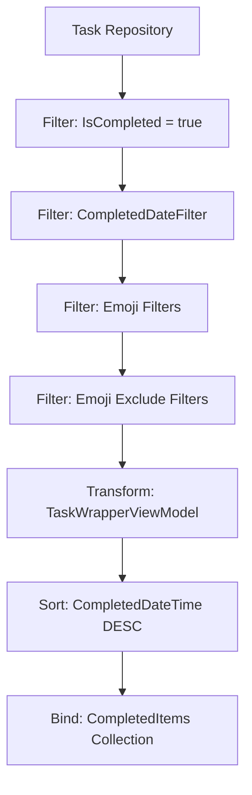
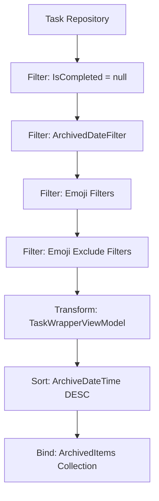
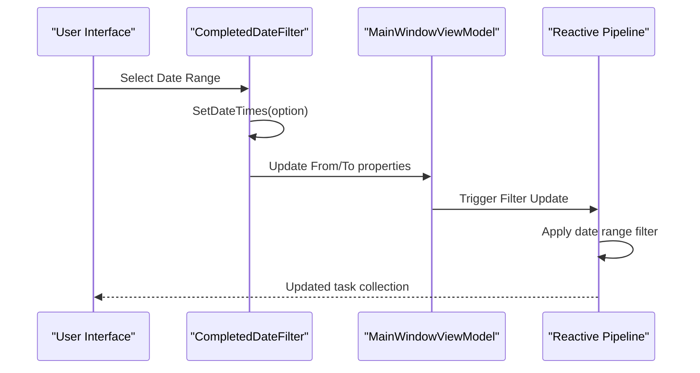
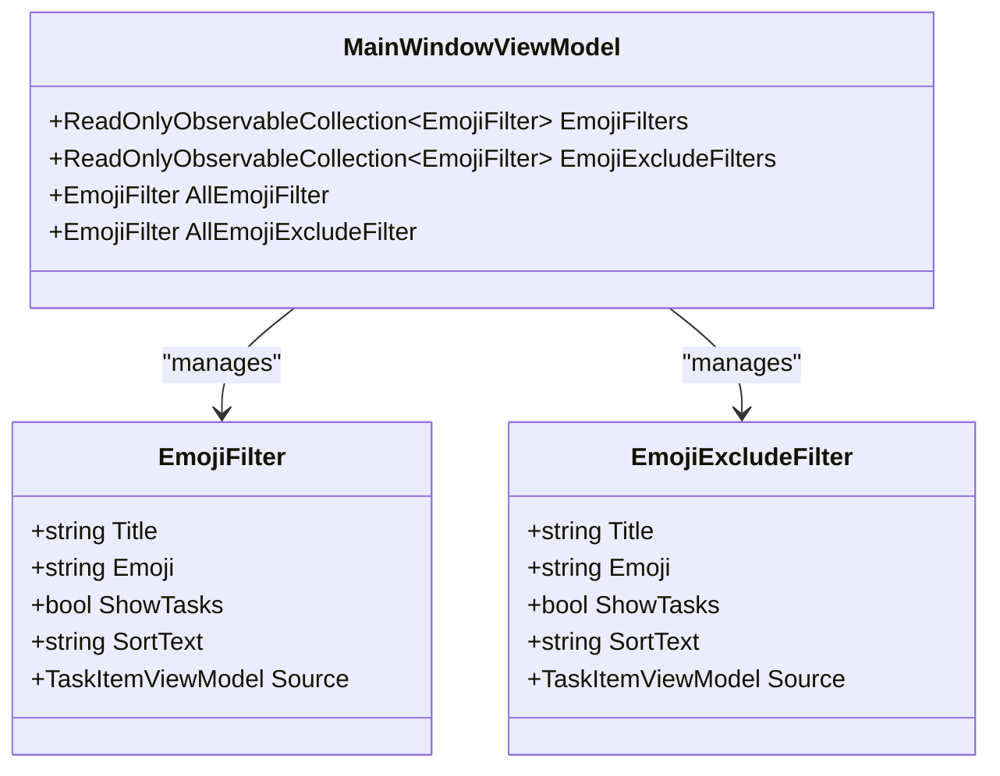
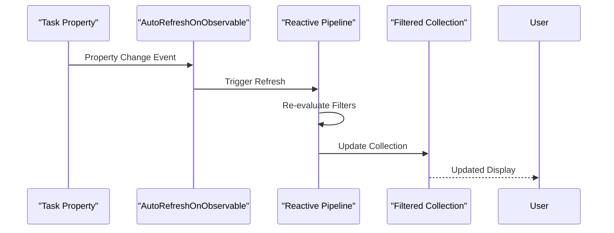
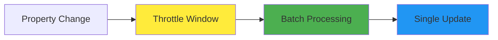

# Completed and Archived Views

<cite>
**Referenced Files in This Document**
- [MainWindowViewModel.cs](file://src/Unlimotion.ViewModel/MainWindowViewModel.cs)
- [DateFilter.cs](file://src/Unlimotion.ViewModel/DateFilter.cs)
- [TaskItem.cs](file://src/Unlimotion.Domain/TaskItem.cs)
- [TaskItemViewModel.cs](file://src/Unlimotion.ViewModel/TaskItemViewModel.cs)
- [TaskTreeManager.cs](file://src/Unlimotion.TaskTreeManager/TaskTreeManager.cs)
- [Options.cs](file://src/Unlimotion.ViewModel/Options.cs)
- [SortDefinition.cs](file://src/Unlimotion.ViewModel/SortDefinition.cs)
</cite>

## Table of Contents
1. [Introduction](#introduction)
2. [Completed View Implementation](#completed-view-implementation)
3. [Archived View Implementation](#archived-view-implementation)
4. [Date Filtering Mechanisms](#date-filtering-mechanisms)
5. [Emoji Filtering and Exclusion](#emoji-filtering-and-exclusion)
6. [Reactive Pipelines and DynamicData](#reactive-pipelines-and-dynamicdata)
7. [Performance Considerations](#performance-considerations)
8. [Common Issues and Solutions](#common-issues-and-solutions)
9. [Practical Examples](#practical-examples)
10. [Troubleshooting Guide](#troubleshooting-guide)

## Introduction

The Completed and Archived views in Unlimotion provide specialized interfaces for managing completed and archived tasks respectively. These views leverage ReactiveUI and DynamicData to create responsive, real-time filtering and sorting capabilities. The Completed view displays tasks where `IsCompleted = true` sorted by completion date, while the Archived view shows tasks where `IsCompleted = null` sorted by archive date.

Both views support sophisticated filtering mechanisms including date-based scoping, emoji-based categorization, and custom sorting options. The implementation demonstrates advanced reactive programming patterns with automatic collection rebinding and efficient state management.

## Completed View Implementation

The Completed view focuses on tasks that have been marked as complete, displaying them in reverse chronological order based on completion dates.

### Core Filtering Logic

The Completed view uses a specific filter pipeline that targets tasks with `IsCompleted = true`:



**Diagram sources**
- [MainWindowViewModel.cs](file://src/Unlimotion.ViewModel/MainWindowViewModel.cs#L591-L628)

### Reactive Pipeline Configuration

The Completed view establishes its reactive pipeline through several key components:

| Component | Purpose | Implementation |
|-----------|---------|----------------|
| **AutoRefreshOnObservable** | Monitors IsCompleted state changes | `AutoRefreshOnObservable(m => m.WhenAny(m => m.IsCompleted, (c) => c.Value == true))` |
| **Filter** | Ensures only completed tasks are shown | `Filter(m => m.IsCompleted == true)` |
| **Date Filter** | Applies temporal scoping | `completedDateFilter` with configurable date ranges |
| **Emoji Filters** | Enables category-based filtering | Dynamic emoji-based task grouping |
| **Sorting** | Orders by completion date | `SortBy(m => m.TaskItem.CompletedDateTime, SortDirection.Descending)` |

### State Management

The Completed view maintains its state through the `CompletedItems` property, which is automatically populated and updated through the reactive pipeline. The view responds to various state changes including task completion modifications, date filter updates, and emoji filter toggles.

**Section sources**
- [MainWindowViewModel.cs](file://src/Unlimotion.ViewModel/MainWindowViewModel.cs#L591-L628)

## Archived View Implementation

The Archived view manages tasks that have been moved to an archival state, characterized by `IsCompleted = null`.

### Core Filtering Logic

The Archived view implements a distinct filtering approach targeting tasks in archival state:



**Diagram sources**
- [MainWindowViewModel.cs](file://src/Unlimotion.ViewModel/MainWindowViewModel.cs#L622-L655)

### Archive State Management

Tasks enter the Archived state when their `IsCompleted` property is set to `null`. This state indicates that the task has been moved to long-term storage rather than being actively tracked as completed or pending.

### Sorting Strategy

The Archived view prioritizes recent archival activities by sorting tasks in descending order based on their `ArchiveDateTime`. This ensures that recently archived tasks appear at the top of the list, facilitating easy access to recently moved items.

**Section sources**
- [MainWindowViewModel.cs](file://src/Unlimotion.ViewModel/MainWindowViewModel.cs#L622-L655)

## Date Filtering Mechanisms

Unlimotion implements sophisticated date filtering capabilities through the `DateFilter` class, enabling users to scope their view by various temporal periods.

### DateFilter Architecture

The `DateFilter` class provides comprehensive temporal scoping with predefined time ranges:

| Filter Type | Date Range | Use Case |
|-------------|------------|----------|
| **Today** | Current day only | Quick review of today's activities |
| **Week** | Current week (Sunday-Saturday) | Weekly progress assessment |
| **Month** | Current calendar month | Monthly planning and review |
| **Quarter** | Current fiscal quarter | Quarterly goal tracking |
| **Year** | Current calendar year | Annual performance evaluation |
| **Last Two Days** | Past 48 hours | Recent activity monitoring |
| **Last Week** | Previous 7 days | Recent progress analysis |
| **Last Month** | Previous 30 days | Short-term trend analysis |
| **Last Year** | Previous 365 days | Long-term comparison |
| **All Time** | No temporal restriction | Complete historical view |

### CompletedDateFilter Implementation

The `CompletedDateFilter` enables temporal scoping for completed tasks:



**Diagram sources**
- [MainWindowViewModel.cs](file://src/Unlimotion.ViewModel/MainWindowViewModel.cs#L563-L597)
- [DateFilter.cs](file://src/Unlimotion.ViewModel/DateFilter.cs#L15-L47)

### ArchivedDateFilter Implementation

The `ArchivedDateFilter` provides similar temporal scoping for archived tasks:

The filtering logic applies date boundaries to the `ArchiveDateTime` property, ensuring that only tasks within the specified temporal range are displayed. The implementation handles edge cases where date filters may be disabled (returning all tasks) or configured with custom date ranges.

**Section sources**
- [DateFilter.cs](file://src/Unlimotion.ViewModel/DateFilter.cs#L15-L75)
- [MainWindowViewModel.cs](file://src/Unlimotion.ViewModel/MainWindowViewModel.cs#L408-L439)

## Emoji Filtering and Exclusion

Unlimotion implements a sophisticated emoji-based filtering system that allows users to categorize and filter tasks based on emoji tags.

### Emoji Filter Architecture

The emoji filtering system operates through two complementary filter collections:



**Diagram sources**
- [MainWindowViewModel.cs](file://src/Unlimotion.ViewModel/MainWindowViewModel.cs#L1020-L1075)

### Emoji Filter Processing

The emoji filtering system processes tasks through multiple stages:

1. **Emoji Detection**: Extracts emoji characters from task titles and content
2. **Filter Grouping**: Creates filter groups based on detected emojis
3. **Visibility Control**: Manages which emoji categories are displayed
4. **Task Matching**: Applies filters to determine task visibility

### Emoji Exclusion Logic

The exclusion system works by identifying tasks that contain excluded emoji categories and hiding them from view. This creates a complementary filtering mechanism where inclusion and exclusion operate simultaneously.

**Section sources**
- [MainWindowViewModel.cs](file://src/Unlimotion.ViewModel/MainWindowViewModel.cs#L280-L380)

## Reactive Pipelines and DynamicData

The Completed and Archived views leverage DynamicData's powerful reactive programming capabilities to maintain real-time, filtered collections.

### AutoRefreshOnObservable Pattern

The `AutoRefreshOnObservable` operator monitors specific properties for changes and triggers collection rebinding when those properties change:



**Diagram sources**
- [MainWindowViewModel.cs](file://src/Unlimotion.ViewModel/MainWindowViewModel.cs#L591-L628)

### Filter Composition

The reactive pipelines combine multiple filters using a composition pattern:

| Filter Type | Operator | Purpose |
|-------------|----------|---------|
| **Task Filter** | `Filter()` | Basic task state filtering |
| **Date Filter** | `Filter()` | Temporal scoping |
| **Emoji Filter** | `Filter()` | Category-based filtering |
| **Transform** | `Transform()` | Task wrapping and preparation |
| **Sort** | `SortBy()` | Ordering specification |

### Collection Binding Strategy

The implementation uses `Bind()` operators to connect reactive streams to observable collections, ensuring that UI bindings remain synchronized with underlying data changes.

**Section sources**
- [MainWindowViewModel.cs](file://src/Unlimotion.ViewModel/MainWindowViewModel.cs#L591-L655)

## Performance Considerations

Managing large archives efficiently requires careful consideration of performance implications in the Completed and Archived views.

### Memory Management

Large task collections can impact memory usage. The implementation employs several strategies:

- **Lazy Loading**: Tasks are loaded on-demand as needed
- **Collection Throttling**: Frequent updates are throttled to prevent excessive processing
- **Disposable Pattern**: Proper resource cleanup prevents memory leaks

### Throttling and Debouncing

The system implements throttling mechanisms to handle rapid property changes:



### Large Archive Optimization

For systems with extensive archives, consider these optimization strategies:

1. **Pagination**: Implement virtual scrolling for large datasets
2. **Indexing**: Maintain efficient task indexing structures
3. **Caching**: Cache frequently accessed filter results
4. **Background Processing**: Perform heavy computations asynchronously

## Common Issues and Solutions

### Timezone Handling in Date Comparisons

**Issue**: Date comparisons may produce incorrect results due to timezone differences.

**Solution**: The implementation uses `DateTimeOffset.Now.Offset` to normalize dates before comparison, ensuring consistent temporal calculations across different timezones.

### Performance with Large Archives

**Issue**: Slow response times when dealing with thousands of archived tasks.

**Solution**: Implement collection pagination and lazy loading to manage memory usage effectively. Use background processing for heavy filtering operations.

### Filter State Persistence

**Issue**: Filter settings reset when the application restarts.

**Solution**: The implementation persists filter states to configuration, ensuring that user preferences are maintained across sessions.

**Section sources**
- [MainWindowViewModel.cs](file://src/Unlimotion.ViewModel/MainWindowViewModel.cs#L563-L597)
- [DateFilter.cs](file://src/Unlimotion.ViewModel/DateFilter.cs#L15-L47)

## Practical Examples

### Example 1: Setting Up Completed View

```csharp
// Configure completed view with custom date range
viewModel.CompletedDateFilter.CurrentOption = "Last Month";
viewModel.CompletedDateFilter.IsCustom = false;

// Enable emoji filtering
var emojiFilter = viewModel.EmojiFilters.FirstOrDefault(f => f.Emoji == "✅");
emojiFilter?.SetValue(f => f.ShowTasks, true);
```

### Example 2: Managing Archived Tasks

```csharp
// Access archived tasks programmatically
var archivedTasks = viewModel.ArchivedItems
    .Where(task => task.TaskItem.ArchiveDateTime >= DateTime.Now.AddDays(-7))
    .ToList();
```

### Example 3: Custom Date Filtering

```csharp
// Set custom date range for completed tasks
viewModel.CompletedDateFilter.From = new DateTime(2024, 1, 1);
viewModel.CompletedDateFilter.To = new DateTime(2024, 1, 31);
viewModel.CompletedDateFilter.IsCustom = true;
```

## Troubleshooting Guide

### Issue: Completed Tasks Not Appearing

**Symptoms**: Tasks marked as completed don't show in the Completed view.

**Diagnosis Steps**:
1. Verify `IsCompleted` property is set to `true`
2. Check `CompletedDateTime` is populated
3. Review date filter settings
4. Confirm emoji filter configuration

**Resolution**: Ensure tasks have proper completion timestamps and appropriate filter settings.

### Issue: Archived Tasks Missing

**Symptoms**: Archived tasks don't appear in the Archived view.

**Diagnosis Steps**:
1. Verify `IsCompleted` property is `null`
2. Check `ArchiveDateTime` is set
3. Review date filter configuration
4. Confirm emoji filter settings

**Resolution**: Ensure tasks are properly archived and filter criteria are correctly configured.

### Issue: Performance Degradation

**Symptoms**: Slow response times with large task collections.

**Diagnosis Steps**:
1. Monitor memory usage during filtering
2. Check for excessive property change notifications
3. Analyze filter complexity
4. Review collection binding patterns

**Resolution**: Implement pagination, optimize filters, and consider background processing for heavy operations.

**Section sources**
- [MainWindowViewModel.cs](file://src/Unlimotion.ViewModel/MainWindowViewModel.cs#L591-L655)
- [TaskTreeManager.cs](file://src/Unlimotion.TaskTreeManager/TaskTreeManager.cs#L750-L837)