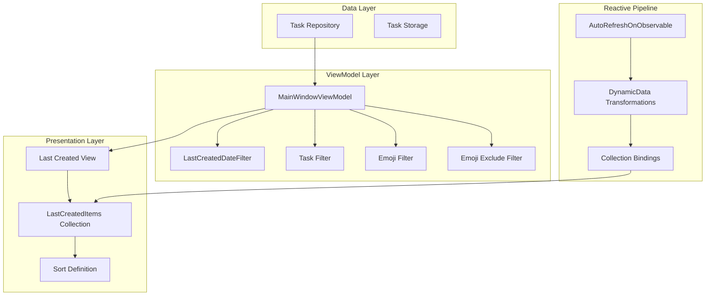
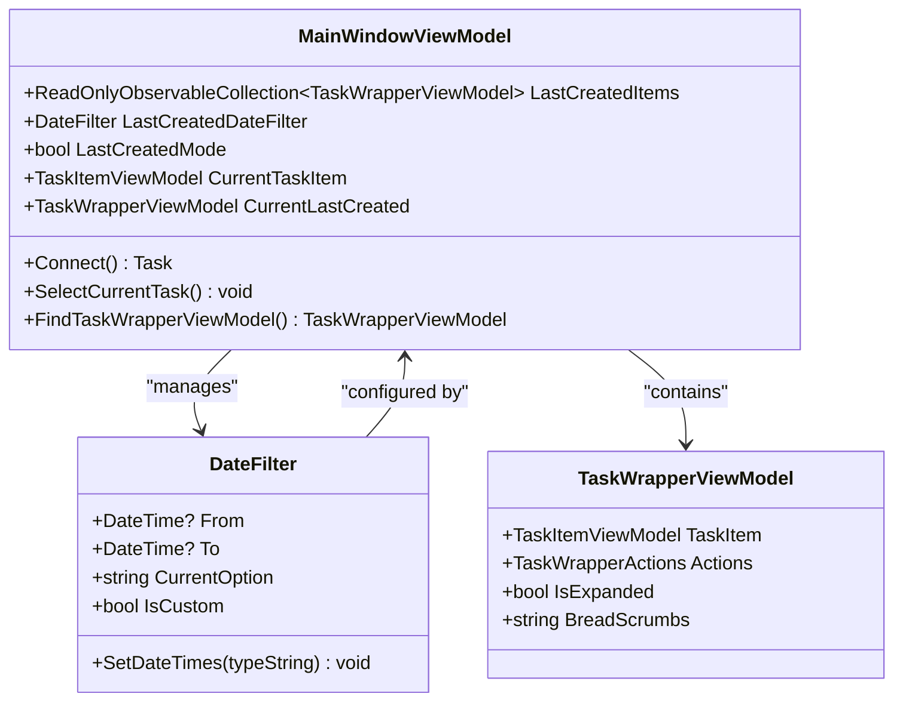
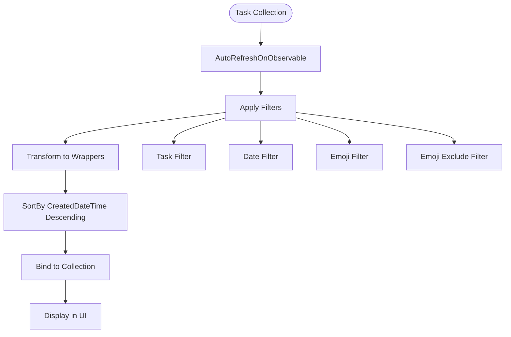
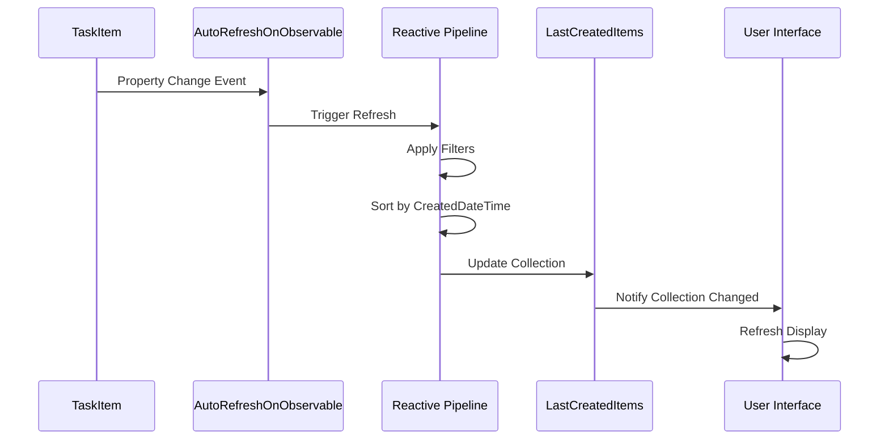
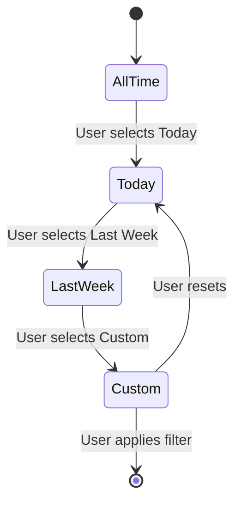

# Last Created View

<cite>
**Referenced Files in This Document**
- [MainWindowViewModel.cs](file://src/Unlimotion.ViewModel/MainWindowViewModel.cs)
- [DateFilter.cs](file://src/Unlimotion.ViewModel/DateFilter.cs)
- [SortDefinition.cs](file://src/Unlimotion.ViewModel/SortDefinition.cs)
- [TaskItem.cs](file://src/Unlimotion.Domain/TaskItem.cs)
- [Options.cs](file://src/Unlimotion.ViewModel/Options.cs)
- [TaskItemViewModel.cs](file://src/Unlimotion.ViewModel/TaskItemViewModel.cs)
</cite>

## Table of Contents
1. [Introduction](#introduction)
2. [Architecture Overview](#architecture-overview)
3. [Core Components](#core-components)
4. [Date Filtering Mechanism](#date-filtering-mechanism)
5. [Sorting Implementation](#sorting-implementation)
6. [Reactive Pipeline](#reactive-pipeline)
7. [Task Filter Integration](#task-filter-integration)
8. [Performance Considerations](#performance-considerations)
9. [Common Issues and Solutions](#common-issues-and-solutions)
10. [Practical Examples](#practical-examples)
11. [Troubleshooting Guide](#troubleshooting-guide)

## Introduction

The Last Created view in Unlimotion is a specialized interface that displays tasks sorted in reverse chronological order based on their creation timestamps. This view serves as a powerful tool for users to quickly access recently created tasks, providing immediate visibility into the most recent activity in their task management system.

The view leverages DynamicData's sophisticated reactive programming capabilities to maintain real-time updates and efficient data transformations. It combines multiple filtering mechanisms while maintaining optimal performance even with large datasets.

## Architecture Overview

The Last Created view follows Unlimotion's modular architecture pattern, integrating seamlessly with the broader task management system. The architecture consists of several interconnected layers that handle data flow, filtering, sorting, and presentation.

**Diagram sources**
- [MainWindowViewModel.cs](file://src/Unlimotion.ViewModel/MainWindowViewModel.cs#L670-L720)
- [DateFilter.cs](file://src/Unlimotion.ViewModel/DateFilter.cs#L8-L15)

## Core Components

### MainWindowViewModel Integration

The Last Created view is managed by the MainWindowViewModel, which orchestrates the entire reactive pipeline. The view maintains its own collection of tasks and integrates with various filtering systems.

**Diagram sources**
- [MainWindowViewModel.cs](file://src/Unlimotion.ViewModel/MainWindowViewModel.cs#L1045-L1075)
- [DateFilter.cs](file://src/Unlimotion.ViewModel/DateFilter.cs#L8-L15)

### Task Wrapper Architecture

Each task in the Last Created view is represented by a TaskWrapperViewModel that provides additional functionality for tree navigation and action management.

**Section sources**
- [MainWindowViewModel.cs](file://src/Unlimotion.ViewModel/MainWindowViewModel.cs#L670-L720)

## Date Filtering Mechanism

The Last Created view implements a sophisticated date filtering system through the LastCreatedDateFilter component. This filter allows users to focus on tasks created within specific timeframes, enhancing usability for different temporal perspectives.

### Date Filter Implementation

The date filtering mechanism supports multiple predefined time ranges and custom date selections:

| Filter Type | Description | Date Range Calculation |
|-------------|-------------|----------------------|
| All Time | No date restrictions | `From: null, To: null` |
| Today | Current day only | `From: today, To: today` |
| Last Two Days | Recent two days | `From: today-2, To: today` |
| Last Week | Previous 7 days | `From: today-7, To: today` |
| Last Month | Previous 30 days | `From: today-30, To: today` |
| Last Year | Previous 365 days | `From: today-365, To: today` |
| Week | Current week | `From: week-start, To: today` |
| Month | Current month | `From: month-start, To: today` |
| Quarter | Current quarter | `From: quarter-start, To: today` |
| Year | Current year | `From: year-start, To: today` |

### Timezone Handling

The date filtering system handles timezone considerations by converting timestamps to the local offset before comparison. This ensures consistent filtering across different time zones.

**Section sources**
- [DateFilter.cs](file://src/Unlimotion.ViewModel/DateFilter.cs#L21-L74)
- [MainWindowViewModel.cs](file://src/Unlimotion.ViewModel/MainWindowViewModel.cs#L653-L687)

## Sorting Implementation

The Last Created view utilizes DynamicData's SortBy method with Descending direction to present tasks in reverse chronological order based on their CreatedDateTime property.

### Sort Definition

The sorting mechanism is implemented through a dedicated SortDefinition that prioritizes creation timestamps:

**Diagram sources**
- [MainWindowViewModel.cs](file://src/Unlimotion.ViewModel/MainWindowViewModel.cs#L695-L710)
- [SortDefinition.cs](file://src/Unlimotion.ViewModel/SortDefinition.cs#L48-L56)

### Sort Direction Management

The view consistently uses Descending order for creation timestamps, ensuring that the most recently created tasks appear at the top of the list. This provides immediate access to the latest activity.

**Section sources**
- [MainWindowViewModel.cs](file://src/Unlimotion.ViewModel/MainWindowViewModel.cs#L695-L710)
- [SortDefinition.cs](file://src/Unlimotion.ViewModel/SortDefinition.cs#L48-L56)

## Reactive Pipeline

The Last Created view implements a sophisticated reactive pipeline that automatically updates when task creation events occur. This pipeline ensures real-time synchronization between the data source and the user interface.

### AutoRefreshOnObservable Implementation

The AutoRefreshOnObservable mechanism monitors specific task properties for changes that indicate new task creation or modification:

**Diagram sources**
- [MainWindowViewModel.cs](file://src/Unlimotion.ViewModel/MainWindowViewModel.cs#L670-L695)

### Transformation and Binding

The reactive pipeline transforms raw TaskItem objects into TaskWrapperViewModel instances while maintaining the reactive nature of the collection. This transformation process includes:

- TaskItem to TaskWrapperViewModel conversion
- Action configuration for task management
- Navigation breadcrumb generation
- Filter application and maintenance

**Section sources**
- [MainWindowViewModel.cs](file://src/Unlimotion.ViewModel/MainWindowViewModel.cs#L670-L720)

## Task Filter Integration

The Last Created view maintains consistency with other views by integrating multiple filter types while focusing specifically on creation time.

### Filter Combination Strategy

The view combines several filter types to provide comprehensive task management:

| Filter Type | Purpose | Integration Method |
|-------------|---------|-------------------|
| Task Filter | Show/Hide completed/archived tasks | Boolean predicate combination |
| Emoji Filter | Filter by task emojis | OR condition for inclusion |
| Emoji Exclude Filter | Exclude specific emojis | AND condition for exclusion |
| Date Filter | Limit to specific time periods | Date range validation |
| Wanted Filter | Focus on wanted tasks | Boolean flag filtering |

### Consistency with Other Views

The Last Created view maintains the same filter semantics as other views, ensuring users can apply familiar filtering patterns regardless of the active view mode.

**Section sources**
- [MainWindowViewModel.cs](file://src/Unlimotion.ViewModel/MainWindowViewModel.cs#L680-L695)

## Performance Considerations

### Sorting Large Datasets

The Last Created view is optimized for handling large task collections efficiently:

- **Index-Based Sorting**: Uses DynamicData's optimized sorting algorithms
- **Incremental Updates**: Only re-sorts affected portions of the collection
- **Memory Efficiency**: Maintains minimal memory footprint during sorting operations

### AutoRefresh Optimization

The AutoRefreshOnObservable mechanism is designed to minimize performance impact:

- **Selective Monitoring**: Only monitors relevant task properties
- **Debounced Updates**: Prevents excessive refresh cycles during rapid changes
- **Efficient Change Detection**: Uses optimized change detection algorithms

### Memory Management

The view implements several memory management strategies:

- **Disposable Pattern**: Proper cleanup of reactive subscriptions
- **Weak References**: Prevents memory leaks in event handlers
- **Collection Recycling**: Efficient reuse of collection instances

## Common Issues and Solutions

### Timezone Handling Issues

**Problem**: Timestamps appear incorrect due to timezone differences
**Solution**: The system automatically adjusts timestamps using `DateTimeOffset.Now.Offset` to ensure consistent filtering across different time zones.

### Performance Degradation with Large Datasets

**Problem**: Slow sorting or filtering with thousands of tasks
**Solution**: 
- Implement pagination for very large datasets
- Use indexed properties for frequently accessed data
- Optimize filter predicates for early termination

### Filter Conflicts

**Problem**: Multiple filters produce unexpected results
**Solution**: Ensure filter predicates are combined using appropriate logical operators (AND/OR) and test combinations thoroughly.

## Practical Examples

### Basic Last Created View Setup

The Last Created view is initialized through the MainWindowViewModel's Connect method, which establishes the reactive pipeline:

```mermaid
flowchart LR
Init[Initialize ViewModel] --> Connect[Call Connect Method]
Connect --> SetupFilters[Setup Date Filters]
SetupFilters --> ConfigureAutoRefresh[Configure AutoRefresh]
ConfigureAutoRefresh --> ApplyFilters[Apply Task Filters]
ApplyFilters --> TransformData[Transform Data]
TransformData --> SortData[Sort by CreatedDateTime]
SortData --> BindCollection[Bind to UI Collection]
```

**Diagram sources**
- [MainWindowViewModel.cs](file://src/Unlimotion.ViewModel/MainWindowViewModel.cs#L120-L150)

### Date Filter Configuration Example

Users can configure the date filter through the LastCreatedDateFilter property:

**Diagram sources**
- [DateFilter.cs](file://src/Unlimotion.ViewModel/DateFilter.cs#L21-L74)

### Task Creation Monitoring

The AutoRefreshOnObservable mechanism monitors specific task properties for changes:

**Section sources**
- [MainWindowViewModel.cs](file://src/Unlimotion.ViewModel/MainWindowViewModel.cs#L670-L695)

## Troubleshooting Guide

### View Not Updating

**Symptoms**: New tasks don't appear in the Last Created view
**Causes**: 
- AutoRefreshOnObservable not configured correctly
- Task creation events not triggering refresh
- Filters blocking new tasks

**Solutions**:
1. Verify AutoRefreshOnObservable is monitoring correct properties
2. Check filter conditions aren't excluding new tasks
3. Ensure task repository is properly connected

### Incorrect Sorting Order

**Symptoms**: Tasks appear in wrong chronological order
**Causes**:
- Sort direction misconfiguration
- Timestamp comparison issues
- Mixed timezone data

**Solutions**:
1. Verify SortDirection.Descending is used
2. Check timestamp normalization
3. Ensure consistent timezone handling

### Performance Issues

**Symptoms**: Slow loading or responsiveness
**Causes**:
- Excessive filter complexity
- Large dataset without pagination
- Memory leaks in reactive subscriptions

**Solutions**:
1. Simplify filter predicates
2. Implement pagination for large datasets
3. Review disposable subscription management

**Section sources**
- [MainWindowViewModel.cs](file://src/Unlimotion.ViewModel/MainWindowViewModel.cs#L670-L720)
- [DateFilter.cs](file://src/Unlimotion.ViewModel/DateFilter.cs#L21-L74)