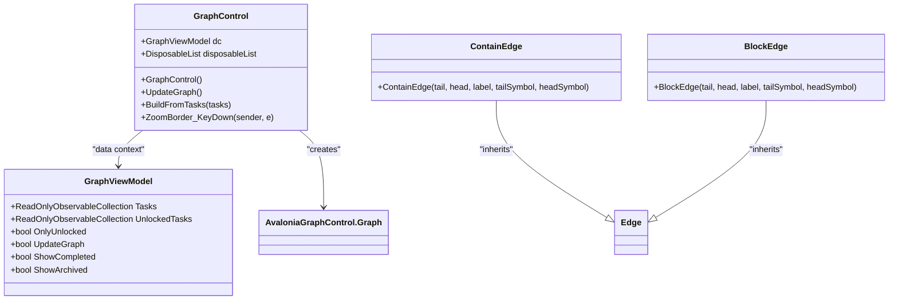
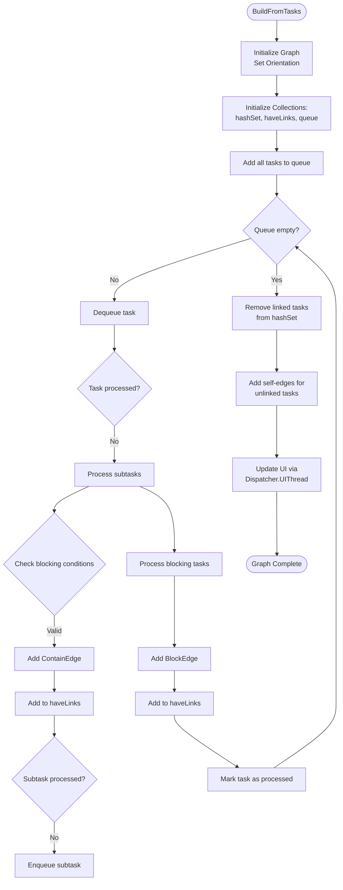
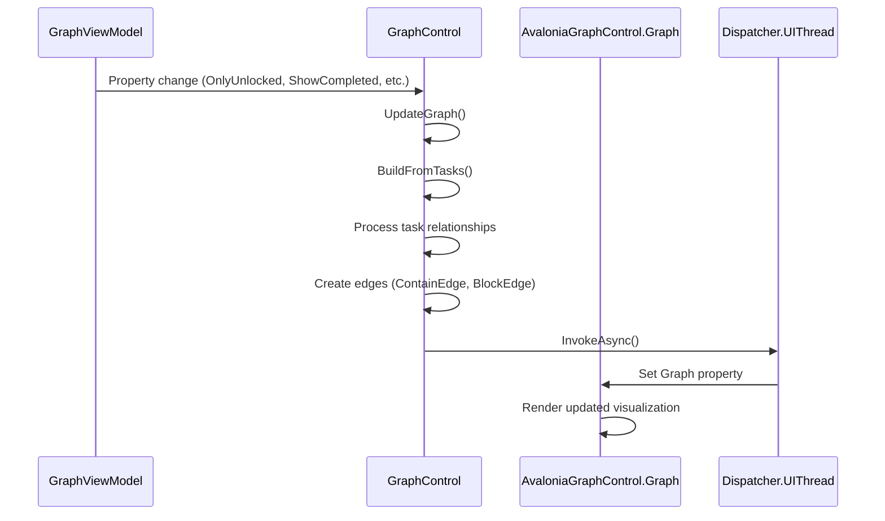
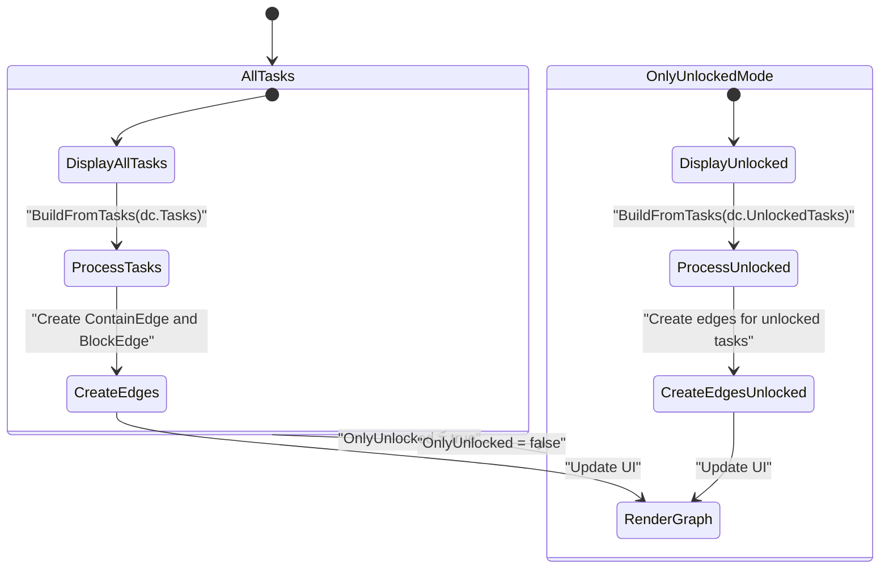
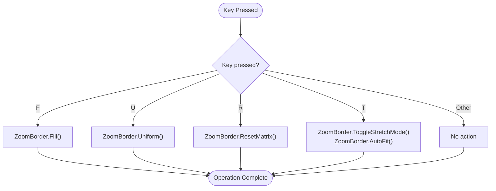
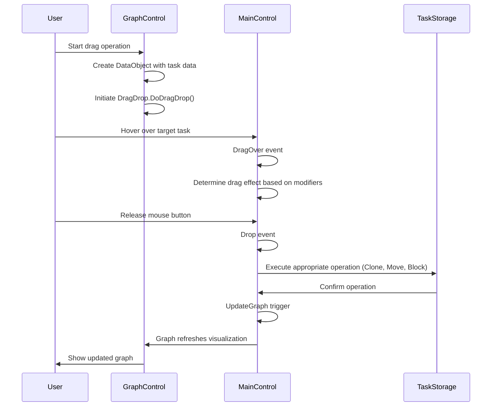

# Roadmap View

<cite>
**Referenced Files in This Document**   
- [GraphControl.axaml.cs](file://src/Unlimotion/Views/GraphControl.axaml.cs)
- [GraphViewModel.cs](file://src/Unlimotion.ViewModel/GraphViewModel.cs)
- [MainControl.axaml.cs](file://src/Unlimotion/Views/MainControl.axaml.cs)
- [TaskItemViewModel.cs](file://src/Unlimotion.ViewModel/TaskItemViewModel.cs)
- [MainWindowViewModel.cs](file://src/Unlimotion.ViewModel/MainWindowViewModel.cs)
- [ContainEdge.cs](file://src/Unlimotion/Views/Graph/ContainEdge.cs)
- [BlockEdge.cs](file://src/Unlimotion/Views/Graph/BlockEdge.cs)
</cite>

## Table of Contents
1. [Introduction](#introduction)
2. [Graph-Based Visualization System](#graph-based-visualization-system)
3. [Graph Construction Process](#graph-construction-process)
4. [Graph Update Mechanism](#graph-update-mechanism)
5. [OnlyUnlocked Toggle Functionality](#onlyunlocked-toggle-functionality)
6. [Keyboard Shortcuts for Graph Manipulation](#keyboard-shortcuts-for-graph-manipulation)
7. [Drag-and-Drop Integration](#drag-and-drop-integration)
8. [Performance and Visual Clarity Considerations](#performance-and-visual-clarity-considerations)
9. [Conclusion](#conclusion)

## Introduction
The Roadmap view in Unlimotion provides a graph-based visualization of task dependencies, enabling users to understand complex relationships between tasks through a visual interface. Built on the AvaloniaGraphControl library, this view transforms hierarchical and blocking relationships between tasks into a navigable graph structure. The system dynamically updates the visualization in response to changes in task states, supports filtering of available tasks, and integrates with the main task list through drag-and-drop operations. This documentation details the implementation and functionality of the Roadmap view, focusing on its core components and user interaction patterns.

**Section sources**
- [GraphControl.axaml.cs](file://src/Unlimotion/Views/GraphControl.axaml.cs#L1-L20)
- [GraphViewModel.cs](file://src/Unlimotion.ViewModel/GraphViewModel.cs#L1-L10)

## Graph-Based Visualization System
The Roadmap view utilizes the AvaloniaGraphControl library to render task relationships as a directed graph. The visualization represents tasks as nodes and their relationships as edges, with different edge types indicating containment versus blocking relationships. The graph is oriented horizontally by default, providing a left-to-right flow that represents the hierarchical structure of tasks.

Two specialized edge types extend the base Edge class from the AvaloniaGraphControl library:
- **ContainEdge**: Represents parent-child relationships where one task contains another
- **BlockEdge**: Represents dependency relationships where one task blocks another

The graph visualization is contained within the GraphControl class, which inherits from Avalonia's UserControl. This control integrates with the application's drag-and-drop system and handles keyboard input for graph manipulation. The visualization is updated through the Dispatcher.UIThread mechanism to ensure UI thread safety when modifying the graph structure.

**Diagram sources**
- [GraphControl.axaml.cs](file://src/Unlimotion/Views/GraphControl.axaml.cs#L1-L228)
- [ContainEdge.cs](file://src/Unlimotion/Views/Graph/ContainEdge.cs#L1-L11)
- [BlockEdge.cs](file://src/Unlimotion/Views/Graph/BlockEdge.cs#L1-L9)
- [GraphViewModel.cs](file://src/Unlimotion.ViewModel/GraphViewModel.cs#L1-L30)

**Section sources**
- [GraphControl.axaml.cs](file://src/Unlimotion/Views/GraphControl.axaml.cs#L1-L228)
- [ContainEdge.cs](file://src/Unlimotion/Views/Graph/ContainEdge.cs#L1-L11)
- [BlockEdge.cs](file://src/Unlimotion/Views/Graph/BlockEdge.cs#L1-L9)

## Graph Construction Process
The graph construction process is implemented in the BuildFromTasks method of the GraphControl class. This method analyzes the Contains and Blocks relationships between tasks to create the appropriate edge types in the graph.

The construction algorithm follows these steps:
1. Initialize a new graph with horizontal orientation
2. Create collections to track processed tasks and those with links
3. Process tasks in a queue to handle hierarchical relationships
4. For each task, analyze its subtasks and blocking relationships
5. Create ContainEdge instances for parent-child relationships
6. Create BlockEdge instances for blocking relationships
7. Handle self-referential edges for tasks without connections
8. Update the visual graph through the UI thread dispatcher

The algorithm specifically checks for conditions where a containing task might create circular blocking relationships, preventing the creation of redundant or conflicting edges. When processing subtasks, it verifies that a subtask doesn't block another subtask or have a blocker that creates a circular dependency.

**Diagram sources**
- [GraphControl.axaml.cs](file://src/Unlimotion/Views/GraphControl.axaml.cs#L75-L209)

**Section sources**
- [GraphControl.axaml.cs](file://src/Unlimotion/Views/GraphControl.axaml.cs#L75-L209)

## Graph Update Mechanism
The Roadmap view implements a reactive update mechanism that automatically refreshes the graph visualization when relevant data changes. The GraphControl subscribes to changes in the GraphViewModel through ReactiveUI's WhenAnyValue method, monitoring several properties that affect the graph display.

The update system listens for changes to the following properties:
- OnlyUnlocked: Toggles between showing all tasks and only unlocked tasks
- ShowArchived: Controls visibility of archived tasks
- ShowCompleted: Controls visibility of completed tasks
- ShowWanted: Controls visibility of wanted tasks
- UnlockedTasks: Collection changes in unlocked tasks
- Tasks: Collection changes in all tasks
- UpdateGraph: Manual trigger for graph updates

When any of these properties change, the UpdateGraph method is called, which in turn invokes BuildFromTasks with the appropriate task collection. The update process is throttled using ReactiveUI's Throttle method with a 100ms delay to prevent excessive updates during rapid changes.

The actual graph update occurs on the UI thread using Dispatcher.UIThread.InvokeAsync, ensuring thread safety when modifying the visual elements. This approach prevents cross-thread exceptions that could occur if the graph were updated directly from background threads or reactive streams.

**Diagram sources**
- [GraphControl.axaml.cs](file://src/Unlimotion/Views/GraphControl.axaml.cs#L25-L74)
- [GraphViewModel.cs](file://src/Unlimotion.ViewModel/GraphViewModel.cs#L1-L30)

**Section sources**
- [GraphControl.axaml.cs](file://src/Unlimotion/Views/GraphControl.axaml.cs#L25-L74)

## OnlyUnlocked Toggle Functionality
The OnlyUnlocked toggle provides a filtering mechanism that switches between displaying all tasks and only showing tasks that are currently available for work. This functionality is implemented through a boolean property in the GraphViewModel class that is bound to the UI toggle control.

When OnlyUnlocked is set to true, the BuildFromTasks method uses the UnlockedTasks collection instead of the full Tasks collection. The UnlockedTasks collection is maintained by the application's task management system and contains only tasks that meet the following criteria:
- Not completed
- Not archived
- Unlocked date has passed or is null
- All parent tasks are completed or unlocked
- Not blocked by incomplete tasks

The toggle state is synchronized with the main application's filtering system through property getters and setters that delegate to the MainWindowViewModel's ShowWanted, ShowCompleted, and ShowArchived properties. This ensures consistent filtering behavior across different views in the application.

The filtering mechanism supports progressive disclosure of task complexity, allowing users to focus on immediate priorities when OnlyUnlocked is enabled, or to examine the complete dependency network when viewing all tasks.

**Diagram sources**
- [GraphControl.axaml.cs](file://src/Unlimotion/Views/GraphControl.axaml.cs#L75-L104)
- [GraphViewModel.cs](file://src/Unlimotion.ViewModel/GraphViewModel.cs#L15-L25)

**Section sources**
- [GraphControl.axaml.cs](file://src/Unlimotion/Views/GraphControl.axaml.cs#L75-L104)
- [GraphViewModel.cs](file://src/Unlimotion.ViewModel/GraphViewModel.cs#L15-L25)

## Keyboard Shortcuts for Graph Manipulation
The Roadmap view supports several keyboard shortcuts for manipulating the graph visualization, accessible through the ZoomBorder component. These shortcuts provide quick access to common viewing operations without requiring menu navigation.

The implemented keyboard shortcuts are:
- **F**: Fill - Adjusts the zoom level to fit the entire graph within the visible area
- **U**: Uniform - Applies uniform scaling to the graph visualization
- **R**: Reset - Resets the transformation matrix to its default state
- **T**: Toggle Stretch Mode - Switches between different stretch modes and applies autofit

These shortcuts are handled by the ZoomBorder_KeyDown event handler in the GraphControl class. When a key press event occurs, the system checks the pressed key against the defined shortcuts and executes the corresponding ZoomBorder method. The ZoomBorder component is part of the Avalonia framework and provides built-in support for these transformation operations.

The keyboard shortcut system enhances user productivity by providing quick access to view manipulation functions, allowing users to rapidly adjust their perspective on complex task networks without interrupting their workflow.

**Diagram sources**
- [GraphControl.axaml.cs](file://src/Unlimotion/Views/GraphControl.axaml.cs#L167-L197)

**Section sources**
- [GraphControl.axaml.cs](file://src/Unlimotion/Views/GraphControl.axaml.cs#L167-L197)

## Drag-and-Drop Integration
The Roadmap view integrates with the main task list through a comprehensive drag-and-drop system that allows users to modify task relationships directly from the graph visualization. This integration is implemented through shared event handlers between the GraphControl and MainControl classes.

The drag-and-drop functionality supports the following operations:
- **No modifier keys**: Attach a dragged task as a subtask of the target task
- **Shift key**: Move the dragged task to the target task
- **Ctrl key**: Make the dragged task block the target task
- **Alt key**: Make the target task block the dragged task
- **Ctrl+Shift keys**: Clone the dragged task to the target as a subtask

The system uses a custom data format ("application/xxx-unlimotion-task-item") to transfer task information during drag operations. When a drag operation begins, the source control packages the task data into a DataObject and initiates the drag session. During the drag-over phase, the system determines the appropriate drag effect based on the keyboard modifiers and the relationship between the tasks.

When a drop occurs, the Drop method processes the operation by calling the appropriate task management method (CloneInto, MoveInto, or BlockBy) and updates the graph visualization by toggling the UpdateGraph property. This ensures that the graph immediately reflects the changes made through drag-and-drop operations.

**Diagram sources**
- [GraphControl.axaml.cs](file://src/Unlimotion/Views/GraphControl.axaml.cs#L209-L228)
- [MainControl.axaml.cs](file://src/Unlimotion/Views/MainControl.axaml.cs#L1-L282)

**Section sources**
- [GraphControl.axaml.cs](file://src/Unlimotion/Views/GraphControl.axaml.cs#L209-L228)
- [MainControl.axaml.cs](file://src/Unlimotion/Views/MainControl.axaml.cs#L1-L282)

## Performance and Visual Clarity Considerations
The Roadmap view faces several performance and visual clarity challenges when dealing with complex dependency networks. These challenges are addressed through various optimization strategies and design considerations.

Performance considerations include:
- **Layout computation**: Complex graphs with many nodes and edges require significant processing for layout calculations. The system mitigates this by using throttling (100ms) on collection change notifications and batching updates.
- **Rendering performance**: Large graphs can impact rendering frame rates. The horizontal orientation and incremental updates help maintain responsiveness.
- **Memory usage**: Maintaining multiple collections (hashSet, haveLinks, queue) during graph construction consumes memory, but these are temporary and disposed after use.

Visual clarity challenges include:
- **Edge crossing**: In dense graphs, edges may cross, making relationships difficult to follow. The horizontal layout minimizes this issue.
- **Node overlap**: With many tasks, nodes may overlap. The ZoomBorder controls allow users to adjust the view.
- **Information density**: Too many relationships can overwhelm users. The OnlyUnlocked filter helps reduce complexity.

The system addresses these issues through:
1. Reactive throttling to prevent excessive updates
2. Horizontal graph orientation for better readability
3. Filter controls to manage information density
4. Zoom and pan controls for navigation
5. Distinct visual styles for different edge types

For extremely complex networks, users are advised to use the OnlyUnlocked filter to focus on immediate priorities, or to navigate the hierarchy through the main task list for more detailed examination of specific task branches.

**Section sources**
- [GraphControl.axaml.cs](file://src/Unlimotion/Views/GraphControl.axaml.cs#L75-L209)
- [MainControl.axaml.cs](file://src/Unlimotion/Views/MainControl.axaml.cs#L1-L282)

## Conclusion
The Roadmap view in Unlimotion provides a powerful graph-based visualization of task dependencies, leveraging the AvaloniaGraphControl library to create an interactive representation of task relationships. The system dynamically constructs the graph by analyzing Contains and Blocks relationships between tasks, creating specialized ContainEdge and BlockEdge instances to represent different types of dependencies. Through reactive programming patterns, the view automatically updates in response to changes in task states, with updates safely dispatched to the UI thread.

The OnlyUnlocked toggle functionality allows users to switch between viewing all tasks and focusing only on available tasks, supporting different workflow patterns. Keyboard shortcuts provide quick access to view manipulation functions, while drag-and-drop integration enables direct modification of task relationships from the graph interface. Despite challenges with performance and visual clarity in complex networks, the system employs various strategies to maintain usability, including throttling, filtering, and navigation controls. This comprehensive approach makes the Roadmap view a valuable tool for understanding and managing complex task dependencies in Unlimotion.